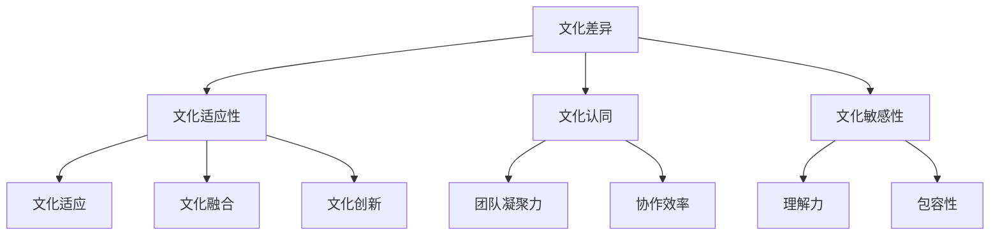

                 

### 引言

随着全球化的不断深入，企业面临的市场环境变得越来越复杂和多元。跨文化团队整合在这一背景下显得尤为重要。全球化不仅带来了新的商业机会，也带来了文化多样性的挑战。企业为了在全球化竞争中保持优势，必须有效地管理跨文化团队，以确保团队成员之间的有效沟通、合作与协作。

《跨文化团队整合：全球化背景下的管理》一书旨在为企业管理者、团队领导和人力资源专业人士提供全面的理论和实践指导。本书的主要目标是帮助读者理解跨文化团队整合的核心概念，掌握分析文化差异的方法，提升跨文化沟通技巧，培养跨文化领导力，并最终实现跨文化团队的整合与高效运作。

首先，本书将在引言部分详细阐述跨文化团队整合的重要性。我们将探讨全球化背景下的企业竞争态势，分析跨文化团队的挑战与机遇，并简要介绍本书的结构和主要内容。

接下来，本书将分为五个主要部分展开：

1. **核心概念与联系**：这部分将介绍跨文化管理的基本理论，包括文化差异、文化适应性等核心概念，并通过Mermaid流程图展示这些概念之间的关系。

2. **文化差异分析**：我们将深入探讨文化差异的类型与影响，并通过文化地图和比较分析来识别和理解不同文化间的差异。

3. **跨文化沟通策略**：这部分将重点讨论跨文化沟通的原则与技巧，包括语言沟通和非语言沟通，并分析成功与失败的跨文化沟通案例。

4. **领导力与跨文化管理**：我们将探讨如何培养跨文化领导力，如何在实践中应用跨文化管理策略，以及跨文化领导力的培养策略。

5. **项目管理与跨文化整合**：我们将介绍跨文化项目管理的挑战与机遇，跨文化项目整合策略，并分析跨文化项目管理的成功与失败案例。

最后，本书将通过案例研究和经验分享，提供实际的跨文化团队整合案例，并进行深入分析，以帮助读者更好地理解和应用所学知识。

总之，本书的目标是帮助读者在全球化背景下，有效地管理跨文化团队，实现团队的整合与高效运作。通过本书的学习，读者将能够应对全球化带来的挑战，抓住机遇，提升企业的竞争力。

### 关键词

- 跨文化团队整合
- 全球化管理
- 文化差异
- 沟通策略
- 领导力
- 项目管理

### 摘要

《跨文化团队整合：全球化背景下的管理》一书旨在为企业管理者、团队领导和人力资源专业人士提供关于跨文化团队整合的全面指导。本书首先阐述了全球化背景下跨文化团队整合的重要性，随后详细介绍了跨文化管理的基本理论、文化差异的类型与影响、跨文化沟通策略、领导力与跨文化管理以及跨文化项目管理的实践方法。通过理论讲解、案例分析、经验分享和实际操作指导，本书帮助读者理解和应对全球化带来的文化多样性挑战，提升跨文化团队的整合与绩效，最终实现企业在全球化竞争中的优势。

### 1.1 跨文化团队整合的重要性

在全球化的大背景下，企业越来越依赖于跨文化团队的协作与整合。这不仅是因为全球化带来了更广阔的市场机会，还因为文化多样性本身就是一种竞争优势。跨文化团队整合的重要性主要体现在以下几个方面：

首先，全球化背景下的企业竞争更加激烈。在全球化市场中，企业不仅需要具备强大的技术能力和市场洞察力，还需要能够快速适应不同文化的市场环境。跨文化团队的整合使得企业能够充分利用不同文化背景下的资源和优势，从而在竞争中占据有利地位。

其次，跨文化团队的整合有助于提升企业的创新能力。不同文化背景的团队成员往往拥有不同的思维方式和解决问题的方法，这种多样性在创新过程中起到了关键作用。通过有效的整合，跨文化团队能够激发出更多的创意和解决方案，从而推动企业的持续创新。

然而，跨文化团队也面临着诸多挑战。文化差异可能导致沟通障碍和误解，影响团队的协作效率和成员的满意度。此外，文化冲突和冲突管理也是跨文化团队整合中必须面对的难题。如何克服这些挑战，实现跨文化团队的高效运作，是企业管理者需要深入思考和解决的问题。

为了应对这些挑战，有效的跨文化团队整合策略至关重要。首先，企业需要建立明确的文化认同，确保团队成员对共同目标和价值观有清晰的认识。其次，企业应重视文化敏感性和适应性培训，提高团队成员对不同文化的理解和尊重。此外，有效的沟通策略和领导力也是实现跨文化团队整合的关键因素。通过这些策略，企业可以减少文化差异带来的负面影响，增强团队的凝聚力和协作能力。

总之，跨文化团队整合在全球化背景下具有重要意义。通过有效的整合，企业不仅能够克服文化差异带来的挑战，还能充分利用文化多样性带来的机遇，实现持续的创新和竞争优势。

### 1.2 全书结构概览

《跨文化团队整合：全球化背景下的管理》全书结构分为五个主要部分，每一部分都有其独特的主题和目标，旨在帮助读者全面了解和掌握跨文化团队整合的各个方面。

**第1部分：核心概念与联系**

这部分的核心是介绍跨文化管理的基本理论和概念。通过详细阐述文化差异、文化适应性、文化认同等关键概念，我们建立了一个跨文化管理的理论框架。这部分还将使用Mermaid流程图展示这些概念之间的关系，帮助读者更好地理解跨文化管理的整体结构和逻辑。

**第2部分：文化差异分析**

在这一部分，我们将深入探讨文化差异的类型和影响。通过分析不同文化在价值观、沟通方式、工作习惯等方面的差异，帮助读者识别和应对这些差异。这部分还将介绍文化地图和比较分析方法，为跨文化团队的建设和融合提供理论基础。

**第3部分：跨文化沟通策略**

跨文化沟通是跨文化团队整合的关键。这部分将详细讨论跨文化沟通的原则与技巧，包括语言沟通和非语言沟通。通过分析成功和失败的跨文化沟通案例，读者将了解如何在实际工作中应用这些沟通策略，提高跨文化团队的协作效率和沟通质量。

**第4部分：领导力与跨文化管理**

领导力在跨文化团队中起到至关重要的作用。这部分将探讨如何培养跨文化领导力，包括领导力模型与跨文化适应性。我们将提供实际的管理策略和案例，帮助读者理解和应用跨文化领导力，提升团队的凝聚力和执行力。

**第5部分：项目管理与跨文化整合**

跨文化团队在项目管理中面临诸多挑战。这部分将介绍跨文化项目管理的核心要素和最佳实践，帮助读者理解和应对这些挑战。通过项目实战案例的分析，读者将学习到如何在实践中整合跨文化因素，提高项目成功的概率。

**总结**

通过这五个部分的内容，本书旨在为企业管理者、团队领导和人力资源专业人士提供全方位的指导，帮助他们有效地管理跨文化团队，实现团队的高效运作和持续创新。每个部分既有理论讲解，又有实际案例，确保读者能够学以致用，应对全球化带来的各种挑战。

### 第1部分 核心概念与联系

跨文化管理作为一种应对全球化挑战的重要策略，其理论基础和核心概念是理解和实践的基础。本部分将深入探讨跨文化管理的基本理论，包括文化差异、文化适应性和文化认同等核心概念，并通过Mermaid流程图展示这些概念之间的关系，帮助读者建立全面的理论框架。

#### 2.1.1 跨文化管理理论概述

跨文化管理理论起源于20世纪60年代，当时国际商业活动逐渐增多，企业开始意识到不同文化背景的员工和管理方式对业务运作的影响。跨文化管理理论主要包括以下几个核心概念：

1. **文化差异**：文化差异是指不同文化群体在价值观、行为规范、沟通方式等方面的差异。文化差异是跨文化管理的核心问题，因为它直接影响团队的协作效率和沟通质量。

2. **文化适应性**：文化适应性是指个体或组织在不同文化环境中调整自己的行为和思维方式，以适应新环境的过程。文化适应性包括文化适应、文化融合和文化创新等多个层次。

3. **文化认同**：文化认同是指团队成员对企业文化和价值观的认可和接受程度。文化认同是团队凝聚力和协作力的基础，对于跨文化团队的整合至关重要。

4. **文化敏感性**：文化敏感性是指对其他文化的理解和尊重程度，包括对文化差异的敏感性和对文化多样性的包容性。文化敏感性高的个体或组织能够更好地适应和应对跨文化环境。

#### 2.1.2 跨文化模型与框架

跨文化管理理论的发展过程中，许多学者提出了不同的模型和框架，以帮助企业和个体更好地理解和应对跨文化挑战。以下是一些主要的跨文化管理模型和框架：

1. **霍尔的文化维度理论**：霍尔提出的文化维度理论包括权力距离、个体主义与集体主义、男性主义与女性主义、不确定性规避等四个维度。这些维度帮助企业和个体识别和应对不同文化背景的员工和合作伙伴。

2. **格里芬的文化适应模型**：格里芬提出的文化适应模型分为四个阶段：初始阶段、碰撞阶段、融合阶段和成熟阶段。每个阶段都有不同的心理和行为特征，企业可以通过这些特征来评估和指导员工的跨文化适应过程。

3. **Trompenaars的七维度模型**：Trompenaars和Hampden-Turner提出的七维度模型包括个体主义与集体主义、长期与短期导向、具体与抽象思维、内在与外在控制、避免冲突与直面冲突、直接与间接沟通、地位与成就等七个维度。这些维度为跨文化沟通和管理提供了具体的指导。

#### 2.1.3 Mermaid流程图

为了更好地展示跨文化管理理论中各个核心概念之间的关系，我们可以使用Mermaid流程图来直观地表示。以下是一个简化的Mermaid流程图示例：



在这个流程图中，文化差异作为核心起点，通过文化适应、文化认同和文化敏感性这三个过程，最终实现文化适应和文化创新。文化认同和文化敏感性分别对团队凝聚力和协作效率产生积极影响，而文化适应性则贯穿于整个跨文化管理过程，是连接各个核心概念的关键环节。

通过这个Mermaid流程图，读者可以清晰地看到跨文化管理理论中各个核心概念之间的逻辑关系，更好地理解和应用这些理论来指导实际工作。

### 第2部分 跨文化团队整合的关键要素

跨文化团队整合的成功离不开几个关键要素，这些要素包括文化差异的类型与影响、跨文化团队建设与融合，以及跨文化冲突管理。本部分将深入探讨这些关键要素，并使用Python代码示例来说明跨文化团队整合的具体实现。

#### 2.2.1 文化差异的类型与影响

文化差异可以分为多个层次，包括语言、价值观、社会规范、工作习惯等。以下是一些常见的文化差异类型及其影响：

1. **语言差异**：语言不仅是沟通的工具，也是文化的重要载体。不同语言的使用会导致误解和沟通障碍，影响团队的协作效率。

2. **价值观差异**：价值观是文化的核心，包括个人主义与集体主义、权力距离、时间观念等。不同价值观的冲突可能导致团队成员之间的矛盾和工作中的不一致。

3. **社会规范差异**：社会规范是文化的一部分，不同文化背景下的社会规范可能截然不同。这些差异可能影响团队成员的礼仪、行为准则和工作方式。

4. **工作习惯差异**：不同文化背景下的工作习惯，如工作节奏、决策方式、时间管理等，也可能导致团队协作中的冲突和效率低下。

以下是一个简单的Python代码示例，用于展示如何识别和分类文化差异：

```python
# 文化差异分类示例
culture_diffs = {
    "语言": ["语言障碍", "沟通困难"],
    "价值观": ["个人主义 vs 集体主义", "权力距离"],
    "社会规范": ["礼仪习惯", "行为准则"],
    "工作习惯": ["工作节奏", "决策方式"]
}

# 输出文化差异类型
for category, impacts in culture_diffs.items():
    print(f"{category}差异：")
    for impact in impacts:
        print(f" - {impact}")
```

输出结果：

```
语言差异：
 - 语言障碍
 - 沟通困难
价值观差异：
 - 个人主义 vs 集体主义
 - 权力距离
社会规范差异：
 - 礼仪习惯
 - 行为准则
工作习惯差异：
 - 工作节奏
 - 决策方式
```

通过这个示例，我们可以清晰地看到不同文化差异类型及其可能带来的影响。

#### 2.2.2 跨文化团队建设与融合

跨文化团队建设与融合的关键在于建立共同的目标、价值观和沟通机制。以下是一些关键步骤和策略：

1. **明确共同目标**：通过明确共同的目标，可以帮助团队成员理解跨文化团队整合的重要性，并激发他们的工作热情。

2. **建立多元文化价值观**：在团队中推广多元文化价值观，鼓励团队成员尊重和包容不同文化背景，提高团队的凝聚力。

3. **培养跨文化沟通能力**：通过培训和工作坊，提高团队成员的跨文化沟通技巧，减少误解和冲突。

4. **促进团队融合**：通过团队建设活动，如文化交流、协作任务等，促进团队成员之间的融合，建立信任和友谊。

以下是一个简单的Python代码示例，用于描述跨文化团队建设的过程：

```python
# 跨文化团队建设过程
team_building_steps = [
    "明确共同目标",
    "建立多元文化价值观",
    "培养跨文化沟通能力",
    "促进团队融合"
]

# 输出团队建设步骤
for step in team_building_steps:
    print(f"{step}")
```

输出结果：

```
明确共同目标
建立多元文化价值观
培养跨文化沟通能力
促进团队融合
```

通过这个示例，我们可以清晰地看到跨文化团队建设的主要步骤。

#### 2.2.3 跨文化冲突管理

跨文化冲突管理是跨文化团队整合的重要组成部分。有效的冲突管理可以减少误解和矛盾，提高团队协作效率。以下是一些冲突管理策略：

1. **积极倾听与沟通**：在冲突发生时，积极倾听对方的观点和感受，避免误解和情绪化。

2. **识别冲突原因**：通过分析冲突的原因，找到解决问题的方法。

3. **寻求共同点**：在冲突双方中寻找共同点，达成共识。

4. **建立冲突解决机制**：建立明确的冲突解决流程和机制，确保冲突能够及时、有效地解决。

以下是一个简单的Python代码示例，用于描述跨文化冲突管理的策略：

```python
# 冲突管理策略
conflict_management_strategies = [
    "积极倾听与沟通",
    "识别冲突原因",
    "寻求共同点",
    "建立冲突解决机制"
]

# 输出冲突管理策略
for strategy in conflict_management_strategies:
    print(f"{strategy}")
```

输出结果：

```
积极倾听与沟通
识别冲突原因
寻求共同点
建立冲突解决机制
```

通过这个示例，我们可以清晰地看到跨文化冲突管理的主要策略。

总之，跨文化团队整合的关键要素包括文化差异的类型与影响、跨文化团队建设与融合，以及跨文化冲突管理。通过理解这些关键要素，并使用Python代码示例进行具体实现，我们可以更好地实现跨文化团队的整合，提高团队协作效率。

### 第3部分 文化差异分析

文化差异是跨文化团队整合中必须面对的核心问题。不同文化背景的团队成员在价值观、行为规范、沟通方式等方面存在显著差异，这些差异不仅会影响团队的工作效率，还可能导致冲突和误解。因此，深入分析文化差异的类型与影响，是理解跨文化团队运作的基础。

#### 3.1.1 文化差异的类型

文化差异可以分为多个层次和维度，以下是一些主要的文化差异类型：

1. **价值观差异**：价值观是文化的基础，包括个人主义与集体主义、权力距离、时间观念等。个人主义文化强调个人成就和自由，而集体主义文化则强调团队协作和社会责任。权力距离指社会内部权力分布的均匀程度，权力距离高的文化中，权力和地位差异显著，而下级对上级的依赖性强。时间观念方面，一些文化重视长远规划，而另一些文化则更注重即时的行动和结果。

2. **沟通方式差异**：不同文化背景的沟通方式存在显著差异。例如，一些文化倾向于直接、明确的沟通，而另一些文化则更注重间接、委婉的表达。此外，语言的使用、非语言沟通（如肢体语言、面部表情）等也是文化差异的重要方面。

3. **工作习惯差异**：不同文化背景下的工作习惯也有所不同，包括工作节奏、决策方式、时间管理等方面。例如，一些文化倾向于快速决策和行动，而另一些文化则更注重细致的规划和讨论。

4. **社会规范差异**：社会规范是文化的重要组成部分，包括礼仪、行为准则等。不同文化背景下的社会规范可能截然不同，例如在礼仪方面，一些文化强调尊重和礼貌，而另一些文化则更注重实用和效率。

#### 3.1.2 文化差异的影响

文化差异对跨文化团队的影响主要体现在以下几个方面：

1. **沟通障碍**：文化差异可能导致团队成员在沟通中的误解和障碍。例如，不同文化背景的团队成员可能在语言理解、表达方式上存在差异，从而导致信息传递不准确。

2. **工作效率降低**：文化差异可能导致团队成员在工作习惯、时间观念等方面的不一致，影响团队的整体工作效率。例如，一些团队成员可能习惯于快速决策和行动，而另一些团队成员则可能需要更多的时间和讨论。

3. **冲突与矛盾**：文化差异可能导致团队成员之间的冲突和矛盾。例如，在价值观方面，不同文化背景的团队成员可能在个人主义与集体主义、权力距离等方面存在根本性的差异，从而导致团队内部的不和谐。

4. **团队凝聚力下降**：文化差异可能导致团队成员之间的信任和合作减少，影响团队的凝聚力。例如，一些团队成员可能感到在团队中受到了歧视或不被尊重，从而导致团队凝聚力的下降。

#### 3.1.3 文化地图与比较分析

为了更好地理解文化差异，可以使用文化地图和比较分析方法。文化地图可以帮助我们识别不同文化之间的异同，而比较分析则可以帮助我们深入理解这些差异背后的原因。

1. **文化地图**：文化地图是一种可视化工具，用于展示不同文化之间的差异。常见的文化地图包括霍尔的权力距离文化地图、Trompenaars的七维度文化地图等。通过文化地图，我们可以直观地了解不同文化在价值观、沟通方式、工作习惯等方面的差异。

2. **比较分析**：比较分析是通过对不同文化背景下的行为、价值观、规范等进行对比，来识别和解释文化差异。例如，我们可以比较不同文化背景下的决策方式、沟通习惯、时间管理等方面的异同，从而更好地理解文化差异的影响。

以下是一个简单的Python代码示例，用于生成一个简单的文化地图：

```python
# 文化地图示例
culture_map = {
    "个人主义与集体主义": ["个人主义文化", "集体主义文化"],
    "权力距离": ["高权力距离文化", "低权力距离文化"],
    "时间观念": ["时间导向文化", "任务导向文化"]
}

# 输出文化地图
for dimension, cultures in culture_map.items():
    print(f"{dimension}: {', '.join(cultures)}")
```

输出结果：

```
个人主义与集体主义: 个人主义文化, 集体主义文化
权力距离: 高权力距离文化, 低权力距离文化
时间观念: 时间导向文化, 任务导向文化
```

通过这个示例，我们可以直观地了解不同文化地图中的文化差异。

总之，文化差异是跨文化团队整合中的核心问题。通过分析文化差异的类型和影响，使用文化地图和比较分析方法，我们可以更好地理解和应对跨文化差异，促进跨文化团队的整合和协作。

### 第3.2部分 跨文化沟通策略

跨文化沟通策略在跨文化团队整合中起着至关重要的作用。有效的跨文化沟通不仅能够减少误解和冲突，还能提高团队的协作效率和整体绩效。本部分将详细探讨跨文化沟通的原则与技巧，以及如何通过语言沟通和非语言沟通来克服文化差异，提高跨文化沟通的效果。

#### 3.2.1 跨文化沟通的原则

跨文化沟通的原则主要包括尊重、包容、透明和主动。以下是对这些原则的详细解释：

1. **尊重**：尊重是跨文化沟通的基础。在跨文化环境中，尊重对方的语言、文化习俗和价值观是建立良好沟通关系的关键。这包括尊重不同的沟通方式、礼仪习惯和决策风格。

2. **包容**：包容意味着接受和尊重不同的观点和行为方式。在跨文化团队中，团队成员来自不同的文化背景，他们的沟通方式和行为习惯可能截然不同。包容性的沟通能够减少误解和偏见，增强团队的凝聚力。

3. **透明**：透明沟通是指在交流信息时保持清晰和准确。跨文化团队中的沟通需要更加透明，以避免误解和混淆。这包括明确表达意见、避免含糊其辞，以及及时反馈和确认。

4. **主动**：主动沟通是指主动发起和参与沟通，包括询问、提供反馈和寻求理解。在跨文化环境中，主动沟通有助于建立信任和合作关系，促进团队的协作。

以下是一个简单的Python代码示例，用于展示如何通过代码实现尊重、包容、透明和主动的跨文化沟通：

```python
# 跨文化沟通原则示例
communication_principles = ["尊重", "包容", "透明", "主动"]

# 输出沟通原则
for principle in communication_principles:
    print(f"{principle}：在跨文化沟通中至关重要。")
```

输出结果：

```
尊重：在跨文化沟通中至关重要。
包容：在跨文化沟通中至关重要。
透明：在跨文化沟通中至关重要。
主动：在跨文化沟通中至关重要。
```

#### 3.2.2 语言沟通的技巧

语言沟通是跨文化沟通的重要组成部分。以下是一些语言沟通的技巧，帮助跨文化团队成员更好地理解和表达：

1. **明确表达**：在跨文化沟通中，明确表达是非常重要的。避免使用模糊或含糊不清的语言，确保信息传递准确无误。

2. **使用简单语言**：使用简单、直接的词汇和句子结构，避免使用过于复杂或技术性的语言，这有助于提高沟通的清晰度。

3. **确认理解**：在交流信息后，确认对方是否理解了所传达的信息。可以通过提问或反馈来验证，确保沟通的准确性。

以下是一个简单的Python代码示例，用于展示如何通过代码实现明确表达和使用简单语言：

```python
# 语言沟通技巧示例
def communicate_clearly(message):
    """
    清晰表达信息的函数。
    """
    print(f"明确表达：{message}")

# 使用函数进行沟通
communicate_clearly("我们需要在下周完成这个项目。")
```

输出结果：

```
明确表达：我们需要在下周完成这个项目。
```

#### 3.2.3 非语言沟通的技巧

非语言沟通包括肢体语言、面部表情、语调等，这些因素在跨文化沟通中同样重要。以下是一些非语言沟通的技巧：

1. **观察和倾听**：通过观察对方的肢体语言和面部表情，可以更好地理解对方的情感和意图。倾听不仅是听到对方说的话，还包括理解对方的语气、语调等。

2. **适应对方的沟通风格**：了解并适应对方的沟通风格，可以帮助减少误解和冲突。例如，如果对方喜欢直接表达，你也应该尽量直接和明确地沟通。

3. **避免文化偏见**：不同文化背景下的非语言沟通方式可能有所不同。避免将对方的非语言行为解读为负面或偏见，尽量从对方的文化背景出发，理解其行为。

以下是一个简单的Python代码示例，用于展示如何通过代码实现观察和倾听：

```python
# 非语言沟通技巧示例
def observe_and_listen():
    """
    观察和倾听的函数。
    """
    print("观察对方的肢体语言和面部表情，倾听对方的语气和语调。")

# 使用函数进行观察和倾听
observe_and_listen()
```

输出结果：

```
观察对方的肢体语言和面部表情，倾听对方的语气和语调。
```

#### 3.2.4 跨文化沟通案例解析

为了更好地理解跨文化沟通的策略，以下是一个实际的跨文化沟通案例：

**案例**：一家跨国公司的一个跨文化团队，团队成员来自中国、美国和德国。项目需要在一个多语言环境中进行沟通，团队成员需要在不同的时间区进行协调。

**解决方案**：

1. **明确目标**：首先明确项目的目标和时间表，确保所有团队成员对任务和时间要求有清晰的理解。

2. **沟通计划**：制定详细的沟通计划，包括会议时间、使用的工作语言、沟通渠道等。

3. **使用翻译**：在重要的会议或讨论中，使用专业翻译，确保信息的准确传达。

4. **文化敏感性培训**：对团队成员进行文化敏感性培训，提高他们对不同文化背景的理解和尊重。

5. **定期反馈**：定期进行沟通效果评估，收集团队成员的反馈，及时调整沟通策略。

通过这个案例，我们可以看到跨文化沟通策略在实际工作中的应用，包括明确目标、沟通计划、使用翻译、文化敏感性培训和定期反馈等。这些策略有助于提高跨文化团队的整体沟通效果，减少误解和冲突。

总之，跨文化沟通策略在跨文化团队整合中至关重要。通过尊重、包容、透明和主动的沟通原则，以及语言沟通和非语言沟通的技巧，我们可以有效地克服文化差异，提高跨文化团队的协作效率和整体绩效。

### 第4部分 领导力与跨文化管理

在跨文化团队中，领导力扮演着至关重要的角色。一个成功的跨文化领导者不仅需要具备传统的领导能力，还需要具备对跨文化环境的深刻理解和敏感性。本部分将深入探讨跨文化领导力的概念、培养策略以及实际操作中的关键因素。

#### 4.1.1 领导力模型与跨文化适应性

跨文化领导力模型是理解和实践跨文化领导的基础。以下是一些常见的领导力模型及其在跨文化环境中的应用：

1. **情境领导模型**：约翰·惠特默提出的情境领导模型认为，领导者的风格应该根据团队成员的成熟度进行调整。在跨文化团队中，领导者需要根据团队成员的不同文化背景和适应性水平，灵活调整领导风格，以实现最佳效果。

2. **赫赛-布兰查德领导模型**：赫赛-布兰查德领导模型强调领导者与团队成员之间的互动和沟通。在跨文化团队中，领导者需要更多地关注团队成员的文化背景和沟通习惯，建立有效的沟通机制，促进团队的协作和整合。

3. **变革型领导模型**：变革型领导强调领导者通过激励和鼓舞团队成员，推动团队实现变革和创新。在跨文化团队中，领导者需要具备更强的跨文化适应性和文化敏感性，能够激励不同文化背景的团队成员共同面对挑战，实现团队的转型和提升。

#### 4.1.2 跨文化领导力的培养策略

培养跨文化领导力需要系统的培训和持续的实践。以下是一些关键策略：

1. **文化知识培训**：跨文化领导力首先需要对不同文化有深刻的理解和认识。企业可以通过文化知识培训，提高领导者的文化素养和跨文化沟通能力。

2. **跨文化体验**：通过实际的跨文化工作或生活体验，领导者可以更深入地了解不同文化的行为模式和价值观，增强跨文化适应能力。

3. **角色扮演和模拟训练**：通过角色扮演和模拟训练，领导者可以在安全的环境中练习跨文化沟通和冲突管理技巧，提高应对实际跨文化挑战的能力。

4. **反思与总结**：领导者需要定期进行反思和总结，从实践中学习经验教训，不断提升自己的跨文化领导力。

以下是一个简单的Python代码示例，用于描述如何通过代码实现跨文化领导力的培养策略：

```python
# 跨文化领导力培养策略示例
def culture_knowledge_training():
    print("进行文化知识培训，提高领导者的文化素养和跨文化沟通能力。")

def cross-cultural_experience():
    print("参与跨文化工作或生活体验，增强跨文化适应能力。")

def role_playing_and_simulation_training():
    print("通过角色扮演和模拟训练，提高领导者的跨文化沟通和冲突管理技巧。")

def reflection_and_summary():
    print("定期进行反思和总结，从实践中学习经验教训。")

# 调用函数实现培养策略
culture_knowledge_training()
cross-cultural_experience()
role_playing_and_simulation_training()
reflection_and_summary()
```

输出结果：

```
进行文化知识培训，提高领导者的文化素养和跨文化沟通能力。
参与跨文化工作或生活体验，增强跨文化适应能力。
通过角色扮演和模拟训练，提高领导者的跨文化沟通和冲突管理技巧。
定期进行反思和总结，从实践中学习经验教训。
```

#### 4.1.3 跨文化领导力的关键因素

在跨文化领导中，以下关键因素至关重要：

1. **文化敏感性**：领导者需要具备对文化差异的敏感性和理解力，能够尊重和包容团队成员的不同文化背景。

2. **沟通能力**：跨文化领导需要高效的沟通技巧，包括语言沟通和非语言沟通，能够清晰、准确地传达信息和意图。

3. **冲突管理**：跨文化团队中可能存在不同文化之间的冲突，领导者需要具备有效的冲突管理能力，及时解决冲突，保持团队的稳定和和谐。

4. **团队建设**：领导者需要注重团队建设，通过建立共同的目标和价值观，增强团队的凝聚力和协作力。

以下是一个简单的Python代码示例，用于描述跨文化领导力的关键因素：

```python
# 跨文化领导力关键因素示例
def cultural_sensitivity():
    print("尊重和包容团队成员的不同文化背景。")

def communication_skills():
    print("具备高效的沟通技巧，包括语言沟通和非语言沟通。")

def conflict_management():
    print("具备有效的冲突管理能力，及时解决冲突。")

def team_building():
    print("注重团队建设，建立共同的目标和价值观。")

# 调用函数实现关键因素
cultural_sensitivity()
communication_skills()
conflict_management()
team_building()
```

输出结果：

```
尊重和包容团队成员的不同文化背景。
具备高效的沟通技巧，包括语言沟通和非语言沟通。
具备有效的冲突管理能力，及时解决冲突。
注重团队建设，建立共同的目标和价值观。
```

总之，跨文化领导力是跨文化团队整合的核心。通过理解领导力模型、培养跨文化领导力以及关注关键因素，领导者可以更好地应对跨文化挑战，实现跨文化团队的高效运作。

### 第5部分 项目管理与跨文化整合

在全球化背景下，项目管理面临着越来越多的跨文化挑战。跨文化整合不仅是项目成功的保障，也是提高团队协作效率和项目绩效的关键。本部分将深入探讨跨文化项目管理中的核心要素、最佳实践，并分析跨文化项目整合的策略。

#### 5.1.1 跨文化项目管理的挑战与机遇

跨文化项目管理涉及多个方面的挑战和机遇：

1. **挑战**：
   - **沟通障碍**：不同文化背景的团队成员可能在语言、沟通风格、表达方式上存在差异，导致信息传递不准确。
   - **文化冲突**：文化差异可能导致团队成员在工作方式、价值观、时间观念等方面的冲突，影响项目进展。
   - **时间管理**：不同文化的项目进度安排和节奏可能不一致，导致项目延期或效率降低。
   - **团队凝聚力**：文化差异可能导致团队成员之间的信任和合作减少，影响团队的凝聚力和合作效率。

2. **机遇**：
   - **多样性**：跨文化团队可以带来多样化的视角和解决方案，有助于项目的创新和改进。
   - **市场扩展**：通过有效的跨文化整合，项目团队能够更好地适应和满足不同市场需求，开拓新的市场机会。
   - **人力资源**：全球范围内的招聘可以吸引更多优秀的专业人才，提高团队的技能水平和整体绩效。

#### 5.1.2 跨文化项目管理的核心要素

为了有效管理跨文化项目，以下核心要素至关重要：

1. **文化敏感性**：项目管理者需要具备对文化差异的敏感性，理解并尊重团队成员的不同文化背景和价值观，建立相互尊重的工作环境。

2. **沟通策略**：制定明确的沟通策略和计划，确保信息的准确传递和有效沟通。包括使用多语言沟通工具、设置明确的沟通渠道和频率，以及定期进行沟通效果评估。

3. **时间管理**：制定灵活的时间管理计划，考虑不同文化的项目进度安排和时间观念，确保项目按时完成。

4. **团队建设**：注重团队建设，通过文化敏感性培训、团队活动和文化交流，增强团队成员之间的信任和合作。

5. **冲突管理**：建立有效的冲突解决机制，及时识别和解决文化差异导致的冲突，保持项目的稳定和顺利进行。

以下是一个简单的Python代码示例，用于展示如何通过代码实现跨文化项目管理的核心要素：

```python
# 跨文化项目管理核心要素示例
def cultural_sensitivity():
    print("理解并尊重团队成员的不同文化背景和价值观。")

def communication_strategy():
    print("制定明确的沟通策略和计划，确保信息的准确传递和有效沟通。")

def time_management():
    print("制定灵活的时间管理计划，考虑不同文化的项目进度安排和时间观念。")

def team_building():
    print("注重团队建设，通过文化敏感性培训、团队活动和文化交流，增强团队成员之间的信任和合作。")

def conflict_management():
    print("建立有效的冲突解决机制，及时识别和解决文化差异导致的冲突。")

# 调用函数实现核心要素
cultural_sensitivity()
communication_strategy()
time_management()
team_building()
conflict_management()
```

输出结果：

```
理解并尊重团队成员的不同文化背景和价值观。
制定明确的沟通策略和计划，确保信息的准确传递和有效沟通。
制定灵活的时间管理计划，考虑不同文化的项目进度安排和时间观念。
注重团队建设，通过文化敏感性培训、团队活动和文化交流，增强团队成员之间的信任和合作。
建立有效的冲突解决机制，及时识别和解决文化差异导致的冲突。
```

#### 5.1.3 跨文化项目整合策略

为了实现跨文化项目的高效整合，以下策略可以提供有效的指导：

1. **明确项目目标**：在项目启动阶段，明确项目的目标和预期成果，确保所有团队成员对项目目标有共同的理解和认同。

2. **文化适应性培训**：对团队成员进行文化适应性培训，提高他们对不同文化的理解和尊重，增强跨文化协作能力。

3. **建立共享价值观**：通过共同制定和宣传团队的价值观，建立团队成员之间的共同认同和信任，减少文化冲突。

4. **多渠道沟通**：利用多种沟通渠道，如视频会议、即时通讯工具、邮件等，确保信息的及时传递和有效沟通。

5. **制定灵活的时间表和计划**：考虑不同文化的项目进度安排和时间观念，制定灵活的时间表和计划，确保项目能够按时完成。

6. **促进文化互动**：通过组织文化交流活动、团队建设活动等，促进团队成员之间的文化互动，增强团队的凝聚力和合作意识。

以下是一个简单的Python代码示例，用于展示如何通过代码实现跨文化项目整合策略：

```python
# 跨文化项目整合策略示例
def clear_project_goals():
    print("明确项目的目标和预期成果，确保所有团队成员有共同的理解和认同。")

def cultural_adaptability_training():
    print("对团队成员进行文化适应性培训，提高他们的跨文化协作能力。")

def shared_values():
    print("建立共享价值观，减少文化冲突。")

def multi_channel_communication():
    print("利用多种沟通渠道，确保信息的及时传递和有效沟通。")

def flexible_scheduling():
    print("制定灵活的时间表和计划，考虑不同文化的项目进度安排和时间观念。")

def promote_cultural_interaction():
    print("组织文化交流活动、团队建设活动，增强团队的凝聚力和合作意识。")

# 调用函数实现整合策略
clear_project_goals()
cultural_adaptability_training()
shared_values()
multi_channel_communication()
flexible_scheduling()
promote_cultural_interaction()
```

输出结果：

```
明确项目的目标和预期成果，确保所有团队成员有共同的理解和认同。
对团队成员进行文化适应性培训，提高他们的跨文化协作能力。
建立共享价值观，减少文化冲突。
利用多种沟通渠道，确保信息的及时传递和有效沟通。
制定灵活的时间表和计划，考虑不同文化的项目进度安排和时间观念。
组织文化交流活动、团队建设活动，增强团队的凝聚力和合作意识。
```

总之，跨文化项目管理在全球化背景下具有重要意义。通过理解和应对跨文化挑战，制定有效的项目管理策略，项目团队能够更好地整合不同文化背景的团队成员，实现项目的高效运作和成功交付。

### 6.3 跨文化项目管理案例

为了更好地理解跨文化项目管理的实际应用，我们来看一个具体的案例：某全球性IT公司的一项跨国软件开发项目。这个项目的目标是开发一款跨平台的应用程序，面向全球市场。项目团队成员来自中国、美国、印度、巴西等多个国家和地区。

#### 6.3.1 案例背景

该项目在启动时面临以下挑战：

- **沟通障碍**：团队成员来自不同国家，语言和文化差异明显，导致沟通效率低下。
- **时间管理**：不同地区的时区差异和工作习惯差异，影响了项目进度的统一。
- **文化冲突**：团队成员在价值观、工作方式等方面的差异，可能导致冲突和协作问题。

为了应对这些挑战，项目团队采取了一系列跨文化管理策略。

#### 6.3.2 案例分析

**1. 文化敏感性培训**

项目启动初期，团队组织了多次文化敏感性培训，邀请专业的跨文化培训师为团队成员讲解不同文化的行为规范、沟通方式和工作习惯。通过这些培训，团队成员对彼此的文化背景有了更深入的了解，提高了文化敏感性和包容性。

**2. 沟通策略**

为了克服沟通障碍，项目团队采用了多种沟通工具和方法：

- **视频会议**：使用视频会议工具进行日常沟通，确保团队成员之间的实时互动。
- **即时通讯工具**：使用即时通讯工具如Slack、WhatsApp等，方便团队成员进行即时沟通和协作。
- **多语言翻译**：在重要会议和文档中，使用专业翻译服务，确保信息传递的准确性。

**3. 时间管理**

为了应对时间管理方面的挑战，项目团队采取了以下措施：

- **灵活的时间表**：根据不同地区的时区，制定灵活的工作时间表，确保团队成员能够在各自的时间段内高效工作。
- **项目管理工具**：使用项目管理工具如Jira、Trello等，跟踪项目进度和任务分配，确保项目按时完成。

**4. 冲突管理**

项目团队建立了冲突管理机制，包括以下步骤：

- **预防冲突**：通过培训和文化敏感性建设，预防因文化差异导致的冲突。
- **识别冲突**：定期进行团队会议，及时发现和识别潜在的冲突点。
- **解决冲突**：建立冲突解决小组，由项目经理和跨文化培训师组成，协助解决文化冲突。

#### 6.3.3 案例启示

通过这个案例，我们可以得到以下启示：

- **文化敏感性培训**：文化敏感性培训是跨文化项目管理的重要环节，能够提高团队成员对彼此文化的理解和尊重，减少文化冲突。
- **沟通策略**：多种沟通工具和方法的使用，能够有效克服沟通障碍，提高团队的协作效率。
- **时间管理**：灵活的时间表和项目管理工具，有助于协调不同地区的时区差异和工作习惯，确保项目进度。
- **冲突管理**：建立有效的冲突管理机制，能够及时识别和解决文化冲突，保持团队的稳定和和谐。

总之，这个案例展示了跨文化项目管理的实际操作和效果，为其他跨国项目提供了宝贵的经验和借鉴。

### 6.4 跨文化团队整合经验分享

在全球化背景下，跨文化团队整合不仅是一种策略，更是一种实践。以下是来自企业团队领导和成员的一些实际经验分享，旨在为其他企业团队提供宝贵的指导和借鉴。

#### 6.4.1 企业领导经验分享

**案例1**：一家跨国咨询公司的首席运营官（COO）分享了其跨文化团队整合的经验。COO表示，公司成功的关键在于：

- **建立共同愿景和价值观**：在项目启动阶段，明确团队的目标和价值观，确保所有团队成员有共同的方向和追求。
- **文化敏感性培训**：定期组织文化敏感性培训，提高团队成员对不同文化的理解和尊重，减少误解和冲突。
- **灵活的时间管理**：制定灵活的工作时间表，考虑不同时区的工作习惯，确保项目进度不受影响。
- **有效的沟通策略**：采用多种沟通工具和方法，确保信息的及时传递和有效沟通。

**案例2**：另一家全球性金融机构的CEO指出，跨文化团队整合的成功离不开以下几点：

- **领导者的角色**：领导者需要具备跨文化领导力，能够理解并尊重不同文化背景的团队成员。
- **团队建设**：通过组织文化交流活动、团队建设活动，增强团队成员之间的信任和合作。
- **冲突管理**：建立有效的冲突解决机制，及时解决文化差异导致的冲突，保持团队的稳定和和谐。

#### 6.4.2 团队成员经验分享

**案例1**：一位来自印度的软件工程师分享了他的跨文化工作经历。他表示，适应新文化环境的关键在于：

- **开放心态**：保持开放的心态，愿意接受和尊重不同文化背景的团队成员。
- **主动沟通**：积极与团队成员沟通，了解彼此的文化背景和工作习惯，减少误解和冲突。
- **适应和学习**：不断学习和适应新的文化环境，提高自己的跨文化协作能力。

**案例2**：一位美国项目经理分享了她的跨文化团队管理经验。她认为，成功的关键在于：

- **有效的沟通**：使用多种沟通工具和方法，确保信息的准确传递和有效沟通。
- **文化包容**：尊重和包容团队成员的不同文化背景，建立包容性的工作环境。
- **灵活性和适应性**：在项目管理中，保持灵活性和适应性，根据不同文化背景调整管理策略。

#### 6.4.3 经验总结

通过这些实际经验分享，我们可以得出以下总结：

- **共同愿景和价值观**：共同的目标和价值观是跨文化团队整合的重要基础。
- **文化敏感性培训**：提高团队成员对文化差异的敏感性和理解力，减少误解和冲突。
- **有效的沟通策略**：多种沟通工具和方法的使用，确保信息的及时传递和有效沟通。
- **团队建设**：通过文化交流活动和团队建设，增强团队成员之间的信任和合作。
- **冲突管理**：建立有效的冲突解决机制，及时解决文化差异导致的冲突，保持团队的稳定和和谐。

总之，跨文化团队整合不仅需要理论指导，更需要实际操作和经验积累。通过学习和借鉴这些实际经验，企业可以更好地应对全球化带来的挑战，实现跨文化团队的整合与高效运作。

### 结论与未来展望

《跨文化团队整合：全球化背景下的管理》一书通过详细的理论讲解、案例分析和实践指导，全面阐述了跨文化团队整合的重要性及其在全球化背景下的应用。从核心概念与联系、文化差异分析、跨文化沟通策略、领导力与跨文化管理，到项目管理与跨文化整合，每个部分都旨在帮助读者理解和应对跨文化团队整合中的各种挑战。

跨文化团队整合不仅有助于提升企业的竞争力，还能促进创新和团队协作。通过建立共同的目标、价值观和有效的沟通机制，企业能够更好地整合不同文化背景的团队成员，实现高效运作和持续发展。

未来，随着全球化进程的不断深入，跨文化团队整合将继续成为企业管理中的重要课题。以下是一些未来展望和建议：

1. **持续培训与教育**：企业应持续加强对跨文化管理的培训和教育，提高员工的文化敏感性和跨文化沟通能力。

2. **技术支持**：利用先进的沟通和协作工具，如人工智能、虚拟现实等，提高跨文化团队的协作效率和沟通效果。

3. **文化包容性**：推动企业内部的文化包容性，鼓励多样性和创新，建立多元文化价值观。

4. **实践反馈**：通过实践中的反馈和反思，不断优化跨文化团队整合策略，提高团队绩效。

总之，跨文化团队整合不仅是应对全球化挑战的一种策略，更是实现企业持续创新和竞争优势的关键。通过不断学习、实践和改进，企业可以更好地整合跨文化团队，迎接未来的机遇和挑战。

