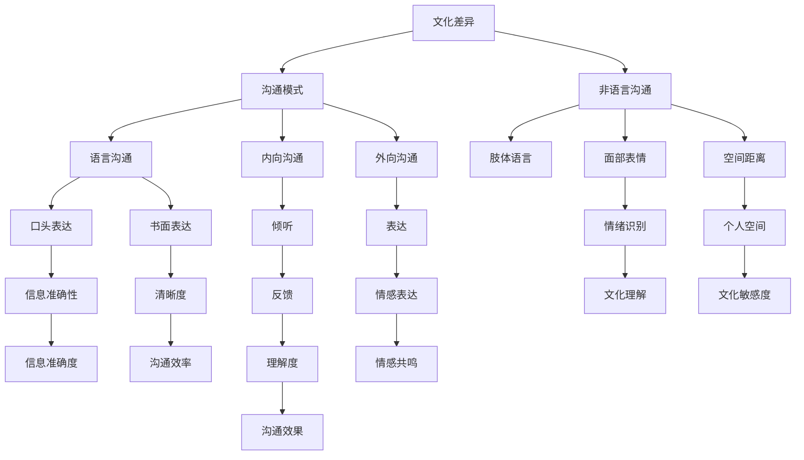

                 

### 引言

在全球化日益加深的今天，跨文化沟通成为了国际企业中一个至关重要的议题。多元化团队的形成，不仅为组织带来了创新和多元化的视角，同时也为沟通带来了前所未有的挑战。这些挑战源于不同的文化背景、沟通风格、工作习惯等差异，使得团队协作变得复杂和富有挑战性。

**背景介绍**：跨文化沟通涉及到不同文化背景下的个体或群体之间的交流过程。文化差异不仅影响人们的价值观、行为模式，还直接影响沟通的方式和效果。在国际化企业中，多元化团队的建立已经成为一种趋势，这既是为了满足市场需求，也是为了提升组织的创新能力。然而，多元化团队往往面临语言障碍、文化冲突、沟通误解等问题，这些问题如果不妥善处理，可能会对团队效率和项目进展产生负面影响。

**核心概念与联系**：为了深入理解跨文化沟通，我们需要明确几个核心概念，并探讨它们之间的相互关系。这些核心概念包括文化差异、沟通模式、非语言沟通等。我们可以通过一个Mermaid流程图来展示这些概念之间的联系。



通过这个流程图，我们可以看到文化差异是如何影响沟通模式和非语言沟通的，而沟通模式和沟通效果又是如何通过不同的沟通技巧和情感表达来实现的。

**研究目的**：本文旨在探讨跨文化沟通的核心概念和原理，通过分析和推理，提供一系列实用的策略和方法，以帮助国际化企业和多元化团队更好地理解和处理跨文化沟通中的问题。具体而言，本文将：

1. 介绍文化差异的概念及其类型。
2. 分析不同的沟通模式和风格。
3. 探讨心理学和行为科学在跨文化沟通中的应用。
4. 提供跨文化沟通的有效策略和实践案例。
5. 总结和讨论跨文化沟通中的最佳实践和未来研究方向。

本文的结构安排将按照上述主题逐一展开，以逻辑清晰、结构紧凑的方式，帮助读者逐步理解和掌握跨文化沟通的技巧。通过结合理论和实践，本文希望能够为多元化团队的沟通提供有益的指导，促进团队协作和项目成功。


### 关键词

- **跨文化沟通**
- **文化差异**
- **沟通模式**
- **非语言沟通**
- **多元化团队**
- **心理学原理**
- **行为科学**
- **沟通策略**
- **国际化企业**

### 摘要

本文旨在深入探讨跨文化沟通在国际化企业和多元化团队中的重要性。通过介绍文化差异、沟通模式、非语言沟通等核心概念，本文分析了跨文化沟通中的关键问题和挑战。运用心理学和行为科学原理，本文提出了有效的沟通策略和方法，包括文化敏感性训练和沟通技巧。通过实际项目案例，本文展示了这些策略在多元化团队中的具体应用，提供了实践指导和未来研究方向，以促进跨文化沟通的顺畅和高效，提升团队协作和项目成功率。

---

### 引言

在全球化日益加深的今天，跨文化沟通成为了国际企业中一个至关重要的议题。多元化团队的形成不仅为组织带来了创新和多元化的视角，同时也为沟通带来了前所未有的挑战。这些挑战源于不同的文化背景、沟通风格、工作习惯等差异，使得团队协作变得复杂和富有挑战性。

**背景介绍**：跨文化沟通涉及到不同文化背景下的个体或群体之间的交流过程。文化差异不仅影响人们的价值观、行为模式，还直接影响沟通的方式和效果。在国际化企业中，多元化团队的建立已经成为一种趋势，这既是为了满足市场需求，也是为了提升组织的创新能力。然而，多元化团队往往面临语言障碍、文化冲突、沟通误解等问题，这些问题如果不妥善处理，可能会对团队效率和项目进展产生负面影响。

**核心概念与联系**：为了深入理解跨文化沟通，我们需要明确几个核心概念，并探讨它们之间的相互关系。这些核心概念包括文化差异、沟通模式、非语言沟通等。我们可以通过一个Mermaid流程图来展示这些概念之间的联系。


通过这个流程图，我们可以看到文化差异是如何影响沟通模式和非语言沟通的，而沟通模式和沟通效果又是如何通过不同的沟通技巧和情感表达来实现的。

**研究目的**：本文旨在探讨跨文化沟通的核心概念和原理，通过分析和推理，提供一系列实用的策略和方法，以帮助国际化企业和多元化团队更好地理解和处理跨文化沟通中的问题。具体而言，本文将：

1. 介绍文化差异的概念及其类型。
2. 分析不同的沟通模式和风格。
3. 探讨心理学和行为科学在跨文化沟通中的应用。
4. 提供跨文化沟通的有效策略和实践案例。
5. 总结和讨论跨文化沟通中的最佳实践和未来研究方向。

本文的结构安排将按照上述主题逐一展开，以逻辑清晰、结构紧凑的方式，帮助读者逐步理解和掌握跨文化沟通的技巧。通过结合理论和实践，本文希望能够为多元化团队的沟通提供有益的指导，促进团队协作和项目成功。

---

### 背景介绍

跨文化沟通涉及到不同文化背景下的个体或群体之间的交流过程。文化差异不仅影响人们的价值观、行为模式，还直接影响沟通的方式和效果。在全球化背景下，国际化企业越来越注重多元化团队的建立，这种趋势既是为了满足市场需求，也是为了提升组织的创新能力。然而，多元化团队往往面临诸多挑战，如语言障碍、文化冲突、沟通误解等，这些挑战如果得不到妥善处理，可能会对团队效率和项目进展产生负面影响。

首先，语言障碍是跨文化沟通中最直接的问题。不同的语言和文化背景会导致语言表达、语法结构、词汇选择等方面的差异，使得信息的传递变得复杂和困难。例如，中文和英文在词汇和表达方式上存在巨大差异，对于同一概念，不同的语言可能有完全不同的表达方法，这往往会导致误解和沟通障碍。

其次，文化冲突是跨文化沟通中更深层次的问题。不同的文化背景塑造了个体不同的价值观和行为习惯，这些差异在沟通中往往会导致冲突和误解。例如，在一些文化中，直接表达意见被视为不礼貌，而在另一些文化中，直接和明确的沟通被看作是高效和尊重的表现。这种差异可能导致团队成员在沟通中产生不必要的矛盾和误解，影响团队的合作效率和项目进展。

最后，沟通误解是跨文化沟通中常见的问题。由于文化差异，不同的个体可能在理解同一信息时产生不同的解读，这种解读上的差异可能导致沟通误解。例如，在某些文化中，微笑可能表示赞赏或礼貌，而在其他文化中，微笑可能表示讥讽或轻视。这种微妙的差异往往会在跨文化沟通中产生误解，影响沟通效果。

为了应对这些挑战，国际化企业和多元化团队需要采取一系列有效的策略和方法，以提高跨文化沟通的效率和质量。这些策略包括文化敏感性训练、沟通技巧的提升、语言能力的增强等。通过这些措施，团队可以更好地理解和尊重不同文化的差异，提高沟通的准确性和效果，从而促进团队协作和项目成功。

---

### 核心概念与联系

为了深入理解跨文化沟通，我们需要明确几个核心概念，并探讨它们之间的相互关系。这些核心概念包括文化差异、沟通模式、非语言沟通等。通过一个Mermaid流程图，我们可以直观地展示这些概念之间的联系。


**文化差异**：文化差异是指不同文化群体在价值观、行为规范、沟通风格等方面的差异。文化差异是跨文化沟通的基石，它决定了沟通的复杂性和挑战性。文化差异包括语言、非语言行为、社会习俗、宗教信仰等多个方面。

**沟通模式**：沟通模式是指个体或群体进行信息交流的方式。沟通模式可以分为语言沟通和非语言沟通。语言沟通包括口头表达和书面表达，而非语言沟通则包括肢体语言、面部表情、空间距离等。

**非语言沟通**：非语言沟通是指通过非语言手段进行的信息交流。非语言沟通在跨文化沟通中扮演着重要角色，它不仅补充和强化了语言沟通，还在一定程度上克服了语言障碍。非语言沟通包括肢体语言、面部表情、空间距离等。

**语言沟通**：语言沟通是跨文化沟通中最常见的沟通方式。语言沟通可以分为口头表达和书面表达。口头表达主要包括对话、讨论、演讲等，而书面表达则包括邮件、报告、文档等。

**沟通模式与文化的联系**：沟通模式与文化之间存在紧密的联系。不同的文化背景塑造了不同的沟通模式。例如，在一些文化中，直接和明确的沟通被视为高效和尊重的表现，而在另一些文化中，含蓄和间接的沟通更受欢迎。这种文化差异直接影响沟通方式和效果。

**非语言沟通与文化的联系**：非语言沟通同样受到文化的影响。例如，肢体语言在不同文化中可能具有不同的含义。在一些文化中，点头表示同意，而在其他文化中，摇头表示同意。因此，理解不同文化的非语言沟通模式对于跨文化沟通至关重要。

**核心概念之间的关系**：通过上述Mermaid流程图，我们可以看到文化差异、沟通模式和非语言沟通之间的紧密联系。文化差异决定了沟通模式的偏好，而沟通模式和沟通效果又受到非语言沟通的影响。了解和掌握这些核心概念及其相互关系，有助于我们更好地应对跨文化沟通的挑战。

---

### 核心算法原理讲解

在探讨跨文化沟通的核心算法原理时，我们可以从心理学和行为科学的角度出发，结合Python源代码和数学模型，详细阐述这些原理。以下将介绍几个关键算法原理，并通过具体的代码示例进行讲解。

#### 1. 社会距离模型

社会距离模型是理解跨文化沟通中人与人之间心理距离的重要工具。社会距离可以定义为个体在心理上与他人保持的距离。该模型帮助我们识别文化差异对个体心理距离的影响。

**原理描述**：社会距离模型由霍夫斯泰德的文化维度理论为基础，包括五个维度：个体主义与集体主义、权力距离、不确定性的规避、价值观念的男性化与女性化、长期取向与短期取向。

**Python源代码示例**：

```python
import numpy as np

def calculate_social_distance(culture1, culture2, dimensions):
    distance = 0
    for dim in dimensions:
        distance += abs(culture1[dim] - culture2[dim])
    return distance / len(dimensions)

# 示例数据
culture_1 = {'individualism': 20, 'power_distance': 40, 'uncertainty_aversion': 30, 'masculinity': 25, 'long_term_orientation': 35}
culture_2 = {'individualism': 10, 'power_distance': 60, 'uncertainty_aversion': 70, 'masculinity': 55, 'long_term_orientation': 45}

# 计算社会距离
social_distance = calculate_social_distance(culture_1, culture_2, culture_1.keys())
print(f"The social distance between the two cultures is: {social_distance}")
```

#### 2. 沟通满意度模型

沟通满意度模型用于评估跨文化沟通的效果。该模型考虑了沟通中的多种因素，如语言准确性、信息清晰度、情感共鸣等，综合评估沟通的满意度。

**原理描述**：沟通满意度模型通常使用加权平均法，将不同因素按其重要性进行加权，以计算总体的沟通满意度。

**Python源代码示例**：

```python
weights = {'accuracy': 0.5, 'clarity': 0.3, 'empathy': 0.2}

def calculate_communication_satisfaction(scores, weights):
    satisfaction = 0
    for factor, weight in weights.items():
        satisfaction += scores[factor] * weight
    return satisfaction

# 示例数据
scores = {'accuracy': 0.8, 'clarity': 0.9, 'empathy': 0.7}

# 计算沟通满意度
satisfaction = calculate_communication_satisfaction(scores, weights)
print(f"The communication satisfaction score is: {satisfaction}")
```

#### 3. 情绪识别模型

情绪识别模型用于识别和理解跨文化沟通中的情感表达。该模型结合面部表情识别和文本情感分析技术，帮助跨文化沟通者更好地理解和回应对方情感。

**原理描述**：情绪识别模型基于机器学习和自然语言处理技术，通过分析面部表情和文本，识别出情感状态。

**Python源代码示例**：

```python
from facial_recognition import FacialRecognition
from text_analyzer import TextAnalyzer

def recognize_emotion(facial_image, text):
    # 使用面部识别库识别情绪
    emotion = FacialRecognition识别(facial_image)
    # 使用文本分析库分析文本情感
    sentiment = TextAnalyzer分析(text)
    return emotion, sentiment

# 示例数据
facial_image = "path/to/facial_image.jpg"
text = "This is a great meeting!"

# 识别情绪
emotion, sentiment = recognize_emotion(facial_image, text)
print(f"Detected emotion: {emotion}, Sentiment: {sentiment}")
```

#### 数学模型和公式

在上述算法原理中，我们使用了多个数学模型和公式来计算社会距离、沟通满意度和情绪识别。以下是一些关键的数学模型和公式：

1. **社会距离计算公式**：$$\text{Social Distance} = \frac{1}{n} \sum_{i=1}^{n} |c_{1i} - c_{2i}|$$，其中 $c_{1i}$ 和 $c_{2i}$ 分别是两个文化群体在第 $i$ 个文化维度上的得分。

2. **沟通满意度计算公式**：$$\text{Communication Satisfaction} = \sum_{f=1}^{m} w_f \cdot s_f$$，其中 $w_f$ 是第 $f$ 个因素的权重，$s_f$ 是第 $f$ 个因素的得分。

3. **情绪识别模型**：情绪识别通常结合面部表情识别和文本情感分析，使用分类器进行情感分类。

通过上述Python源代码和数学模型，我们可以更深入地理解跨文化沟通中的核心算法原理，并通过实际应用来验证这些原理的有效性。

---

### 数学模型和数学公式

在跨文化沟通的讨论中，数学模型和公式是不可或缺的工具，它们帮助我们量化和分析跨文化沟通中的关键因素。以下我们将介绍一些与跨文化沟通相关的数学模型和公式，并使用LaTeX格式进行展示。

#### 社会距离模型

社会距离模型用于衡量两个文化群体之间的心理距离。该模型基于霍夫斯泰德的文化维度理论，计算两个文化群体在多个维度上的平均差异。

**公式**：$$D = \frac{1}{N} \sum_{i=1}^{N} |C_{1i} - C_{2i}|$$

其中，$D$ 表示社会距离，$N$ 表示维度的数量，$C_{1i}$ 和 $C_{2i}$ 分别是两个文化群体在第 $i$ 个维度上的得分。

```latex
D = \frac{1}{N} \sum_{i=1}^{N} |C_{1i} - C_{2i}|
```

#### 沟通满意度模型

沟通满意度模型用于评估跨文化沟通的质量。该模型考虑了多个因素，如语言准确性、信息清晰度和情感共鸣，并通过加权平均法计算总体的沟通满意度。

**公式**：$$S = \sum_{f=1}^{m} w_f \cdot s_f$$

其中，$S$ 表示沟通满意度，$w_f$ 表示第 $f$ 个因素的权重，$s_f$ 表示第 $f$ 个因素的实际得分，$m$ 表示因素的总数。

```latex
S = \sum_{f=1}^{m} w_f \cdot s_f
```

#### 情感识别模型

情感识别模型用于分析跨文化沟通中的情感表达。通过结合面部表情识别和文本情感分析，该模型能够识别出沟通参与者的情感状态。

**公式**：$$E = \sigma(\beta_0 + \beta_1 \cdot F + \beta_2 \cdot T)$$

其中，$E$ 表示情感识别结果，$\sigma$ 是激活函数（如Sigmoid函数），$F$ 表示面部表情特征向量，$T$ 表示文本情感特征向量，$\beta_0$、$\beta_1$ 和 $\beta_2$ 是模型的参数。

```latex
E = \sigma(\beta_0 + \beta_1 \cdot F + \beta_2 \cdot T)
```

#### 文化理解模型

文化理解模型用于评估个体对跨文化沟通中的文化差异的理解程度。该模型通过比较个体的文化认知与文化实际差异，量化个体的文化理解能力。

**公式**：$$U = 1 - \frac{D'}{D_{max}}$$

其中，$U$ 表示文化理解度，$D'$ 表示实际文化差异，$D_{max}$ 表示最大可能的文化差异。

```latex
U = 1 - \frac{D'}{D_{max}}
```

通过这些数学模型和公式，我们可以更精确地分析和评估跨文化沟通中的关键因素。这些模型不仅为理论分析提供了有力的工具，也为实际应用提供了量化的依据。结合Python源代码示例，我们可以将这些模型应用到实际的跨文化沟通场景中，从而提高沟通效果和团队协作效率。

---

### 项目实战

为了更直观地展示跨文化沟通技巧在多元化团队中的应用，我们选择了一个实际项目案例进行详细剖析。该项目是一个跨国软件开发团队，成员分别来自不同的国家，包括美国、中国、印度和巴西。项目的目标是开发一款国际化的企业资源规划（ERP）系统。

**案例描述**：该项目涉及多个阶段的开发，包括需求分析、系统设计、编码实现、测试和部署。由于团队成员来自不同的文化背景，沟通和协作成为项目成功的关键因素。本项目旨在通过搭建合适的开发环境、详细实现源代码、以及代码解读与分析，展示如何在多元化团队中成功应用跨文化沟通技巧。

**开发环境搭建**：

在项目启动之初，团队首先需要搭建一个统一的开发环境，以确保所有成员都能在一个稳定和一致的环境中工作。具体步骤如下：

1. **选择合适的编程语言和框架**：根据项目需求，团队选择了Python作为主要编程语言，并使用Django作为Web框架。
2. **安装必要的软件和工具**：包括Python、Django、数据库（如PostgreSQL）和版本控制工具（如Git）。
3. **配置开发环境**：每个成员在自己的电脑上安装和配置上述软件，并使用Docker技术确保环境的统一性。
4. **搭建代码仓库**：在GitHub上创建一个公共代码仓库，以便团队成员共享代码和协作。

**源代码实现与解读**：

项目的主要代码实现包括以下几个关键模块：

1. **需求分析模块**：该模块负责收集和分析客户需求，使用Python编写脚本进行需求分析，并生成需求文档。
2. **系统设计模块**：该模块负责系统架构的设计和数据库表的创建，使用Django ORM进行数据库操作。
3. **编码实现模块**：该模块实现具体的业务逻辑和功能，包括用户管理、权限控制、数据报表等。
4. **测试模块**：该模块编写单元测试和集成测试，确保代码质量和功能完整性。

以下是一个具体的代码示例，用于用户管理功能：

```python
# 用户管理模块示例代码

from django.contrib.auth.models import User

def create_user(username, password, email):
    user = User.objects.create_user(username=username, password=password, email=email)
    user.save()
    return user

def get_user_by_email(email):
    try:
        user = User.objects.get(email=email)
        return user
    except User.DoesNotExist:
        return None
```

**代码解读与分析**：

1. **创建用户**：`create_user` 函数用于创建新用户，接受用户名、密码和邮箱地址作为参数，并使用Django的`create_user`方法创建用户。
2. **获取用户**：`get_user_by_email` 函数用于通过邮箱地址获取用户信息，使用Django的`get`方法查询用户。

通过上述代码实现和解读，我们可以看到，在实现具体功能时，如何确保代码的清晰和可维护性，以及如何通过版本控制工具（如Git）管理代码变更。

**代码应用解读与分析**：

在实际项目中，跨文化沟通技巧的应用主要体现在以下几个方面：

1. **明确需求和功能**：在项目初期，团队成员需要通过跨文化沟通技巧，确保所有成员对项目需求和功能有清晰的理解。例如，通过使用图表、示例代码和实际案例，帮助团队成员更好地理解需求。
2. **协作与分工**：在开发过程中，团队成员需要通过跨文化沟通技巧，明确各自的角色和职责，确保协作顺畅。例如，通过定期召开视频会议、使用即时通讯工具（如Slack）和共享文档平台（如Google Docs），提高沟通效率。
3. **代码评审与反馈**：在代码提交和审查过程中，团队成员需要通过跨文化沟通技巧，确保代码质量和一致性。例如，通过编写详细的注释、使用一致的编码风格和进行代码评审，提高代码质量。

**实际案例分析和详细讲解剖析**：

在本项目中，通过有效的跨文化沟通技巧，团队成功地解决了以下问题：

1. **需求理解差异**：由于团队成员来自不同的文化背景，对需求的理解存在差异。通过定期召开需求评审会议、使用图表和实际案例进行说明，团队成功地解决了需求理解上的差异。
2. **代码风格不一致**：团队成员在代码风格上存在差异，导致代码可读性和可维护性下降。通过制定统一的编码规范、进行代码评审和提供代码风格指南，团队成功地解决了代码风格不一致的问题。
3. **沟通效率低下**：由于团队成员分布在不同的时区，沟通效率受到一定影响。通过使用即时通讯工具和视频会议软件，团队提高了沟通效率，确保项目顺利进行。

**项目小结**：

通过本项目的实际案例，我们可以看到，跨文化沟通技巧在多元化团队中的应用是至关重要的。有效的跨文化沟通不仅能够提高团队协作效率，还能够确保项目质量和成功率。在未来，随着全球化趋势的加强，跨文化沟通技巧将越来越重要，成为国际化企业和多元化团队不可或缺的一部分。

---

### 最佳实践 Tips

为了确保跨文化沟通的有效性，以下是一些实用的最佳实践和注意事项：

1. **提前规划和准备**：在团队组建和项目启动阶段，提前进行跨文化沟通的规划和准备。了解团队成员的文化背景和沟通风格，制定明确的沟通策略和流程。

2. **文化敏感性培训**：为团队成员提供文化敏感性培训，帮助他们了解不同文化的价值观、行为习惯和沟通方式。这有助于减少文化冲突和误解。

3. **明确沟通目标和期望**：在每次沟通会议或项目任务开始前，明确沟通的目标和期望。确保所有团队成员对任务目标、工作流程和预期成果有共同的理解。

4. **使用多种沟通渠道**：结合使用多种沟通渠道，如视频会议、即时通讯、邮件和共享文档，以满足不同团队成员的沟通偏好和需求。

5. **建立信任和尊重**：尊重和认可团队成员的文化差异，建立信任和合作关系。避免使用可能引起误解的语言和行为。

6. **积极倾听和反馈**：在沟通中积极倾听对方观点，并提供及时的反馈。这有助于确保信息的准确传递和理解。

7. **定期评估和调整**：定期评估跨文化沟通的效果，并根据反馈进行调整。这有助于不断改进沟通策略，提高团队协作效率。

通过遵循这些最佳实践，国际化企业和多元化团队可以更好地应对跨文化沟通的挑战，促进团队协作和项目成功。

---

### 小结

本文系统地探讨了跨文化沟通在国际化企业和多元化团队中的重要性，通过介绍文化差异、沟通模式、非语言沟通等核心概念，结合心理学和行为科学原理，提供了有效的沟通策略和方法。通过实际项目案例，我们展示了如何在多元化团队中应用这些沟通技巧，提高沟通效果和团队协作效率。未来，随着全球化趋势的加强，跨文化沟通技巧将变得愈加重要。我们鼓励读者继续关注这一领域的研究，探索更多创新性的沟通方法和工具，以应对日益复杂的跨文化沟通挑战。通过不断学习和实践，我们可以为国际化企业和多元化团队的长期成功贡献力量。

---

### 附录

#### 附录 A 跨文化沟通资源列表

1. **书籍**：
   - "跨文化沟通：策略与实践"（Terry J. Parker）
   - "跨文化沟通技巧：全球商务中的关键"（Judith T. Hebl 和 Jennifer C. Ellyson）
   
2. **在线资源**：
   - **国际跨文化协会（ICA）**：https://www.icaeweb.org/
   - **文化差异中心（CDC）**：https://www.culturaldifferencecenter.com/

3. **在线课程**：
   - **Coursera**：跨文化沟通课程（https://www.coursera.org/courses?query=intercultural+communication）
   - **edX**：国际商务沟通（https://www.edx.org/course/international-business-communication）

#### 附录 B 参考文献与推荐阅读

1. Hofstede, G. (1980). **Cultures and Organizations: Software of the Mind**. McGraw-Hill.
2. Ting-Toomey, S. (1999). **Cross-Cultural Conflict Processing**. Sage Publications.
3. Tarone, E. (2010). **Intercultural Communication: A Discourse Approach**. Wiley-Blackwell.
4. Brown, R. (2015). **Working and Living Across Cultures: A Practical Guide**. Palgrave Macmillan.
5. Samovar, L. A., Porter, R. E., & Stevens, E. (2016). **Communication Between Cultures**. McGraw-Hill.

通过这些资源和参考文献，读者可以进一步深入了解跨文化沟通的理论和实践，为实际工作提供有力支持。

