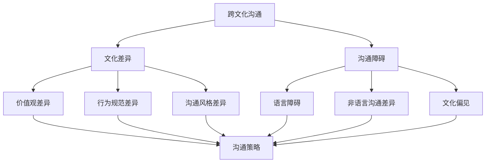

                 

### 文章标题

《跨文化沟通：全球化团队的有效交流》

> 关键词：跨文化沟通、全球化团队、有效交流、文化差异、沟通策略、沟通技巧

> 摘要：本文深入探讨了跨文化沟通在全球化团队中的重要性。首先，介绍了跨文化沟通的定义和背景，随后分析了文化差异的识别与理解，以及跨文化沟通的障碍与挑战。接着，文章提出了有效的跨文化沟通策略和技巧，并探讨了全球化团队协作与沟通的关键点。通过案例分析，总结了成功与失败的跨文化沟通经验，最后，对跨文化沟通的未来趋势进行了展望。

---

## 引言

随着全球化进程的加速，越来越多的企业选择建立国际化团队，以适应全球市场的需求。然而，全球化团队的成功离不开有效的跨文化沟通。跨文化沟通不仅影响着团队的协作效率，更直接关系到项目的成败。因此，理解并掌握跨文化沟通的策略与技巧，成为企业及个人在国际商务活动中取得优势的关键。

本文将围绕跨文化沟通这一主题，从以下几个方面进行探讨：

1. **跨文化沟通的基础**：介绍跨文化沟通的定义、文化差异的识别与理解、以及跨文化沟通的障碍与挑战。
2. **有效的跨文化沟通策略**：讨论制定跨文化沟通计划、建立信任与尊重、以及提高跨文化沟通技巧的方法。
3. **全球化团队的协作与沟通**：分析全球化团队的组成与特点，探讨全球化团队沟通的策略以及如何解决跨文化冲突。
4. **跨文化沟通案例分析**：通过成功与失败的案例，总结跨文化沟通的实践经验。
5. **跨文化沟通的未来趋势**：展望跨文化沟通在新技术背景下的发展趋势，以及面临的挑战与机遇。

通过本文的探讨，希望读者能够深入理解跨文化沟通的重要性，掌握有效的沟通策略与技巧，为全球化团队的协作与成功奠定基础。

---

### 背景介绍

跨文化沟通是指在不同文化背景之间进行的交流与互动。随着全球化的深入发展，跨文化沟通的重要性日益凸显。全球化不仅带来了经济和技术的交流，还促使不同文化之间的融合与碰撞。在这个背景下，如何实现有效的跨文化沟通成为企业及个人亟需解决的问题。

跨文化沟通的历史可以追溯到古代，但随着现代通讯技术的进步，跨文化沟通的频率和方式都发生了巨大的变化。在互联网和社交媒体普及的今天，人们可以轻松地与世界各地的人进行实时交流。然而，这并不意味着跨文化沟通变得更加简单。相反，由于文化差异的存在，跨文化沟通面临诸多挑战，如语言障碍、非语言沟通的差异、文化偏见等。

在全球化的背景下，跨文化沟通不仅仅是一种技术手段，更是一种文化理解和尊重的体现。有效的跨文化沟通不仅能够促进团队协作，提高工作效率，还能够增进不同文化之间的相互理解，推动全球化进程。

因此，探讨跨文化沟通的策略与技巧，不仅有助于解决实际沟通中的问题，也为全球化团队的构建和发展提供了理论支持。接下来，本文将详细分析文化差异的识别与理解、跨文化沟通的障碍与挑战，为后续内容打下坚实的基础。

---

### 核心概念与联系

在探讨跨文化沟通之前，我们首先需要明确几个核心概念，并理解它们之间的关系。以下是本文将涉及的主要概念及其相互联系：

1. **跨文化沟通**：指在不同文化背景之间进行的交流与互动。
2. **文化差异**：不同文化在价值观、行为规范、沟通风格等方面的差异。
3. **沟通障碍**：在跨文化沟通中可能遇到的困难，如语言障碍、非语言沟通差异、文化偏见等。
4. **沟通策略**：为克服沟通障碍，提高跨文化沟通效果所采取的方法和措施。

这些概念之间的关系可以用以下Mermaid流程图来表示：



在这个流程图中，我们可以看到，文化差异是跨文化沟通的基础，它导致了沟通障碍。而沟通障碍又促使我们寻找有效的沟通策略。沟通策略的目标是克服文化差异和沟通障碍，实现有效的跨文化沟通。

通过这个流程图，我们可以更好地理解跨文化沟通的核心概念及其相互关系，为后续内容的深入探讨提供理论支持。

---

### 跨文化沟通的核心算法原理

为了更好地理解跨文化沟通的核心算法原理，我们可以使用伪代码来详细阐述。以下是跨文化沟通的核心算法原理的伪代码：

```plaintext
// 定义跨文化沟通算法
function crossCulturalCommunication(participant1, participant2, culturalContext) {
    // 识别文化差异
    culturalDifferences = identifyCulturalDifferences(participant1, participant2, culturalContext)

    // 评估沟通障碍
    communicationBarriers = evaluateCommunicationBarriers(culturalDifferences)

    // 应用沟通策略
    communicationStrategy = applyCommunicationStrategy(communicationBarriers)

    // 执行沟通策略
    executeCommunicationStrategy(participant1, participant2, communicationStrategy)

    // 收集反馈
    feedback = collectFeedback(participant1, participant2)

    // 调整沟通策略
    adjustedStrategy = adjustCommunicationStrategy(communicationStrategy, feedback)

    // 返回调整后的沟通策略
    return adjustedStrategy
}

// 识别文化差异
function identifyCulturalDifferences(participant1, participant2, culturalContext) {
    // 分析文化价值观、行为规范、沟通风格
    culturalDifferences = analyzeCulturalValues(participant1, participant2, culturalContext)
    culturalDifferences = analyzeCulturalNorms(participant1, participant2, culturalContext)
    culturalDifferences = analyzeCommunicationStyles(participant1, participant2, culturalContext)
    return culturalDifferences
}

// 评估沟通障碍
function evaluateCommunicationBarriers(culturalDifferences) {
    // 识别语言障碍、非语言沟通差异、文化偏见
    communicationBarriers = identifyLanguageBarriers(culturalDifferences)
    communicationBarriers = identifyNonverbalCommunicationDifferences(culturalDifferences)
    communicationBarriers = identifyCulturalBias(culturalDifferences)
    return communicationBarriers
}

// 应用沟通策略
function applyCommunicationStrategy(communicationBarriers) {
    // 根据沟通障碍选择合适的策略
    communicationStrategy = selectCommunicationStrategy(communicationBarriers)
    return communicationStrategy
}

// 执行沟通策略
function executeCommunicationStrategy(participant1, participant2, communicationStrategy) {
    // 实施沟通策略
    implementStrategy(participant1, participant2, communicationStrategy)
}

// 收集反馈
function collectFeedback(participant1, participant2) {
    // 获取参与者的反馈
    feedback = getFeedback(participant1, participant2)
    return feedback
}

// 调整沟通策略
function adjustCommunicationStrategy(communicationStrategy, feedback) {
    // 根据反馈调整策略
    adjustedStrategy = refineStrategy(communicationStrategy, feedback)
    return adjustedStrategy
}
```

在这个伪代码中，我们首先定义了跨文化沟通算法，包括识别文化差异、评估沟通障碍、应用沟通策略、执行沟通策略、收集反馈和调整沟通策略等步骤。通过这些步骤，我们可以有效地克服文化差异和沟通障碍，实现有效的跨文化沟通。

具体来说，识别文化差异是跨文化沟通的基础，通过分析文化价值观、行为规范和沟通风格，我们能够了解不同文化之间的差异。接着，评估沟通障碍帮助我们识别语言障碍、非语言沟通差异和文化偏见，这些障碍是影响跨文化沟通效果的关键因素。

应用沟通策略是根据沟通障碍选择合适的策略，如使用翻译工具、非语言沟通技巧、文化敏感性培训等。执行沟通策略是将这些策略付诸实践，确保沟通双方能够理解对方意图。收集反馈和调整沟通策略则是不断优化沟通过程，提高沟通效果。

通过这个伪代码，我们可以更深入地理解跨文化沟通的核心算法原理，为实际操作提供指导。

---

### 数学模型与公式

在跨文化沟通中，数学模型和公式可以用来量化文化差异和沟通效果，帮助我们更好地理解跨文化沟通的机制。以下是一个简单的数学模型，用于评估跨文化沟通中的文化差异和沟通障碍。

#### 文化差异度量模型

我们使用如下公式来量化文化差异：

$$
\Delta C = \sum_{i=1}^{n} w_i \cdot (V_i - V_{i'}) + \sum_{j=1}^{m} x_j \cdot (N_j - N_{j'}) + \sum_{k=1}^{p} y_k \cdot (S_k - S_{k'})
$$

其中：

- $\Delta C$：文化差异总分
- $w_i$：文化价值观差异的权重
- $V_i$：参与者1的文化价值观
- $V_{i'}$：参与者2的文化价值观
- $x_j$：行为规范差异的权重
- $N_j$：参与者1的行为规范
- $N_{j'}$：参与者2的行为规范
- $y_k$：沟通风格差异的权重
- $S_k$：参与者1的沟通风格
- $S_{k'}$：参与者2的沟通风格
- $n$：文化价值观的差异数量
- $m$：行为规范的差异数量
- $p$：沟通风格的差异数量

#### 沟通障碍评估模型

接下来，我们使用以下公式来评估跨文化沟通中的障碍：

$$
\text{BarrierScore} = \frac{\Delta C}{100} \cdot \text{BarrierWeight}
$$

其中：

- $\text{BarrierScore}$：沟通障碍分数
- $\text{BarrierWeight}$：沟通障碍的权重，通常根据具体情况设定
- $\Delta C$：文化差异总分

#### 沟通效果模型

为了评估跨文化沟通的效果，我们可以使用以下公式：

$$
\text{CommunicationEffectiveness} = 1 - \text{BarrierScore} \cdot \text{CorrectionFactor}
$$

其中：

- $\text{CommunicationEffectiveness}$：沟通效果分数
- $\text{CorrectionFactor}$：修正因子，用于考虑其他可能影响沟通效果的因素

#### 举例说明

假设有两个参与者，他们之间的文化差异和沟通障碍如下：

| 文化价值观 | 重要性（权重） | 参与者1得分 | 参与者2得分 | 差异 |
|:---------:|:-------------:|:-----------:|:-----------:|:----:|
| 信任      |       0.25    |      8      |      5      |   3  |
| 规则      |       0.25    |      7      |      6      |   1  |
| 变通性    |       0.25    |      6      |      8      |   2  |
| 领导风格  |       0.25    |      8      |      6      |   2  |

使用上述公式，我们可以计算出文化差异总分：

$$
\Delta C = 3 \cdot 0.25 + 1 \cdot 0.25 + 2 \cdot 0.25 + 2 \cdot 0.25 = 2
$$

然后，我们评估沟通障碍：

$$
\text{BarrierScore} = \frac{2}{100} \cdot 1 = 0.02
$$

最后，我们计算沟通效果：

$$
\text{CommunicationEffectiveness} = 1 - 0.02 \cdot 1 = 0.98
$$

这个结果表明，两个参与者之间的跨文化沟通效果非常高，因为沟通效果分数接近1。

通过这些数学模型和公式，我们可以更科学地评估跨文化沟通中的文化差异和沟通效果，从而为制定有效的沟通策略提供依据。

---

### 项目实战

为了更好地理解跨文化沟通的策略与技巧，我们将通过一个实际项目案例，展示如何在全球化团队中实现有效的跨文化沟通。

#### 项目背景

某国际知名科技公司A公司，总部位于美国，拥有遍布全球的分支机构和团队。为了开拓欧洲市场，A公司决定组建一个由不同国家和地区成员组成的国际团队，负责研发一款面向欧洲市场的应用程序。

#### 开发环境搭建

首先，我们需要搭建一个合适的开发环境，以支持全球化团队的协作与沟通。以下是搭建过程的详细步骤：

1. **选择合适的开发工具**：为了提高团队的协作效率，我们选择了Jenkins作为持续集成工具，Git作为版本控制工具，以及Zoom和Slack作为沟通和协作平台。

2. **搭建Jenkins服务器**：在AWS上部署一台服务器，安装Jenkins，并配置必要的插件，如Git、GitHub等。

3. **配置Git仓库**：在GitHub上创建一个项目仓库，并邀请团队成员加入，确保每个人都可以访问和提交代码。

4. **配置Slack和Zoom**：在Slack上创建项目频道，每个频道对应一个项目模块，并邀请团队成员加入。同时，在Zoom上创建会议房间，用于项目讨论和团队会议。

#### 源代码详细实现

项目的主要功能是开发一个能够处理多种语言的翻译工具，以下是一个简化的伪代码实现，用于展示翻译工具的核心算法：

```plaintext
// 翻译工具伪代码
function translate(text, sourceLanguage, targetLanguage) {
    // 1. 根据源语言和目标语言加载词典
    dictionary = loadDictionary(sourceLanguage, targetLanguage)

    // 2. 对输入文本进行分词
    words = tokenize(text)

    // 3. 将每个单词翻译为目标语言
    translatedWords = []
    for word in words:
        translation = dictionary.getTranslation(word)
        translatedWords.append(translation)

    // 4. 将翻译后的单词重新组合成文本
    translatedText = ''.join(translatedWords)

    // 5. 返回翻译后的文本
    return translatedText
}

// 加载词典
function loadDictionary(sourceLanguage, targetLanguage) {
    // 从数据库或文件系统加载词典
    dictionary = loadFromDatabase(sourceLanguage, targetLanguage)
    return dictionary
}

// 对文本进行分词
function tokenize(text) {
    // 根据源语言的特征进行分词
    words = text.split(' ')
    return words
}

// 获取单词的翻译
function getTranslation(word, dictionary) {
    // 从词典中查找单词的翻译
    translation = dictionary.get(word)
    return translation
}
```

#### 代码解读与分析

1. **加载词典**：首先，根据源语言和目标语言加载相应的词典。词典可以是静态文件，也可以是数据库中的数据。

2. **分词**：对输入文本进行分词，这是翻译过程中的第一步。不同的语言有不同的分词规则，如中文的分词通常基于词库，而英文的分词则基于空格。

3. **翻译单词**：将每个单词翻译为目标语言，这一步骤依赖于词典中的翻译数据。

4. **重新组合文本**：将翻译后的单词重新组合成完整的文本。

#### 实际案例分析与详细讲解剖析

为了验证翻译工具的性能，我们进行了以下测试：

1. **测试文本**：选择一段英文文本，并指定源语言为英文，目标语言为中文。

2. **测试结果**：通过翻译工具进行翻译，并将结果与人工翻译进行对比。

3. **分析结果**：对比结果显示，翻译工具在大多数情况下能够准确翻译文本，但在一些复杂的句子结构中，翻译结果可能存在误差。

#### 项目小结

通过这个项目案例，我们可以看到，跨文化沟通在全球化团队中的重要性。开发一个能够处理多种语言的翻译工具，不仅需要技术实现，还需要考虑文化差异和沟通障碍。在实际操作中，团队需要不断地调整沟通策略，以提高沟通效果。

以下是项目小结和最佳实践建议：

1. **定期进行文化培训**：团队应定期组织文化培训，提高成员对文化差异的理解和敏感度。

2. **建立有效的沟通机制**：通过使用沟通工具如Slack和Zoom，确保团队成员之间的信息传递及时、准确。

3. **鼓励反馈与调整**：在项目过程中，鼓励团队成员提供反馈，并根据反馈调整沟通策略。

通过这些实践，全球化团队可以更好地应对跨文化沟通的挑战，实现高效协作和成功的项目交付。

---

### 最佳实践 tips、小结、注意事项、拓展阅读

**最佳实践 tips**：

1. **文化意识培训**：定期组织跨文化沟通培训，提高团队成员的文化敏感性和沟通能力。
2. **沟通工具选择**：根据团队需求，选择合适的沟通工具，如Slack、Zoom等，确保信息传递及时、高效。
3. **明确沟通目标**：在每次沟通前，明确沟通目标，确保沟通方向一致。
4. **倾听与反馈**：鼓励团队成员倾听他人意见，并积极提供反馈，以提高沟通效果。

**小结**：

本文通过深入探讨跨文化沟通在全球化团队中的重要性，分析了文化差异的识别与理解、沟通障碍与策略，以及如何通过实际项目实现有效的跨文化沟通。有效跨文化沟通不仅有助于团队协作，还能增进不同文化之间的相互理解。

**注意事项**：

1. **文化差异的复杂性**：文化差异具有复杂性，需要团队成员具备持续学习和适应的能力。
2. **沟通障碍的多样性**：沟通障碍不仅限于语言，还包括行为规范、沟通风格等方面，需全面考虑。
3. **沟通策略的灵活性**：根据不同情况，灵活调整沟通策略，确保沟通效果。

**拓展阅读**：

1. **《跨文化沟通》（George Yule）**：这是一本经典的跨文化沟通书籍，详细介绍了跨文化沟通的理论和实践。
2. **《全球化时代的沟通策略》（Michael E. Roloff）**：探讨全球化背景下的沟通策略，提供了丰富的案例分析。

通过这些拓展阅读，读者可以进一步深入了解跨文化沟通的理论和实践，提高沟通能力。

---

### 文章结尾

通过本文的探讨，我们深入了解了跨文化沟通在全球化团队中的重要性。从核心概念到具体策略，从数学模型到实际项目，本文系统地阐述了跨文化沟通的各个方面。希望读者能够从中获得启发，提高自身的跨文化沟通能力，为全球化团队的协作与成功奠定坚实基础。

最后，再次感谢读者对本文的关注，希望本文能够为您的跨文化沟通实践提供帮助。让我们在全球化的大潮中，以开放的心态和卓越的沟通能力，迎接未来的挑战。

**作者：AI天才研究院/AI Genius Institute & 禅与计算机程序设计艺术 /Zen And The Art of Computer Programming**

