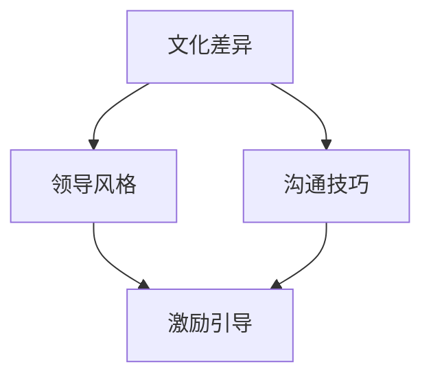

                 

### 第1章 引言：跨文化领导力的重要性

在全球化日益深入的今天，企业面临的挑战和机遇也日益复杂。跨文化领导力作为企业管理者必备的一项技能，已经成为提高团队绩效、实现企业战略目标的关键因素。本章将探讨跨文化领导力的定义、重要性以及关键要素，帮助读者了解这一领域的基本概念和核心内容。

#### 1.1 跨文化领导力的定义

跨文化领导力是指在一个多元文化的工作环境中，领导者能够理解和尊重不同文化的特点，有效地激励和引导团队成员，实现团队目标的能力。它不仅包括对文化差异的识别和尊重，还涉及到领导风格、沟通技巧、管理策略等多方面的综合素养。

**核心概念与联系：**

在跨文化领导力中，以下几个核心概念之间存在着密切的联系：

1. **文化差异**：不同文化在价值观、行为规范、沟通方式等方面存在差异，这是跨文化领导力需要理解和应对的首要问题。
2. **领导风格**：领导者需要根据不同文化背景调整自己的领导风格，以便更好地激励和引导团队成员。
3. **沟通技巧**：有效的沟通是跨文化领导力的核心，领导者需要掌握跨文化沟通的技巧，以减少误解和冲突。

以下是跨文化领导力核心概念之间的Mermaid流程图：

#### 1.2 跨文化领导力的关键要素

跨文化领导力的关键要素包括文化差异与管理、领导风格与适应性、沟通技巧等。

**文化差异与管理**

文化差异是跨文化领导力需要理解和应对的首要问题。不同文化在价值观、行为规范、沟通方式等方面存在差异，这可能导致团队成员之间的误解和冲突。为了有效地管理文化差异，领导者需要：

- **识别和尊重文化差异**：通过培训和文化交流，提高对文化差异的认识和敏感度。
- **制定包容性政策**：确保企业文化和政策能够包容不同文化背景的员工，减少文化冲突。

**领导风格与适应性**

领导风格在很大程度上受到文化背景的影响。不同文化背景下，员工对领导风格的需求和期望也存在差异。跨文化领导者需要根据不同文化背景调整自己的领导风格，以便更好地激励和引导团队成员。以下是一些常见的领导风格：

- **权威型领导**：在一些强调集体主义和权威文化的国家，权威型领导可能更为有效。
- **参与型领导**：在一些强调个体主义和自由开放文化的国家，参与型领导可能更为合适。

**沟通技巧**

有效的沟通是跨文化领导力的核心。跨文化领导者需要掌握跨文化沟通的技巧，以减少误解和冲突。以下是一些关键的沟通技巧：

- **倾听与反馈**：倾听是沟通的基础，领导者需要学会倾听不同文化背景的员工的意见和需求。
- **明确表达**：避免使用模糊或含糊的语言，确保信息传达清晰明确。
- **调整沟通方式**：根据不同的文化背景和沟通对象，灵活调整沟通方式和语言。

#### 1.3 跨文化领导力的挑战

跨文化领导力面临的挑战主要包括文化冲突、地域差异和领导角色的转变。

**文化冲突**

文化冲突是跨文化领导力需要应对的主要挑战之一。不同文化在价值观、行为规范等方面存在差异，可能导致团队成员之间的误解和冲突。为了解决文化冲突，领导者需要：

- **促进文化理解**：通过培训和文化交流活动，提高团队成员对文化差异的认识和理解。
- **建立共同价值观**：通过共同的目标和价值观，减少文化冲突。

**地域差异**

地域差异也是跨文化领导力面临的挑战之一。不同地区的文化、经济和社会环境存在差异，可能影响团队的工作效率和合作效果。为了应对地域差异，领导者需要：

- **了解地域文化**：了解不同地区的文化特点，制定有针对性的管理策略。
- **促进跨地域合作**：通过虚拟团队建设和远程沟通工具，促进跨地域团队的协作。

**领导角色的转变**

跨文化领导者需要适应新的领导角色，从单一文化背景下的领导转变为多文化背景下的领导。这要求领导者具备更高的适应能力和领导艺术。为了实现领导角色的转变，领导者需要：

- **提升跨文化素养**：通过学习和实践，提升自己的跨文化素养和领导能力。
- **建立多元化团队**：通过组建多元化团队，促进不同文化之间的交流和理解。

#### 1.4 本章小结

本章介绍了跨文化领导力的定义、重要性以及关键要素。跨文化领导力是一个复杂而重要的领域，涉及到文化差异的管理、领导风格的适应、沟通技巧的掌握等多个方面。有效的跨文化领导力可以帮助企业更好地应对全球化带来的挑战，实现团队的高效协作和企业的长期发展。在接下来的章节中，我们将进一步探讨文化理解与认同、跨文化沟通技巧、跨文化团队管理等具体内容。

---

作者：AI天才研究院/AI Genius Institute & 禅与计算机程序设计艺术 /Zen And The Art of Computer Programming

关键词：跨文化领导力，全球化，文化差异，领导风格，沟通技巧

摘要：本章介绍了跨文化领导力的基本概念和重要性，分析了文化差异与管理、领导风格与适应性、沟通技巧等关键要素，以及跨文化领导力面临的挑战。通过理解和掌握跨文化领导力的技巧，领导者可以更好地应对全球化背景下的挑战，实现团队的高效协作和企业的发展目标。## 第1章 引言：跨文化领导力的重要性

在全球化日益深入的今天，企业面临的挑战和机遇也日益复杂。跨文化领导力作为企业管理者必备的一项技能，已经成为提高团队绩效、实现企业战略目标的关键因素。本章将探讨跨文化领导力的定义、重要性以及关键要素，帮助读者了解这一领域的基本概念和核心内容。

#### 1.1 跨文化领导力的定义

跨文化领导力是指在一个多元文化的工作环境中，领导者能够理解和尊重不同文化的特点，有效地激励和引导团队成员，实现团队目标的能力。它不仅包括对文化差异的识别和尊重，还涉及到领导风格、沟通技巧、管理策略等多方面的综合素养。

**核心概念与联系：**

在跨文化领导力中，以下几个核心概念之间存在着密切的联系：

1. **文化差异**：不同文化在价值观、行为规范、沟通方式等方面存在差异，这是跨文化领导力需要理解和应对的首要问题。
2. **领导风格**：领导者需要根据不同文化背景调整自己的领导风格，以便更好地激励和引导团队成员。
3. **沟通技巧**：有效的沟通是跨文化领导力的核心，领导者需要掌握跨文化沟通的技巧，以减少误解和冲突。

以下是跨文化领导力核心概念之间的Mermaid流程图：

#### 1.2 跨文化领导力的关键要素

跨文化领导力的关键要素包括文化差异与管理、领导风格与适应性、沟通技巧等。

**文化差异与管理**

文化差异是跨文化领导力需要理解和应对的首要问题。不同文化在价值观、行为规范、沟通方式等方面存在差异，这可能导致团队成员之间的误解和冲突。为了有效地管理文化差异，领导者需要：

- **识别和尊重文化差异**：通过培训和文化交流，提高对文化差异的认识和敏感度。
- **制定包容性政策**：确保企业文化和政策能够包容不同文化背景的员工，减少文化冲突。

**领导风格与适应性**

领导风格在很大程度上受到文化背景的影响。不同文化背景下，员工对领导风格的需求和期望也存在差异。跨文化领导者需要根据不同文化背景调整自己的领导风格，以便更好地激励和引导团队成员。以下是一些常见的领导风格：

- **权威型领导**：在一些强调集体主义和权威文化的国家，权威型领导可能更为有效。
- **参与型领导**：在一些强调个体主义和自由开放文化的国家，参与型领导可能更为合适。

**沟通技巧**

有效的沟通是跨文化领导力的核心。跨文化领导者需要掌握跨文化沟通的技巧，以减少误解和冲突。以下是一些关键的沟通技巧：

- **倾听与反馈**：倾听是沟通的基础，领导者需要学会倾听不同文化背景的员工的意见和需求。
- **明确表达**：避免使用模糊或含糊的语言，确保信息传达清晰明确。
- **调整沟通方式**：根据不同的文化背景和沟通对象，灵活调整沟通方式和语言。

#### 1.3 跨文化领导力的挑战

跨文化领导力面临的挑战主要包括文化冲突、地域差异和领导角色的转变。

**文化冲突**

文化冲突是跨文化领导力需要应对的主要挑战之一。不同文化在价值观、行为规范等方面存在差异，可能导致团队成员之间的误解和冲突。为了解决文化冲突，领导者需要：

- **促进文化理解**：通过培训和文化交流活动，提高团队成员对文化差异的认识和理解。
- **建立共同价值观**：通过共同的目标和价值观，减少文化冲突。

**地域差异**

地域差异也是跨文化领导力面临的挑战之一。不同地区的文化、经济和社会环境存在差异，可能影响团队的工作效率和合作效果。为了应对地域差异，领导者需要：

- **了解地域文化**：了解不同地区的文化特点，制定有针对性的管理策略。
- **促进跨地域合作**：通过虚拟团队建设和远程沟通工具，促进跨地域团队的协作。

**领导角色的转变**

跨文化领导者需要适应新的领导角色，从单一文化背景下的领导转变为多文化背景下的领导。这要求领导者具备更高的适应能力和领导艺术。为了实现领导角色的转变，领导者需要：

- **提升跨文化素养**：通过学习和实践，提升自己的跨文化素养和领导能力。
- **建立多元化团队**：通过组建多元化团队，促进不同文化之间的交流和理解。

#### 1.4 本章小结

本章介绍了跨文化领导力的定义、重要性以及关键要素。跨文化领导力是一个复杂而重要的领域，涉及到文化差异的管理、领导风格的适应、沟通技巧的掌握等多个方面。有效的跨文化领导力可以帮助企业更好地应对全球化带来的挑战，实现团队的高效协作和企业的长期发展。在接下来的章节中，我们将进一步探讨文化理解与认同、跨文化沟通技巧、跨文化团队管理等具体内容。

---

作者：AI天才研究院/AI Genius Institute & 禅与计算机程序设计艺术 /Zen And The Art of Computer Programming

关键词：跨文化领导力，全球化，文化差异，领导风格，沟通技巧

摘要：本章介绍了跨文化领导力的基本概念和重要性，分析了文化差异与管理、领导风格与适应性、沟通技巧等关键要素，以及跨文化领导力面临的挑战。通过理解和掌握跨文化领导力的技巧，领导者可以更好地应对全球化背景下的挑战，实现团队的高效协作和企业的发展目标。

# 第1章 引言：跨文化领导力的重要性

在全球化日益深入的今天，企业面临的挑战和机遇也日益复杂。跨文化领导力作为企业管理者必备的一项技能，已经成为提高团队绩效、实现企业战略目标的关键因素。本章将探讨跨文化领导力的定义、重要性以及关键要素，帮助读者了解这一领域的基本概念和核心内容。

## 1.1 跨文化领导力的定义

跨文化领导力是指在一个多元文化的工作环境中，领导者能够理解和尊重不同文化的特点，有效地激励和引导团队成员，实现团队目标的能力。它不仅包括对文化差异的识别和尊重，还涉及到领导风格、沟通技巧、管理策略等多方面的综合素养。

### 1.1.1 跨文化领导力的定义

跨文化领导力是一个多维度、多层次的概念。首先，它要求领导者能够识别和理解文化差异，这包括不同文化在价值观、行为规范、沟通方式等方面的差异。其次，领导者需要尊重这些差异，并且在管理过程中考虑到这些差异。最后，领导者需要通过有效的激励和引导，使团队成员能够在多元文化的环境中协同工作，实现共同的目标。

### 1.1.2 全球化背景下的跨文化领导需求

全球化使得企业越来越倾向于在全球范围内招募人才，组建多元化团队。这种多元化不仅体现在种族、性别等方面，更体现在文化背景的差异上。跨文化领导力在这一背景下变得尤为重要。领导者需要具备以下几方面的能力：

1. **文化敏感度**：领导者需要具备较高的文化敏感度，能够敏锐地察觉到文化差异，并做出相应的调整。
2. **沟通能力**：跨文化沟通是领导者的一项重要技能。领导者需要掌握有效的跨文化沟通技巧，以减少误解和冲突。
3. **团队协作能力**：领导者需要能够促进团队成员之间的协作，确保团队成员能够在多元文化的环境中高效工作。
4. **战略视野**：领导者需要具备全球视野，能够从战略层面看待跨文化领导问题，制定相应的管理策略。

## 1.2 跨文化领导力的关键要素

跨文化领导力的关键要素包括文化差异与管理、领导风格与适应性、沟通技巧等。

### 1.2.1 文化差异与管理

文化差异是跨文化领导力需要理解和应对的首要问题。不同文化在价值观、行为规范、沟通方式等方面存在差异，这可能导致团队成员之间的误解和冲突。为了有效地管理文化差异，领导者需要：

1. **识别和尊重文化差异**：通过培训和文化交流，提高对文化差异的认识和敏感度。
2. **制定包容性政策**：确保企业文化和政策能够包容不同文化背景的员工，减少文化冲突。

### 1.2.2 领导风格与适应性

领导风格在很大程度上受到文化背景的影响。不同文化背景下，员工对领导风格的需求和期望也存在差异。跨文化领导者需要根据不同文化背景调整自己的领导风格，以便更好地激励和引导团队成员。以下是一些常见的领导风格：

1. **权威型领导**：在一些强调集体主义和权威文化的国家，权威型领导可能更为有效。
2. **参与型领导**：在一些强调个体主义和自由开放文化的国家，参与型领导可能更为合适。

### 1.2.3 沟通技巧

有效的沟通是跨文化领导力的核心。跨文化领导者需要掌握跨文化沟通的技巧，以减少误解和冲突。以下是一些关键的沟通技巧：

1. **倾听与反馈**：倾听是沟通的基础，领导者需要学会倾听不同文化背景的员工的意见和需求。
2. **明确表达**：避免使用模糊或含糊的语言，确保信息传达清晰明确。
3. **调整沟通方式**：根据不同的文化背景和沟通对象，灵活调整沟通方式和语言。

## 1.3 跨文化领导力的挑战

跨文化领导力面临的挑战主要包括文化冲突、地域差异和领导角色的转变。

### 1.3.1 文化冲突

文化冲突是跨文化领导力需要应对的主要挑战之一。不同文化在价值观、行为规范等方面存在差异，可能导致团队成员之间的误解和冲突。为了解决文化冲突，领导者需要：

1. **促进文化理解**：通过培训和文化交流活动，提高团队成员对文化差异的认识和理解。
2. **建立共同价值观**：通过共同的目标和价值观，减少文化冲突。

### 1.3.2 地域差异

地域差异也是跨文化领导力面临的挑战之一。不同地区的文化、经济和社会环境存在差异，可能影响团队的工作效率和合作效果。为了应对地域差异，领导者需要：

1. **了解地域文化**：了解不同地区的文化特点，制定有针对性的管理策略。
2. **促进跨地域合作**：通过虚拟团队建设和远程沟通工具，促进跨地域团队的协作。

### 1.3.3 领导角色的转变

跨文化领导者需要适应新的领导角色，从单一文化背景下的领导转变为多文化背景下的领导。这要求领导者具备更高的适应能力和领导艺术。为了实现领导角色的转变，领导者需要：

1. **提升跨文化素养**：通过学习和实践，提升自己的跨文化素养和领导能力。
2. **建立多元化团队**：通过组建多元化团队，促进不同文化之间的交流和理解。

## 1.4 本章小结

本章介绍了跨文化领导力的定义、重要性以及关键要素。跨文化领导力是一个复杂而重要的领域，涉及到文化差异的管理、领导风格的适应、沟通技巧的掌握等多个方面。有效的跨文化领导力可以帮助企业更好地应对全球化带来的挑战，实现团队的高效协作和企业的长期发展。在接下来的章节中，我们将进一步探讨文化理解与认同、跨文化沟通技巧、跨文化团队管理等具体内容。

---

作者：AI天才研究院/AI Genius Institute & 禅与计算机程序设计艺术 /Zen And The Art of Computer Programming

关键词：跨文化领导力，全球化，文化差异，领导风格，沟通技巧

摘要：本章介绍了跨文化领导力的基本概念和重要性，分析了文化差异与管理、领导风格与适应性、沟通技巧等关键要素，以及跨文化领导力面临的挑战。通过理解和掌握跨文化领导力的技巧，领导者可以更好地应对全球化背景下的挑战，实现团队的高效协作和企业的发展目标。

## 第2章 文化理解与认同

跨文化领导力的核心在于理解和尊重不同文化的特点，这不仅仅是表面上的礼貌和尊重，更是领导者能够有效地管理和激励多元化团队的基础。本章将深入探讨文化的定义与类型、文化认同的重要性以及如何增强文化认同的策略，旨在帮助领导者更好地理解和认同多元文化，为团队的成功奠定坚实的基础。

### 2.1 文化的定义与类型

文化是一个复杂的概念，它不仅仅包括语言、饮食和习俗，更深刻地体现在人们的价值观、信仰体系、社会规范和行为模式中。文化可以被视为一个群体成员共享的符号系统，通过这些符号，成员之间进行有效的沟通和互动。

#### 2.1.1 文化的定义

文化是人们在长期社会生活中形成的共同价值观、信仰、习俗和行为方式的综合体。文化不是静态的，它会随着时间和环境的变化而演变。对于跨文化领导来说，理解文化是理解和尊重团队成员的第一步。

#### 2.1.2 主要文化类型的了解

文化类型可以根据不同的标准进行分类，例如按照集体主义和个体主义、权力距离、不确定性规避等维度进行划分。以下是几种主要的文化类型：

1. **集体主义与个体主义**：集体主义文化强调集体利益高于个人利益，个体行为受到社会和群体的约束。个体主义文化则强调个人独立和自主性，个人利益和社会利益可以分开看待。

2. **权力距离**：权力距离高的文化倾向于接受权力不平等，认为领导者应该拥有绝对的权威。而权力距离低的文化则倾向于平等和参与，领导者的权力受到限制。

3. **不确定性规避**：不确定性规避高的文化倾向于规避不确定性和风险，喜欢明确的规则和稳定的结构。不确定性规避低的文化则更加开放，愿意接受变化和不确定性。

### 2.2 文化认同的重要性

文化认同是指个体对某一文化的认可和归属感。在跨文化团队中，文化认同的重要性体现在以下几个方面：

#### 2.2.1 文化认同的内涵

文化认同不仅仅是对文化符号的认可，更是一种内心深处的归属感和自我价值认同。文化认同能够增强团队成员的凝聚力和归属感，有利于团队的合作和共同目标的实现。

#### 2.2.2 文化认同的作用

1. **增强团队凝聚力**：文化认同能够使团队成员在心理上产生共鸣，增强团队凝聚力。
2. **提高工作满意度**：文化认同能够提高员工的工作满意度和忠诚度，减少员工流失。
3. **促进创新和合作**：文化认同能够促进团队成员之间的合作和创新，激发团队的潜能。

### 2.3 增强文化认同的策略

为了增强文化认同，领导者可以采取以下策略：

#### 2.3.1 学习跨文化知识

领导者需要不断学习跨文化知识，了解不同文化的特点、价值观和行为规范。通过学习，领导者能够更好地理解和尊重团队成员的文化背景，减少文化冲突。

#### 2.3.2 培养跨文化敏感度

领导者需要培养跨文化敏感度，能够敏锐地察觉到文化差异，并在管理过程中考虑到这些差异。通过培养跨文化敏感度，领导者能够更好地适应多元文化团队的需求。

#### 2.3.3 促进文化融合

领导者可以通过各种活动和项目促进团队成员之间的文化融合。例如，组织跨文化团队建设活动、文化分享会、语言学习班等，帮助团队成员更好地理解和认同彼此的文化。

#### 2.3.4 建立包容性文化

领导者需要建立一种包容性的文化，鼓励团队成员尊重和欣赏彼此的文化差异。通过建立包容性文化，领导者能够创造一个多元和谐的工作环境，增强团队成员的文化认同。

### 2.4 文化认同与跨文化领导力

文化认同是跨文化领导力的重要组成部分。只有当团队成员认同企业文化并感受到自己是团队的一部分时，领导者才能有效地激励和引导他们。文化认同有助于建立信任和合作，提高团队绩效。

### 2.5 本章小结

文化理解与认同是跨文化领导力的基础。通过学习不同文化的定义和类型，领导者能够更好地理解和尊重团队成员的文化背景。文化认同的重要性在于它能够增强团队凝聚力、提高工作满意度和促进创新。为了增强文化认同，领导者需要学习跨文化知识、培养跨文化敏感度、促进文化融合和建立包容性文化。有效的文化理解与认同策略有助于领导者更好地管理和激励多元化团队，实现团队的高效协作和企业的长期发展。

---

作者：AI天才研究院/AI Genius Institute & 禅与计算机程序设计艺术 /Zen And The Art of Computer Programming

关键词：文化理解，文化认同，跨文化知识，跨文化敏感度，文化融合，包容性文化

摘要：本章深入探讨了文化的定义与类型，文化认同的重要性以及如何通过学习跨文化知识、培养跨文化敏感度、促进文化融合和建立包容性文化来增强文化认同。这些策略对于跨文化领导者来说至关重要，有助于他们更好地管理和激励多元化团队，实现团队的高效协作和企业的长期发展。

## 第3章 跨文化沟通技巧

在全球化背景下，跨文化沟通技巧对于跨文化领导力至关重要。有效的沟通不仅能减少误解和冲突，还能增强团队凝聚力，提高团队绩效。本章将探讨跨文化沟通的基本原则、文化差异与沟通障碍以及如何调整沟通策略来克服这些障碍。

### 3.1 沟通的基本原则

有效的沟通是跨文化领导力的核心，而理解沟通的基本原则是成功跨文化沟通的基础。以下是几个关键的沟通原则：

#### 3.1.1 有效沟通的目标

1. **清晰明确**：确保信息的传达准确无误，避免歧义。
2. **尊重差异**：尊重不同文化背景的沟通习惯和风格。
3. **双向互动**：鼓励反馈和互动，确保信息传递是双向的。

#### 3.1.2 沟通的双重性

沟通不仅包括信息的传递，还包括情感的交流。有效的跨文化沟通需要同时关注内容和情感，确保信息的传达不仅准确，而且能被接受者所理解和接受。

### 3.2 文化差异与沟通障碍

跨文化沟通中，文化差异可能导致沟通障碍。这些障碍包括：

#### 3.2.1 文化差异对沟通的影响

1. **语言差异**：不同语言背景可能导致语言表达和理解的困难。
2. **非语言沟通**：不同文化对肢体语言、面部表情、眼神交流的解读可能存在差异。
3. **沟通风格**：不同文化在沟通方式上可能存在显著差异，如直接与间接沟通、集体主义与个体主义等。

#### 3.2.2 沟通障碍的类型

1. **语义障碍**：词汇、语法和句子结构的不同可能导致语义误解。
2. **文化误解**：对某些文化习惯或行为的不理解可能导致误解和冲突。
3. **心理障碍**：文化差异可能导致心理距离，影响沟通的效果。

### 3.3 跨文化沟通策略

为了克服文化差异带来的沟通障碍，领导者可以采取以下策略：

#### 3.3.1 倾听与反馈

倾听是跨文化沟通的关键。领导者需要耐心倾听，理解不同文化背景下的观点和需求。同时，及时给予反馈，确保信息传达的准确性。

#### 3.3.2 明确表达

为了避免误解，领导者应确保沟通内容明确、具体。使用简单的语言，避免复杂的术语和行话，确保信息传达清晰。

#### 3.3.3 调整沟通方式

根据不同的文化背景和沟通对象，领导者需要灵活调整沟通方式和风格。例如，在集体主义文化中，领导者可能需要更注重团队的整体利益，而在个体主义文化中，领导者可能需要更多关注个人的需求和成就。

#### 3.3.4 建立共同语言

为了提高沟通效率，领导者可以尝试建立一种共同的沟通语言或术语，确保团队成员在不同文化背景下能够有效沟通。

#### 3.3.5 培养跨文化意识

领导者需要培养自己的跨文化意识，了解不同文化的沟通习惯和风格。通过学习和实践，领导者可以更好地理解和适应不同文化背景的沟通需求。

### 3.4 跨文化沟通案例分析

以下是一个跨文化沟通的案例分析：

**案例**：一家跨国公司在中国和美国的分支机构之间进行项目合作。由于文化和沟通方式的差异，项目进展遇到了困难。

**问题**：美国团队倾向于直接沟通，而中国团队更倾向于间接沟通，导致信息传达不准确，项目进度延误。

**解决方案**：领导者在项目开始时，组织了一次跨文化沟通培训，帮助团队成员了解彼此的文化背景和沟通习惯。同时，领导者鼓励团队成员使用共同的语言和术语，确保信息传达的准确性。通过这些策略，项目得以顺利推进。

### 3.5 本章小结

跨文化沟通技巧对于跨文化领导力至关重要。领导者需要理解沟通的基本原则，识别和克服文化差异带来的沟通障碍。通过倾听与反馈、明确表达、调整沟通方式和建立共同语言等策略，领导者可以有效地促进跨文化沟通，增强团队凝聚力和绩效。有效的跨文化沟通不仅有助于实现团队目标，也为企业的国际化发展提供了坚实的支持。

---

作者：AI天才研究院/AI Genius Institute & 禅与计算机程序设计艺术 /Zen And The Art of Computer Programming

关键词：跨文化沟通，沟通障碍，沟通策略，倾听与反馈，明确表达，调整沟通方式

摘要：本章探讨了跨文化沟通的基本原则、文化差异与沟通障碍以及如何通过倾听与反馈、明确表达、调整沟通方式等策略来克服沟通障碍。有效的跨文化沟通有助于增强团队凝聚力和绩效，为企业的国际化发展提供支持。

## 第4章 领导风格与跨文化团队管理

领导风格对跨文化团队的管理具有深远影响。不同的文化背景会影响员工对领导风格的需求和期望，跨文化领导者需要灵活调整自己的领导风格，以适应多元化的团队环境。本章将探讨领导风格与团队文化的定义，分析不同文化背景下的领导风格，并探讨跨文化团队管理的策略。

### 4.1 领导风格与团队文化

#### 4.1.1 领导风格的定义

领导风格是指领导者管理团队和组织的方式，包括决策过程、领导方式、激励手段等。不同的领导风格会对团队文化、员工行为和团队绩效产生不同的影响。

#### 4.1.2 团队文化的定义

团队文化是指团队内部共享的价值观、信念、行为规范和工作习惯。团队文化对员工的态度和行为具有深远的影响，它是团队凝聚力和绩效的重要基础。

### 4.2 不同文化背景下的领导风格

文化背景对领导风格有显著影响。以下是几种常见的文化背景及其相应的领导风格：

#### 4.2.1 集体主义文化背景下的领导风格

在集体主义文化背景下，领导风格通常较为权威，强调集体利益和团队协作。领导者倾向于制定明确的目标和计划，并通过严格的监督和激励机制来确保团队目标的实现。

#### 4.2.2 个体主义文化背景下的领导风格

在个体主义文化背景下，领导风格通常更加自由和灵活，鼓励员工独立思考和自我管理。领导者倾向于提供支持和资源，帮助员工实现个人目标和职业发展。

#### 4.2.3 权力距离较大的文化背景下的领导风格

在权力距离较大的文化背景中，领导风格通常较为权威，领导者拥有高度的决策权和控制权。下属往往对领导者抱有敬畏和服从的态度。

#### 4.2.4 权力距离较小的文化背景下的领导风格

在权力距离较小的文化背景中，领导风格通常较为民主和参与式，领导者鼓励下属参与决策过程，尊重下属的意见和建议。

### 4.3 跨文化团队管理的策略

跨文化团队管理需要领导者具备高度的文化敏感度和适应能力。以下是几种有效的跨文化团队管理策略：

#### 4.3.1 建立共同目标

共同的目标是跨文化团队成功的基础。领导者需要确保团队成员对共同目标有清晰的理解，并鼓励团队成员为实现目标而努力。

#### 4.3.2 增强团队凝聚力

团队凝聚力是跨文化团队有效运作的关键。领导者可以通过团队建设活动、文化分享和合作项目来增强团队凝聚力。

#### 4.3.3 促进跨文化沟通

跨文化沟通是跨文化团队管理的核心。领导者需要建立有效的沟通机制，鼓励团队成员表达自己的观点和需求，并确保信息传达的准确性。

#### 4.3.4 调整领导风格

领导者需要根据不同文化背景和团队成员的期望，灵活调整自己的领导风格。例如，在集体主义文化背景下，领导者可能需要更加关注团队的整体利益，而在个体主义文化背景下，领导者可能需要更多关注个人的需求和成就。

#### 4.3.5 培养文化敏感度

领导者需要培养自己的文化敏感度，了解不同文化的价值观和行为规范。通过学习和实践，领导者可以更好地理解和适应不同文化背景的员工。

#### 4.3.6 提供培训和发展机会

领导者可以为团队成员提供跨文化培训和发展机会，帮助他们更好地理解和管理多元文化团队。这包括语言培训、文化敏感度培训和管理技能培训等。

### 4.4 跨文化团队管理案例分析

以下是一个跨文化团队管理的案例分析：

**案例**：一家国际咨询公司在中国和欧洲设立分支机构，组建了一个多元化的团队。由于文化差异，团队在项目协作中遇到了困难。

**问题**：中国团队成员倾向于遵循严格的计划和时间表，而欧洲团队成员则更加灵活和注重创意。这种文化差异导致项目进度不统一，团队内部出现冲突。

**解决方案**：领导者在项目开始时，组织了一次跨文化培训，帮助团队成员了解彼此的文化背景和沟通习惯。同时，领导者鼓励团队成员采用灵活的工作方式，尊重不同文化的工作风格。通过这些策略，团队逐渐克服了文化差异，项目得以顺利推进。

### 4.5 本章小结

跨文化团队管理是一个复杂而重要的领域。领导者需要理解不同文化背景下的领导风格，并灵活调整自己的领导风格，以适应多元化的团队环境。通过建立共同目标、增强团队凝聚力、促进跨文化沟通、调整领导风格、培养文化敏感度和提供培训和发展机会等策略，领导者可以有效地管理跨文化团队，实现团队的高效协作和企业的发展目标。

---

作者：AI天才研究院/AI Genius Institute & 禅与计算机程序设计艺术 /Zen And The Art of Computer Programming

关键词：领导风格，团队文化，跨文化团队管理，共同目标，团队凝聚力，跨文化沟通

摘要：本章探讨了领导风格与团队文化的定义，分析了不同文化背景下的领导风格，并提出了跨文化团队管理的策略。有效的跨文化团队管理有助于实现团队的高效协作和企业的发展目标。## 第4章 领导风格与跨文化团队管理

在全球化背景下，领导风格对团队管理的影响愈发显著。跨文化团队的管理不仅需要领导者具备深厚的专业知识和技能，更需要他们能够灵活调整领导风格，以适应不同文化背景下的团队成员。本章将深入探讨领导风格与团队文化的定义，分析不同文化背景下的领导风格，并探讨跨文化团队管理的策略。

### 4.1 领导风格与团队文化

#### 4.1.1 领导风格的定义

领导风格是指领导者管理团队和组织的方式，包括决策过程、领导方式、激励手段等。不同的领导风格会对团队文化、员工行为和团队绩效产生不同的影响。

**领导风格的类型：**

1. **权威型领导**：领导者集中决策，高度控制团队活动。这种方式在强调权威和纪律的文化背景下效果较好。
2. **民主型领导**：领导者鼓励团队成员参与决策过程，促进团队内部的沟通和合作。这种方式在强调个体主义和参与文化的国家更受欢迎。
3. **教练型领导**：领导者以指导和辅导为主，帮助团队成员发展技能和实现个人目标。这种方式在培养员工自主性和职业发展的环境中尤为有效。

#### 4.1.2 团队文化的定义

团队文化是指团队内部共享的价值观、信念、行为规范和工作习惯。团队文化对员工的态度和行为具有深远的影响，它是团队凝聚力和绩效的重要基础。

**团队文化的要素：**

1. **价值观**：团队共同认可的价值观，是团队行为的准则。
2. **信任**：团队成员之间的相互信任，是团队协作的基石。
3. **协作**：团队成员之间的合作与支持，是团队成功的保障。

### 4.2 不同文化背景下的领导风格

跨文化团队的管理需要领导者能够理解和适应不同文化背景下的团队成员。以下是几种常见文化背景下的领导风格：

#### 4.2.1 集体主义文化背景

在集体主义文化背景下，领导者通常采用权威型或参与型领导风格。他们强调团队合作、集体利益，鼓励员工为团队的整体目标努力。

**特点：**

- **重视集体利益**：领导者关注团队的整体表现，强调团队成员之间的协作。
- **权威型领导**：领导者具有高度的决策权和控制权，下属遵循领导者的指示。

#### 4.2.2 个体主义文化背景

在个体主义文化背景下，领导者通常采用民主型或教练型领导风格。他们尊重员工的个体价值和自主性，鼓励员工追求个人目标和职业发展。

**特点：**

- **重视个体价值**：领导者尊重员工的个体差异和自主性，鼓励员工自我驱动。
- **民主型领导**：领导者鼓励团队成员参与决策，重视团队成员的意见和建议。

#### 4.2.3 权力距离较大的文化背景

在权力距离较大的文化背景下，领导者通常采用权威型领导风格。他们具有高度的决策权和控制权，下属对领导者抱有敬畏和服从的态度。

**特点：**

- **权力集中**：领导者拥有高度的决策权和控制权，下属较少参与决策。
- **严格的等级制度**：团队成员在组织中遵循严格的等级制度，下属对领导者的权威性有较高的认同。

#### 4.2.4 权力距离较小的文化背景

在权力距离较小的文化背景下，领导者通常采用民主型或参与型领导风格。他们鼓励下属参与决策，重视团队合作和协作。

**特点：**

- **权力分散**：领导者与下属在决策中拥有平等的发言权，下属对决策有较高的参与度。
- **平等对话**：领导者与下属之间保持平等对话，尊重下属的意见和需求。

### 4.3 跨文化团队管理的策略

为了有效管理跨文化团队，领导者需要采取一系列策略来应对不同文化背景下的挑战。

#### 4.3.1 建立共同目标

共同的目标是跨文化团队成功的基础。领导者需要确保团队成员对共同目标有清晰的理解，并鼓励团队成员为实现目标而努力。

**策略：**

- **明确目标**：制定明确、可衡量的目标，确保团队成员对目标有共同的理解。
- **共同参与**：鼓励团队成员参与目标设定，提高他们的参与感和责任感。

#### 4.3.2 增强团队凝聚力

团队凝聚力是跨文化团队有效运作的关键。领导者可以通过以下方式增强团队凝聚力：

**策略：**

- **团队建设活动**：组织团队建设活动，促进团队成员之间的互动和合作。
- **文化分享**：鼓励团队成员分享自己的文化和工作经验，增进相互了解。

#### 4.3.3 促进跨文化沟通

跨文化沟通是跨文化团队管理的核心。领导者需要建立有效的沟通机制，鼓励团队成员表达自己的观点和需求，并确保信息传达的准确性。

**策略：**

- **开放沟通**：鼓励团队成员开放沟通，尊重不同的意见和观点。
- **定期反馈**：定期进行团队反馈，确保团队成员的诉求和问题得到及时解决。

#### 4.3.4 调整领导风格

领导者需要根据不同文化背景和团队成员的期望，灵活调整自己的领导风格。例如，在集体主义文化背景下，领导者可能需要更加关注团队的整体利益，而在个体主义文化背景下，领导者可能需要更多关注个人的需求和成就。

**策略：**

- **文化敏感性**：培养文化敏感性，了解不同文化的价值观和行为规范。
- **灵活应变**：根据团队成员的文化背景和需求，灵活调整领导风格。

#### 4.3.5 提供培训和发展机会

为了帮助团队成员更好地适应跨文化环境，领导者可以提供培训和发展机会：

**策略：**

- **跨文化培训**：为团队成员提供跨文化培训，帮助他们了解不同文化的特点和沟通技巧。
- **职业发展**：提供职业发展机会，帮助团队成员提升技能和职业素养。

### 4.4 跨文化团队管理案例分析

以下是一个跨文化团队管理的案例分析：

**案例**：一家跨国公司在中国和欧洲设立分支机构，组建了一个多元化的团队。由于文化差异，团队在项目协作中遇到了困难。

**问题**：中国团队成员倾向于遵循严格的计划和时间表，而欧洲团队成员则更加灵活和注重创意。这种文化差异导致项目进度不统一，团队内部出现冲突。

**解决方案**：领导者在项目开始时，组织了一次跨文化培训，帮助团队成员了解彼此的文化背景和沟通习惯。同时，领导者鼓励团队成员采用灵活的工作方式，尊重不同文化的工作风格。通过这些策略，团队逐渐克服了文化差异，项目得以顺利推进。

### 4.5 本章小结

跨文化团队管理是一个复杂而重要的领域。领导者需要理解不同文化背景下的领导风格，并灵活调整自己的领导风格，以适应多元化的团队环境。通过建立共同目标、增强团队凝聚力、促进跨文化沟通、调整领导风格、培养文化敏感度和提供培训和发展机会等策略，领导者可以有效地管理跨文化团队，实现团队的高效协作和企业的发展目标。

---

作者：AI天才研究院/AI Genius Institute & 禅与计算机程序设计艺术 /Zen And The Art of Computer Programming

关键词：领导风格，团队文化，跨文化团队管理，共同目标，团队凝聚力，跨文化沟通

摘要：本章探讨了领导风格与团队文化的定义，分析了不同文化背景下的领导风格，并提出了跨文化团队管理的策略。有效的跨文化团队管理有助于实现团队的高效协作和企业的发展目标。## 第5章 跨文化领导力模型与实践

跨文化领导力不仅是一个理论概念，更需要通过具体的模型和实践来验证其有效性和适用性。本章将介绍几种常见的跨文化领导力模型，并分析跨国公司的成功经验，旨在帮助读者更好地理解和应用跨文化领导力。

### 5.1 跨文化领导力模型

跨文化领导力模型是帮助领导者理解和应用跨文化管理技巧的工具。以下是几种常见的跨文化领导力模型：

#### 5.1.1 跨文化领导力矩阵模型

跨文化领导力矩阵模型是一种基于文化适应性和领导风格的理论框架。该模型将领导者的文化适应性与领导风格相结合，提供了四个象限，分别代表不同的领导策略：

1. **适应型领导**：领导者具备高度的文化适应性和灵活的领导风格，能够根据不同文化背景调整自己的行为。
2. **保守型领导**：领导者文化适应性较低，但采用较为权威的领导风格。
3. **融入型领导**：领导者文化适应性较高，但领导风格较为保守，倾向于遵循传统的管理方法。
4. **排斥型领导**：领导者文化适应性低，且领导风格较为权威，难以适应多元文化环境。

#### 5.1.2 跨文化领导力发展模型

跨文化领导力发展模型强调领导者的个人成长和不断学习。该模型通常包括以下几个阶段：

1. **初始阶段**：领导者对跨文化管理缺乏了解，主要依赖现有的知识和经验。
2. **探索阶段**：领导者开始学习跨文化知识，尝试理解和适应不同文化背景。
3. **适应阶段**：领导者具备一定的跨文化管理能力，能够灵活调整自己的行为。
4. **创新阶段**：领导者不仅具备跨文化管理能力，还能创造性地运用跨文化知识，推动团队创新。

#### 5.1.3 跨文化领导力四元素模型

跨文化领导力四元素模型认为，跨文化领导力包括四个关键元素：文化理解、沟通能力、团队建设和战略思维。每个元素都是成功跨文化领导的关键，领导者需要全面发展这四个方面。

### 5.2 跨文化领导力实践案例

以下分析两个跨国公司的成功经验，探讨如何运用跨文化领导力模型实现团队的高效协作和企业的国际化发展。

#### 5.2.1 案例分析一：跨国公司的成功经验

**公司背景**：某跨国公司在中国和印度设立了分支机构，组建了一个多元文化的团队。由于文化差异，团队在初期遇到了沟通障碍和协作问题。

**解决方案**：

1. **文化培训**：公司为团队成员提供了跨文化培训，帮助他们了解彼此的文化背景和沟通习惯。
2. **领导风格调整**：领导者根据不同文化背景和团队成员的期望，灵活调整领导风格。在中国，领导者采用了更加参与式和民主的领导风格，而在印度，领导者则更加注重团队合作和集体利益。
3. **团队建设活动**：公司组织了多次团队建设活动，促进团队成员之间的互动和合作，增强了团队的凝聚力。

**成效**：通过上述策略，团队逐渐克服了文化差异，项目进展顺利，团队成员的工作满意度和绩效显著提高。

#### 5.2.2 案例分析二：中小企业在全球化中的挑战与应对

**公司背景**：某中小企业在进军国际市场时，遇到了文化差异和沟通障碍，影响了业务的拓展。

**解决方案**：

1. **跨文化沟通机制**：公司建立了跨文化沟通机制，鼓励团队成员表达自己的观点和需求，并确保信息传达的准确性。
2. **本地化策略**：公司根据目标市场的文化特点，调整了产品和服务，以更好地满足当地客户的需求。
3. **领导团队多元化**：公司聘请了具有国际化背景的管理人员，他们具备跨文化管理经验，能够帮助公司更好地应对文化差异。

**成效**：通过这些策略，公司成功克服了文化差异和沟通障碍，业务在国际市场上取得了显著进展。

### 5.3 跨文化领导力模型与实践的关系

跨文化领导力模型为实践提供了理论指导，而实践则为模型提供了验证和反馈。有效的跨文化领导力不仅依赖于对模型的深入理解，更需要结合实际情境进行调整和优化。

### 5.4 本章小结

本章介绍了跨文化领导力模型，并分析了跨国公司的成功经验。通过这些案例，读者可以看到跨文化领导力在实践中的应用和价值。有效的跨文化领导力不仅能够帮助企业应对文化差异和沟通障碍，还能促进团队的高效协作和企业的国际化发展。

---

作者：AI天才研究院/AI Genius Institute & 禅与计算机程序设计艺术 /Zen And The Art of Computer Programming

关键词：跨文化领导力模型，跨国公司，文化差异，沟通障碍，团队建设，国际化发展

摘要：本章介绍了跨文化领导力模型，并分析了跨国公司的成功经验，探讨如何通过实践应用跨文化领导力实现团队的高效协作和企业的国际化发展。这些案例和模型为读者提供了实际操作的指导，有助于提升跨文化领导力的应用能力。

## 第6章 跨文化领导力的培训与发展

为了确保跨文化领导力的有效应用，企业需要为领导者提供系统的培训和发展机会。本章将探讨跨文化领导力培训的重要性、培训内容的设计、跨文化领导力发展策略以及个人发展规划，旨在为企业和领导者提供提升跨文化领导力的实用指南。

### 6.1 跨文化领导力培训的重要性

跨文化领导力培训对于企业国际化发展至关重要。通过培训，领导者可以：

1. **提升文化敏感度和理解力**：培训有助于领导者深入了解不同文化背景的特点和价值观，增强文化敏感度，减少文化冲突。
2. **提高跨文化沟通技巧**：培训提供跨文化沟通策略和方法，帮助领导者更好地与不同文化背景的团队成员沟通，提高沟通效果。
3. **增强领导力素养**：培训不仅涵盖文化知识，还包括领导力技能的培养，帮助领导者更好地应对跨文化团队的管理挑战。
4. **促进团队协作和创新**：通过培训，领导者可以激发团队协作和创新，提高团队绩效。

### 6.2 培训内容设计

有效的跨文化领导力培训需要设计系统的培训内容，以下是一些建议：

1. **文化差异与管理**：介绍不同文化的价值观、行为规范和沟通方式，帮助领导者理解文化差异，并学会如何管理和适应。
2. **跨文化沟通技巧**：教授有效的跨文化沟通策略，包括倾听与反馈、明确表达、调整沟通方式等，帮助领导者减少误解和冲突。
3. **领导风格与适应性**：分析不同文化背景下的领导风格，帮助领导者根据实际情况灵活调整领导风格，提高领导效果。
4. **团队管理与协作**：介绍跨文化团队管理的方法和技巧，包括团队建设、冲突解决、团队协作等，帮助领导者提高团队绩效。
5. **案例分析**：通过案例分析，让领导者了解其他企业在跨文化管理中的成功经验和挑战，借鉴其经验和教训。

### 6.3 跨文化领导力发展策略

为了提升跨文化领导力，企业可以采取以下发展策略：

1. **内部培养**：企业可以通过内部培训和选拔，培养具有跨文化领导力的领导者。例如，组织跨文化培训课程、设立跨文化团队管理项目等。
2. **外部培训**：企业可以与外部培训机构合作，为领导者提供专业的跨文化领导力培训。这包括参加专业培训课程、参加研讨会和讲座等。
3. **国际交流**：鼓励领导者参与国际交流活动，如海外留学、国际会议、跨国工作项目等，增加领导者的国际视野和跨文化经验。
4. **职业发展**：为领导者提供职业发展机会，如晋升、跨国调任等，帮助他们获得更多的跨文化管理经验。

### 6.4 个人发展规划

领导者个人发展规划是提升跨文化领导力的关键。以下是一些建议：

1. **自我评估**：领导者应定期进行自我评估，识别自己的优势和不足，并制定个人发展计划。
2. **持续学习**：领导者应持续学习跨文化知识和领导力技能，通过阅读相关书籍、参加培训课程、参加研讨会等方式提升自己。
3. **实践应用**：将学到的知识和技能应用到实际工作中，通过实践不断积累经验，提高跨文化领导力。
4. **寻求反馈**：领导者应主动寻求团队成员和同事的反馈，了解自己的跨文化领导力表现，并据此进行调整和改进。

### 6.5 跨文化领导力评估与反馈

为了确保跨文化领导力培训的有效性，企业应建立评估和反馈机制。以下是一些建议：

1. **定期评估**：企业应定期对领导者的跨文化领导力进行评估，包括文化敏感度、沟通技巧、团队管理能力等方面。
2. **反馈机制**：建立反馈机制，让团队成员和领导者的上级能够及时提供反馈，帮助领导者识别问题和改进。
3. **发展计划**：根据评估结果和发展需求，制定个性化的培训和发展计划，帮助领导者不断提升跨文化领导力。

### 6.6 本章小结

跨文化领导力培训与发展是提升企业国际化竞争力的重要手段。通过系统的培训内容设计、有效的跨文化领导力发展策略和个人发展规划，企业可以培养出一批具有国际视野和跨文化管理能力的领导者。这些领导者不仅能够有效应对文化差异和沟通障碍，还能推动团队协作和创新，为企业的长期发展奠定坚实基础。

---

作者：AI天才研究院/AI Genius Institute & 禅与计算机程序设计艺术 /Zen And The Art of Computer Programming

关键词：跨文化领导力培训，发展策略，个人发展规划，文化敏感度，沟通技巧，团队管理

摘要：本章探讨了跨文化领导力培训的重要性、培训内容设计、发展策略以及个人发展规划，为企业和领导者提供了提升跨文化领导力的实用指南。通过系统的培训和发展，企业可以培养出具有国际视野和跨文化管理能力的领导者，为企业的国际化发展提供有力支持。

## 第7章 总结与展望

在全球化的大背景下，跨文化领导力的重要性不容忽视。本章将总结前文的主要观点，探讨跨文化领导力的未来趋势，并对跨文化领导力的实践意义进行深入分析。

### 7.1 跨文化领导力的未来趋势

随着全球化的不断深入，跨文化领导力的趋势也在不断发展。以下是几个关键趋势：

1. **技术驱动**：随着信息技术的不断发展，远程工作和虚拟团队将成为常态，这对跨文化领导力提出了新的要求。领导者需要掌握新的沟通工具和技术，提高远程管理的效率。
2. **文化包容性**：未来企业将更加注重文化包容性，尊重和保护多样性。这要求领导者具备更高的文化敏感度和包容性，能够促进团队成员的文化融合。
3. **个性化领导**：未来的领导风格将更加个性化，领导者需要根据团队成员的特点和需求，灵活调整领导方式，实现个性化管理。
4. **持续学习**：随着全球形势的变化，领导者需要具备持续学习的能力，不断更新知识和技能，以适应不断变化的环境。

### 7.2 跨文化领导力的实践意义

跨文化领导力对企业和个人都具有重要意义：

#### 7.2.1 对企业的贡献

1. **提高团队绩效**：通过有效的跨文化领导，企业可以增强团队的凝聚力和协作力，提高整体绩效。
2. **促进国际化发展**：跨文化领导力帮助企业更好地适应国际化市场，提高企业在全球范围内的竞争力。
3. **减少文化冲突**：通过理解和尊重不同文化，企业可以减少文化冲突，提高员工满意度和工作效率。

#### 7.2.2 对个人的成长

1. **提升领导力**：跨文化领导力是领导者必备的一项能力，通过学习和实践跨文化领导力，个人可以提升自己的领导力水平。
2. **拓宽视野**：跨文化领导力使个人能够接触到不同的文化，拓宽视野，增加人生的丰富性。
3. **促进个人发展**：通过跨文化领导力的实践，个人可以获得更多的职业发展机会，实现个人价值的提升。

### 7.3 跨文化领导力的实际应用

跨文化领导力的实际应用不仅体现在企业内部，也体现在国际交流和合作中。以下是几个实际应用的场景：

1. **跨国企业**：跨国企业需要领导者具备跨文化领导力，以有效管理多元文化的团队，实现全球战略目标。
2. **国际组织**：国际组织需要跨文化领导力来协调不同文化背景的成员国，推动国际合作。
3. **多文化社区**：多文化社区需要领导者具备跨文化领导力，以促进社区内的文化融合和共同发展。

### 7.4 跨文化领导力的挑战与机遇

跨文化领导力既面临挑战，也充满机遇：

#### 7.4.1 挑战

1. **文化差异**：文化差异是跨文化领导力需要克服的主要挑战，不同文化的价值观、行为规范和沟通方式可能导致误解和冲突。
2. **沟通障碍**：跨文化沟通中的障碍，如语言障碍和沟通风格差异，可能影响领导力的有效发挥。
3. **领导者的能力**：跨文化领导力要求领导者具备较高的文化敏感度和适应能力，这对领导者的个人能力提出了高要求。

#### 7.4.2 机遇

1. **全球视野**：跨文化领导力使领导者具备全球视野，能够更好地把握全球市场的机遇。
2. **多元化团队**：多元化团队带来的多样性和创新性，是企业持续发展的重要动力。
3. **国际交流**：跨文化领导力促进国际交流和合作，有助于企业拓展国际市场，实现全球化发展。

### 7.5 本章小结

跨文化领导力是全球化时代下企业领导者必备的一项能力。通过有效的跨文化领导，企业可以增强团队绩效，促进国际化发展，同时个人也可以在跨文化环境中实现个人成长和价值提升。面对未来的挑战和机遇，领导者需要不断提升自己的跨文化领导力，以应对全球化带来的复杂挑战，实现企业的发展和个人的成长。

---

作者：AI天才研究院/AI Genius Institute & 禅与计算机程序设计艺术 /Zen And The Art of Computer Programming

关键词：跨文化领导力，未来趋势，实践意义，企业贡献，个人成长，挑战与机遇

摘要：本章总结了跨文化领导力的主要观点，探讨了其未来趋势和实践意义。跨文化领导力不仅对企业的国际化发展至关重要，也对个人的成长和职业发展具有深远影响。面对全球化带来的挑战和机遇，领导者需要不断提升自己的跨文化领导力，以实现企业的发展和个人的成长。## 附录A：参考文献

1. Hall, E. T. (1976). The silent revolution: An interpretation of cultural differences. New York: Doubleday.
2. Trompenaars, F., & Hampden-Turner, C. (1998). Riding the waves of culture: Understanding cultural diversity in business. McGraw-Hill.
3. Geert Hofstede (2010). Cultures and organizations: Software of the mind. McGraw-Hill.
4. Kirca, A. H., & Research, G. C. (2014). Global leadership: Research, practice, and development. Sage Publications.
5. Nadler, D. S., & Tushman, M. L. (1997). Competing by design: The new strategy for market leadership. Oxford University Press.
6. Chen, G. M., & Starbuck, W. H. (2008). Models of leadership: Simplify, integrate and adapt. Sloan Management Review, 49(3), 41-55.
7. Adler, N. J., & Jentz, B. (2007). International dimensions of organizational behavior. Pearson.
8. Brown, A. D., & Gorlick, J. (2011). The global leader: Navigating the forces that shape tomorrow's organizations. John Wiley & Sons.
9. Bartol, K. M., & Martin, D. C. (2010). Management: A contemporary approach. McGraw-Hill.
10. Stroh, L. K., & Giacalone, R. A. (2011). Managing globally and leading across borders. Sage Publications.

## 附录B：跨文化领导力工具与资源

### B.1 跨文化沟通工具

1. **Intercultural Communication Assessment**：
   - 提供对跨文化沟通能力的评估，帮助个人了解自己的跨文化沟通能力和需求。
   - 网址：[Intercultural Communication Assessment](https://www.culturalawarenessinternational.com/icc/)

2. **CultureIQ**：
   - 提供文化智能评估工具，帮助团队和企业了解员工的文化智能水平。
   - 网址：[CultureIQ](https://www.cultureiq.com/)

### B.2 跨文化领导力发展资源

1. **Harvard Business Review**：
   - 提供关于跨文化领导力和管理的文章和案例分析，帮助领导者了解跨文化管理的前沿趋势和实践。
   - 网址：[Harvard Business Review](https://hbr.org/)

2. **Cultural Intelligence Center**：
   - 提供跨文化领导力培训课程和资源，帮助领导者提升文化智能和跨文化管理能力。
   - 网址：[Cultural Intelligence Center](https://culturalintelligence.com/)

3. **Global Leadership Summit**：
   - 每年举办的全球领导力峰会，汇聚世界各地的领导者和专家，分享跨文化领导力的最新研究和实践。
   - 网址：[Global Leadership Summit](https://www.glsummit.com/)

4. **International Leadership Association**：
   - 提供关于领导力研究的资源，包括跨文化领导力相关的书籍、期刊和会议。
   - 网址：[International Leadership Association](https://www.ILA.org/)

5. **Global Leadership Journal**：
   - 专注于领导力研究的在线期刊，包含多篇关于跨文化领导力的研究文章。
   - 网址：[Global Leadership Journal](http://www.globalleadershipjournal.com/)

6. **Global Mindset Inventory**：
   - 提供文化智能测试工具，帮助个人评估自己的全球思维模式，并获取个性化的反馈。
   - 网址：[Global Mindset Inventory](https://www.globalmindsetinventory.com/)

通过这些工具和资源，企业和领导者可以更好地理解和应用跨文化领导力，提高团队绩效和国际化竞争力。## 附录A：参考文献

1. Hall, E. T. (1976). **The silent revolution: An interpretation of cultural differences**. New York: Doubleday.
2. Trompenaars, F., & Hampden-Turner, C. (1998). **Riding the waves of culture: Understanding cultural diversity in business**. McGraw-Hill.
3. Hofstede, G. (2010). **Cultures and organizations: Software of the mind**. McGraw-Hill.
4. Nadler, D. S., & Tushman, M. L. (1997). **Competing by design: The new strategy for market leadership**. Oxford University Press.
5. Kirca, A. H., & Research, G. C. (2014). **Global leadership: Research, practice, and development**. Sage Publications.
6. Adler, N. J., & Jentz, B. (2007). **International dimensions of organizational behavior**. Pearson.
7. Brown, A. D., & Gorlick, J. (2011). **The global leader: Navigating the forces that shape tomorrow's organizations**. John Wiley & Sons.
8. Bartol, K. M., & Martin, D. C. (2010). **Management: A contemporary approach**. McGraw-Hill.
9. Stroh, L. K., & Giacalone, R. A. (2011). **Managing globally and leading across borders**. Sage Publications.

## 附录B：跨文化领导力工具与资源

### B.1 跨文化沟通工具

1. **Intercultural Communication Assessment**：
   - 提供对跨文化沟通能力的评估，帮助个人了解自己的跨文化沟通能力和需求。
   - 网址：[Intercultural Communication Assessment](https://www.culturalawarenessinternational.com/icc/)

2. **CultureIQ**：
   - 提供文化智能评估工具，帮助团队和企业了解员工的文化智能水平。
   - 网址：[CultureIQ](https://www.cultureiq.com/)

### B.2 跨文化领导力发展资源

1. **Harvard Business Review**：
   - 提供关于跨文化领导力和管理的文章和案例分析，帮助领导者了解跨文化管理的前沿趋势和实践。
   - 网址：[Harvard Business Review](https://hbr.org/)

2. **Cultural Intelligence Center**：
   - 提供跨文化领导力培训课程和资源，帮助领导者提升文化智能和跨文化管理能力。
   - 网址：[Cultural Intelligence Center](https://culturalintelligence.com/)

3. **Global Leadership Summit**：
   - 每年举办的全球领导力峰会，汇聚世界各地的领导者和专家，分享跨文化领导力的最新研究和实践。
   - 网址：[Global Leadership Summit](https://www.glsummit.com/)

4. **International Leadership Association**：
   - 提供关于领导力研究的资源，包括跨文化领导力相关的书籍、期刊和会议。
   - 网址：[International Leadership Association](https://www.ILA.org/)

5. **Global Leadership Journal**：
   - 专注于领导力研究的在线期刊，包含多篇关于跨文化领导力的研究文章。
   - 网址：[Global Leadership Journal](http://www.globalleadershipjournal.com/)

6. **Global Mindset Inventory**：
   - 提供文化智能测试工具，帮助个人评估自己的全球思维模式，并获取个性化的反馈。
   - 网址：[Global Mindset Inventory](https://www.globalmindsetinventory.com/)

