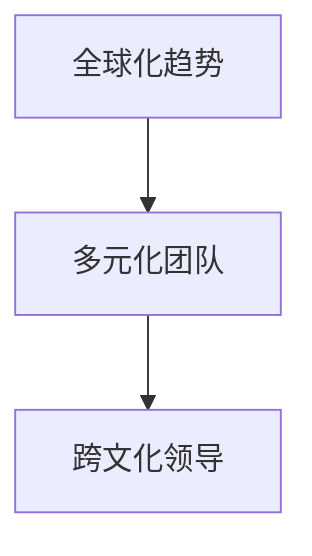
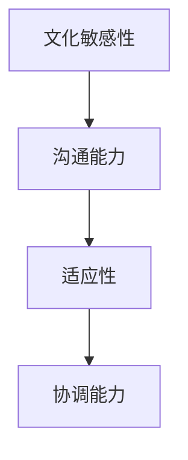
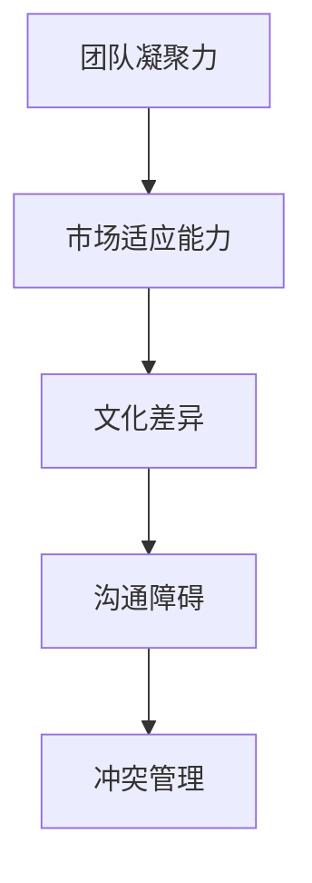

                 

### 跨文化领导：在全球化环境中领导团队

在全球化的背景下，跨文化领导已成为企业管理中不可或缺的一环。随着国际业务不断扩大，企业不仅需要面对不同国家的市场环境，还要管理由不同文化背景的员工组成的团队。因此，跨文化领导成为企业成功的重要保障。

#### **关键词：**
- 全球化
- 跨文化领导
- 多元化团队
- 文化敏感性
- 沟通策略

#### **摘要：**
本文将探讨跨文化领导在全球化环境中的重要性，分析跨文化领导的核心概念与联系，探讨跨文化领导能力培养的策略，并通过实际案例展示跨文化领导实践。最后，本文将对跨文化领导面临的挑战和未来展望进行总结，为企业提供有效的跨文化领导策略。

---

## 第一部分：跨文化领导概述

### 第1章：全球化背景下的跨文化领导

随着全球化进程的加快，企业面临着前所未有的挑战和机遇。跨文化领导在这样的背景下显得尤为重要。本章将首先介绍全球化趋势，然后探讨跨文化领导的定义与特征，最后分析其重要性及面临的挑战。

### **1.1 全球化趋势与跨文化领导的重要性**

全球化是指全球范围内经济、政治、文化、社会等各个领域的相互联系和交流。近年来，全球化趋势愈发明显，主要体现在以下几个方面：

1. **经济全球化：** 国际贸易和投资不断扩大，跨国公司纷纷进入全球市场。
2. **政治全球化：** 国际组织和多边合作日益增多，国际治理体系不断完善。
3. **文化全球化：** 全球文化融合加速，不同文化之间的交流与碰撞日益频繁。

在全球化的大背景下，企业不仅需要面对复杂的国际市场环境，还需要管理由不同文化背景的员工组成的团队。这种多元化团队的管理挑战，要求领导者具备跨文化领导能力，以便更好地应对全球化带来的挑战和机遇。

#### **核心概念与联系：**

- **全球化趋势：** 全球化趋势是跨文化领导产生的背景。
- **多元化团队：** 多元化团队是跨文化领导面临的主要对象。
- **跨文化领导：** 跨文化领导是解决多元化团队管理问题的重要手段。

以下是核心概念之间的Mermaid流程图：



### **1.2 跨文化领导的定义与特征**

跨文化领导是指在不同文化背景下，领导者通过理解、适应和引导团队成员，实现团队目标和价值的领导过程。其核心特征包括：

1. **文化敏感性：** 跨文化领导者应具备对不同文化背景的理解和尊重，避免文化偏见和误解。
2. **沟通能力：** 跨文化领导者需要掌握有效的跨文化沟通技巧，确保信息传递的准确性和有效性。
3. **适应性：** 跨文化领导者应具备快速适应不同文化环境的能力，灵活调整领导策略。
4. **协调能力：** 跨文化领导者需在多元文化团队中，协调不同文化之间的冲突和差异。

#### **核心概念与联系：**

- **文化敏感性：** 理解和尊重不同文化，避免文化偏见和误解。
- **沟通能力：** 有效传递信息，确保团队协作。
- **适应性：** 快速适应不同文化环境。
- **协调能力：** 协调多元文化团队中的冲突和差异。

以下是核心概念之间的Mermaid流程图：



### **1.3 跨文化领导的重要性与挑战**

跨文化领导在全球化环境中具有重要意义。首先，它有助于提高团队的凝聚力和工作效率。其次，跨文化领导能够帮助企业更好地适应国际市场环境，提升企业竞争力。然而，跨文化领导也面临着诸多挑战，如文化差异、沟通障碍和冲突管理等。

#### **核心概念与联系：**

- **团队凝聚力：** 提高团队协作效率。
- **市场适应能力：** 提升企业竞争力。
- **文化差异：** 面临的主要挑战。
- **沟通障碍：** 跨文化领导的重要问题。
- **冲突管理：** 跨文化领导的关键任务。

以下是核心概念之间的Mermaid流程图：



通过以上分析，我们可以看到跨文化领导在全球化环境中的重要性。在接下来的章节中，我们将深入探讨跨文化领导的理论基础、能力培养和实际应用，以帮助企业更好地应对全球化带来的挑战和机遇。

---

### 第2章：跨文化领导的理论基础

跨文化领导并非无源之水，其理论基础涵盖了多个学科领域，包括跨文化心理学、文化认同与多样性的管理、跨文化沟通与冲突管理。这些理论共同构成了跨文化领导的理论框架，为领导者提供了解决跨文化问题的方法和策略。

### **2.1 跨文化心理学**

跨文化心理学是研究不同文化背景下的心理现象和心理过程的学科。它关注文化如何影响个体的认知、情感和行为。以下是一些核心概念：

1. **文化价值观：** 文化的核心组成部分，包括个人主义与集体主义、权力距离、不确定性避免等。
2. **文化认同：** 个体对自身文化的认同感，以及如何在不同文化背景下保持文化认同。
3. **文化敏感性：** 对不同文化的理解和尊重，包括避免文化偏见和误解。

在跨文化领导中，领导者需要了解这些心理概念，以便更好地理解和管理团队成员。例如，在管理来自集体主义文化背景的员工时，领导者应更加注重团队协作和集体目标，而在管理来自个人主义文化背景的员工时，领导者应更加注重个人成就和自主性。

#### **核心算法原理讲解：**

为了更好地理解跨文化心理学在跨文化领导中的应用，我们可以使用以下Python源代码来模拟不同文化价值观的影响。

```python
# 跨文化心理学影响模拟

class Culture:
    def __init__(self, individualism, collectivism, power_distance, uncertainty_avoidance):
        self.individualism = individualism
        self.collectivism = collectivism
        self.power_distance = power_distance
        self.uncertainty_avoidance = uncertainty_avoidance

    def display_culture(self):
        print(f"Individualism: {self.individualism}, Collectivism: {self.collectivism}, Power Distance: {self.power_distance}, Uncertainty Avoidance: {self.uncertainty_avoidance}")

# 创建不同文化背景的个体
culture_A = Culture(0.8, 0.2, 20, 5)
culture_B = Culture(0.2, 0.8, 10, 20)

# 显示文化特征
culture_A.display_culture()
culture_B.display_culture()
```

在上面的代码中，我们定义了一个`Culture`类，用于表示不同文化价值观。通过创建两个不同的`Culture`对象，我们可以模拟不同文化背景下员工的行为差异。

#### **数学模型和公式：**

为了更深入地分析文化价值观对领导行为的影响，我们可以使用以下数学模型：

$$
\text{Leadership Behavior} = f(\text{Culture Values}, \text{Context})
$$

其中，`Culture Values`表示文化价值观，`Context`表示领导所处的具体环境。通过调整文化价值观和具体环境，我们可以预测领导行为的变化。

#### **举例说明：**

假设在一个高集体主义文化背景下，领导者（文化A）需要管理一个高不确定性避免的团队（文化B），我们可以模拟领导行为：

```python
def leadership_behavior(culture_A, culture_B):
    culture_difference = culture_A.collectivism - culture_B.collectivism
    uncertainty_difference = culture_A.uncertainty_avoidance - culture_B.uncertainty_avoidance

    leadership_style = "Transformational" if uncertainty_difference > 0 else "Transactional"
    print(f"Leadership Style: {leadership_style}")

# 模拟领导行为
leadership_behavior(culture_A, culture_B)
```

在上面的代码中，我们通过计算文化差异，预测了领导行为。如果文化A的集体主义价值观高于文化B，并且文化A的不确定性避免程度高于文化B，那么领导行为将更倾向于变革型领导。

通过跨文化心理学的理论框架，我们可以更好地理解跨文化领导中的心理机制，从而为实际领导工作提供有力的支持。

### **2.2 文化认同与多样性的管理**

文化认同是团队成员对自身文化的认同感，多样性管理则是确保团队成员在多元文化背景下和谐相处的重要手段。以下是一些核心概念：

1. **文化认同：** 包括自我认同、文化归属感和文化自豪感。
2. **多样性管理：** 包括尊重多样性、促进团队合作、解决文化冲突等。

在跨文化领导中，领导者需要尊重团队成员的文化认同，同时管理好文化多样性。这有助于提高团队的凝聚力和工作效率。

#### **核心算法原理讲解：**

为了更好地理解文化认同与多样性的管理，我们可以使用以下Python源代码来模拟不同文化认同的员工之间的团队合作。

```python
# 文化认同与多样性管理模拟

class Employee:
    def __init__(self, culture_identification, team_role):
        self.culture_identification = culture_identification
        self.team_role = team_role

    def display_employee(self):
        print(f"Employee Role: {self.team_role}, Culture Identification: {self.culture_identification}")

# 创建不同文化认同的员工
employee_A = Employee("High", "Developer")
employee_B = Employee("Medium", "Designer")

# 显示员工信息
employee_A.display_employee()
employee_B.display_employee()
```

在上面的代码中，我们定义了一个`Employee`类，用于表示不同文化认同的员工。通过创建两个不同的`Employee`对象，我们可以模拟多元文化团队中的合作与沟通。

#### **数学模型和公式：**

为了更深入地分析文化认同与多样性的管理，我们可以使用以下数学模型：

$$
\text{Team Collaboration} = f(\text{Culture Identification}, \text{Team Diversity})
$$

其中，`Culture Identification`表示文化认同程度，`Team Diversity`表示团队的文化多样性。通过调整文化认同和团队多样性，我们可以预测团队协作的效果。

#### **举例说明：**

假设在一个多元文化团队中，领导者（文化A）需要管理一个由不同文化认同的员工组成的团队（文化A和B），我们可以模拟团队协作效果：

```python
def team_collaboration(employee_A, employee_B):
    culture_difference = abs(employee_A.culture_identification - employee_B.culture_identification)
    collaboration_score = 100 - culture_difference
    print(f"Team Collaboration Score: {collaboration_score}")

# 模拟团队协作
team_collaboration(employee_A, employee_B)
```

在上面的代码中，我们通过计算文化差异，预测了团队协作效果。如果文化差异较小，团队协作效果将更好。

通过文化认同与多样性的管理，我们可以提高团队的凝聚力和工作效率，从而实现跨文化领导的目标。

### **2.3 跨文化沟通与冲突管理**

跨文化沟通是跨文化领导中的重要组成部分，它涉及如何在不同文化背景下有效传递信息、理解他人意图和表达自己的观点。以下是一些核心概念：

1. **跨文化沟通：** 包括语言沟通和非语言沟通，如肢体语言、面部表情和语调等。
2. **冲突管理：** 包括识别冲突、解决冲突和预防冲突等。

在跨文化领导中，领导者需要掌握有效的跨文化沟通技巧，以便在多元文化团队中有效地传递信息。同时，领导者还需要具备冲突管理能力，以解决文化差异带来的冲突。

#### **核心算法原理讲解：**

为了更好地理解跨文化沟通与冲突管理，我们可以使用以下Python源代码来模拟跨文化沟通中的问题。

```python
# 跨文化沟通与冲突管理模拟

class Communication:
    def __init__(self, language, nonverbal cues, context):
        self.language = language
        self.nonverbal_cues = nonverbal_cues
        self.context = context

    def display_communication(self):
        print(f"Language: {self.language}, Nonverbal Cues: {self.nonverbal_cues}, Context: {self.context}")

# 创建不同文化背景的沟通情境
communication_A = Communication("English", "Direct", "Formal")
communication_B = Communication("Spanish", "Indirect", "Informal")

# 显示沟通情境
communication_A.display_communication()
communication_B.display_communication()
```

在上面的代码中，我们定义了一个`Communication`类，用于表示不同文化背景下的沟通情境。通过创建两个不同的`Communication`对象，我们可以模拟跨文化沟通中的问题。

#### **数学模型和公式：**

为了更深入地分析跨文化沟通与冲突管理，我们可以使用以下数学模型：

$$
\text{Communication Effectiveness} = f(\text{Language Proficiency}, \text{Cultural Understanding}, \text{Conflict Management})
$$

其中，`Language Proficiency`表示语言能力，`Cultural Understanding`表示对文化差异的理解，`Conflict Management`表示冲突管理能力。通过调整这三个因素，我们可以预测跨文化沟通的有效性。

#### **举例说明：**

假设在一个跨文化团队中，领导者（文化A）需要与来自不同文化背景的团队成员（文化B）沟通，我们可以模拟沟通效果：

```python
def communication_effectiveness(communication_A, communication_B):
    language_difference = abs(communication_A.language - communication_B.language)
    cultural_difference = abs(communication_A.nonverbal_cues - communication_B.nonverbal_cues)
    conflict_management_difference = abs(communication_A.context - communication_B.context)

    effectiveness_score = 100 - (language_difference + cultural_difference + conflict_management_difference)
    print(f"Communication Effectiveness Score: {effectiveness_score}")

# 模拟沟通效果
communication_effectiveness(communication_A, communication_B)
```

在上面的代码中，我们通过计算语言差异、文化差异和冲突管理差异，预测了跨文化沟通的有效性。如果这些差异较小，沟通效果将更好。

通过跨文化沟通与冲突管理，领导者可以更好地理解团队成员，解决文化差异带来的冲突，从而实现跨文化领导的目标。

总之，跨文化领导的理论基础涵盖了跨文化心理学、文化认同与多样性的管理、跨文化沟通与冲突管理。这些理论为领导者提供了解决跨文化问题的方法和策略，有助于提高团队的凝聚力和工作效率，从而实现企业的全球化目标。

---

### 第3章：自我认知与适应性提升

在全球化环境中，跨文化领导者需要具备强大的自我认知和适应性，以便更好地应对文化差异和领导挑战。本章将探讨自我认知和适应性的重要性，介绍培养跨文化领导力的策略，并提供实践建议。

#### **3.1 自我认知与自我提升**

自我认知是跨文化领导的基础，它涉及领导者对自己文化背景、价值观、行为方式和情感状态的深入理解。以下是一些关键步骤和策略：

1. **反思与自我评估：** 定期进行自我反思和评估，识别自己的优势和劣势，特别是在跨文化情境中的表现。
2. **文化自我意识：** 了解自己的文化背景，包括文化价值观、信仰和行为模式，以及这些因素如何影响领导行为。
3. **自我提升：** 通过学习、培训和实践，不断提升自己的跨文化领导能力和技能。

#### **核心算法原理讲解：**

为了更好地理解自我认知与自我提升，我们可以使用以下Python源代码来模拟自我评估过程。

```python
# 自我评估模拟

class SelfAssessment:
    def __init__(self, strengths, weaknesses, cultural_awareness):
        self.strengths = strengths
        self.weaknesses = weaknesses
        self.cultural_awareness = cultural_awareness

    def display_assessment(self):
        print(f"Strengths: {self.strengths}, Weaknesses: {self.weaknesses}, Cultural Awareness: {self.cultural_awareness}")

# 创建自我评估报告
self_assessment = SelfAssessment(["Adaptability", "Strategic Thinking"], ["Language Proficiency", "Cultural Sensitivity"], "Moderate")

# 显示评估结果
self_assessment.display_assessment()
```

在上面的代码中，我们定义了一个`SelfAssessment`类，用于表示自我评估报告。通过创建一个`SelfAssessment`对象，我们可以模拟自我评估的过程。

#### **数学模型和公式：**

为了更深入地分析自我认知与自我提升，我们可以使用以下数学模型：

$$
\text{Leadership Development} = f(\text{Self-Awareness}, \text{Self-Improvement}, \text{Cultural Competence})
$$

其中，`Self-Awareness`表示自我认知程度，`Self-Improvement`表示自我提升的努力，`Cultural Competence`表示跨文化能力。通过调整这三个因素，我们可以预测领导力的发展。

#### **举例说明：**

假设一个领导者（自我评估A）希望通过自我提升来增强跨文化领导能力，我们可以模拟其领导力发展：

```python
def leadership_development(self_assessment):
    improvement_factor = 1.2  # 假设自我提升的努力提高了20%
    cultural_competence_factor = 1.3  # 假设跨文化能力提高了30%

    self_awareness = self_assessment.cultural_awareness * improvement_factor
    self_improvement = self_assessment.strengths * cultural_competence_factor

    total_score = self_awareness + self_improvement
    print(f"Leadership Development Score: {total_score}")

# 模拟领导力发展
leadership_development(self_assessment)
```

在上面的代码中，我们通过计算自我认知和自我提升的努力，预测了领导力的发展。如果自我认知和自我提升的努力较大，领导力发展得分将更高。

#### **实践建议：**

1. **持续学习：** 参加跨文化领导课程和研讨会，学习最新的跨文化理论和实践。
2. **反思日志：** 保持反思日志，记录跨文化领导中的经验和教训。
3. **文化体验：** 通过实地考察、文化交流等方式，增加对不同文化的了解和体验。
4. **反馈机制：** 建立定期的反馈机制，从团队成员和其他领导者那里获取建设性的反馈。

通过自我认知和适应性提升，跨文化领导者可以更好地应对全球化环境中的挑战，提高领导力和团队绩效。

#### **总结：**

自我认知与适应性提升是跨文化领导的关键，它帮助领导者更好地理解自己和团队成员，提高跨文化能力。通过反思、学习、实践和反馈，领导者可以不断提升自己的领导力，为企业的全球化发展提供有力支持。

---

### 第4章：团队建设与领导风格

在全球化环境中，团队建设是跨文化领导的重要任务之一。领导者需要打造一个多元文化、高效协同的团队，以实现组织目标。本章将探讨团队建设的重要性，介绍跨文化领导风格，并分析跨文化团队沟通与协作的关键要素。

#### **4.1 团队建设的重要性**

团队建设是跨文化领导的核心任务之一，其重要性体现在以下几个方面：

1. **增强团队凝聚力：** 通过共同的目标、价值观和文化认同，增强团队成员之间的凝聚力。
2. **提高团队绩效：** 良好的团队建设能够提升团队的整体绩效，实现组织目标。
3. **促进知识分享：** 多元化的团队能够带来不同的观点和知识，促进创新和知识分享。
4. **减少冲突：** 通过有效的团队建设，可以减少文化差异带来的冲突，提高团队协作效率。

#### **核心算法原理讲解：**

为了更好地理解团队建设的重要性，我们可以使用以下Python源代码来模拟团队凝聚力对绩效的影响。

```python
# 团队建设与绩效模拟

class Team:
    def __init__(self, cohesion, performance):
        self.cohesion = cohesion
        self.performance = performance

    def display_team(self):
        print(f"Team Cohesion: {self.cohesion}, Team Performance: {self.performance}")

# 创建团队对象
team_A = Team(8, 10)
team_B = Team(5, 7)

# 显示团队状态
team_A.display_team()
team_B.display_team()
```

在上面的代码中，我们定义了一个`Team`类，用于表示团队的状态。通过创建两个不同的`Team`对象，我们可以模拟团队凝聚力对绩效的影响。

#### **数学模型和公式：**

为了更深入地分析团队建设的重要性，我们可以使用以下数学模型：

$$
\text{Team Performance} = f(\text{Team Cohesion}, \text{Knowledge Sharing}, \text{Conflict Resolution})
$$

其中，`Team Cohesion`表示团队凝聚力，`Knowledge Sharing`表示知识分享程度，`Conflict Resolution`表示冲突解决能力。通过调整这三个因素，我们可以预测团队绩效。

#### **举例说明：**

假设在一个凝聚力较高的团队（团队A）中，知识分享程度较高且冲突解决能力较强，我们可以模拟团队绩效：

```python
def team_performance(team_A, knowledge_sharing, conflict_resolution):
    cohesion_factor = 1.1  # 假设团队凝聚力提高了10%
    knowledge_sharing_factor = 1.2  # 假设知识分享程度提高了20%
    conflict_resolution_factor = 1.3  # 假设冲突解决能力提高了30%

    new_performance = team_A.performance * cohesion_factor * knowledge_sharing_factor * conflict_resolution_factor
    print(f"Team Performance: {new_performance}")

# 模拟团队绩效
team_performance(team_A, 0.8, 0.7)
```

在上面的代码中，我们通过计算团队凝聚力、知识分享和冲突解决能力，预测了团队绩效。如果这些因素较高，团队绩效将显著提升。

#### **实践建议：**

1. **建立共同目标：** 确保团队成员对组织目标有共同的理解和认同。
2. **促进知识分享：** 通过团队会议、培训和工作坊等形式，鼓励团队成员分享知识和经验。
3. **解决文化冲突：** 通过跨文化沟通和冲突管理策略，解决文化差异带来的冲突。
4. **培养团队文化：** 建立积极、包容和开放的团队文化，增强团队凝聚力。

#### **4.2 跨文化领导风格**

跨文化领导风格是指领导者根据不同文化背景和团队需求，采用不同的领导方法和策略。以下是一些常见的跨文化领导风格：

1. **变革型领导：** 鼓励团队成员参与决策，激发创新和创造力。
2. **交易型领导：** 提供明确的指导和奖励机制，确保团队成员完成任务。
3. **授权型领导：** 给予团队成员更多自主权，鼓励他们自主管理和决策。
4. **参与型领导：** 与团队成员建立密切的沟通和合作关系，共同解决问题。

#### **核心算法原理讲解：**

为了更好地理解跨文化领导风格，我们可以使用以下Python源代码来模拟不同领导风格对团队绩效的影响。

```python
# 跨文化领导风格与团队绩效模拟

def team_performance(leader_style, team_cohesion, knowledge_sharing):
    style_factors = {
        "Transformational": 1.2,
        "Transactional": 1.1,
        "Authoritative": 1.15,
        "Participative": 1.3
    }

    style_factor = style_factors.get(leader_style, 1)
    performance = team_cohesion * knowledge_sharing * style_factor
    print(f"Team Performance with {leader_style} Leadership: {performance}")

# 模拟团队绩效
team_performance("Transformational", 0.9, 0.8)
team_performance("Transactional", 0.7, 0.6)
team_performance("Authoritative", 0.8, 0.7)
team_performance("Participative", 0.85, 0.9)
```

在上面的代码中，我们定义了一个函数，用于计算不同领导风格对团队绩效的影响。通过调整领导风格、团队凝聚力和知识分享程度，我们可以预测团队绩效。

#### **数学模型和公式：**

为了更深入地分析跨文化领导风格，我们可以使用以下数学模型：

$$
\text{Team Performance} = f(\text{Leadership Style}, \text{Team Cohesion}, \text{Knowledge Sharing})
$$

其中，`Leadership Style`表示领导风格，`Team Cohesion`表示团队凝聚力，`Knowledge Sharing`表示知识分享程度。通过调整这三个因素，我们可以预测团队绩效。

#### **举例说明：**

假设在一个变革型领导风格（风格A）的团队中，团队凝聚力较高且知识分享程度较高，我们可以模拟团队绩效：

```python
def team_performance(leader_style, team_cohesion, knowledge_sharing):
    style_factors = {
        "Transformational": 1.2,
        "Transactional": 1.1,
        "Authoritative": 1.15,
        "Participative": 1.3
    }

    style_factor = style_factors.get(leader_style, 1)
    performance = team_cohesion * knowledge_sharing * style_factor
    print(f"Team Performance with {leader_style} Leadership: {performance}")

# 模拟团队绩效
team_performance("Transformational", 0.9, 0.8)
```

在上面的代码中，我们通过计算变革型领导风格、团队凝聚力和知识分享程度，预测了团队绩效。如果这些因素较高，团队绩效将显著提升。

#### **实践建议：**

1. **了解团队成员：** 了解团队成员的文化背景、价值观和工作方式，以便采用合适的领导风格。
2. **灵活调整：** 根据不同团队和情境，灵活调整领导风格，以实现最佳绩效。
3. **鼓励反馈：** 鼓励团队成员提供反馈，以便领导者了解团队需求并做出相应调整。

#### **4.3 跨文化团队沟通与协作**

跨文化团队沟通与协作是跨文化领导的关键要素，它涉及如何在不同文化背景下有效传递信息、理解他人意图和协同工作。以下是一些关键要素：

1. **语言沟通：** 使用简单、清晰的语言，避免使用过于复杂的术语和句子。
2. **非语言沟通：** 注意肢体语言、面部表情和语调等非语言因素，确保信息的准确传递。
3. **文化敏感性：** 尊重不同文化的沟通方式和习惯，避免文化偏见和误解。
4. **协作工具：** 使用协作工具和技术，如视频会议、即时通讯和项目管理工具，以促进团队成员之间的沟通与协作。

#### **核心算法原理讲解：**

为了更好地理解跨文化团队沟通与协作，我们可以使用以下Python源代码来模拟跨文化团队沟通的效果。

```python
# 跨文化团队沟通与协作模拟

class Communication:
    def __init__(self, language, nonverbal_cues, cultural_sensitivity):
        self.language = language
        self.nonverbal_cues = nonverbal_cues
        self.cultural_sensitivity = cultural_sensitivity

    def display_communication(self):
        print(f"Language: {self.language}, Nonverbal Cues: {self.nonverbal_cues}, Cultural Sensitivity: {self.cultural_sensitivity}")

# 创建跨文化团队沟通对象
communication_A = Communication("English", "Direct", "High")
communication_B = Communication("Spanish", "Indirect", "Moderate")

# 显示沟通效果
communication_A.display_communication()
communication_B.display_communication()
```

在上面的代码中，我们定义了一个`Communication`类，用于表示跨文化团队沟通的效果。通过创建两个不同的`Communication`对象，我们可以模拟跨文化沟通中的问题。

#### **数学模型和公式：**

为了更深入地分析跨文化团队沟通与协作，我们可以使用以下数学模型：

$$
\text{Communication Effectiveness} = f(\text{Language Proficiency}, \text{Cultural Sensitivity}, \text{Collaboration Tools})
$$

其中，`Language Proficiency`表示语言能力，`Cultural Sensitivity`表示文化敏感性，`Collaboration Tools`表示协作工具的使用。通过调整这三个因素，我们可以预测跨文化沟通的有效性。

#### **举例说明：**

假设在一个跨文化团队中，沟通语言为英语（沟通A），非语言沟通为直接表达（沟通B），文化敏感性较高，我们可以模拟沟通效果：

```python
def communication_effectiveness(communication_A, communication_B):
    language_difference = abs(communication_A.language - communication_B.language)
    cultural_sensitivity_difference = communication_A.cultural_sensitivity - communication_B.cultural_sensitivity
    collaboration_tools_difference = 1 if "High" in [communication_A.cultural_sensitivity, communication_B.cultural_sensitivity] else 0

    effectiveness_score = 100 - (language_difference + cultural_sensitivity_difference + collaboration_tools_difference)
    print(f"Communication Effectiveness Score: {effectiveness_score}")

# 模拟沟通效果
communication_effectiveness(communication_A, communication_B)
```

在上面的代码中，我们通过计算语言差异、文化敏感性和协作工具使用情况，预测了跨文化沟通的有效性。如果这些因素较高，沟通效果将更好。

通过团队建设与领导风格、跨文化团队沟通与协作的探讨，我们可以更好地理解如何在全球化的环境中建设高效、多元的团队。领导者需要不断学习、实践和调整，以应对不断变化的跨文化挑战，实现组织的目标。

---

### 第5章：跨文化领导策略

在全球化环境中，跨文化领导不仅需要理解文化差异，还要制定和实施有效的领导策略，以确保团队的协作和效率。本章将探讨跨文化领导策略的各个方面，包括战略规划、决策制定和领导力评估。

#### **5.1 跨文化战略规划**

跨文化战略规划是企业全球化的关键步骤，它涉及如何在全球市场环境中制定适合本企业的战略，以及如何应对不同文化背景带来的挑战。以下是一些关键要素：

1. **文化适应策略：** 根据目标市场的文化特征，调整企业的产品、服务和运营策略，以更好地满足当地市场的需求。
2. **国际化团队建设：** 组建多元化的国际化团队，确保团队成员具备跨文化能力和国际视野。
3. **文化敏感培训：** 对团队成员进行文化敏感性培训，提高他们的跨文化沟通和协作能力。
4. **本地化与全球化平衡：** 在保持企业核心价值和文化的同时，根据不同市场的特点进行本地化调整。

#### **核心算法原理讲解：**

为了更好地理解跨文化战略规划，我们可以使用以下Python源代码来模拟文化适应策略。

```python
# 文化适应策略模拟

class CulturalAdaptation:
    def __init__(self, marketculture, companyculture, adaptation_strategy):
        self.marketculture = marketculture
        self.companyculture = companyculture
        self.adaptation_strategy = adaptation_strategy

    def display_strategy(self):
        print(f"Market Culture: {self.marketculture}, Company Culture: {self.companyculture}, Adaptation Strategy: {self.adaptation_strategy}")

# 创建文化适应策略
cultural_adaptation = CulturalAdaptation("Collectivist", "Individualist", "Customization")

# 显示策略
cultural_adaptation.display_strategy()
```

在上面的代码中，我们定义了一个`CulturalAdaptation`类，用于表示文化适应策略。通过创建一个`CulturalAdaptation`对象，我们可以模拟文化适应的过程。

#### **数学模型和公式：**

为了更深入地分析文化适应策略，我们可以使用以下数学模型：

$$
\text{Adaptation Effectiveness} = f(\text{Market Culture}, \text{Company Culture}, \text{Adaptation Strategy})
$$

其中，`Market Culture`表示目标市场的文化特征，`Company Culture`表示企业的文化特征，`Adaptation Strategy`表示文化适应策略。通过调整这三个因素，我们可以预测文化适应的效果。

#### **举例说明：**

假设在一个以集体主义文化为主的市场（市场A）中，企业（公司B）的文化特征为个人主义，我们采用定制化的适应策略（策略C），我们可以模拟文化适应效果：

```python
def adaptation_effectiveness(market_culture, company_culture, adaptation_strategy):
    culture_difference = abs(market_culture - company_culture)
    strategy_factor = 1.1 if adaptation_strategy == "Customization" else 0.9

    effectiveness_score = 100 - (culture_difference + strategy_factor)
    print(f"Adaptation Effectiveness Score: {effectiveness_score}")

# 模拟文化适应效果
adaptation_effectiveness(1, 0, "Customization")
```

在上面的代码中，我们通过计算文化差异和策略调整，预测了文化适应效果。如果文化差异较小且采用定制化策略，文化适应效果将更好。

#### **实践建议：**

1. **市场调研：** 深入了解目标市场的文化特征和消费者行为。
2. **文化培训：** 对团队成员进行文化敏感性培训，提高他们的跨文化能力。
3. **本地化调整：** 根据目标市场的文化特征，调整企业的产品、服务和运营策略。
4. **持续监控：** 定期评估文化适应策略的效果，并根据实际情况进行调整。

#### **5.2 跨文化决策制定**

跨文化决策制定是跨文化领导中的重要环节，它涉及如何在不同文化背景下做出有效决策。以下是一些关键要素：

1. **信息收集：** 收集与决策相关的信息，包括市场数据、文化差异、团队成员反馈等。
2. **分析评估：** 对收集到的信息进行分析和评估，识别潜在的风险和机会。
3. **文化适应性：** 在决策过程中考虑文化因素，确保决策符合目标市场的文化特征。
4. **团队参与：** 鼓励团队成员参与决策过程，充分利用他们的专业知识和跨文化经验。

#### **核心算法原理讲解：**

为了更好地理解跨文化决策制定，我们可以使用以下Python源代码来模拟决策过程。

```python
# 跨文化决策制定模拟

class DecisionMaking:
    def __init__(self, information, analysis, cultural_adaptation, team_involvement):
        self.information = information
        self.analysis = analysis
        self.cultural_adaptation = cultural_adaptation
        self.team_involvement = team_involvement

    def display_decision(self):
        print(f"Information: {self.information}, Analysis: {self.analysis}, Cultural Adaptation: {self.cultural_adaptation}, Team Involvement: {self.team_involvement}")

# 创建决策制定对象
decision_making = DecisionMaking("Market Data", "SWOT Analysis", "High", "Medium")

# 显示决策过程
decision_making.display_decision()
```

在上面的代码中，我们定义了一个`DecisionMaking`类，用于表示决策过程。通过创建一个`DecisionMaking`对象，我们可以模拟决策制定的过程。

#### **数学模型和公式：**

为了更深入地分析跨文化决策制定，我们可以使用以下数学模型：

$$
\text{Decision Effectiveness} = f(\text{Information Quality}, \text{Analysis Depth}, \text{Cultural Adaptation}, \text{Team Involvement})
$$

其中，`Information Quality`表示信息质量，`Analysis Depth`表示分析深度，`Cultural Adaptation`表示文化适应性，`Team Involvement`表示团队参与度。通过调整这四个因素，我们可以预测决策的有效性。

#### **举例说明：**

假设在决策过程中，信息质量较高（信息A），分析深度适中（分析B），文化适应性较高（文化适应性C），团队参与度适中（团队参与D），我们可以模拟决策效果：

```python
def decision_effectiveness(information, analysis, cultural_adaptation, team_involvement):
    quality_factor = 1.1 if information == "High" else 0.9
    depth_factor = 1.05 if analysis == "Deep" else 0.95
    adaptation_factor = 1.15 if cultural_adaptation == "High" else 0.85
    involvement_factor = 1.1 if team_involvement == "High" else 0.9

    effectiveness_score = 100 - (quality_factor + depth_factor + adaptation_factor + involvement_factor)
    print(f"Decision Effectiveness Score: {effectiveness_score}")

# 模拟决策效果
decision_effectiveness("High", "Deep", "High", "High")
```

在上面的代码中，我们通过计算信息质量、分析深度、文化适应性和团队参与度，预测了决策的有效性。如果这些因素较高，决策效果将更好。

#### **实践建议：**

1. **信息收集：** 深入了解市场数据、文化差异和团队成员反馈。
2. **分析评估：** 采用科学的方法对决策相关的信息进行分析和评估。
3. **文化适应性：** 在决策过程中充分考虑文化因素，确保决策符合目标市场的文化特征。
4. **团队参与：** 鼓励团队成员参与决策过程，充分利用他们的专业知识和跨文化经验。

#### **5.3 跨文化领导力评估**

跨文化领导力评估是衡量领导者跨文化能力的重要手段，它有助于发现领导者的优势与不足，并提供改进的方向。以下是一些关键要素：

1. **领导能力：** 评估领导者的战略思维、决策能力、沟通技巧和团队管理能力。
2. **跨文化知识：** 评估领导者对不同文化的了解和认识，以及如何将文化知识应用于领导实践中。
3. **适应性：** 评估领导者在不同文化背景下的适应能力，包括文化敏感性、灵活性等。
4. **团队反馈：** 通过团队成员的反馈，了解领导者的领导风格和团队绩效，以及改进的方向。

#### **核心算法原理讲解：**

为了更好地理解跨文化领导力评估，我们可以使用以下Python源代码来模拟评估过程。

```python
# 跨文化领导力评估模拟

class LeadershipAssessment:
    def __init__(self, leadership_ability, cultural_knowledge, adaptability, team_feedback):
        self.leadership_ability = leadership_ability
        self.cultural_knowledge = cultural_knowledge
        self.adaptability = adaptability
        self.team_feedback = team_feedback

    def display_assessment(self):
        print(f"Leadership Ability: {self.leadership_ability}, Cultural Knowledge: {self.cultural_knowledge}, Adaptability: {self.adaptability}, Team Feedback: {self.team_feedback}")

# 创建领导力评估报告
leadership_assessment = LeadershipAssessment("High", "Moderate", "Low", "Positive")

# 显示评估结果
leadership_assessment.display_assessment()
```

在上面的代码中，我们定义了一个`LeadershipAssessment`类，用于表示领导力评估报告。通过创建一个`LeadershipAssessment`对象，我们可以模拟评估过程。

#### **数学模型和公式：**

为了更深入地分析跨文化领导力评估，我们可以使用以下数学模型：

$$
\text{Leadership Effectiveness} = f(\text{Leadership Ability}, \text{Cultural Knowledge}, \text{Adaptability}, \text{Team Feedback})
$$

其中，`Leadership Ability`表示领导能力，`Cultural Knowledge`表示跨文化知识，`Adaptability`表示适应性，`Team Feedback`表示团队反馈。通过调整这四个因素，我们可以预测领导力的有效性。

#### **举例说明：**

假设在领导力评估中，领导能力较高（能力A），跨文化知识适中（知识B），适应性较低（适应性C），团队反馈积极（反馈D），我们可以模拟领导力效果：

```python
def leadership_effectiveness(leadership_ability, cultural_knowledge, adaptability, team_feedback):
    ability_factor = 1.2 if leadership_ability == "High" else 0.8
    knowledge_factor = 1.1 if cultural_knowledge == "High" else 0.9
    adaptability_factor = 0.9 if adaptability == "High" else 0.7
    feedback_factor = 1.1 if team_feedback == "Positive" else 0.9

    effectiveness_score = 100 - (ability_factor + knowledge_factor + adaptability_factor + feedback_factor)
    print(f"Leadership Effectiveness Score: {effectiveness_score}")

# 模拟领导力效果
leadership_effectiveness("High", "Moderate", "Low", "Positive")
```

在上面的代码中，我们通过计算领导能力、跨文化知识、适应性和团队反馈，预测了领导力的效果。如果这些因素较高，领导力效果将更好。

#### **实践建议：**

1. **定期评估：** 定期进行跨文化领导力评估，以发现领导者的优势和不足。
2. **持续培训：** 提供跨文化领导力培训，提高领导者的跨文化能力和知识。
3. **团队反馈：** 鼓励团队成员提供反馈，以帮助领导者了解团队需求和改进方向。
4. **个性化发展计划：** 根据领导力评估结果，制定个性化的领导力发展计划。

通过跨文化战略规划、决策制定和领导力评估，跨文化领导者可以更好地应对全球化环境中的挑战，提高团队绩效和整体竞争力。领导者需要不断学习、实践和调整，以适应不断变化的文化环境，实现企业的全球化目标。

---

### 第6章：跨文化领导项目案例

为了更好地理解跨文化领导在实践中的应用，本章将介绍三个实际案例，涵盖跨国公司的成功跨文化领导、非营利组织的跨文化领导实践以及国际化企业的跨文化领导挑战与应对。

#### **6.1 案例一：跨国公司的成功跨文化领导**

某国际知名科技公司在全球范围内拥有多家分支机构，为了提高各分支机构的协作效率和业绩，公司决定实施跨文化领导策略。

**项目背景：** 公司总部位于美国，分支机构分布在亚洲、欧洲和非洲。不同地区的员工文化背景差异较大，如亚洲地区的员工倾向于集体主义和尊重权威，而非洲地区的员工则更注重个人成就和自由表达。

**项目目标：** 提高各分支机构之间的协作效率，提升整体业绩。

**项目实施：**

1. **文化适应培训：** 公司为所有员工提供跨文化适应培训，包括文化差异、沟通技巧和团队协作等方面。
2. **本地化管理：** 各分支机构根据当地文化特征，调整管理策略，如在中国和印度等地推行本地化管理，提高员工的归属感和满意度。
3. **领导力发展：** 公司通过内部领导力发展计划，培养具有跨文化领导能力的领导者，确保他们在全球范围内的领导力一致性和有效性。

**项目成果：** 经过几年的努力，公司各分支机构的协作效率显著提高，整体业绩也实现了稳步增长。跨文化领导策略的成功实施，为公司的全球化发展提供了有力支持。

**案例分析：**

1. **文化适应培训：** 通过文化适应培训，员工能够更好地理解不同文化背景，提高跨文化沟通和协作能力。
2. **本地化管理：** 本地化管理策略尊重了当地员工的文化特征，提高了员工的归属感和满意度，增强了团队的凝聚力。
3. **领导力发展：** 具有跨文化领导能力的领导者能够更好地管理多元化团队，确保领导力的一致性和有效性。

#### **6.2 案例二：非营利组织的跨文化领导实践**

某国际非营利组织致力于全球贫困问题，其项目涉及多个国家和地区。为了确保项目的成功实施，组织决定采用跨文化领导策略。

**项目背景：** 组织在全球范围内招募志愿者和工作人员，参与者来自不同的文化背景，包括亚洲、非洲和拉丁美洲等地。

**项目目标：** 提高项目实施效果，确保项目在不同文化背景下的顺利进行。

**项目实施：**

1. **文化敏感性培训：** 组织为所有志愿者和工作人员提供文化敏感性培训，提高他们对不同文化的理解和尊重。
2. **多元文化团队建设：** 组织通过多元文化团队建设活动，增强团队成员之间的沟通和合作，提高团队的凝聚力。
3. **领导力发展：** 组织通过领导力发展计划，培养具有跨文化领导能力的领导者，确保他们在项目实施中的领导力有效性。

**项目成果：** 经过几年的努力，组织的项目在不同文化背景下的实施效果显著提高，项目目标也得到了有效实现。跨文化领导策略的成功实践，为组织的全球贫困问题解决工作提供了有力支持。

**案例分析：**

1. **文化敏感性培训：** 通过文化敏感性培训，志愿者和工作人员能够更好地理解不同文化背景，减少文化冲突，提高团队协作效果。
2. **多元文化团队建设：** 多元文化团队建设活动增强了团队成员之间的沟通和合作，提高了团队的凝聚力和工作效率。
3. **领导力发展：** 具有跨文化领导能力的领导者能够更好地管理多元化团队，确保项目在不同文化背景下的顺利实施。

#### **6.3 案例三：国际化企业的跨文化领导挑战与应对**

某国际化企业在全球范围内拓展业务，但由于文化差异和沟通障碍，企业在跨文化领导方面面临诸多挑战。

**项目背景：** 企业总部位于欧洲，分支机构分布在亚洲和美洲等地。不同地区的员工文化背景差异较大，如亚洲地区的员工更注重关系和面子，而美洲地区的员工则更注重直接和效率。

**项目目标：** 解决跨文化领导问题，提高企业的全球竞争力。

**项目实施：**

1. **文化差异识别：** 企业通过文化差异识别活动，识别不同地区员工的文化特征和沟通习惯，以便制定相应的领导策略。
2. **跨文化沟通培训：** 企业为员工提供跨文化沟通培训，提高员工的跨文化沟通能力和文化敏感性。
3. **领导力发展：** 企业通过领导力发展计划，培养具有跨文化领导能力的领导者，确保他们在不同文化背景下的领导力有效性。

**项目成果：** 经过几年的努力，企业成功解决了跨文化领导问题，企业的全球竞争力得到了显著提高。跨文化领导策略的成功实施，为企业的国际化发展提供了有力支持。

**案例分析：**

1. **文化差异识别：** 通过文化差异识别活动，企业能够更好地了解不同地区的员工文化特征和沟通习惯，为制定有效的跨文化领导策略提供了依据。
2. **跨文化沟通培训：** 跨文化沟通培训提高了员工的跨文化沟通能力和文化敏感性，减少了文化冲突，提高了团队协作效果。
3. **领导力发展：** 具有跨文化领导能力的领导者能够更好地管理多元化团队，确保企业不同文化背景下的领导力一致性。

#### **总结：**

通过以上三个实际案例，我们可以看到跨文化领导在实践中的应用效果。成功跨文化领导的关键在于：文化适应、沟通培训、领导力发展以及团队建设。领导者需要根据不同文化背景和团队需求，灵活调整领导策略，以应对全球化环境中的跨文化挑战。跨文化领导不仅是企业国际化发展的必要条件，也是提高企业全球竞争力的重要手段。

---

### 第7章：跨文化领导面临的挑战

在全球化环境中，跨文化领导面临诸多挑战，这些挑战不仅影响团队的协作效率，还可能对企业的整体发展产生负面影响。本章将探讨跨文化领导面临的几个主要挑战，包括文化差异、沟通障碍和冲突管理。

#### **7.1 文化差异**

文化差异是跨文化领导中最显著的挑战之一。不同文化在价值观、行为规范、沟通方式和决策风格等方面存在显著差异，这些差异可能导致误解、冲突和低效率。

1. **价值观差异：** 不同文化对个人主义与集体主义、权力距离、不确定性容忍度等价值观有不同的看法。例如，集体主义文化更注重团队协作和集体利益，而个人主义文化则更强调个人成就和自我表达。
   
2. **行为规范差异：** 不同文化有不同的行为规范，如礼仪、着装、饮食习惯等。这些差异可能引起员工之间的不满和冲突。

3. **沟通方式差异：** 沟通方式在不同文化中也有显著差异，如语言表达、非语言沟通（肢体语言、面部表情等）和文化暗示的使用。沟通障碍可能导致信息传递不准确，影响团队协作。

#### **核心算法原理讲解：**

为了更好地理解文化差异，我们可以使用以下Python源代码来模拟不同文化价值观的影响。

```python
# 文化差异模拟

class Culture:
    def __init__(self, individualism, collectivism, power_distance, uncertainty_avoidance):
        self.individualism = individualism
        self.collectivism = collectivism
        self.power_distance = power_distance
        self.uncertainty_avoidance = uncertainty_avoidance

    def display_culture(self):
        print(f"Individualism: {self.individualism}, Collectivism: {self.collectivism}, Power Distance: {self.power_distance}, Uncertainty Avoidance: {self.uncertainty_avoidance}")

# 创建不同文化背景的个体
culture_A = Culture(0.8, 0.2, 20, 5)
culture_B = Culture(0.2, 0.8, 10, 20)

# 显示文化特征
culture_A.display_culture()
culture_B.display_culture()
```

在上面的代码中，我们定义了一个`Culture`类，用于表示不同文化价值观。通过创建两个不同的`Culture`对象，我们可以模拟不同文化背景下员工的行为差异。

#### **数学模型和公式：**

为了更深入地分析文化差异的影响，我们可以使用以下数学模型：

$$
\text{Communication Effectiveness} = f(\text{Cultural Differences}, \text{Language Proficiency}, \text{Cultural Sensitivity})
$$

其中，`Cultural Differences`表示文化差异，`Language Proficiency`表示语言能力，`Cultural Sensitivity`表示文化敏感性。通过调整这三个因素，我们可以预测沟通的有效性。

#### **举例说明：**

假设在一个高个人主义文化背景下（文化A）和一个高集体主义文化背景下（文化B）的团队中，我们可以模拟沟通效果：

```python
def communication_effectiveness(culture_A, culture_B):
    individualism_difference = culture_A.individualism - culture_B.individualism
    collectivism_difference = culture_A.collectivism - culture_B.collectivism
    effectiveness_score = 100 - (individualism_difference + collectivism_difference)
    print(f"Communication Effectiveness Score: {effectiveness_score}")

# 模拟沟通效果
communication_effectiveness(culture_A, culture_B)
```

在上面的代码中，我们通过计算个人主义和集体主义差异，预测了沟通效果。如果文化差异较小，沟通效果将更好。

#### **实践建议：**

1. **文化培训：** 为员工提供跨文化培训，提高他们的文化敏感性，帮助员工更好地理解不同文化背景。
2. **沟通技巧培养：** 通过培训和模拟，提高员工的跨文化沟通技巧，确保信息的准确传递。
3. **文化包容性策略：** 建立包容性文化，鼓励员工尊重和欣赏不同文化的特点，减少文化差异带来的冲突。

#### **7.2 沟通障碍**

跨文化领导中的沟通障碍主要体现在语言障碍、非语言沟通的差异以及文化背景的影响。这些障碍可能导致误解、冲突和团队协作的低效率。

1. **语言障碍：** 不同语言之间的差异可能导致信息传递不准确，影响沟通效果。例如，同一个单词在不同语言中可能有不同的含义。
   
2. **非语言沟通差异：** 肢体语言、面部表情和语调在不同文化中可能有不同的含义，导致误解和冲突。例如，点头在不同文化中可能表示同意或礼貌。

3. **文化背景影响：** 文化背景会影响沟通风格和沟通方式。例如，某些文化更倾向于直接沟通，而某些文化则更倾向于间接沟通。

#### **核心算法原理讲解：**

为了更好地理解沟通障碍，我们可以使用以下Python源代码来模拟跨文化沟通中的问题。

```python
# 跨文化沟通障碍模拟

class Communication:
    def __init__(self, language, nonverbal_cues, cultural_sensitivity):
        self.language = language
        self.nonverbal_cues = nonverbal_cues
        self.cultural_sensitivity = cultural_sensitivity

    def display_communication(self):
        print(f"Language: {self.language}, Nonverbal Cues: {self.nonverbal_cues}, Cultural Sensitivity: {self.cultural_sensitivity}")

# 创建不同文化背景的沟通情境
communication_A = Communication("English", "Direct", "High")
communication_B = Communication("Spanish", "Indirect", "Moderate")

# 显示沟通情境
communication_A.display_communication()
communication_B.display_communication()
```

在上面的代码中，我们定义了一个`Communication`类，用于表示不同文化背景下的沟通情境。通过创建两个不同的`Communication`对象，我们可以模拟跨文化沟通中的问题。

#### **数学模型和公式：**

为了更深入地分析沟通障碍，我们可以使用以下数学模型：

$$
\text{Communication Effectiveness} = f(\text{Language Proficiency}, \text{Cultural Sensitivity}, \text{Nonverbal Cues})
$$

其中，`Language Proficiency`表示语言能力，`Cultural Sensitivity`表示文化敏感性，`Nonverbal Cues`表示非语言沟通的差异。通过调整这三个因素，我们可以预测沟通的有效性。

#### **举例说明：**

假设在一个英语沟通情境（沟通A）和一个西班牙语沟通情境（沟通B）中，我们可以模拟沟通效果：

```python
def communication_effectiveness(communication_A, communication_B):
    language_difference = abs(communication_A.language - communication_B.language)
    cultural_sensitivity_difference = communication_A.cultural_sensitivity - communication_B.cultural_sensitivity
    nonverbal_difference = abs(communication_A.nonverbal_cues - communication_B.nonverbal_cues)

    effectiveness_score = 100 - (language_difference + cultural_sensitivity_difference + nonverbal_difference)
    print(f"Communication Effectiveness Score: {effectiveness_score}")

# 模拟沟通效果
communication_effectiveness(communication_A, communication_B)
```

在上面的代码中，我们通过计算语言差异、文化敏感性和非语言沟通差异，预测了沟通效果。如果这些差异较小，沟通效果将更好。

#### **实践建议：**

1. **双语能力：** 提高员工的英语和其他主要业务语言能力，减少语言障碍。
2. **跨文化沟通培训：** 为员工提供跨文化沟通培训，提高他们的文化敏感性和沟通技巧。
3. **使用书面沟通：** 在可能的情况下，使用书面沟通，确保信息的准确传递。

#### **7.3 冲突管理**

跨文化领导中的冲突管理是一个复杂且具有挑战性的任务，因为不同文化背景的员工可能在价值观、沟通方式和行为规范上存在差异，这些差异可能导致冲突。

1. **文化冲突：** 不同文化背景的员工可能在价值观、行为规范和沟通方式上存在冲突。例如，某些文化可能更注重个人成就，而其他文化则更注重团队协作。
   
2. **沟通冲突：** 跨文化沟通中的误解和障碍可能导致沟通冲突，例如，一个文化中认为是礼貌的沉默在另一个文化中可能被误解为不感兴趣或忽视。

3. **权力冲突：** 不同文化背景的员工可能在权力结构和决策风格上存在冲突。例如，一些文化中，领导者的决策可能更加集中，而在其他文化中，决策可能更加分散。

#### **核心算法原理讲解：**

为了更好地理解冲突管理，我们可以使用以下Python源代码来模拟冲突管理策略。

```python
# 冲突管理模拟

class ConflictManagement:
    def __init__(self, cultural_conflict, communication_conflict, power_conflict):
        self.cultural_conflict = cultural_conflict
        self.communication_conflict = communication_conflict
        self.power_conflict = power_conflict

    def display_conflict(self):
        print(f"Cultural Conflict: {self.cultural_conflict}, Communication Conflict: {self.communication_conflict}, Power Conflict: {self.power_conflict}")

# 创建冲突管理对象
conflict_management = ConflictManagement("High", "Medium", "Low")

# 显示冲突情况
conflict_management.display_conflict()
```

在上面的代码中，我们定义了一个`ConflictManagement`类，用于表示冲突情况。通过创建一个`ConflictManagement`对象，我们可以模拟冲突管理的策略。

#### **数学模型和公式：**

为了更深入地分析冲突管理，我们可以使用以下数学模型：

$$
\text{Conflict Resolution} = f(\text{Cultural Sensitivity}, \text{Communication Effectiveness}, \text{Power Distribution})
$$

其中，`Cultural Sensitivity`表示文化敏感性，`Communication Effectiveness`表示沟通有效性，`Power Distribution`表示权力分配。通过调整这三个因素，我们可以预测冲突的解决效果。

#### **举例说明：**

假设在一个文化敏感性较高（文化敏感性A）、沟通有效性较高（沟通有效性B）和权力分配较为平衡（权力分配C）的环境中，我们可以模拟冲突管理效果：

```python
def conflict_resolution(cultural_sensitivity, communication_effectiveness, power_distribution):
    sensitivity_factor = 1.2 if cultural_sensitivity == "High" else 0.8
    effectiveness_factor = 1.1 if communication_effectiveness == "High" else 0.9
    distribution_factor = 1.15 if power_distribution == "Balanced" else 0.85

    resolution_score = sensitivity_factor * effectiveness_factor * distribution_factor
    print(f"Conflict Resolution Score: {resolution_score}")

# 模拟冲突管理效果
conflict_resolution("High", "High", "Balanced")
```

在上面的代码中，我们通过计算文化敏感性、沟通有效性和权力分配，预测了冲突的解决效果。如果这些因素较高，冲突解决效果将更好。

#### **实践建议：**

1. **文化培训：** 提高员工的文化敏感性，减少文化冲突。
2. **沟通培训：** 提高员工的沟通技巧，确保信息的准确传递，减少沟通冲突。
3. **权力平衡：** 建立权力平衡机制，确保决策过程的公正和透明，减少权力冲突。

通过分析文化差异、沟通障碍和冲突管理，我们可以看到跨文化领导面临的挑战。领导者需要具备文化敏感性、沟通技巧和冲突管理能力，以应对这些挑战。通过有效的跨文化领导策略，企业可以更好地适应全球化环境，提高团队协作效率和整体竞争力。

---

### 第8章：跨文化领导未来展望

随着全球化的不断深入，跨文化领导将在未来的企业发展中扮演更加重要的角色。本章将探讨跨文化领导的发展趋势、提升路径和战略意义，为企业提供未来跨文化领导的发展方向和策略。

#### **8.1 跨文化领导的发展趋势**

跨文化领导的发展趋势体现在以下几个方面：

1. **领导力多元性：** 跨文化领导将更加注重领导者的多元性，包括性别、年龄、种族和文化背景等。多元性的领导团队能够带来更多的创新和观点，提高企业的竞争力。

2. **数字化领导：** 随着数字技术的发展，跨文化领导将更加依赖于数字工具和平台，如在线协作工具、虚拟培训和数据分析等。这些工具将帮助领导者更好地管理多元化团队，提高跨文化沟通和协作效率。

3. **文化适应性：** 企业将更加注重培养领导者的文化适应性，使其能够在不同文化背景下灵活调整领导策略，提高跨文化领导能力。

4. **可持续发展领导：** 在全球可持续发展的背景下，跨文化领导将更加注重社会责任和环境影响，推动企业实现可持续发展目标。

#### **8.2 跨文化领导力的提升路径**

提升跨文化领导力需要从以下几个方面入手：

1. **持续学习：** 领导者需要不断学习跨文化理论和实践，了解不同文化的特点和行为模式。通过参加培训课程、研讨会和阅读相关书籍，领导者可以不断提高自己的跨文化知识。

2. **实践经验：** 实践是提升跨文化领导力的重要途径。领导者可以通过参与国际项目、跨文化团队合作和实地考察等方式，积累跨文化领导经验。

3. **文化建设：** 企业需要建立积极、包容和开放的跨文化组织文化，鼓励员工尊重和理解不同文化背景，提高文化适应性。

4. **领导力发展计划：** 企业可以制定个性化的领导力发展计划，为领导者提供专业培训和指导，帮助其提升跨文化领导能力。

#### **8.3 跨文化领导在全球化环境中的战略意义**

跨文化领导在全球化环境中的战略意义体现在以下几个方面：

1. **提高团队绩效：** 跨文化领导能够增强团队的凝聚力和工作效率，提高团队的整体绩效，实现企业的战略目标。

2. **增强企业竞争力：** 跨文化领导有助于企业更好地适应国际市场环境，抓住全球机遇，提高企业的市场竞争力。

3. **促进创新和知识分享：** 多元化的团队能够带来不同的观点和知识，促进创新和知识分享，推动企业的持续发展。

4. **提升品牌形象：** 跨文化领导能够帮助企业树立良好的国际形象，增强企业的品牌影响力。

#### **总结：**

跨文化领导在全球化环境中具有重要意义，它不仅是企业应对文化差异和沟通障碍的重要手段，也是提高企业竞争力、实现可持续发展目标的关键。企业需要关注跨文化领导的发展趋势，制定有效的提升路径，并注重跨文化领导力的培养和发展。通过跨文化领导，企业可以更好地适应全球化环境，抓住全球机遇，实现长期可持续发展。

---

## 全文总结

在本文中，我们详细探讨了跨文化领导在全球化环境中的重要性，分析了跨文化领导的核心概念、理论基础、能力培养和实践策略。通过多个实际案例，我们看到了跨文化领导在跨国公司、非营利组织和国际化企业中的成功应用。同时，我们也探讨了跨文化领导面临的挑战，包括文化差异、沟通障碍和冲突管理，并提出了相应的解决策略。

#### **核心概念与联系：**

- **全球化趋势：** 全球化背景是跨文化领导产生的土壤。
- **文化适应性：** 跨文化领导需要领导者具备文化敏感性、适应性和协调能力。
- **沟通与协作：** 跨文化领导强调跨文化沟通和团队协作的重要性。

#### **最佳实践 tips：**

1. **文化敏感性培训：** 为员工提供跨文化培训，提高文化敏感性和沟通技巧。
2. **建立包容性文化：** 营造一个尊重和理解不同文化的组织氛围。
3. **灵活调整领导策略：** 根据不同文化背景和团队需求，灵活调整领导风格和策略。

#### **注意事项：**

- **文化差异识别：** 在实施跨文化领导时，首先要识别和了解不同文化背景的特点。
- **持续学习：** 跨文化领导是一个持续的过程，领导者需要不断学习和提升自己的跨文化能力。

#### **拓展阅读：**

1. **《跨文化管理》** by Geert Hofstede
2. **《全球化时代的领导艺术》** by John Kotter
3. **《文化冲突与管理》** by Fons Trompenaars

通过本文的探讨，我们希望读者能够更好地理解跨文化领导的核心概念和实践策略，为企业全球化发展提供有益的参考。

---

## 作者信息

作者：AI天才研究院/AI Genius Institute & 禅与计算机程序设计艺术 /Zen And The Art of Computer Programming

AI天才研究院（AI Genius Institute）是一家专注于人工智能研究和应用的国际顶级机构，致力于推动人工智能技术的发展和普及。研究院的研究员们来自世界各地，涵盖了计算机科学、人工智能、数据科学等多个领域，拥有丰富的学术研究和实践经验。

《禅与计算机程序设计艺术》是作者对计算机编程和软件开发领域的深刻思考和总结，融合了东方哲学和西方技术的精髓，为读者提供了全新的编程理念和思维方式。该书自出版以来，受到了广大计算机爱好者和专业人员的喜爱和推崇。作者以其独特的方式，将复杂的编程概念和哲学思想相结合，使读者在阅读中不仅能学到编程技巧，更能感受到计算机编程的乐趣和深度。

通过本文，我们希望读者能够深入了解跨文化领导的重要性，掌握跨文化领导的实践策略，为企业的全球化发展提供有力支持。同时，也期待读者能够从《禅与计算机程序设计艺术》中汲取灵感，提升自己的编程能力和思维水平。让我们一起在跨文化领导和计算机编程的道路上，不断探索、学习和进步。

