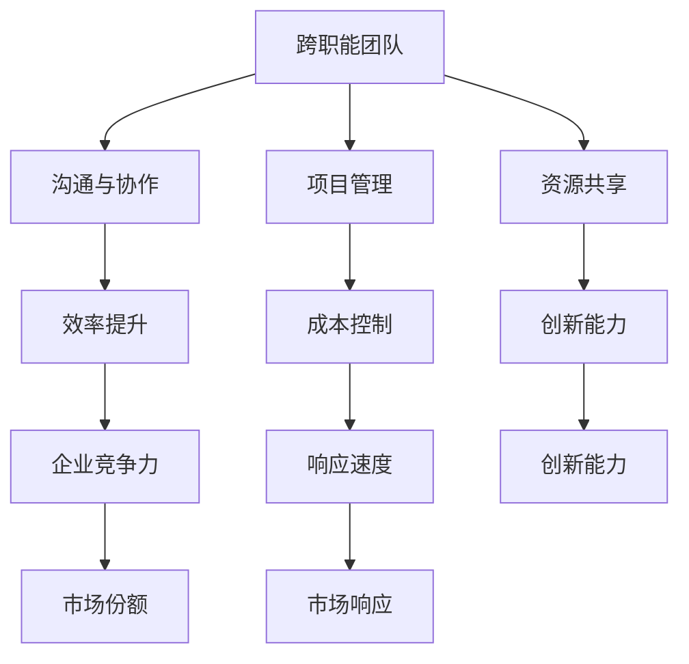

                 

### 跨职能协作：打破部门壁垒

在现代企业中，跨职能协作已成为提升组织效率和企业竞争力的重要手段。然而，部门之间的壁垒常常成为协作的障碍。本文将深入探讨跨职能协作的核心概念、原理、实践方法，以及工具与案例分析，旨在为读者提供一套完整的跨职能协作指南。

#### 关键词
- 跨职能协作
- 部门壁垒
- 敏捷开发
- 看板管理
- 沟通技巧
- 项目管理

#### 摘要
本文首先介绍了跨职能协作的基本概念和重要性，然后详细讲解了跨职能协作的方法论，包括团队建设、沟通技巧和项目管理。接着，本文探讨了敏捷开发、看板管理和虚拟团队协作等支持跨职能协作的工具与方法。最后，通过成功与失败的案例分析，总结了跨职能协作的最佳实践和注意事项。

## **背景介绍**

在传统的企业组织中，部门分工明确，每个部门专注于自己的领域，这种结构在提高专业化水平的同时，也造成了部门之间的隔阂。这种隔阂主要体现在以下几个方面：

1. **沟通障碍**：部门之间的沟通不畅，信息传递不及时，导致决策过程缓慢。
2. **资源浪费**：重复工作、资源分配不均，增加了企业的运营成本。
3. **响应速度**：由于部门之间的协调成本高，企业对外部变化的响应速度较慢。
4. **创新能力**：跨部门的合作不足，限制了创新能力的发挥。

为了解决这些问题，企业开始寻求一种新的协作方式，即跨职能协作。跨职能协作强调打破部门壁垒，促进不同部门之间的沟通与协作，以提高组织的整体效率。

### **核心概念与联系**

跨职能协作的核心概念包括：

1. **跨职能团队**：由来自不同部门的专业人员组成的团队，共同完成一项任务。
2. **沟通与协作**：团队成员之间的有效沟通和协作是实现跨职能协作的关键。
3. **项目管理**：项目管理者需要协调不同职能部门的工作，确保项目顺利进行。
4. **资源共享**：跨职能团队通过共享资源，实现资源的最大化利用。

这些核心概念之间的关系如图1所示：



### **原理讲解**

#### **跨职能团队的形成与运作**

跨职能团队的形成通常基于项目的需求。项目管理者根据项目目标，从不同部门挑选合适的专业人员组成跨职能团队。团队成员的角色和责任如下：

1. **项目经理**：负责项目的整体规划和管理。
2. **业务分析师**：负责需求分析和业务流程设计。
3. **开发人员**：负责软件设计和开发。
4. **测试人员**：负责软件测试和质量控制。
5. **市场人员**：负责市场分析和用户反馈。

跨职能团队的运作机制如下：

1. **定期会议**：团队成员定期举行会议，讨论项目进展和问题解决。
2. **任务分配**：根据团队成员的专长和项目需求，合理分配任务。
3. **资源共享**：团队成员共享工具、资源和知识，提高工作效率。
4. **反馈机制**：及时收集用户反馈，优化产品设计和功能。

#### **沟通与协作**

跨职能协作的成功离不开有效的沟通和协作。以下是一些关键的沟通和协作技巧：

1. **透明度**：确保项目信息和进展对团队成员公开，减少信息不对称。
2. **定期更新**：定期通过邮件、会议等方式更新项目进度和问题，保持团队成员之间的同步。
3. **即时沟通**：对于紧急问题和决策，采用即时通讯工具进行快速沟通。
4. **跨部门会议**：定期举行跨部门会议，解决跨部门协作中的问题。

#### **项目管理**

项目管理是跨职能协作的核心环节。以下是一些关键的项目管理原则：

1. **目标明确**：确保项目目标清晰，并得到团队成员的共识。
2. **计划合理**：制定详细的计划，包括任务分解、时间安排和资源分配。
3. **风险控制**：识别项目风险，并制定相应的应对措施。
4. **质量保证**：建立质量管理体系，确保项目交付的质量。

### **实践案例**

#### **成功案例**

**案例一：某大型电商平台的项目交付**

某大型电商平台在一次重大促销活动前，需要推出一款新功能，以提高用户购物体验。项目管理者从不同部门挑选了8名专业人员，组成了跨职能团队。团队成员包括产品经理、前端开发、后端开发、UI设计师、测试工程师和运营经理。

1. **团队建设**：团队成员在项目启动会上明确了项目目标，并制定了详细的计划。项目经理负责协调各部门的工作，确保项目顺利进行。
2. **沟通与协作**：团队采用看板管理工具，实时跟踪项目进度，并通过定期会议和即时通讯工具保持沟通。
3. **项目管理**：项目管理者制定了详细的时间表和里程碑，确保项目按计划推进。同时，建立了质量保证机制，确保功能交付的质量。

最终，该功能在促销活动前顺利上线，受到了用户的一致好评。跨职能协作的成功为电商平台带来了显著的市场竞争力。

#### **失败案例**

**案例二：某科技公司的产品研发失败**

某科技公司计划研发一款智能家居产品，但由于跨职能协作不力，导致项目失败。以下为失败原因分析：

1. **团队建设**：团队成员来自不同部门，缺乏共同的目标和协作意识。项目管理者没有有效地协调各部门的工作，导致任务分配不合理。
2. **沟通与协作**：团队成员之间的沟通不畅，信息传递不及时，导致项目进度严重滞后。同时，缺乏有效的反馈机制，导致问题得不到及时解决。
3. **项目管理**：项目管理者没有制定明确的项目计划和时间表，导致项目推进无序。缺乏质量保证机制，导致产品质量低下。

最终，该产品研发项目因质量问题而被取消。这次失败为科技公司敲响了警钟，促使他们在后续项目中加强了跨职能协作。

### **工具与方法**

#### **敏捷开发**

敏捷开发是一种以人为核心、迭代和逐步完善的项目管理方法。它强调快速响应变化、持续交付价值。敏捷开发的主要工具和方法包括：

1. **Scrum框架**：Scrum是一种常用的敏捷开发方法，包括产品待办列表、冲刺计划、每日站立会议、评审和回顾等环节。
2. **看板（Kanban）**：看板是一种视觉化管理工具，用于跟踪项目进度和优化流程。它通过可视化卡片展示任务状态，帮助团队成员了解项目进展。
3. **迭代开发**：敏捷开发采用迭代的方式逐步完善产品，每个迭代周期通常为2-4周。每个迭代结束后，团队进行评审和回顾，总结经验教训，为下一个迭代做准备。

#### **看板管理**

看板管理是一种基于精益思想的项目管理方法，旨在优化工作流程和提高效率。看板管理的主要工具和方法包括：

1. **看板板**：看板板是一种可视化工具，用于展示项目进度和任务状态。看板板通常包括任务卡片、状态列和工作区等组成部分。
2. **限制工作在流程中**：限制工作在流程中（Work-in-Progress, WIP）是看板管理的重要原则，旨在减少任务积压，提高工作效率。
3. **可视化任务状态**：通过可视化任务状态，团队成员可以直观地了解任务的进展情况，及时发现问题并采取纠正措施。

#### **虚拟团队协作**

虚拟团队协作是在远程办公和分布式团队日益普及的背景下产生的一种协作方式。虚拟团队协作的工具和方法包括：

1. **即时通讯工具**：如Slack、Microsoft Teams等，用于实时沟通和协作。
2. **项目管理工具**：如Trello、Jira等，用于任务分配、进度跟踪和协作。
3. **虚拟会议工具**：如Zoom、Microsoft Teams等，用于远程会议和视频沟通。
4. **云存储和协作平台**：如Google Drive、OneDrive等，用于文档共享和协作。

### **开发环境搭建与源代码实现**

在本节中，我们将以一个简单的跨职能协作项目为例，介绍开发环境搭建、源代码实现和代码解读。

#### **开发环境搭建**

1. **操作系统**：Windows/Linux/MacOS
2. **编程语言**：Python
3. **开发工具**：PyCharm/VS Code
4. **依赖管理**：pip
5. **版本控制**：Git

#### **源代码实现**

以下是一个简单的Python脚本，用于模拟跨职能协作中的任务分配和进度跟踪。

```python
import random
import time

class Task:
    def __init__(self, name, assigned_to, status="Pending"):
        self.name = name
        self.assigned_to = assigned_to
        self.status = status

    def update_status(self, new_status):
        self.status = new_status

    def __str__(self):
        return f"Task [{self.name}] assigned to {self.assigned_to} - Status: {self.status}"

def assign_tasks(team_members):
    tasks = []
    for member in team_members:
        task_name = f"Task for {member}"
        task = Task(task_name, member)
        tasks.append(task)
    return tasks

def execute_tasks(tasks):
    for task in tasks:
        if task.status == "Pending":
            task.update_status("In Progress")
            time.sleep(random.uniform(1, 3))
            task.update_status("Completed")
        else:
            print(f"Task {task.name} is already {task.status}.")

if __name__ == "__main__":
    team_members = ["Alice", "Bob", "Charlie", "Diana"]
    tasks = assign_tasks(team_members)
    print("Assigned Tasks:")
    for task in tasks:
        print(task)
    execute_tasks(tasks)
    print("\nCompleted Tasks:")
    for task in tasks:
        print(task)
```

#### **代码解读**

1. **类定义**：`Task` 类用于表示任务，包含任务名称、分配给的人员和任务状态。
2. **方法**：`update_status` 方法用于更新任务状态。
3. **函数**：`assign_tasks` 函数用于生成任务列表，`execute_tasks` 函数用于执行任务。
4. **主程序**：主程序中，我们首先生成任务列表，然后执行任务。

#### **实际案例分析与详细讲解剖析**

在本节中，我们将结合实际案例，分析跨职能协作中的关键问题和解决方案。

**案例：某科技公司产品研发项目**

1. **问题**：在产品研发过程中，跨部门协作不畅，导致项目进度延误。
2. **分析**：问题主要源于沟通不畅、任务分配不合理和缺乏项目管理机制。
3. **解决方案**：
   - **沟通与协作**：采用敏捷开发方法，定期举行站立会议和回顾会议，确保团队成员之间的沟通。
   - **任务分配**：明确每个团队成员的职责和任务，确保任务分配合理。
   - **项目管理**：采用Scrum框架，制定项目计划和时间表，确保项目按计划推进。

通过以上解决方案，该科技公司的产品研发项目得以顺利推进，最终成功交付。

### **最佳实践 tips**

1. **明确目标**：确保团队成员对项目目标有清晰的认识，并达成共识。
2. **合理分工**：根据团队成员的专长和项目需求，合理分配任务。
3. **定期沟通**：定期举行会议和回顾，确保项目进度和问题及时解决。
4. **透明度**：确保项目信息对团队成员公开，减少信息不对称。
5. **反馈机制**：建立反馈机制，及时收集用户和团队成员的意见，持续改进。

### **小结**

跨职能协作在现代企业中具有重要意义。通过有效的跨职能协作，企业可以提高效率、降低成本、提升创新能力。本文从核心概念、实践方法、工具与案例等多个角度，全面探讨了跨职能协作的各个方面。希望读者能通过本文，更好地理解和实践跨职能协作。

### **注意事项**

1. **团队成员的素质**：跨职能协作的成功离不开团队成员的专业素质和协作能力。
2. **文化的认同**：建立共同的企业文化和价值观，有助于跨职能协作的顺利进行。
3. **持续改进**：跨职能协作是一个持续改进的过程，需要不断优化和调整。

### **拓展阅读**

1. 《敏捷开发实践指南》
2. 《看板管理实践》
3. 《虚拟团队协作与沟通技巧》

### **作者信息**

作者：AI天才研究院/AI Genius Institute & 禅与计算机程序设计艺术 /Zen And The Art of Computer Programming

