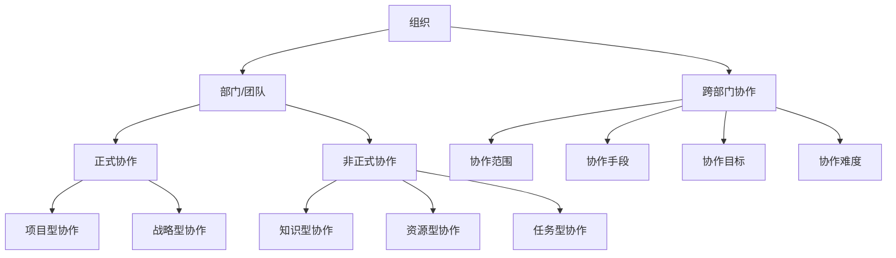

                 


### 1.1 跨部门协作的定义与分类

#### 1.1.1 定义

跨部门协作是指在组织中，不同部门或团队之间的合作与互动，以实现共同的目标或任务。这种协作超越了单一部门的界限，旨在整合不同部门的资源和能力，提高整体效率和工作效果。

在现代社会中，企业组织越来越复杂，分工越来越细化，跨部门协作已成为企业运作中不可或缺的一部分。无论是大型跨国公司，还是中小型企业，跨部门协作都发挥着重要的作用。它有助于打破部门间的壁垒，促进信息流通，提升整体运作效率，最终实现组织的战略目标。

#### 1.1.2 分类

跨部门协作可以从不同的角度进行分类。以下是一些常见的分类方法：

1. **按协作性质分类**：
    - **正式协作**：通过组织结构、流程、制度等正式手段进行协作。
    - **非正式协作**：基于个人关系、兴趣、信任等非正式手段进行的协作。

2. **按协作目的分类**：
    - **项目型协作**：为了完成特定项目而进行的协作。
    - **战略型协作**：为了实现组织战略目标而进行的协作。

3. **按协作层次分类**：
    - **高层协作**：涉及组织高层决策者和战略规划的协作。
    - **中层协作**：涉及部门经理和管理人员的协作。
    - **基层协作**：涉及普通员工和基层团队的协作。

4. **按协作内容分类**：
    - **知识型协作**：以知识、信息交流为主。
    - **资源型协作**：以资源、物资、设备等共享为主。
    - **任务型协作**：以完成特定任务为目标。

#### 1.1.3 跨部门协作与传统协作的区别

跨部门协作与传统协作在多个方面存在显著差异：

1. **协作范围**：传统协作通常局限于单个部门或团队，而跨部门协作则跨越多个部门和团队。

2. **协作手段**：传统协作往往依赖于部门内部的沟通和协调，而跨部门协作需要更多的正式机制和工具支持。

3. **协作目标**：传统协作的目标通常是完成部门内的任务，而跨部门协作的目标则是实现组织的整体目标和战略。

4. **协作难度**：由于涉及多个部门和团队，跨部门协作通常面临更大的挑战，如沟通障碍、资源冲突、目标不一致等。

#### 1.1.4 跨部门协作的核心概念原理关系架构

为了更好地理解跨部门协作的核心概念原理，我们可以使用Mermaid流程图来展示它们之间的关系。以下是跨部门协作的核心概念及其关系的Mermaid图：



在这个流程图中，A代表组织，B代表部门/团队，C和D分别代表正式协作和非正式协作。E、F、G、H和I则分别代表不同类型的协作。J表示跨部门协作，它与K、L、M和N构成了核心概念原理关系架构。通过这个图，我们可以清晰地看到跨部门协作与各种协作类型之间的联系。

#### 1.1.5 跨部门协作的核心算法原理讲解

在跨部门协作中，算法原理的应用有助于提高协作的效率和质量。以下是一个简单的Python示例，用于演示如何使用图论算法来分析跨部门协作中的节点关系。

```python
import networkx as nx
import matplotlib.pyplot as plt

# 创建一个图
G = nx.Graph()

# 添加节点和边，模拟跨部门协作
G.add_nodes_from(['A', 'B', 'C', 'D', 'E', 'F', 'G', 'H', 'I'])
G.add_edges_from([('A', 'B'), ('B', 'C'), ('C', 'D'), ('D', 'E'), ('E', 'F'), ('F', 'G'), ('G', 'H'), ('H', 'I')])

# 绘制图
nx.draw(G, with_labels=True, node_size=2000, node_color='lightblue', edge_color='gray', linewidths=2)
plt.show()
```

在这个例子中，我们使用了NetworkX库来创建一个图，并模拟了跨部门协作中的节点和边关系。图中的每个节点代表一个部门或团队，每条边代表它们之间的协作关系。通过绘制图，我们可以直观地看到跨部门协作的结构和节点之间的连接关系。

#### 1.1.6 跨部门协作的数学模型与公式

在跨部门协作中，数学模型和公式可以用来分析和优化协作过程。以下是一个简化的数学模型，用于描述跨部门协作的效率。

设E为跨部门协作的总效率，N为参与协作的部门数量，C为每个部门之间的协作成本，T为协作周期时间。则跨部门协作的总效率E可以表示为：

$$
E = \frac{N \times (T - C)}{T}
$$

其中，$T - C$表示有效协作时间，$N \times (T - C)$表示所有部门的有效协作总时间。

#### 1.1.7 跨部门协作的实际案例

为了更好地理解跨部门协作的实际应用，我们来看一个实际案例。

假设某公司要开发一款新产品，需要多个部门的协作。产品部门负责产品设计和开发，市场部门负责市场调研和推广，生产部门负责生产制造，供应链部门负责物资采购和配送。通过跨部门协作，这些部门共同完成新产品的开发和上市。

在这个案例中，跨部门协作的核心在于各部门之间的沟通和协调。产品部门需要与市场部门沟通产品需求和市场反馈，与生产部门协调生产计划和资源，与供应链部门协调物资采购和配送。通过有效的跨部门协作，公司可以更快地将新产品推向市场，提高市场竞争力。

### 1.1.8 小结

跨部门协作是现代企业组织运作中不可或缺的一部分。它通过整合不同部门的资源和能力，实现共同的目标和任务，提高整体效率和工作效果。在跨部门协作中，定义与分类、核心概念原理、算法原理、数学模型和实际案例都是关键组成部分。通过深入理解和应用这些知识，企业可以更好地实现跨部门协作，提升整体效能。

#### 作者信息

作者：AI天才研究院/AI Genius Institute & 禅与计算机程序设计艺术 /Zen And The Art of Computer Programming

---

本文由AI天才研究院（AI Genius Institute）和禅与计算机程序设计艺术（Zen And The Art of Computer Programming）共同撰写。AI天才研究院致力于探索人工智能领域的最新技术和应用，推动人工智能的发展和创新。禅与计算机程序设计艺术则通过结合禅宗哲学和计算机科学，提供独特的编程教育和思维方法。本文旨在深入探讨跨部门协作的重要性、概念、障碍及其解决策略，为企业的跨部门协作提供理论和实践指导。希望读者能够在阅读本文后，对跨部门协作有更深刻的理解和应用能力。如果您有任何疑问或建议，欢迎随时与我们联系。期待与您的互动交流，共同推动跨部门协作的进步与发展。

