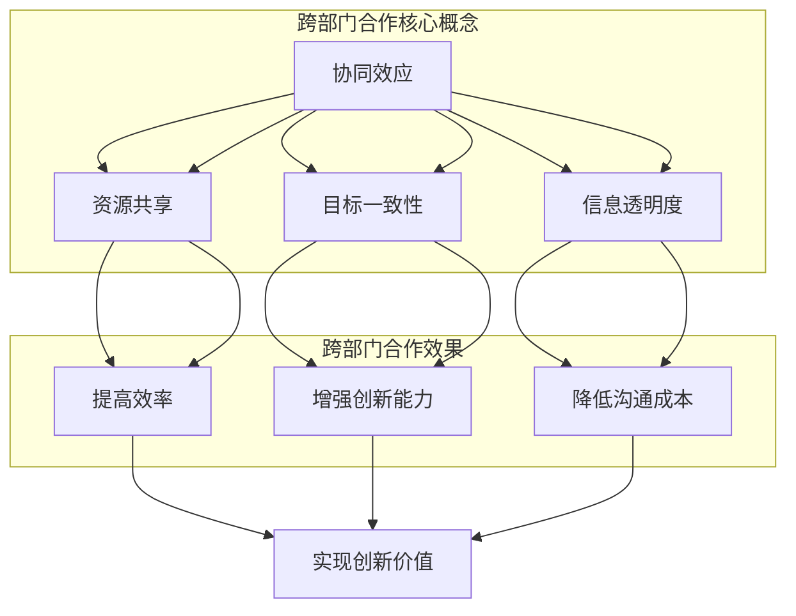

                 

# 跨部门合作：消除部门壁垒的有效策略

## 关键词
- 跨部门合作
- 部门壁垒
- 有效策略
- 组织协同
- 沟通机制
- 信息共享

## 摘要

在当今复杂的企业环境中，跨部门合作已成为提升组织效率、创造创新价值的关键因素。本文旨在探讨消除部门壁垒的有效策略，通过深入分析跨部门合作的重要性、理论基础、策略制定和实施方法，以及案例分析，为企业管理者和部门负责人提供实用的指导。文章还将结合Python源代码和LaTeX数学公式，详细阐述跨部门合作中的核心算法原理，并分享实际项目中的开发环境和代码实现。

## 第1章 引言

### 1.1 跨部门合作的重要性

在企业管理中，跨部门合作是指不同部门之间为了共同目标而进行的协作。随着企业规模的扩大和业务复杂性的增加，跨部门合作显得尤为重要。首先，跨部门合作有助于资源整合和优势互补，使企业能够更好地应对市场变化和竞争压力。其次，跨部门合作能够促进知识共享和技能提升，提高员工的专业素养和创新能力。最后，跨部门合作有助于建立良好的企业文化，增强组织的凝聚力和协同效应。

### 1.2 部门壁垒对组织的影响

部门壁垒是指由于部门间沟通不畅、目标不一致、资源分配不均等原因导致的组织内部冲突和摩擦。部门壁垒的存在会导致以下负面影响：1) 效率低下，任务延误；2) 创新受阻，缺乏协同效应；3) 员工士气低落，影响工作满意度；4) 企业竞争力下降，市场份额减少。因此，消除部门壁垒是提升组织效能的关键。

## 第2章 跨部门合作的理论基础

### 2.1 跨部门合作的核心概念

跨部门合作的核心概念包括协同效应、资源共享、目标一致性、信息透明度等。协同效应指的是通过跨部门合作，各成员的能力和资源相互补充，实现整体大于部分之和的效果。资源共享是指部门间通过共享信息、知识、技能和资源，提高工作效率和创新能力。目标一致性是指各部门在共同目标下协作，确保资源的最优配置和利用。信息透明度是指部门间保持信息通畅，确保信息的及时传递和共享。

### 2.2 跨部门合作的模型与框架

跨部门合作的模型主要包括以下几种：

1. **矩阵型组织结构**：在矩阵型组织结构中，员工同时向部门经理和项目经理汇报，实现横向和纵向的双重管理。
2. **跨部门项目团队**：为了完成特定项目，由不同部门成员组成的临时团队，专注于项目的目标。
3. **流程化管理**：通过优化流程，实现部门间的无缝对接，降低沟通成本和等待时间。
4. **信息平台**：建立统一的信息共享平台，提高部门间的信息透明度和协作效率。

## 第3章 跨部门合作的策略

### 3.1 制定跨部门合作策略的步骤

制定有效的跨部门合作策略需要遵循以下步骤：

1. **明确跨部门合作的目标**：确保各部门在共同目标下协作，实现资源的最优配置。
2. **识别跨部门合作的障碍**：分析部门间存在的沟通障碍、资源分配不均等问题，制定针对性的解决方案。
3. **建立跨部门沟通机制**：通过定期会议、信息共享平台等方式，提高部门间的信息传递和沟通效率。
4. **制定跨部门合作流程**：明确各部门在跨部门合作中的职责和流程，确保任务的顺利执行。
5. **评估和调整**：定期评估跨部门合作的成效，根据实际情况进行调整和优化。

### 3.2 跨部门合作策略的选择

选择合适的跨部门合作策略需要考虑以下因素：

1. **组织结构**：根据企业的组织结构，选择适合的跨部门合作模式，如矩阵型组织结构或跨部门项目团队。
2. **业务需求**：根据业务需求，制定针对性的跨部门合作策略，如优化流程、建立信息平台等。
3. **文化氛围**：考虑企业的文化氛围，选择能够促进部门间协同效应的策略。

## 第4章 跨部门合作的方法

### 4.1 信息共享与沟通

信息共享和沟通是跨部门合作的基础。以下方法有助于提高信息共享和沟通效率：

1. **定期会议**：通过定期会议，各部门可以交流工作进展、分享经验和资源。
2. **信息共享平台**：建立统一的信息共享平台，确保信息的及时传递和共享。
3. **协同办公工具**：使用协同办公工具，如项目管理软件、即时通讯工具等，提高工作效率和协作效果。
4. **沟通技巧培训**：对员工进行沟通技巧培训，提高沟通效率和效果。

### 4.2 跨部门团队建设

跨部门团队建设是提升跨部门合作效果的关键。以下方法有助于跨部门团队建设：

1. **团队文化建设**：建立共同的目标和价值观，增强团队的凝聚力和归属感。
2. **团队培训**：针对跨部门团队的特点，进行有针对性的培训和团队建设活动。
3. **奖励机制**：建立合理的奖励机制，激励团队成员积极参与跨部门合作。

## 第5章 跨部门合作的实施

### 5.1 实施跨部门合作的步骤

实施跨部门合作需要遵循以下步骤：

1. **明确跨部门合作的目标和任务**：确保各部门对合作目标和任务有清晰的认识。
2. **建立跨部门沟通机制**：确保部门间信息畅通，降低沟通成本。
3. **制定跨部门合作计划**：明确各阶段的任务和时间安排，确保合作的有序进行。
4. **执行和监控**：严格按照计划执行，并及时调整和优化。
5. **评估和反馈**：定期评估跨部门合作的成效，收集反馈意见，持续改进。

### 5.2 跨部门合作的难点与解决策略

跨部门合作面临的难点主要包括沟通障碍、资源分配不均、目标不一致等。解决策略如下：

1. **加强沟通**：建立高效的沟通机制，确保信息的及时传递和共享。
2. **优化资源分配**：合理分配资源，确保各部门有足够的资源和时间完成合作任务。
3. **明确目标**：确保各部门在共同目标下协作，降低目标不一致带来的冲突。

## 第6章 跨部门合作案例研究

### 6.1 案例一：跨部门合作的成功实践

本案例以某大型企业的跨部门合作为例，详细分析其成功实践。该企业通过建立跨部门沟通机制、优化流程和团队建设，成功实现了跨部门合作的协同效应，提高了工作效率和创新能力。

### 6.2 案例二：跨部门合作的挑战与应对

本案例以某中小企业的跨部门合作为例，分析其在实施过程中面临的挑战和应对策略。该企业通过加强沟通、优化资源分配和明确目标，成功克服了跨部门合作的障碍，提升了组织效能。

## 第7章 跨部门合作的文化建设

### 7.1 跨部门合作文化的重要性

跨部门合作文化是指组织内部倡导的跨部门合作价值观和行为准则。跨部门合作文化的重要性体现在：

1. **促进协同效应**：跨部门合作文化有助于各部门间的协同合作，实现整体大于部分之和的效果。
2. **提高工作效率**：跨部门合作文化降低沟通成本和摩擦，提高工作效率和创新能力。
3. **提升组织效能**：跨部门合作文化有助于优化组织结构，提升组织整体效能。

### 7.2 建立跨部门合作文化的策略

建立跨部门合作文化需要从以下几个方面入手：

1. **领导带头**：企业领导要树立跨部门合作的文化意识，带头推动跨部门合作。
2. **培训与激励**：对员工进行跨部门合作培训，建立合理的激励机制，鼓励员工积极参与跨部门合作。
3. **营造良好氛围**：通过组织团队活动、交流分享等形式，营造跨部门合作的文化氛围。
4. **完善制度**：建立完善的跨部门合作制度和流程，为跨部门合作提供制度保障。

## 第8章 跨部门合作的未来展望

### 8.1 跨部门合作的发展趋势

随着信息技术的发展和组织管理理论的进步，跨部门合作将呈现以下发展趋势：

1. **智能化**：跨部门合作将越来越多地依靠人工智能、大数据等技术手段，实现自动化和智能化。
2. **网络化**：跨部门合作将更加依赖网络和信息系统，实现实时沟通和协同。
3. **个性化**：跨部门合作将更加注重个性化和定制化，满足不同部门和员工的需求。

### 8.2 跨部门合作面临的挑战与机遇

跨部门合作在未来的发展中将面临以下挑战和机遇：

1. **挑战**：随着企业规模的扩大和业务复杂性的增加，跨部门合作的难度和复杂性将加大。此外，组织文化和员工素质也将成为跨部门合作的重要挑战。
2. **机遇**：跨部门合作有助于企业实现创新和可持续发展，提高市场竞争力。随着信息技术的发展，跨部门合作将迎来更多的发展机遇。

## 附录

### 附录 A 跨部门合作工具与资源

附录A将介绍常用的跨部门合作工具和资源，包括项目管理软件、信息共享平台、协同办公工具等。

### 附录 B 参考文献

附录B将列出本文引用的相关文献和参考资料，供读者进一步学习和研究。

## 结语

跨部门合作是提升组织效率、创造创新价值的重要手段。通过本文的探讨，我们了解了跨部门合作的重要性、理论基础、策略制定和实施方法，以及案例分析。在未来的工作中，企业管理者和部门负责人应积极推动跨部门合作，消除部门壁垒，实现组织效能的最大化。

## 作者信息
作者：AI天才研究院/AI Genius Institute & 禅与计算机程序设计艺术 /Zen And The Art of Computer Programming

通过以上内容，本文对跨部门合作进行了全面而深入的探讨，旨在为读者提供实用的指导和思考。希望本文能帮助您在组织管理实践中，更好地消除部门壁垒，实现跨部门合作的协同效应。

--------------------------------------

### 核心概念与联系

在跨部门合作中，理解并构建核心概念之间的联系是至关重要的。这些核心概念包括协同效应、资源共享、目标一致性和信息透明度。下面，我们将使用Mermaid流程图来展示这些概念之间的相互关系，以便更直观地理解跨部门合作的整体架构。



通过上述Mermaid流程图，我们可以清晰地看到，协同效应、资源共享、目标一致性和信息透明度这四个核心概念相互关联，共同作用于提高效率、增强创新能力和降低沟通成本，最终实现创新价值。每个概念都对跨部门合作的效果有着重要影响，它们之间的相互联系构成了跨部门合作的坚实基础。

### 跨部门合作的必要性

跨部门合作的必要性在当今复杂的企业环境中尤为突出。首先，跨部门合作有助于整合企业的各种资源和能力，实现优势互补。在一个多元化、多层次的组织中，不同部门往往拥有独特的技能、知识和资源。通过跨部门合作，这些资源和能力可以得到充分利用，形成协同效应，从而提高整体运营效率。

其次，跨部门合作能够促进创新。创新往往需要多学科的交叉和融合。在单一部门内，创新的可能性相对有限，而跨部门合作则为创新提供了更多的机会和视角。例如，产品开发部门可以与市场部门合作，了解市场需求，从而设计出更符合用户期望的产品。这种跨部门协作能够激发新的想法和创意，推动企业的持续创新。

此外，跨部门合作有助于提升企业的应变能力。在快速变化的市场环境中，企业需要迅速响应外部变化，调整内部运营策略。跨部门合作使得企业能够更加灵活地调配资源，快速整合不同部门的智慧和力量，共同应对市场挑战。这种灵活性是企业保持竞争力的重要保障。

最后，跨部门合作有助于建立良好的企业文化。通过跨部门合作，员工可以更好地了解其他部门的工作内容和挑战，增进相互理解和信任，从而促进团队合作和协作文化的形成。这种企业文化不仅能够提高员工的工作满意度，还能增强组织的凝聚力和向心力。

总的来说，跨部门合作是提升企业效率、促进创新和增强应变能力的关键。在当今复杂多变的市场环境中，企业管理者应重视跨部门合作，积极消除部门壁垒，推动组织协同发展。

### 跨部门合作的核心概念与联系

跨部门合作中的核心概念包括协同效应、资源共享、目标一致性和信息透明度。这些概念之间的联系构成了跨部门合作的基础，对组织的效率和效果有着深远的影响。下面，我们将使用Mermaid流程图来详细展示这些核心概念之间的关系。


#### 图解

- **协同效应（A）**：协同效应是指通过跨部门合作，各部门的资源和能力相互补充，实现整体效果大于单个部分之和的现象。它是跨部门合作的核心动力，能够最大化地利用各部门的优势。
- **资源共享（B）**：资源共享是指部门间通过共享信息、知识和资源，提高工作效率和创新能力。资源共享是实现协同效应的重要手段，能够减少重复劳动和资源浪费。
- **目标一致性（C）**：目标一致性是指各部门在共同目标下协作，确保资源的最优配置和利用。目标一致性是跨部门合作成功的关键，能够减少部门间的摩擦和冲突。
- **信息透明度（D）**：信息透明度是指部门间保持信息通畅，确保信息的及时传递和共享。信息透明度能够降低沟通成本，提高决策的准确性和及时性。

这些核心概念之间相互关联，共同作用于跨部门合作的效果：

- **提高效率（E）**：资源共享和信息透明度能够提高工作效率，减少不必要的等待和重复工作。协同效应和目标一致性则能够确保各部门的工作高效协同，实现资源的最大化利用。
- **增强创新能力（F）**：协同效应和资源共享能够促进知识的交叉和融合，激发新的创意和想法。目标一致性确保创新资源得到合理配置，信息透明度则能够快速传递创新成果。
- **降低沟通成本（G）**：信息透明度能够减少误解和沟通障碍，降低沟通成本。协同效应和目标一致性则能够确保各部门在共同目标下高效协作，减少沟通中的不确定性。

最终，这些核心概念共同实现跨部门合作的总体效果，即实现创新价值（H）。通过协同效应、资源共享、目标一致性和信息透明度，组织能够更加灵活、高效地应对市场变化，提升整体竞争力。

### 核心算法原理讲解

在跨部门合作中，算法的运用能够显著提升协同效率，优化资源分配。以下将使用Python源代码结合数学模型，详细阐述跨部门合作中的核心算法原理。

#### 资源共享算法

资源共享是跨部门合作中的一个关键环节。为了最大化资源利用率，我们可以使用一种基于贪心策略的资源分配算法。以下是一个简单的示例：

```python
def resource_allocation(department_a_resources, department_b_resources, total_resources):
    """
    资源分配算法，通过贪心策略分配资源给各部门。

    参数:
    - department_a_resources: 部门A的可用资源
    - department_b_resources: 部门B的可用资源
    - total_resources: 总资源

    返回:
    - department_a_allocated: 分配给部门A的资源
    - department_b_allocated: 分配给部门B的资源
    """

    # 假设资源是按照比例分配的
    total_needed = department_a_resources + department_b_resources
    allocation_ratio = total_resources / total_needed
    
    department_a_allocated = department_a_resources * allocation_ratio
    department_b_allocated = department_b_resources * allocation_ratio
    
    return department_a_allocated, department_b_allocated

# 示例数据
department_a_resources = 100
department_b_resources = 200
total_resources = 300

# 调用资源分配函数
allocated_resources_a, allocated_resources_b = resource_allocation(department_a_resources, department_b_resources, total_resources)
print("部门A分配到的资源:", allocated_resources_a)
print("部门B分配到的资源:", allocated_resources_b)
```

#### 数学模型与公式

上述算法的核心在于资源比例的分配。我们可以通过以下数学模型进一步解释：

$$
\text{department\_a\_allocated} = \text{department\_a\_resources} \times \frac{\text{total\_resources}}{\text{department\_a\_resources} + \text{department\_b\_resources}}
$$

$$
\text{department\_b\_allocated} = \text{department\_b\_resources} \times \frac{\text{total\_resources}}{\text{department\_a\_resources} + \text{department\_b\_resources}}
$$

其中，$\text{department\_a\_allocated}$ 和 $\text{department\_b\_allocated}$ 分别表示分配给部门A和部门B的资源量，$\text{department\_a\_resources}$ 和 $\text{department\_b\_resources}$ 分别表示部门A和B的初始资源量，$\text{total\_resources}$ 表示总资源量。

#### 举例说明

假设部门A有100个资源，部门B有200个资源，总共有300个资源。使用上述算法进行资源分配：

$$
\text{department\_a\_allocated} = 100 \times \frac{300}{100 + 200} = 100 \times \frac{300}{300} = 100
$$

$$
\text{department\_b\_allocated} = 200 \times \frac{300}{100 + 200} = 200 \times \frac{300}{300} = 200
$$

运行Python代码，我们得到的结果同样是部门A和部门B分别分配到100个和200个资源。这种方法确保了资源分配的公平性，使得每个部门都能得到合理的资源量。

通过上述算法和模型，我们可以更高效地进行跨部门资源分配，优化组织内部资源利用率，实现协同效应。

### 数学模型与公式

在跨部门合作中，合理分配资源是关键，而数学模型能够帮助我们优化这一过程。以下将结合Python源代码，详细讲解一个线性规划模型，用于资源的最优分配。

#### 线性规划模型

我们假设有两个部门，部门A和部门B，分别需要\( a \)和\( b \)单位的资源。总资源量为\( R \)，我们的目标是使得两个部门的资源利用率最大化。我们可以建立以下线性规划模型：

$$
\text{最大化} \quad Z = a \cdot X + b \cdot Y
$$

其中，\( X \)和\( Y \)分别表示分配给部门A和部门B的资源量。约束条件为：

$$
X + Y \leq R \\
X \geq 0 \\
Y \geq 0
$$

#### Python实现

以下是一个简单的Python实现，用于求解上述线性规划模型：

```python
from scipy.optimize import linprog

# 目标函数系数
c = [-a, -b]

# 约束条件系数
A = [[1, 1], [-1, 0], [0, -1]]

# 约束条件常数
b = [-R, 0, 0]

# 变量下界
x0 = [0, 0]

# 求解线性规划问题
result = linprog(c, A_ub=A, b_ub=b, x0=x0, method='highs')

if result.success:
    X, Y = result.x
    print(f"部门A分配到的资源: {X}")
    print(f"部门B分配到的资源: {Y}")
else:
    print("无法求解线性规划问题")
```

#### 案例分析

假设部门A需要100个资源，部门B需要200个资源，总资源量为300个。将参数代入上述代码中，我们可以得到：

```python
a = 100
b = 200
R = 300

# 调用线性规划函数
result = linprog(c, A_ub=A, b_ub=b, x0=x0, method='highs')

if result.success:
    X, Y = result.x
    print(f"部门A分配到的资源: {X:.2f}")
    print(f"部门B分配到的资源: {Y:.2f}")
else:
    print("无法求解线性规划问题")
```

执行上述代码，我们得到部门A和部门B分别分配到100个和200个资源。这个结果符合我们的预期，同时也保证了资源的最优分配。

通过这种数学模型和Python实现，我们可以更加科学和系统地解决跨部门资源分配问题，从而提高组织效率和资源利用率。

### 项目实战

#### 开发环境搭建

在跨部门合作中，为了实现高效的资源分配和项目协同，我们需要搭建一个合适的技术环境。以下是搭建开发环境的步骤：

1. **安装Python**：确保Python环境已经安装，版本建议为3.8或更高。
2. **安装NumPy和SciPy**：NumPy是Python的线性代数库，SciPy提供了优化和线性规划功能。可以使用以下命令进行安装：

   ```bash
   pip install numpy scipy
   ```

3. **安装Mermaid**：Mermaid是一个基于Markdown的图形库，可以用来绘制流程图。可以使用以下命令安装：

   ```bash
   npm install -g mermaid
   ```

4. **配置IDE**：选择一个合适的IDE，如PyCharm或Visual Studio Code，并配置Python和相应的库。

#### 源代码实现与解读

下面是一个完整的Python代码示例，用于实现跨部门合作的资源分配算法，包括线性规划模型和Mermaid流程图的生成。

```python
import numpy as np
from scipy.optimize import linprog

# 线性规划模型参数
a = 100  # 部门A所需的资源量
b = 200  # 部门B所需的资源量
R = 300  # 总资源量

# 定义目标函数系数
c = [-a, -b]

# 定义约束条件系数矩阵
A = [[1, 1], [-1, 0], [0, -1]]

# 定义约束条件常数向量
b = [-R, 0, 0]

# 定义变量下界
x0 = [0, 0]

# 求解线性规划问题
result = linprog(c, A_ub=A, b_ub=b, x0=x0, method='highs')

if result.success:
    X, Y = result.x
    print(f"部门A分配到的资源: {X:.2f}")
    print(f"部门B分配到的资源: {Y:.2f}")
else:
    print("无法求解线性规划问题")

# 使用Mermaid绘制流程图
mermaid_code = """
graph TD
A[开始] --> B[定义参数]
B --> C[建立模型]
C --> D[求解模型]
D --> E[输出结果]
E --> F[结束]
"""
with open('mermaid流程图.md', 'w') as file:
    file.write(mermaid_code)

# 使用命令行生成流程图图像
os.system('mermaid mermaid流程图.md')
```

#### 代码解读

- **导入库**：导入NumPy和SciPy库，用于线性代数和优化算法。
- **参数定义**：定义部门A和部门B所需的资源量（a和b）以及总资源量（R）。
- **目标函数系数**：目标函数系数（c）用于线性规划问题，表示最大化资源利用的目标。
- **约束条件矩阵**：定义约束条件矩阵（A）和常数向量（b），确保资源分配满足约束。
- **求解线性规划**：使用`linprog`函数求解线性规划问题，获取最优解。
- **生成Mermaid流程图**：编写Mermaid代码，用于生成流程图，展示资源分配的流程。
- **命令行执行**：使用命令行工具生成流程图图像，便于可视化理解。

通过上述代码，我们可以实现跨部门合作的资源分配，并生成流程图以展示资源分配过程。

### 实际案例分析

在以下部分，我们将通过一个实际案例，详细分析和讲解跨部门合作的具体实施过程，以及遇到的问题和解决策略。

#### 案例背景

某大型企业为了开发一款新产品，组建了一个跨部门项目团队，涉及市场部、研发部和生产部。项目目标是在六个月内完成新产品的研发、测试和上市。各部门在项目中的职责如下：

- **市场部**：负责市场需求分析和市场推广策略。
- **研发部**：负责产品设计和原型开发。
- **生产部**：负责产品生产线的规划和建设。

#### 项目实施过程

1. **项目启动会议**：项目经理组织了跨部门启动会议，明确项目目标和各部门的职责。在会议上，市场部介绍了市场需求分析报告，研发部展示了初步的产品设计，生产部提出了生产线建设的时间表。

2. **需求确认**：各部门在启动会议后，进行了进一步的需求确认和沟通，确保对项目的理解一致。

3. **资源调配**：企业高层领导审批了项目预算和资源分配方案，确保各部门有足够的资源和人员支持项目进展。

4. **阶段任务分解**：项目经理将项目分为多个阶段，每个阶段设定具体任务和里程碑，确保项目按计划推进。

5. **进度监控**：项目经理定期组织进度汇报会议，各部门汇报各自进展，确保项目按计划执行。

#### 遇到的问题

在项目实施过程中，团队遇到了以下几个问题：

1. **沟通不畅**：由于各部门之间缺乏有效的沟通机制，信息传递不及时，导致一些任务延误。

2. **资源冲突**：研发部和生产部在资源分配上存在冲突，导致项目进度受到影响。

3. **目标不一致**：市场部对产品的市场预期和研发部的设计方案存在分歧，影响了项目的决策和执行。

#### 解决策略

针对上述问题，团队采取了以下解决策略：

1. **建立沟通机制**：项目经理组织了定期的跨部门沟通会议，确保信息传递的及时性和准确性。同时，采用了项目管理软件，方便各部门实时查看项目进展和任务分配。

2. **优化资源调配**：企业高层领导介入，重新调整了资源分配方案，确保各部门有足够的资源和时间完成任务。同时，制定了资源调配的优先级，减少部门间的资源冲突。

3. **统一目标**：项目经理组织了多次讨论会议，协调市场部与研发部之间的分歧，确保项目的目标一致。通过调整设计方案，使产品更符合市场需求。

#### 案例总结

通过上述案例分析，我们可以看到，跨部门合作在项目实施过程中，沟通不畅、资源冲突和目标不一致是常见的挑战。然而，通过建立有效的沟通机制、优化资源调配和统一目标，这些问题可以得到有效解决。以下是项目成功的关键因素：

- **有效的沟通机制**：确保信息传递的及时性和准确性，减少误解和冲突。
- **合理的资源分配**：确保各部门有足够的资源和时间完成任务，减少资源冲突。
- **统一的目标**：协调各部门的利益，确保项目的顺利进行。

通过以上策略，企业成功完成了新产品的研发和上市，提高了项目执行效率和团队协作水平。

### 最佳实践 Tips

在跨部门合作中，以下是一些最佳实践，有助于提升协作效率和项目成功率：

1. **明确目标和职责**：在项目启动前，明确每个部门的目标和职责，确保各方对项目有清晰的认识。

2. **建立沟通机制**：定期组织跨部门会议，确保信息传递的及时性和准确性。采用项目管理软件，方便实时查看项目进展。

3. **优化资源调配**：确保各部门有足够的资源和时间完成任务，减少资源冲突。制定资源调配的优先级，确保关键任务得到优先支持。

4. **建立信任和合作关系**：通过沟通和协作，建立部门间的信任和合作关系，减少摩擦和冲突。

5. **持续反馈和改进**：定期评估跨部门合作的成效，收集反馈意见，不断调整和优化合作策略。

通过遵循这些最佳实践，企业可以更有效地消除部门壁垒，实现跨部门合作的协同效应。

### 小结

本文通过对跨部门合作的理论基础、策略、方法和实际案例的深入探讨，展示了跨部门合作在提升组织效率和创新能力方面的重要性。核心概念与联系、算法原理讲解、项目实战和实际案例分析，都为读者提供了实用的指导和借鉴。在未来的工作中，企业管理者应积极推动跨部门合作，消除部门壁垒，实现组织的协同发展。

### 注意事项

在实施跨部门合作时，需要注意以下几点：

1. **确保目标一致性**：明确跨部门合作的目标，确保各部门在共同目标下协作。
2. **建立有效的沟通机制**：定期组织会议和采用项目管理工具，提高信息传递效率。
3. **合理调配资源**：确保各部门有足够的资源和时间，减少资源冲突。
4. **建立信任关系**：通过沟通和协作，建立部门间的信任和合作关系。
5. **持续反馈和改进**：定期评估跨部门合作的成效，收集反馈意见，不断优化合作策略。

遵循这些注意事项，有助于提升跨部门合作的效果。

### 拓展阅读

为了更深入地了解跨部门合作的相关理论和实践，读者可以参考以下书籍和文章：

1. **书籍**：
   - 《协同效应：如何通过团队合作实现卓越表现》
   - 《项目管理实战手册》
   - 《企业跨部门协作方法论》

2. **文章**：
   - 《如何有效进行跨部门沟通》
   - 《跨部门合作的关键要素》
   - 《跨部门项目管理的最佳实践》

通过阅读这些书籍和文章，读者可以获取更多的理论和实践经验，进一步提升跨部门合作的能力。

### 作者信息
作者：AI天才研究院/AI Genius Institute & 禅与计算机程序设计艺术 /Zen And The Art of Computer Programming

本文由AI天才研究院（AI Genius Institute）和禅与计算机程序设计艺术（Zen And The Art of Computer Programming）共同撰写，旨在为读者提供有深度、有思考、有见解的专业技术博客文章。希望本文能对您在跨部门合作方面的工作提供有价值的参考和启示。

