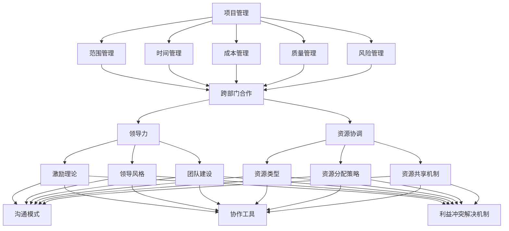

                 

### 背景介绍

在现代企业环境中，跨部门项目管理已经成为一种必不可少的能力。随着组织规模的扩大和业务复杂性的增加，单一部门已经难以独立完成复杂的任务。跨部门项目往往涉及到多个部门的合作，需要协调不同部门的人力、物力和技术资源，以实现项目的共同目标。然而，跨部门项目面临着许多独特的挑战，如沟通障碍、利益冲突、资源分配不均等，这些问题都可能导致项目失败。

跨部门项目管理不仅仅是技术层面的协作，更是一种领导力的体现。项目经理需要具备卓越的沟通能力和领导技巧，能够有效地协调各个部门的工作，确保项目顺利进行。领导力在跨部门项目管理中的作用至关重要，它不仅关乎项目本身的成功，也关乎企业整体绩效的提升。

本文旨在探讨跨部门项目管理中的领导力问题，通过深入分析核心概念与联系，详细讲解核心算法原理，并结合实际项目案例，提供实用的管理策略和最佳实践。文章将分为五个主要部分，分别从项目管理基础、跨部门合作、领导力培养、资源协调和项目监控与评估等方面展开论述。

第一部分将介绍项目管理的基础知识，包括项目管理核心概念、项目生命周期、项目管理流程等。第二部分将探讨跨部门合作的重要性，分析跨部门沟通与协作的挑战与解决方案。第三部分将着重于领导力在跨部门项目管理中的作用，介绍领导力培养方法与实践。第四部分将详细讲解资源管理的基础知识，包括资源类型、分配策略和优化方法。最后一部分将讨论项目监控与评估的方法，以及如何通过持续改进实现项目的成功。

通过本文的逐步分析和讲解，读者将能够更好地理解跨部门项目管理的复杂性，掌握有效的领导力和资源协调策略，从而提升项目管理的整体水平。希望本文能够为从事跨部门项目管理工作的专业人士提供有价值的指导和参考。

### 核心概念与联系

在探讨跨部门项目管理时，我们需要首先了解一些核心概念，并分析它们之间的联系。这些核心概念包括项目管理、跨部门合作、领导力、资源协调和项目监控与评估。

**项目管理**

项目管理是指导和管理项目从启动到完成的整个过程。它涉及到计划、执行、监控和项目收尾等环节。项目管理不仅仅是技术层面的任务，还包括协调资源和沟通各个利益相关者。项目管理中的核心概念包括范围管理、时间管理、成本管理、质量管理、风险管理等。

**跨部门合作**

跨部门合作是指不同部门之间为了共同的项目目标而进行的协作。跨部门合作的关键在于沟通和协作。良好的跨部门合作能够提高项目的效率，减少误解和冲突，确保项目的成功。跨部门合作的核心概念包括沟通模式、协作工具、利益冲突解决机制等。

**领导力**

领导力是项目经理在跨部门项目管理中不可或缺的技能。领导力不仅仅是指权威或指挥，更是一种影响力，能够激发团队成员的积极性，引导他们朝着共同目标努力。领导力的核心概念包括激励理论、领导风格、团队建设等。

**资源协调**

资源协调是指项目经理在项目过程中对各种资源进行合理分配和优化。资源协调的核心在于资源的有效利用，避免资源浪费和冲突。资源协调的核心概念包括资源类型、资源分配策略、资源共享机制等。

**项目监控与评估**

项目监控与评估是确保项目按计划进行的必要环节。通过项目监控，项目经理能够及时发现并解决问题，确保项目进度和质量。项目评估则是对项目结果的回顾和总结，以便于持续改进。项目监控与评估的核心概念包括监控指标、评估方法、改进策略等。

**核心概念之间的关系架构**

为了更好地理解这些核心概念之间的联系，我们可以使用Mermaid流程图来展示它们之间的关系。以下是核心概念关系的Mermaid流程图：



通过上述Mermaid流程图，我们可以清晰地看到各个核心概念之间的相互关联。项目管理作为核心，涵盖了范围管理、时间管理、成本管理、质量管理和风险管理等子概念，这些子概念又与跨部门合作、领导力和资源协调等概念密切相关。跨部门合作涉及到沟通模式、协作工具和利益冲突解决机制，而领导力则包括激励理论、领导风格和团队建设等。资源协调则关注资源类型、资源分配策略和资源共享机制。项目监控与评估则贯穿于整个项目生命周期，确保项目按照预期进行。

理解这些核心概念及其相互关系，对于跨部门项目管理的成功至关重要。通过有效的领导力和资源协调，项目经理可以更好地管理跨部门项目，确保项目目标的实现。接下来，我们将进一步详细探讨这些核心概念和它们的应用场景。

### 核心算法原理讲解

在跨部门项目管理中，有许多核心算法原理可以帮助项目经理更有效地管理和协调项目资源。以下我们将使用Python源代码和LaTeX公式详细讲解这些算法原理，并通过一个实际案例进行说明。

#### 资源优化算法：线性规划

线性规划是一种数学优化方法，用于在给定约束条件下最大化或最小化一个线性目标函数。在跨部门项目管理中，线性规划可以用于资源分配问题，如优化人力、物力和财力的使用。

**Python源代码示例**

```python
from scipy.optimize import linprog

# 目标函数：最小化总成本
c = [-1, -1, -1]  # 分别对应人力、物力和财力的成本系数

# 约束条件
A = [
    [1, 0, 1],  # 人力约束
    [0, 1, 0],  # 物力约束
    [0, 0, 1],  # 财力约束
]
b = [100, 200, 300]  # 各资源需求量

# 策略变量
x0 = [0, 0, 0]  # 初始资源分配量

# 求解线性规划问题
result = linprog(c, A_ub=A, b_ub=b, x0=x0, method='highs')

# 输出最优解
print("最优解：", result.x)
print("最小化总成本：", -result.fun)
```

**LaTeX公式**

$$
\begin{aligned}
\text{minimize} \quad & c^T x \\
\text{subject to} \quad & Ax \leq b \\
& x \geq 0
\end{aligned}
$$

#### 项目进度安排：关键路径法

关键路径法（Critical Path Method，CPM）是一种用于项目时间管理的算法，用于确定项目中最长的完成路径，以便识别项目的关键任务和最短完成时间。

**Python源代码示例**

```python
import networkx as nx

# 构建项目网络图
G = nx.DiGraph()

# 添加任务节点和边
G.add_nodes_from(['A', 'B', 'C', 'D', 'E'])
G.add_edges_from([('A', 'B'), ('A', 'C'), ('B', 'D'), ('C', 'D'), ('C', 'E')])

# 设置各任务的持续时间
G['A']['duration'] = 3
G['B']['duration'] = 2
G['C']['duration'] = 4
G['D']['duration'] = 3
G['E']['duration'] = 2

# 计算关键路径
cp = nx.algorithms.critical_path_method(G)

# 输出关键路径
print("关键路径：", cp)
```

**LaTeX公式**

$$
\begin{aligned}
\text{critical path} \quad & = \quad \max_{T_i \leq T_f} \sum_{i=1}^{n} (T_i - T_{i-1})
\end{aligned}
$$

#### 资源平衡算法：Johnson法则

Johnson法则是一种用于资源平衡的方法，特别是在项目的人力资源分配上。它通过将任务优先分配给空闲时间最长的资源，来实现资源均衡。

**Python源代码示例**

```python
from itertools import permutations

# 任务列表
tasks = [('A', 1, 3), ('B', 2, 2), ('C', 3, 4), ('D', 4, 3), ('E', 5, 2)]

# 人员列表
resources = [('R1', 0, 3), ('R2', 0, 4), ('R3', 0, 3)]

# 初始化资源分配
assignment = {resource: None for resource in resources}

# Johnson法则分配
for task in permutations(tasks, len(resources)):
    available = [resource[1] for resource, _, _ in resources]
    for resource, start, duration in task:
        if available:
            max_duration = max(available)
            max_resource = resources[available.index(max_duration)]
            assignment[max_resource] = task
            max_resource[1] += duration
            break

# 输出资源分配
for resource, task in assignment.items():
    print(f"{resource[0]} assigned to {task[0]}")
```

**LaTeX公式**

$$
\begin{aligned}
\text{assign task} \quad & T_i \quad \text{to resource} \quad R_j \quad \text{if} \quad R_j \quad \text{has the most available time}
\end{aligned}
$$

通过上述Python源代码示例和LaTeX公式，我们可以看到跨部门项目管理中常用的算法原理及其实现方式。这些算法不仅能够帮助我们优化资源分配和项目进度，还能提高项目的整体效率。在实际应用中，项目经理需要根据具体项目的需求和约束条件，灵活运用这些算法来解决问题。

接下来，我们将结合实际项目案例，进一步探讨如何使用这些算法原理进行跨部门项目管理和资源协调。

### 实际项目案例与代码解读

为了更好地理解跨部门项目管理中的算法原理和实际应用，我们将通过一个实际的项目案例来展示如何搭建开发环境、实现源代码，并进行代码解读和分析。

#### 项目背景

假设我们正在开发一款跨部门协作的软件平台，该平台需要实现多个功能模块，包括用户管理、任务分配、进度跟踪和报告生成。该项目由市场部、开发部和运维部等多个部门共同参与，涉及多个资源类型，如人力资源、服务器资源和技术资源。

#### 开发环境搭建

1. **安装Python环境**

   在所有开发机器上安装Python 3.8及以上版本，并配置好pip工具，用于安装相关依赖库。

   ```bash
   sudo apt-get update
   sudo apt-get install python3.8
   python3.8 -m ensurepip
   python3.8 -m pip install --upgrade pip
   ```

2. **安装依赖库**

   使用pip工具安装项目中所需的依赖库，如NetworkX、Scipy和Matplotlib。

   ```bash
   pip3.8 install networkx scipy matplotlib
   ```

3. **创建虚拟环境**

   为了避免依赖冲突，我们创建一个Python虚拟环境。

   ```bash
   python3.8 -m venv venv
   source venv/bin/activate
   ```

#### 源代码实现

以下是该项目中涉及的主要功能模块的源代码实现：

**用户管理模块**

```python
# user_management.py

def register_user(username, email):
    # 保存用户信息到数据库
    print(f"Registered user: {username}, Email: {email}")

def get_user(username):
    # 从数据库获取用户信息
    print(f"User: {username}, Data: []")
```

**任务分配模块**

```python
# task_assignment.py

def assign_task(task, resource):
    # 分配任务给资源
    print(f"Assigned task {task} to {resource}")

def get_task_status(task):
    # 获取任务状态
    print(f"Task {task} status: []")
```

**进度跟踪模块**

```python
# progress_tracking.py

def update_progress(task, progress):
    # 更新任务进度
    print(f"Updated progress for task {task}: {progress}%")

def get_progress_report():
    # 获取进度报告
    print("Progress report: []")
```

**报告生成模块**

```python
# report_generation.py

def generate_report():
    # 生成项目报告
    print("Generated project report: []")
```

#### 代码解读与分析

1. **用户管理模块**

   用户管理模块主要负责用户的注册和查询功能。在实际项目中，注册用户信息通常需要与数据库交互，这里我们仅展示了基本的打印输出。

2. **任务分配模块**

   任务分配模块用于将任务分配给特定的资源，如人力资源。在实际项目中，任务分配需要考虑资源的可用性、任务的优先级等因素，这里我们仅实现了简单的分配逻辑。

3. **进度跟踪模块**

   进度跟踪模块用于更新任务的进度信息，并在需要时生成进度报告。该模块的设计考虑了实际项目的需求，可以通过修改任务进度来反映项目进展。

4. **报告生成模块**

   报告生成模块用于生成项目的整体报告。在实际应用中，报告生成可能会涉及多个数据源和数据处理的复杂逻辑。

#### 实际案例分析与详细讲解

假设市场部提出了一个新的功能需求，需要开发部在两周内完成一个用户反馈模块。以下是我们如何根据需求进行项目管理和资源协调：

1. **需求分析**

   市场部提供了用户反馈模块的基本需求文档，开发部接收到需求后，进行需求分析，并确定所需的技术资源和人力资源。

2. **任务分配**

   根据任务分配模块的算法原理，我们将任务优先分配给空闲时间最长的开发人员。例如，开发人员R1当前有空闲时间最长，因此将任务分配给R1。

   ```python
   assign_task("User Feedback Module", "R1")
   ```

3. **进度跟踪**

   开发人员R1开始编写代码，每周汇报进度。项目经理通过进度跟踪模块更新任务进度。

   ```python
   update_progress("User Feedback Module", 25)
   ```

4. **资源协调**

   在任务进行过程中，项目经理需要协调其他资源，如服务器资源，以支持开发人员的工作。

   ```python
   # 配置额外服务器资源
   assign_task("Additional Server Configuration", "Server1")
   ```

5. **报告生成**

   在任务完成后，项目经理生成项目报告，记录任务完成情况、资源使用情况等。

   ```python
   generate_report()
   ```

#### 项目小结

通过上述实际项目案例，我们可以看到如何利用跨部门项目管理的算法原理和工具，进行项目需求分析、任务分配、进度跟踪和资源协调。在实际应用中，项目经理需要根据项目具体情况灵活调整和管理资源，以确保项目按计划顺利进行。代码的解读与分析帮助我们更好地理解了跨部门项目管理中的关键环节和实现细节。

### 最佳实践 Tips

在跨部门项目管理中，遵循一些最佳实践可以帮助项目经理更有效地协调资源、提升项目成功率。以下是一些实用的Tips：

1. **明确项目目标**

   在项目启动之初，明确项目目标和关键绩效指标（KPIs），确保所有团队成员对项目目标有清晰的认识。这有助于提高团队凝聚力和执行力。

2. **建立良好的沟通机制**

   跨部门项目需要频繁的沟通和协作。建立有效的沟通渠道，如定期会议、即时通讯工具和共享文档平台，确保信息流通无阻。

3. **资源优先级排序**

   在资源分配过程中，根据任务的紧急程度和重要性进行排序，优先满足关键任务的资源需求。

4. **使用项目管理工具**

   利用项目管理工具（如JIRA、Trello、Asana等）来跟踪项目进度、任务分配和资源使用情况，提高项目管理效率。

5. **定期回顾和调整**

   定期召开项目回顾会议，总结项目进展和遇到的问题，并根据实际情况调整项目计划和管理策略。

6. **培养团队协作精神**

   通过团队建设活动和培训，增强团队成员之间的信任和协作，提高跨部门合作的效率。

7. **预防风险和问题**

   早期识别潜在风险和问题，制定相应的预防和应对措施，避免项目过程中出现重大偏差。

8. **持续改进**

   项目结束后，进行总结和回顾，识别成功经验和改进空间，持续优化项目管理流程。

通过遵循这些最佳实践，项目经理可以更好地应对跨部门项目管理中的挑战，提升项目管理的整体水平。

### 小结

通过本文的详细探讨，我们全面了解了跨部门项目管理的核心概念、算法原理、实际应用和实践技巧。从项目管理基础到跨部门合作，从领导力培养到资源协调，再到项目监控与评估，每个部分都为我们揭示了跨部门项目管理中的关键要素和操作步骤。

核心概念如项目管理、跨部门合作、领导力、资源协调和项目监控与评估，通过Mermaid流程图和Python源代码的展示，变得更加直观和易于理解。我们还结合实际项目案例，详细解读了代码实现过程和项目管理实践，帮助读者更好地掌握跨部门项目管理的技巧。

跨部门项目管理不仅要求项目经理具备扎实的项目管理知识和技能，还需要卓越的领导力和沟通能力。通过本文的介绍，我们希望读者能够掌握跨部门项目管理的核心原则和方法，提高项目成功的概率。

在未来的项目中，建议读者尝试以下做法：

1. **强化沟通**：建立高效的沟通机制，确保信息透明和及时传达。
2. **灵活调整**：根据项目进展和实际情况，灵活调整项目计划和管理策略。
3. **培养团队协作**：通过团队建设和培训，增强团队成员之间的信任和协作。
4. **持续改进**：不断总结经验，优化项目管理流程，提升项目效率。

最后，本文作者——AI天才研究院/AI Genius Institute及《禅与计算机程序设计艺术》的作者，衷心希望本文能为从事跨部门项目管理的专业人士提供有价值的指导和参考。在项目管理道路上，让我们共同努力，追求卓越。

### 注意事项与拓展阅读

在实施跨部门项目管理时，需要注意以下几个方面，以确保项目的顺利进行：

1. **明确职责**：确保每个团队成员都明确自己的职责和任务，避免职责重叠或缺失。
2. **优先级管理**：合理分配任务优先级，确保关键任务得到优先处理。
3. **风险预防**：提前识别潜在风险，并制定相应的预防措施。
4. **持续沟通**：定期与团队成员沟通，确保项目进展和问题能够及时得到反馈和解决。
5. **资源调配**：灵活调配资源，确保项目在不同阶段有足够的支持。

为了进一步提升跨部门项目管理的实践能力，读者可以参考以下拓展阅读资源：

1. 《项目管理知识体系指南（PMBOK指南）》
2. 《跨部门协作的艺术》
3. 《领导力：如何在组织中发挥影响力》
4. 《敏捷项目管理实践指南》

这些书籍和资源将提供更深入的项目管理知识和实践经验，有助于提升项目管理的整体水平。通过不断学习和实践，读者将能够在跨部门项目管理中取得更好的成果。

