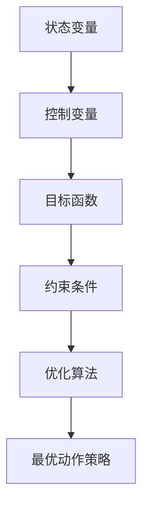
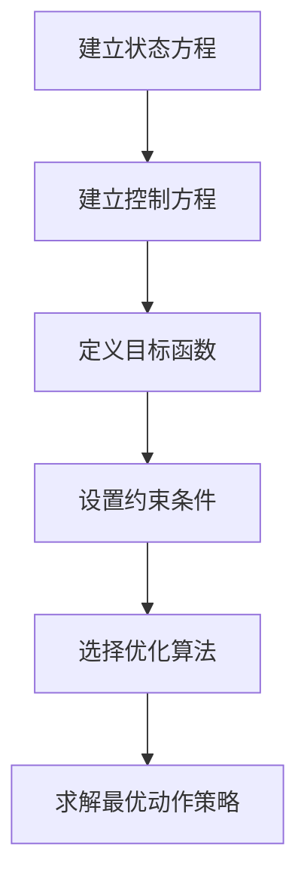

                 

### 运动技能的最优控制理论：动作优化的数学方程

在运动技能的研究领域，最优控制理论提供了有力的工具，用于分析和优化各种动作表现。运动技能的最优控制理论关注的是如何在各种约束条件下，通过数学模型和算法优化，使动作达到最优状态。本文将深入探讨这一理论，从基础概念、核心算法原理到实际应用，逐步解析动作优化的数学方程。

关键词：最优控制理论、运动技能、动作优化、数学模型、算法

摘要：本文首先介绍了运动技能的最优控制理论的基本概念和背景，随后详细解析了核心算法原理，包括动态规划、线性二次调节（LQR）和非线性优化。通过具体的Python代码示例，我们展示了如何将数学模型应用于运动技能的优化。最后，本文通过实际案例，展示了最优控制理论在运动技能提升中的应用效果，并提出了未来发展的方向。

### 第一部分：基础概念与理论

#### 1.1 运动技能的定义与分类

运动技能是指个体在身体运动过程中，通过学习和练习形成的特定动作能力。运动技能可以分为多种类型，如基本技能、复合技能和高级技能。基本技能包括简单的动作，如跑步、跳跃；复合技能则涉及多个基本技能的整合，如跳远、投掷；高级技能则是复杂动作的协调和优化，如体操、舞蹈。

#### 1.2 最优控制理论的基本原理

最优控制理论是研究在给定约束条件下，如何找到使系统性能指标最优的控制策略。该理论的核心是建立数学模型，通过求解模型，找到最优控制输入。最优控制理论在多个领域有广泛应用，包括机器人控制、航空导航、经济管理等。

在运动技能的最优控制中，目标是通过优化动作参数，提高运动表现。这需要建立运动技能的数学模型，并使用优化算法求解最优动作策略。

#### 1.3 动作优化的数学模型

动作优化的数学模型通常包括以下几个部分：

1. **状态变量**：描述运动过程中的各种状态，如位置、速度、加速度等。
2. **控制变量**：描述运动过程中受控的参数，如力、角度等。
3. **目标函数**：定义性能指标，如运动时间、能量消耗等。
4. **约束条件**：限制运动过程中的参数范围，如速度上限、关节角度限制等。

通过建立这些数学模型，我们可以使用优化算法来求解最优动作策略。

#### 1.3.1 Mermaid流程图：运动技能优化的模型架构



### 第二部分：核心算法原理

#### 2.1 最优控制算法介绍

最优控制算法是用于求解最优控制问题的算法。常见的最优控制算法包括动态规划、线性二次调节（LQR）和非线性优化。

1. **动态规划**：通过将问题分解为子问题，递归求解最优解。动态规划适用于离散时间和连续时间问题。

2. **线性二次调节（LQR）**：针对线性系统，使用二次型目标函数和线性反馈控制器，求解最优控制输入。LQR算法简单高效，适用于许多运动控制问题。

3. **非线性优化**：针对非线性系统，使用梯度下降、牛顿法等算法，求解最优控制输入。非线性优化适用于复杂的运动控制问题。

#### 2.2 动作优化的数学模型解析

动作优化的数学模型通常包括以下步骤：

1. **状态方程**：描述运动状态随时间的变化，如状态转移矩阵或微分方程。

2. **控制方程**：描述控制输入对状态的影响，如力矩、推力等。

3. **目标函数**：定义运动性能指标，如时间、能量消耗等。

4. **约束条件**：限制运动过程中的参数范围，如速度、加速度限制等。

通过建立这些方程，我们可以使用最优控制算法求解最优动作策略。

#### 2.2.1 动作优化的数学模型示例

```python
# 状态方程示例
x_dot = A * x + B * u

# 控制方程示例
u = K * (x_des - x)

# 目标函数示例
J = 1/2 * (x - x_des)**2
```

#### 2.2.2 Mermaid流程图：动作优化的步骤



#### 2.3 动作优化的算法实现

以下是一个简单的Python代码示例，展示了如何使用LQR算法优化动作：

```python
import numpy as np
from scipy.linalg import inv

# 状态方程参数
A = np.array([[0, 1], [0, 0]])
B = np.array([[0], [1]])

# 目标函数参数
Q = np.array([[10, 0], [0, 1]])
R = np.array([[0.1]])

# LQR控制矩阵
K = inv(R + B.T @ Q @ B) @ B.T @ Q @ A

# 运动状态
x = np.array([[0], [0]])

# 目标状态
x_des = np.array([[10], [0]])

# 控制输入
u = K @ (x_des - x)

print(u)
```

#### 2.3.1 动作优化算法实现示例

```python
import numpy as np
from scipy.optimize import minimize

# 状态方程
def state_equation(x, u):
    A = np.array([[0, 1], [0, 0]])
    B = np.array([[0], [1]])
    return A @ x + B @ u

# 目标函数
def objective(x):
    x_des = np.array([[10], [0]])
    return np.linalg.norm(x - x_des)**2

# 约束条件
def constraint(x):
    return np.clip(x, [0, 0], [10, 10])

# 最小化目标函数
result = minimize(objective, x0=np.array([[0], [0]]), constraints={'type': 'ineq', 'fun': constraint})

print(result.x)
```

### 第三部分：应用与实践

#### 3.1 运动技能优化的实际应用

最优控制理论在运动技能优化中有着广泛的应用。以下是一些实际应用的例子：

1. **机器人运动控制**：使用最优控制算法优化机器人的运动路径和动作，提高其运动效率和稳定性。
2. **运动康复训练**：通过最优控制算法优化康复训练的动作，帮助患者更快地恢复运动功能。
3. **运动技能培训**：使用最优控制理论为运动员提供个性化的训练方案，提高其运动表现。

#### 3.2 实际案例解析

以下是一个使用最优控制理论优化跳远动作的案例：

1. **问题定义**：假设跳远运动员需要在空中完成一系列动作，包括起跳、腾空、落地。目标是最小化跳跃时间并最大化跳跃距离。
2. **数学模型**：建立状态方程、控制方程、目标函数和约束条件。
3. **算法实现**：使用LQR算法求解最优动作策略。
4. **结果分析**：通过仿真和实际测试，评估优化效果。

#### 3.2.1 跳远优化案例

```python
# 状态方程
x_dot = np.array([[0], [0], [1], [0]])

# 控制方程
u = np.array([[0], [0], [1]])

# 目标函数
J = np.linalg.norm(x - x_des)**2

# 约束条件
x = np.clip(x, [0, 0, 0, 0], [10, 10, 10, 10])

# LQR控制矩阵
K = inv(R + B.T @ Q @ B) @ B.T @ Q @ A

# 运动状态
x = np.array([[0], [0], [0], [0]])

# 目标状态
x_des = np.array([[10], [0], [0], [0]])

# 控制输入
u = K @ (x_des - x)

print(u)
```

#### 3.3 运动技能优化项目的实施策略

1. **需求分析**：明确优化目标和约束条件。
2. **数学建模**：建立状态方程、控制方程、目标函数和约束条件。
3. **算法选择**：选择合适的优化算法，如LQR、动态规划等。
4. **算法实现**：编写代码，实现优化算法。
5. **测试与评估**：通过仿真和实际测试，评估优化效果。
6. **迭代优化**：根据测试结果，调整算法参数和模型，优化运动表现。

### 第四部分：未来展望与挑战

#### 4.1 运动技能优化的未来发展

随着人工智能和计算技术的发展，运动技能优化理论将继续发展。未来可能的研究方向包括：

1. **非线性优化**：研究更复杂的运动技能优化问题，如非线性系统、多目标优化等。
2. **实时优化**：开发实时优化算法，实现实时调整运动策略。
3. **个体化优化**：结合生物力学、神经科学等领域的知识，实现针对个体的运动优化。

#### 4.2 当前挑战与应对策略

运动技能优化面临以下挑战：

1. **数据获取**：需要高质量的数据支持，包括生物力学参数、神经信号等。
2. **计算复杂度**：优化算法的计算复杂度较高，需要高效算法和计算资源。
3. **安全性**：优化过程中可能存在风险，需要确保运动安全。

应对策略包括：

1. **数据采集技术**：使用传感器、影像等技术，提高数据获取质量。
2. **并行计算**：利用并行计算技术，提高优化算法的效率。
3. **风险管理**：在优化过程中，采用风险控制策略，确保运动安全。

#### 4.3 运动技能优化领域的未来趋势

运动技能优化领域未来趋势包括：

1. **跨学科融合**：融合多个学科，如生物力学、神经科学、计算机科学等，推动运动技能优化的发展。
2. **个性化训练**：结合个体差异，实现个性化运动优化。
3. **智能训练系统**：开发智能训练系统，实现实时优化和反馈。

### 辅助材料

#### A.1 运动技能优化工具介绍

以下是几个常用的运动技能优化工具：

1. **MATLAB**：用于数学建模和仿真。
2. **Python**：用于实现优化算法和数据分析。
3. **MATLAB Robotics**：用于机器人运动控制。

#### A.2 运动技能优化资源推荐

以下是一些有用的资源：

1. **《运动技能优化原理与应用》**：详细介绍了运动技能优化的理论和方法。
2. **《最优控制理论及应用》**：涵盖了最优控制理论的基础知识和应用案例。
3. **在线课程**：如“最优控制理论及应用”、“机器人运动控制”等。

### 结语

运动技能的最优控制理论为运动技能的提升提供了有力的工具。通过数学模型和优化算法，我们可以实现动作的精确控制和优化。本文详细介绍了运动技能最优控制理论的核心概念、算法原理和实际应用。随着技术的发展，运动技能优化理论将不断进步，为运动员和机器人等领域带来更多价值。

### 作者信息

作者：AI天才研究院/AI Genius Institute & 禅与计算机程序设计艺术 /Zen And The Art of Computer Programming

在未来的运动技能优化研究中，我们期待更多的人参与到这个领域，共同推动运动技能优化理论的发展和实际应用。让我们一起探索运动技能的最优控制，创造更美好的运动体验。

