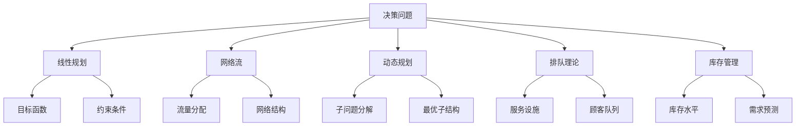

                 

### 文章标题

# 运筹学：决策过程的数学优化

### 关键词

- 运筹学
- 决策过程
- 数学优化
- 线性规划
- 网络流
- 动态规划

### 摘要

运筹学是一门应用数学的分支，旨在通过数学模型和算法优化决策过程。本文将深入探讨运筹学在决策过程中的数学优化方法，包括线性规划、网络流和动态规划等核心算法。通过实际案例和代码解析，我们将理解这些算法的原理及其在实际应用中的重要性。

## 引言

在现代社会的复杂环境中，决策者面临着日益增长的信息量和不确定性。有效的决策需要综合考虑各种因素，并从众多可能的选项中找出最优解。运筹学作为一种数学工具，为决策过程提供了系统化的分析和优化方法。

运筹学的历史可以追溯到20世纪30年代，起源于军事和工业领域的需求。当时，人们开始意识到，通过数学模型和算法可以优化资源的配置和利用，提高效率和效益。随着计算机技术的发展，运筹学逐渐成为一门独立的学科，广泛应用于企业管理、工程优化、交通运输、金融投资等领域。

### 运筹学的基本概念

运筹学涉及多个核心概念，包括线性规划、网络流、动态规划和排队理论等。每个概念都有其特定的数学模型和优化方法，用于解决不同的决策问题。

**线性规划**是一种在满足一定约束条件下，寻找目标函数最优值的数学方法。其广泛应用于资源分配、生产计划、投资组合优化等领域。

**网络流**研究在网络结构中的物资、信息或人的流动，目的是找到流量分配的最优路径，以实现成本最低或效益最大化。网络流广泛应用于物流配送、通信网络设计和供应链管理等领域。

**动态规划**是一种用于解决多阶段决策问题的方法。它通过将复杂问题分解为若干子问题，并利用子问题的最优解来构建整个问题的最优解。动态规划在优化路径选择、设备维护和投资决策等方面具有广泛的应用。

**排队理论**研究服务设施中的顾客排队现象，旨在优化服务效率和顾客满意度。它广泛应用于银行、机场、医院等公共服务领域的排队系统设计。

### 运筹学的原理与架构

为了更好地理解运筹学的原理，我们可以通过一个Mermaid流程图来展示其核心概念和联系。



### 运筹学在决策过程中的应用

运筹学在决策过程中发挥着重要作用，它不仅提供了一种系统化的分析框架，还通过数学模型和算法为决策者提供了可行的解决方案。

在企业管理中，运筹学可以用于优化生产计划、库存管理和供应链管理。例如，通过线性规划可以确定生产计划的最优方案，以满足市场需求并最小化生产成本。动态规划可以用于设备维护决策，以最大化设备的利用率并延长其使用寿命。网络流分析可以帮助企业优化物流网络，降低运输成本和提高配送效率。

在工程优化领域，运筹学被广泛应用于设计优化、网络优化和资源分配。例如，在电力系统中，运筹学可以用于优化发电计划和电网调度，以提高电力供应的稳定性和可靠性。在交通规划中，运筹学可以用于优化道路网络设计，缓解交通拥堵问题。

在金融投资领域，运筹学可以用于资产配置、风险管理和投资策略的优化。通过建立数学模型，投资者可以分析市场数据，预测资产价格波动，并制定最优的投资组合策略。

## 第一部分：运筹学基础

### 第1章：运筹学概述

#### 1.1 运筹学的基本概念

运筹学（Operations Research，简称OR）是一门应用数学的分支，它通过建立数学模型和算法，对复杂的决策问题进行分析和优化。运筹学的核心目标是找到最优解或近似最优解，以便在给定的约束条件下实现最大化效益或最小化成本。

运筹学的基本概念包括：

- **决策问题**：指决策者在不确定的环境中，需要在多个可行方案中选择一个最优方案的问题。
- **目标函数**：描述决策者希望实现的目标，可以是最大化利润、最小化成本、最大化效用等。
- **约束条件**：限制决策变量取值的条件，可以是线性不等式、非线性不等式、等式等。
- **可行解**：满足所有约束条件的解。
- **最优解**：在可行解中，使目标函数达到最大值或最小值的解。

#### 1.2 运筹学的发展历史

运筹学起源于20世纪30年代，最初是在军事领域发展起来的。当时，为了优化军事行动和资源分配，人们开始运用数学模型和算法来分析问题。二战期间，运筹学在军事决策中发挥了重要作用，例如通过排队理论优化军事设施的服务效率，通过线性规划优化军事物资的运输和分配。

20世纪50年代，运筹学逐渐从军事领域扩展到工业、商业和管理科学领域。这一时期，运筹学的研究重点转向线性规划、网络流和排队理论等基本模型。同时，计算机技术的发展为运筹学提供了强大的计算工具，使得复杂的数学模型和算法得以在实际问题中得到应用。

20世纪60年代以来，运筹学的研究领域进一步扩展，包括动态规划、整数规划、多目标规划、随机规划等。运筹学在项目管理、库存管理、供应链管理、金融投资等领域得到了广泛应用。

#### 1.3 运筹学在决策过程中的作用

运筹学在决策过程中发挥着至关重要的作用，其主要作用体现在以下几个方面：

- **提高决策的科学性**：通过建立数学模型和算法，运筹学提供了一种系统化的方法来分析和解决决策问题，减少了决策的主观性和随意性。
- **优化资源配置**：运筹学通过优化决策变量的取值，实现资源的最大化利用，降低成本，提高效益。
- **解决复杂问题**：运筹学可以处理复杂的多变量、多阶段决策问题，提供最优解或近似最优解，为决策者提供可靠的建议。
- **支持战略规划**：运筹学可以用于制定长期战略规划，帮助企业在竞争激烈的市场环境中立于不败之地。

### 小结

本章介绍了运筹学的基本概念、发展历史和在决策过程中的作用。通过理解运筹学的基本原理和应用，读者可以更好地把握其在解决复杂决策问题中的作用。在接下来的章节中，我们将深入探讨线性规划、网络流、动态规划等核心算法，进一步了解运筹学的具体应用方法。

## 第2章：线性规划

#### 2.1 线性规划的基本概念

线性规划（Linear Programming，简称LP）是运筹学中的一种重要方法，用于在满足一定约束条件下，寻找目标函数的最大值或最小值。线性规划广泛应用于资源分配、生产计划、投资组合优化等领域。

**定义**：线性规划是一种数学优化方法，它通过建立线性目标函数和线性约束条件，求解最优解。

**数学模型**：

设 $x_1, x_2, ..., x_n$ 为决策变量，$c_1, c_2, ..., c_n$ 为系数向量，$A$ 为约束条件的系数矩阵，$b$ 为约束条件的常数向量，目标函数为 $max\ \sum_{i=1}^{n} c_i x_i$，线性规划的数学模型可以表示为：

$$
\begin{aligned}
\max\ & \sum_{i=1}^{n} c_i x_i \\
s.t. & Ax \leq b \\
& x \geq 0
\end{aligned}
$$

其中，$Ax \leq b$ 表示线性不等式约束，$x \geq 0$ 表示非负约束。

**标准形式**：

线性规划的标准形式为：

$$
\begin{aligned}
\max\ & c^T x \\
s.t. & Ax \leq b \\
& x \geq 0
\end{aligned}
$$

其中，$c^T$ 表示系数向量的转置。

#### 2.2 线性规划的数学模型

线性规划的数学模型包括目标函数和约束条件。目标函数表示决策者希望实现的目标，可以是最大化利润、最小化成本、最大化效用等。约束条件描述了决策变量的取值范围和限制条件，可以是线性不等式、非线性不等式、等式等。

**目标函数**：

目标函数是线性规划的核心，它描述了决策者希望实现的目标。在最大化问题中，目标函数通常表示为：

$$
\max\ \sum_{i=1}^{n} c_i x_i
$$

其中，$c_i$ 为第 $i$ 个决策变量的系数，$x_i$ 为第 $i$ 个决策变量。

在最小化问题中，目标函数通常表示为：

$$
\min\ \sum_{i=1}^{n} c_i x_i
$$

**约束条件**：

约束条件是线性规划中必须满足的限制条件。常见的约束条件包括线性不等式、非线性不等式、等式等。

**线性不等式约束**：

线性不等式约束可以表示为：

$$
Ax \leq b
$$

其中，$A$ 是约束条件的系数矩阵，$x$ 是决策变量向量，$b$ 是约束条件的常数向量。

**非负约束**：

非负约束可以表示为：

$$
x \geq 0
$$

**等式约束**：

等式约束可以表示为：

$$
Ax = b
$$

#### 2.3 单纯形法

单纯形法（Simplex Method）是解决线性规划问题的常用算法。它通过迭代方法，逐步向最优解逼近，直到找到最优解。

**算法步骤**：

1. **初始化**：选择初始基本可行解，通常为满足约束条件的非负解。
2. **迭代过程**：在每一迭代中，根据目标函数和约束条件，确定进入变量和离开变量，更新基本可行解。
3. **终止条件**：当迭代过程中无法进一步改进目标函数时，算法终止，得到最优解。

**伪代码**：

```python
function SimplexMethod(A, b, c):
    # A: 系数矩阵
    # b: 约束条件常数向量
    # c: 目标函数系数向量

    # 初始化基本可行解
    x = InitialBasicSolution(A, b)

    # 迭代过程
    while not TerminateCondition(x, A, b, c):
        # 选择进入变量
        p = ChooseEnteringVariable(c, x, A, b)

        # 选择离开变量
        q = ChooseLeavingVariable(x, A, b, p)

        # 更新基本可行解
        x = UpdateBasicSolution(x, A, b, p, q)

    # 输出最优解
    return x
```

#### 2.4 对偶理论

对偶理论是线性规划中的一个重要理论，它揭示了原始问题和对偶问题之间的密切联系。对偶问题可以通过原始问题的约束条件和目标函数得到。

**定义**：

- **原始问题**：给定一个线性规划问题，称为原始问题，其目标函数为 $max\ c^T x$，约束条件为 $Ax \leq b$ 和 $x \geq 0$。
- **对偶问题**：原始问题的对偶问题是一个线性规划问题，其目标函数为 $min\ b^T y$，约束条件为 $A^T y \geq c$ 和 $y \geq 0$。

**对偶理论**：

- 对偶问题的最优解与原始问题的最优解相关联。
- 原始问题的对偶问题至少有一个可行解，且对偶问题的最优值不超过原始问题的最优值。
- 如果原始问题和对偶问题都有最优解，则两者的最优值相等。

**对偶变量**：

在原始问题和对偶问题中，引入对偶变量 $y$，使得对偶问题的约束条件可以表示为 $A^T y \geq c$。对偶变量 $y$ 表示原始问题的约束条件在最优解中的松弛程度。

#### 小结

本章介绍了线性规划的基本概念、数学模型、单纯形法和对偶理论。线性规划是一种重要的数学优化方法，广泛应用于资源分配、生产计划、投资组合优化等领域。通过理解线性规划的基本原理和应用，读者可以更好地解决实际中的优化问题。在下一章中，我们将继续探讨网络流问题的数学模型和算法。

## 第3章：网络流

#### 3.1 网络流的基本概念

网络流（Network Flow）是一种在给定网络结构下，研究物资、信息或人在网络中的流动的数学方法。网络流广泛应用于物流配送、通信网络、交通规划等领域，其目的是找到流量分配的最优路径，实现成本最低或效益最大化。

**定义**：

- **网络**：由一组节点（Nodes）和连接这些节点的边（Edges）组成的结构。
- **流量**：在网络的每条边上流动的物资、信息或人。
- **源点（Source）**：网络中的起点，流量从这里流出。
- **汇点（Sink）**：网络中的终点，流量从这里流入。
- **容量（Capacity）**：边上的流量上限。
- **流量分配**：将总流量分配到网络的每条边上，以满足容量限制。

**网络流的基本模型**：

网络流的基本模型可以表示为：

$$
\begin{aligned}
\max\ & \sum_{(i, j) \in E} c_{i, j} f_{i, j} \\
s.t. & \sum_{j \in N} f_{i, j} = \sum_{j \in N} f_{j, i} = 0 & (i = s) \\
& \sum_{i \in N} f_{i, j} \leq c_{i, j} & (j \in N, j \neq t) \\
& f_{i, j} \geq 0 & \forall (i, j) \in E
\end{aligned}
$$

其中，$c_{i, j}$ 为边 $(i, j)$ 的容量，$f_{i, j}$ 为边 $(i, j)$ 上的流量，$N$ 为节点集合，$E$ 为边集合。

**线性规划的对偶问题**：

网络流问题可以转化为线性规划问题，其对偶问题为：

$$
\begin{aligned}
\min\ & \sum_{(i, j) \in E} b_{i, j} x_{i, j} \\
s.t. & \sum_{i \in N} x_{i, j} = \sum_{i \in N} x_{i, j} = 0 & (j \in N, j \neq s, j \neq t) \\
& x_{i, j} \geq 0 & \forall (i, j) \in E
\end{aligned}
$$

其中，$b_{i, j}$ 为边 $(i, j)$ 的成本。

#### 3.2 最小费用最大流

最小费用最大流（Minimum Cost Maximum Flow）是一种在网络流问题中，在满足容量限制的条件下，找到最小成本的最大流量的方法。最小费用最大流广泛应用于物流配送、通信网络、金融交易等领域。

**定义**：

最小费用最大流的目标是在满足网络容量限制的条件下，找到一条流量最大的路径，并使该路径上的流量成本最小。

**数学模型**：

最小费用最大流的数学模型可以表示为：

$$
\begin{aligned}
\max\ & \sum_{(i, j) \in E} c_{i, j} f_{i, j} \\
s.t. & \sum_{j \in N} f_{i, j} = \sum_{j \in N} f_{j, i} = 0 & (i \in N, i \neq s, i \neq t) \\
& \sum_{i \in N} f_{i, j} \leq c_{i, j} & (j \in N, j \neq s, j \neq t) \\
& f_{i, j} \geq 0 & \forall (i, j) \in E
\end{aligned}
$$

其中，$c_{i, j}$ 为边 $(i, j)$ 的成本。

**算法**：

最小费用最大流问题可以通过网络流算法（如Dinic算法、Edmonds-Karp算法等）求解。以下是Dinic算法的基本步骤：

1. **初始化**：设置流量为0，设置残留网络。
2. **递增路径搜索**：在残留网络中寻找一条增广路径，并更新流量和残留网络。
3. **循环**：重复执行递增路径搜索，直到无法找到增广路径。
4. **计算最小费用**：根据流量和边成本计算最小费用。

#### 3.3 流量分配问题

流量分配问题（Flow Allocation Problem）是一种在网络流问题中，在满足容量限制的条件下，将总流量分配到网络的每条边上，实现流量成本最小的方法。

**定义**：

流量分配问题是在满足网络容量限制的条件下，将总流量 $F$ 分配到网络的每条边上，实现总成本最小的流量分配。

**数学模型**：

流量分配问题的数学模型可以表示为：

$$
\begin{aligned}
\min\ & \sum_{(i, j) \in E} c_{i, j} f_{i, j} \\
s.t. & \sum_{j \in N} f_{i, j} = \sum_{j \in N} f_{j, i} = 0 & (i \in N, i \neq s, i \neq t) \\
& \sum_{i \in N} f_{i, j} \leq c_{i, j} & (j \in N, j \neq s, j \

