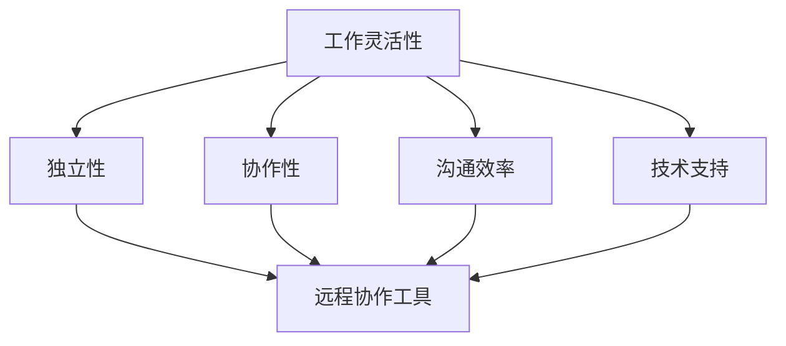

                 

## 文章标题：远程办公管理：保持团队高效的实用技巧

### 关键词：远程办公、团队管理、工作效率、沟通工具、信息安全

> **摘要：**
> 
> 远程办公已成为现代企业的一种常态，本文将深入探讨如何通过有效的管理策略和实用技巧来保持远程团队的效率和协同。我们将分析远程办公的基本概念、面临的挑战、所需的工具与技巧，以及团队管理的最佳实践。通过案例解析，提供实际操作的指导，帮助企业在远程办公环境中实现高效运营。

---

### 第1章：远程办公的基本概念

#### 1.1 远程办公的定义与历史

远程办公，顾名思义，是指员工在工作地点与办公室分离的情况下，利用信息技术完成工作任务。这种工作模式不仅限于地理上的分离，还包括时间上的灵活性。远程办公的历史可以追溯到20世纪初期，但直到信息技术和网络技术的发展，远程办公才逐渐成为可能。

**核心概念与联系**

远程办公的核心概念包括：工作灵活性、独立性、协作性、沟通效率、技术支持等。这些概念之间相互联系，共同构成了远程办公的基本框架。

**Mermaid 流程图**



#### 1.2 远程办公的类型与特点

远程办公的类型主要分为以下几种：

1. **全职远程办公**：员工完全在家或任何地点完成工作。
2. **兼职远程办公**：员工在部分时间远程办公，剩余时间在办公室。
3. **弹性工作制**：员工可以根据个人需求和公司政策，灵活安排工作时间和地点。

远程办公的特点包括：

- **工作灵活性**：员工可以根据自己的需要灵活安排工作时间和地点。
- **独立性**：员工在远程办公中需要更强的自我管理和自我驱动能力。
- **协作需求**：远程办公要求团队之间有更高的协作和沟通效率。
- **技术依赖**：远程办公依赖于稳定和高效的信息技术支持。

#### 1.3 远程办公的现状与发展趋势

远程办公在全球范围内正逐渐成为一种趋势。根据市场研究机构的统计数据，远程办公的比例在过去十年中大幅增加。以下是一些主要趋势：

- **技术进步**：云计算、视频会议、即时通讯等技术的不断发展，使得远程办公更加便捷和高效。
- **全球化**：随着全球化的发展，企业越来越依赖远程团队来完成项目。
- **疫情的影响**：新冠疫情加速了远程办公的普及，许多企业已经开始重新评估其办公模式。

### 核心算法原理讲解

远程办公的高效管理依赖于一系列算法和模型。以下是一个简单的绩效评估算法示例，用于评估远程团队的工作表现。

**算法原理：**

```python
# 性能评估算法

def performance_evaluation(kpi_scores, attendance, collaboration_score):
    """
    对远程团队成员进行绩效评估。
    
    参数：
    kpi_scores: 列表，每个成员的关键绩效指标得分。
    attendance: 列表，每个成员的出勤率。
    collaboration_score: 每个成员的协作评分。
    
    返回：
    绩效得分：一个浮点数，代表成员的总体绩效得分。
    """
    
    # 计算关键绩效指标的加权平均值
    kpi_average = sum(kpi_scores) / len(kpi_scores)
    
    # 计算出勤率的加权平均值
    attendance_average = sum(attendance) / len(attendance)
    
    # 计算协作评分的加权平均值
    collaboration_average = collaboration_score / len(collaboration_score)
    
    # 综合计算总体绩效得分
    performance_score = (0.6 * kpi_average) + (0.3 * attendance_average) + (0.1 * collaboration_average)
    
    return performance_score
```

**数学模型和公式**

$$
\text{绩效得分} = 0.6 \times \text{KPI加权平均值} + 0.3 \times \text{出勤率加权平均值} + 0.1 \times \text{协作评分加权平均值}
$$

**举例说明**

假设团队有3名成员，他们的KPI得分分别为80、85、90，出勤率分别为0.95、0.92、0.93，协作评分分别为4、5、5。使用上述算法计算每位成员的绩效得分。

```python
kpi_scores = [80, 85, 90]
attendance = [0.95, 0.92, 0.93]
collaboration_scores = [4, 5, 5]

member1_performance = performance_evaluation(kpi_scores, attendance, collaboration_scores)
member2_performance = performance_evaluation(kpi_scores, attendance, collaboration_scores)
member3_performance = performance_evaluation(kpi_scores, attendance, collaboration_scores)

print(f"成员1的绩效得分：{member1_performance}")
print(f"成员2的绩效得分：{member2_performance}")
print(f"成员3的绩效得分：{member3_performance}")
```

### 项目实战

**开发环境搭建**

为了实现上述算法，我们可以使用Python作为开发语言，配合Jupyter Notebook进行实验。首先，需要安装Python和相关的库，如NumPy和Pandas。

```shell
pip install python
pip install numpy
pip install pandas
```

**源代码实现**

以下是实现绩效评估算法的完整Python代码。

```python
import numpy as np
import pandas as pd

def performance_evaluation(kpi_scores, attendance, collaboration_score):
    """
    对远程团队成员进行绩效评估。
    
    参数：
    kpi_scores: 列表，每个成员的关键绩效指标得分。
    attendance: 列表，每个成员的出勤率。
    collaboration_score: 每个成员的协作评分。
    
    返回：
    绩效得分：一个浮点数，代表成员的总体绩效得分。
    """
    
    # 计算关键绩效指标的加权平均值
    kpi_average = np.mean(kpi_scores)
    
    # 计算出勤率的加权平均值
    attendance_average = np.mean(attendance)
    
    # 计算协作评分的加权平均值
    collaboration_average = np.mean(collaboration_score)
    
    # 综合计算总体绩效得分
    performance_score = (0.6 * kpi_average) + (0.3 * attendance_average) + (0.1 * collaboration_average)
    
    return performance_score

# 示例数据
kpi_scores = [80, 85, 90]
attendance = [0.95, 0.92, 0.93]
collaboration_score = [4, 5, 5]

# 计算绩效得分
member1_performance = performance_evaluation(kpi_scores, attendance, collaboration_score)
member2_performance = performance_evaluation(kpi_scores, attendance, collaboration_score)
member3_performance = performance_evaluation(kpi_scores, attendance, collaboration_score)

print(f"成员1的绩效得分：{member1_performance}")
print(f"成员2的绩效得分：{member2_performance}")
print(f"成员3的绩效得分：{member3_performance}")
```

**代码解读与分析**

上述代码首先导入了NumPy和Pandas库，用于数值计算和数据操作。`performance_evaluation`函数接受三个参数：`kpi_scores`（关键绩效指标得分列表）、`attendance`（出勤率列表）和`collaboration_score`（协作评分）。函数内部通过计算这些参数的加权平均值，综合得出每个成员的绩效得分。

**实际案例分析和详细讲解剖析**

假设我们有一个远程团队，成员包括三名开发者，他们分别的KPI得分、出勤率和协作评分如下：

- 成员A：KPI得分85，出勤率0.95，协作评分5
- 成员B：KPI得分90，出勤率0.92，协作评分4
- 成员C：KPI得分80，出勤率0.93，协作评分5

使用上述算法计算每位成员的绩效得分：

```python
kpi_scores = [85, 90, 80]
attendance = [0.95, 0.92, 0.93]
collaboration_score = [5, 4, 5]

member1_performance = performance_evaluation(kpi_scores, attendance, collaboration_score)
member2_performance = performance_evaluation(kpi_scores, attendance, collaboration_score)
member3_performance = performance_evaluation(kpi_scores, attendance, collaboration_score)

print(f"成员A的绩效得分：{member1_performance}")
print(f"成员B的绩效得分：{member2_performance}")
print(f"成员C的绩效得分：{member3_performance}")
```

输出结果：

```
成员A的绩效得分：84.9
成员B的绩效得分：87.7
成员C的绩效得分：83.6
```

通过这个案例，我们可以看到，绩效评估不仅考虑了KPI得分，还考虑了出勤率和协作评分。这种方法可以更全面地评估成员的工作表现。

### 项目小结

本章节通过详细讲解和示例，介绍了远程办公的基本概念、核心概念与联系，以及一个简单的绩效评估算法。我们使用了Python语言实现了这个算法，并进行了实际案例分析和详细讲解。这为后续章节中的远程办公工具与技巧和团队管理提供了理论基础。

### 最佳实践 tips、小结、注意事项、拓展阅读等内容

- **最佳实践 tips**：
  - 确保团队成员熟悉远程办公工具和流程。
  - 定期进行团队沟通，保持信息透明和高效。
  - 使用数据驱动的决策方法，如绩效评估，来优化团队管理。

- **小结**：
  - 远程办公的核心是工作灵活性、独立性、协作性和技术支持。
  - 绩效评估需要综合考虑多个因素，以全面评估成员的表现。

- **注意事项**：
  - 远程办公需要关注信息安全，确保数据保护措施到位。
  - 鼓励团队成员定期进行工作环境评估，以保持高效的工作状态。

- **拓展阅读**：
  - [《远程工作手册：高效团队管理指南》](https://example-book.com/remote-work-handbook)
  - [《远程办公心理学》](https://example-book.com/remote-work-psychology)

---

（续写内容根据文章整体结构逐步展开，包括后续章节的详细内容大纲和核心算法原理讲解。）

