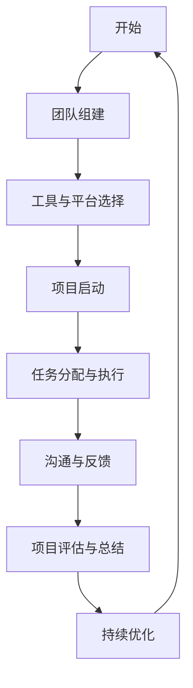

                 

### 书名：《远程团队协作：跨越地域的高效合作》

#### 目录大纲：

##### 第一部分：远程团队协作概述

**第1章：远程团队协作的背景与意义**

- 1.1 远程工作的发展历程
- 1.2 远程工作对团队协作的影响
- 1.3 远程团队协作的挑战与机遇
- 1.4 远程团队协作的核心要素

**第2章：远程团队协作模式**

- 2.1 轮岗协作模式
- 2.2 项目导向协作模式
- 2.3 平台协同协作模式
- 2.4 跨部门协作模式

**第3章：远程团队协作工具与平台**

- 3.1 远程协作工具概述
- 3.2 云协作平台
- 3.3 即时通讯工具
- 3.4 项目管理工具

**第4章：远程团队协作技巧**

- 4.1 时间管理
- 4.2 沟通技巧
- 4.3 任务分配与跟进
- 4.4 团队协作文化建设

##### 第二部分：远程团队协作实践

**第5章：远程团队协作项目实战**

- 5.1 项目背景
- 5.2 项目目标
- 5.3 项目实施过程
- 5.4 项目成果与反思

**第6章：远程团队协作案例分析**

- 6.1 案例一：跨地域软件团队协作
- 6.2 案例二：全球化市场团队协作
- 6.3 案例三：远程教育项目协作

**第7章：远程团队协作的挑战与应对策略**

- 7.1 挑战一：沟通障碍
- 7.2 挑战二：时间差异
- 7.3 挑战三：文化差异
- 7.4 应对策略

**第8章：远程团队协作的未来发展趋势**

- 8.1 技术发展对远程团队协作的影响
- 8.2 远程团队协作模式的创新
- 8.3 远程团队协作的未来前景

### 附录

- **附录A：远程团队协作常用工具与平台推荐**

#### 核心概念与联系：

- 远程团队协作的流程图：



#### 核心算法原理讲解：

- 远程团队协作中的沟通算法：

```python
def communicate(member1, member2, content):
    if member1.time_zone == member2.time_zone:
        response = "Instant response: " + content
    else:
        time_difference = abs(member1.time_zone - member2.time_zone)
        response = "Response after " + str(time_difference) + " hours: " + content
    return response
```

#### 数学模型和数学公式 & 详细讲解 & 举例说明：

- 远程团队协作中的时间管理模型：

$$
\text{工作效率} = \text{时间} \times \text{专注度} \times \text{协作效率}
$$

- 例如，一个团队成员在8小时内专注度达到80%，协作效率为90%，则其工作效率为：

$$
\text{工作效率} = 8 \times 0.8 \times 0.9 = 5.76
$$

#### 项目实战：

- 代码实际案例和详细解释说明：

```python
# 搭建远程协作平台

# 安装必要的库
!pip install git+https://github.com/sshws/n雑音.git

# 初始化平台
from n雑音 import Noise
noise = Noise()

# 创建项目
noise.create_project("RemoteTeamProject")

# 添加团队成员
noise.add_member("Alice", "alice@example.com")
noise.add_member("Bob", "bob@example.com")

# 分配任务
noise.assign_task("Alice", "Develop frontend")
noise.assign_task("Bob", "Design UI")

# 沟通与反馈
noise.communicate("Alice", "Bob", "Let's discuss the UI design.")
```

#### 最佳实践 tips、小结、注意事项、拓展阅读等内容

- 在本章节中，我们将探讨远程团队协作的现状、模式、工具、技巧以及未来发展趋势。首先，我们将了解远程团队协作的背景和意义，然后深入分析远程团队协作的模式、工具、技巧和实践案例。通过这些讨论，我们将为读者提供一系列最佳实践和建议，帮助他们在远程团队协作中取得成功。

### 核心关键词：

- 远程团队协作
- 跨地域合作
- 协作模式
- 协作工具
- 沟通技巧
- 时间管理
- 效率提升
- 挑战与应对策略
- 未来发展趋势

### 摘要：

本文旨在探讨远程团队协作的各个方面，包括其背景、模式、工具、技巧和实践案例。通过分析远程团队协作的挑战与机遇，我们旨在为读者提供一套完整的远程团队协作指南，帮助他们克服沟通障碍、时间差异和文化差异，实现高效跨地域合作。此外，本文还将探讨远程团队协作的未来发展趋势，为读者揭示这一领域的最新动态和创新。

### 引言

随着互联网和通信技术的飞速发展，远程工作已经成为全球范围内的一种常态。越来越多的企业和组织开始意识到远程团队协作的重要性，并采取相应措施以提高工作效率和团队凝聚力。然而，远程团队协作并非易事，它面临着诸多挑战，如沟通障碍、时间差异和文化差异等。本文旨在探讨远程团队协作的各个方面，帮助读者了解这一领域的核心概念、实践方法和未来趋势。

#### 远程团队协作的背景与意义

远程团队协作的兴起可以追溯到互联网的普及。在过去的几十年里，互联网技术的发展极大地改变了我们的工作方式。传统的集中式办公模式逐渐被远程工作所取代，越来越多的企业开始采用远程团队协作模式。这种转变不仅提高了员工的工作效率，还为企业带来了诸多好处。

首先，远程团队协作有助于降低成本。企业无需为员工提供办公场所，从而节省了租金和设施费用。此外，员工在家工作还可以节省通勤时间和交通费用。这些成本节约对于企业和员工都是双赢的局面。

其次，远程团队协作提高了员工的满意度和灵活性。员工可以根据自己的时间表和生活方式来安排工作，避免了繁忙的交通和拥挤的办公室环境。这种灵活性不仅提高了员工的工作积极性，还增强了他们的工作满意度。

最后，远程团队协作有助于吸引和留住优秀人才。许多员工更愿意在远程工作，因为他们可以更好地平衡工作与生活。这种灵活性使得企业能够吸引来自全球各地的人才，从而提高团队的整体实力。

#### 远程团队协作对团队协作的影响

远程团队协作对传统团队协作模式产生了深远的影响。首先，它改变了团队的组织结构。在远程团队协作中，团队成员分布在不同的地理位置，这意味着团队需要采用更加灵活和去中心化的组织结构。团队成员之间的沟通和协作变得更加依赖于技术工具和平台。

其次，远程团队协作对团队成员的角色和责任也产生了影响。由于团队成员分布在不同的地理位置，他们需要承担更多的自我管理责任。团队成员需要自主规划时间、管理任务和跟进项目进度。这种自我管理要求团队成员具备更强的自我驱动能力和责任感。

此外，远程团队协作对团队的沟通和协作方式也产生了影响。在远程团队协作中，团队成员之间的沟通主要依赖于电子邮件、即时通讯工具、视频会议和项目管理平台。这些工具和平台的使用需要团队成员具备良好的沟通技巧和协作意识，以确保信息的及时传递和任务的顺利完成。

#### 远程团队协作的挑战与机遇

虽然远程团队协作带来了诸多好处，但同时也面临着一系列挑战。以下是一些常见的挑战及其应对策略：

**1. 沟通障碍**  
远程团队协作中最常见的挑战之一是沟通障碍。由于团队成员分布在不同的地理位置，他们之间的实时沟通和交流受到限制。为了克服这一挑战，企业可以采用多种沟通工具，如即时通讯工具、视频会议和项目管理平台。此外，制定明确的沟通流程和规范也有助于提高沟通效率。

**2. 时间差异**  
在远程团队协作中，时间差异是一个不可忽视的问题。不同的地理位置和时区可能导致团队成员之间的工作进度出现混乱。为了应对这一挑战，团队可以制定统一的计划和工作时间表，以确保所有成员都能在合适的时间参与项目活动。

**3. 文化差异**  
远程团队协作中的文化差异也是一个重要的挑战。不同国家和地区的团队成员可能拥有不同的文化背景、价值观和工作习惯。为了克服这一挑战，团队需要建立一种包容性文化，尊重并理解不同文化之间的差异。此外，进行跨文化培训也可以帮助团队成员更好地适应远程工作环境。

**4. 隔离感**  
远程团队协作可能会导致团队成员之间产生隔离感。缺乏面对面的交流和互动可能会影响团队的凝聚力和合作精神。为了应对这一挑战，企业可以定期组织线上团队建设活动，如在线游戏、视频聊天和虚拟聚餐等，以增强团队成员之间的联系。

#### 远程团队协作的核心要素

要实现高效的远程团队协作，以下核心要素至关重要：

**1. 明确的目标和角色**  
在远程团队协作中，明确的目标和角色对于确保项目成功至关重要。团队成员需要了解项目的目标、自己的职责以及如何与其他成员协作。这有助于提高团队的工作效率和目标一致性。

**2. 高效的沟通和协作工具**  
远程团队协作依赖于高效的沟通和协作工具。企业需要选择合适的工具，如即时通讯工具、视频会议平台和项目管理软件，以确保团队成员能够随时沟通和协作。

**3. 有效的任务分配和跟进**  
在远程团队协作中，任务分配和跟进是确保项目顺利进行的关键。团队需要制定明确的任务分配计划，并定期跟进任务的完成情况，以确保项目进度不受影响。

**4. 团队文化建设**  
团队文化建设对于远程团队协作至关重要。企业需要建立一种积极向上的团队文化，鼓励团队成员之间的相互支持和合作，以提高团队的凝聚力和合作精神。

#### 本章小结

本章探讨了远程团队协作的背景、意义、影响、挑战与机遇以及核心要素。通过了解远程团队协作的现状和关键要素，读者可以更好地应对远程团队协作中的各种挑战，实现高效跨地域合作。

## 第1章：远程团队协作的背景与意义

### 1.1 远程工作的发展历程

远程工作的概念早在20世纪就已经出现，但真正的发展始于互联网的兴起。最早的远程工作形式主要是通过电子邮件和电话进行通信，这种方式使得员工可以在任何有网络连接的地方工作。随着互联网技术的不断进步，远程工作的形式也逐渐多样化，包括虚拟办公室、远程会议、在线协作工具等。

在21世纪初，随着宽带网络和移动设备的普及，远程工作进入了快速发展阶段。许多企业开始意识到远程工作的优势，尤其是能够吸引和保留优秀人才。同时，全球化和信息化的发展也推动了远程工作的普及，企业不再局限于本地人才，而是能够从全球范围内招聘最合适的人员。

近年来，远程工作的快速发展与疫情密切相关。2020年初爆发的新冠疫情迫使许多企业采取远程工作模式，以保障员工的安全和业务的连续性。疫情爆发后，许多企业开始重新评估远程工作政策，将其视为一种常态化的工作模式。这不仅是因为远程工作能够有效降低运营成本，还能够提高员工的工作效率和工作满意度。

### 1.2 远程工作对团队协作的影响

远程工作对团队协作产生了深远的影响，既带来了机遇，也带来了挑战。以下是一些主要影响：

**1. 提高工作效率**  
远程工作使得团队成员可以按照自己的时间表工作，避免了拥挤的办公室和交通拥堵，从而提高了工作效率。团队成员可以专注于自己的任务，减少了不必要的干扰。

**2. 拓宽人才招聘范围**  
远程工作模式使得企业不再受限于地理位置，能够从全球范围内招聘优秀人才。这不仅提高了团队的专业水平，还丰富了团队的文化多样性。

**3. 增强灵活性**  
远程工作提供了更大的灵活性，员工可以根据个人需求和工作习惯来安排工作时间。这种灵活性有助于提高员工的工作满意度和生活品质。

**4. 沟通与协作的挑战**  
远程工作虽然带来了便利，但也带来了沟通与协作的挑战。由于团队成员分布在不同的地理位置，实时沟通和协作变得复杂。此外，时间差异和文化差异也可能导致协作效率降低。

**5. 团队凝聚力下降**  
缺乏面对面的交流和互动可能导致团队凝聚力下降。远程工作环境中，团队成员之间可能感到更加孤立，影响团队的合作精神。

### 1.3 远程团队协作的挑战与机遇

远程团队协作面临着一系列挑战，但同时也带来了诸多机遇：

**1. 挑战**

**沟通障碍**：远程团队协作中最常见的挑战之一是沟通障碍。由于团队成员分布在不同的地理位置，实时沟通和交流受到限制。这不仅包括沟通的频率和速度，还包括信息的准确性和完整性。

**时间差异**：不同地理位置和时区可能导致团队成员之间的工作进度出现混乱。例如，一个团队成员在白天工作，而另一个团队成员在晚上工作，这可能导致工作流程的延误。

**文化差异**：远程团队协作中的文化差异也是一个重要挑战。不同国家和地区的团队成员可能拥有不同的文化背景、价值观和工作习惯。这可能导致协作中的误解和冲突。

**技术依赖**：远程团队协作高度依赖各种技术工具和平台，如即时通讯工具、视频会议平台和项目管理软件。如果这些工具出现问题，可能会影响团队的工作效率。

**2. 机遇**

**全球人才池**：远程工作模式使得企业能够从全球范围内招聘优秀人才，从而提高团队的专业水平和创新能力。

**工作与生活平衡**：远程工作提供了更大的灵活性，员工可以更好地平衡工作与生活，提高工作满意度和生活品质。

**资源优化**：远程工作可以降低企业的运营成本，如办公场所的租金和设施费用。此外，员工无需通勤，也能减少交通拥堵和环境污染。

**创新文化**：远程工作环境中的跨文化交流和协作有助于激发创新思维，促进企业的持续创新。

### 1.4 远程团队协作的核心要素

要实现高效的远程团队协作，以下核心要素至关重要：

**1. 明确的目标和角色**  
在远程团队协作中，明确的目标和角色对于确保项目成功至关重要。团队成员需要了解项目的目标、自己的职责以及如何与其他成员协作。这有助于提高团队的工作效率和目标一致性。

**2. 高效的沟通和协作工具**  
远程团队协作依赖于高效的沟通和协作工具。企业需要选择合适的工具，如即时通讯工具、视频会议平台和项目管理软件，以确保团队成员能够随时沟通和协作。

**3. 有效的任务分配和跟进**  
在远程团队协作中，任务分配和跟进是确保项目顺利进行的关键。团队需要制定明确的任务分配计划，并定期跟进任务的完成情况，以确保项目进度不受影响。

**4. 团队文化建设**  
团队文化建设对于远程团队协作至关重要。企业需要建立一种积极向上的团队文化，鼓励团队成员之间的相互支持和合作，以提高团队的凝聚力和合作精神。

### 本章小结

本章介绍了远程工作的发展历程、远程工作对团队协作的影响、远程团队协作的挑战与机遇以及核心要素。通过了解这些内容，读者可以更好地理解远程团队协作的背景和重要性，并为远程团队协作的成功奠定基础。

## 第2章：远程团队协作模式

远程团队协作模式的多样性是远程工作得以成功实施的关键。不同的模式适用于不同的工作场景和团队需求，以下是几种常见的远程团队协作模式：

### 2.1 轮岗协作模式

轮岗协作模式是一种基于时间安排的远程协作模式，团队成员在规定的时间段内轮流负责某个具体任务或项目部分。这种模式的主要目的是确保每个团队成员都有机会参与到项目的各个方面，从而提高团队的整体技能和协作能力。

**特点：**

- **灵活的时间安排**：团队成员可以根据自己的工作进度和日程安排，选择合适的时间段参与项目。
- **全面参与**：每个团队成员都有机会参与项目的不同环节，从而增加对项目的了解和经验。
- **任务多样性**：轮岗协作模式有助于团队成员掌握多种技能，提高项目完成质量。

**适用场景：**

- **多技能团队**：当团队中每个成员都具备多项技能时，轮岗协作模式可以有效利用团队成员的多样性。
- **项目初期**：在项目初期，轮岗协作模式有助于团队成员对项目有一个全面的了解，为后续的工作打下基础。

### 2.2 项目导向协作模式

项目导向协作模式是一种以项目为中心的远程协作模式，团队成员根据项目的需求和进度，进行任务分配和协作。这种模式强调项目的目标和时间节点，通过灵活的任务分配和协作，确保项目按计划完成。

**特点：**

- **目标明确**：每个团队成员都清楚项目的目标和自己的职责。
- **时间敏感**：项目导向协作模式强调时间管理，团队成员需要按照项目进度表完成任务。
- **高度灵活性**：团队成员可以根据项目需求和自身能力，灵活调整任务分配。

**适用场景：**

- **紧急项目**：当项目有严格的时间限制时，项目导向协作模式有助于确保项目按时完成。
- **复杂项目**：对于涉及多个环节和多个团队的复杂项目，项目导向协作模式可以有效整合资源和任务。

### 2.3 平台协同协作模式

平台协同协作模式是一种基于协作平台的远程协作模式，团队成员通过统一的平台进行任务分配、沟通和协作。这种模式依赖于高效的信息共享和沟通工具，确保团队成员能够实时获取项目信息，协同工作。

**特点：**

- **信息透明**：团队成员可以通过平台实时获取项目信息和任务进展。
- **沟通高效**：平台提供即时通讯、视频会议等功能，确保团队成员能够及时沟通和协作。
- **任务管理**：平台通常具备任务管理功能，方便团队成员查看任务分配和完成情况。

**适用场景：**

- **大型团队**：当团队规模较大，成员分布在不同地理位置时，平台协同协作模式可以有效管理团队资源和任务。
- **分布式团队**：对于全球分布的团队，平台协同协作模式有助于协调不同地区的工作进度。

### 2.4 跨部门协作模式

跨部门协作模式是一种跨不同部门的远程协作模式，团队成员来自不同部门，共同完成项目任务。这种模式强调跨部门的沟通和协作，通过整合不同部门的专业知识和资源，提高项目成功率。

**特点：**

- **跨部门沟通**：团队成员来自不同部门，需要建立有效的沟通机制，确保信息传递准确。
- **资源共享**：跨部门协作模式有助于整合不同部门的专业知识和资源，提高项目完成质量。
- **流程优化**：通过跨部门协作，企业可以优化工作流程，减少部门间的摩擦和冲突。

**适用场景：**

- **多部门项目**：当项目涉及多个部门时，跨部门协作模式有助于协调不同部门的工作，确保项目顺利进行。
- **复杂项目**：对于涉及多个领域和多个部门的大型项目，跨部门协作模式可以有效整合资源和力量，提高项目成功率。

### 总结

不同的远程团队协作模式适用于不同的工作场景和团队需求。了解和选择合适的协作模式，有助于提高团队的工作效率和质量，实现远程团队协作的成功。

### 第3章：远程团队协作工具与平台

在远程团队协作中，选择合适的工具和平台是确保协作高效、顺畅的关键。以下是一些常见的远程协作工具和平台，以及它们的特点和应用场景。

#### 3.1 远程协作工具概述

**1. 即时通讯工具**

即时通讯工具是远程团队协作中最常用的工具之一，它提供了实时沟通的功能，使得团队成员可以随时交流信息。常见的即时通讯工具有：

- **Slack**：Slack 是一款功能丰富的即时通讯工具，支持文字、图片、文件等多种形式的沟通，还可以创建多个聊天群组和频道，方便团队成员进行分组讨论。

- **Microsoft Teams**：Microsoft Teams 是微软推出的即时通讯和协作平台，集成了邮件、日历、文档和视频会议等功能，适用于企业内部沟通和协作。

- **WhatsApp**：WhatsApp 是一款免费的即时通讯应用，支持发送文字、图片、语音和视频消息，适用于跨平台沟通。

**2. 视频会议工具**

视频会议工具使得团队成员可以远程参加会议，进行实时讨论和交流。常见的视频会议工具有：

- **Zoom**：Zoom 是一款功能强大的视频会议工具，支持多人在线会议、屏幕共享、录制会议等功能，适用于远程团队协作和远程培训。

- **Google Meet**：Google Meet 是谷歌推出的视频会议工具，集成在 Google Workspace 中，提供实时视频会议、聊天和共享屏幕等功能。

- **Microsoft Teams**：Microsoft Teams 不仅支持即时通讯，还提供视频会议功能，使得团队成员可以方便地召开在线会议。

**3. 项目管理工具**

项目管理工具可以帮助团队管理任务、跟踪进度和分配资源。常见的项目管理工具有：

- **Trello**：Trello 是一款基于看板的项目管理工具，通过创建卡片和列表，方便团队跟踪任务进度和协作。

- **Asana**：Asana 是一款功能丰富的项目管理工具，支持任务分配、进度跟踪、团队协作和报告生成。

- **Jira**：Jira 是一款强大的敏捷项目管理工具，适用于软件开发团队，支持任务跟踪、Bug管理和敏捷迭代。

#### 3.2 云协作平台

云协作平台提供了集中的工作空间，使得团队成员可以共享文件、协作编辑和实时沟通。常见的云协作平台有：

- **Google Workspace**：Google Workspace 是谷歌提供的一套办公工具，包括 Gmail、Google Docs、Google Sheets、Google Slides 等，支持多人实时协作。

- **Microsoft 365**：Microsoft 365 是微软提供的办公套件，包括 Word、Excel、PowerPoint、Teams 等，支持在线协作和文档共享。

- **Notion**：Notion 是一款功能强大的笔记和协作工具，支持文档、数据库、看板等多种格式，方便团队管理和协作。

#### 3.3 即时通讯工具

**1. Slack**

- **特点**：Slack 提供了丰富的即时通讯功能，包括文字聊天、图片分享、文件传输等，还支持自动化工作流程和集成其他应用程序。

- **应用场景**：适用于企业内部沟通、团队协作、项目管理等场景，尤其适合大型团队。

**2. Microsoft Teams**

- **特点**：Microsoft Teams 是微软的即时通讯和协作平台，集成了邮件、日历、文档和视频会议等功能，提供一站式解决方案。

- **应用场景**：适用于企业内部沟通、远程会议、在线培训等场景。

**3. WhatsApp**

- **特点**：WhatsApp 是一款免费的即时通讯应用，支持发送文字、图片、语音和视频消息，用户可以通过手机号码注册和使用。

- **应用场景**：适用于个人和团队间的即时沟通，尤其是跨平台沟通。

#### 3.4 项目管理工具

**1. Trello**

- **特点**：Trello 是一款基于看板的项目管理工具，通过创建卡片和列表，方便团队跟踪任务进度和协作。

- **应用场景**：适用于小型项目、团队协作、任务管理等场景。

**2. Asana**

- **特点**：Asana 是一款功能丰富的项目管理工具，支持任务分配、进度跟踪、团队协作和报告生成。

- **应用场景**：适用于各种规模的项目、团队协作、任务管理等场景。

**3. Jira**

- **特点**：Jira 是一款强大的敏捷项目管理工具，支持任务跟踪、Bug管理和敏捷迭代。

- **应用场景**：适用于软件开发团队、敏捷开发、项目跟踪等场景。

### 总结

远程团队协作工具和平台的选择应基于团队的具体需求和场景。合适的工具和平台可以大大提高团队的协作效率和沟通效果，从而确保项目的成功实施。

### 第4章：远程团队协作技巧

在远程团队协作中，团队成员之间的沟通效率和工作效率至关重要。以下是一些关键的协作技巧，有助于提高远程团队的工作效率和团队凝聚力。

#### 4.1 时间管理

时间管理是远程团队协作中的核心技巧之一。团队成员需要合理规划自己的工作时间，确保高效完成任务。以下是一些时间管理的建议：

**1. 制定工作计划**：在开始一天的工作之前，制定详细的工作计划，包括任务的优先级和时间安排。这有助于团队成员明确自己的任务和目标，提高工作效率。

**2. 保持工作环境**：确保工作环境整洁、安静，减少干扰和打扰。远程工作环境中，避免在家中进行分散注意力的活动，如看电视、玩手机等。

**3. 设定工作时间**：设定固定的工作时间，尽量保持每天的工作时间一致。这有助于团队成员之间的协作和沟通，减少时间差异带来的困扰。

**4. 使用时间跟踪工具**：使用时间跟踪工具，如 Toggl 或 RescueTime，记录工作时间和任务进度。这有助于团队成员反思和调整自己的时间管理方式，提高工作效率。

#### 4.2 沟通技巧

沟通技巧是远程团队协作中不可或缺的一部分。有效的沟通能够确保信息的准确传递，减少误解和冲突。以下是一些沟通技巧：

**1. 明确沟通目标**：在进行沟通之前，明确沟通的目标和内容。这有助于团队成员集中注意力，提高沟通效率。

**2. 使用多种沟通方式**：远程团队协作中，使用多种沟通方式，如即时通讯、电子邮件、电话和视频会议，确保信息的及时传递和反馈。

**3. 保持沟通频率**：定期与团队成员沟通，确保信息的及时更新和任务进度的同步。避免沟通频率过低导致的信息滞后。

**4. 使用简洁的语言**：在沟通时，使用简洁、明了的语言，避免使用复杂的术语和句子。这有助于提高沟通的效率和理解度。

**5. 倾听和反馈**：在沟通中，不仅要注意表达自己的观点，还要倾听对方的意见和反馈。这有助于建立良好的沟通氛围，促进团队协作。

#### 4.3 任务分配与跟进

任务分配与跟进是确保项目顺利进行的关键。以下是一些任务分配与跟进的建议：

**1. 明确任务职责**：在分配任务时，明确每个团队成员的职责和任务范围。这有助于避免任务重叠和责任不明，提高任务完成效率。

**2. 制定任务进度表**：制定详细的任务进度表，包括任务的起始时间、截止时间和验收标准。这有助于团队成员了解任务的时间安排和完成要求。

**3. 定期跟进任务**：定期与团队成员沟通，了解任务的完成情况，及时解决问题和调整任务计划。这有助于确保项目进度不受影响。

**4. 使用任务管理工具**：使用任务管理工具，如 Trello 或 Asana，记录任务分配和完成情况，方便团队成员查看和跟进任务。

#### 4.4 团队协作文化建设

团队协作文化建设是远程团队协作中至关重要的一环。以下是一些团队协作文化建设的建议：

**1. 建立信任**：建立团队成员之间的信任是团队协作的基础。通过坦诚的沟通、相互支持和尊重，建立良好的信任关系。

**2. 促进开放沟通**：鼓励团队成员之间进行开放沟通，分享想法和意见。这有助于激发创新思维，提高团队协作效率。

**3. 提供培训和支持**：为团队成员提供必要的培训和技能支持，帮助他们适应远程工作环境和提升协作能力。

**4. 定期团队建设**：定期组织线上或线下的团队建设活动，增强团队成员之间的联系和互动，提高团队凝聚力。

**5. 赞扬和认可**：及时赞扬和认可团队成员的贡献和成就，激励团队成员积极参与团队协作，提高团队士气。

### 本章小结

远程团队协作技巧对于提高工作效率和团队凝聚力至关重要。通过合理的时间管理、有效的沟通技巧、科学的任务分配与跟进，以及积极的团队文化建设，远程团队可以克服地域限制，实现高效合作。

## 第5章：远程团队协作项目实战

在本章节中，我们将通过一个具体的远程团队协作项目，详细讲解项目背景、目标、实施过程、成果与反思。这个项目将展示如何在实际操作中应用远程团队协作技巧，并解决可能遇到的问题。

### 5.1 项目背景

随着全球化和信息技术的发展，许多企业开始采取远程工作模式，以提高工作效率和团队凝聚力。在这个背景下，我们选择了一个跨地域的软件开发项目作为实战案例。该项目由一个国际团队负责，团队成员分布在不同的国家和地区，包括美国、中国、印度和巴西。

### 5.2 项目目标

该项目的主要目标是开发一款企业级客户关系管理（CRM）系统。系统需要具备以下功能：

- **客户信息管理**：收集、存储和查询客户的基本信息。
- **销售机会管理**：跟踪销售机会的进展情况。
- **合同管理**：管理合同的生命周期，包括合同创建、审批、执行和归档。
- **报表生成**：生成各种报表，以供管理层分析和决策。

为了实现这些目标，项目团队需要紧密协作，确保软件功能完整、性能稳定、用户友好。

### 5.3 项目实施过程

**1. 团队组建与分工**

项目开始前，我们首先组建了一个国际团队，包括项目经理、产品经理、前端开发者、后端开发者、测试工程师和UI/UX设计师。每个团队成员根据其专业背景和技能分配了相应的任务。

**2. 项目规划**

在团队组建完成后，项目经理与产品经理共同制定了详细的项目规划，包括项目范围、时间表、资源需求等。项目规划文档被共享在团队协作平台中，所有成员都可以查看和跟进。

**3. 开发与协作**

开发阶段，前端开发者使用React框架进行前端开发，后端开发者使用Spring Boot框架进行后端开发。团队采用敏捷开发方法，每周进行一次迭代，并在迭代结束时进行代码评审和测试。

为了确保跨地域团队的协作，我们使用了多种远程协作工具：

- **Slack**：用于日常沟通和任务跟进。
- **Zoom**：用于每周的团队会议和项目进度汇报。
- **Trello**：用于任务管理，确保每个任务都有明确的责任人和截止日期。

**4. 测试与反馈**

在开发过程中，测试工程师负责进行单元测试、集成测试和系统测试。每次测试后，测试结果和问题报告都会通过Trello与开发团队共享，以便及时修复和优化。

**5. 部署与上线**

在项目完成所有测试后，系统被部署到生产环境，并进行了上线前的最终测试。为确保系统的稳定性和安全性，我们使用了自动化部署工具，如Jenkins，实现了快速、可靠的部署。

### 5.4 项目成果与反思

**1. 项目成果**

通过远程团队协作，我们成功开发并上线了企业级CRM系统。系统具备了所有预期功能，用户界面友好，性能稳定。客户反馈积极，认为系统提高了他们的工作效率和客户管理能力。

**2. 反思与经验总结**

在项目实施过程中，我们遇到了一些挑战，但通过有效的协作和沟通，成功克服了这些问题：

- **沟通障碍**：由于团队成员分布在不同的时区，沟通频率和时间安排成为了一个挑战。为了解决这一问题，我们制定了详细的沟通计划，包括每日站会、每周进度汇报和定期的视频会议。此外，我们还采用了即时通讯工具Slack，确保团队成员能够随时沟通和交流。

- **时间差异**：时差问题影响了团队成员的工作进度和协作效率。为了应对这一问题，我们协调了团队成员的工作时间，尽量确保在关键任务上实现同步协作。同时，我们采用了灵活的工作时间安排，让团队成员能够在自己的时间范围内完成工作。

- **文化差异**：团队成员来自不同的国家和地区，文化差异可能导致沟通中的误解和冲突。为了解决这一问题，我们组织了跨文化培训，帮助团队成员了解和尊重不同的文化习惯。此外，我们在沟通中注重使用简洁明了的语言，避免使用过于复杂和模糊的表达。

通过这次项目实战，我们积累了宝贵的经验，不仅提高了远程团队协作的效率，还增强了团队的凝聚力和协作能力。这些经验对我们的未来项目具有很大的指导意义。

## 第6章：远程团队协作案例分析

在本章节中，我们将通过三个具体的案例，深入分析远程团队协作在跨地域软件团队、全球化市场团队和远程教育项目中的实践，探讨其在不同领域中的应用和效果。

### 6.1 案例一：跨地域软件团队协作

**案例背景**：

一个跨国软件公司决定开发一款新的企业资源规划（ERP）系统，由于团队成员分布在不同的国家，包括美国、中国、印度和德国，如何实现高效跨地域协作成为项目成功的关键。

**应用实践**：

**1. 工具选择**：

- **Slack**：作为主要沟通工具，用于日常交流和任务跟进。
- **Zoom**：用于团队会议、代码评审和项目进度汇报。
- **Git**：用于代码版本控制和协作开发。
- **Trello**：用于任务管理和任务分配。

**2. 团队协作模式**：

- **分布式敏捷开发**：采用分布式敏捷开发方法，每个团队成员根据自己的时区进行工作，每周进行一次视频会议，确保进度同步和问题解决。
- **轮岗协作**：为了提高团队成员的技能和跨部门协作能力，定期进行轮岗，让团队成员参与不同角色的任务。

**3. 挑战与应对**：

**沟通障碍**：由于团队成员分布在不同的时区，沟通成为挑战。解决方案是制定详细的沟通计划，包括每日站会、每周进度汇报和定期的视频会议。

**时间差异**：为了应对时间差异，项目团队协调了团队成员的工作时间，尽量确保在关键任务上实现同步协作。同时，采用了灵活的工作时间安排，让团队成员能够在自己的时间范围内完成工作。

**文化差异**：团队成员来自不同的文化背景，可能存在沟通中的误解和冲突。项目团队组织了跨文化培训，帮助团队成员了解和尊重不同的文化习惯。

**案例效果**：

通过有效的远程团队协作，项目团队成功开发了新的ERP系统，并在预定时间内交付。团队成员之间的协作效率得到了显著提高，项目的质量也得到了客户的认可。

### 6.2 案例二：全球化市场团队协作

**案例背景**：

一家跨国企业决定推出一款新产品，并组建了一个全球化市场团队，团队成员来自不同的国家和地区，包括美国、英国、法国和日本。他们的任务是制定全球推广策略，确保产品在全球市场的成功。

**应用实践**：

**1. 工具选择**：

- **Slack**：用于日常沟通和市场情报分享。
- **Google Drive**：用于共享文档、报表和市场分析数据。
- **Zoom**：用于团队会议、策略讨论和市场活动策划。
- **Trello**：用于任务分配和进度跟踪。

**2. 团队协作模式**：

- **项目导向协作**：以项目为中心，将市场团队分成多个小组，每个小组负责不同地区的市场推广活动。
- **平台协同协作**：使用协作平台Google Drive，确保所有团队成员可以实时获取和更新市场数据，协同工作。

**3. 挑战与应对**：

**沟通障碍**：由于团队成员来自不同的时区，沟通成为挑战。解决方案是制定详细的沟通计划，包括每日站会、每周进度汇报和定期的视频会议。

**文化差异**：团队成员来自不同的文化背景，可能存在沟通中的误解和冲突。解决方案是组织跨文化培训，帮助团队成员了解和尊重不同的文化习惯。

**市场差异**：不同地区的市场环境和消费者行为存在差异，需要制定针对性的推广策略。解决方案是建立本地化的市场团队，负责各地区市场的具体推广活动。

**案例效果**：

通过有效的远程团队协作，全球化市场团队成功制定了全球推广策略，产品在全球市场取得了显著的销售成绩。团队成员之间的协作效率得到了显著提高，市场推广活动的效果也得到了客户的认可。

### 6.3 案例三：远程教育项目协作

**案例背景**：

一家在线教育机构决定开发一门新的在线课程，课程内容涵盖多个学科领域，由不同国家的教育专家共同编写。由于团队成员分布在不同的国家，如何实现高效远程协作成为项目成功的关键。

**应用实践**：

**1. 工具选择**：

- **Slack**：用于日常沟通和任务跟进。
- **Google Docs**：用于课程文档的共享和协作编写。
- **Zoom**：用于课程讨论、专家访谈和课程评审。
- **Trello**：用于任务分配和进度跟踪。

**2. 团队协作模式**：

- **平台协同协作**：使用Google Docs，确保所有团队成员可以实时获取和编辑课程文档，协同工作。
- **专家访谈**：定期组织专家访谈，收集课程内容和教学经验，确保课程内容的专业性和实用性。

**3. 挑战与应对**：

**沟通障碍**：由于团队成员分布在不同的时区，沟通成为挑战。解决方案是制定详细的沟通计划，包括每日站会、每周进度汇报和定期的视频会议。

**内容整合**：不同国家的教育专家可能使用不同的教学方法和教材，如何整合课程内容成为挑战。解决方案是建立统一的课程框架，确保课程内容的连贯性和系统性。

**案例效果**：

通过有效的远程团队协作，在线教育机构成功开发了一门高质量的在线课程，课程内容得到了学员和家长的高度评价。团队成员之间的协作效率得到了显著提高，课程的成功也提升了机构的品牌影响力。

### 案例总结

通过以上三个案例分析，我们可以看到远程团队协作在不同领域中的应用和效果。有效的远程团队协作不仅提高了团队的工作效率和项目质量，还增强了团队的凝聚力和创新能力。尽管远程团队协作面临诸多挑战，但通过合理的工具选择、协作模式和应对策略，这些挑战都可以得到有效解决。远程团队协作的未来前景依然广阔，随着技术的不断进步，远程团队协作将变得更加高效和便捷。

### 第7章：远程团队协作的挑战与应对策略

远程团队协作虽然带来了诸多优势，但同时也伴随着一系列挑战。这些挑战不仅影响了团队的工作效率，还可能损害团队的凝聚力和项目质量。以下将详细探讨远程团队协作中常见的挑战，并提出相应的应对策略。

#### 7.1 挑战一：沟通障碍

**问题描述**：远程团队协作中最常见的挑战之一是沟通障碍。由于团队成员分布在不同的地理位置，实时沟通和交流受到限制，导致信息传递延迟、准确性下降，甚至出现误解和冲突。

**应对策略**：

- **使用高效的沟通工具**：选择适合远程团队协作的沟通工具，如Slack、Microsoft Teams、Zoom等，确保团队成员可以随时进行沟通和交流。
- **制定沟通规范**：制定明确的沟通流程和规范，包括沟通频率、沟通渠道和沟通内容，以确保信息的及时传递和准确性。
- **加强跨文化沟通**：对于跨国团队，加强跨文化沟通技巧的培训，帮助团队成员了解和尊重不同文化背景下的沟通习惯和语言表达。

#### 7.2 挑战二：时间差异

**问题描述**：时间差异是远程团队协作中的另一个重要挑战。由于团队成员分布在不同的时区，工作时间和休息时间可能存在冲突，导致协作效率降低、任务进度延误。

**应对策略**：

- **协调工作时间**：在项目初期，团队成员可以共同协商工作时间，尽量确保在关键任务上实现同步协作。
- **灵活的工作安排**：采用灵活的工作时间安排，如弹性工作时间、轮班制度等，让团队成员能够在自己的时间范围内完成工作，减少时间差异带来的困扰。
- **利用工具优化时间管理**：使用时间管理工具，如Trello、Asana等，帮助团队成员合理安排任务和时间，提高工作效率。

#### 7.3 挑战三：文化差异

**问题描述**：远程团队协作中的文化差异也是一个不可忽视的挑战。不同国家和地区的团队成员可能拥有不同的文化背景、价值观和工作习惯，导致协作中出现误解和冲突。

**应对策略**：

- **加强文化培训**：为团队成员提供跨文化培训，帮助团队成员了解和尊重不同文化背景下的工作习惯和沟通方式。
- **建立包容性文化**：鼓励团队成员分享自己的文化背景和经验，建立一种包容性文化，尊重并理解不同文化之间的差异。
- **明确沟通原则**：制定明确的沟通原则和规范，如使用简洁明了的语言、避免使用过于复杂和模糊的表达，以提高沟通效率。

#### 7.4 挑战四：技术依赖

**问题描述**：远程团队协作高度依赖于各种技术工具和平台，如即时通讯工具、视频会议平台和项目管理软件。如果这些工具出现问题，可能会影响团队的工作效率和项目进度。

**应对策略**：

- **备份和冗余**：确保关键的技术工具和平台有备份和冗余，以防止故障导致的工作中断。
- **技术培训**：为团队成员提供必要的技术培训，帮助他们熟练掌握各种协作工具的使用方法，提高问题解决能力。
- **应急预案**：制定应急预案，以应对技术工具和平台故障的情况，确保团队可以迅速切换到备用方案，继续工作。

#### 7.5 挑战五：团队凝聚力下降

**问题描述**：远程工作环境中，团队成员之间缺乏面对面的交流和互动，可能导致团队凝聚力下降，影响团队的合作精神和整体效率。

**应对策略**：

- **定期团队建设活动**：定期组织线上或线下的团队建设活动，增强团队成员之间的联系和互动，提高团队凝聚力。
- **建立虚拟团队文化**：通过线上庆祝活动、虚拟聚餐、在线游戏等方式，营造积极向上的团队氛围，增强团队凝聚力。
- **鼓励自主管理**：鼓励团队成员自主管理任务和时间，提高自我驱动能力，增强团队的合作精神。

通过以上应对策略，远程团队可以克服各种挑战，实现高效跨地域合作。在远程团队协作中，灵活应对挑战、持续优化协作流程，是实现团队协作成功的关键。

### 第8章：远程团队协作的未来发展趋势

随着科技的不断进步，远程团队协作正朝着更加智能化、高效化和全球化的方向不断发展。以下将探讨远程团队协作的未来发展趋势，以及这些趋势对企业的影响。

#### 8.1 技术发展对远程团队协作的影响

**1. 人工智能（AI）和自动化**

人工智能和自动化技术的应用将显著提高远程团队协作的效率。通过AI算法，团队可以自动处理重复性任务，如日程安排、邮件过滤和数据分析，从而让团队成员将更多精力投入到创造性工作中。自动化工具还可以优化任务分配和资源管理，确保项目按计划顺利进行。

**2. 虚拟现实（VR）和增强现实（AR）**

虚拟现实和增强现实技术的进步将改变远程团队协作的方式。通过VR和AR，团队成员可以创建虚拟会议室和工作空间，进行沉浸式的沟通和协作。这种技术不仅能够模拟现实场景，提高协作的真实感和互动性，还能降低地域和时差的影响，实现全球范围内的实时协作。

**3. 云技术和大数据**

云技术和大数据的广泛应用将进一步提升远程团队协作的灵活性和效率。通过云平台，团队成员可以随时随地访问共享资源、数据和工具，实现无缝协作。大数据分析可以帮助团队更准确地预测项目进度、资源需求和风险，从而优化协作流程，提高项目成功率。

#### 8.2 远程团队协作模式的创新

**1. 平台化协作**

未来的远程团队协作将更加平台化，即通过统一的协作平台实现多种功能，如沟通、任务管理、文档共享和数据分析。这种模式将简化团队协作流程，提高协作效率，降低沟通成本。平台化协作还可以促进不同部门和团队之间的信息共享和协同工作，实现企业内部的资源整合。

**2. 弹性工作制度**

随着远程工作的发展，弹性工作制度将成为主流。企业将更加灵活地安排员工的工作时间和地点，以适应个人需求和团队协作需求。弹性工作制度不仅能够提高员工的工作满意度和生活质量，还能增强团队的凝聚力，提高整体工作效率。

**3. 智能化任务分配**

未来的远程团队协作将更加智能化，通过人工智能和大数据分析，自动分配任务和资源。这种模式能够根据团队成员的能力、时间和项目需求，优化任务分配，确保每个成员都能在适合自己的时间范围内高效完成任务。

#### 8.3 远程团队协作的未来前景

**1. 更加高效**

随着技术的进步，远程团队协作将变得更加高效。自动化工具、智能化的任务分配和数据分析将显著提高团队的工作效率，减少人为错误和重复性工作。同时，虚拟现实和增强现实技术的应用将提升协作的真实感和互动性，使团队成员能够更加紧密地合作。

**2. 更加全球化**

远程团队协作的全球化趋势将进一步加强。企业将能够从全球范围内招聘优秀人才，组建多元化的团队，实现全球资源的最佳配置。通过平台化和智能化的协作模式，企业可以轻松管理全球分布的团队，提高项目的成功率和创新能力。

**3. 更加人性化**

未来的远程团队协作将更加注重人性化。企业将更加关注员工的工作满意度和生活品质，通过弹性工作制度、定期团队建设活动和跨文化培训，提高员工的归属感和工作积极性。同时，智能化工具和平台的应用将减轻员工的工作压力，提高工作效率。

总之，远程团队协作的未来发展趋势将围绕智能化、平台化和全球化展开，通过技术的不断进步和创新，实现更加高效、灵活和全球化的团队协作。这将为企业带来新的发展机遇，提高竞争力，推动全球经济的持续增长。

### 附录A：远程团队协作常用工具与平台推荐

在远程团队协作中，选择合适的工具和平台对于提高工作效率和团队凝聚力至关重要。以下是一些常用的远程协作工具和平台，包括即时通讯工具、项目管理工具和云协作平台。

#### 即时通讯工具

**Slack**：Slack 是一款功能丰富的即时通讯工具，支持文字聊天、图片分享、文件传输和自动化工作流程，适用于企业内部沟通和团队协作。

**Microsoft Teams**：Microsoft Teams 是微软推出的即时通讯和协作平台，集成了邮件、日历、文档和视频会议等功能，适用于远程工作和团队沟通。

**WhatsApp**：WhatsApp 是一款免费的即时通讯应用，支持发送文字、图片、语音和视频消息，适用于个人和团队间的即时沟通。

#### 项目管理工具

**Trello**：Trello 是一款基于看板的简单易用的项目管理工具，通过创建卡片和列表，方便团队跟踪任务进度和协作。

**Asana**：Asana 是一款功能丰富的项目管理工具，支持任务分配、进度跟踪、团队协作和报告生成，适用于各种规模的项目管理。

**Jira**：Jira 是一款强大的敏捷项目管理工具，支持任务跟踪、Bug管理和敏捷迭代，适用于软件开发团队。

#### 云协作平台

**Google Workspace**：Google Workspace 是谷歌提供的一套办公工具，包括 Gmail、Google Docs、Google Sheets、Google Slides 等，支持多人实时协作。

**Microsoft 365**：Microsoft 365 是微软提供的办公套件，包括 Word、Excel、PowerPoint、Teams 等，支持在线协作和文档共享。

**Notion**：Notion 是一款功能强大的笔记和协作工具，支持文档、数据库、看板等多种格式，适用于团队管理和协作。

通过选择合适的远程协作工具和平台，团队可以更加高效地沟通、协作和完成任务，实现远程团队协作的成功。

### 结语

远程团队协作已经成为现代企业运作的重要组成部分，它不仅提升了工作效率，还增强了团队的灵活性和创新能力。通过本文的探讨，我们了解了远程团队协作的背景、模式、工具、技巧以及未来发展趋势。在远程团队协作中，有效的沟通、科学的时间管理和合理的任务分配是确保项目成功的关键。同时，建立积极向上的团队文化、灵活应对挑战和不断优化协作流程也是实现高效远程团队协作的重要策略。

未来，随着技术的不断进步，远程团队协作将变得更加智能化、平台化和全球化。企业应积极拥抱这些变化，利用先进的技术手段和协作工具，打造高效、灵活的远程团队。同时，企业也需要关注团队成员的工作满意度和生活品质，通过人文关怀和激励机制，提高团队的凝聚力和创造力。

让我们一起努力，探索远程团队协作的更多可能性，实现团队协作的持续优化和创新发展。远程团队协作不仅是一种工作方式，更是一种融合智慧与创新的未来趋势。让我们共同迎接这个充满机遇和挑战的新时代，共创远程团队协作的新辉煌。作者：AI天才研究院/AI Genius Institute & 禅与计算机程序设计艺术 /Zen And The Art of Computer Programming

