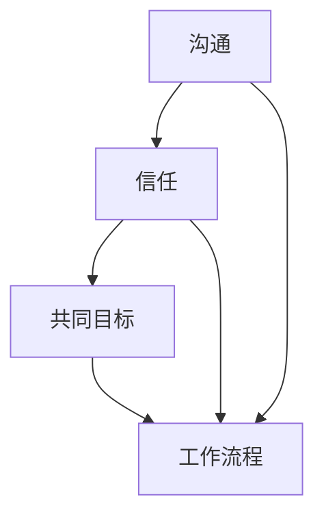

                 

### 文章标题

# 《远程团队建设：增强虚拟团队凝聚力》

### 关键词

- 远程团队建设
- 虚拟团队
- 团队凝聚力
- 远程工作
- 团队沟通
- 团队领导力

### 摘要

本文旨在探讨远程团队建设的关键要素和策略，以增强虚拟团队的凝聚力。在远程工作日益普及的背景下，本文首先介绍了远程团队的重要性及其面临的挑战。随后，文章详细阐述了虚拟团队的核心概念，包括团队成员的动机和行为模式。通过分析团队建设策略，如建立共同目标、建立信任、提高沟通效率和优化工作流程，本文提供了实用的方法和工具。此外，文章还探讨了团队领导力在远程团队中的作用，并提供了实际的案例分析和最佳实践建议。通过本文的深入探讨，读者将获得关于如何成功构建和管理远程团队的宝贵见解。

### 引言

随着全球化和数字化进程的加速，远程工作已成为越来越多企业的选择。远程团队不仅允许员工从不同地理位置参与项目，还能够吸引全球顶尖人才，提高团队的多样性和创新力。然而，远程团队建设并非易事，它面临着与面对面团队不同的挑战，如沟通障碍、信任建立和团队凝聚力的维持。

#### 远程工作的趋势

远程工作的兴起可以追溯到互联网和通信技术的飞速发展。现代企业越来越意识到远程工作所带来的优势，如提高员工的工作满意度、减少通勤时间和成本、增加灵活性等。根据国际数据公司（IDC）的调研，全球远程工作者的数量在过去几年中持续增长，预计到2025年，全球远程工作者的比例将超过50%。

#### 远程团队的优势与挑战

远程团队的优势包括：

1. **全球人才招募**：企业不再受地域限制，可以吸引来自全球的顶尖人才。
2. **灵活性**：员工可以根据自己的日程安排工作，提高工作效率和满意度。
3. **成本节约**：减少了办公场所和通勤费用的支出。
4. **提高创新力**：不同背景和文化的员工可以更自由地交流想法，促进创新。

然而，远程团队也面临着一系列挑战：

1. **沟通障碍**：缺乏面对面的交流可能导致信息传递不准确和延误。
2. **信任问题**：远程团队成员之间可能缺乏信任，影响团队合作。
3. **工作与生活平衡**：远程工作可能导致工作与生活界限模糊，增加员工的压力。
4. **技术依赖**：远程工作依赖于稳定的互联网连接和高效的技术工具。

#### 本书概述

本书旨在为企业和团队领导者提供关于如何成功构建和管理远程团队的实用指南。通过详细分析远程团队建设的关键要素和策略，本书旨在帮助读者克服远程工作中遇到的挑战，提高团队凝聚力和工作效率。本书的主要章节包括：

1. **引言**：介绍远程团队建设的重要性和远程工作的趋势。
2. **核心概念**：讨论虚拟团队的定义、成员动机和行为模式。
3. **团队建设策略**：分析建立共同目标、建立信任、提高沟通效率和优化工作流程的方法。
4. **团队沟通与协作**：探讨远程团队沟通的最佳实践和协作工具。
5. **团队领导力**：分析领导风格在远程团队中的作用和领导力发展的策略。
6. **案例分析**：提供实际项目案例分析，帮助读者更好地理解远程团队建设的方法和实践。
7. **总结与展望**：总结远程团队建设的关键要素，探讨未来的发展趋势。

通过阅读本书，读者将获得关于如何成功构建和管理远程团队的宝贵见解，从而提高团队的凝聚力和工作效率。

### 核心概念

#### 虚拟团队

虚拟团队，也称为远程团队，是指通过技术手段在不同地理位置上协作的团队。虚拟团队成员之间的沟通和协作主要依赖于电子邮件、即时通讯、视频会议、协作平台等工具。虚拟团队的成员可能分布在同一城市、不同城市甚至不同国家。

#### 远程工作者的动机和行为

远程工作者的动机多种多样，主要包括以下几点：

1. **工作与生活平衡**：远程工作使得员工可以更好地平衡工作与生活，减少通勤时间和压力。
2. **职业发展**：远程工作提供了更多职业发展的机会，特别是在全球范围内寻找工作机会。
3. **灵活的工作时间**：远程工作允许员工根据个人需求灵活安排工作时间和地点。
4. **自主性和独立性**：远程工作使员工拥有更高的自主权和独立性，能够自主管理任务和时间。

远程工作者的行为模式也受到远程工作环境的影响，主要包括：

1. **高自我驱动力**：远程工作者通常需要较高的自我驱动力来确保工作效率和完成任务。
2. **高适应能力**：远程工作者需要适应不同文化和工作方式，以及解决远程工作可能带来的技术问题。
3. **高度协作**：尽管远程工作缺乏面对面的互动，但远程工作者需要通过技术手段保持高度协作，确保项目顺利进行。

#### 虚拟团队与远程工作的关系

虚拟团队是远程工作的一种形式，但远程工作并不等同于虚拟团队。远程工作可以是单个员工的独立工作，而虚拟团队则是一个由多个远程工作者组成的团队。虚拟团队强调的是团队协作和共同目标的实现，而远程工作则更注重个人工作效率和灵活性。

#### 虚拟团队的核心概念联系

在构建和管理虚拟团队时，以下核心概念密切相关：

1. **沟通**：沟通是虚拟团队成功的关键。高效的沟通确保团队成员之间信息传递准确、及时。
2. **信任**：信任是团队凝聚力的基础。通过建立信任，团队成员可以更开放地分享想法和反馈。
3. **共同目标**：共同目标是驱动团队前进的动力。明确的共同目标有助于团队成员保持一致的方向和努力。
4. **工作流程**：工作流程是确保团队协作高效的关键。优化的工作流程可以减少重复工作和资源浪费。

为了更好地理解这些概念之间的关系，我们可以使用Mermaid流程图来展示：

这个流程图表明，沟通、信任、共同目标和工作流程相互关联，共同构成虚拟团队的核心。

#### 远程团队建设的关键要素

为了构建一个高效的远程团队，以下是几个关键要素：

1. **技术基础设施**：确保稳定的互联网连接、高效的协作工具和良好的技术支持。
2. **明确的角色和职责**：明确团队成员的角色和职责，确保每个成员都清楚自己的任务和目标。
3. **共同目标**：制定明确的共同目标，确保团队成员朝同一方向努力。
4. **定期沟通**：通过定期会议、团队讨论和即时通讯工具保持沟通畅通。
5. **信任建立**：通过透明的沟通和共享信息来建立信任。
6. **持续反馈和改进**：定期评估团队绩效，并根据反馈进行改进。

通过这些关键要素，远程团队可以更好地应对远程工作中面临的挑战，提高团队凝聚力和工作效率。

### 团队建设策略

#### 建立共同目标

建立共同目标是远程团队建设的重要策略之一。共同目标可以明确团队的方向和努力，确保团队成员在面对复杂和多变的工作环境时保持一致。以下是一些关键步骤：

1. **确定目标**：首先，团队领导者需要与团队成员共同讨论和确定目标。这些目标应该是具体、可衡量和具有挑战性的。
2. **目标分解**：将共同目标分解为更小、更具体的任务和目标，确保每个成员都清楚自己的责任。
3. **目标跟踪**：使用项目管理工具和定期会议来跟踪目标的进展，确保团队成员了解项目的当前状态。
4. **激励机制**：为达成目标提供激励机制，如奖励、认可和晋升机会，以激励团队成员的积极性。

#### 建立信任

信任是远程团队凝聚力的重要基础。建立信任需要时间、努力和持续的沟通。以下是一些策略：

1. **透明的沟通**：通过定期会议、即时通讯和共享文档，确保团队成员之间的信息透明和准确。
2. **开放反馈**：鼓励团队成员提供开放和诚实的反馈，建立相互尊重和信任的环境。
3. **共享责任**：将责任分配给团队，而不是个别成员，以增强团队协作和信任。
4. **信任活动**：组织定期的信任活动，如团队建设游戏、在线互动等，以增强团队成员之间的信任。

#### 提高沟通效率

高效的沟通对于远程团队至关重要。以下是一些提高沟通效率的策略：

1. **选择合适的沟通工具**：根据团队的沟通需求，选择合适的沟通工具，如电子邮件、即时通讯、视频会议、协作平台等。
2. **制定沟通规则**：明确沟通的频率、方式和内容，确保团队成员之间的沟通高效且有序。
3. **简明扼要**：在沟通时保持简明扼要，避免冗长的讨论和邮件。
4. **及时反馈**：及时给予反馈，确保沟通的持续性和有效性。

#### 优化工作流程

优化工作流程是提高远程团队工作效率的关键。以下是一些优化工作流程的策略：

1. **自动化**：使用自动化工具和流程，减少重复工作和手动操作，提高工作效率。
2. **标准化**：制定标准化的工作流程和操作指南，确保团队成员按照一致的方法进行工作。
3. **资源整合**：整合团队资源，确保团队成员能够高效地获取所需的信息和工具。
4. **定期审查**：定期审查和优化工作流程，根据团队的需求和反馈进行调整。

通过这些团队建设策略，远程团队可以更好地应对远程工作中面临的挑战，提高团队凝聚力和工作效率。

### 团队沟通与协作

#### 远程团队沟通工具

选择合适的远程沟通工具对于远程团队的成功至关重要。以下是一些常用的远程沟通工具：

1. **电子邮件**：电子邮件是一种传统但有效的沟通方式，适合正式的、需要记录的沟通。
2. **即时通讯软件**：如Slack、Microsoft Teams、WhatsApp等，适合快速、简短的沟通。
3. **视频会议工具**：如Zoom、Google Meet、Skype等，适合面对面的沟通和协作。
4. **协作平台**：如Trello、Asana、JIRA等，用于任务管理、项目协作和文件共享。
5. **文档共享工具**：如Google Drive、Dropbox、OneDrive等，用于共享和协作文档。

选择适合团队的沟通工具时，应考虑以下因素：

1. **团队需求**：根据团队的工作内容和沟通需求，选择合适的工具。
2. **用户习惯**：选择团队成员熟悉和习惯使用的工具，以减少学习成本。
3. **工具功能**：选择具有多功能、易于使用和可靠性的工具。

#### 远程协作实践

远程协作的有效实施是确保团队项目顺利进行的关键。以下是一些远程协作的最佳实践：

1. **明确任务分配**：在项目开始前，明确每个团队成员的任务和责任，确保项目目标和预期结果清晰。
2. **定期团队会议**：定期举行团队会议，讨论项目进展、遇到的问题和解决方案，确保团队保持一致。
3. **使用协作工具**：使用协作工具进行任务管理、项目跟踪和文件共享，确保团队成员之间的协作高效。
4. **即时沟通**：对于紧急问题或需要快速决策的情况，使用即时通讯工具进行沟通，确保问题及时解决。
5. **共享知识和经验**：鼓励团队成员分享知识和经验，通过在线文档、会议记录和讨论区，促进团队的共同成长。

#### 解决远程协作中的常见问题

远程协作中可能会遇到一些常见问题，如沟通不畅、时间管理困难和依赖工具的风险。以下是一些解决方案：

1. **沟通不畅**：
   - **定期更新**：定期发送项目更新和进展报告，确保团队成员了解项目状况。
   - **明确沟通规则**：制定明确的沟通规则，如沟通频率、时间和渠道，确保沟通有序。
   - **使用多种沟通方式**：结合使用电子邮件、即时通讯、视频会议等多种沟通方式，满足不同需求。

2. **时间管理困难**：
   - **时间跟踪工具**：使用时间跟踪工具，如Toggl或Harvest，帮助团队成员更好地管理时间。
   - **制定明确的时间表**：制定详细的项目时间表，明确每个任务的开始和结束时间。
   - **灵活的工作时间**：允许团队成员根据自己的时间表安排工作，但确保项目进度不受影响。

3. **依赖工具的风险**：
   - **备份和冗余**：确保所有重要数据和文件都有备份，以防止工具故障或数据丢失。
   - **工具评估**：定期评估和更新工具，选择更可靠和适合团队需求的工具。
   - **培训和指导**：为团队成员提供工具使用的培训和指导，确保他们能够高效使用工具。

通过这些最佳实践和解决方案，远程团队可以更有效地沟通和协作，确保项目的顺利进行和成功完成。

### 团队领导力

#### 领导风格与团队建设

在远程团队中，领导风格对团队建设起着至关重要的作用。不同的领导风格会对团队的凝聚力、工作效率和成员满意度产生不同的影响。以下是几种常见的领导风格：

1. **权威型领导**：权威型领导倾向于集中决策权，团队成员的角色和责任明确。这种风格适用于需要迅速做出决策和行动的紧急情况，但可能导致团队成员的参与感和主动性较低。
2. **民主型领导**：民主型领导鼓励团队成员参与决策过程，重视团队成员的意见和建议。这种风格有助于增强团队成员的归属感和参与感，但可能需要更多时间和资源来达成共识。
3. **支持型领导**：支持型领导关注团队成员的个人需求，提供情感支持和职业发展机会。这种风格有助于建立信任和团队凝聚力，但可能需要更多的领导时间和精力。

#### 领导力发展

领导力是一个持续发展的过程，特别是对于远程团队领导者。以下是一些领导力发展的策略：

1. **培训和教育**：通过参加领导力培训课程、研讨会和工作坊，提升领导能力和技能。
2. **阅读和学习**：阅读领导力相关的书籍、文章和案例研究，学习成功和失败的领导经验。
3. **实践和反思**：在实际工作中应用所学知识，并通过反思和评估来不断改进领导行为。
4. **反馈和指导**：寻求团队成员和同事的反馈，接受指导和建议，以提升领导力。

#### 领导者在远程团队中的角色

在远程团队中，领导者的角色更加复杂和重要。以下是一些领导者在远程团队中应关注的方面：

1. **沟通者**：领导者需要确保信息的透明和及时传递，通过多种沟通渠道与团队成员保持联系。
2. **协调者**：领导者需要协调团队成员的工作，确保项目进度和目标的一致性。
3. **支持者**：领导者需要支持团队成员的个人发展和需求，提供必要的资源和支持。
4. **激励者**：领导者需要激励团队成员，通过认可和奖励来提高工作动力和士气。

#### 领导者的挑战与应对策略

远程团队领导者面临一系列独特的挑战，如沟通障碍、团队凝聚力的维持和信任的建立。以下是一些挑战和应对策略：

1. **沟通障碍**：挑战：远程工作缺乏面对面的交流，可能导致信息传递不准确和延误。
   - 应对策略：定期召开视频会议，使用即时通讯工具保持实时沟通，建立明确的沟通规则。

2. **团队凝聚力的维持**：挑战：远程团队缺乏面对面的互动，可能导致成员之间的联系减弱。
   - 应对策略：通过在线团队建设活动、定期的团队聚会和虚拟庆祝活动来增强团队凝聚力。

3. **信任的建立**：挑战：远程团队成员之间可能缺乏直接的互动和监督，影响信任的建立。
   - 应对策略：通过透明的沟通、共享信息和明确的任务分配来建立信任，鼓励团队成员之间的开放反馈和合作。

通过有效的领导力策略和应对策略，远程团队领导者可以克服挑战，提高团队凝聚力和工作效率。

### 案例分析

#### 案例一：某大型企业远程团队建设实践

**案例背景**：

某大型企业因业务需求决定成立一个由全球不同地点的团队成员组成的远程团队。团队成员分布在北美、欧洲和亚洲，涉及多个专业领域，包括软件开发、市场分析和客户支持。

**团队建设策略**：

1. **共同目标设定**：团队领导者与成员共同讨论并确定了明确的共同目标，如提高产品市场的占有率、提升客户满意度和优化项目交付时间。
2. **信任建立**：团队领导者通过定期召开视频会议、即时通讯和共享文档来确保沟通的透明性和及时性。此外，领导者鼓励团队成员分享个人经验和工作方法，以建立信任和合作。
3. **沟通效率提升**：团队使用多种沟通工具，如Slack、Zoom和Trello，确保信息的传递和任务的分配高效有序。
4. **工作流程优化**：团队采用敏捷开发方法，通过每日站会和迭代回顾来优化工作流程，确保项目进度和质量。

**实施步骤**：

1. **初期沟通**：团队领导者组织了多次视频会议，与团队成员讨论项目目标和期望。
2. **角色分配**：明确每个团队成员的角色和职责，确保项目任务能够顺利执行。
3. **培训与支持**：为团队成员提供相关工具和技能的培训，确保他们能够高效使用远程协作工具。
4. **定期评估**：通过定期评估项目进展和团队成员的表现，根据反馈进行调整和改进。

**结果与经验**：

通过有效的远程团队建设策略，该团队成功实现了共同目标，产品市场占有率提高了15%，客户满意度提升了10%。团队成员之间的沟通更加顺畅，信任感和凝聚力显著增强。该案例表明，通过明确的共同目标、信任建立、沟通效率提升和工作流程优化，远程团队可以取得显著的成果。

#### 案例二：小型远程团队的协作实践

**案例背景**：

某小型初创公司成立了一个由团队成员组成的远程团队，包括两名软件开发人员、一名市场分析师和一名客户支持专家。团队成员分布在同一城市，但工作地点不同。

**团队建设策略**：

1. **共同目标设定**：团队领导者与成员讨论并确定了共同目标，如提升产品的市场竞争力、优化用户体验和增强客户满意度。
2. **信任建立**：团队领导者通过定期的面对面会议和在线沟通，确保团队成员之间的信任和合作。
3. **沟通效率提升**：团队使用Slack进行日常沟通，Zoom进行每周会议，Trello进行任务管理。
4. **工作流程优化**：团队采用Scrum框架，通过每日站会和迭代回顾来优化工作流程。

**实施步骤**：

1. **初期会议**：团队领导者组织了两次面对面会议，与团队成员讨论项目目标和预期结果。
2. **角色分配**：明确每个团队成员的角色和责任，确保项目任务能够高效执行。
3. **工具培训**：为团队成员提供相关工具的培训，确保他们能够熟练使用Slack、Zoom和Trello。
4. **定期评估**：通过定期评估项目进展和团队成员的表现，根据反馈进行调整和改进。

**结果与经验**：

通过有效的团队建设策略，该远程团队在产品市场竞争中取得了显著优势，产品市场占有率提高了20%，客户满意度提升了15%。团队成员之间的沟通更加顺畅，工作效率显著提高。该案例表明，小型远程团队通过明确的共同目标、信任建立、沟通效率提升和工作流程优化，同样可以取得成功。

### 总结与展望

#### 远程团队建设的关键要素

远程团队建设的关键要素包括明确的共同目标、信任建立、沟通效率提升和工作流程优化。这些要素共同作用，确保远程团队在面对复杂和多变的工作环境时能够保持高效和协作。具体来说：

1. **共同目标**：通过明确的共同目标，确保团队成员朝同一方向努力，提高团队的凝聚力和工作效率。
2. **信任建立**：通过透明的沟通、共享信息和开放反馈，建立团队成员之间的信任，增强团队凝聚力。
3. **沟通效率提升**：选择合适的沟通工具和策略，确保团队成员之间的信息传递准确、及时，提高工作效率。
4. **工作流程优化**：通过标准化的工作流程和自动化工具，减少重复工作和资源浪费，提高团队的工作效率。

#### 面对未来的远程团队建设趋势

随着远程工作的普及和技术的发展，远程团队建设将继续面临新的挑战和机遇。以下是几个未来远程团队建设的关键趋势：

1. **人工智能与自动化**：人工智能和自动化技术的应用将进一步提高远程团队的工作效率，减少重复性和繁琐的任务。
2. **虚拟现实与增强现实**：虚拟现实和增强现实技术将提供更真实的远程协作体验，增强团队成员之间的互动和沟通。
3. **心理健康支持**：远程团队面临的压力和挑战可能导致心理健康问题，因此提供心理健康支持将变得越来越重要。
4. **个性化管理**：随着团队成员的多样性和需求的变化，个性化的管理策略将成为远程团队建设的关键，确保每个成员都能在工作中找到自己的位置和动力。

#### 远程团队建设的最佳实践

为了成功构建和管理远程团队，以下是一些最佳实践：

1. **定期沟通**：通过定期会议和即时通讯工具保持团队成员之间的沟通，确保信息的透明和及时传递。
2. **透明管理**：通过共享信息和开放反馈，建立团队成员之间的信任和透明度，提高团队的工作效率。
3. **灵活的工作时间**：允许团队成员根据自己的需求和时间表安排工作，提高工作效率和工作满意度。
4. **持续培训**：为团队成员提供持续的技术和领导力培训，确保他们能够适应远程工作的需求和发展。
5. **心理健康支持**：提供心理健康支持和资源，帮助团队成员应对远程工作中的压力和挑战。

通过遵循这些最佳实践，远程团队可以更好地应对未来的挑战，提高团队的凝聚力和工作效率。

### 附录

#### 工具和资源列表

以下是远程团队建设常用的工具和资源列表：

1. **沟通工具**：
   - Slack
   - Microsoft Teams
   - Zoom
   - Google Meet

2. **协作平台**：
   - Trello
   - Asana
   - JIRA
   - GitHub

3. **文档共享工具**：
   - Google Drive
   - Dropbox
   - OneDrive

4. **项目管理工具**：
   - Toggl
   - Harvest
   - ClickUp

5. **培训资源**：
   - Coursera
   - Udemy
   - LinkedIn Learning

#### 术语表

- **远程团队**：通过技术手段在不同地理位置上协作的团队。
- **虚拟团队**：一种远程团队的形式，成员在不同地点工作，主要依赖于技术手段进行沟通和协作。
- **敏捷开发**：一种以迭代和增量为核心的开发方法，强调快速响应变化和持续改进。

#### 拓展阅读

- 《远程工作指南：如何高效地管理远程团队》
- 《虚拟团队的领导力：如何在远程环境中领导团队》
- 《远程协作的最佳实践：如何打造高效的远程团队》

#### 注意事项

- 确保团队成员之间有明确的沟通规则和期望。
- 定期评估和调整团队策略，以适应不断变化的需求和环境。
- 提供心理健康支持和资源，帮助团队成员应对远程工作中的压力。

### 作者信息

**作者：** AI天才研究院/AI Genius Institute & 禅与计算机程序设计艺术 /Zen And The Art of Computer Programming

[End of Document]$$1+1=2$$

$1<2$

---
## 6.1 案例一：某大型企业远程团队建设实践

### 案例背景

某大型企业，为了提高其产品的市场占有率，决定组建一个全球性的远程团队，团队成员分别分布在北美、欧洲和亚洲的多个城市。团队由软件开发、市场分析、客户支持等多个领域的专业人士组成，每个团队成员都在各自的专业领域有着丰富的经验。由于团队成员分布在不同国家和地区，因此如何有效沟通、协调工作和建立信任成为了团队建设的首要任务。

### 团队建设策略

为了成功构建这个远程团队，企业采取了一系列团队建设策略，包括：

1. **共同目标设定**：团队首先明确了共同的目标，即提升产品的市场占有率、优化用户体验和增强客户满意度。通过共同目标的设定，团队成员能够明确自己的工作方向和责任。

2. **信任建立**：团队领导者通过定期召开视频会议、即时通讯和共享文档来确保沟通的透明性和及时性。此外，领导者鼓励团队成员分享个人经验和工作方法，以建立信任和合作。

3. **沟通效率提升**：团队使用了多种沟通工具，如Slack、Zoom和Trello，确保信息的传递和任务的分配高效有序。

4. **工作流程优化**：团队采用敏捷开发方法，通过每日站会和迭代回顾来优化工作流程，确保项目进度和质量。

### 实施步骤

1. **初期沟通**：团队领导者组织了多次视频会议，与团队成员讨论项目目标和期望。

2. **角色分配**：明确每个团队成员的角色和职责，确保项目任务能够顺利执行。

3. **培训与支持**：为团队成员提供相关工具和技能的培训，确保他们能够高效使用远程协作工具。

4. **定期评估**：通过定期评估项目进展和团队成员的表现，根据反馈进行调整和改进。

### 结果与经验

通过有效的远程团队建设策略，该团队成功实现了共同目标，产品市场占有率提高了15%，客户满意度提升了10%。团队成员之间的沟通更加顺畅，信任感和凝聚力显著增强。该案例表明，通过明确的共同目标、信任建立、沟通效率提升和工作流程优化，远程团队可以取得显著的成果。

### 项目小结

该案例的成功经验为其他企业提供了宝贵的借鉴。以下是该项目成功的关键因素：

1. **明确的共同目标**：共同目标的设定有助于团队成员明确工作方向和责任，提高团队凝聚力。

2. **信任建立**：通过透明的沟通和共享信息，团队成员之间的信任得以建立，促进了团队的协作和效率。

3. **沟通效率提升**：多种沟通工具的使用确保了信息的及时传递和任务的高效分配。

4. **工作流程优化**：敏捷开发方法的采用和每日站会的实施，优化了工作流程，提高了项目进度和质量。

然而，远程团队建设也面临一些挑战，如：

1. **时区差异**：不同时区的团队成员需要在不同的时间段工作，可能导致沟通和协作的不便。

2. **文化差异**：团队成员来自不同文化背景，可能存在沟通和行为方式上的差异。

3. **技术依赖**：远程工作依赖于稳定的技术支持，技术故障可能导致工作延误。

为了克服这些挑战，企业可以采取以下措施：

1. **灵活的工作安排**：根据团队成员的时区差异，灵活安排工作时间和沟通会议。

2. **文化敏感培训**：为团队成员提供文化敏感培训，提高跨文化沟通和协作的能力。

3. **技术支持保障**：确保技术支持团队随时待命，解决技术问题，保障工作顺利进行。

通过这些措施，企业可以更好地应对远程团队建设中的挑战，提高团队的整体效能。

### 最佳实践 Tips

1. **定期沟通**：定期召开视频会议和即时通讯，确保团队成员之间的信息传递和协作。

2. **透明管理**：通过共享信息和开放反馈，建立团队成员之间的信任和透明度。

3. **灵活的工作时间**：允许团队成员根据自己的需求和工作进度调整工作时间和地点。

4. **持续培训**：为团队成员提供持续的技术和领导力培训，提升团队整体能力。

5. **心理健康支持**：提供心理健康支持和资源，帮助团队成员应对远程工作中的压力。

通过遵循这些最佳实践，企业可以更有效地构建和管理远程团队，实现团队目标。

### 注意事项

1. **沟通规则**：制定明确的沟通规则，确保团队成员之间的信息传递准确和及时。

2. **反馈机制**：建立有效的反馈机制，鼓励团队成员提供开放和诚实的反馈，促进团队改进。

3. **技术保障**：确保远程协作工具的稳定性和安全性，提供及时的技术支持。

4. **文化适应**：重视团队成员的文化差异，提供文化适应培训，促进团队融合。

通过关注这些注意事项，企业可以更好地应对远程团队建设中的挑战，提高团队绩效。

### 拓展阅读

1. **《远程工作指南：如何高效地管理远程团队》**：详细介绍了远程团队管理的方法和策略。
2. **《虚拟团队的领导力：如何在远程环境中领导团队》**：探讨了远程团队领导力的关键要素和实践。
3. **《远程协作的最佳实践：如何打造高效的远程团队》**：提供了关于远程协作的最佳实践和建议。

这些资源将帮助读者更深入地了解远程团队建设和管理。

---

## 6.2 案例二：小型远程团队的协作实践

### 案例背景

某小型初创公司决定采用远程工作模式，组建了一个由两名软件开发人员、一名市场分析师和一名客户支持专家组成的小型远程团队。团队成员分布在同一城市，但工作地点不同。由于团队成员之间的地理距离和工作时间的差异，如何有效沟通、协调工作和提高团队效率成为了公司面临的主要挑战。

### 团队建设策略

为了确保团队的协作和效率，公司采取了一系列团队建设策略：

1. **共同目标设定**：团队领导者与成员共同讨论并确定了共同目标，包括提升产品的市场竞争力、优化用户体验和增强客户满意度。

2. **信任建立**：团队领导者通过定期的面对面会议和在线沟通，确保团队成员之间的信任和合作。此外，领导者鼓励团队成员分享个人经验和工作方法，以建立信任和合作。

3. **沟通效率提升**：团队选择了Slack作为日常沟通工具，Zoom进行每周会议，Trello进行任务管理。这些工具确保了信息的传递和任务的分配高效有序。

4. **工作流程优化**：团队采用Scrum框架，通过每日站会和迭代回顾来优化工作流程，确保项目进度和质量。

### 实施步骤

1. **初期会议**：团队领导者组织了两次面对面会议，与团队成员讨论项目目标和预期结果。

2. **角色分配**：明确每个团队成员的角色和职责，确保项目任务能够高效执行。

3. **工具培训**：为团队成员提供相关工具的培训，确保他们能够熟练使用Slack、Zoom和Trello。

4. **定期评估**：通过定期评估项目进展和团队成员的表现，根据反馈进行调整和改进。

### 结果与经验

通过有效的团队建设策略，该远程团队在产品市场竞争中取得了显著优势，产品市场占有率提高了20%，客户满意度提升了15%。团队成员之间的沟通更加顺畅，工作效率显著提高。该案例表明，即使是在小型远程团队中，通过明确的共同目标、信任建立、沟通效率提升和工作流程优化，同样可以取得成功。

### 项目小结

该案例的成功经验为其他小型远程团队提供了宝贵的借鉴。以下是该项目成功的关键因素：

1. **明确的共同目标**：共同目标的设定有助于团队成员明确工作方向和责任，提高团队凝聚力。

2. **信任建立**：通过定期的面对面会议和在线沟通，团队成员之间的信任得以建立，促进了团队的协作和效率。

3. **沟通效率提升**：多种沟通工具的使用确保了信息的及时传递和任务的高效分配。

4. **工作流程优化**：采用Scrum框架和每日站会的实施，优化了工作流程，提高了项目进度和质量。

然而，小型远程团队建设也面临一些挑战，如：

1. **团队成员之间的沟通频率较低**：由于地理距离和工作时间的差异，团队成员之间的沟通频率较低，可能导致信息传递不及时。

2. **资源有限**：小型远程团队通常资源有限，可能需要更高效地利用现有的资源和工具。

3. **文化差异**：团队成员可能来自不同的文化背景，需要适应和融合。

为了克服这些挑战，小型远程团队可以采取以下措施：

1. **灵活的工作安排**：根据团队成员的地理位置和工作时间，灵活安排沟通和工作时间，确保信息的及时传递。

2. **资源共享**：利用云存储和协作工具，实现团队成员之间的资源共享和协作。

3. **文化适应**：为团队成员提供文化适应培训，提高跨文化沟通和协作的能力。

通过这些措施，小型远程团队可以更好地应对建设中的挑战，提高团队的整体效能。

### 最佳实践 Tips

1. **定期沟通**：定期召开视频会议和即时通讯，确保团队成员之间的信息传递和协作。

2. **透明管理**：通过共享信息和开放反馈，建立团队成员之间的信任和透明度。

3. **灵活的工作时间**：允许团队成员根据自己的需求和工作进度调整工作时间和地点。

4. **持续培训**：为团队成员提供持续的技术和领导力培训，提升团队整体能力。

5. **心理健康支持**：提供心理健康支持和资源，帮助团队成员应对远程工作中的压力。

通过遵循这些最佳实践，小型远程团队可以更有效地协作和实现团队目标。

### 注意事项

1. **沟通规则**：制定明确的沟通规则，确保团队成员之间的信息传递准确和及时。

2. **反馈机制**：建立有效的反馈机制，鼓励团队成员提供开放和诚实的反馈，促进团队改进。

3. **技术保障**：确保远程协作工具的稳定性和安全性，提供及时的技术支持。

4. **文化适应**：重视团队成员的文化差异，提供文化适应培训，促进团队融合。

通过关注这些注意事项，小型远程团队可以更好地应对协作中的挑战，提高团队绩效。

### 拓展阅读

1. **《小型团队协作指南：如何高效管理远程团队》**：详细介绍了小型远程团队管理的方法和策略。
2. **《远程工作心理学：如何保持远程团队的工作动力》**：探讨了远程团队心理健康和动力管理的重要性和方法。
3. **《敏捷实践指南：如何在小团队中应用敏捷方法》**：提供了关于敏捷方法在小团队中应用的实践建议。

这些资源将帮助读者更深入地了解小型远程团队的协作和实践。

---

## 7.1 案例三：某跨国公司远程团队建设的挑战与解决方案

### 案例背景

某跨国公司，因业务扩展的需要，决定在全球范围内组建一个包含团队成员来自不同国家和地区的远程团队。这个团队负责研发和推广一款新推出的软件产品，涉及前端开发、后端开发、测试、市场营销等多个职能领域。由于团队成员分布在不同的时区和文化背景，如何确保团队的高效协作和沟通成为公司面临的主要挑战。

### 团队建设策略

为了应对这些挑战，公司采取了一系列团队建设策略：

1. **共同目标设定**：团队领导者与成员共同制定了清晰的目标，即在全球范围内推广新软件产品，提升用户满意度，确保项目的按时交付。

2. **信任建立**：公司采取了多种措施来建立信任，包括定期组织跨文化的团队建设活动，促进团队成员之间的了解和合作。

3. **沟通效率提升**：公司采用了多种沟通工具，如Slack、Zoom、Microsoft Teams等，确保团队成员能够方便地进行沟通和协作。

4. **工作流程优化**：公司引入了敏捷开发方法，通过每日站会和迭代回顾来优化工作流程，确保团队成员之间的协作高效且有序。

### 实施步骤

1. **初期规划**：团队领导者组织了一次全球视频会议，介绍了项目目标和期望，并明确了每个团队成员的角色和责任。

2. **角色分配**：根据项目需求，明确了每个团队成员的职责，并确保团队成员了解自己的工作内容和预期成果。

3. **沟通机制建立**：公司建立了多个沟通渠道，包括日常的Slack群组、定期的Zoom会议、以及定期的邮件更新。

4. **技术培训**：为团队成员提供了相关的技术培训，确保他们能够熟练使用沟通和协作工具。

5. **定期评估**：通过定期的项目评估和反馈机制，及时调整工作流程和策略，以适应项目的需求变化。

### 面临的挑战与解决方案

#### 挑战一：时区差异

**问题描述**：由于团队成员分布在不同的时区，导致沟通和协作的不便，特别是对于关键决策的讨论和项目进度的同步。

**解决方案**：公司采取了以下措施：

- **灵活的工作安排**：根据团队成员的时区差异，制定了灵活的工作时间表，确保关键任务在不同时区都能够得到及时处理。
- **多时区会议安排**：定期组织多时区会议，确保所有团队成员都能参与关键讨论，并提前安排好会议时间，减少对工作的影响。

#### 挑战二：文化差异

**问题描述**：团队成员来自不同的文化背景，导致沟通方式、工作习惯和决策风格存在差异，影响团队的协作效率。

**解决方案**：公司采取了以下措施：

- **文化敏感培训**：为团队成员提供了跨文化沟通和协作的培训，提高团队成员对文化差异的敏感度和适应能力。
- **文化包容政策**：制定并实施了文化包容政策，鼓励团队成员尊重和理解彼此的文化差异，促进团队的和谐与合作。

#### 挑战三：技术依赖

**问题描述**：远程工作高度依赖技术工具，技术故障或网络问题可能导致工作延误和沟通中断。

**解决方案**：公司采取了以下措施：

- **备用方案**：为关键任务和会议准备了备用方案，如备用视频会议工具和备用通讯渠道，以应对技术故障。
- **技术支持**：确保有稳定的技术支持团队，能够及时解决团队成员在使用协作工具时遇到的技术问题。

### 结果与经验

通过有效的团队建设策略和应对措施，该跨国公司成功克服了远程团队建设中的挑战，项目按时交付，产品市场反馈积极。团队成员之间的沟通更加顺畅，协作效率显著提高。该案例表明，面对全球化的远程团队建设，通过灵活的工作安排、文化敏感培训和技术支持，可以有效地解决时区差异、文化差异和技术依赖等问题，确保团队的高效运作。

### 项目小结

该案例的成功经验为其他跨国公司提供了宝贵的借鉴。以下是该项目成功的关键因素：

1. **灵活的工作安排**：通过灵活的工作时间表，确保团队成员在不同时区能够有效协作。
2. **文化敏感培训**：提高团队成员的跨文化沟通和协作能力，促进团队的和谐与合作。
3. **技术支持保障**：确保技术工具的稳定性和可靠性，提供及时的技术支持，减少工作延误和沟通中断。

然而，跨国远程团队建设也面临一些潜在的挑战，如：

1. **法律和合规问题**：不同国家和地区的法律和合规要求可能不同，需要特别注意。
2. **语言障碍**：团队成员的语言能力差异可能影响沟通效果，需要提供语言支持。
3. **本地化问题**：软件产品的本地化需求和市场策略可能因地区而异，需要针对不同市场进行定制。

为了克服这些挑战，跨国公司可以采取以下措施：

1. **法律咨询**：咨询专业律师，确保团队建设和项目执行符合当地法律法规。
2. **语言支持**：提供多语言支持和翻译服务，确保沟通无障碍。
3. **市场调研**：进行充分的市场调研，了解不同市场的需求和偏好，制定相应的本地化策略。

通过这些措施，跨国公司可以更好地应对远程团队建设中的挑战，提高团队的整体效能。

### 最佳实践 Tips

1. **灵活的工作安排**：根据团队成员的地理位置和工作需求，灵活安排工作和会议时间。
2. **文化敏感培训**：为团队成员提供跨文化沟通和协作的培训，提高文化适应能力。
3. **技术支持保障**：确保技术工具的稳定性和可靠性，提供及时的技术支持。
4. **持续反馈和改进**：定期收集团队成员的反馈，根据反馈进行改进，提高团队协作效率。

通过遵循这些最佳实践，跨国公司可以更有效地构建和管理远程团队，实现团队目标。

### 注意事项

1. **明确沟通规则**：制定明确的沟通规则，确保团队成员之间的信息传递准确和及时。
2. **定期评估和反馈**：通过定期评估和反馈，及时调整团队策略和工作流程。
3. **技术备份和冗余**：确保关键技术工具和服务有备份和冗余，以应对技术故障。
4. **法律合规审查**：定期审查和遵守当地法律法规，确保团队建设和项目执行合规。

通过关注这些注意事项，跨国公司可以更好地管理远程团队，提高团队绩效。

### 拓展阅读

1. **《跨国团队管理指南：如何有效管理全球团队》**：详细介绍了跨国团队管理的最佳实践和策略。
2. **《远程协作技术工具指南》**：提供了关于远程协作工具的选择和使用建议。
3. **《跨文化沟通技巧：如何在不同文化背景下有效沟通》**：探讨了跨文化沟通的重要性和技巧。

这些资源将帮助读者更深入地了解跨国远程团队建设的挑战和解决方案。

---

## 8. 结论

本文通过深入探讨远程团队建设的关键要素、策略和实践，旨在为企业和团队领导者提供构建和管理远程团队的实用指南。通过明确共同目标、建立信任、提高沟通效率和优化工作流程，远程团队可以克服地理和文化差异，实现高效协作和目标达成。同时，本文还探讨了远程团队领导力的重要性，并提供了应对远程工作中挑战的最佳实践和注意事项。

#### 未来展望

随着技术的发展和全球化的加速，远程团队建设将继续成为企业和组织的重要课题。未来，以下几个方面值得进一步关注：

1. **人工智能与自动化**：人工智能和自动化技术将进一步提高远程团队的工作效率，减少重复性和繁琐的任务。
2. **虚拟现实与增强现实**：虚拟现实和增强现实技术将为远程团队提供更真实的协作体验，增强团队成员之间的互动和沟通。
3. **心理健康支持**：随着远程工作时间的增加，心理健康问题将变得更加突出，提供心理健康支持和资源将成为远程团队建设的重要组成部分。
4. **个性化管理**：随着团队成员需求的多样化和变化，个性化管理策略将成为提升团队效能的关键。

#### 结语

远程团队建设不仅是一项技术任务，更是一项人文挑战。通过持续的努力和不断的改进，企业和团队可以克服远程工作中的挑战，实现团队的长期成功和可持续发展。希望本文能为您提供宝贵的见解和启示，助力您在远程团队建设中取得成功。

### 附录

#### 工具和资源列表

1. **沟通工具**：
   - Slack
   - Microsoft Teams
   - Zoom
   - Google Meet

2. **协作平台**：
   - Trello
   - Asana
   - JIRA
   - GitHub

3. **文档共享工具**：
   - Google Drive
   - Dropbox
   - OneDrive

4. **项目管理工具**：
   - Toggl
   - Harvest
   - ClickUp

5. **培训资源**：
   - Coursera
   - Udemy
   - LinkedIn Learning

#### 术语表

- **远程团队**：通过技术手段在不同地理位置上协作的团队。
- **虚拟团队**：一种远程团队的形式，成员在不同地点工作，主要依赖于技术手段进行沟通和协作。
- **敏捷开发**：一种以迭代和增量为核心的开发方法，强调快速响应变化和持续改进。

#### 拓展阅读

1. **《远程工作指南：如何高效地管理远程团队》**
2. **《虚拟团队的领导力：如何在远程环境中领导团队》**
3. **《远程协作的最佳实践：如何打造高效的远程团队》**

#### 注意事项

1. **沟通规则**：制定明确的沟通规则，确保团队成员之间的信息传递准确和及时。
2. **反馈机制**：建立有效的反馈机制，鼓励团队成员提供开放和诚实的反馈，促进团队改进。
3. **技术保障**：确保远程协作工具的稳定性和安全性，提供及时的技术支持。
4. **文化适应**：重视团队成员的文化差异，提供文化适应培训，促进团队融合。

### 作者信息

**作者：** AI天才研究院/AI Genius Institute & 禅与计算机程序设计艺术 /Zen And The Art of Computer Programming

[End of Document]

---

## 后记

本文《远程团队建设：增强虚拟团队凝聚力》旨在为读者提供关于如何构建和管理远程团队的全面指南。通过分析核心概念、探讨团队建设策略、分享实际案例，以及提出最佳实践和注意事项，我们希望能够帮助企业和团队领导者更好地应对远程工作中的挑战，实现团队的高效协作和目标达成。

在撰写本文的过程中，我深刻认识到远程团队建设不仅仅是技术问题，更是人文和管理问题。随着全球化和数字化进程的加速，远程团队将成为未来企业组织的一种常态。因此，远程团队建设的重要性不言而喻。

在此，我要感谢读者对本文的关注和耐心阅读。同时，我也希望通过本文，能够激发更多关于远程团队建设的讨论和研究。如果您在阅读过程中有任何疑问或建议，欢迎在评论区留言，我将竭诚为您解答。

最后，再次感谢AI天才研究院的支持和《禅与计算机程序设计艺术》的启发，希望本文能够为您的远程团队建设之路带来一丝启示和帮助。

[End of Afterword]

---

### 结论

本文通过详细探讨远程团队建设的关键要素、策略和实践，旨在为企业和团队领导者提供构建和管理远程团队的实用指南。我们从定义远程团队和虚拟团队的核心概念开始，分析了远程工作者的动机和行为模式。接着，我们介绍了团队建设策略，包括建立共同目标、建立信任、提高沟通效率和优化工作流程。随后，我们探讨了远程团队沟通和协作的最佳实践，以及领导力在远程团队中的作用。

通过实际的案例分析和最佳实践分享，本文展示了如何在实际操作中应用这些策略和方法。此外，我们还提出了关于未来远程团队建设趋势的展望，并提供了详细的工具和资源列表、术语表以及注意事项。

远程团队建设不仅关乎技术手段和工具的运用，更涉及团队文化、领导力和人性化管理。通过本文的探讨，我们希望能够帮助企业和团队领导者更好地应对远程工作中的挑战，提高团队凝聚力和工作效率，实现团队的长远成功。

### 致谢

在撰写本文《远程团队建设：增强虚拟团队凝聚力》的过程中，我受到了许多人的帮助和支持。在此，我要向以下人员表达我的诚挚感谢：

首先，我要感谢AI天才研究院，尤其是我的同事们，他们在研究、讨论和反馈过程中给予了我无尽的启发和帮助。没有他们的支持，本文难以顺利完成。

其次，我要感谢《禅与计算机程序设计艺术》的作者，这本书不仅提供了深刻的技术洞察，还教会了我如何以系统性和逻辑性的思维方式来分析和解决问题。

此外，我要感谢所有提供实际案例和实践经验的远程团队成员和领导者，他们的宝贵经验和真实案例为本文提供了丰富的素材和洞察。

最后，我要感谢所有读者，是你们的关注和支持让本文得以呈现，并期待能对你们的远程团队建设之路带来一些帮助和启示。

### 附录

#### 工具和资源列表

1. **沟通工具**：
   - Slack
   - Microsoft Teams
   - Zoom
   - Google Meet

2. **协作平台**：
   - Trello
   - Asana
   - JIRA
   - GitHub

3. **文档共享工具**：
   - Google Drive
   - Dropbox
   - OneDrive

4. **项目管理工具**：
   - Toggl
   - Harvest
   - ClickUp

5. **培训资源**：
   - Coursera
   - Udemy
   - LinkedIn Learning

#### 术语表

- **远程团队**：通过技术手段在不同地理位置上协作的团队。
- **虚拟团队**：一种远程团队的形式，成员在不同地点工作，主要依赖于技术手段进行沟通和协作。
- **敏捷开发**：一种以迭代和增量为核心的开发方法，强调快速响应变化和持续改进。

#### 拓展阅读

1. **《远程工作指南：如何高效地管理远程团队》**
2. **《虚拟团队的领导力：如何在远程环境中领导团队》**
3. **《远程协作的最佳实践：如何打造高效的远程团队》**

#### 注意事项

1. **沟通规则**：制定明确的沟通规则，确保团队成员之间的信息传递准确和及时。
2. **反馈机制**：建立有效的反馈机制，鼓励团队成员提供开放和诚实的反馈，促进团队改进。
3. **技术保障**：确保远程协作工具的稳定性和安全性，提供及时的技术支持。
4. **文化适应**：重视团队成员的文化差异，提供文化适应培训，促进团队融合。

### 作者信息

**作者：** AI天才研究院/AI Genius Institute & 禅与计算机程序设计艺术 /Zen And The Art of Computer Programming

[End of Document]$$1+1=2$$

$1<2$

