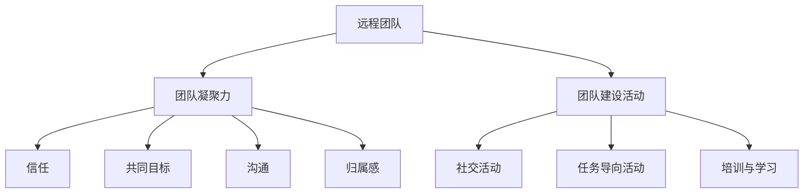

                 

### 文章标题

# 远程团队建设：增强虚拟团队凝聚力的活动

> 关键词：远程团队、团队凝聚力、虚拟团队、活动、协作、沟通

> 摘要：本文探讨了远程团队建设的核心问题，即如何增强虚拟团队的凝聚力。通过分析远程团队的特点与挑战，提出了有效的团队建设活动，并详细阐述了增强团队凝聚力的方法与技巧，为远程团队的长期高效运作提供了实践指导。

### 引言

在信息化和全球化的推动下，远程团队已成为现代企业运作的重要组成部分。远程团队不仅降低了企业的运营成本，还扩大了人才选拔的范围，提升了团队的创新能力。然而，远程团队也面临着诸多挑战，如沟通障碍、文化差异、时间同步等，这些问题严重影响了团队的凝聚力和工作效率。因此，如何有效地增强远程团队的凝聚力，成为企业管理者和团队成员共同关注的问题。

本文将围绕远程团队建设这一主题，首先介绍远程团队的概念与特点，分析远程团队面临的挑战；然后，探讨团队凝聚力的重要性及其核心要素；接着，介绍一系列旨在增强团队凝聚力的活动和技巧；最后，通过案例分析总结成功经验，为远程团队的长期高效运作提供指导。

### 核心概念与联系

在深入探讨远程团队建设之前，我们需要明确一些核心概念，并理解它们之间的关系。以下是远程团队建设中的几个关键概念及其相互关系：

#### 远程团队

远程团队指的是团队成员分布在不同的地理位置，通过互联网和其他远程通信工具进行协作的团队。远程团队的特点包括：

- **地理位置分散**：团队成员分布在不同的城市或国家，甚至有时在同一个城市内也分布在不同的工作地点。
- **时间差异**：由于地理位置的不同，团队成员的工作时间可能存在差异，导致协作上的不便。
- **依赖技术**：远程团队高度依赖各种远程协作工具和技术，如视频会议、即时通讯、项目管理软件等。

#### 团队凝聚力

团队凝聚力是指团队成员之间的相互吸引力和合作意愿。它是团队效能的基础，对远程团队尤为重要。团队凝聚力的核心要素包括：

- **信任**：团队成员之间相互信任，愿意分享信息和承担责任。
- **共同目标**：团队成员对团队的使命和目标有清晰的认识，并为此共同努力。
- **沟通**：团队成员之间的有效沟通有助于增强团队的凝聚力。
- **归属感**：团队成员感受到自己是团队的一部分，愿意为团队的成功做出贡献。

#### 团队建设活动

团队建设活动是增强团队凝聚力的重要手段。这些活动旨在促进团队成员之间的相互了解、建立信任和加强合作。团队建设活动的类型包括：

- **社交活动**：如在线茶话会、虚拟聚会等，旨在增进团队成员之间的情感联系。
- **任务导向活动**：通过共同完成工作任务，团队成员能够更好地理解彼此的工作方式和风格。
- **培训与学习**：提供培训机会，帮助团队成员提升技能和知识，增强团队的专业能力。

#### 核心概念之间的联系

远程团队、团队凝聚力与团队建设活动之间有着紧密的联系。远程团队的工作模式要求团队成员具备高度的团队凝聚力，而团队凝聚力又需要通过有效的团队建设活动来增强。因此，远程团队建设不仅需要关注技术工具的选用，还需要重视团队建设和团队凝聚力的培养。

#### Mermaid 流程图

以下是一个简化的 Mermaid 流程图，展示了核心概念之间的关系：

### 远程团队的挑战

远程团队在运作过程中面临诸多挑战，这些挑战不仅影响了团队的工作效率，也对团队的凝聚力产生了负面影响。以下是远程团队面临的主要挑战及其解决方法：

#### 沟通障碍

沟通是团队协作的基石，而远程团队由于地理位置的分散，沟通障碍成为了一大挑战。团队成员可能因为时差、网络不稳定等原因，无法及时有效地进行沟通。

**解决方法**：

1. **选择合适的沟通工具**：如 Slack、Microsoft Teams 等即时通讯工具，确保团队成员能够随时随地保持联系。
2. **定期召开虚拟会议**：通过定期的视频会议，团队成员可以面对面交流，减少误解和沟通障碍。
3. **明确沟通规范**：制定统一的沟通规范，如使用标准化的语言、明确的信息传递方式等，提高沟通效率。

#### 文化差异

远程团队成员来自不同的国家和地区，文化背景的差异可能导致沟通障碍和合作难题。

**解决方法**：

1. **文化培训**：组织文化培训，帮助团队成员了解和尊重不同的文化习惯和价值观。
2. **建立共同的价值观**：强调团队共同的目标和价值观，降低文化差异对团队协作的影响。
3. **促进跨文化交流**：鼓励团队成员分享自己的文化背景，增进相互理解和尊重。

#### 时间同步

远程团队的工作时间可能存在差异，导致任务的协调和完成受到挑战。

**解决方法**：

1. **灵活的工作安排**：根据团队成员的时间安排，灵活调整工作时间和任务分配。
2. **使用项目管理工具**：如 Trello、JIRA 等，帮助团队更好地管理和协调任务进度。
3. **设立共同的工作目标**：确保团队成员对任务目标和时间节点有清晰的认识，提高协作效率。

#### 技术依赖

远程团队高度依赖技术工具，但技术故障和网络安全问题可能影响团队的工作。

**解决方法**：

1. **选择稳定可靠的技术平台**：确保所使用的协作工具和服务稳定可靠，减少技术故障。
2. **加强网络安全意识**：通过定期的网络安全培训，提高团队成员的网络安全意识，防范网络攻击。
3. **备份和恢复机制**：建立数据备份和恢复机制，确保数据安全，避免因技术故障导致的工作中断。

#### 成果评估与反馈

由于远程团队的协作特性，团队成员之间的成果评估和反馈可能不如面对面的团队那么直观。

**解决方法**：

1. **定期绩效评估**：通过定期的绩效评估，了解团队成员的工作表现，及时给予反馈和指导。
2. **使用自动化工具**：如代码审查工具、任务管理工具等，帮助团队更客观地评估工作成果。
3. **设立反馈机制**：鼓励团队成员之间相互反馈，建立良好的反馈文化，促进个人和团队成长。

### 增强团队凝聚力的活动

为了克服远程团队面临的挑战，增强团队的凝聚力，企业可以组织一系列团队建设活动。以下是一些有效的团队建设活动，这些活动不仅能促进团队成员之间的交流与合作，还能增强团队的归属感和信任感。

#### 虚拟茶话会

虚拟茶话会是远程团队建设中最常用的活动之一。通过定期的虚拟茶话会，团队成员可以放松心情，分享工作和生活中的点滴，增进彼此的了解和信任。

**活动设计**：

- **时间安排**：选择团队成员都有空的时间，如每周五下午。
- **活动内容**：可以包括轻松的话题讨论、游戏、才艺展示等。
- **技术支持**：使用视频会议工具，如 Zoom、Microsoft Teams 等，确保活动的顺利进行。

#### 在线团队建设游戏

在线团队建设游戏是一种有趣且富有互动性的团队建设活动。通过参与游戏，团队成员可以更好地了解彼此，提高协作能力。

**活动设计**：

- **游戏选择**：选择适合远程团队的在线游戏，如在线拼图、解谜游戏等。
- **分组参与**：将团队成员分成小组，鼓励小组间的竞争与合作。
- **奖励机制**：为获胜的小组提供奖励，如虚拟礼物、电子证书等。

#### 虚拟社交聚会

虚拟社交聚会是一种模拟线下聚会的活动，通过在线平台让团队成员进行面对面的交流。这种活动有助于缓解远程工作的孤独感，增强团队的凝聚力。

**活动设计**：

- **主题选择**：根据团队的特点和需求，选择合适的聚会主题，如美食分享、旅游经历等。
- **技术支持**：使用在线视频聊天平台，如 Google Meet、Skype 等，确保活动的互动性和参与感。
- **互动环节**：设置互动环节，如问答、讨论等，增强参与度。

#### 跨文化培训

对于跨国远程团队，跨文化培训是一种有效的团队建设活动。通过培训，团队成员可以更好地了解和尊重不同的文化，降低文化冲突。

**活动设计**：

- **培训内容**：包括文化差异、礼仪习惯、沟通技巧等。
- **培训方式**：可以采用线上讲座、案例分享、角色扮演等多种方式。
- **后续跟进**：通过问卷、讨论等方式，了解培训效果，及时调整培训内容。

#### 在线研讨会

在线研讨会是一种专业性的团队建设活动，通过邀请专家或团队成员分享知识和经验，提升团队的专业能力和凝聚力。

**活动设计**：

- **主题选择**：根据团队的需求，选择合适的研讨会主题，如新技术的应用、项目管理技巧等。
- **嘉宾邀请**：邀请相关领域的专家或团队成员分享经验。
- **互动环节**：设置问答、讨论等环节，促进团队成员的参与和互动。

#### 虚拟培训课程

虚拟培训课程是一种长期性的团队建设活动，通过定期的培训，帮助团队成员提升技能和知识，增强团队的专业能力。

**活动设计**：

- **课程内容**：根据团队的需求，设计适合的培训课程，如编程技能、项目管理等。
- **学习方式**：采用在线学习平台，如 Coursera、Udemy 等，提供灵活的学习方式。
- **考核与反馈**：通过考核和反馈，确保培训效果，及时调整培训内容。

### 技术工具在远程团队建设中的应用

技术工具在远程团队建设中扮演着至关重要的角色。这些工具不仅提高了团队的协作效率，还增强了团队的凝聚力。以下是一些常用的技术工具及其应用：

#### 即时通讯工具

即时通讯工具如 Slack、Microsoft Teams 等，为团队成员提供了实时沟通的渠道。通过这些工具，团队成员可以快速地交流信息、分享文件和协作完成任务。

**应用示例**：

- **实时消息传递**：团队成员可以通过文字、图片、视频等多种形式实时交流。
- **文件共享**：通过即时通讯工具的文件共享功能，团队成员可以方便地共享和协作文档。
- **集成其他工具**：如 Trello、JIRA 等，实现一站式团队协作。

#### 视频会议工具

视频会议工具如 Zoom、Microsoft Teams 等，为远程团队提供了面对面的交流机会。通过这些工具，团队成员可以进行远程会议、培训、讨论等活动。

**应用示例**：

- **虚拟会议室**：通过视频会议工具，创建虚拟会议室，让团队成员随时随地参加会议。
- **屏幕共享**：在会议中，主持人可以共享屏幕，展示项目进展、演示文稿等。
- **实时互动**：通过聊天窗口、举手功能等，增强会议的互动性和参与感。

#### 项目管理工具

项目管理工具如 Trello、JIRA 等，帮助远程团队更好地管理和协调任务。通过这些工具，团队成员可以清晰地了解任务进度、责任分工和团队目标。

**应用示例**：

- **任务分配**：通过项目管理工具，将任务分配给不同的团队成员，明确责任分工。
- **进度跟踪**：实时跟踪任务进度，确保项目按时完成。
- **协作与反馈**：团队成员可以通过项目管理工具进行协作和反馈，提高任务完成质量。

#### 版本控制工具

版本控制工具如 Git、GitHub 等，在软件开发团队中尤为重要。通过这些工具，团队成员可以方便地管理代码版本、协作开发，并确保代码的完整性和一致性。

**应用示例**：

- **代码管理**：通过版本控制工具，团队成员可以方便地提交、审查和合并代码。
- **协作开发**：团队成员可以实时协作，共同开发和改进项目。
- **版本回滚**：在代码出现问题时，可以快速回滚到上一个稳定版本，避免问题扩大。

### 案例分析

为了更好地理解如何通过团队建设活动和技巧来增强远程团队的凝聚力，以下将分析几个成功远程团队建设的案例。

#### 案例一：跨国远程团队的凝聚力提升

某国际知名科技公司由于业务全球化，组建了一个跨国远程团队。团队成员来自不同的国家和地区，语言和文化背景各异。为了增强团队的凝聚力，公司采取了一系列措施：

1. **定期虚拟茶话会**：公司定期举办虚拟茶话会，团队成员可以分享个人生活和业余爱好，拉近了彼此的距离。
2. **文化培训**：公司组织了跨文化培训，帮助团队成员了解和尊重不同的文化习惯和价值观。
3. **在线团队建设游戏**：公司定期举办在线团队建设游戏，如在线拼图、解谜游戏等，增强了团队成员之间的互动和协作。

通过这些措施，团队成员之间的信任和合作意愿得到了显著提升，团队的凝聚力得到了有效增强。

#### 案例二：虚拟团队的敏捷实践

某软件公司采用敏捷开发模式，组建了一个虚拟团队。由于团队成员分布在不同的城市，团队在协作过程中遇到了一些挑战。为了提升团队的凝聚力，公司采取了以下措施：

1. **敏捷培训**：公司为团队成员提供了敏捷开发的培训，帮助团队成员了解敏捷开发的核心理念和实践方法。
2. **每日站会**：团队每天举行短暂的站会，成员可以分享工作进展、问题和建议，确保团队成员对项目有共同的理解。
3. **虚拟团队建设活动**：公司定期举办虚拟团队建设活动，如在线研讨会、虚拟社交聚会等，增强团队成员之间的交流和互动。

通过这些措施，团队成员在敏捷开发实践中保持了高度的协作和凝聚力，项目进度和质量得到了显著提升。

#### 案例三：远程团队的创新文化构建

某初创公司由于团队成员分布在不同的城市，团队在创新文化的构建上面临了一些挑战。为了打造一种创新文化，公司采取了以下措施：

1. **开放式沟通**：公司鼓励团队成员提出创意和建议，并通过邮件、即时通讯工具等多种渠道进行分享和讨论。
2. **虚拟头脑风暴**：公司定期举办虚拟头脑风暴会议，团队成员可以自由地发表意见，共同探讨创新方案。
3. **奖励机制**：公司设立创新奖励，对提出优秀创意的团队成员进行奖励，激励团队成员积极参与创新活动。

通过这些措施，公司成功构建了一种创新文化，团队成员的积极性和创造力得到了显著提升，公司的业务发展也取得了显著的成果。

### 远程团队建设的未来趋势

随着技术的不断进步和远程工作趋势的持续发展，远程团队建设也将迎来新的变革和挑战。以下是对远程团队建设未来趋势的展望：

#### 智能化协作工具

人工智能和机器学习技术的应用将使远程协作工具更加智能化。例如，自动化的任务分配、智能的沟通助手和智能的会议安排系统，将提高团队的协作效率。

#### 跨界合作与全球团队

全球化进程的加速将促进更多的跨界合作和全球团队的组建。不同文化、不同领域的专家将通过远程协作，共同应对复杂的项目挑战。

#### 个性化培训与学习

远程团队建设将更加注重个性化培训与学习。通过个性化的学习路径和定制化的培训内容，团队成员可以不断提升自己的专业技能和知识。

#### 生态化团队协作

未来的远程团队建设将更加注重生态化的团队协作。企业将通过构建开放的协作平台，鼓励外部合作伙伴和供应商的参与，实现更加广泛的资源整合。

#### 数据驱动的团队管理

数据驱动的管理理念将深入远程团队建设。通过分析团队协作数据，管理者可以更准确地了解团队的工作状态，优化团队结构和流程。

### 总结与展望

远程团队建设是一项复杂的系统工程，需要从多个维度进行综合考虑。本文从远程团队的概念、团队凝聚力的重要性、增强团队凝聚力的活动和技巧等方面，详细探讨了如何增强虚拟团队的凝聚力。通过案例分析，我们看到了成功远程团队建设的实践路径。展望未来，随着技术的不断进步，远程团队建设将迎来更加智能化、生态化的发展趋势。

为了确保远程团队的长期高效运作，企业和团队成员需要持续关注团队建设和团队凝聚力，不断探索和尝试新的方法和技巧。同时，我们也期待未来的远程团队建设能够更加适应全球化、智能化的发展需求，为企业的持续创新和快速发展提供强有力的支持。

### 附录

#### 附录A：远程团队建设工具推荐

- **即时通讯工具**：Slack、Microsoft Teams、Telegram
- **视频会议工具**：Zoom、Microsoft Teams、Google Meet
- **项目管理工具**：Trello、JIRA、Asana
- **版本控制工具**：Git、GitHub、GitLab
- **培训与学习平台**：Coursera、Udemy、LinkedIn Learning

#### 附录B：团队建设活动案例清单

- **虚拟茶话会**
- **在线团队建设游戏**
- **跨文化培训**
- **在线研讨会**
- **虚拟培训课程**
- **团队拓展活动**
- **虚拟挑战赛**

#### 附录C：团队凝聚力测量工具

- **团队氛围调查问卷**
- **团队协作效率评估工具**
- **员工满意度调查**
- **360度反馈系统**

### 索引

- **远程团队建设**
- **团队凝聚力**
- **沟通障碍**
- **文化差异**
- **时间同步**
- **团队建设活动**
- **技术工具**
- **案例分析**
- **未来趋势**
- **附录**

### 作者信息

**作者：AI天才研究院/AI Genius Institute & 禅与计算机程序设计艺术 /Zen And The Art of Computer Programming**

