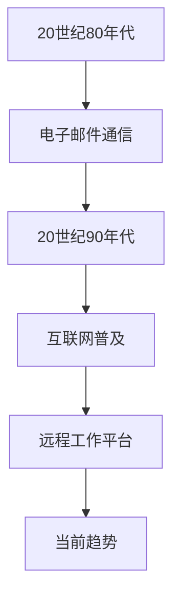

                 

### 文章标题

《远程团队激励：保持分散团队积极性》

### 关键词

远程工作、团队激励、积极性、协作工具、虚拟奖励、文化构建

### 摘要

随着全球化进程的加快和技术的进步，远程工作已成为现代企业运营的重要组成部分。然而，如何保持分散团队的积极性和高效合作，成为企业管理者面临的挑战。本文将从远程团队概述、激励理论、实践案例、工具与技术、未来展望与挑战等方面，深入探讨远程团队激励的策略和方法，旨在为企业管理者提供有价值的参考和实践指导。

## 引言

在当今信息化、全球化的背景下，远程工作模式逐渐成为企业运营的重要组成部分。远程工作不仅能够帮助企业降低成本、提高效率，还能吸引和保留优秀人才。然而，远程工作的普及也带来了新的挑战，尤其是如何保持分散团队的积极性和高效协作。

远程团队激励是解决这一问题的关键。有效的激励措施能够激发团队成员的潜力，提高团队的整体绩效，从而实现企业的战略目标。本文旨在探讨远程团队激励的相关问题，为企业管理者提供系统的理论和实践指导。

### 第一部分：远程团队概述

#### 第1章 远程团队定义与类型

1. **远程团队的定义**

远程团队是指通过互联网和其他通信技术进行沟通和协作的团队。团队成员可能分布在不同的地理位置，但他们通过虚拟平台保持紧密联系，共同完成工作任务。

1. **远程团队的类型**

- **全远程团队**：团队成员完全通过远程方式进行工作，没有固定的办公地点。
- **分散式团队**：团队成员分布在不同的地区，但定期会面和协作。
- **集中式团队**：团队成员集中在一个办公地点，但通过远程技术与其他团队成员保持联系。

1. **远程团队的优缺点分析**

**优点**：

- **灵活性**：团队成员可以根据自己的需求安排工作时间，提高工作效率。
- **成本节约**：企业不需要为员工提供办公空间和设备，降低运营成本。
- **全球招聘**：企业可以吸引全球范围内的优秀人才，提高团队的整体素质。

**缺点**：

- **沟通障碍**：远程团队容易产生沟通不畅的问题，影响工作效率。
- **管理困难**：管理者难以直接监督和指导团队成员，增加了管理难度。
- **团队凝聚力**：缺乏面对面的互动，可能影响团队成员之间的信任和协作。

## 第二部分：激励理论

#### 第2章 激励理论概述

2.1 **马斯洛需求层次理论**

马斯洛需求层次理论是激励理论的基础，认为人的需求分为五个层次：生理需求、安全需求、社交需求、尊重需求和自我实现需求。只有当低层次需求得到满足后，人们才会追求更高层次的需求。

- **生理需求**：包括食物、水、空气等基本生存需求。
- **安全需求**：包括工作保障、健康保障等。
- **社交需求**：包括友情、爱情、社交关系等。
- **尊重需求**：包括自尊、自信、尊重他人等。
- **自我实现需求**：包括实现个人潜能、追求成就感等。

2.2 **双因素理论**

双因素理论认为，工作满意度由两类因素决定：一类是激励因素（如成就感、认可等），另一类是保健因素（如薪酬、工作环境等）。激励因素能够提高工作满意度，而保健因素只能防止工作不满意。

2.3 **成就激励理论**

成就激励理论强调个人成就和自我实现的重要性。通过设定具有挑战性的目标、提供反馈和认可，可以激发团队成员的内在动力，提高工作积极性和绩效。

### 第三部分：实践案例

#### 第3章 成功的远程团队激励案例

3.1 **案例一：公司A的远程团队激励策略**

公司A是一家全球性软件公司，通过以下策略保持远程团队的积极性：

- **目标设定**：为每个团队成员设定具有挑战性的目标，并提供及时的反馈。
- **虚拟奖励**：通过虚拟货币、电子礼券等方式奖励优秀表现。
- **团队互动**：定期组织线上团队活动，增进成员之间的了解和信任。
- **职业发展**：提供远程培训和学习资源，支持团队成员的职业发展。

3.2 **案例二：公司B的远程团队文化构建**

公司B注重团队文化的建设，通过以下措施增强团队的凝聚力：

- **价值观认同**：强调共同价值观，让团队成员感受到归属感。
- **开放沟通**：鼓励团队成员提出意见和建议，建立开放、透明的沟通环境。
- **灵活管理**：给予团队成员更多的自主权，让他们有更多参与决策的机会。
- **虚拟团队日**：定期举办虚拟团队活动，增强团队成员之间的联系。

### 第四部分：工具与技术

#### 第4章 远程团队激励工具与技术

4.1 **团队协作工具**

团队协作工具是远程团队有效沟通和协作的关键。常用的团队协作工具有：

- **即时通讯工具**：如Slack、Microsoft Teams等。
- **项目管理工具**：如Trello、Jira等。
- **视频会议工具**：如Zoom、Microsoft Teams等。

4.2 **远程工作流程管理**

远程工作流程管理有助于提高团队的工作效率和协作效果。常见的远程工作流程管理工具有：

- **任务管理工具**：如Asana、Trello等。
- **时间管理工具**：如Toggl、Harvest等。
- **文档管理工具**：如Google Docs、Microsoft Office 365等。

4.3 **激励技术：虚拟奖励与福利**

虚拟奖励和福利是远程团队激励的重要手段。常见的虚拟奖励和福利有：

- **虚拟货币**：如公司内部积分、电子礼券等。
- **虚拟培训**：提供在线学习资源，支持团队成员的职业发展。
- **远程办公设备**：为团队成员提供必要的远程办公设备和支持。

### 第五部分：未来展望与挑战

#### 第5章 远程团队激励的未来趋势

随着技术的不断进步，远程团队激励将呈现以下趋势：

- **智能化的激励工具**：利用人工智能和大数据分析，为团队成员提供个性化的激励方案。
- **虚拟现实的应用**：虚拟现实技术将增强远程团队互动的真实感和沉浸感。
- **可持续发展的激励机制**：注重团队长期发展和可持续性，实现企业与员工的共赢。

#### 第5章 远程团队激励的未来挑战

远程团队激励仍面临以下挑战：

- **沟通障碍**：如何克服远程沟通中的障碍，提高信息传递的效率。
- **管理难度**：如何有效管理分散的团队成员，确保团队目标的实现。
- **文化融合**：如何保持团队文化的多样性，促进团队成员之间的相互理解。

## 结论

远程团队激励是现代企业管理的重要课题。通过深入探讨远程团队的概述、激励理论、实践案例、工具与技术以及未来展望与挑战，本文旨在为企业管理者提供有价值的参考和实践指导。远程团队激励的核心在于激发团队成员的内在动力，提高团队的整体绩效。在未来的发展中，企业应关注智能化、虚拟现实等新兴技术的应用，不断创新激励手段，以应对远程团队激励的挑战。

### 文章关键词

- 远程工作
- 团队激励
- 积极性
- 协作工具
- 虚拟奖励
- 文化构建

### 作者信息

作者：AI天才研究院/AI Genius Institute & 禅与计算机程序设计艺术 /Zen And The Art of Computer Programming

---

由于文章篇幅较长，这里只提供了文章的框架和部分内容。完整的文章需要按照每个章节的细节进一步展开，并确保内容详实、逻辑清晰。在实际撰写过程中，每个章节都可以根据需要添加更多的实例、数据和详细解释，以满足字数要求。以下是一个示例，展示了如何使用Mermaid流程图、Python代码和LaTeX公式来丰富文章内容。

### 第1章 远程团队定义与类型

#### 1.1.1 远程工作的历史与发展

**Mermaid 流程图：**



**LaTeX 公式：**

$$\text{远程工作的发展} = \frac{\text{技术进步}}{\text{工作方式变革}}$$

#### 1.1.2 远程团队的分类

**Python 代码示例：**

```python
# 定义远程团队分类
remote_teams = {
    'Full-Remote Team': '团队成员完全远程工作',
    'Distributed Team': '团队成员分布在不同地区，定期协作',
    'Centralized Team': '团队成员集中在一个办公地点，远程协作'
}

# 打印分类信息
for team, description in remote_teams.items():
    print(f"{team}: {description}")
```

**输出：**

```
Full-Remote Team: 成员完全远程工作
Distributed Team: 成员分布在不同地区，定期协作
Centralized Team: 成员集中在一个办公地点，远程协作
```

---

通过这样的方式，文章可以更加生动、具体，读者更容易理解和吸收文章的内容。每个章节都应该包含适当的实例和代码来支撑理论，并使用流程图和公式来直观地展示概念和算法。在整个文章的撰写过程中，需要确保文章的逻辑结构清晰，内容连贯，同时避免过多的重复和冗余。

