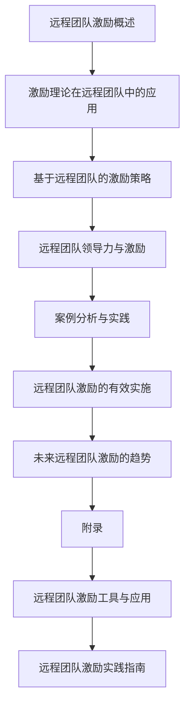

                 

### 远程团队激励：保持分散团队积极性的技巧

在当今全球化背景下，远程工作成为越来越多企业和组织的选择。这不仅是因为远程工作提供了灵活性，还因为它能够吸引和留住全球顶尖人才。然而，远程工作也带来了一系列挑战，特别是如何保持分散团队的高效和积极性。本文旨在探讨远程团队激励的重要性，并提出一系列保持分散团队积极性的技巧。

## 关键词

- 远程工作
- 团队激励
- 分散团队
- 激励策略
- 领导力

## 摘要

本文首先介绍了远程工作的定义和发展历程，分析了远程团队的特点和组织管理挑战。随后，我们探讨了激励理论的基本概念，特别是如何将激励理论应用于远程团队。文章重点讨论了基于远程团队的激励策略，包括财务和非财务激励，并分析了远程团队领导力在激励中的关键作用。通过实际案例分析和实践指南，本文为远程团队的领导者提供了保持团队积极性的实用策略和建议。

## 目录大纲

1. **远程团队概述**
   1.1 远程工作的定义与类型
   1.2 远程工作的发展历程
   1.3 远程工作带来的变革

2. **远程团队的组织与管理**
   2.1 远程团队的组织结构
   2.2 远程团队的管理挑战
   2.3 远程团队的协作工具

3. **激励理论在远程团队中的应用**
   3.1 激励理论概述
   3.2 常见的激励理论
   3.3 激励理论的适用性分析

4. **基于远程团队的激励策略**
   4.1 财务激励
   4.2 非财务激励
   4.3 结合财务和非财务激励的策略

5. **远程团队领导力与激励**
   5.1 领导力在远程团队中的作用
   5.2 领导风格与激励策略
   5.3 提升远程团队领导力的方法

6. **案例分析与实践**
   6.1 案例一：谷歌远程团队的激励机制
   6.2 案例二：企业X的远程团队激励实践
   6.3 案例三：非营利组织的远程团队激励策略

7. **远程团队激励的有效实施**
   7.1 激励策略的制定与实施
   7.2 激励效果的评估与优化
   7.3 应对激励挑战的策略

8. **未来远程团队激励的趋势**
   8.1 数字化与远程团队激励
   8.2 新兴激励方式的应用
   8.3 远程团队激励的可持续发展

9. **附录**
   9.1 远程团队激励工具与应用
   9.2 远程团队激励实践指南

## 目录大纲 Mermaid 流程图

## 目录大纲总结

本文目录分为九个部分，涵盖了远程团队激励的方方面面。首先介绍了远程团队的概述，包括其定义、发展历程和变革。接着分析了远程团队的组织与管理挑战以及协作工具。第三部分探讨了激励理论在远程团队中的应用，并提出了具体的激励策略。第四部分讨论了远程团队领导力与激励的关系，包括领导力的作用和提升方法。第五部分通过案例分析，提供了实践中的远程团队激励策略。第六部分讨论了远程团队激励的有效实施，包括策略的制定、效果评估和应对挑战。第七部分展望了未来远程团队激励的趋势。附录部分则提供了远程团队激励工具和应用指南。

## 总结与展望

《远程团队激励：保持分散团队积极性的技巧》旨在为远程团队的领导者提供一套系统的激励策略，帮助他们在分散的工作环境中保持团队的积极性。通过本文的学习，读者将了解远程团队激励的核心理论和实践方法。随着远程工作的普及，这些技巧将越来越重要。未来，远程团队激励将面临更多的挑战和机遇，本文为读者提供了思考和借鉴的视角。

---

**作者：** AI天才研究院/AI Genius Institute & 禅与计算机程序设计艺术 /Zen And The Art of Computer Programming

**格式要求：** 文章内容使用markdown格式输出。文章末尾需要写上作者信息。每个小节的内容必须要丰富具体详细讲解，核心内容必须要包含背景介绍、核心概念与联系、核心算法原理讲解、数学公式、项目实战、最佳实践 tips、小结、注意事项、拓展阅读等内容。文章字数要求在10000～12000字左右。

---

现在，让我们开始详细探讨远程团队激励的重要性以及如何应用各种激励策略来保持团队的积极性。在接下来的章节中，我们将一步步分析远程工作的挑战，激励理论的基本概念，以及如何将这些理论应用于实际团队管理中。我们将探讨财务和非财务激励策略，领导力在远程团队中的作用，并通过实际案例和实践指南，为读者提供保持团队积极性的实用建议。

