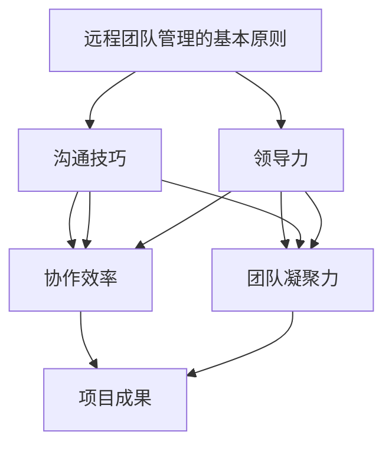

                 

### 摘要

在当今全球化的商业环境中，远程团队管理已成为企业运营不可或缺的一部分。然而，距离、文化差异和时间差异等挑战给团队的管理带来了前所未有的困难。本文旨在探讨远程团队管理的核心问题和有效策略，帮助团队领导者克服这些障碍，实现高效的远程协作。文章首先概述了远程工作的趋势和远程团队的优势与挑战，随后详细介绍了远程团队管理的基本原则和框架。接下来，文章重点分析了远程沟通与协作的技巧，包括面对面沟通的替代方法和沟通障碍的识别与解决。此外，文章还探讨了远程团队领导力的重要性，提供了激励远程团队成员的策略。最后，文章通过最佳实践、失败案例分析和未来趋势，为远程团队管理提供了实用的指导和建议。本文旨在通过深入的技术分析和实际案例，为读者提供一套完整的远程团队管理方法论，助力企业在远程工作时代取得成功。

### 背景介绍

远程工作，作为一种工作方式，其历史可以追溯到20世纪中期。最早的形式是“远程办公”，主要是在家工作或在不同地点工作，但与同事之间仍存在面对面的接触。随着互联网和通信技术的不断发展，远程工作的概念逐渐演变，并最终演变为当今的“远程团队管理”。在21世纪初，特别是在2008年的金融危机后，远程工作开始逐渐成为许多企业应对经济压力的一种策略。然而，随着近年来全球疫情的爆发，远程工作迅速普及，成为企业运营的新常态。

远程工作的普及并非偶然。其背后有多个因素在推动。首先，互联网和通信技术的快速发展使得远程工作变得可行。通过电子邮件、即时通讯工具、视频会议和云存储等工具，远程团队成员可以实时沟通和协作，无需依赖传统的面对面会议。其次，全球化的趋势使得企业能够跨越地域限制，招聘全球各地的优秀人才。这不仅扩大了企业的人才库，也提高了团队的整体创新能力。最后，员工对于工作生活平衡的追求也促使企业更多地采用远程工作模式。员工可以在家中工作，从而节省通勤时间，提高生活质量。

尽管远程工作带来了诸多优势，但同时也伴随着一系列挑战。首先，沟通障碍是一个显著的问题。在远程团队中，缺乏面对面的交流可能导致信息传递不准确，误解和冲突增多。其次，管理复杂度增加。远程团队的管理需要更多的自我管理和自主性，这对团队领导者的领导力和管理技能提出了更高的要求。此外，时区和文化差异也可能导致协作困难，需要特别的策略和工具来解决。

成功克服这些挑战的案例也不断涌现。例如，GitHub是一个全球性的开源代码库平台，其团队成员遍布全球。通过高效的远程协作工具和明确的沟通策略，GitHub成功地将分散的团队成员紧密地结合在一起，实现了高效的代码管理和项目开发。另一个例子是Buffer，一个社交媒体管理平台，其员工全部采用远程工作模式。通过采用灵活的工作时间表和高效的沟通工具，Buffer不仅提高了员工的满意度，还实现了业务的高速增长。

总之，远程团队管理在当前和未来都具有重要意义。通过了解其背景和挑战，企业可以更好地制定策略，克服障碍，实现高效的远程协作。本文将深入探讨远程团队管理的核心问题和最佳实践，为读者提供实用的指导。

### 核心概念与联系

在探讨远程团队管理的过程中，理解几个核心概念及其相互关系至关重要。这些概念包括远程团队管理的基本原则、沟通技巧和领导力。以下是它们之间的关系架构，我们将使用Mermaid流程图来展示。



1. **远程团队管理的基本原则**：这是远程团队管理的基石，包括自主性、透明度和反馈等。基本原则确保团队成员能够独立工作，同时保持信息的透明，并通过及时反馈来优化工作流程。

2. **沟通技巧**：远程团队的成功很大程度上取决于有效的沟通。沟通技巧包括使用各种远程协作工具、面对面对面沟通的替代方法以及识别和解决沟通障碍。有效的沟通能够提高协作效率，减少误解和冲突。

3. **领导力**：远程团队领导者需要具备特殊的领导力，包括建立信任、鼓励自主性和提供明确的方向。领导力不仅影响团队凝聚力和士气，还直接影响协作效率和项目成果。

4. **协作效率**：这是远程团队管理的关键目标之一。高效的协作能够提高项目完成速度和成果质量。协作效率受到沟通技巧和领导力的影响，同时也是团队凝聚力和项目成果的重要保障。

5. **团队凝聚力**：远程团队需要特别的策略来保持团队的凝聚力。通过建立信任、共同的目标和定期的团队活动，可以增强团队成员之间的联系，从而提高团队的效率和士气。

6. **项目成果**：最终，远程团队的目标是完成高质量的成果。高效的协作、强大的领导力和良好的沟通技巧共同推动了项目的成功。

通过上述Mermaid流程图，我们可以清晰地看到这些核心概念之间的相互关系。理解这些关系对于制定有效的远程团队管理策略至关重要。接下来，我们将详细探讨每个核心概念及其具体应用。

### 核心概念与联系

在探讨远程团队管理的过程中，理解几个核心概念及其相互关系至关重要。这些概念包括远程团队管理的基本原则、沟通技巧和领导力。以下是它们之间的关系架构，我们将使用Mermaid流程图来展示。


1. **远程团队管理的基本原则**：这是远程团队管理的基石，包括自主性、透明度和反馈等。基本原则确保团队成员能够独立工作，同时保持信息的透明，并通过及时反馈来优化工作流程。

2. **沟通技巧**：远程团队的成功很大程度上取决于有效的沟通。沟通技巧包括使用各种远程协作工具、面对面对面沟通的替代方法以及识别和解决沟通障碍。有效的沟通能够提高协作效率，减少误解和冲突。

3. **领导力**：远程团队领导者需要具备特殊的领导力，包括建立信任、鼓励自主性和提供明确的方向。领导力不仅影响团队凝聚力和士气，还直接影响协作效率和项目成果。

4. **协作效率**：这是远程团队管理的关键目标之一。高效的协作能够提高项目完成速度和成果质量。协作效率受到沟通技巧和领导力的影响，同时也是团队凝聚力和项目成果的重要保障。

5. **团队凝聚力**：远程团队需要特别的策略来保持团队的凝聚力。通过建立信任、共同的目标和定期的团队活动，可以增强团队成员之间的联系，从而提高团队的效率和士气。

6. **项目成果**：最终，远程团队的目标是完成高质量的成果。高效的协作、强大的领导力和良好的沟通技巧共同推动了项目的成功。

通过上述Mermaid流程图，我们可以清晰地看到这些核心概念之间的相互关系。理解这些关系对于制定有效的远程团队管理策略至关重要。接下来，我们将详细探讨每个核心概念及其具体应用。

### 远程团队管理的基本原则

在远程团队管理中，基本原则是确保团队高效协作和成功实现项目目标的基础。以下是几个关键的基本原则，每个原则都将通过具体的例子进行阐述。

#### 1. 自主性

自主性是远程团队管理的核心原则之一，它强调团队成员在完成工作任务时具有自主决策和执行的能力。这种自主性不仅提高了团队成员的工作效率，还增强了他们的责任感和成就感。

- **具体例子**：以一个软件开发团队为例，团队成员可以自主选择工作的时间和地点，只要他们能够按时提交高质量的工作成果。例如，一位前端开发者可以在家中或咖啡店工作，利用自己的最佳时间进行编码和测试。这样，不仅提高了开发效率，还提高了团队成员的工作满意度。

#### 2. 透明度

透明度在远程团队管理中至关重要，它确保团队中的每个成员都能够清晰地了解项目进展、任务分配和决策过程。透明度有助于减少信息不对称，增强团队成员之间的信任和协作。

- **具体例子**：一个项目管理团队可以使用项目管理工具（如Trello、Jira等）来跟踪项目进度和任务分配。团队成员可以实时查看项目的状态、任务的完成情况和团队的沟通记录。这种透明度不仅帮助团队成员更好地了解自己的工作职责，还能够及时发现并解决问题。

#### 3. 反馈

反馈是远程团队管理中不可或缺的一部分，它帮助团队成员了解自己的工作表现，获取改进的建议，从而提高整体工作效率。

- **具体例子**：在一个远程产品团队中，定期的代码审查和项目评审会是非常有价值的反馈机制。通过代码审查，团队成员可以互相学习，发现潜在的问题和优化机会。而项目评审会则可以帮助团队总结经验教训，调整项目计划和策略。这种反馈机制不仅提高了团队成员的专业技能，还增强了团队的整体协作能力。

#### 4. 鼓励创新

在远程团队管理中，鼓励创新意味着团队领导者要为团队成员提供一个宽松的环境，让他们能够自由地探索新的想法和解决方案。

- **具体例子**：一个远程营销团队可以定期举行创意讨论会，鼓励团队成员分享自己的想法和创意。这些讨论会不仅激发了团队成员的创造力，还为团队带来了新的营销策略和创意方案。例如，某个远程营销团队通过这种创新方式成功推出了一款独特的广告创意，获得了客户的高度评价和市场认可。

#### 5. 定期沟通

定期沟通是远程团队管理中保持团队凝聚力的重要手段。通过定期的沟通，团队成员可以保持紧密的联系，了解彼此的工作进展和团队动态。

- **具体例子**：一个远程产品团队可以每周举行一次团队会议，讨论项目的进展、遇到的挑战和下一步的计划。这种定期的沟通不仅帮助团队及时解决问题，还增强了团队成员之间的互动和信任。例如，某个远程产品团队通过每周的团队会议，成功避免了项目延误，并提高了项目的整体质量。

通过上述例子，我们可以看到这些基本原则在远程团队管理中的具体应用。这些原则不仅提高了团队的工作效率，还增强了团队的合作精神和凝聚力。理解并践行这些基本原则，是远程团队成功管理的关键。

### 沟通技巧

在远程团队管理中，沟通技巧至关重要。有效的沟通不仅能够提高工作效率，还能减少误解和冲突。以下是一些关键的沟通技巧，以及如何在实际工作中应用这些技巧。

#### 1. 使用远程协作工具

现代远程协作工具为团队提供了多种沟通方式，包括视频会议、即时通讯、文档共享和项目管理工具。以下是几种常用的工具及其应用场景：

- **视频会议**：Zoom、Microsoft Teams 和 Google Meet 等视频会议工具可以模拟面对面会议，让团队成员能够实时交流和互动。它们适用于项目启动会议、项目进展汇报和团队培训等活动。

  ```python
  # Python代码示例：调用Zoom API进行视频会议
  from zoomapi import ZoomAPI
  
  zoom = ZoomAPI('your_api_key', 'your_api_secret')
  meeting = zoom.create_meeting(
      topic='Project Update Meeting',
      type=2, // 2表示会议
      start_time='2023-11-01T14:00:00',
      duration=60,
      password='password',
      agenda='Discuss project progress and set next steps'
  )
  print(meeting)
  ```

- **即时通讯**：Slack、WhatsApp 和 Microsoft Teams 等即时通讯工具可以用于实时沟通和协作。它们适用于日常任务讨论、问题解答和紧急通知。

  ```python
  # Python代码示例：使用Slack API发送消息
  import requests
  
  slack_token = 'your_slack_token'
  channel = '#general'
  message = 'Hello everyone, the weekly status meeting is scheduled for tomorrow at 10 AM.'
  
  response = requests.post(
      'https://slack.com/api/chat.postMessage',
      headers={'Authorization': f'Bearer {slack_token}'},
      data={'channel': channel, 'text': message}
  )
  print(response.text)
  ```

- **文档共享和协作工具**：Google Docs、Microsoft Office 365 和 Notion 等文档共享和协作工具可以实时编辑和协作文档，确保团队成员能够随时查看和更新文档内容。

  ```python
  # Python代码示例：使用Google Sheets API更新文档
  from google.oauth2.service_account import Credentials
  from googleapiclient.discovery import build
  
  scope = ['https://www.googleapis.com/auth/spreadsheets']
  credentials = Credentials.from_service_account_file('your_service_account_file.json', scopes=scope)
  service = build('sheets', 'v4', credentials=credentials)
  
  spreadsheet_id = 'your_spreadsheet_id'
  range = 'Sheet1!A1:E'
  values = [
      ['John', 'Manager', 'New York', '2023-01-01', 'Active'],
      ['Alice', 'Developer', 'San Francisco', '2023-02-01', 'Active'],
  ]
  
  body = {
      'values': values
  }
  
  request = service.spreadsheets().values().update(
      spreadsheetId=spreadsheet_id, range=range, valueInputOption='USER_ENTERED', body=body)
  response = request.execute()
  print(response)
  ```

#### 2. 确保沟通的清晰性

在远程沟通中，确保信息的清晰和准确是非常重要的。以下是一些建议：

- **明确目标**：在每次沟通前，明确沟通的目标和议程，确保所有参与者都清楚会议的目的。
- **使用简明的语言**：避免使用过于复杂或专业的术语，使用简单易懂的语言表达自己的想法。
- **提供具体例子**：通过具体例子来解释复杂的概念或想法，帮助团队成员更好地理解。

#### 3. 建立良好的沟通渠道

建立多样化的沟通渠道有助于团队成员在不同情境下进行有效沟通。以下是一些渠道：

- **定期会议**：每周或每月举行一次团队会议，讨论项目进展、问题和计划。
- **即时通讯**：对于日常的沟通和问题解答，使用即时通讯工具。
- **邮件**：对于重要的沟通和信息记录，使用邮件进行书面交流。

#### 4. 处理沟通障碍

在远程团队中，沟通障碍可能包括文化差异、时区差异和语言障碍。以下是一些处理策略：

- **文化意识**：了解团队成员的文化背景，尊重他们的习俗和价值观。
- **时区协调**：尽量选择对所有人都方便的时间进行会议和沟通，或者使用时区协调工具。
- **语言支持**：提供翻译服务或使用通用的沟通语言，如英语。

通过上述沟通技巧和策略，远程团队可以更有效地沟通和协作，从而提高工作效率和团队凝聚力。

### 远程团队协作工具

在现代远程团队管理中，选择合适的协作工具至关重要。这些工具不仅能够提高团队的工作效率，还能确保团队成员之间的沟通和协作顺畅。以下是几种常见的远程协作工具，包括其特点和适用场景。

#### 1. 文档共享与协作工具

**Google Workspace**：包括Google Docs、Google Sheets和Google Slides等，支持多人实时编辑和协作，适合文档编写、数据分析等任务。

- **特点**：实时协作、云端存储、版本控制、集成多种API。
- **适用场景**：团队报告、数据分析、项目文档。

```python
# Python代码示例：使用Google Sheets API创建工作表
from google.oauth2.service_account import Credentials
from googleapiclient.discovery import build

scope = ['https://www.googleapis.com/auth/spreadsheets']
credentials = Credentials.from_service_account_file('your_service_account_file.json', scopes=scope)
service = build('sheets', 'v4', credentials=credentials)

spreadsheet = service.spreadsheets()
body = {
    'properties': {
        'title': 'Team Collaboration',
        'autoResize': True
    }
}

spreadsheet = service.spreadsheets().create(body=body).execute()
print(f"Created new spreadsheet: {spreadsheet['spreadsheetId']}")
```

**Microsoft Office 365**：包括Word、Excel和PowerPoint等，提供云存储和协作功能，适合企业级应用。

- **特点**：强大的办公软件、云存储、版本控制、集成团队沟通工具。
- **适用场景**：文档编辑、数据分析、演示制作。

**Notion**：一个功能全面的协作工具，支持笔记、数据库、看板等多种功能，适合组织信息和项目管理。

- **特点**：多模态内容、灵活布局、集成多种API。
- **适用场景**：团队笔记、知识库管理、项目管理。

#### 2. 即时通讯工具

**Slack**：一个流行的即时通讯工具，提供频道、直接消息和集成第三方应用等功能，适合日常沟通和任务分配。

- **特点**：灵活的频道系统、丰富的集成应用、自定义工作流程。
- **适用场景**：团队沟通、任务分配、团队协作。

```python
# Python代码示例：使用Slack API创建频道
import requests

slack_token = 'your_slack_token'
channel_name = 'general'
response = requests.post(
    f'https://slack.com/api/conversations.create',
    headers={'Authorization': f'Bearer {slack_token}'},
    data={'name': channel_name, 'is_private': False}
)
print(response.json())
```

**Microsoft Teams**：集成在Office 365中，提供即时通讯、视频会议、文档协作等功能，适合企业内部沟通。

- **特点**：集成Office 365应用、丰富的会议功能、安全可靠。
- **适用场景**：企业内部沟通、跨部门协作、视频会议。

**WhatsApp**：一个全球通用的即时通讯工具，适合跨地区团队沟通。

- **特点**：免费、广泛使用、跨平台。
- **适用场景**：跨地区团队沟通、客户支持。

#### 3. 项目管理工具

**Jira**：一个功能强大的项目管理工具，提供任务跟踪、敏捷开发、自动化工作流等功能，适合软件开发团队。

- **特点**：任务跟踪、敏捷开发、集成插件、强大的报表功能。
- **适用场景**：软件开发、项目跟踪、团队协作。

```python
# Python代码示例：使用Jira REST API创建任务
import requests

jira_url = 'https://yourdomain.atlassian.net'
jira_username = 'your_username'
jira_api_key = 'your_api_key'
headers = {
    'Authorization': 'Basic ' + base64.b64encode(f'{jira_username}:{jira_api_key}'.encode('utf-8')).decode('utf-8')
}

project_key = 'PROJECT_KEY'
issue_type = 'Story'
summary = 'Implement new feature'
description = 'Description of the new feature.'

payload = {
    'fields': {
        'project': {'key': project_key},
        'issuetype': {'name': issue_type},
        'summary': summary,
        'description': description
    }
}

response = requests.post(
    f'{jira_url}/rest/api/3/issue',
    headers=headers,
    json=payload
)
print(response.json())
```

**Trello**：一个直观的看板工具，适合简单项目管理和小团队协作。

- **特点**：直观易用、卡片系统、灵活的布局。
- **适用场景**：项目规划、任务分配、日常管理。

**Asana**：一个功能全面的任务管理工具，提供灵活的看板、甘特图和任务分配功能，适合跨部门协作。

- **特点**：任务管理、看板、甘特图、集成应用。
- **适用场景**：项目规划、任务分配、跨部门协作。

选择合适的远程协作工具，结合具体的团队需求和项目特点，可以大大提高团队的工作效率和协作效果。通过上述工具的代码示例，读者可以了解如何在实际应用中利用这些工具实现高效的远程协作。

### 远程团队领导力

远程团队领导力是确保远程团队高效运作和持续发展的关键。在远程环境中，领导者需要具备一些独特的技能和策略，以保持团队的凝聚力和执行力。以下是几个关键方面，以及如何应用这些策略来提升远程团队领导力。

#### 1. 建立信任

信任是远程团队成功的基础。领导者需要通过透明、开放和诚信的行为来建立和维护信任。以下是一些具体策略：

- **定期沟通**：保持定期的团队会议和一对一会议，确保团队成员能够了解项目进展、目标和决策过程。
- **透明度**：分享团队的战略和计划，让团队成员知道他们的工作对团队的重要性。
- **积极倾听**：认真倾听团队成员的意见和反馈，确保他们感到被重视。

#### 2. 鼓励自主性和自我管理

在远程环境中，团队成员通常需要更高的自主性和自我管理能力。领导者应鼓励团队成员独立思考和决策，并为他们的自主性提供支持。

- **设定清晰的目标和期望**：明确团队成员的任务和目标，并提供必要的资源和指导。
- **授权**：信任团队成员能够独立完成任务，不要过度干涉他们的工作。
- **激励**：通过奖励和认可来鼓励团队成员的自我驱动和自主性。

#### 3. 建立团队合作文化

团队合作文化有助于增强团队的凝聚力和协作能力。领导者应通过以下策略来建立这种文化：

- **团队建设活动**：定期举行线上或线下团队建设活动，增强团队成员之间的联系和信任。
- **共同目标**：确保团队成员有共同的愿景和目标，并鼓励他们为实现这些目标而努力。
- **透明反馈**：提供及时的反馈和建设性的意见，帮助团队成员提高。

#### 4. 管理远程团队沟通

沟通是远程团队领导力的核心。领导者需要确保团队沟通畅通无阻，以下是一些策略：

- **多样化沟通**：使用多种沟通渠道（如视频会议、即时通讯、邮件等）来确保信息的有效传递。
- **沟通规范**：制定明确的沟通规范，包括沟通频率、沟通方式和信息传递的优先级。
- **技术支持**：确保团队拥有高效可靠的沟通工具，并为他们提供必要的技术支持。

#### 5. 激励远程团队成员

在远程环境中，激励团队成员是一项挑战。以下是一些激励策略：

- **奖励机制**：建立奖励机制，根据团队成员的表现给予奖励，如奖金、晋升机会等。
- **职业发展**：提供职业发展机会，如培训、研讨会等，帮助团队成员提升技能。
- **工作生活平衡**：鼓励团队成员保持工作与生活的平衡，提供灵活的工作安排和远程工作支持。

#### 6. 处理远程团队成员的倦怠感

远程工作可能会导致团队成员感到孤独、疲劳和倦怠。领导者应关注团队成员的心理状态，并提供以下支持：

- **心理健康支持**：提供心理健康资源和咨询服务，帮助团队成员应对工作压力。
- **定期检查**：定期与团队成员交流，了解他们的工作状况和心理状态。
- **工作生活平衡**：鼓励团队成员合理安排工作和休息时间，确保他们的身心健康。

通过上述策略，远程团队领导者可以建立高效的团队领导力，提升团队的协作效率和整体表现。理解和应用这些策略，将有助于远程团队在复杂的环境中实现成功。

### 远程团队激励

在远程团队管理中，激励团队成员是实现高效协作和保持团队凝聚力的重要一环。远程工作环境不同于传统的办公环境，团队成员往往缺乏面对面的交流和即时的反馈，因此，领导者需要采用创新的激励策略来激发团队成员的积极性和创造力。

#### 1. 明确目标和期望

激励团队成员的首要步骤是确保他们明确了解自己的目标和期望。这包括：

- **设定清晰的个人和团队目标**：为每个团队成员设定具体的、可量化的目标，使其能够清晰地看到自己的工作方向和成果。
- **定期回顾目标**：定期与团队成员一起回顾目标进展，并根据实际情况进行调整。

#### 2. 奖励和认可

奖励和认可是激励团队成员的重要手段。以下是一些具体的奖励策略：

- **物质奖励**：提供奖金、礼品卡或其他物质奖励，以表彰团队成员的出色表现。
- **精神奖励**：通过公开表扬、颁发荣誉证书或举行庆祝活动等方式，给予团队成员精神上的认可。
- **弹性奖励**：提供额外的假期、灵活的工作时间和自主权等，作为对出色表现的奖励。

#### 3. 职业发展机会

职业发展机会不仅能够提升团队成员的专业技能，还能增强他们的归属感和工作动力。以下是一些职业发展策略：

- **培训和发展计划**：提供在线课程、研讨会和工作坊，帮助团队成员不断提升技能。
- **职业晋升机会**：为团队成员提供职业晋升路径，并鼓励他们申请更高的职位。
- **技能分享会**：定期组织技能分享会，让团队成员互相学习和交流经验。

#### 4. 工作生活平衡

在远程工作环境中，工作与生活的平衡尤为重要。以下是一些促进工作生活平衡的策略：

- **灵活的工作时间**：允许团队成员根据个人需求调整工作时间和工作地点，以提高工作满意度和效率。
- **远程工作支持**：提供远程工作工具和技术支持，确保团队成员能够高效地完成工作。
- **心理健康支持**：提供心理健康资源，如在线心理咨询和健康指南，帮助团队成员应对远程工作的压力。

#### 5. 团队互动和文化建设

团队互动和文化建设能够增强团队成员之间的联系和信任，提高团队的凝聚力。以下是一些团队互动和文化建设策略：

- **定期的团队活动**：组织定期的线上或线下团队活动，如虚拟下午茶、团队游戏和庆祝活动。
- **虚拟团建**：利用虚拟游戏和互动工具，举办线上团建活动，增强团队成员之间的互动。
- **团队价值观的建立**：明确团队的共同价值观，并在日常工作中不断强化，使团队成员有共同的目标和愿景。

#### 6. 处理远程团队成员的倦怠感

倦怠感是远程工作中常见的心理问题，以下是一些应对策略：

- **倾听和理解**：领导者需要倾听团队成员的意见和困扰，并提供理解和支持。
- **心理支持**：提供心理健康资源，如在线咨询和心理健康课程，帮助团队成员缓解压力。
- **定期检查**：定期检查团队成员的工作状况和心理状态，及时发现和处理潜在的倦怠问题。

通过上述策略，领导者可以有效地激励远程团队成员，提高团队的效率和凝聚力。理解并应用这些策略，将有助于远程团队在复杂的工作环境中保持活力和创造力。

### 远程团队管理的最佳实践

在远程团队管理中，成功的管理策略和实践是确保团队高效运作和项目成功的关键。以下是一些最佳实践，结合具体案例，详细探讨如何实施这些策略。

#### 1. 定期团队会议

定期团队会议是保持团队沟通和同步进展的重要手段。以下是一个最佳实践案例：

- **案例**：某全球知名科技公司，采用每周一次的团队会议。会议内容包括项目进展报告、问题讨论和下周计划。每个团队成员都可以在会议中分享自己的工作进展和遇到的挑战，确保团队成员之间的信息共享和协作。

**实施步骤**：
1. **设定会议频率**：确定每周一次或每两周一次的会议频率。
2. **制定议程**：提前制定会议议程，包括会议目的、讨论内容、时间安排等。
3. **使用会议工具**：选择合适的远程会议工具（如Zoom、Microsoft Teams），确保会议的顺利进行。

#### 2. 明确职责和任务

在远程团队中，明确每个成员的职责和任务是非常重要的。以下是一个具体案例：

- **案例**：一家远程软件公司使用Jira等项目管理工具来明确每个团队成员的任务和职责。每个任务都分配给具体的成员，并设置明确的截止日期和验收标准。

**实施步骤**：
1. **分配任务**：根据团队成员的技能和兴趣，将任务合理地分配给每个成员。
2. **明确职责**：确保每个成员都了解自己的职责范围，避免职责重叠或缺失。
3. **使用项目管理工具**：利用项目管理工具（如Jira、Trello）来跟踪任务的进度和状态。

#### 3. 建立透明度

透明度是远程团队管理的重要原则，以下是一个最佳实践案例：

- **案例**：某创业公司通过Notion建立一个团队知识库，所有文档、讨论和决策都在这个平台上共享。团队成员可以随时查看项目的最新进展、任务分配和决策记录。

**实施步骤**：
1. **选择合适的工具**：选择一个易于访问和共享的协作工具，如Notion、Google Docs等。
2. **创建知识库**：将团队的文档、讨论和决策记录在知识库中，确保所有成员都可以访问。
3. **定期更新**：确保知识库的内容定期更新，保持信息的最新和准确。

#### 4. 提供技术支持

在远程团队管理中，技术支持对于确保团队高效运作至关重要。以下是一个具体案例：

- **案例**：某远程开发团队提供全天候的技术支持，包括远程桌面连接、在线培训和问题解答。团队成员在遇到技术问题时，可以随时联系技术支持团队。

**实施步骤**：
1. **建立技术支持团队**：组建一个专业的技术支持团队，提供全天候服务。
2. **提供培训**：定期为团队成员提供技术培训，帮助他们掌握新工具和技能。
3. **建立帮助文档**：编写详细的帮助文档和FAQ，帮助团队成员解决常见问题。

#### 5. 鼓励自主性和创新

自主性和创新是远程团队成功的关键因素。以下是一个最佳实践案例：

- **案例**：某远程营销团队定期举行创意讨论会，鼓励团队成员分享新的想法和创意。通过这种方式，团队成员不仅能够激发创意，还能为团队带来新的营销策略和创意方案。

**实施步骤**：
1. **设立创意讨论会**：定期组织创意讨论会，让团队成员分享自己的想法和创意。
2. **提供资源**：为团队成员提供必要的资源和支持，如时间、资金和工具等。
3. **认可创新**：对团队成员的创新想法给予认可和奖励，鼓励更多的创新行为。

通过上述最佳实践案例，我们可以看到如何在实际工作中应用这些策略，确保远程团队的高效运作和项目成功。这些实践不仅提供了具体的操作方法，还结合了实际案例，为读者提供了可行的参考。

### 失败案例的教训

在远程团队管理的实践中，虽然有许多成功的案例，但也存在一些失败的案例，从中我们可以吸取宝贵的教训，避免重蹈覆辙。以下是一些典型的失败案例及其教训。

#### 1. 缺乏明确的沟通策略

**案例**：一家初创公司在远程团队管理中缺乏明确的沟通策略，导致团队成员之间沟通不畅，信息传递滞后，最终导致项目延误。

**教训**：远程团队管理需要制定明确的沟通策略，包括沟通频率、方式、渠道和规范。使用多种沟通工具（如视频会议、即时通讯、邮件等）来确保信息的有效传递，并定期检查沟通效果。

#### 2. 忽视团队成员的心理健康

**案例**：一家公司在远程管理中忽视了团队成员的心理健康，导致团队成员长时间处于高压状态，出现疲劳和倦怠，最终影响工作效率和团队凝聚力。

**教训**：远程团队领导者应关注团队成员的心理健康，提供心理健康支持，如在线咨询、心理健康课程等。定期与团队成员交流，了解他们的心理状态，及时提供帮助和支持。

#### 3. 缺乏明确的职责分工

**案例**：一家远程开发团队在项目中缺乏明确的职责分工，导致任务分配混乱，工作重叠或缺失，最终导致项目质量下降。

**教训**：在远程团队管理中，必须明确每个成员的职责和任务，避免职责重叠或缺失。使用项目管理工具（如Jira、Trello）来跟踪任务进度和状态，确保每个任务都有明确的负责人。

#### 4. 过度依赖工具，忽视人际互动

**案例**：一家公司过度依赖远程协作工具，忽视了团队成员之间的人际互动，导致团队凝聚力下降，成员之间的信任感减弱。

**教训**：虽然远程协作工具是远程团队管理的重要工具，但人际互动同样重要。定期组织团队建设活动，如线上团建、虚拟下午茶等，增强团队成员之间的联系和信任。

#### 5. 忽视时区和文化差异

**案例**：一家跨国远程团队忽视了时区和文化差异，导致沟通困难，工作效率低下。

**教训**：在跨国远程团队中，领导者应充分考虑时区和文化差异，制定灵活的工作安排，确保团队成员能够在合适的时间进行沟通和协作。提供跨文化培训，增强团队成员之间的理解与包容。

通过分析这些失败案例，我们可以看到远程团队管理中的关键问题，并从中吸取教训，优化管理策略，确保远程团队的高效运作和持续发展。

### 远程团队管理的未来发展趋势

随着技术的不断进步，远程团队管理也在不断演变。未来的远程团队管理将更加智能化、个性化和灵活化。以下是一些可能的发展趋势。

#### 1. 智能化管理工具

未来的远程团队管理将越来越多地依赖于人工智能和机器学习技术。例如，智能助手和聊天机器人可以自动处理常规任务，如日程安排、任务分配和进度跟踪。这些工具能够提高管理效率，减少人为错误，并为团队领导者提供更准确的实时数据。

- **具体例子**：使用自然语言处理（NLP）技术来分析团队沟通记录，识别潜在的问题和趋势，提供改进建议。
- **技术原理**：NLP结合机器学习算法，可以从文本中提取关键词、主题和情感，从而帮助领导者更好地理解团队状态。

```python
# Python代码示例：使用NLP分析团队沟通记录
from textblob import TextBlob

# 假设有一个团队沟通记录的文本
communication_log = "We had a productive meeting today, but faced some technical issues."

# 使用TextBlob进行情感分析
blob = TextBlob(communication_log)
print(f"Polarity: {blob.polarity}")
print(f"Subjectivity: {blob.subjectivity}")
```

#### 2. 虚拟现实（VR）和增强现实（AR）

虚拟现实和增强现实技术将提供更加沉浸式的远程协作体验。通过VR和AR，团队成员可以仿佛身处同一房间，进行面对面的互动和合作。

- **具体例子**：使用VR会议室，团队成员可以在虚拟环境中开会、讨论和演示。
- **技术原理**：VR和AR通过计算机生成或增强现实环境，使用户能够与虚拟对象进行交互。

```python
# Python代码示例：使用PyOpenGL创建一个简单的VR场景
from pyglui import *

app = App()
app.layout.appendlems([
    Widget3D(
        ["box", "square", 0, 0, 0, 1, 1, 0.5],
        ["color", [0.5, 0.5, 0.5]],
    ),
])

app.run()
```

#### 3. 个性化工作环境

未来的远程团队管理将更加注重个性化工作环境，包括根据团队成员的偏好和需求调整工作流程和工具。

- **具体例子**：基于数据分析和机器学习算法，自动为团队成员推荐最适合他们工作习惯的工具和流程。
- **技术原理**：使用大数据分析和机器学习算法，收集和分析团队成员的工作数据，提供个性化的建议和解决方案。

```python
# Python代码示例：使用pandas进行数据分析和推荐
import pandas as pd

# 假设有一个团队成员的工作数据
data = {'member': ['Alice', 'Bob', 'Charlie'], 'tool_preference': ['Slack', 'Jira', 'Notion']}
df = pd.DataFrame(data)

# 分析工具偏好
preferred_tools = df.groupby('member')['tool_preference'].first()

# 基于分析结果，推荐工具
print(preferred_tools)
```

#### 4. 更加灵活的工作安排

随着远程工作越来越普遍，未来的远程团队管理将更加注重灵活的工作安排，以适应团队成员的不同需求和生活方式。

- **具体例子**：提供弹性工作时间和远程工作支持，让团队成员可以根据自己的情况灵活安排工作时间。
- **技术原理**：使用自动化工具和AI算法来管理工作流程，确保远程团队成员能够在任何时间、任何地点高效地完成工作。

```python
# Python代码示例：使用Python调度任务
from datetime import datetime, timedelta
import pandas as pd

# 假设有一个任务调度表
schedules = pd.DataFrame({
    'member': ['Alice', 'Bob', 'Charlie'],
    'task': ['Write report', 'Prepare presentation', 'Develop code'],
    'start_time': [datetime.now() + timedelta(hours=1), datetime.now() + timedelta(hours=2), datetime.now() + timedelta(hours=3)]
})

# 调度任务
for index, row in schedules.iterrows():
    print(f"{row['member']} will start {row['task']} at {row['start_time']}")
```

通过这些技术趋势和具体示例，我们可以看到未来的远程团队管理将更加智能、个性化和灵活，为团队成员提供更好的工作体验和更高的工作效率。

### 总结与建议

本文深入探讨了远程团队管理的核心问题和最佳实践，涵盖了从基本原则到沟通技巧、领导力以及激励策略的各个方面。通过详细的分析和实际案例，我们明确了远程团队管理的难点和解决方法。

#### 关键点回顾

1. **远程团队管理的基本原则**：自主性、透明度和反馈是远程团队管理的基石。自主性确保团队成员能够独立工作，透明度保持信息的透明，反馈帮助团队优化工作流程。
2. **沟通技巧**：使用远程协作工具、确保沟通清晰、建立良好的沟通渠道和处理沟通障碍是提高团队协作效率的关键。
3. **领导力**：建立信任、鼓励自主性、建立团队合作文化和管理远程团队沟通是远程团队领导力的核心要素。
4. **激励策略**：明确目标、奖励和认可、职业发展机会、工作生活平衡和团队互动是激励远程团队成员的重要手段。
5. **最佳实践**：定期团队会议、明确职责和任务、建立透明度、提供技术支持和鼓励自主性是远程团队管理的成功要素。

#### 总结

远程团队管理是一个复杂但必要的过程。通过有效的策略和实践，远程团队可以克服距离、文化差异和时间差异等挑战，实现高效协作和项目成功。未来的远程团队管理将更加依赖于智能技术，提供个性化工作环境和灵活的工作安排。

#### 建议

1. **建立明确的沟通策略**：确保团队成员之间信息畅通，减少误解和冲突。
2. **注重团队成员的心理健康**：提供心理支持和健康资源，确保团队成员的身心健康。
3. **提供技术支持和培训**：确保团队成员掌握必要的工具和技能，提高工作效率。
4. **鼓励自主性和创新**：为团队成员提供自主决策和创新的空间，激发他们的创造力和积极性。
5. **定期评估和调整**：定期评估团队管理的有效性，根据实际情况调整管理策略。

通过这些实践和建议，远程团队可以更好地应对挑战，实现高效协作和长期发展。

### 拓展阅读

1. **《远程工作：重塑工作和生活》作者：克里斯·里德尔**：本书详细探讨了远程工作的趋势、挑战和成功案例，为读者提供了全面的远程工作指南。
2. **《智能团队：如何领导、激励和协调数字时代的团队》作者：迈克尔·桑德尔**：本书介绍了如何利用智能技术和管理策略，提高远程团队的工作效率和团队凝聚力。
3. **《远程工作心理学：如何在远程工作中保持专注、动力和健康》作者：琳达·希尔**：本书从心理学的角度分析了远程工作中的挑战，并提供了解决策略和实用技巧。
4. **《团队协作工具指南：如何选择和优化远程团队协作工具》作者：詹姆斯·史密斯**：本书详细介绍了多种远程协作工具，并提供了如何选择和优化的建议。

通过阅读这些书籍，读者可以进一步深入了解远程团队管理的理论和实践，为自己的远程团队管理提供更有价值的参考和指导。

