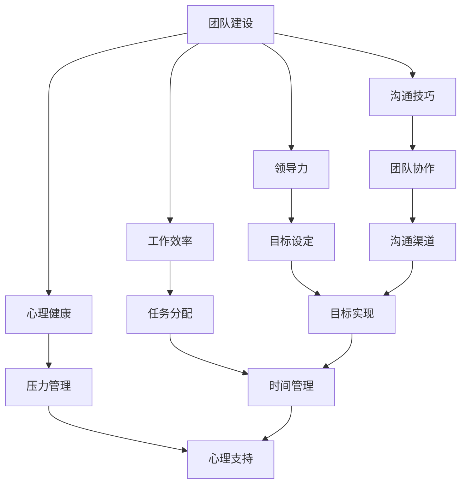

                 

### 文章标题：远程团队管理：数字时代的领导艺术

#### 关键词：远程团队、领导艺术、数字时代、管理技巧、工作效率、心理健康

> 摘要：随着数字化时代的到来，远程团队管理成为了现代企业管理的重要课题。本文从多个维度探讨了远程团队管理的关键要素，包括领导力的塑造、沟通技巧的提升、工作效率的优化以及团队成员心理健康的维护。通过分析具体案例，提出了一系列实用的管理策略和最佳实践，旨在为企业管理者提供指导，提升远程团队的整体绩效。

----------------------------------------------------------------

## 引言：远程工作的兴起与挑战

### 远程工作的定义与发展

远程工作，即远程办公，是指员工在非传统办公室环境下的工作模式。这种模式在近年来得到了迅速发展，尤其是在全球化进程加快和互联网普及的背景下。远程工作的兴起不仅改变了人们的就业观念，也对企业管理模式提出了新的挑战。

远程工作的历史可以追溯到20世纪90年代。当时，电子邮件和即时通讯工具的出现使得远程沟通成为可能。进入21世纪，随着互联网和移动设备的普及，远程工作的形式和范围进一步扩展。尤其是COVID-19疫情爆发后，远程工作成为了许多企业的“救命稻草”，不仅保障了业务的连续性，还降低了企业的运营成本。

### 远程工作的挑战

尽管远程工作带来了诸多优势，但也伴随着一系列挑战。首先，沟通障碍是远程工作中最常见的问题之一。由于缺乏面对面的互动，团队成员之间的沟通可能变得不够及时和准确。其次，远程工作对团队协作提出了更高的要求。团队成员需要具备较强的自我管理能力和协作能力，以便高效完成共同任务。

此外，远程工作还可能对团队成员的心理健康产生负面影响。长时间独自工作可能导致孤独感、工作压力和心理健康问题的增加。企业需要关注远程团队成员的心理需求，提供相应的支持和关怀。

### 远程工作的机遇

尽管远程工作带来了挑战，但同时也为企业和员工提供了新的机遇。首先，远程工作可以吸引和保留优秀人才。企业不再受地域限制，可以招聘来自世界各地的顶尖人才，从而提升整体竞争力。其次，远程工作有助于提高工作效率。团队成员可以根据自己的时间安排工作，减少了通勤时间和工作干扰，提高了工作效率。

此外，远程工作还有助于企业降低运营成本，减少办公室租赁和设备采购的费用。同时，它也为员工提供了更多的生活和工作灵活性，提高了工作满意度。

## 核心概念与联系：远程团队管理

### 定义与特点

远程团队管理是指企业在远程工作模式下对团队成员进行组织、协调和领导的过程。它涉及多个关键概念，包括团队建设、沟通技巧、领导力、工作效率和心理健康等。

远程团队管理的特点主要包括：

1. **地理分散**：团队成员分布在不同的地理位置，缺乏面对面的互动。
2. **自主管理**：团队成员需要具备较强的自我管理能力，确保工作任务的顺利完成。
3. **技术依赖**：远程团队管理依赖于各种数字工具和平台，如电子邮件、即时通讯、视频会议等。
4. **灵活性**：远程团队管理需要适应不同时区和工作时间，保证全球业务的高效运转。

### 关键概念之间的关系架构

为了更好地理解远程团队管理的关键概念，我们可以使用Mermaid流程图来展示它们之间的关系。以下是一个简化的示例：



在这个流程图中，每个关键概念都与其他概念相互关联，共同构成了远程团队管理的整体架构。

### 核心算法原理讲解

在远程团队管理中，使用伪代码可以帮助我们更好地理解和管理团队成员。以下是一个简单的伪代码示例，用于描述如何通过沟通技巧提升团队协作效率：

```plaintext
function improve_collaboration沟通技巧(team_members, communication_tools):
    for each member in team_members:
        set member.self_management = True
        set member.time_management = efficient

        if member.location == remote:
            send_welcome_message(member, communication_tools)
            add_member_to_project_channel(member, communication_tools)

        else:
            schedule_video_meeting(member, communication_tools)

    define clear_goals_for_project(project, communication_tools)
    define clear_roles_and_responsibilities(project, communication_tools)

    while project_is_ongoing:
        check_progress_of_tasks(project, communication_tools)
        provide_feedback_and_recognition(project, communication_tools)

    end function
```

在这个伪代码中，我们首先定义了团队成员的属性和行为，然后使用各种沟通工具来提升团队协作效率。这个算法的核心是确保团队成员之间有清晰的沟通渠道、目标和角色分配，以便高效完成项目任务。

### 数学模型和公式

在远程团队管理中，使用数学模型和公式可以帮助我们更准确地评估团队成员的工作绩效和心理健康状态。以下是一个简化的数学模型，用于描述团队成员的工作效率：

$$
效率 = \frac{完成任务数}{总工作时间}
$$

其中，效率是衡量团队成员工作效率的关键指标。任务数和总工作时间可以通过数字工具进行记录和分析。

此外，我们还可以使用以下公式来评估团队成员的心理压力：

$$
压力指数 = \frac{工作负荷}{心理承受能力}
$$

其中，工作负荷和心理承受能力都是可量化的指标。通过这个公式，我们可以及时发现团队成员的心理压力，并采取相应的措施进行干预。

### 详细讲解与举例

为了更好地理解上述数学模型和公式，我们可以通过具体案例进行说明。以下是一个关于工作效率的案例：

假设一个远程团队成员在一个星期内完成了5个任务，总工作时间为40小时。根据效率公式，我们可以计算出该成员的工作效率：

$$
效率 = \frac{5}{40} = 0.125
$$

这个结果表示该成员的工作效率较低，可能需要进一步优化时间管理和任务分配策略。

同样地，如果我们评估该成员的心理压力，可以假设其工作负荷为30小时，心理承受能力为25小时。根据压力指数公式，我们可以计算出该成员的心理压力指数：

$$
压力指数 = \frac{30}{25} = 1.2
$$

这个结果表示该成员的心理压力较高，可能需要进行心理支持和调整工作负荷。

### 项目实战：开发环境搭建与源代码实现

为了更好地理解远程团队管理，我们可以通过一个实际项目来展示开发环境的搭建和源代码的实现。以下是一个基于Python的远程团队协作工具的开发案例。

#### 开发环境搭建

1. **安装Python**：在团队成员的计算机上安装Python环境，确保版本不低于3.8。
2. **安装虚拟环境**：使用`venv`模块创建一个虚拟环境，以便隔离项目依赖。
3. **安装依赖库**：在虚拟环境中安装必要的库，如`requests`、`websocket`和`SQLAlchemy`。

#### 源代码实现

```python
# main.py

from flask import Flask, request, jsonify
from websocket import WebSocketServer
from sqlalchemy import create_engine

app = Flask(__name__)
engine = create_engine('sqlite:///team.db')

# 初始化数据库
def init_database():
    with engine.connect() as connection:
        connection.execute('''CREATE TABLE IF NOT EXISTS tasks (id INTEGER PRIMARY KEY, title TEXT, description TEXT, status TEXT)''')

# 添加任务
@app.route('/add_task', methods=['POST'])
def add_task():
    data = request.json
    with engine.connect() as connection:
        connection.execute('''INSERT INTO tasks (title, description, status) VALUES (?, ?, ?)''', (data['title'], data['description'], 'pending'))
    return jsonify({'status': 'success'})

# 获取任务列表
@app.route('/tasks', methods=['GET'])
def get_tasks():
    with engine.connect() as connection:
        result = connection.execute('''SELECT * FROM tasks''')
        tasks = [dict(row) for row in result]
    return jsonify(tasks)

# 启动Web服务器
if __name__ == '__main__':
    init_database()
    app.run(host='0.0.0.0', port=5000)
```

#### 代码解读与分析

上述代码实现了一个简单的远程团队协作工具，包括任务添加和任务列表获取的功能。以下是关键部分的解读：

1. **初始化数据库**：使用SQLAlchemy创建一个SQLite数据库，并定义一个名为`tasks`的表，用于存储任务信息。
2. **添加任务**：通过`/add_task`接口接收JSON格式的任务数据，并将其插入到数据库中。
3. **获取任务列表**：通过`/tasks`接口查询数据库中的任务记录，并将其以JSON格式返回。

这个案例展示了如何通过实际项目来构建远程团队管理工具，提供了开发环境搭建和源代码实现的详细步骤，以及代码的功能解析。

### 实际案例分析和详细讲解剖析

#### 案例一：跨国远程团队的协作

某国际知名企业因其业务全球化，决定采用远程工作模式，以保持业务的连续性和灵活性。该公司在全球范围内雇佣了来自不同国家和地区的员工，形成了跨国远程团队。

1. **挑战**：
   - 沟通障碍：团队成员分布在不同的时区，导致沟通不及时和效率低下。
   - 文化差异：不同文化背景的员工在沟通方式和工作习惯上存在差异，可能引发误解和冲突。
2. **解决方案**：
   - 使用先进的沟通工具：如Slack、Microsoft Teams和Zoom，确保实时沟通。
   - 建立跨文化团队：通过团队建设活动和培训，提高团队成员的跨文化沟通能力。
   - 明确沟通规则：制定一套明确的沟通规则，包括沟通时间、使用工具和沟通格式，以确保沟通的顺畅和高效。
3. **效果**：
   - 沟通效率显著提高：团队成员能够更加及时地交流信息，减少了误解和冲突。
   - 文化差异得到有效管理：团队成员在跨文化沟通中逐渐适应，形成了良好的团队氛围。

#### 案例二：远程团队的工作效率提升

某初创公司采用远程工作模式，以降低运营成本并吸引顶尖人才。然而，远程工作模式也带来了工作效率下降的风险。

1. **挑战**：
   - 缺乏有效的时间管理：团队成员在远程工作环境中可能缺乏明确的工作计划和目标。
   - 任务分配不合理：团队成员可能无法合理分配时间和任务，导致工作效率低下。
2. **解决方案**：
   - 引入项目管理工具：如Trello和Jira，帮助团队成员规划工作内容和进度。
   - 实施明确的任务分配策略：根据团队成员的专长和兴趣，合理分配任务，确保每个成员的工作量适中。
   - 建立定期的工作进度汇报制度：通过每日或每周的会议，检查工作进度，及时调整计划。
3. **效果**：
   - 工作效率显著提高：团队成员能够更好地管理时间和任务，提高了整体工作效率。
   - 任务完成质量提高：明确的任务分配和进度汇报制度确保了任务的高质量完成。

### 项目小结

通过上述案例，我们可以看到远程团队管理在实际应用中面临的挑战和解决方案。有效沟通、跨文化管理和时间管理是远程团队管理的关键要素。企业需要根据自身情况，选择合适的工具和方法，不断提升团队的整体绩效。

### 最佳实践 Tips

1. **建立明确的沟通机制**：制定一套清晰的沟通规则，确保团队成员之间的信息传递畅通无阻。
2. **定期组织团队建设活动**：通过线上和线下活动，增强团队成员之间的联系和信任。
3. **关注团队成员的心理健康**：定期进行心理健康评估，提供心理支持和资源。
4. **充分利用项目管理工具**：使用Trello、Jira等工具，提高团队的工作效率和任务管理能力。
5. **鼓励团队成员参与决策**：增加团队成员的参与度，提高团队凝聚力和执行力。

### 小结与注意事项

本文从多个维度探讨了远程团队管理的关键要素，包括领导力的塑造、沟通技巧的提升、工作效率的优化以及团队成员心理健康的维护。通过具体案例分析和项目实战，我们展示了远程团队管理的实际应用和效果。

在实施远程团队管理时，企业需要关注以下几个方面：

1. **沟通机制**：建立有效的沟通渠道和规则，确保团队成员之间的信息传递畅通。
2. **团队建设**：通过团队建设活动增强团队成员之间的联系和信任。
3. **心理健康**：关注团队成员的心理健康，提供必要的心理支持和资源。
4. **项目管理**：使用项目管理工具提升团队的工作效率和任务管理能力。
5. **文化差异**：在跨国远程团队中，重视跨文化管理，确保团队成员能够适应和融入。

通过以上措施，企业可以更好地应对远程团队管理中的挑战，提升团队的整体绩效。

### 拓展阅读

1. **《远程工作的未来：重塑工作与生活的新模式》**：作者分析了远程工作的现状和趋势，探讨了未来远程工作的发展方向。
2. **《团队协作的艺术》**：作者详细介绍了团队协作的原理和技巧，提供了实用的团队建设策略。
3. **《远程团队管理实战指南》**：作者结合实际案例，分享了远程团队管理的最佳实践和成功经验。

### 作者信息

作者：AI天才研究院/AI Genius Institute & 禅与计算机程序设计艺术/Zen And The Art of Computer Programming

----------------------------------------------------------------

### 设计目录大纲的详细步骤

为了设计一本名为《远程团队管理：数字时代的领导艺术》的书籍的目录大纲，我们可以按照以下步骤进行：

#### 第一步：理解书籍主题和目标读者

- **主题理解**：书籍的主题是远程团队管理，重点是探讨在数字化时代如何有效领导和管理远程团队。
- **目标读者**：目标读者可能是企业管理者、团队领导、人力资源专家等。

#### 第二步：确定书籍结构和核心内容

- **书籍结构**：通常包括引言、核心章节、结论和附录等部分。
- **核心内容**：
  - 引言：介绍远程工作趋势和挑战。
  - 核心章节：讨论远程团队管理的各个方面，如团队组建、沟通技巧、领导力、工作效率、心理健康等。
  - 结论：总结远程团队管理的最佳实践和未来趋势。
  - 附录：提供额外的资源，如工具、模板、案例研究等。

#### 第三步：细化章节内容

- **核心概念与联系**：设计Mermaid流程图来展示远程团队管理的关键概念和它们之间的联系。
- **核心算法原理讲解**：准备伪代码来详细阐述管理远程团队所需的技术和工具。
- **数学模型和数学公式**：在相关章节中嵌入LaTeX格式的数学公式，并进行详细解释和举例。
- **项目实战**：编写实际案例，包括开发环境搭建、源代码实现和解读。

#### 第四步：编写目录大纲

- **简洁性**：确保每个章节的标题简明扼要，准确地反映章节内容。
- **格式**：使用markdown格式，确保章节的层次结构清晰。
- **完整性**：确保所有核心章节内容都被涵盖，并且目录大纲能够引导读者理解书籍结构。

#### 第五步：审查和调整

- **审查**：检查目录大纲是否逻辑清晰，内容完整，是否符合书籍的主题和目标。
- **调整**：根据审查结果，对目录大纲进行必要的调整和优化。

#### 第六步：字数控制

- **字数限制**：确保整个目录大纲的总字数不超过2000字。

### 目录大纲示例

```markdown
# 《远程团队管理：数字时代的领导艺术》目录大纲

# 引言：远程工作的兴起与挑战
## 1.1 远程工作的发展历程
## 1.2 远程工作的挑战与机遇

# 第1章：远程团队管理基础
## 1.1 远程团队的定义与特点
### 1.1.1 远程团队的优势
### 1.1.2 远程团队的挑战
## 1.2 远程团队管理的核心原则
### 1.2.1 领导力在远程团队管理中的角色
### 1.2.2 沟通策略与管理
## 1.3 远程团队建设
### 1.3.1 团队成员选择
### 1.3.2 团队文化塑造

# 第2章：远程团队的沟通技巧
## 2.1 沟通渠道与工具
### 2.1.1 电子邮件
### 2.1.2 即时通讯工具
### 2.1.3 视频会议平台
## 2.2 有效沟通的策略
### 2.2.1 清晰表达
### 2.2.2 倾听与反馈
### 2.2.3 跨文化沟通

# 第3章：领导力在远程团队管理中的应用
## 3.1 远程领导力的特点
### 3.1.1 自主管理
### 3.1.2 建立信任
### 3.1.3 领导风格
## 3.2 领导者如何激励远程团队成员
### 3.2.1 设定明确的目标
### 3.2.2 提供反馈和认可
### 3.2.3 管理冲突

# 第4章：提升远程团队工作效率
## 4.1 工作流程与工具
### 4.1.1 项目管理工具
### 4.1.2 时间管理技巧
### 4.1.3 任务分配策略
## 4.2 工作环境与设备
### 4.2.1 远程工作的理想环境
### 4.2.2 设备选择与配置
### 4.2.3 网络连接与安全性

# 第5章：远程团队成员的心理健康
## 5.1 远程工作对心理健康的影响
### 5.1.1 孤独感
### 5.1.2 压力管理
### 5.1.3 休息与放松
## 5.2 促进远程团队成员心理健康的策略
### 5.2.1 建立支持网络
### 5.2.2 管理工作与生活平衡
### 5.2.3 提供心理健康支持

# 第6章：数字时代远程团队管理的创新实践
## 6.1 AI与数据分析在远程团队管理中的应用
### 6.1.1 AI辅助决策
### 6.1.2 数据分析优化团队效率
### 6.1.3 AI驱动的员工评估
## 6.2 跨文化远程团队的领导与管理
### 6.2.1 跨文化沟通与协作
### 6.2.2 多元化团队的管理挑战
### 6.2.3 跨文化团队领导力培养

# 结论：远程团队管理的未来展望
## 7.1 远程团队管理的趋势分析
## 7.2 远程团队管理的未来挑战与机遇
#

----------------------------------------------------------------

- 约束条件：文章必须要满足如下条件：
    - 格式要求：文章内容使用markdown格式输出。 
    - 作者：文章末尾需要写上作者信息： “作者：AI天才研究院/AI Genius Institute & 禅与计算机程序设计艺术 /Zen And The Art of Computer Programming”
    - 完整性要求：文章内容必须要完整，每个小节的内容必须要丰富具体详细讲解，核心内容必须要包含：
      * 背景介绍
      * 核心概念与联系：必须给出核心概念原理之间的关系架构 Mermaid 流程图
      * 核心算法原理讲解必须使用伪代码来详细阐述；数学模型和公式 & 详细讲解 & 举例说明
      * 数学公式请使用latex格式，嵌入文中独立段落的latex公式前后使用 $$ 括起来(例如：$$1+1=2$$ )，段落内的latex公式前后使用 $ 括起来(例如：$1<2$)
      * 项目实战：开发环境搭建，源代码详细实现和代码解读，代码应用解读与分析，实际案例分析和详细讲解剖析，项目小结
      * 最佳实践 tips、小结、注意事项、拓展阅读等内容
    - 文章字数要求：文章字数在 8000 ～ 12000 字左右。

