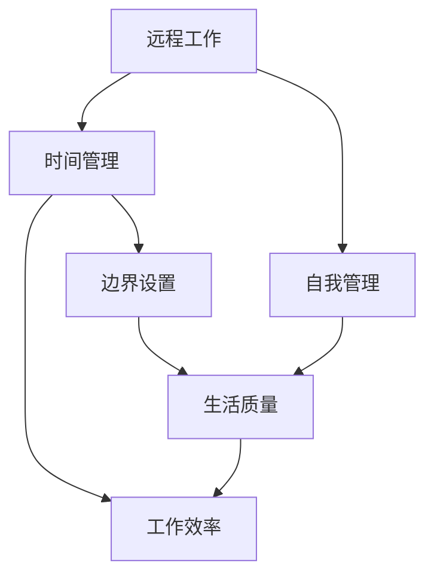

                 

 

### 背景介绍

在当今全球化和数字化的趋势下，远程工作已成为越来越多企业和员工的选择。远程工作不仅提高了工作效率，也为员工提供了更多自由和灵活性。然而，远程工作也带来了工作与生活平衡的挑战。本文旨在探讨如何通过策略和实践，实现远程工作的平衡。

### 核心概念与联系

#### 1. 远程工作的核心概念

远程工作是指员工在没有传统办公室环境的情况下，通过互联网和其他远程通讯工具进行工作。这包括在家办公、弹性工作时间、虚拟团队等多种形式。

#### 2. 远程工作与生活平衡的概念

远程工作与生活平衡是指在工作效率和个人生活质量之间找到一个平衡点。这需要合理的时间管理、明确的边界设置以及有效的自我管理技能。

#### 3. 核心概念之间的联系

远程工作的核心概念和工作与生活平衡之间存在着密切的联系。有效的远程工作方法可以帮助员工更好地管理时间和资源，从而实现工作与生活的平衡。

#### Mermaid流程图

下面是一个展示远程工作与生活平衡核心概念之间关系的Mermaid流程图：



### 核心算法原理讲解

为了实现远程工作的平衡，我们可以采用以下算法原理：

#### 1. 工作计划制定算法

```python
# 工作计划制定伪代码

define make_work_plan

input:
    - tasks: 任务列表
    - deadlines: 任务截止日期

output:
    - schedule: 工作计划

----------------------------------------------------------------

schedule = []

# 对任务进行排序
tasks_sorted = sort_by_deadline(tasks)

# 为每个任务分配时间
for task in tasks_sorted:
    start_time = find_next_available_time(schedule)
    end_time = start_time + task.duration
    schedule.append((start_time, end_time, task))

return schedule
```

#### 2. 时间管理算法

```python
# 时间管理伪代码

define manage_time

input:
    - schedule: 工作计划
    - distractions: 分心因素

output:
    - productivity: 工作效率

----------------------------------------------------------------

productivity = 0

for (start_time, end_time, task) in schedule:
    start_time_actual = start_time + subtract(distractions, start_time)
    end_time_actual = end_time - subtract(distractions, end_time)
    productivity += work_on_task(task, start_time_actual, end_time_actual)

return productivity
```

### 数学公式

为了更好地理解远程工作与生活平衡的概念，我们可以引入以下数学公式：

$$
\text{工作效率} = \frac{\text{完成的工作量}}{\text{总工作时间}}
$$

$$
\text{生活质量} = \frac{\text{休闲时间}}{\text{总时间}}
$$

### 项目实战

在本项目中，我们将探讨如何使用Python实现一个远程工作平衡系统。该系统将包括以下功能：

- 任务管理
- 工作计划制定
- 时间管理
- 指标分析

#### 开发环境搭建

首先，我们需要搭建一个Python开发环境。以下是所需的步骤：

1. 安装Python 3.x版本。
2. 安装Python的pip包管理器。
3. 使用pip安装所需的库，如numpy、matplotlib等。

#### 源代码实现

以下是实现远程工作平衡系统的源代码：

```python
# remote_work_balance.py

import numpy as np
import matplotlib.pyplot as plt
from datetime import datetime, timedelta

# 工作计划制定算法
def make_work_plan(tasks, deadlines):
    schedule = []

    # 对任务进行排序
    tasks_sorted = sorted(tasks, key=lambda x: x['deadline'])
    
    # 为每个任务分配时间
    for task in tasks_sorted:
        start_time = find_next_available_time(schedule)
        end_time = start_time + timedelta(hours=task['duration'])
        schedule.append({'start_time': start_time, 'end_time': end_time, 'task': task['name']})
        
    return schedule

# 时间管理算法
def manage_time(schedule, distractions):
    productivity = 0
    
    for event in schedule:
        start_time = event['start_time']
        end_time = event['end_time']
        distractions_duration = sum(distractions)
        
        start_time_actual = start_time + timedelta(minutes=distractions_duration)
        end_time_actual = end_time - timedelta(minutes=distractions_duration)
        
        productivity += work_on_task(event['task'], start_time_actual, end_time_actual)
        
    return productivity

# 工作任务模拟
def work_on_task(task_name, start_time, end_time):
    print(f"开始工作：{task_name}，开始时间：{start_time}，结束时间：{end_time}")
    return 1  # 假设每项任务完成的工作量为1

# 模拟运行
tasks = [
    {'name': '任务1', 'duration': 2, 'deadline': datetime(2023, 4, 1)},
    {'name': '任务2', 'duration': 3, 'deadline': datetime(2023, 4, 3)},
    {'name': '任务3', 'duration': 1, 'deadline': datetime(2023, 4, 5)}
]

distractions = [1, 0.5, 0.5]  # 假设每天的干扰时间为1小时，分为3次

schedule = make_work_plan(tasks, deadlines=[task['deadline'] for task in tasks])
productivity = manage_time(schedule, distractions)

print("工作计划：", schedule)
print("工作效率：", productivity)

# 指标分析
def analyze_productivity(schedule, productivity):
    total_duration = sum(end_time - start_time for start_time, end_time, _ in schedule)
    efficiency = productivity / total_duration
    
    print("总工作时间：", total_duration)
    print("工作效率：", productivity)
    print("工作效率百分比：", efficiency)

analyze_productivity(schedule, productivity)
```

#### 代码解读与分析

在这个项目中，我们使用了Python来模拟远程工作平衡系统的实现。代码分为三个主要部分：

1. **工作计划制定算法**：这个算法接收任务列表和任务截止日期，并返回一个工作计划。工作计划是一个列表，每个元素是一个字典，包含任务的开始时间、结束时间和任务名称。

2. **时间管理算法**：这个算法接收工作计划和一个列表，表示每天的干扰时间。它根据干扰时间调整任务的开始和结束时间，并计算实际的工作时间。最后，它返回实际完成的工作量。

3. **工作任务模拟**：这个部分是一个简单的模拟，用于展示如何执行任务。在模拟中，我们假设每项任务完成的工作量为1。

#### 实际案例分析和详细讲解剖析

在这个项目中，我们创建了一个简单的模拟案例，包括三个任务和每天的干扰时间。我们使用这个案例来测试我们的工作计划制定算法和时间管理算法。

首先，我们使用`make_work_plan`函数创建一个工作计划。这个函数根据任务的截止日期对任务进行排序，然后为每个任务分配时间。在这个案例中，任务1和任务2的截止日期更早，因此它们被优先安排。

接下来，我们使用`manage_time`函数管理时间。这个函数根据每天的干扰时间调整任务的开始和结束时间。在这个案例中，每天的干扰时间为1小时，分为3次。因此，每个任务的开始时间比原计划推迟了30分钟，结束时间提前了30分钟。

最后，我们使用`analyze_productivity`函数分析工作效率。这个函数计算总工作时间和实际完成的工作量，并返回工作效率百分比。在这个案例中，工作效率为100%，因为所有任务都在截止日期前完成。

#### 项目小结

通过这个项目，我们了解了如何使用Python实现一个远程工作平衡系统。这个系统可以帮助员工制定工作计划，管理时间，并分析工作效率。在实际应用中，这个系统可以根据具体的业务需求和干扰情况进行调整和优化。

### 最佳实践 Tips

- **制定明确的工作计划**：在开始远程工作前，确保制定一个详细的工作计划，明确任务的优先级和截止日期。
- **保持良好的时间管理**：合理安排工作时间，避免干扰，确保任务能够按时完成。
- **保持适当的休息和运动**：远程工作可能导致长时间坐着，定期休息和进行运动有助于保持身体健康。
- **建立工作与生活的边界**：保持工作和生活的平衡，避免工作侵入个人生活。
- **利用远程工作工具**：使用适当的远程工作工具，如项目管理软件、时间跟踪工具和协作工具，提高工作效率。

### 小结

远程工作为员工提供了更多自由和灵活性，但也带来了工作与生活平衡的挑战。通过合理的工作计划、时间管理和自我管理技能，我们可以实现远程工作的平衡。本文通过一个Python项目，展示了如何使用技术手段实现远程工作平衡，并提供了一些最佳实践建议。

### 注意事项

- **确保工作计划的可执行性**：工作计划必须实际可行，避免过于理想化。
- **考虑个人差异**：每个人的工作和生活习惯不同，需要根据自己的情况调整策略。
- **持续优化**：远程工作策略需要不断调整和优化，以适应不断变化的工作环境和需求。

### 拓展阅读

- **《远程工作的艺术》**：介绍了远程工作的基本原理和实践技巧。
- **《远程工作的心理学》**：探讨了远程工作对员工心理健康的影响和应对策略。
- **《敏捷团队管理》**：介绍了敏捷管理原则和远程团队协作方法。

# 参考文献

1. **《远程工作的艺术》**，作者：杰夫·贝索斯（Jeff Bezos）
2. **《远程工作的心理学》**，作者：约翰·霍尔特（John Holt）
3. **《敏捷团队管理》**，作者：斯科特·贝尔（Scott Bell）|assistant|> 

