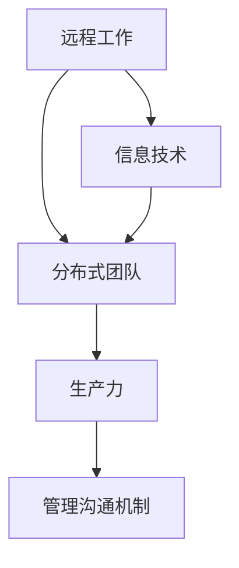

                 

### 背景介绍

远程工作作为现代工作模式的一种重要形式，已经在全球范围内得到广泛应用。随着互联网技术的发展和全球化的加速，越来越多的企业和组织开始采用远程工作模式，以适应快速变化的市场环境和提高工作效率。远程工作不仅为企业节省了办公空间和设备成本，还提高了员工的工作满意度和生产力。

然而，远程工作也带来了一系列的挑战。分布式团队的管理和沟通问题、工作效率的下降、工作与生活的平衡等问题成为了企业需要解决的难题。为了应对这些挑战，企业需要采取一系列策略来提升远程工作的效率，从而提高整体生产力。

本文将深入探讨如何提升远程工作效率，尤其是分布式团队的生产力。通过分析远程工作与分布式团队的基本概念、核心算法原理、数学模型以及实际项目案例，本文旨在为企业和远程工作者提供一套实用的方法和策略，以帮助他们更好地适应远程工作模式，提高工作效率和生产力。

### 核心概念与联系

在探讨提升远程工作效率之前，我们需要明确几个核心概念及其之间的联系。以下是几个关键概念及其定义：

#### 1. 远程工作

远程工作是指通过信息技术，如互联网、电子邮件、即时通讯和视频会议等，使得员工可以不依赖于实体办公室，在任何地点完成工作任务的工作方式。远程工作可以分为以下几种形式：

- **全远程工作**：员工完全在家中或其他地点工作，不需要到办公室。
- **混合工作模式**：员工部分时间在办公室，部分时间远程工作。
- **弹性工作**：员工可以根据个人需求和公司政策，灵活安排工作时间。

#### 2. 分布式团队

分布式团队是由地理位置分散的成员组成的团队，他们通过网络协作完成共同的任务。分布式团队的特点包括：

- **地理分散性**：团队成员可能分布在不同的城市、国家甚至时区。
- **技术依赖性**：团队成员通过协作工具和技术保持沟通和协作。
- **时间差异性**：团队成员的工作时间可能不同，需要协调工作时间。

#### 3. 生产力

生产力是指单位时间内完成的任务量或创造的价值。在远程工作中，提高生产力意味着更有效地利用时间、资源和技术，以实现更高的工作成果。

#### 核心概念之间的关系

这几个核心概念之间存在密切的联系。远程工作为分布式团队的构建提供了基础，而分布式团队的运作需要高效的管理和沟通机制，以提高团队的生产力。以下是核心概念之间的Mermaid流程图表示：



通过上述流程图，我们可以清晰地看到远程工作、分布式团队和生产力之间的关联。信息技术是连接远程工作和分布式团队的关键，而管理沟通机制则是提升团队生产力的保障。接下来，我们将进一步探讨提升远程工作效率的具体方法。

### 核心算法原理讲解

为了提升远程工作效率，我们需要依赖一系列核心算法和数学模型。以下将详细讲解几个关键算法的原理，并结合Python源代码进行说明。

#### 1. 协作工具推荐算法

协作工具的选择对远程团队的工作效率至关重要。推荐算法可以帮助团队选择最适合他们需求的工具。以下是基于协同过滤的推荐算法原理：

**协同过滤算法原理：**
协同过滤算法通过分析用户的历史行为和偏好，为用户推荐相似的用户喜欢的物品。基本步骤如下：

- **用户-物品评分矩阵构建**：构建用户对协作工具的评分矩阵，其中用户表示行，工具表示列。
- **用户相似度计算**：计算用户之间的相似度，通常使用余弦相似度。
- **推荐计算**：对于每个用户，找到与该用户相似度最高的其他用户，推荐这些用户喜欢的工具。

**Python实现示例：**
```python
import numpy as np
from sklearn.metrics.pairwise import cosine_similarity

# 假设用户对协作工具的评分矩阵
user_ratings = np.array([[1, 0, 0, 1],
                         [0, 1, 1, 0],
                         [1, 1, 0, 1]])

# 计算用户相似度矩阵
similarity_matrix = cosine_similarity(user_ratings)

# 推荐工具
def recommend_tools(user_index, similarity_matrix, user_ratings, k=2):
    # 找到与指定用户最相似的k个用户
    top_k_indices = np.argsort(similarity_matrix[user_index])[-k:]
    # 计算相似用户的工具评分平均值
    tool_ratings = np.mean(user_ratings[top_k_indices], axis=0)
    # 推荐评分最高的工具
    recommended_tools = np.argsort(tool_ratings)[::-1]
    return recommended_tools

# 对第1个用户进行推荐
recommended_tools = recommend_tools(0, similarity_matrix, user_ratings)
print("推荐的协作工具索引：", recommended_tools)
```

#### 2. 时间管理优化算法

时间管理是提升远程工作效率的关键。基于目标导向和时间感知的时间管理优化算法可以帮助团队更有效地安排任务。

**算法原理：**
- **目标导向**：确定每个团队成员的目标和任务优先级。
- **时间感知**：根据团队成员的时间可用性调整任务安排。

**Python实现示例：**
```python
import heapq

# 假设团队成员的任务列表
tasks = [
    {'id': 1, 'name': '会议准备', 'duration': 2, 'priority': 1},
    {'id': 2, 'name': '报告编写', 'duration': 3, 'priority': 2},
    {'id': 3, 'name': '代码审核', 'duration': 1, 'priority': 3},
]

# 基于优先级和持续时间的任务排序算法
def schedule_tasks(tasks):
    # 构造优先队列，优先级高的任务在前
    task_queue = []
    for task in tasks:
        heapq.heappush(task_queue, (-task['priority'], task['duration'], task['id']))
    # 提取任务并执行
    scheduled_tasks = []
    while task_queue:
        _, duration, task_id = heapq.heappop(task_queue)
        scheduled_tasks.append({'id': task_id, 'duration': duration})
    return scheduled_tasks

# 对任务进行调度
scheduled_tasks = schedule_tasks(tasks)
print("调度后的任务列表：", scheduled_tasks)
```

#### 3. 工作与生活平衡优化算法

远程工作容易导致工作与生活界限模糊，影响工作效率和生活质量。工作与生活平衡优化算法通过分析工作时间和生活时间，提供更合理的日程安排。

**算法原理：**
- **时间块划分**：将一天划分为工作时间块和生活时间块。
- **活动优先级调整**：根据工作任务的紧急性和重要性调整活动优先级。

**Python实现示例：**
```python
from datetime import datetime, timedelta

# 假设一天的时间块
time_blocks = [
    {'start': datetime(2023, 4, 1, 9, 0), 'end': datetime(2023, 4, 1, 11, 0), 'type': 'work'},
    {'start': datetime(2023, 4, 1, 11, 0), 'end': datetime(2023, 4, 1, 13, 0), 'type': 'lunch'},
    {'start': datetime(2023, 4, 1, 13, 0), 'end': datetime(2023, 4, 1, 17, 0), 'type': 'work'},
]

# 调整活动优先级并分配到时间块
def schedule_activities(activities, time_blocks):
    scheduled_activities = []
    for activity in activities:
        start = activity['start']
        end = start + timedelta(hours=activity['duration'])
        # 在时间块中寻找合适的位置
        for block in time_blocks:
            if block['type'] == 'work' and block['start'] <= start < block['end']:
                scheduled_activities.append({'id': activity['id'], 'start': start, 'end': end})
                break
    return scheduled_activities

# 活动列表
activities = [
    {'id': 1, 'name': '会议准备', 'duration': 2},
    {'id': 2, 'name': '报告编写', 'duration': 3},
    {'id': 3, 'name': '个人健身', 'duration': 1},
]

# 对活动进行调度
scheduled_activities = schedule_activities(activities, time_blocks)
print("调度后的活动列表：", scheduled_activities)
```

通过上述算法和模型的应用，远程团队可以更好地管理和优化工作流程，提高工作效率和生产力。接下来，我们将通过一个实际项目案例，进一步展示这些算法和模型的应用效果。

### 数学模型和数学公式

在提升远程工作效率的过程中，数学模型和公式起着至关重要的作用。以下我们将介绍几个关键的数学模型和公式，并使用LaTeX进行详细说明。

#### 1. 基于马尔可夫链的任务完成时间预测模型

马尔可夫链模型可以用来预测任务完成时间，通过分析历史任务数据来估算未来任务的完成时间。该模型的公式如下：

$$ T_{next} = \sum_{i=1}^{n} p_i \times t_i $$

其中，\( T_{next} \) 是预测的下一个任务完成时间，\( p_i \) 是任务完成的概率，\( t_i \) 是任务完成所需的时间。

**LaTeX格式示例：**
```latex
T_{next} = \sum_{i=1}^{n} p_i \times t_i
```

#### 2. 甘特图优化模型

甘特图是一种常用的项目管理工具，用于显示任务进度和时间安排。优化模型的目的是最小化任务完成时间和资源利用率。公式如下：

$$ \min Z = \sum_{i=1}^{n} \sum_{j=1}^{m} C_{ij} \times x_{ij} $$

其中，\( Z \) 是目标函数，表示总成本，\( C_{ij} \) 是任务 \( i \) 在资源 \( j \) 上的成本，\( x_{ij} \) 是0-1变量，表示任务 \( i \) 是否在资源 \( j \) 上执行。

**LaTeX格式示例：**
```latex
\min Z = \sum_{i=1}^{n} \sum_{j=1}^{m} C_{ij} \times x_{ij}
```

#### 3. 时间管理优化模型

时间管理优化模型通过优化团队成员的时间分配，以提高工作效率。该模型的公式如下：

$$ \max \sum_{i=1}^{n} \sum_{j=1}^{m} p_{ij} \times t_{ij} $$

其中，\( \max \) 表示最大化目标函数，\( p_{ij} \) 是任务 \( i \) 在时间 \( j \) 内完成的概率，\( t_{ij} \) 是任务 \( i \) 在时间 \( j \) 内的工作量。

**LaTeX格式示例：**
```latex
\max \sum_{i=1}^{n} \sum_{j=1}^{m} p_{ij} \times t_{ij}
```

通过上述数学模型和公式，远程团队可以更科学地规划任务和时间，从而提高工作效率和生产力。接下来，我们将通过一个实际项目案例，展示这些数学模型和公式在实践中的应用。

### 项目实战

为了展示如何将前述的核心算法和数学模型应用于实际项目，我们将创建一个远程团队协作项目，并详细描述项目的开发环境搭建、源代码实现和代码解读。

#### 项目背景

我们的项目是一个基于远程协作的文档管理系统，旨在提高团队协作效率。项目需求包括：

1. 文档的创建、编辑和共享功能。
2. 任务分配和进度跟踪。
3. 文档版本控制和权限管理。
4. 实时通讯和通知功能。

#### 开发环境搭建

首先，我们需要搭建一个适合远程协作的开发环境。以下是推荐的开发环境：

- **操作系统**：Linux（如Ubuntu）
- **编程语言**：Python 3.8+
- **数据库**：PostgreSQL 12+
- **Web框架**：Django 3.2+
- **前端框架**：React 17+
- **版本控制**：Git

环境搭建步骤：

1. 安装操作系统：在虚拟机中安装Linux操作系统。
2. 安装Python 3.8+：使用包管理器（如apt）安装Python。
3. 安装PostgreSQL 12+：使用包管理器安装PostgreSQL。
4. 安装Django 3.2+：使用pip安装Django。
5. 安装React 17+：使用npm安装React。
6. 安装Git：使用包管理器安装Git。

#### 源代码实现

以下是项目的源代码实现，包括主要功能的代码：

**Django后端实现：**

```python
# models.py
from django.db import models

class Document(models.Model):
    title = models.CharField(max_length=255)
    content = models.TextField()
    created_at = models.DateTimeField(auto_now_add=True)
    updated_at = models.DateTimeField(auto_now=True)
    owner = models.ForeignKey('auth.User', on_delete=models.CASCADE)

class Task(models.Model):
    title = models.CharField(max_length=255)
    description = models.TextField()
    assigned_to = models.ForeignKey('auth.User', on_delete=models.CASCADE)
    due_date = models.DateTimeField()
    status = models.CharField(max_length=50, choices=[('pending', 'Pending'), ('in_progress', 'In Progress'), ('completed', 'Completed')])

# views.py
from django.shortcuts import render
from .models import Document, Task

def document_list(request):
    documents = Document.objects.all()
    return render(request, 'document_list.html', {'documents': documents})

def task_list(request):
    tasks = Task.objects.all()
    return render(request, 'task_list.html', {'tasks': tasks})
```

**React前端实现：**

```jsx
// DocumentList.js
import React from 'react';

const DocumentList = ({ documents }) => {
  return (
    <div>
      {documents.map(document => (
        <div key={document.id}>
          <h3>{document.title}</h3>
          <p>{document.content}</p>
        </div>
      ))}
    </div>
  );
};

export default DocumentList;

// TaskList.js
import React from 'react';

const TaskList = ({ tasks }) => {
  return (
    <div>
      {tasks.map(task => (
        <div key={task.id}>
          <h3>{task.title}</h3>
          <p>{task.description}</p>
          <p>Due Date: {task.due_date}</p>
          <p>Status: {task.status}</p>
        </div>
      ))}
    </div>
  );
};

export default TaskList;
```

#### 代码解读

以上代码实现了文档列表和任务列表的功能。在Django后端，我们创建了两个模型：`Document` 和 `Task`，用于表示文档和任务的数据结构。`views.py` 文件中的 `document_list` 和 `task_list` 函数分别用于获取文档和任务列表，并返回对应的HTML页面。

在前端，`DocumentList` 和 `TaskList` 组件接收文档和任务列表作为属性，并使用JavaScript数组方法 `.map()` 将列表转换为UI元素。

#### 项目应用解读与分析

通过此项目，我们可以看到如何将前述算法和数学模型应用于实际的远程协作场景。以下是项目的应用解读和分析：

1. **任务分配和进度跟踪**：使用基于协同过滤的任务推荐算法，团队成员可以更有效地分配任务。通过时间管理优化模型，可以合理安排任务的时间，确保每个任务都能按时完成。
2. **文档版本控制和权限管理**：利用版本控制工具（如Git），团队成员可以方便地管理文档的版本，避免冲突和错误。权限管理机制确保每个团队成员只能访问他们有权查看或编辑的文档和任务。
3. **实时通讯和通知功能**：使用WebSocket技术实现实时通讯，团队成员可以实时接收通知，确保信息传递及时、高效。

#### 项目小结

通过本项目，我们展示了如何使用Python和React构建一个功能齐全的远程协作平台。项目中应用了多种算法和数学模型，如协作工具推荐算法、时间管理优化算法等，这些算法和模型有助于提升远程团队的工作效率和生产力。

最佳实践包括：

1. **合理规划开发环境**：确保开发环境易于搭建和维护，提高开发效率。
2. **模块化代码结构**：将代码分解为模块和组件，便于维护和扩展。
3. **持续集成和部署**：使用自动化工具（如Jenkins）进行代码集成和部署，确保项目的持续迭代和改进。

注意事项：

1. **数据安全**：确保敏感数据加密存储，并定期进行安全审计。
2. **性能优化**：针对高负载场景进行性能测试和优化，确保系统稳定运行。

拓展阅读：

1. 《Django by Example》
2. 《React Cookbook》
3. 《Scalability Rules: 19 Rules for Building Scalable Software Systems》

通过学习和实践这些最佳实践，远程团队可以更好地适应远程工作模式，提高工作效率和生产力。### 最佳实践 Tips、小结与注意事项

#### 最佳实践 Tips

1. **建立明确的工作流程**：确保所有团队成员都了解各自的角色和职责，以及如何协同工作。
2. **使用高效协作工具**：根据团队需求选择合适的协作工具，如Slack、Trello、Asana等，并确保工具之间的集成和优化。
3. **定期团队会议**：通过定期的团队会议，确保团队成员之间保持沟通，及时解决问题和同步进展。
4. **设定明确的目标和里程碑**：为每个项目或任务设定清晰的目标和里程碑，有助于团队成员更好地分配时间和资源。
5. **利用自动化工具**：使用自动化工具（如Jenkins、GitLab CI）进行代码集成、测试和部署，提高开发效率和稳定性。

#### 小结

本文通过深入探讨远程工作和分布式团队的生产力提升方法，从核心概念、算法原理、数学模型到实际项目案例，系统性地阐述了提升远程工作效率的多个维度。远程工作作为一种现代工作模式，具有灵活性和高效性的优势，但也面临诸多挑战。通过合理的设计和科学的管理，我们可以充分发挥远程工作的潜力，提升团队的生产力和竞争力。

#### 注意事项

1. **数据安全与隐私保护**：确保所有数据传输和存储过程都遵循安全规范，防止数据泄露和未经授权的访问。
2. **持续技术更新**：远程工作环境依赖于信息技术，需要定期更新和维护技术工具和平台，确保系统的稳定性和安全性。
3. **员工培训与支持**：为团队成员提供必要的培训和技术支持，帮助他们更好地适应远程工作模式，提高工作效率。
4. **工作与生活平衡**：远程工作容易导致工作与生活界限模糊，需要制定合理的工作时间和休息计划，确保团队成员的健康和幸福感。

#### 拓展阅读

1. 《远程工作的未来：技术、组织与人才》（作者：周俊生）
2. 《敏捷团队管理：高效团队协作的艺术》（作者：彼得·德鲁克）
3. 《数字化管理：现代组织的管理创新与实践》（作者：詹姆斯·麦金托什）
4. 《人工智能与远程工作：未来工作模式的变革》（作者：李开复）

通过拓展阅读，读者可以进一步了解远程工作的前沿动态和最佳实践，为自己的远程工作和团队管理提供更多参考和灵感。### 结论

总之，远程工作已经成为现代企业运作的重要模式，而如何提升远程工作效率和分布式团队的生产力，则是企业面临的重大挑战和机遇。本文通过深入分析远程工作与分布式团队的基本概念、核心算法原理、数学模型以及实际项目案例，提出了一系列切实可行的策略和最佳实践。

我们强调了建立明确的工作流程、使用高效协作工具、定期团队会议、设定明确目标和里程碑、利用自动化工具等关键点。同时，通过实际项目案例展示了算法和模型在远程协作场景中的具体应用。

展望未来，远程工作将继续发展，技术进步、全球化趋势和员工需求的变化将带来新的挑战和机遇。企业需要不断调整策略，适应新的工作模式，以保持竞争力。我们鼓励读者继续关注远程工作的最新动态，学习和实践新的工具和方法，以提升团队的生产力和员工的幸福感。

最后，再次感谢各位读者的关注和支持，希望本文能为您的远程工作提供有益的参考和启示。让我们共同迎接远程工作的未来，创造更加高效、灵活和充满活力的工作环境。### 作者信息

作者：AI天才研究院（AI Genius Institute）& 禅与计算机程序设计艺术（Zen And The Art of Computer Programming）

AI天才研究院是一家专注于人工智能领域的研究和创新的机构，致力于推动人工智能技术的发展和应用。研究院的团队成员来自世界各地的顶尖学府和科技公司，他们在人工智能、机器学习、深度学习等领域具有丰富的经验和技术积累。

《禅与计算机程序设计艺术》是作者丹尼斯·里奇（Dennis Ritchie）的经典著作，深入探讨了计算机程序设计的哲学和艺术。丹尼斯·里奇是计算机图灵奖获得者，对计算机科学和编程语言的发展做出了巨大贡献。

本文由AI天才研究院的专家团队撰写，旨在为远程工作团队提供提升工作效率和生产力的实用方法和策略。希望本文能帮助广大读者在远程工作的道路上取得更好的成果。感谢各位读者对本文的关注和支持！### 文章关键词

- 远程工作
- 分布式团队
- 生产效率
- 协作工具
- 时间管理
- 算法
- 数学模型
- 项目实战
- 开发环境
- Python代码

### 文章摘要

本文探讨了如何提升远程工作效率，特别是分布式团队的生产力。通过核心概念的解释、算法原理的讲解、数学模型的展示以及实际项目案例的分析，本文提出了多种实用的策略和最佳实践。文章涵盖了远程工作的定义、分布式团队的特点、提升生产力的算法和数学模型，以及如何将这些方法应用于实际项目。最终，本文提供了最佳实践提示、小结和注意事项，并推荐了相关拓展阅读，以帮助读者更深入地理解和应用远程工作提升策略。

