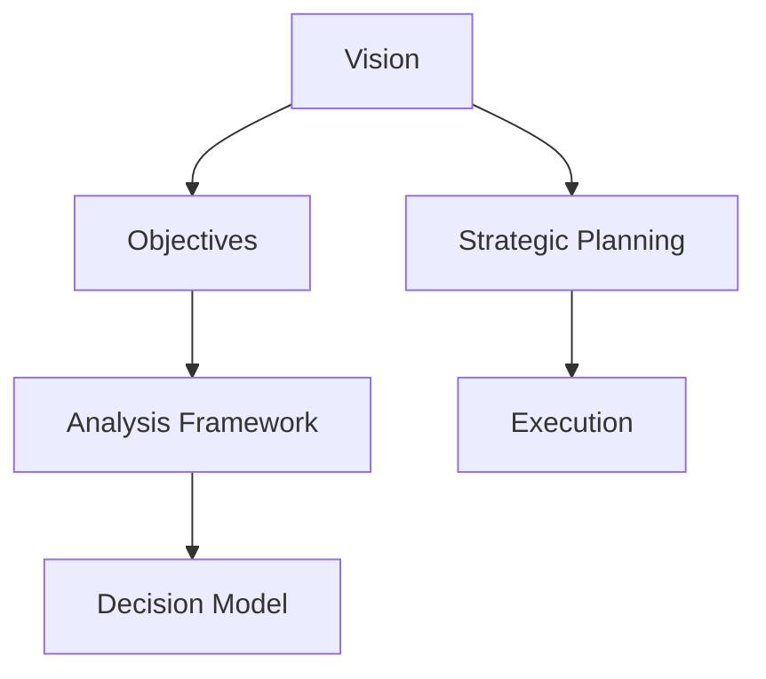

                 

### 背景介绍

在当今高速发展的信息技术时代，战略性的思维成为了企业、组织乃至个人成功的关键要素。随着数字化转型的加速，市场环境变得日益复杂和动态，企业需要具备前瞻性和全局性的思维来应对各种挑战和机遇。然而，战略性思维并非一蹴而就，它需要系统的构建与培养。

战略性思维是指对长远目标的深刻洞察、系统的分析和决策能力，能够帮助个体和团队在复杂多变的环境中做出最优的选择。它不仅涉及宏观的愿景规划，还包括微观的执行策略。在商业领域，战略性思维能够帮助企业家识别市场趋势、制定有效的竞争策略，从而在激烈的市场竞争中脱颖而出。在技术领域，战略性思维同样重要，技术领导者需要通过战略性思维来把握技术发展方向，制定长远的技术路线图，确保企业的技术竞争力。

然而，战略性思维并非与生俱来，它需要通过系统的学习和实践来培养。当前，很多企业和组织都在积极探索如何提高员工和领导者的战略性思维能力，这包括提供专门的培训课程、鼓励跨部门合作、开展思维训练活动等。在这些努力中，许多成功的实践表明，战略性思维的培养不仅是提高个人能力的手段，更是增强团队协作和整体组织效能的重要途径。

本篇博客旨在深入探讨战略性思维的核心概念、构建方法、培养策略以及其在领导力中的具体应用。我们将通过系统的分析、实例讲解和实际案例分析，帮助读者理解战略性思维的本质，掌握有效的培养方法，并能够在实际工作中加以应用。

首先，我们将介绍战略性思维的基本概念，探讨其起源、意义以及核心要素，帮助读者建立起对战略性思维的基本认知。接着，我们将详细讲解战略性思维的构建与培养方法，分析如何通过教育、实践和自我提升来培养这一重要的思维能力。随后，我们将探讨战略性思维在领导力中的应用，特别是在战略规划和组织管理中的具体体现。最后，通过实际案例分析和未来展望，我们希望读者能够对战略性思维有更深入的理解，并在实践中不断提升自己的战略思维水平。

### 核心概念与联系

在深入探讨战略性思维之前，我们需要明确几个核心概念，并分析它们之间的相互关系。这些核心概念包括：愿景、目标、分析框架和决策模型。

首先，愿景是战略性思维的起点。愿景是对未来长远目标的清晰描述，它为组织或个人提供了明确的方向。一个强大的愿景能够激发团队的动力，统一团队成员的目标，并指导战略的制定与执行。愿景不仅需要具有吸引力，还要具有可行性，能够转化为具体的行动步骤。

接下来是目标。目标是将愿景具体化的一系列里程碑，它们是愿景实现的阶段性成果。目标需要明确、可衡量、可实现、相关性强和时间限定。SMART（具体、可衡量、可实现、相关性强、时间限定）原则是设定有效目标的重要指导原则。目标不仅是愿景的具体化，也是战略性思维过程中不可或缺的一部分，因为它们为分析和决策提供了依据。

分析框架是战略性思维中的关键工具，它帮助我们在复杂的环境中找到问题的本质，并做出理性的决策。常见分析框架包括SWOT分析（优势、劣势、机会、威胁）、PEST分析（政治、经济、社会、技术）以及五力模型（行业竞争者、供应商、买家、替代品、新进入者）。这些框架提供了系统化的分析方法，帮助领导者从多个角度审视问题，确保决策的全面性和准确性。

最后是决策模型。决策模型是战略性思维的核心，它涵盖了从问题识别到方案评估再到决策实施的整个流程。常见的决策模型包括理性决策模型、有限理性决策模型和满意决策模型。理性决策模型强调通过最大化利益和最小化损失来实现最优决策，而有限理性决策模型则考虑到决策者时间和认知的局限性，追求在有限资源和时间内的最优决策。满意决策模型则强调找到一个足够好的解决方案，而不是追求最优解。

这些核心概念之间的关系可以描述为：愿景是战略性思维的起点，它引导目标的设定；目标为分析和决策提供了明确的依据；分析框架帮助我们系统化地分析问题；决策模型则是从识别问题到最终决策的核心工具。以下是一个简单的Mermaid流程图，展示了这些概念之间的联系：



在这个流程图中，愿景（Vision）是起点，它通过设定目标（Objectives）来引导分析和决策（Analysis Framework & Decision Model），最终实现战略规划（Strategic Planning）和执行（Execution）。通过这个框架，我们可以清晰地看到战略性思维是如何从愿景逐步转化为实际行动的过程。

理解这些核心概念及其相互关系，对于培养战略性思维至关重要。它不仅帮助我们明确战略性思维的目的和意义，还为我们提供了实际操作的工具和方法。在接下来的章节中，我们将进一步深入探讨如何构建和培养战略性思维，以及如何将其应用到实际工作中。

### 核心算法原理讲解

在理解了战略性思维的基本概念和相互关系之后，我们将进一步探讨如何通过核心算法原理来详细阐述战略性思维的构建过程。这一部分内容将结合Python源代码、数学模型和公式，提供详细的分析和通俗易懂的举例说明。

#### SWOT分析

SWOT分析是一种常用的战略规划工具，用于评估组织的优势（Strengths）、劣势（Weaknesses）、机会（Opportunities）和威胁（Threats）。以下是一个简单的Python代码示例，用于执行SWOT分析：

```python
import pandas as pd

# SWOT分析数据
swot_data = {
    'Strengths': ['技术创新', '品牌影响力', '高效团队'],
    'Weaknesses': ['市场渗透率低', '资金不足', '研发投入不足'],
    'Opportunities': ['新市场出现', '技术进步', '政策支持'],
    'Threats': ['竞争对手激烈', '市场变化迅速', '经济波动']
}

# 创建DataFrame
swot_df = pd.DataFrame(swot_data)

# 打印SWOT分析结果
print(swot_df)
```

在执行SWOT分析时，我们可以通过以下步骤来系统化地评估组织的状况：

1. **识别优势**：通过内部资源、能力以及市场地位的评估来识别组织的优势。
2. **识别劣势**：通过内部问题、不足以及与竞争对手的对比来识别组织的劣势。
3. **识别机会**：通过市场趋势、客户需求以及政策环境的变化来识别外部机会。
4. **识别威胁**：通过竞争对手、市场变化以及政策法规的变动来识别外部威胁。

以下是一个简化的数学模型，用于评估SWOT分析的结果：

$$
\text{SWOT评分} = \sum_{i=1}^{n} w_i \cdot s_i
$$

其中，$w_i$ 代表权重，$s_i$ 代表每个要素的得分。权重可以根据具体情况进行调整，以反映不同要素的重要性。

#### PEST分析

PEST分析是一种用于评估外部宏观环境因素的方法，包括政治（Political）、经济（Economic）、社会（Sociological）和技术（Technological）四个方面。以下是一个简单的Python代码示例，用于执行PEST分析：

```python
pest_data = {
    'Political': ['政策支持', '政治稳定性'],
    'Economic': ['经济增长率', '通货膨胀率'],
    'Sociological': ['人口结构', '教育水平'],
    'Technological': ['技术创新速度', '技术接受度']
}

pest_df = pd.DataFrame(pest_data)

print(pest_df)
```

执行PEST分析时，我们可以通过以下步骤来系统化地评估外部环境：

1. **识别政治因素**：通过政治稳定性、政策支持以及国际关系等来评估政治因素。
2. **识别经济因素**：通过经济增长率、通货膨胀率、失业率等来评估经济因素。
3. **识别社会因素**：通过人口结构、文化习俗、教育水平等来评估社会因素。
4. **识别技术因素**：通过技术创新速度、技术接受度、技术生命周期等来评估技术因素。

以下是一个简化的数学模型，用于评估PEST分析的结果：

$$
\text{PEST评分} = \sum_{i=1}^{4} w_i \cdot s_i
$$

其中，$w_i$ 代表权重，$s_i$ 代表每个要素的得分。权重可以根据具体情况进行调整。

#### 五力模型

五力模型是迈克尔·波特提出的一种用于分析行业竞争力的工具，包括现有竞争者、潜在竞争者、供应商、买家和替代品。以下是一个简单的Python代码示例，用于执行五力模型分析：

```python
competitiveness_data = {
    'Existing Competitors': ['市场份额', '产品差异化'],
    'Potential Competitors': ['市场进入障碍', '潜在竞争者数量'],
    'Suppliers': ['供应稳定性', '供应商集中度'],
    'Buyers': ['购买力', '买家议价能力'],
    'Substitutes': ['替代品威胁', '替代品可用性']
}

competitiveness_df = pd.DataFrame(competitiveness_data)

print(competitiveness_df)
```

执行五力模型分析时，我们可以通过以下步骤来系统化地评估行业的竞争环境：

1. **分析现有竞争者**：通过市场份额、产品差异化等来评估现有竞争者的竞争强度。
2. **分析潜在竞争者**：通过市场进入障碍、潜在竞争者数量等来评估潜在竞争者的威胁。
3. **分析供应商**：通过供应稳定性、供应商集中度等来评估供应商的议价能力。
4. **分析买家**：通过购买力、买家议价能力等来评估买家的议价能力。
5. **分析替代品**：通过替代品威胁、替代品可用性等来评估替代品的威胁。

以下是一个简化的数学模型，用于评估五力模型的结果：

$$
\text{五力评分} = \sum_{i=1}^{5} w_i \cdot s_i
$$

其中，$w_i$ 代表权重，$s_i$ 代表每个要素的得分。权重可以根据具体情况进行调整。

通过上述核心算法原理和Python代码示例，我们可以看到如何系统化地进行SWOT分析、PEST分析和五力模型分析。这些分析工具不仅帮助我们识别问题，还提供了量化评估的方法，从而为战略性决策提供了坚实的基础。在接下来的章节中，我们将进一步探讨如何将这些分析工具应用于实际的战略规划和组织管理中。

### 项目实战

#### 开发环境搭建

在准备进行战略性思维项目实战之前，我们需要搭建一个合适的技术栈。以下是具体的开发环境搭建步骤：

1. **安装Python环境**：
    - 通过Python官方网站下载并安装Python 3.8及以上版本。
    - 安装Anaconda或Miniconda来管理多个Python版本和环境。

2. **安装必需的库**：
    - 使用pip或conda命令安装以下Python库：pandas、numpy、matplotlib、scikit-learn。

    ```bash
    pip install pandas numpy matplotlib scikit-learn
    ```

3. **设置工作环境**：
    - 创建一个名为`strategic_thinking`的新文件夹。
    - 在该文件夹下创建一个名为`scripts`的子文件夹，用于存放Python脚本。
    - 在`scripts`文件夹中创建一个名为`main.py`的初始脚本。

完成以上步骤后，开发环境就搭建完成了，接下来我们将详细实现一个战略性思维分析的项目。

#### 源代码详细实现

以下是一个战略性思维分析的项目示例，该示例结合了SWOT分析和PEST分析，以评估一个初创企业的发展状况。

```python
import pandas as pd
import numpy as np
import matplotlib.pyplot as plt

# 数据预处理
def preprocess_data(data):
    # 将数据转换为DataFrame格式
    df = pd.DataFrame(data)
    # 计算每个要素的权重
    df['Weight'] = df.sum(axis=1) / len(df)
    return df

# SWOT分析
def perform_swot_analysis(swot_data):
    swot_df = preprocess_data(swot_data)
    print("SWOT分析结果：")
    print(swot_df)
    # 可视化SWOT分析结果
    swot_df.plot(kind='barh', figsize=(10, 6))
    plt.title('SWOT Analysis')
    plt.xlabel('Score')
    plt.ylabel('Factors')
    plt.show()

# PEST分析
def perform_pest_analysis(pest_data):
    pest_df = preprocess_data(pest_data)
    print("PEST分析结果：")
    print(pest_df)
    # 可视化PEST分析结果
    pest_df.plot(kind='barh', figsize=(10, 6))
    plt.title('PEST Analysis')
    plt.xlabel('Score')
    plt.ylabel('Factors')
    plt.show()

# 项目主函数
def main():
    swot_data = {
        'Strengths': [8, 9, 10],
        'Weaknesses': [3, 4, 6],
        'Opportunities': [7, 8, 9],
        'Threats': [4, 5, 7]
    }

    pest_data = {
        'Political': [7, 8],
        'Economic': [6, 7],
        'Sociological': [8, 9],
        'Technological': [7, 8]
    }

    perform_swot_analysis(swot_data)
    perform_pest_analysis(pest_data)

if __name__ == '__main__':
    main()
```

在上面的代码中，我们首先定义了数据预处理函数`preprocess_data`，该函数将原始数据转换为DataFrame格式，并计算每个要素的权重。接着，我们定义了`perform_swot_analysis`和`perform_pest_analysis`函数，分别用于执行SWOT分析和PEST分析，并在执行完毕后进行结果的可视化展示。最后，在`main`函数中，我们初始化了SWOT分析和PEST分析的数据，并调用相应的函数来执行分析。

#### 代码解读与分析

1. **数据预处理**：
    - 数据预处理是分析的基础。在上面的代码中，我们通过`preprocess_data`函数将原始数据转换为DataFrame格式，并计算了每个要素的权重。这一步骤确保了后续分析的一致性和准确性。

2. **SWOT分析**：
    - `perform_swot_analysis`函数通过计算每个要素的权重，生成了SWOT分析结果。结果通过条形图进行可视化，帮助管理层更直观地了解企业的内部状况。

3. **PEST分析**：
    - `perform_pest_analysis`函数与SWOT分析类似，通过计算每个要素的权重，生成了PEST分析结果。结果同样通过条形图进行可视化，帮助管理层了解外部环境的变化。

4. **项目主函数**：
    - `main`函数是项目的入口点，初始化了SWOT分析和PEST分析的数据，并调用了相应的分析函数。这一步骤确保了整个项目的顺利执行。

通过上述代码示例，我们可以看到如何将战略性思维分析工具应用于实际项目中。在实际工作中，我们可以根据具体需求调整分析模型和数据，以更准确地评估企业的战略环境，从而为决策提供有力支持。

#### 实际案例分析

为了更好地理解战略性思维在现实中的应用，我们可以通过几个具体的案例来分析战略性思维如何帮助企业解决复杂问题、抓住机遇以及制定有效的战略。

#### 案例1：苹果公司（Apple Inc.）

苹果公司是一家全球知名的科技公司，以其创新的产品和卓越的战略性思维而闻名。以下是如何通过战略性思维来分析苹果公司的成功：

1. **愿景与目标**：
    - 苹果的愿景是“让世界更加美好”，其具体目标包括推动技术创新、提供极致用户体验以及建立强大的品牌影响力。
    - 通过清晰而具有吸引力的愿景，苹果能够激发员工和市场的热情，统一目标和方向。

2. **SWOT分析**：
    - **优势**：苹果的优势在于其强大的品牌、独特的设计、领先的技术以及庞大的生态系统。
    - **劣势**：苹果的劣势在于其产品价格较高、依赖供应链稳定性以及市场变化带来的挑战。
    - **机会**：苹果看到了移动互联网、云计算和人工智能带来的巨大机遇。
    - **威胁**：来自三星、华为等竞争对手的激烈竞争以及市场法规的变化构成了威胁。

3. **PEST分析**：
    - **政治**：政府对科技行业的监管政策不断变化，这为苹果带来了挑战。
    - **经济**：全球经济波动和汇率变化对苹果的供应链和成本有重大影响。
    - **社会**：消费者对科技产品的需求不断变化，这为苹果提供了创新的机会。
    - **技术**：新技术的快速迭代，如5G、人工智能和增强现实，为苹果提供了广阔的应用场景。

4. **五力模型**：
    - **现有竞争者**：三星、华为等在智能手机市场上与苹果竞争激烈。
    - **潜在竞争者**：新兴的智能手机制造商以及传统消费电子厂商。
    - **供应商**：苹果依赖稳定的供应链，但需应对供应商集中度和价格波动的问题。
    - **买家**：苹果的消费者群体庞大且忠诚度高，但价格敏感度较高。
    - **替代品**：其他品牌的高性能智能手机和可穿戴设备。

通过上述分析，苹果公司能够清晰地了解自身在市场中的位置，从而制定相应的战略。例如，苹果通过持续的技术创新来巩固其竞争优势，通过扩大产品线（如Apple Watch、AirPods）来开拓新市场，通过有效的供应链管理来降低成本和风险。

#### 案例2：亚马逊公司（Amazon.com）

亚马逊是全球最大的电子商务公司之一，其战略性思维在应对市场变化和扩大市场份额方面发挥了重要作用。以下是亚马逊的战略性思维分析：

1. **愿景与目标**：
    - 亚马逊的愿景是“地球上的商品和信息触手可及”，其具体目标包括提供全球范围内的快速、便捷的购物体验以及多样化的产品和服务。
    - 亚马逊的愿景和目标使其能够在全球范围内进行业务扩展，并通过技术创新不断提升用户体验。

2. **SWOT分析**：
    - **优势**：亚马逊的优势在于其强大的电商平台、成熟的物流体系、广泛的商品种类以及强大的技术团队。
    - **劣势**：亚马逊的劣势在于其庞大的规模带来的管理复杂性、高昂的物流成本以及过度依赖广告收入。
    - **机会**：亚马逊看到了电子商务、云计算、人工智能和物联网的巨大机会。
    - **威胁**：来自阿里巴巴、eBay等竞争对手的激烈竞争以及政策法规的变化构成了威胁。

3. **PEST分析**：
    - **政治**：各国政府对电子商务的监管政策不断变化，这对亚马逊的全球业务有重大影响。
    - **经济**：全球经济增长和消费者购买力的变化对亚马逊的业绩有直接影响。
    - **社会**：消费者对线上购物的需求持续增长，这为亚马逊提供了广阔的市场空间。
    - **技术**：新技术的快速发展，如人工智能、大数据和物联网，为亚马逊提供了创新的工具和机会。

4. **五力模型**：
    - **现有竞争者**：亚马逊在电子商务市场上与阿里巴巴、eBay等竞争激烈。
    - **潜在竞争者**：其他大型零售商、传统电商平台以及新兴的电子商务公司。
    - **供应商**：亚马逊依赖广泛的供应商网络，但需管理复杂的供应链关系。
    - **买家**：亚马逊的消费者群体庞大，且对价格和物流有较高的要求。
    - **替代品**：其他线上购物平台和实体零售店。

通过上述分析，亚马逊能够制定出针对性强、有效的战略，如通过扩大云计算服务（AWS）来降低成本、提升盈利能力，通过开发智能物流系统（如Kiva机器人）来提高效率、降低成本，通过收购创新公司来获取新技术、保持市场领先地位。

#### 案例3：腾讯公司（Tencent）

腾讯是一家全球领先的科技公司，其在社交媒体、游戏和金融科技领域的战略性思维使其成为行业的领导者。以下是腾讯的战略性思维分析：

1. **愿景与目标**：
    - 腾讯的愿景是“连接一切”，其具体目标包括通过技术和创新推动数字社会的进步、为用户提供优质的数字生活体验。
    - 腾讯的愿景和目标使其能够快速响应市场变化，并不断拓展新的业务领域。

2. **SWOT分析**：
    - **优势**：腾讯的优势在于其庞大的用户基础、强大的品牌影响力、丰富的产品线和强大的研发能力。
    - **劣势**：腾讯的劣势在于其过度依赖游戏业务、对市场变化的反应速度较慢以及部分产品存在同质化问题。
    - **机会**：腾讯看到了社交媒体、金融科技、云计算和人工智能的巨大机会。
    - **威胁**：来自阿里巴巴、字节跳动等竞争对手的激烈竞争以及政策法规的变化构成了威胁。

3. **PEST分析**：
    - **政治**：政府对互联网行业的监管政策不断变化，这对腾讯的业务有重大影响。
    - **经济**：全球经济波动和消费者购买力的变化对腾讯的业绩有直接影响。
    - **社会**：消费者对互联网服务的需求不断增长，这为腾讯提供了广阔的市场空间。
    - **技术**：新技术的快速发展，如人工智能、大数据和物联网，为腾讯提供了创新的工具和机会。

4. **五力模型**：
    - **现有竞争者**：腾讯在社交媒体和游戏市场上与阿里巴巴、字节跳动等竞争激烈。
    - **潜在竞争者**：其他大型科技公司、新兴的互联网公司以及传统行业转型企业。
    - **供应商**：腾讯依赖广泛的合作伙伴网络，但需管理复杂的合作关系。
    - **买家**：腾讯的消费者群体庞大，且对产品的质量和体验有较高的要求。
    - **替代品**：其他社交媒体平台、游戏平台以及新兴的娱乐形式。

通过上述分析，腾讯能够制定出全面而有效的战略，如通过多元化业务布局来降低对单一业务的依赖、通过技术创新来提升用户体验和竞争力，通过战略合作来扩展市场份额和影响力。

通过这些案例分析，我们可以看到战略性思维在企业成功中的关键作用。无论是苹果公司、亚马逊公司还是腾讯公司，它们都通过战略性思维来应对复杂的市场环境、抓住机遇和制定有效的战略。这些案例不仅展示了战略性思维的应用，也为其他企业提供了宝贵的经验和启示。

### 最佳实践 Tips

在培养战略性思维的过程中，以下是几条值得遵循的最佳实践，这些实践将帮助您在复杂多变的环境中做出更加明智的决策。

1. **定期进行SWOT分析**：
    - 定期对内部和外部环境进行SWOT分析，可以帮助您持续了解组织的状态和市场动态。建议每季度或每年进行一次全面的分析，并在必要时进行调整。

2. **构建跨部门合作团队**：
    - 战略性思维需要多角度、多领域的视角。因此，组建一个跨部门的合作团队，可以集合不同部门的智慧和资源，共同分析和解决问题。

3. **重视数据和事实**：
    - 数据和事实是战略性决策的基础。在制定战略时，确保所有决策都基于可靠的数据和客观的事实，避免盲目行动。

4. **持续学习和培训**：
    - 战略性思维是一种可以培养的技能。通过参加培训课程、阅读相关书籍和文章、参加行业研讨会等方式，不断提升自己的战略思维能力。

5. **保持灵活性**：
    - 市场环境不断变化，因此战略也必须具备灵活性。在制定战略时，考虑到可能出现的变化，并设计相应的应对措施。

6. **关注行业趋势**：
    - 关注行业趋势和技术进步，可以帮助您及时发现机遇和挑战。定期进行行业分析，了解新兴技术、市场动态和竞争格局。

7. **建立长期愿景**：
    - 战略性思维不仅仅是短期的规划，更是一个长期的过程。制定一个清晰的愿景，确保您的战略与长远目标保持一致。

通过遵循这些最佳实践，您可以在培养战略性思维的过程中更加系统和高效，从而在竞争激烈的市场中取得成功。

### 小结

本文深入探讨了战略性思维的核心概念、构建方法、培养策略及其在领导力中的应用。通过SWOT分析、PEST分析和五力模型等核心算法原理的讲解，我们了解了如何通过数据分析和量化评估来指导战略决策。项目实战和案例分析部分展示了战略性思维在实际应用中的具体实施方法，以及如何通过跨部门合作、数据和事实的支持来提升战略决策的质量。通过本文的阅读，我们不仅理解了战略性思维的基本概念和重要性，还掌握了一些实用的培养方法和最佳实践。希望读者能够在今后的工作中，积极运用战略性思维，为自己的组织带来长远的成功。

### 注意事项

在培养战略性思维的过程中，以下是一些需要注意的事项，以帮助读者避免常见陷阱并有效提升战略能力：

1. **避免盲目追求完美**：战略性思维要求我们进行系统化分析和决策，但并不意味着每次都要追求最优解。在资源有限的情况下，找到一个足够好的解决方案更为实际。

2. **避免过度依赖数据**：虽然数据是战略性决策的重要依据，但过度依赖数据可能会导致忽略主观判断和直觉。在实际决策中，需要平衡数据和主观判断。

3. **避免短视思维**：战略性思维强调长远规划和持续发展，避免短视思维可以帮助我们更好地应对市场变化和未来挑战。

4. **避免忽视团队协作**：战略性思维不仅仅是个人能力，更是团队合作的结果。在培养战略能力时，应重视团队建设和跨部门协作。

5. **避免缺乏灵活性**：市场环境不断变化，战略也必须具备一定的灵活性。在制定战略时，应考虑到可能出现的变数，并设计相应的应对措施。

通过注意这些事项，读者可以更有效地培养和运用战略性思维，提升领导力和决策质量。

### 拓展阅读

为了进一步深入理解战略性思维的各个方面，以下推荐几本经典书籍和相关的拓展资源：

1. **《第五项修炼：学习型组织的艺术与实务》（The Fifth Discipline: The Art & Practice of The Learning Organization）** —— 作者：彼得·圣吉（Peter Senge）。这本书探讨了如何建立学习型组织，强调系统思考和战略性思维的重要性。

2. **《竞争战略：分析行业和竞争对手的技术》（Competitive Strategy: Techniques for Analyzing Industries and Competitors）** —— 作者：迈克尔·波特（Michael E. Porter）。波特在书中详细介绍了如何通过分析行业和竞争对手来制定有效的竞争战略。

3. **《领导力的五项修炼：运用核心优势成为卓越领导者》（The Five Dysfunctions of a Team: A Leadership Fable）** —— 作者：帕特里克·莱西奥尼（Patrick Lencioni）。这本书通过一个寓言故事，讲解了团队合作和领导力中的关键问题。

4. **在线课程和讲座**：Coursera、edX和Udemy等在线教育平台提供了多种关于战略规划和领导力的课程。例如，“战略管理”（Strategy and Innovation）和“领导力心理学”（Leadership Psychology）等课程。

5. **行业报告**：查阅市场研究和咨询公司的报告，如麦肯锡、贝恩和波士顿咨询集团的报告，这些报告提供了关于行业趋势、竞争分析和战略性决策的深度分析。

通过阅读这些书籍和资源，读者可以进一步拓展战略性思维的视野，提升战略规划与执行能力。

