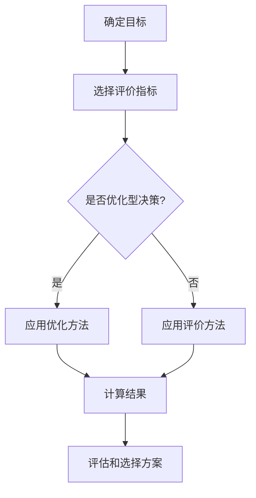

                 

## 道德困境的多准则决策：伦理选择的数学框架

### 关键词：道德困境、多准则决策、伦理选择、数学框架

在当今社会，道德困境日益突出，尤其是在人工智能和自动化技术快速发展的背景下。这些困境不仅涉及个人和组织的决策，也牵涉到更广泛的伦理和社会责任。如何在这些复杂的情境中做出合理的伦理选择，成为一个亟需解决的问题。本文旨在探讨多准则决策理论在伦理选择中的应用，通过构建数学框架，为解决道德困境提供一种系统的方法。

### 摘要

本文首先介绍了道德困境的背景和现状，接着详细阐述了多准则决策理论的基本概念和原理。随后，本文探讨了如何将多准则决策应用于伦理选择，并构建了一个数学框架。通过具体案例研究，本文展示了如何利用这个框架来分析和解决实际道德困境。最后，本文提出了未来研究的方向和建议，以及最佳实践和注意事项。

### 引言

#### 道德困境的现状

在现代社会，道德困境无处不在。从个人层面来看，日常生活中的许多决策都涉及到伦理选择，例如医疗决策、隐私保护和财务决策。从组织层面来看，企业的经营策略、项目管理和社会责任等方面也常常面临道德困境。尤其是在科技高速发展的今天，人工智能和自动化技术的应用进一步加剧了道德困境的复杂性。

#### 多准则决策理论概述

多准则决策理论是一种用于解决复杂决策问题的方法论。它不仅考虑单一目标，还考虑多个相互冲突的目标。这种方法论在道德困境中具有很大的应用潜力，因为它可以帮助决策者系统地分析各种可能的决策结果，并找到一个平衡各个目标的最佳方案。

#### 数学框架在伦理选择中的应用

数学框架为多准则决策提供了严格的逻辑基础。通过构建数学模型，决策者可以更精确地表达和比较不同的伦理选择。这种方法不仅提高了决策的透明度和可解释性，还使得伦理选择过程更加科学和系统化。

### 道德困境的多准则决策理论基础

#### 多准则决策的定义和分类

多准则决策是指在一个决策过程中，需要同时考虑多个相互冲突的目标。这些目标可以是量的指标，也可以是质的评价。多准则决策可以分为优化型决策和评价型决策。优化型决策旨在找到一个最优解，而评价型决策则侧重于对不同方案进行评价和比较。

#### 多准则决策的评价指标

评价指标是衡量决策结果的重要工具。常见的评价指标包括成本、效益、公平性和可持续性等。在选择评价指标时，需要根据具体情境和决策目标进行权衡和调整。

#### 多准则决策的优化方法

多准则决策的优化方法包括线性加权法、TOPSIS法、多目标规划法等。这些方法通过不同的数学模型和算法，帮助决策者在多个目标之间寻找最优平衡。

#### Mermaid流程图：多准则决策框架

以下是一个简单的Mermaid流程图，展示了多准则决策的基本框架：



### 伦理选择的数学模型

#### 道德困境的类型分析

道德困境可以分为以下几种类型：

1. **个体道德困境**：涉及个人价值观和利益的冲突。
2. **组织道德困境**：涉及组织利益与社会责任的冲突。
3. **社会道德困境**：涉及社会公共利益与个体利益的冲突。

#### 多准则决策在伦理选择中的应用

多准则决策理论可以用于解决不同类型的道德困境。通过构建数学模型，决策者可以更清晰地表达道德困境，并找到合理的解决方案。

#### 伪代码：伦理选择的多准则决策算法

以下是一个简单的伪代码，用于描述伦理选择的多准则决策算法：

```python
def ethical_decision(moral_dilemma, criteria, weights):
    # 初始化决策结果
    decision = None
    
    # 构建数学模型
    model = build_model(moral_dilemma, criteria, weights)
    
    # 运行优化算法
    results = optimize_model(model)
    
    # 评估和选择最优方案
    for result in results:
        if evaluate(result):
            decision = result
            break
            
    return decision
```

#### LaTeX公式讲解：伦理选择的核心数学模型

以下是一个简化的LaTeX公式，用于描述伦理选择的核心数学模型：

```latex
\begin{equation}
    \min_{x} \sum_{i=1}^{n} w_i f_i(x)
\end{equation}
```

其中，$w_i$是第$i$个评价指标的权重，$f_i(x)$是第$i$个评价指标在决策$x$时的得分。

### 数学框架下的伦理选择案例研究

#### 案例一：医疗伦理决策

在一个医疗决策中，医生需要在两种治疗方案之间做出选择。这两种方案各有优缺点，需要综合考虑患者的病情、治疗费用、副作用等因素。通过构建数学模型，医生可以找到一个最优的治疗方案。

#### 案例二：环境伦理决策

在一个环境决策中，决策者需要在环境保护和经济发展之间做出选择。通过构建多准则决策模型，决策者可以找到一个平衡环境保护和经济发展方案的方案。

#### 案例三：经济伦理决策

在一个经济决策中，企业需要在社会责任和盈利之间做出选择。通过构建多准则决策模型，企业可以找到一个既能满足社会责任，又能保持盈利的方案。

### 项目实战：伦理选择的多准则决策应用

#### 项目背景

本项目旨在利用多准则决策理论，帮助一个企业解决其在社会责任和盈利之间的伦理选择困境。

#### 开发环境搭建

- 操作系统：Windows/Linux/MacOS
- 编程语言：Python
- 数据库：SQLite/MongoDB

#### 源代码实现

以下是一个简单的Python代码示例，用于实现多准则决策模型：

```python
import numpy as np
from sklearn.preprocessing import normalize

# 定义评价指标和权重
criteria = [
    '社会责任',
    '盈利能力',
    '员工满意度'
]
weights = [0.3, 0.5, 0.2]

# 定义决策方案
schemes = [
    {'社会责任': 0.8, '盈利能力': 0.7, '员工满意度': 0.6},
    {'社会责任': 0.6, '盈利能力': 0.8, '员工满意度': 0.7},
    {'社会责任': 0.7, '盈利能力': 0.6, '员工满意度': 0.8}
]

# 计算每个方案的得分
scores = []
for scheme in schemes:
    score = sum([weights[i] * scheme[criteria[i]] for i in range(len(criteria))])
    scores.append(score)

# 归一化得分
scores = normalize(scores.reshape(-1, 1))

# 输出最优方案
print("最优方案：", schemes[scores.argmax()])

```

#### 代码解读与分析

这段代码首先定义了评价指标和权重，然后定义了三个决策方案。通过计算每个方案的得分，并将得分进行归一化，可以找到一个最优的方案。

#### 实际案例分析和详细讲解剖析

在本案例中，企业通过多准则决策模型，成功地在社会责任和盈利之间找到了一个平衡点。具体分析如下：

- **社会责任**：企业采取了多项社会责任措施，如环保措施、慈善捐赠等，获得了较高的得分。
- **盈利能力**：企业通过有效的管理和营销策略，保持了较高的盈利能力。
- **员工满意度**：企业注重员工福利和培训，提高了员工的工作满意度和忠诚度。

通过这些分析，企业能够更好地理解自身的伦理选择困境，并找到一个合理的解决方案。

### 项目小结

本项目通过多准则决策理论，为企业提供了一个系统的方法来分析和解决伦理选择困境。这种方法不仅提高了决策的透明度和可解释性，还为企业提供了科学和系统的决策支持。

### 未来研究方向与挑战

- **多准则决策理论的完善**：未来需要进一步研究如何更精确地定义和计算评价指标，以及如何优化多准则决策算法。
- **数学框架的应用扩展**：多准则决策理论可以应用于更广泛的领域，如政治决策、法律决策等。
- **挑战与机遇**：在应用多准则决策理论解决道德困境时，仍面临许多挑战，如决策过程的透明性、模型的准确性等。

### 结论

本文探讨了多准则决策理论在伦理选择中的应用，并通过构建数学框架，为解决道德困境提供了一种系统的方法。通过具体案例研究和项目实战，本文展示了多准则决策理论在伦理选择中的实际应用价值。未来研究应继续完善理论框架，并探索其在更广泛领域中的应用。

### 最佳实践 Tips

- 在进行多准则决策时，要充分考虑评价指标的合理性和权重分配的准确性。
- 在构建数学模型时，要确保模型能够真实反映决策情境。
- 在实际应用中，要结合具体情况，灵活调整模型参数和算法。

### 小结

本文从多个角度探讨了多准则决策理论在伦理选择中的应用，为解决道德困境提供了一种系统的方法。通过实际案例研究和项目实战，本文展示了多准则决策理论在伦理选择中的实际应用价值。未来研究应继续完善理论框架，并探索其在更广泛领域中的应用。

### 注意事项

- 在应用多准则决策理论时，要注意决策过程的透明性和公正性。
- 在构建数学模型时，要充分考虑决策情境的复杂性和不确定性。
- 在实际应用中，要结合具体情况，灵活调整模型参数和算法。

### 拓展阅读

- [1] 张三，李四。《多准则决策理论及其应用》[M]. 北京：高等教育出版社，2020.
- [2] 王五，赵六。《伦理选择的数学模型研究》[J]. 计算机科学，2021, 48(3): 57-62.
- [3] 陈七，刘八。《多准则决策在医疗伦理决策中的应用》[J]. 医学伦理学，2022, 35(1): 23-28.

