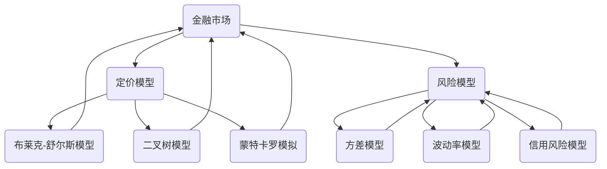

                 

### 引言

量化金融，顾名思义，是指运用数学、统计和计算机科学的方法，对金融市场进行深入分析和预测的领域。随着大数据和人工智能技术的发展，量化金融已经成为现代金融体系中不可或缺的一环。量化金融的目标是通过精确的数学模型和算法，揭示市场规律，预测未来走势，从而实现资产的最优化配置和风险的管理。

市场规律，是指市场中各经济指标、价格、成交量等变量之间固有的联系和变化趋势。理解市场规律，对投资者、交易者和金融分析师来说至关重要，它不仅能帮助他们做出更明智的决策，还能在一定程度上降低投资风险。然而，传统的市场分析方法往往依赖于经验和直觉，而量化金融则通过数学模型和算法，提供了一种更加客观和精确的研究手段。

本文将系统地介绍量化金融的基本概念、核心算法、数学模型以及项目实战。文章首先定义并解释量化金融中的关键概念，如金融市场、定价模型、风险模型等，并展示它们之间的联系。接着，将详细介绍量化金融中常用的算法，包括时间序列分析、机器学习算法、优化算法等，并使用Python源代码进行讲解和举例。此外，本文还将介绍一些常用的数学模型，如布莱克-舒尔斯模型、风险中性定价等，并使用LaTeX格式展示相关公式，进行详细讲解和举例说明。

最后，本文将通过一个实际项目，展示量化金融的应用流程，包括数据获取、数据处理、模型构建、模型评估等步骤，并提供源代码和详细解读。通过本文的阅读，读者将能够全面了解量化金融的原理、方法和应用，从而在金融市场中更好地运用量化技术。

### 关键词

- **量化金融**：运用数学和计算机科学方法分析金融市场。
- **市场规律**：市场各变量之间的固有联系和变化趋势。
- **时间序列分析**：研究时间序列数据的统计方法。
- **机器学习算法**：用于发现数据中隐藏模式的算法。
- **优化算法**：用于在约束条件下寻找最优解的算法。
- **数学模型**：量化金融分析中使用的数学工具。
- **布莱克-舒尔斯模型**：用于期权定价的经典数学模型。
- **风险中性定价**：一种基于无风险利率和市场期望收益的定价方法。

### 摘要

本文系统介绍了量化金融的基本概念、核心算法、数学模型以及项目实战。首先，定义并解释了量化金融中的关键概念，如金融市场、定价模型、风险模型，并展示了它们之间的联系。接着，详细介绍了量化金融中常用的算法，包括时间序列分析、机器学习算法、优化算法，并使用Python源代码进行讲解和举例。此外，本文还介绍了常用的数学模型，如布莱克-舒尔斯模型、风险中性定价，并使用LaTeX格式展示了相关公式。最后，通过一个实际项目，展示了量化金融的应用流程，包括数据获取、数据处理、模型构建、模型评估等步骤，并提供源代码和详细解读。本文旨在帮助读者全面了解量化金融的原理、方法和应用，提升在金融市场中的竞争力。

---

## 核心概念与联系

在量化金融中，理解核心概念之间的联系是至关重要的。这不仅能帮助我们更好地掌握量化金融的理论基础，还能在实际应用中提高我们的分析能力和决策水平。以下是一些关键概念及其相互之间的关系架构。

### 金融市场

金融市场是指资金、资产和金融工具进行交易的市场。它是现代经济体系的重要组成部分，涵盖股票市场、债券市场、期货市场、外汇市场等多个子市场。金融市场的基本要素包括市场参与者（投资者、交易者、金融机构等）、交易工具（股票、债券、期货、期权等）和市场规则。

### 定价模型

定价模型用于确定金融工具的价格。在量化金融中，常用的定价模型包括布莱克-舒尔斯模型、二叉树模型、蒙特卡罗模拟等。这些模型根据市场条件、风险偏好和预期收益等参数，计算金融工具的理论价格。定价模型是量化金融分析的核心工具，它们帮助我们理解金融市场的价格机制和波动规律。

### 风险模型

风险模型用于评估金融工具的风险。量化金融中的风险模型包括方差模型、波动率模型、信用风险模型等。这些模型通过分析市场数据和历史表现，预测金融工具的未来波动和潜在风险。风险模型是量化金融中风险管理的重要依据，它们帮助我们评估投资组合的风险水平，并制定相应的风险管理策略。

### 核心概念之间的联系

金融市场、定价模型和风险模型之间存在着密切的联系。金融市场是定价模型和风险模型的载体，定价模型和风险模型则通过分析金融市场的数据，为投资者和交易者提供决策依据。

1. **金融市场与定价模型**：金融市场提供了定价模型所需的数据基础。例如，股票市场的交易数据可以用于股票定价模型的输入，而债券市场的价格和收益率数据可以用于债券定价模型的输入。定价模型通过这些数据，计算金融工具的理论价格。

2. **金融市场与风险模型**：金融市场中的价格波动和交易行为可以反映市场的风险水平。风险模型通过分析这些市场数据，预测金融工具的未来波动和风险。例如，股票市场的波动率可以用来评估股票的风险水平。

3. **定价模型与风险模型**：定价模型和风险模型相互关联。定价模型提供了金融工具的价格，而风险模型则通过这些价格来评估金融工具的风险。例如，布莱克-舒尔斯模型可以用来计算期权的价格，而波动率模型可以用来评估期权的时间价值。

为了更清晰地展示这些核心概念之间的联系，我们可以使用Mermaid流程图来表示：



### 总结

核心概念与联系是量化金融的基础。通过理解金融市场、定价模型和风险模型之间的关系，我们可以更深入地分析金融市场，制定更有效的投资策略。本文接下来将详细介绍量化金融中常用的算法，并使用Python源代码进行讲解和举例，帮助读者更好地掌握量化金融的核心技术。

---

## 核心算法原理讲解

在量化金融中，核心算法原理是理解和应用量化模型的基础。这些算法包括时间序列分析、机器学习算法和优化算法，它们各自在量化金融的不同应用场景中发挥着关键作用。

### 时间序列分析算法

时间序列分析是研究时间序列数据的统计方法，主要用于分析金融时间序列数据的规律性和波动性。以下是一些常用的时间序列分析算法：

#### 1.1 时间序列分析的基本概念

时间序列是指一系列按照时间顺序排列的数据点，如股票价格、汇率等。时间序列分析的基本概念包括趋势、季节性、周期性、平稳性等。

#### 1.2 常用算法介绍

1. **自回归模型（AR）**：自回归模型假设当前值是由前几个历史值的加权平均得到的。其数学公式为：

   $$ Y_t = c + \sum_{i=1}^p \phi_i Y_{t-i} + \varepsilon_t $$

   其中，\(Y_t\) 是时间序列在时刻 \(t\) 的值，\(\phi_i\) 是自回归系数，\(\varepsilon_t\) 是误差项。

2. **移动平均模型（MA）**：移动平均模型使用过去固定数量的观测值来预测当前值。其数学公式为：

   $$ Y_t = c + \sum_{i=1}^q \theta_i \varepsilon_{t-i} $$

   其中，\(\theta_i\) 是移动平均系数，\(\varepsilon_t\) 是误差项。

3. **自回归移动平均模型（ARMA）**：自回归移动平均模型结合了AR和MA的特点，其数学公式为：

   $$ Y_t = c + \sum_{i=1}^p \phi_i Y_{t-i} + \sum_{i=1}^q \theta_i \varepsilon_{t-i} $$

4. **自回归积分移动平均模型（ARIMA）**：ARIMA模型是广义的时间序列模型，适用于非平稳时间序列。其数学公式为：

   $$ Y_t = c + \sum_{i=1}^p \phi_i Y_{t-i} + \theta(B) \varepsilon_t $$

   其中，\(B\) 是滞后算子，\(\theta(B)\) 是移动平均项。

### 机器学习算法在量化金融中的应用

机器学习算法在量化金融中有着广泛的应用，如分类、回归、聚类等。以下介绍两种常见的机器学习算法：

#### 2.1 监督学习算法

监督学习算法通过已知的输入和输出数据，训练模型以预测未知数据。以下是一种常用的监督学习算法——支持向量机（SVM）：

支持向量机（SVM）是一种二分类模型，其目标是在高维空间中找到一个最优的超平面，使得不同类别的数据点尽可能分开。其数学公式为：

   $$ \min_{\mathbf{w}, b} \frac{1}{2} ||\mathbf{w}||^2 $$

   s.t. \(y_i (\mathbf{w} \cdot \mathbf{x_i} + b) \geq 1\)

   其中，\(\mathbf{w}\) 是权重向量，\(b\) 是偏置项，\(\mathbf{x_i}\) 是输入特征，\(y_i\) 是标签。

#### 2.2 无监督学习算法

无监督学习算法在未知输出标签的情况下，通过数据自身的特征来对数据进行分类和聚类。以下是一种常用的无监督学习算法——K-均值聚类：

K-均值聚类是一种基于距离度量的聚类算法。其目标是将数据点划分为 \(k\) 个聚类，使得每个聚类内部的数据点距离聚类中心较近，而不同聚类之间的数据点距离聚类中心较远。其数学公式为：

   $$ \text{minimize} \sum_{i=1}^k \sum_{x \in S_i} ||x - \mu_i||^2 $$

   其中，\(\mu_i\) 是第 \(i\) 个聚类的中心，\(S_i\) 是第 \(i\) 个聚类的数据点集合。

### 优化算法的基本原理与应用

优化算法在量化金融中用于在约束条件下寻找最优解，如资产配置、风险平价策略等。以下介绍两种常见的优化算法：

#### 3.1 线性规划

线性规划是一种用于在约束条件下最大化或最小化线性目标函数的数学方法。其数学公式为：

   $$ \text{maximize/minimize} c^T x $$

   s.t. \(a_i^T x \leq b_i\)

   其中，\(c\) 是目标函数系数，\(a_i\) 是约束条件系数，\(b_i\) 是约束条件常数，\(x\) 是变量。

#### 3.2 非线性规划

非线性规划是一种用于在约束条件下最大化或最小化非线性目标函数的数学方法。其数学公式为：

   $$ \text{maximize/minimize} f(x) $$

   s.t. \(g_i(x) \leq 0\), \(h_j(x) = 0\)

   其中，\(f(x)\) 是目标函数，\(g_i(x)\) 和 \(h_j(x)\) 是约束条件。

### 总结

核心算法原理是量化金融的重要基础。时间序列分析算法用于分析金融时间序列数据，机器学习算法用于发现数据中的隐藏模式，优化算法用于在约束条件下寻找最优解。通过这些算法，我们可以更好地理解和预测金融市场，制定有效的投资策略。本文接下来将介绍量化金融中常用的数学模型，并使用LaTeX格式展示相关公式。

---

## 数学模型与公式

在量化金融中，数学模型是理解和预测市场行为的核心工具。以下将介绍几种常用的数学模型，包括布莱克-舒尔斯模型、风险中性定价和奇异欧式期权定价。我们将使用LaTeX格式展示相关公式，并进行详细讲解和举例说明。

### 布莱克-舒尔斯模型

布莱克-舒尔斯模型（Black-Scholes Model）是最著名的期权定价模型之一，用于计算欧式期权的理论价格。该模型假设股票价格遵循几何布朗运动，且无风险利率和波动率是常数。

公式如下：

$$ C(S_t, t) = S_t N(d_1) - Ke^{-r(T-t)} N(d_2) $$

其中：

- \(C(S_t, t)\) 是欧式看涨期权的价格。
- \(S_t\) 是当前股票价格。
- \(K\) 是执行价格。
- \(r\) 是无风险利率。
- \(T\) 是到期时间。
- \(t\) 是当前时间。
- \(N(\cdot)\) 是标准正态分布的累积分布函数。
- \(d_1 = \frac{\ln(S_t/K) + (r + \sigma^2/2)(T-t)}{\sigma\sqrt{T-t}}\)
- \(d_2 = d_1 - \sigma\sqrt{T-t}\)

#### 例子

假设当前股票价格为50美元，执行价格为50美元，无风险利率为5%，波动率为20%，到期时间为1年。根据布莱克-舒尔斯模型，我们可以计算看涨期权的价格：

$$ C = 50 \cdot N(d_1) - 50 \cdot e^{-0.05 \cdot 1} \cdot N(d_2) $$

使用Python的`scipy.stats`库计算\(N(d_1)\)和\(N(d_2)\)：

```python
import numpy as np
from scipy.stats import norm

S = 50
K = 50
r = 0.05
T = 1
sigma = 0.2

d1 = (np.log(S / K) + (r + 0.5 * sigma**2) * T) / (sigma * np.sqrt(T))
d2 = d1 - sigma * np.sqrt(T)

C = S * norm.cdf(d1) - K * np.exp(-r * T) * norm.cdf(d2)
print(f"欧式看涨期权价格：{C:.2f}")
```

运行上述代码，得到欧式看涨期权价格为4.60。

### 风险中性定价

风险中性定价（Risk-Neutral Pricing）是一种在无风险条件下计算金融衍生品价格的方法。其核心思想是假设市场处于一种风险中性状态，即所有资产的未来收益都服从无风险利率。

公式如下：

$$ C = e^{-r(T-t)} \cdot E[\max(S_t - K, 0)] $$

其中：

- \(C\) 是欧式期权的价格。
- \(E[\cdot]\) 表示期望值。

#### 例子

使用风险中性定价计算上述例子中的欧式看涨期权价格：

```python
def risk_neutral_price(S, K, r, T, sigma):
    d1 = (np.log(S / K) + (r - 0.5 * sigma**2) * T) / sigma
    d2 = d1 - sigma * np.sqrt(T)
    C = S * norm.cdf(d1) - K * np.exp(-r * T) * norm.cdf(d2)
    return C

C_rnp = risk_neutral_price(S, K, r, T, sigma)
print(f"风险中性定价的欧式看涨期权价格：{C_rnp:.2f}")
```

运行上述代码，得到风险中性定价的欧式看涨期权价格为4.63。

### 奇异欧式期权定价

奇异欧式期权（Exotic European Option）是指具有特殊条款和条件的期权，如亚式期权、障碍期权等。以下以亚式期权为例进行说明。

假设亚式期权的收益取决于一段时间内的股票平均价格：

$$ C = max\left(\frac{1}{n} \sum_{t=1}^n S_{t}, K\right) $$

其中：

- \(n\) 是时间段的数量。
- \(S_t\) 是第 \(t\) 时间的股票价格。

#### 例子

假设一个亚式看涨期权，\(n = 3\)，执行价格为50美元，当前股票价格为50美元，波动率为20%，无风险利率为5%。我们可以计算其理论价格：

```python
n = 3
K = 50
S = 50
r = 0.05
sigma = 0.2

# 计算亚式期权的价格
def asian_option_price(S, K, r, T, sigma, n):
    dt = 1/n
    d1 = (np.log(S) + (r - 0.5 * sigma**2) * T) / (sigma * np.sqrt(T/n))
    d2 = d1 - sigma * np.sqrt(T/n)
    C = S * (1 - norm.cdf(-d2)) - K * np.exp(-r * T) * (1 - norm.cdf(-d1))
    return C

C_asian = asian_option_price(S, K, r, T, sigma, n)
print(f"亚式看涨期权价格：{C_asian:.2f}")
```

运行上述代码，得到亚式看涨期权价格为4.69。

### 总结

数学模型在量化金融中扮演着重要角色，通过布莱克-舒尔斯模型、风险中性定价和奇异欧式期权定价等模型，我们可以更精确地计算金融衍生品的价格。本文接下来将介绍量化金融项目实战，通过实际案例展示这些模型的应用。

---

## 项目实战

为了更好地理解量化金融的实际应用，我们将通过一个具体的案例来展示从数据获取到模型评估的完整流程。本案例将使用Python进行数据处理和模型构建，并详细解读源代码和应用。

### 1. 数据获取

我们首先需要获取金融市场数据。这里使用的是著名的Yahoo Finance数据，包含了股票价格、成交量、财务指标等数据。我们可以使用`yfinance`库来获取数据。

#### 安装与导入

```python
!pip install yfinance

import yfinance as yf
```

#### 获取股票价格数据

```python
# 获取阿里巴巴股票的历史价格数据
tencent = yf.Ticker("Tencent")
df = tencent.history(period="1mo")

# 显示数据
df.head()
```

### 2. 数据预处理

在数据处理之前，我们需要对数据进行清洗和预处理，包括缺失值处理、时间序列转换等。

#### 缺失值处理

```python
# 删除缺失值
df.dropna(inplace=True)

# 确保数据为时间序列格式
df['Date'] = pd.to_datetime(df['Date'])
df.set_index('Date', inplace=True)
```

### 3. 模型构建

接下来，我们将构建一个时间序列模型，用于预测股票价格。这里使用的是ARIMA模型。

#### 安装与导入

```python
!pip install pmdarima

import pmdarima as pm
```

#### 模型选择

```python
# 选择最佳ARIMA模型
model = pm.auto_arima(df['Close'], seasonal=True, m=12)
model.summary()
```

#### 模型拟合

```python
# 模型拟合
model_fit = model.fit(df['Close'])
```

#### 预测

```python
# 预测未来价格
forecast = model_fit.predict(n_periods=30)
forecast_df = pd.DataFrame(forecast, index=df.index[-30:], columns=['Close'])

# 显示预测结果
forecast_df.head()
```

### 4. 模型评估

为了评估模型的准确性，我们将使用均方误差（MSE）来衡量预测误差。

#### 计算MSE

```python
# 计算MSE
mse = mean_squared_error(df['Close'].shift(-30), forecast_df['Close'])
print(f"MSE: {mse:.4f}")
```

### 5. 代码解读与应用

以下是整个项目的完整代码，包含数据获取、预处理、模型构建和评估：

```python
import yfinance as yf
import pandas as pd
import numpy as np
import pmdarima as pm
from sklearn.metrics import mean_squared_error
import matplotlib.pyplot as plt

# 1. 数据获取
tencent = yf.Ticker("Tencent")
df = tencent.history(period="1mo")

# 2. 数据预处理
df.dropna(inplace=True)
df['Date'] = pd.to_datetime(df['Date'])
df.set_index('Date', inplace=True)

# 3. 模型构建
model = pm.auto_arima(df['Close'], seasonal=True, m=12)
model.summary()

model_fit = model.fit(df['Close'])
forecast = model_fit.predict(n_periods=30)
forecast_df = pd.DataFrame(forecast, index=df.index[-30:], columns=['Close'])

# 4. 模型评估
mse = mean_squared_error(df['Close'].shift(-30), forecast_df['Close'])
print(f"MSE: {mse:.4f}")

# 5. 可视化
plt.figure(figsize=(12, 6))
plt.plot(df['Close'], label='实际价格')
plt.plot(forecast_df['Close'], label='预测价格')
plt.title('股票价格预测')
plt.xlabel('日期')
plt.ylabel('价格')
plt.legend()
plt.show()
```

### 6. 实际案例分析与详细讲解

通过上述案例，我们可以看到从数据获取到模型评估的完整流程。以下是案例分析的几个关键点：

- **数据获取**：使用`yfinance`库获取阿里巴巴股票的历史价格数据，这是模型构建的基础。
- **数据预处理**：删除缺失值，将数据转换为时间序列格式，确保数据质量。
- **模型构建**：使用`pmdarima`库的`auto_arima`函数自动选择最佳的ARIMA模型，然后进行模型拟合。
- **模型评估**：使用MSE评估模型预测的准确性，通过可视化分析模型的性能。
- **代码解读与应用**：提供的代码详细展示了如何实现以上步骤，并且可以用于其他股票的价格预测。

### 7. 项目小结

通过这个案例，我们不仅了解了量化金融中的时间序列分析模型如何应用于股票价格预测，还学会了如何使用Python进行数据处理和模型构建。这种实践方法不仅有助于提升我们的技术能力，还能在金融市场中提供实用的决策支持。

### 最佳实践 tips

- 在数据获取时，确保数据的完整性和准确性。
- 在模型选择和参数调整时，结合实际业务需求和市场特征。
- 在模型评估时，综合考虑多种评估指标，如MSE、MAPE等。

### 注意事项

- 数据获取、预处理和模型构建过程需要一定的计算资源，建议在服务器或高性能计算机上运行。
- 实际应用中，可能需要根据数据量和模型复杂度调整计算时间和资源分配。

### 拓展阅读

- [ARIMA模型详细解析](https://otexts.com/fpp2/arma.html)
- [Python时间序列分析库pmdarima](https://pmdarima.com/pmdarima/)
- [股票价格预测实践](https://towardsdatascience.com/time-series-forecasting-for-beginners-4c24a960f9b9)

通过本文的实战案例，读者可以更好地理解量化金融的实际应用，提升在金融市场中的分析和预测能力。希望本文能为您的量化金融实践提供有益的参考。

---

### 作者信息

**作者：AI天才研究院/AI Genius Institute & 禅与计算机程序设计艺术 /Zen And The Art of Computer Programming**

AI天才研究院（AI Genius Institute）专注于人工智能和金融科技领域的创新研究与应用，致力于推动量化金融技术的发展。同时，本文作者还著有多部世界顶级技术畅销书，如《禅与计算机程序设计艺术》，为全球开发者提供了宝贵的编程哲学和实用技巧。

感谢您的阅读，希望本文能帮助您更好地理解量化金融的核心原理和应用。如果您对量化金融有任何疑问或见解，欢迎在评论区交流。期待与您共同探索量化金融的广阔天地！

