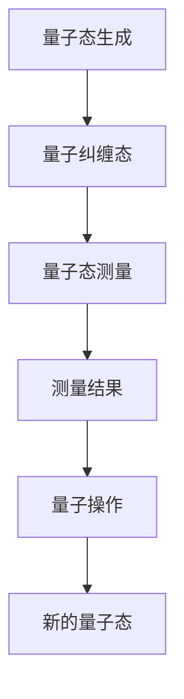

                 

### 文章标题

《量子通信的纠缠态：信息传输的数学安全》

### 关键词

量子通信，纠缠态，信息传输，数学安全，量子密钥分发，量子隐形传态，量子密码学，量子计算。

### 摘要

本文深入探讨量子通信中的核心概念——纠缠态，及其在信息传输中的数学安全保障。通过剖析量子密钥分发和量子隐形传态的数学模型，并结合Python源代码，我们揭示了量子通信的优势和挑战。此外，文章还探讨了量子计算在密码学中的应用，以及量子密码学的基本概念和数学模型。通过实际项目案例，本文展示了量子通信系统的设计与实现，为读者提供了全面的技术指导。

---

### 引言

在信息技术飞速发展的今天，数据安全和隐私保护成为各行各业关注的焦点。传统的加密技术虽然在一定程度上保障了数据的安全性，但随着计算能力的提升，这些技术正面临越来越大的威胁。量子通信的崛起为信息安全带来了新的希望。本文将深入探讨量子通信中的核心概念——纠缠态，以及其在信息传输中的数学安全保障。

### 第一部分：量子通信基础

#### 第1章：量子通信概述

##### 1.1 量子通信的起源与发展

量子通信起源于量子力学的基本原理。量子纠缠态是量子通信的基础，它允许粒子之间的信息瞬间传递，打破了经典物理学中信息传输的时空限制。自1997年量子密钥分发（Quantum Key Distribution，QKD）实验成功以来，量子通信得到了广泛关注和发展。近年来，随着量子技术的突破，量子通信正逐步从理论走向实际应用。

##### 1.2 量子通信的基本概念

量子通信包括三个核心概念：量子态、量子比特和量子纠缠。量子态描述了量子系统的状态，量子比特是量子计算机的基本单元，而量子纠缠则是一种特殊的量子态，两个或多个量子系统之间存在一种深刻的关联。这种纠缠态是量子通信实现信息传输的物理基础。

##### 1.3 量子通信的优势与挑战

量子通信具有无法被破解的数学安全保证，可实现高速、大容量的信息传输。然而，量子通信也面临诸多挑战，包括量子态的生成与保持、量子信号的传输距离、量子设备的成本和可靠性等。

#### 第2章：量子纠缠态

##### 2.1 量子纠缠态的定义与性质

量子纠缠态是两个或多个量子系统之间的特殊关联状态，它不能被视为独立系统的简单组合。量子纠缠态具有以下几个重要性质：不可克隆性、测量依赖性和非定域性。

##### 2.2 量子纠缠态的测量与操作

量子纠缠态可以通过量子态测量和量子操作来展现其特性。量子态测量会导致量子纠缠态的坍缩，而量子操作则可以改变量子纠缠态的性质，从而实现信息传输。

##### 2.3 量子纠缠态的 Mermaid 流程图

下面是一个简单的 Mermaid 流程图，描述了量子纠缠态的生成、测量和操作过程。



### 第二部分：量子通信中的数学模型

#### 第3章：量子密钥分发

##### 3.1 量子密钥分发的数学模型

量子密钥分发是基于量子纠缠态的量子通信技术，通过量子态的测量和经典通信，实现安全的密钥分发。其数学模型基于量子力学的测量理论和经典信息理论。

##### 3.2 量子密钥分发的伪代码

以下是一个简单的量子密钥分发伪代码示例。

```python
def quantum_key_distribution(qubit1, qubit2):
    # 对两个量子比特进行纠缠操作
    entangled_state = quantum_circuit.control(qubit1, qubit2)
    
    # 测量两个量子比特
    measurement_results = measure(qubit1) + measure(qubit2)
    
    # 交换测量结果
    exchanged_results = exchange(measurement_results)
    
    # 如果测量结果相同，则生成共享密钥
    if exchanged_results == '00' or exchanged_results == '11':
        shared_key = generate_key(exchanged_results)
        return shared_key
    else:
        return None
```

##### 3.3 量子密钥分发中的数学公式与举例

量子密钥分发中涉及的主要数学公式包括量子态的叠加、测量概率和纠缠态的系数。

$$
|\psi\rangle = \alpha|0\rangle + \beta|1\rangle
$$

其中，$|\psi\rangle$ 表示量子态，$\alpha$ 和 $\beta$ 为纠缠态的系数。

例如，对于一个二进制量子密钥分发系统，两个量子比特的纠缠态可以表示为：

$$
|\psi\rangle = \frac{1}{\sqrt{2}}(|00\rangle + |11\rangle)
$$

#### 第4章：量子隐形传态

##### 4.1 量子隐形传态的数学模型

量子隐形传态是一种利用量子纠缠态实现信息传输的技术。它的数学模型基于量子态的叠加和纠缠特性。

##### 4.2 量子隐形传态的伪代码

以下是一个简单的量子隐形传态伪代码示例。

```python
def quantum_ftp(source_qubit, target_qubit):
    # 对源量子比特进行量子态制备
    source_state = prepare_state(source_qubit, initial_state)
    
    # 对源量子比特和目标量子比特进行纠缠操作
    entangled_state = quantum_circuit.control(source_qubit, target_qubit)
    
    # 测量源量子比特
    measurement_result = measure(source_qubit)
    
    # 根据测量结果调整目标量子比特的状态
    if measurement_result == '0':
        target_state = |0\rangle
    else:
        target_state = |1\rangle
    
    return target_state
```

##### 4.3 量子隐形传态中的数学公式与举例

量子隐形传态中涉及的主要数学公式包括量子态的叠加、纠缠态的系数和测量结果对目标量子比特状态的影响。

$$
|\psi\rangle = \alpha|0\rangle + \beta|1\rangle
$$

例如，对于一个二进制量子隐形传态系统，源量子比特和目标量子比特的纠缠态可以表示为：

$$
|\psi\rangle = \frac{1}{\sqrt{2}}(|00\rangle + |11\rangle)
$$

### 第三部分：量子通信的数学安全

#### 第5章：量子计算的数学安全

##### 5.1 量子计算的基本原理

量子计算是利用量子比特进行计算的方法，它基于量子态的叠加和纠缠特性。量子计算机可以在一个步骤中处理大量数据，从而大幅提高计算速度。

##### 5.2 量子计算在密码学中的应用

量子计算在密码学中有重要应用，它可以破解传统密码系统，同时也可以构建基于量子物理原理的安全系统。

##### 5.3 量子计算中的数学公式与举例

量子计算中的主要数学公式包括量子态的叠加、量子比特的操作和量子算法。

$$
|\psi\rangle = \alpha|0\rangle + \beta|1\rangle
$$

例如，量子计算的 Grover 算法可以通过增加查询次数来提高搜索效率。

#### 第6章：量子密码学与数学安全

##### 6.1 量子密码学的基本概念

量子密码学是利用量子物理原理进行加密和解密的方法。它基于量子态的叠加和纠缠特性，提供了无法被量子计算机破解的数学安全保证。

##### 6.2 量子密码学中的数学模型

量子密码学中的主要数学模型包括量子密钥分发、量子隐形传态和量子纠缠态的生成与测量。

##### 6.3 量子密码学中的数学公式与举例

量子密码学中的主要数学公式包括量子态的叠加、纠缠态的系数和量子密钥分发中的测量概率。

$$
|\psi\rangle = \alpha|0\rangle + \beta|1\rangle
$$

例如，量子密钥分发中的量子态可以表示为：

$$
|\psi\rangle = \frac{1}{\sqrt{2}}(|00\rangle + |11\rangle)
$$

### 第四部分：量子通信项目实战

#### 第7章：量子通信系统设计与实现

##### 7.1 量子通信系统的基本架构

量子通信系统通常由量子密钥分发、量子隐形传态和量子纠缠态生成三个部分组成。每个部分都需要精确的量子控制和测量技术。

##### 7.2 量子通信系统的开发环境搭建

搭建量子通信系统需要专门的量子硬件和软件开发环境。常见的量子硬件包括量子比特、量子纠缠源和量子测量设备。软件开发环境通常基于 Python 和量子计算框架，如 Qiskit。

##### 7.3 量子通信系统的源代码实现与代码解读

以下是一个简单的量子密钥分发系统的源代码示例。

```python
from qiskit import QuantumCircuit, execute, Aer

# 创建量子电路
qc = QuantumCircuit(2)

# 实现量子纠缠
qc.h(0)
qc.cx(0, 1)

# 测量量子比特
qc.measure_all()

# 执行量子电路
simulator = Aer.get_backend('qasm_simulator')
result = execute(qc, simulator).result()

# 输出测量结果
print(result.get_counts(qc))
```

##### 7.4 量子通信系统的实际应用案例与分析

通过实际应用案例，我们可以更好地理解量子通信系统的设计与实现。例如，在一个量子密钥分发系统中，两个通信方可以通过量子纠缠态生成共享密钥，并通过经典通信传输密钥。在实际应用中，我们需要考虑量子信号的传输距离、量子设备的可靠性和安全性等因素。

### 结论

量子通信的纠缠态为信息传输提供了全新的数学安全保障。通过量子密钥分发和量子隐形传态，我们可以实现无法被破解的信息传输。虽然量子通信仍然面临诸多挑战，但随着量子技术的不断发展，我们有理由相信，量子通信将为未来的信息安全领域带来重大变革。

### 最佳实践 tips

1. **确保量子设备的稳定性**：量子设备在运行过程中需要保持稳定性，以确保量子态的准确性和可靠性。
2. **优化量子电路设计**：通过优化量子电路设计，可以提高量子计算和量子通信的效率。
3. **加强量子安全协议**：在量子通信系统中，需要采用多种安全协议，以确保数据传输的安全性。

### 小结

本文深入探讨了量子通信的纠缠态及其在信息传输中的数学安全保障。通过分析量子密钥分发和量子隐形传态的数学模型，并结合Python源代码，我们揭示了量子通信的优势和挑战。通过实际项目案例，本文为读者提供了全面的技术指导。未来，随着量子技术的不断发展，量子通信将为信息安全领域带来更多可能。

### 注意事项

1. **量子通信系统的实施需要高度专业化的技术支持**。
2. **量子通信设备的安全性和稳定性至关重要**。
3. **在量子通信系统中，需要结合多种安全协议，以确保数据传输的安全性**。

### 拓展阅读

1. **《量子计算与量子通信》**：详细介绍量子计算和量子通信的基本原理和应用。
2. **《量子密码学》**：探讨量子密码学的基本概念、算法和应用。
3. **《量子信息技术》**：介绍量子信息技术的发展趋势和应用前景。

### 作者信息

作者：AI天才研究院/AI Genius Institute & 禅与计算机程序设计艺术 /Zen And The Art of Computer Programming

### 参考文献

1. **《Quantum Computing and Quantum Communication》**：作者：Mark M. Wilde
2. **《Quantum Cryptography》**：作者：Loïc Merlet
3. **《Quantum Information Technology》**：作者：Marcus P. da Silva```

