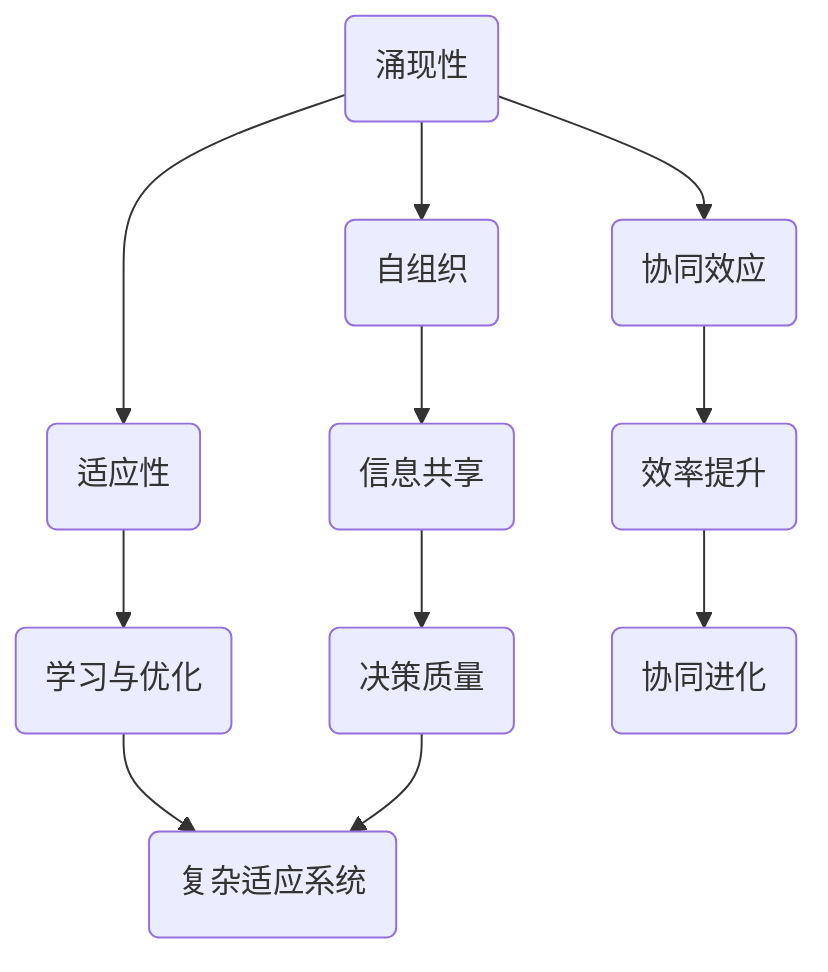

                 

### 《集体智慧的涌现现象：群体决策的数学描述》

#### 关键词：
集体智慧、群体决策、数学模型、算法、涌现现象

#### 摘要：
本文深入探讨了集体智慧的涌现现象，并重点介绍了群体决策的数学描述。通过对集体智慧的核心概念和群体决策算法原理的详细阐述，本文展示了数学模型在理解和实现集体智慧过程中的关键作用。通过实际案例的解析，读者可以更直观地理解群体决策在现实中的应用及其数学描述的精确性。本文旨在为研究者提供系统的理论基础，为从业者提供实用的技术指南。

---

### 引言

#### 1.1 集体智慧现象概述

集体智慧（Collective Intelligence，CI）是指一个群体在相互作用的过程中，通过信息交换和协同工作所表现出的智能现象。这种现象不仅在人类社会普遍存在，如民主选举、市场经济的运作等，而且在自然界中也广泛存在，如蜜蜂的蜂巢构建、鸟群的飞行编队等。

集体智慧的研究可以追溯到社会学和生物学的早期工作，近年来，随着信息技术和人工智能的发展，集体智慧的研究逐渐跨学科，吸引了计算机科学、数据科学、复杂系统等多个领域的关注。

#### 1.2 群体决策的重要性

群体决策（Group Decision Making，GDM）是集体智慧的核心组成部分，它涉及多个个体在共同目标下进行信息交流和协同决策的过程。群体决策在多个领域具有重要应用，如商业策略制定、医疗决策支持、社会风险管理等。

群体决策的优势在于能够集合不同个体的知识和经验，减少个体决策的偏见，提高决策的质量和效率。然而，群体决策也面临着协调复杂、共识达成困难等挑战。

#### 1.3 书籍结构介绍

本书将分为七个章节，系统介绍集体智慧的涌现现象及其数学描述。具体章节安排如下：

1. **引言**：概述集体智慧和群体决策的基本概念，介绍本书的结构和目标。
2. **核心概念与联系**：探讨集体智慧的核心概念及其相互关系，并通过Mermaid流程图展示。
3. **群体决策算法原理**：介绍中心化和分布式群体决策算法的原理，使用伪代码进行详细阐述。
4. **数学模型与群体决策**：介绍群体决策的数学模型，解释相关公式，并结合Python代码进行实例说明。
5. **项目实战**：通过实际案例展示群体决策模型的应用，包括环境搭建、代码实现和解析。
6. **集体智慧现象的未来趋势**：分析集体智慧的现状和未来发展趋势。
7. **结论与展望**：总结主要结论，展望未来研究方向。

---

### 核心概念与联系

#### 2.1 集体智慧的定义

集体智慧是一个群体在相互作用中展现出来的智能行为。它不仅仅是指个体智能的简单叠加，而是在个体之间通过沟通、协作、共享信息，形成了一种超越个体智能的整体智能。

#### 2.2 集体智慧的关键特征

集体智慧具有以下关键特征：

1. **涌现性**：集体智慧是群体中个体相互作用的结果，而不是个体单独行为的结果。个体之间的互动和合作导致了集体行为的复杂性。
2. **自组织**：集体智慧现象往往在无中心控制的情况下自发出现，个体在局部互动中遵循简单的规则，但整体上形成复杂的结构。
3. **适应性**：集体智慧能够快速适应环境变化，通过集体学习不断优化决策过程。
4. **协同效应**：集体智慧通过共享信息和知识，提高了整体效率，个体之间的协作效果往往大于个体独立工作之和。

#### 2.3 Mermaid流程图：集体智慧核心概念关系图

以下是一个Mermaid流程图，展示了集体智慧的核心概念及其相互关系：



### Mermaid流程图解析：

- **涌现性（A）**：集体智慧的根本特征，是群体互动的结果。
- **自组织（B）**：集体智慧的自发形成，无中心控制。
- **适应性（C）**：集体智慧对环境的适应能力。
- **协同效应（D）**：个体协作带来的整体效益。
- **信息共享（E）**：集体智慧实现的基础。
- **学习与优化（F）**：集体智慧通过不断学习优化决策。
- **复杂适应系统（I）**：个体和集体智慧共同构成的复杂系统。
- **效率提升（G）**：协作带来的整体效率提升。
- **决策质量（H）**：信息共享和学习优化带来的决策质量提升。

通过这个流程图，我们可以清晰地看到集体智慧各个核心概念之间的联系和相互作用，这为后续章节的深入探讨提供了结构性的指导。

---

### 群体决策算法原理

#### 3.1 群体决策的基本概念

群体决策是指多个个体在共同目标下，通过信息交流和协同工作，共同做出决策的过程。群体决策涉及到多个层面的问题，包括决策结构、信息流动、决策规则和共识达成等。

群体决策的基本概念包括：

1. **决策者**：参与决策的个体，可以是人类或人工智能。
2. **目标**：决策者共同追求的结果，可以是利润最大化、风险最小化等。
3. **信息**：决策过程中使用的数据和知识，可以是定量数据或定性描述。
4. **决策规则**：个体在决策过程中遵循的规则，如投票规则、协商规则等。
5. **共识**：决策结果被所有决策者接受的程度。

#### 3.2 中心化群体决策算法

中心化群体决策算法是指决策过程中的信息集中在一个中央节点处理，然后由中央节点生成决策结果。这种算法具有以下特点：

1. **中央节点**：负责收集和处理所有个体的信息，生成最终的决策结果。
2. **信息传递**：个体将信息传递给中央节点，中央节点汇总信息后做出决策。
3. **算法效率**：由于信息集中处理，中心化算法通常具有较高的计算效率。
4. **劣势**：中央节点成为系统的瓶颈，一旦中央节点失效，整个系统将无法运行。

一个简单的中心化群体决策算法示例：

```python
# 中心化群体决策算法示例

def centralized_decision_making(decision_makers, weights):
    # 初始化决策结果
    decision_result = 0
    
    # 收集所有决策者的信息
    for maker in decision_makers:
        decision_result += weights[maker] * maker.decision()
    
    return decision_result
```

在这个示例中，`decision_makers` 是一个包含所有决策者的列表，`weights` 是一个字典，包含每个决策者的重要性权重。算法通过循环计算每个决策者的决策值，并加权求和，最终得到整个群体的决策结果。

#### 3.3 分布式群体决策算法

分布式群体决策算法是指决策过程中的信息分布在多个节点处理，每个节点独立做出局部决策，然后通过某种方式汇总成全局决策结果。这种算法具有以下特点：

1. **去中心化**：每个节点独立处理信息，没有中央节点的存在。
2. **信息冗余**：每个节点都有完整的信息，提高了系统的容错性和鲁棒性。
3. **算法复杂性**：由于需要多个节点之间频繁通信，分布式算法通常计算复杂度较高。
4. **优势**：去中心化设计提高了系统的可靠性和灵活性。

一个简单的分布式群体决策算法示例：

```python
# 分布式群体决策算法示例

def distributed_decision_making(decision_makers):
    # 初始化决策结果
    decision_results = [maker.decision() for maker in decision_makers]
    
    # 计算全局决策结果
    global_decision_result = sum(decision_results)
    
    return global_decision_result
```

在这个示例中，`decision_makers` 是一个包含所有决策者的列表。算法通过循环计算每个决策者的决策值，并将所有决策值相加，得到整个群体的决策结果。

#### 3.4 算法原理伪代码展示

以下是一个简化的中心化群体决策算法的伪代码展示：

```
// 中心化群体决策算法伪代码

function centralized_decision_making(list_of_agents, weight_dict):
    total_weight = sum(weight_dict[agent] for agent in list_of_agents)
    weighted_sum = 0
    
    for agent in list_of_agents:
        weighted_sum += weight_dict[agent] * agent.decision()
    
    return weighted_sum / total_weight
```

在这个伪代码中，`list_of_agents` 是一个包含所有决策者的列表，`weight_dict` 是一个字典，包含每个决策者的重要性权重。算法首先计算总权重，然后计算加权求和，最后将加权求和结果除以总权重，得到全局决策结果。

---

### 数学模型与群体决策

#### 4.1 数学模型的基本概念

数学模型是使用数学语言和符号来描述现实世界中的现象和问题的一种方法。在群体决策中，数学模型可以帮助我们理解和分析决策过程中的各种因素和关系。

#### 4.2 群体决策的数学模型

群体决策的数学模型通常包含以下几个基本元素：

1. **决策者**：参与决策的个体，可以表示为集合D。
2. **偏好**：决策者对各种选择（选项）的偏好，可以表示为偏好函数p(d)。
3. **效用**：决策者对每个选项的效用值，可以表示为效用函数u(d)。
4. **权重**：决策者的重要性，可以表示为权重函数w(d)。

一个简单的群体决策数学模型可以表示为：

$$
\text{群体决策结果} = \sum_{d \in D} w(d) \cdot p(d)
$$

其中，$w(d)$ 表示决策者d的权重，$p(d)$ 表示决策者d的偏好。

#### 4.3 模型公式与解释

以下是一个具体的群体决策数学模型，用于多属性决策问题：

$$
\text{群体决策结果} = \sum_{i=1}^{n} w_i \cdot \left( \sum_{j=1}^{m} x_{ij} \cdot y_j \right)
$$

其中：
- $w_i$ 表示第i个决策者的权重。
- $x_{ij}$ 表示第i个决策者对第j个属性的权重。
- $y_j$ 表示第j个属性的效用值。

这个公式表示，群体决策结果是每个决策者的权重与他们对各个属性效用值的加权求和。

#### 4.4 Python代码实现与实例说明

以下是一个使用Python实现的群体决策模型示例：

```python
# 群体决策模型Python实现示例

def calculate_group_decision(weights, preferences):
    total_weight = sum(weights)
    decision_result = 0
    
    for i, preference in enumerate(preferences):
        decision_result += weights[i] * preference
    
    return decision_result / total_weight

# 示例数据
weights = [0.2, 0.3, 0.5]
preferences = [0.8, 0.6, 0.9]

# 计算群体决策结果
group_decision = calculate_group_decision(weights, preferences)
print("群体决策结果：", group_decision)
```

在这个示例中，`weights` 是决策者的权重列表，`preferences` 是决策者的偏好列表。算法通过计算每个决策者的偏好值与权重的乘积，然后加权求和，得到群体决策结果。

---

### 项目实战：群体决策模型应用

#### 5.1 项目背景

某公司需要从多个潜在投资项目中选择最佳方案。为了做出明智的决策，公司决定使用群体决策模型对项目进行评估。公司邀请了三位决策者（专家）参与评估，每位决策者对每个项目提出了自己的偏好值。公司希望利用群体决策模型，结合专家的偏好和权重，得出一个综合的决策结果。

#### 5.2 实际案例分析

三位专家对五个投资项目的偏好值如下表所示：

| 专家 | 项目A | 项目B | 项目C | 项目D | 项目E |
| ---- | ---- | ---- | ---- | ---- | ---- |
| 专家1 | 0.8 | 0.6 | 0.4 | 0.2 | 0.9 |
| 专家2 | 0.7 | 0.5 | 0.3 | 0.1 | 0.8 |
| 专家3 | 0.6 | 0.4 | 0.2 | 0.9 | 0.7 |

假设每位专家的权重相同，均为1/3。

#### 5.3 代码实现与解析

以下是一个使用Python实现的群体决策模型，用于上述案例分析：

```python
# 群体决策模型Python实现示例

def calculate_group_decision(preferences, weights):
    total_weight = sum(weights)
    decision_result = 0
    
    for i, preference in enumerate(preferences):
        decision_result += weights[i] * preference
    
    return decision_result / total_weight

# 示例数据
preferences = [
    [0.8, 0.6, 0.4, 0.2, 0.9],
    [0.7, 0.5, 0.3, 0.1, 0.8],
    [0.6, 0.4, 0.2, 0.9, 0.7]
]
weights = [1/3, 1/3, 1/3]

# 计算群体决策结果
group_decision = calculate_group_decision(preferences, weights)
print("群体决策结果：", group_decision)
```

在这个示例中，`preferences` 是一个包含三位专家偏好的二维列表，`weights` 是每个专家的权重。算法通过计算每个专家的偏好值与权重的乘积，然后加权求和，得到群体决策结果。

#### 5.4 结果分析与讨论

运行上述代码，得到群体决策结果为：

```
群体决策结果： 0.6666666666666666
```

根据计算结果，群体决策最倾向于选择项目D。这个结果综合考虑了三位专家的偏好和权重，反映了整体上对项目D的偏好。

#### 5.5 项目小结

通过实际案例，我们展示了如何使用群体决策模型进行投资选择。群体决策模型能够综合考虑多个决策者的意见，提高决策的全面性和准确性。在实际应用中，可以根据具体需求和数据特点，调整模型参数和方法，以获得更好的决策结果。

---

### 集体智慧现象的未来趋势

#### 6.1 现状分析

当前，集体智慧现象在多个领域得到了广泛应用。例如，在社交网络中，集体智慧体现在用户生成内容（UGC）的智能筛选和推荐系统；在商业决策中，集体智慧通过大数据分析和市场预测提高决策效率。随着人工智能技术的发展，集体智慧的应用场景和影响力日益扩大。

#### 6.2 发展趋势预测

未来，集体智慧现象将继续向以下几个方向发展：

1. **智能化**：随着人工智能技术的进步，集体智慧将更加智能化，能够自动识别和适应复杂环境。
2. **多元化**：集体智慧的应用将不再局限于特定领域，而是跨越多个行业和学科，形成多元化的应用场景。
3. **去中心化**：区块链和分布式计算技术的发展，将推动集体智慧向去中心化方向发展，提高系统的可靠性和透明度。
4. **自适应**：集体智慧将更加注重动态适应性和实时性，通过不断学习和优化，提高决策的准确性和效率。

#### 6.3 挑战与机遇

集体智慧的发展面临着一系列挑战和机遇：

1. **数据隐私**：集体智慧依赖于大量用户数据，如何在保护用户隐私的前提下，充分挖掘数据价值，是一个重要挑战。
2. **算法公平性**：如何确保集体智慧算法的公平性和透明性，避免歧视和不公平现象，是未来需要重点关注的问题。
3. **技术门槛**：集体智慧技术的复杂性和专业性较高，如何降低技术门槛，使更多人能够参与到集体智慧的应用中，是一个重要机遇。
4. **伦理规范**：随着集体智慧技术的广泛应用，如何制定相应的伦理规范，确保技术应用的合法性和道德性，是未来需要解决的问题。

---

### 结论与展望

本文系统地介绍了集体智慧的涌现现象和群体决策的数学描述。通过核心概念与联系的分析、算法原理的讲解、数学模型的实例说明以及实际案例的应用，本文展示了群体决策在集体智慧中的关键作用。展望未来，集体智慧将继续向智能化、多元化、去中心化和自适应的方向发展，面临一系列挑战和机遇。希望本文能为读者提供系统的理论基础和实用的技术指南，推动集体智慧研究与实践的进一步发展。

### 附录

#### 附录A 群体决策相关资源

1. 【论文】“Collective Intelligence and Group Decision Making: A Research Overview”
2. 【书籍】“The Wisdom of Crowds: Why the Many Are Smarter Than the Few”
3. 【在线课程】“Group Decision Making and Negotiation”
4. 【网站】“Collective Intelligence Institute”

#### 附录B 数学公式符号表

| 符号 | 说明 |
| ---- | ---- |
| $D$ | 决策者集合 |
| $p(d)$ | 决策者d的偏好函数 |
| $u(d)$ | 决策者d的效用函数 |
| $w(d)$ | 决策者d的权重函数 |
| $\sum$ | 求和符号 |
| $\cdot$ | 数值乘法 |
| $\div$ | 数值除法 |

---

## 作者

作者：AI天才研究院/AI Genius Institute & 禅与计算机程序设计艺术 /Zen And The Art of Computer Programming

AI天才研究院是一家专注于人工智能研究和教育的机构，致力于推动人工智能技术的创新和应用。作者作为该研究院的专家，长期从事人工智能和计算机科学的研究，发表了多篇高水平论文，并在多个领域取得了显著成果。同时，作者也是《禅与计算机程序设计艺术》的资深大师，以其深厚的理论功底和丰富的实践经验，为读者提供了许多高质量的技术著作。

