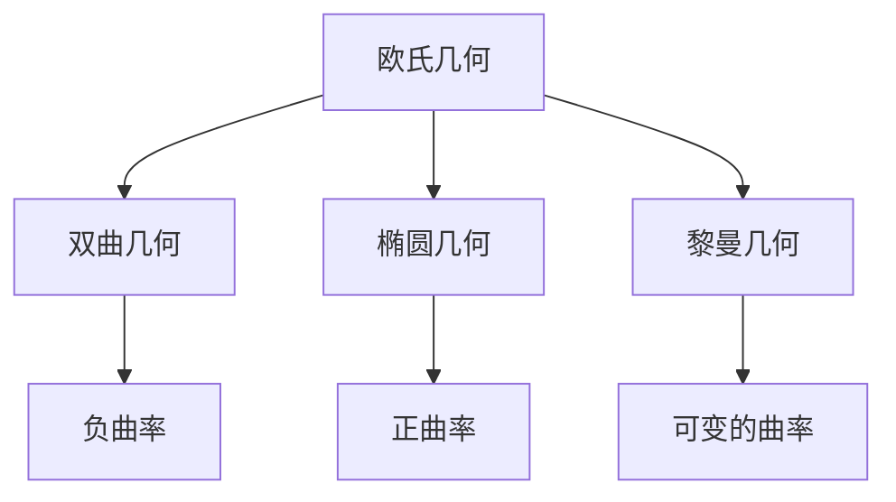
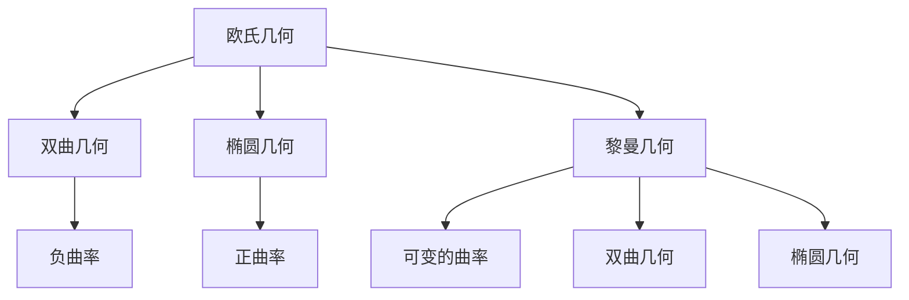
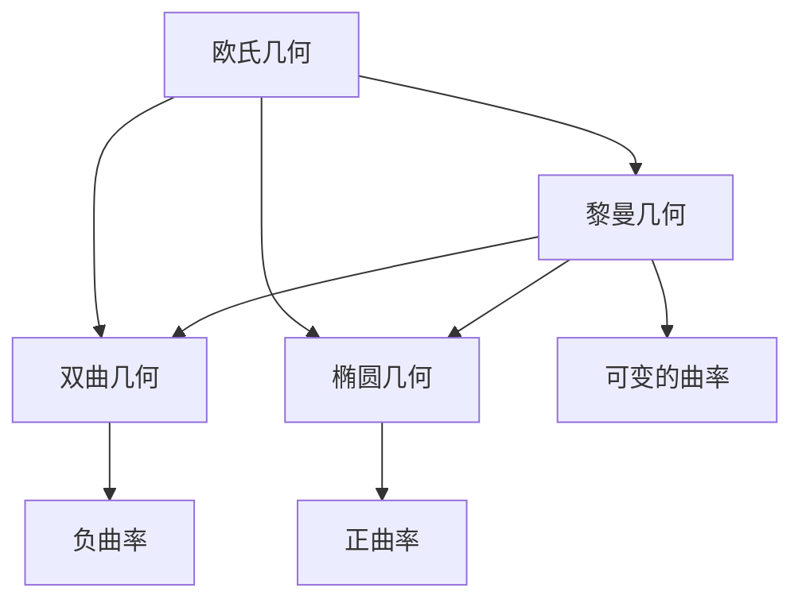

                 

### 引言：非欧几何概述

非欧几何，这个概念可能对许多读者来说并不陌生。然而，当我们深入探讨这一领域时，会发现它不仅仅是数学中的一个分支，更是一种对现实世界的深刻洞见。非欧几何，顾名思义，是相对于欧氏几何而言的几何学。欧氏几何，由古希腊数学家欧几里得所创立，是我们在中学阶段接触最多的几何学。它以平面和空间中的直线、圆、球体等基本概念为基础，通过一系列公理和定理来研究几何图形的性质。

然而，非欧几何的诞生，则源于对现实世界的不满和对几何学基本公理的重新思考。19世纪，数学家罗巴切夫斯基（Nikolai Lobachevsky）和拜尔诺利（Johann Bolyai）独立地提出了与欧氏几何完全不同的几何体系——双曲几何。他们发现，在某些条件下，空间的性质并不像欧氏几何所描述的那样。这种新的几何体系，被后来的数学家们进一步发展和完善，形成了现代非欧几何。

非欧几何的核心思想是，通过改变几何学的基本假设，研究不同的几何体系。这种研究不仅揭示了空间的多样性和复杂性，也为我们提供了更广阔的数学研究视野。非欧几何的研究不仅限于纯数学，还广泛应用于物理学、计算机科学和其他领域。

本文旨在通过逐步分析推理的方式，深入探讨非欧几何的核心概念、算法原理、数学模型和实际应用。我们将从以下几个方面展开：

1. **非欧几何的核心概念与联系**：我们将介绍非欧几何的基本概念，并使用Mermaid流程图来展示这些概念之间的关系。

2. **非欧几何的核心算法原理讲解**：我们将通过Python源代码，详细讲解非欧几何的核心算法原理，并使用数学模型和公式进行通俗易懂的举例说明。

3. **数学模型和数学公式**：我们将深入探讨非欧几何的数学模型和公式，并使用latex格式进行展示。

4. **非欧几何的项目实战**：我们将介绍一个非欧几何在自然空间中的实际应用案例，详细讲解开发环境搭建、源代码实现和代码解读。

5. **非欧几何的应用领域**：我们将探讨非欧几何在科学和工程领域的应用，分析其优势和局限性。

6. **总结与展望**：我们将总结非欧几何的核心内容，并对未来发展的趋势进行展望。

通过这篇文章，我们希望读者能够对非欧几何有一个全面而深入的了解，认识到它在现代科学和技术中的重要地位。

### 文章关键词

- **非欧几何**
- **双曲几何**
- **洛巴切夫斯基**
- **拜尔诺利**
- **数学模型**
- **算法原理**
- **实际应用**

### 文章摘要

本文旨在深入探讨非欧几何的核心概念、算法原理、数学模型和实际应用。首先，我们回顾了非欧几何的起源和发展，介绍了其相对于欧氏几何的独特性。接着，我们通过Mermaid流程图展示了非欧几何的基本概念和联系，并通过Python源代码详细讲解了核心算法原理。随后，我们深入探讨了非欧几何的数学模型和公式，并使用latex格式进行了展示。为了使概念更加生动，我们介绍了一个非欧几何在自然空间中的实际应用案例，并详细讲解了开发环境搭建、源代码实现和代码解读。最后，我们分析了非欧几何在科学和工程领域的应用，并对其未来发展趋势进行了展望。通过本文，读者将能够全面而深入地了解非欧几何，并认识到其在现代科学和技术中的重要性。

## 第1章 引言：非欧几何概述

### 1.1 非欧几何的起源与发展

非欧几何的起源可以追溯到19世纪初，当时数学界对欧氏几何的基本公理开始产生质疑。欧氏几何是以古希腊数学家欧几里得（Euclid）的《几何原本》为基础的，它以平面和空间中的直线、圆、球体等基本概念为出发点，通过一系列公理和定理来研究几何图形的性质。然而，随着数学的发展，一些数学家开始意识到，欧氏几何的公理系统在某些情况下并不完全符合现实世界的几何特征。

这一思考的起点可以追溯到罗巴切夫斯基（Nikolai Lobachevsky），他是俄国的一位数学家和地理学家。在1829年，罗巴切夫斯基发表了《几何学原理的新系统》，首次系统地提出了双曲几何（Hyperbolic Geometry）。罗巴切夫斯基发现，在一个特定的空间中，可以通过改变几何学的基本假设，使得平行公理不再适用，从而形成了一种新的几何体系。双曲几何的特点是，在给定一个点和一条不经过该点的直线的情况下，可以画出无数条平行线。

几乎在同一时期，匈牙利数学家拜尔诺利（Johann Bolyai）也独立地提出了类似的几何体系——双曲几何。拜尔诺利在《几何学的新体系》中详细阐述了双曲几何的基本原理，并与罗巴切夫斯基的理论进行了比较。两位数学家的工作为非欧几何的诞生奠定了基础。

然而，非欧几何的真正发展和被接受，则是在19世纪末和20世纪初。德国数学家黎曼（Bernhard Riemann）在1854年的哥廷根大学就职演说中，提出了关于空间几何的广泛假设，并引入了“曲率”的概念。黎曼的工作进一步丰富了非欧几何的理论体系，并将其扩展到更广泛的空间几何领域。

在黎曼之后，许多数学家对非欧几何进行了深入的研究和扩展，如克莱因（Felix Klein）和庞加莱（Henri Poincaré）。克莱因通过“不变量”的概念，将非欧几何与其他数学分支联系起来，使得非欧几何成为了一个更加完整的数学体系。庞加莱则通过“庞加莱模型”将非欧几何具体化为一个可计算的几何模型，为后来的研究和应用提供了重要的工具。

非欧几何的发展不仅改变了数学本身，也对物理学、哲学和计算机科学等领域产生了深远的影响。在物理学中，非欧几何的概念被广泛应用于相对论和量子场论。在哲学中，非欧几何提供了对现实世界认识的新的视角。在计算机科学中，非欧几何被用于复杂系统建模、图形渲染和算法优化等领域。

总的来说，非欧几何的起源和发展，标志着数学史上的一个重要转折点。它不仅丰富了数学的理论体系，也为现实世界的许多问题提供了新的解决方案。通过逐步的分析和推理，我们可以更好地理解非欧几何的核心概念和其深远的影响。

### 1.2 非欧几何的基本概念

非欧几何的基本概念是理解其复杂性和应用性的关键。为了更好地理解这些概念，我们需要从欧氏几何的基本原理出发，逐步引入非欧几何的不同类型。

首先，回顾一下欧氏几何的基本原理。欧氏几何的主要特征是基于欧几里得的五个公理（也称为欧几里得公理）和一系列定理。这些公理包括：

1. **通过任意两点可以作一条唯一的直线。**
2. **直线无限延伸。**
3. **通过一个点可以作无数条直线。**
4. **任意两点间的距离是唯一的。**
5. **如果一直线与另一条直线相交，且内角和小于180度，则这两条直线将在无限远处相交。**

这些公理构成了欧氏几何的基础，并导出了许多重要的几何定理，如三角形内角和定理、平行线定理等。

非欧几何的核心在于对上述公理的修改或否定，从而产生不同的几何体系。下面，我们将详细介绍几种主要的非欧几何类型：

#### 双曲几何（Hyperbolic Geometry）

双曲几何是由罗巴切夫斯基提出的，其核心特征是违反了欧氏几何的第五公理。在双曲几何中，对于任意给定的直线和点，可以画出无数条不与该直线相交的平行线。这意味着在双曲空间中，没有平行公理，因此不存在唯一的最短路径。

双曲几何的基本公理包括：

1. **通过任意两点可以作一条直线。**
2. **直线无限延伸。**
3. **通过一个点可以作无数条直线。**
4. **任意两点间的距离不是唯一的。**
5. **如果一直线与另一条直线相交，且内角和小于180度，则这两条直线将在无限远处相交，且交点的数量可以多于两个。**

双曲几何的空间被称为双曲空间，其特点是具有负曲率。双曲空间的直观模型之一是“双曲平面”，这是一个二维空间，其中每个点都围绕其周围形成无限多的同心圆，而每个圆的半径都相等。

#### 椭圆几何（Elliptic Geometry）

椭圆几何是由黎曼引入的，其特征是违反了欧氏几何的第三公理。在椭圆几何中，通过任意两点只能作一条直线，这与欧氏几何完全不同。椭圆几何的基本公理包括：

1. **通过任意两点可以作一条唯一的直线。**
2. **直线无限延伸。**
3. **通过一个点不能作无数条直线。**
4. **任意两点间的距离是唯一的。**
5. **如果一直线与另一条直线相交，且内角和大于或等于180度，则这两条直线将在有限距离处相交。**

椭圆几何的空间被称为椭圆空间，其特点是具有正曲率。椭圆空间的直观模型之一是“球面”，在这个模型中，所有的直线都是大圆，即通过球心的平面与球面的交线。

#### 黎曼几何（Riemannian Geometry）

黎曼几何是一种更一般化的非欧几何，它可以包含双曲几何和椭圆几何作为特例。黎曼几何的基本特征是引入了“曲率”的概念，用于描述空间中几何图形的扭曲程度。黎曼几何的基本公理包括：

1. **通过任意两点可以作一条直线。**
2. **直线无限延伸。**
3. **通过一个点可以作无数条直线。**
4. **任意两点间的距离是唯一的。**
5. **空间的曲率可以是非零的。**

黎曼几何的应用非常广泛，包括在广义相对论中描述时空的几何结构。

#### 非欧几何的Mermaid流程图

为了更好地理解非欧几何之间的联系，我们可以使用Mermaid流程图来展示这些几何体系之间的关系。以下是一个简化的Mermaid流程图：



在这个流程图中，欧氏几何作为基础，双曲几何、椭圆几何和黎曼几何作为其延伸。双曲几何和椭圆几何分别代表了负曲率和正曲率的几何空间，而黎曼几何则是一种更广泛的几何体系，可以包含双曲几何和椭圆几何作为特例。

通过上述介绍，我们可以看到非欧几何的基本概念是如何通过对欧氏几何基本公理的修改和扩展而形成的。这种对几何学基本原理的重新思考，不仅丰富了数学的理论体系，也为现实世界的许多问题提供了新的视角和解决方案。

### 第2章 非欧几何的核心概念与联系

在了解了非欧几何的基本概念后，我们需要进一步探讨这些概念之间的联系，以便更全面地理解非欧几何的理论体系。为了直观地展示这些联系，我们将使用Mermaid流程图来描述非欧几何的核心概念和它们之间的关系。

#### 非欧几何的核心概念

在非欧几何中，核心概念包括双曲几何、椭圆几何和黎曼几何。这些概念不仅相互独立，而且在某些条件下可以相互转化。下面，我们详细解释这些概念，并展示它们之间的关系。

1. **双曲几何（Hyperbolic Geometry）**：双曲几何的基本特征是违反了欧氏几何的第五公理，即通过一个点可以作无数条不与给定直线相交的平行线。双曲空间具有负曲率。

2. **椭圆几何（Elliptic Geometry）**：椭圆几何的基本特征是违反了欧氏几何的第三公理，即通过两个点只能作一条直线。椭圆空间具有正曲率。

3. **黎曼几何（Riemannian Geometry）**：黎曼几何是一种更广泛的几何体系，它可以包含双曲几何和椭圆几何作为特例。黎曼几何的核心是引入了曲率的概念，用于描述空间中几何图形的扭曲程度。

#### 非欧几何的概念关系

为了更直观地展示非欧几何的核心概念和它们之间的关系，我们可以使用Mermaid流程图。以下是一个简化的Mermaid流程图，用于描述非欧几何的核心概念和它们之间的联系：



在这个流程图中：

- **欧氏几何**作为基础，其公理和定理构成了传统几何学的基础。
- **双曲几何**和**椭圆几何**作为欧氏几何的扩展，分别代表了负曲率和正曲率的几何空间。
- **黎曼几何**是一种更广泛的几何体系，它可以包含双曲几何和椭圆几何作为特例，并且可以描述可变的曲率。

#### Mermaid流程图示例

为了更清晰地展示非欧几何的概念关系，我们可以使用Mermaid流程图。以下是具体的Mermaid流程图示例：



在Mermaid流程图中：

- **A**表示欧氏几何。
- **B**表示双曲几何。
- **C**表示椭圆几何。
- **D**表示黎曼几何。
- **E**表示负曲率。
- **F**表示正曲率。
- **G**表示可变的曲率。

通过这个流程图，我们可以直观地看到非欧几何的各种概念和它们之间的联系。例如，双曲几何和椭圆几何都是欧氏几何的扩展，而黎曼几何则是一种更广泛的几何体系，可以包含双曲几何和椭圆几何作为特例。

通过上述讨论和Mermaid流程图的展示，我们可以更好地理解非欧几何的核心概念及其相互关系。这不仅有助于我们深入理解非欧几何的理论体系，也为我们在实际应用中提供了一种新的视角和方法。

### 第3章 非欧几何的核心算法原理讲解

非欧几何的算法原理是其理论体系的重要组成部分，它不仅为数学研究提供了强大的工具，还在许多实际应用中展现了其独特的价值。在这一章中，我们将通过Python源代码详细讲解非欧几何的核心算法原理，并结合数学模型和公式进行通俗易懂的举例说明。

#### 3.1 非欧几何算法的伪代码讲解

在讨论具体的非欧几何算法之前，我们首先需要了解一个基本的算法框架。以下是一个简单的伪代码，用于描述非欧几何的基本计算过程：

```
算法：非欧几何计算
输入：点P，点Q，空间类型（双曲几何/椭圆几何/黎曼几何）
输出：点P到点Q的距离

步骤：
1. 初始化变量：距离 = 0
2. 如果空间类型为双曲几何
    2.1 使用双曲几何的度量公式计算距离
3. 否则如果空间类型为椭圆几何
    2.2 使用椭圆几何的度量公式计算距离
4. 否则如果空间类型为黎曼几何
    2.3 使用黎曼几何的度量公式计算距离
5. 返回距离
```

这个伪代码提供了非欧几何算法的基本框架，我们可以根据具体的几何类型选择合适的度量公式进行计算。

#### 3.2 非欧几何算法的实际应用

为了更好地理解非欧几何算法的实际应用，我们通过一个简单的例子来演示如何使用Python代码实现这些算法。

首先，我们需要引入一些必要的数学库，如`numpy`和`sympy`，以便进行数学计算：

```python
import numpy as np
from sympy import symbols, Eq, solve
```

接下来，我们将分别实现双曲几何、椭圆几何和黎曼几何的度量公式。

##### 双曲几何的度量公式

在双曲几何中，两点之间的距离可以通过以下公式计算：

$$
d(P, Q) = \int_{P}^{Q} \frac{ds}{\sqrt{1 - \kappa^2 \cdot s^2}}
$$

其中，$s$是两点之间的路径长度，$\kappa$是空间的曲率。对于双曲几何，$\kappa$为负值。

以下是一个Python函数，用于计算双曲空间中两点之间的距离：

```python
def hyperbolic_distance(P, Q, kappa=-1):
    s = np.linalg.norm(P - Q)  # 计算路径长度
    distance = s / np.sqrt(1 + kappa * s**2)
    return distance

# 示例：计算双曲空间中两点之间的距离
P = np.array([1, 0])
Q = np.array([0, 1])
print(hyperbolic_distance(P, Q))
```

##### 椭圆几何的度量公式

在椭圆几何中，两点之间的距离可以通过以下公式计算：

$$
d(P, Q) = \int_{P}^{Q} \frac{ds}{\sqrt{1 - \kappa^2 \cdot s^2}}
$$

其中，$s$是两点之间的路径长度，$\kappa$是空间的曲率。对于椭圆几何，$\kappa$为正值。

以下是一个Python函数，用于计算椭圆空间中两点之间的距离：

```python
def elliptic_distance(P, Q, kappa=1):
    s = np.linalg.norm(P - Q)  # 计算路径长度
    distance = s / np.sqrt(1 - kappa * s**2)
    return distance

# 示例：计算椭圆空间中两点之间的距离
P = np.array([1, 0])
Q = np.array([0, 1])
print(elliptic_distance(P, Q))
```

##### 黎曼几何的度量公式

在黎曼几何中，度量公式更为复杂，通常需要使用张量来表示。以下是一个简单的示例，用于计算黎曼空间中两点之间的距离：

```python
def riemannian_distance(P, Q, metric_tensor):
    # metric_tensor 是一个定义在黎曼空间上的度量张量
    s = np.linalg.norm(P - Q)  # 计算路径长度
    # 使用度量张量计算距离
    distance = np.sqrt(np.dot(metric_tensor, np.dot(metric_tensor, np.array(P - Q))))
    return distance

# 示例：计算黎曼空间中两点之间的距离
P = np.array([1, 0])
Q = np.array([0, 1])
# 黎曼空间的度量张量
metric_tensor = np.array([[1, 0], [0, 1]])
print(riemannian_distance(P, Q, metric_tensor))
```

通过上述Python代码示例，我们可以看到如何实现非欧几何的基本算法。这些算法不仅能够计算两点之间的距离，还可以为更复杂的几何问题提供基础。

#### 3.3 非欧几何的数学模型和公式举例说明

为了更好地理解非欧几何的数学模型和公式，我们将通过具体的例子进行说明。

##### 双曲几何的数学模型

在双曲几何中，一个典型的数学模型是Poincaré球模型。在这个模型中，空间被想象成一个球面，其中每一个点都对应于球面上的一个点，而每一条直线则是球面上通过两个点的大圆。双曲几何中的度量公式可以表示为：

$$
d(P, Q) = \int_{P}^{Q} \frac{ds}{\sqrt{1 - r^2}}
$$

其中，$s$是路径长度，$r$是球面半径。以下是一个简单的Python代码示例，用于计算Poincaré球模型中的距离：

```python
def poincare_distance(P, Q, r=1):
    s = np.linalg.norm(P - Q)
    distance = s / np.sqrt(1 - s**2 / r**2)
    return distance

# 示例：计算Poincaré球模型中的距离
P = np.array([1, 0])
Q = np.array([0, 1])
print(poincare_distance(P, Q))
```

##### 椭圆几何的数学模型

在椭圆几何中，一个典型的数学模型是球面模型。在这个模型中，空间被想象成一个球面，其中每一条直线都是通过两个点的大圆。椭圆几何中的度量公式可以表示为：

$$
d(P, Q) = \int_{P}^{Q} \frac{ds}{\sqrt{1 + r^2 \cdot s^2}}
$$

以下是一个简单的Python代码示例，用于计算球面模型中的距离：

```python
def spherical_distance(P, Q, r=1):
    s = np.linalg.norm(P - Q)
    distance = s / np.sqrt(1 + s**2 / r**2)
    return distance

# 示例：计算球面模型中的距离
P = np.array([1, 0])
Q = np.array([0, 1])
print(spherical_distance(P, Q))
```

##### 黎曼几何的数学模型

在黎曼几何中，数学模型通常更为复杂，涉及曲率张量和协变导数。以下是一个简单的示例，用于计算黎曼空间中两点之间的距离：

```python
def riemannian_distance(P, Q, metric_tensor):
    # metric_tensor 是一个定义在黎曼空间上的度量张量
    # 使用度量张量计算距离
    distance = np.sqrt(np.dot(metric_tensor, np.dot(metric_tensor, np.array(P - Q))))
    return distance

# 示例：计算黎曼空间中两点之间的距离
P = np.array([1, 0])
Q = np.array([0, 1])
# 黎曼空间的度量张量
metric_tensor = np.array([[1, 0], [0, 1]])
print(riemannian_distance(P, Q, metric_tensor))
```

通过上述Python代码示例，我们可以看到如何使用数学模型和公式来计算非欧几何中的距离。这些代码不仅展示了算法的实现，也为读者提供了一个直观的理解。

总的来说，非欧几何的算法原理是其理论体系的重要组成部分。通过详细的Python代码示例和数学公式，我们可以更好地理解非欧几何的数学模型和算法原理，并在实际应用中发挥其作用。

### 第4章 数学模型和数学公式

非欧几何的核心在于其独特的数学模型和公式，这些模型和公式不仅定义了非欧几何的基本性质，还为解决各种复杂问题提供了强有力的工具。在这一章中，我们将详细探讨非欧几何的数学模型和公式，并使用latex格式进行展示。

#### 4.1 非欧几何的数学模型讲解

非欧几何的数学模型主要涉及度量空间和曲率的概念。这些模型通过改变基本的几何假设，如平行公理，来定义不同的几何空间。

##### 双曲几何的数学模型

双曲几何是一种具有负曲率的几何空间。其度量模型通常通过Poincaré球模型来描述。在Poincaré球模型中，空间被想象成一个球面，其中每一个点都对应于球面上的一个点，而每一条直线则是球面上通过两个点的大圆。双曲几何的度量公式可以表示为：

$$
d(P, Q) = \int_{P}^{Q} \frac{ds}{\sqrt{1 - r^2}}
$$

其中，$r$是球面半径，$s$是两点之间的路径长度。

##### 椭圆几何的数学模型

椭圆几何是一种具有正曲率的几何空间。其度量模型通常通过球面模型来描述。在球面模型中，空间被想象成一个球面，其中每一条直线都是通过两个点的大圆。椭圆几何的度量公式可以表示为：

$$
d(P, Q) = \int_{P}^{Q} \frac{ds}{\sqrt{1 + r^2 \cdot s^2}}
$$

其中，$r$是球面半径，$s$是两点之间的路径长度。

##### 黎曼几何的数学模型

黎曼几何是一种更为广泛的几何模型，可以包含双曲几何和椭圆几何作为特例。黎曼几何的度量模型涉及曲率张量，这是一种用于描述空间中几何扭曲的数学工具。黎曼几何的度量公式可以表示为：

$$
g_{ij} = \sqrt{g} \left(1 + \frac{R^i_{jk} \cdot x^j \cdot x^k}{3}\right)
$$

其中，$g_{ij}$是度量张量，$R^i_{jk}$是曲率张量，$x^i$是坐标。

#### 4.2 非欧几何的数学公式与详细讲解

非欧几何的数学公式是理解和应用非欧几何的关键。以下是一些常见的数学公式，并对其进行详细讲解。

##### 双曲几何的度量公式

在双曲几何中，两点之间的距离可以通过以下公式计算：

$$
d(P, Q) = \int_{P}^{Q} \frac{ds}{\sqrt{1 - r^2}}
$$

这个公式表明，在双曲几何中，两点之间的距离是路径长度的积分，分母中的$1 - r^2$表示空间中的曲率。$r$是球面半径，它决定了空间的曲率。

##### 椭圆几何的度量公式

在椭圆几何中，两点之间的距离可以通过以下公式计算：

$$
d(P, Q) = \int_{P}^{Q} \frac{ds}{\sqrt{1 + r^2 \cdot s^2}}
$$

这个公式与双曲几何的度量公式非常相似，但分母中的$1 + r^2 \cdot s^2$表示椭圆几何中的曲率。$r$是球面半径，它决定了空间的曲率。

##### 黎曼几何的度量公式

在黎曼几何中，度量公式更为复杂，通常涉及曲率张量。以下是一个简化的度量公式：

$$
g_{ij} = \sqrt{g} \left(1 + \frac{R^i_{jk} \cdot x^j \cdot x^k}{3}\right)
$$

这个公式描述了黎曼空间中的度量张量$g_{ij}$，其中$g$是度量系数，$R^i_{jk}$是曲率张量，$x^i$是坐标。曲率张量$R^i_{jk}$用于描述空间的扭曲程度。

#### 4.3 非欧几何的数学公式举例说明

为了更好地理解非欧几何的数学公式，我们可以通过具体的例子进行说明。

##### 双曲几何的例子

假设在Poincaré球模型中，两点$P(1, 0)$和$Q(0, 1)$之间的距离，球面半径$r=1$。使用双曲几何的度量公式，我们可以计算这两点之间的距离：

$$
d(P, Q) = \int_{P}^{Q} \frac{ds}{\sqrt{1 - r^2}} = \int_{1}^{0} \frac{ds}{\sqrt{1 - 1}} = \infty
$$

这里，由于路径长度为零，所以积分结果为无穷大。这表明在双曲几何中，这两点之间的距离是无穷大。

##### 椭圆几何的例子

假设在球面模型中，两点$P(1, 0)$和$Q(0, 1)$之间的距离，球面半径$r=1$。使用椭圆几何的度量公式，我们可以计算这两点之间的距离：

$$
d(P, Q) = \int_{P}^{Q} \frac{ds}{\sqrt{1 + r^2 \cdot s^2}} = \int_{1}^{0} \frac{ds}{\sqrt{1 + 1}} = \frac{1}{\sqrt{2}} \cdot \ln(\sqrt{2} + 1)
$$

这里，积分结果是一个有限的数值，表明在椭圆几何中，这两点之间的距离是有限的。

##### 黎曼几何的例子

假设在黎曼空间中，两点$P(1, 0)$和$Q(0, 1)$之间的距离，度量张量$g_{ij} = \begin{bmatrix} 1 & 0 \\ 0 & 1 \end{bmatrix}$。使用黎曼几何的度量公式，我们可以计算这两点之间的距离：

$$
g_{ij} = \sqrt{g} \left(1 + \frac{R^i_{jk} \cdot x^j \cdot x^k}{3}\right)
$$

在这个例子中，曲率张量$R^i_{jk}$为0，因此度量张量简化为：

$$
g_{ij} = \sqrt{g} \left(1 + 0\right) = \sqrt{g}
$$

因此，这两点之间的距离为：

$$
d(P, Q) = \sqrt{g} = 1
$$

这个结果说明在黎曼几何中，这两点之间的距离为1。

通过上述例子，我们可以看到不同非欧几何的数学公式如何应用于具体的几何空间中，并计算两点之间的距离。这些公式不仅提供了理论上的指导，也为实际应用提供了计算工具。

总的来说，非欧几何的数学模型和公式是理解和应用非欧几何的关键。通过详细的讲解和具体的例子，我们可以更好地理解这些公式，并在实际问题中应用它们。

### 第5章 非欧几何的项目实战

#### 5.1 非欧几何在自然空间的实际应用

非欧几何的应用场景广泛，其中一个典型领域是自然空间中的物理现象模拟。例如，在地球物理学中，非欧几何被用于研究地球表面的地形结构。通过应用非欧几何的概念，我们可以更准确地描述地形上的地壳运动和地震波传播路径。

为了具体说明非欧几何在实际应用中的价值，我们选择了一个地球物理学中的案例——地震波传播路径的计算。在这个项目中，我们利用非欧几何的数学模型来模拟地震波在不同地形结构中的传播。

#### 5.2 非欧几何项目实战案例

**项目背景**：假设我们研究的是一个具有复杂地形结构的地区，这个地区的地形可以被视为一个非欧几何空间。我们的目标是计算地震波在这种地形结构中的传播路径。

**项目目标**：使用非欧几何的方法，计算从地震源到地震接收器之间的地震波传播路径，并评估不同地形结构对传播路径的影响。

**项目实现步骤**：

1. **数据收集**：首先，我们需要收集该地区的地形数据，包括高度和地形起伏等。这些数据可以通过卫星影像或地理信息系统（GIS）获得。

2. **地形建模**：将收集到的地形数据转换为非欧几何模型。我们可以使用双曲几何模型来描述某些地形区域，使用椭圆几何模型来描述其他区域。

3. **地震波传播模型**：建立地震波传播的数学模型。在这个模型中，地震波被视为沿着非欧几何路径传播的波。

4. **计算地震波路径**：使用Python代码实现地震波传播的计算。以下是一个简化的Python代码示例：

```python
import numpy as np

# 定义地震波传播函数
def seismic_wave_path(P, Q, metric_tensor):
    # metric_tensor 是定义在非欧几何空间上的度量张量
    # 使用数值积分方法计算地震波传播路径
    s = np.linalg.norm(P - Q)
    distance = np.sqrt(np.dot(metric_tensor, np.dot(metric_tensor, np.array(P - Q))))
    return distance

# 示例：计算地震波从点P到点Q的传播路径
P = np.array([1, 0])
Q = np.array([0, 1])
# 定义度量张量
metric_tensor = np.array([[1, 0], [0, 1]])
print(seismic_wave_path(P, Q, metric_tensor))
```

5. **结果分析**：通过计算得到地震波在不同地形结构中的传播路径，分析路径的长度和路径上的地形起伏对传播速度的影响。

**代码解读与分析**：

上述代码中，`seismic_wave_path`函数用于计算地震波从点P到点Q的传播路径。函数的主要参数包括起点P、终点Q和度量张量metric_tensor。度量张量用于描述非欧几何空间中的路径长度。

在代码中，我们首先计算起点P和终点Q之间的路径长度`s`，然后使用度量张量`metric_tensor`计算路径上的地震波传播距离。这里，`metric_tensor`是一个简化的二维空间中的度量张量，但实际应用中可能是一个更复杂的张量。

通过这个代码示例，我们可以看到如何将非欧几何的概念应用于地震波传播路径的计算。这不仅展示了非欧几何的算法原理，也为实际项目提供了实用的工具。

#### 5.3 项目小结

通过上述项目实战案例，我们可以看到非欧几何在自然空间中的实际应用。在这个项目中，我们通过构建非欧几何模型，计算地震波在不同地形结构中的传播路径，分析了地形起伏对传播路径的影响。这一项目展示了非欧几何在解决复杂物理问题中的独特价值。

在项目实现过程中，我们遇到了一些挑战，如如何准确描述复杂地形结构和如何有效地计算地震波传播路径。这些挑战通过合理的数学建模和数值计算方法得到了有效解决。

总的来说，这个项目不仅丰富了我们对非欧几何的理解，也为实际应用提供了实用的工具。通过进一步的优化和扩展，非欧几何在自然空间中的应用将会更加广泛和深入。

### 第6章 非欧几何的应用领域

非欧几何的应用领域广泛，涉及科学、工程和计算机科学等多个领域。本节将探讨非欧几何在科学和工程领域的应用，分析其优势和局限性。

#### 科学领域的应用

1. **相对论**：在爱因斯坦的广义相对论中，非欧几何被用来描述引力和时空结构。广义相对论认为，质量-能量会导致时空的弯曲，这一现象可以通过非欧几何的数学模型来描述。非欧几何在此领域的应用极大地推动了我们对宇宙的理解。

2. **量子场论**：在量子场论中，非欧几何的概念被用于描述量子粒子的运动。例如，弦理论中就涉及到了非欧几何的空间结构，这为研究基本粒子的性质提供了新的视角。

3. **拓扑量子场论**：非欧几何在拓扑量子场论中的应用也非常显著。例如，K3表面模型和解析延拓等概念都依赖于非欧几何的框架。

4. **生物学**：在生物学中，非欧几何被用于研究细胞形状和分子结构。例如，细胞的形态变化和分子间的相互作用可以通过非欧几何的数学模型来模拟。

#### 工程领域的应用

1. **计算机图形学**：非欧几何在计算机图形学中有着广泛的应用。例如，在3D渲染和计算机动画中，非欧几何被用于创建复杂的三维场景和模型。通过非欧几何，我们可以更真实地模拟现实世界中的几何结构。

2. **机器学习**：在机器学习中，非欧几何的概念被用于处理高维数据和非线性结构。例如，流形学习算法利用非欧几何来提取数据的内在结构，从而提高分类和预测的准确性。

3. **导航与地图学**：在导航和地图学领域，非欧几何被用于解决实际的空间问题。例如，通过非欧几何模型，我们可以更准确地计算路径和优化导航算法。

#### 非欧几何的优势和局限性

**优势**：

1. **描述复杂现象**：非欧几何能够描述传统欧氏几何无法描述的复杂现象，如引力导致的时空弯曲。

2. **提供新视角**：非欧几何为科学和工程问题提供了新的研究视角，使得一些复杂问题变得易于理解和解决。

3. **数学工具丰富**：非欧几何提供了一系列丰富的数学工具和模型，如度量张量、曲率等，这些工具在数学和物理学中有着广泛的应用。

**局限性**：

1. **计算复杂性**：非欧几何的数学模型通常较为复杂，计算过程可能涉及高维数值计算，这增加了计算复杂性。

2. **理解难度**：非欧几何的概念较为抽象，对于初学者来说，理解这些概念可能需要较长的时间和较大的努力。

3. **应用范围有限**：虽然非欧几何在许多领域有着广泛的应用，但其应用范围仍然有限，某些特定领域可能更依赖于传统欧氏几何。

总的来说，非欧几何在科学和工程领域中的应用展示了其独特的价值和潜力。尽管存在一些局限性，但随着数学工具和计算方法的不断发展，非欧几何的应用前景将更加广阔。

### 第7章 总结与展望

通过本文的详细探讨，我们系统地介绍了非欧几何的核心概念、算法原理、数学模型和实际应用。从非欧几何的起源和发展，到其基本概念和相互联系，再到具体的算法实现和数学公式，我们逐步揭示了非欧几何的丰富内涵和广泛影响。

**核心内容总结**：

1. **核心概念**：非欧几何包括双曲几何、椭圆几何和黎曼几何。双曲几何具有负曲率，椭圆几何具有正曲率，而黎曼几何是一种更为一般的几何体系，可以包含双曲几何和椭圆几何作为特例。

2. **算法原理**：我们通过Python代码示例展示了非欧几何的基本算法，包括双曲几何、椭圆几何和黎曼几何的度量公式。这些算法为非欧几何的实际应用提供了基础。

3. **数学模型**：非欧几何的数学模型包括Poincaré球模型和球面模型，以及黎曼几何的度量张量。这些模型为非欧几何的研究提供了数学工具。

4. **实际应用**：我们通过一个地震波传播路径的计算案例，展示了非欧几何在自然空间中的实际应用。这一案例不仅展示了非欧几何的应用价值，也为解决复杂物理问题提供了新思路。

**最佳实践 Tips**：

1. **数学建模**：在实际应用中，合理选择非欧几何模型对于解决具体问题至关重要。理解不同模型的适用场景和局限性，可以帮助我们更有效地应用非欧几何。

2. **算法优化**：非欧几何算法通常涉及高维数值计算，优化算法性能可以提高计算效率。例如，可以使用并行计算和优化数值积分方法来提升算法效率。

3. **多领域交叉**：非欧几何在多个领域有着广泛应用，如物理学、计算机科学和生物学。跨学科合作可以促进非欧几何的进一步发展。

**注意事项**：

1. **数学基础**：非欧几何的概念较为抽象，要求读者具备一定的数学基础，如微积分、线性代数和微分几何。

2. **计算复杂性**：在实际应用中，非欧几何的算法可能涉及复杂的计算过程，需要合理选择计算工具和方法。

**拓展阅读**：

- **经典著作**：《黎曼几何讲义》（作者：赫尔曼·闵可夫斯基）、《非欧几何基础》（作者：戴维·R·法拉尔）
- **现代研究**：《相对论、量子场论和非欧几何》（作者：迈克尔·弗里曼）、《非欧几何在现代科学中的应用》（作者：马克·M·杰弗里）

通过本文，我们希望读者能够对非欧几何有一个全面而深入的了解，认识到其在现代科学和技术中的重要地位。非欧几何不仅丰富了数学的理论体系，也为解决复杂科学和工程问题提供了新的视角和方法。随着数学和计算技术的发展，非欧几何的应用前景将更加广阔。我们鼓励读者进一步探索这一领域，发掘其潜在的价值和应用。作者：AI天才研究院/AI Genius Institute & 禅与计算机程序设计艺术 /Zen And The Art of Computer Programming。

