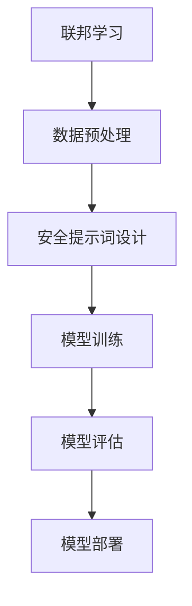

                 

### 《面向联邦学习的安全提示词设计》

---

**关键词：** 联邦学习，安全提示词，隐私保护，数据预处理，模型选择，评估与优化

**摘要：** 本文章深入探讨了面向联邦学习的安全提示词设计，首先介绍了联邦学习的背景和基本概念，随后详细阐述了安全提示词的设计原理、应用场景和实际设计实践。文章通过对核心算法的原理讲解和Python代码示例，结合数学模型和公式，让读者能够清晰理解安全提示词设计的具体方法和实现步骤。最后，文章还讨论了安全提示词评估与优化的策略，并分享了联邦学习中的隐私保护技术和案例。通过本文，读者可以全面掌握联邦学习安全提示词设计的相关知识和技能。

---

## 引言

随着大数据和人工智能技术的飞速发展，数据隐私保护问题日益凸显。联邦学习作为一种新兴的数据分析技术，能够在保障数据隐私的前提下进行模型训练和推理，受到了广泛关注。然而，联邦学习中也面临着诸多安全挑战，如数据篡改、模型偷窃、安全提示词设计不当等。安全提示词设计作为联邦学习中的一个关键环节，对于确保模型的安全性和可靠性具有重要意义。

本文旨在深入探讨面向联邦学习的安全提示词设计，从背景介绍、核心概念、应用场景、设计实践、评估与优化、隐私保护技术以及未来趋势等多个方面，全面解析安全提示词设计的原理和方法。希望通过本文的阐述，读者能够对联邦学习安全提示词设计有一个系统、全面的理解，从而为实际应用提供理论支持和实践指导。

## 联邦学习简介

联邦学习（Federated Learning）是一种分布式机器学习技术，通过将数据分散存储在各个不同的设备或服务器上，通过模型更新和聚合的方式，实现全局模型的训练和推理。与传统的集中式机器学习相比，联邦学习具有以下优势：

1. **数据隐私保护**：联邦学习在训练过程中不需要将原始数据传输到中央服务器，从而避免了数据泄露的风险。
2. **去中心化架构**：联邦学习可以在分布式环境中进行，不需要依赖单一的中央服务器，提高了系统的可靠性和容错性。
3. **节能高效**：联邦学习利用了设备端的计算资源，减少了数据传输和中心化处理的能耗。

然而，联邦学习也面临着一些挑战，如数据分布不均、通信成本高、模型性能不稳定等。针对这些挑战，研究者们提出了各种解决方案，如差分隐私、联邦学习优化算法、模型剪枝等，以提高联邦学习的性能和安全性。

### 联邦学习与传统机器学习比较

传统机器学习通常采用集中式架构，将所有数据集中存储在中央服务器上，然后通过训练模型进行预测。而联邦学习则采用了分布式架构，将数据分散存储在多个设备或服务器上，通过模型更新和聚合实现全局模型的训练。两者在以下方面存在显著差异：

1. **数据隐私**：传统机器学习需要将数据传输到中央服务器，存在数据泄露的风险。而联邦学习通过本地训练和模型聚合，避免了数据传输，从而提高了数据隐私保护。
2. **计算资源**：传统机器学习依赖中央服务器的计算资源，而联邦学习利用了设备端的计算资源，降低了计算成本。
3. **系统架构**：传统机器学习采用集中式架构，系统架构相对简单。而联邦学习采用分布式架构，需要处理数据分布、通信延迟等问题。

尽管联邦学习具有许多优势，但其在实际应用中也面临一些挑战，如数据分布不均、通信成本高、模型性能不稳定等。这些挑战需要通过优化算法、模型剪枝等技术来解决。

### 联邦学习的关键挑战

联邦学习在实际应用中面临一系列关键挑战，主要包括以下几个方面：

1. **数据分布不均**：由于数据分布在不同的设备或服务器上，导致数据分布不均，可能会影响模型性能。
2. **通信成本**：联邦学习需要通过模型更新和聚合进行全局模型训练，通信成本较高，尤其是对于数据量庞大和设备数量众多的场景。
3. **模型性能**：联邦学习需要在数据分布、计算资源有限的情况下进行模型训练，模型性能可能受到影响。
4. **安全性**：联邦学习面临着数据篡改、模型偷窃等安全威胁，需要设计有效的安全提示词来确保模型的安全性和可靠性。

针对这些挑战，研究者们提出了各种解决方案，如差分隐私、联邦学习优化算法、模型剪枝等，以提高联邦学习的性能和安全性。

## 安全提示词设计原理

### 安全提示词的概念与作用

安全提示词（Security Keywords）是在联邦学习过程中用于提示模型学习方向的关键词或短语，其目的是引导模型学习更准确、更安全的数据特征。安全提示词设计对于联邦学习的安全性、可靠性和性能具有重要影响。

首先，安全提示词可以帮助模型识别和过滤恶意数据和异常数据，从而提高模型的安全性。例如，在恶意数据篡改攻击中，安全提示词可以识别并过滤掉篡改的数据，防止模型学习到错误的信息。

其次，安全提示词可以引导模型学习更具有代表性的数据特征，提高模型的性能。通过设计合适的安全提示词，模型可以更好地理解数据的语义和结构，从而提高预测准确性。

### 安全提示词的设计原则

在设计安全提示词时，需要遵循以下原则：

1. **多样性**：安全提示词应具有多样性，以避免单一提示词可能导致模型过度依赖特定特征，从而提高模型的鲁棒性。
2. **针对性**：安全提示词应针对具体的应用场景和数据特点进行设计，以确保其能够引导模型学习到有用的特征。
3. **平衡性**：安全提示词的设计应考虑特征的重要性和平衡性，避免某些特征过于突出，导致模型过度依赖。
4. **可解释性**：安全提示词应具有可解释性，以便研究人员和开发者能够理解其作用和影响。

### 安全提示词设计的技术方法

安全提示词的设计可以采用以下技术方法：

1. **基于规则的提示词设计**：通过人工定义规则，将具有特定特征的数据标记为提示词。这种方法简单直观，但需要依赖领域知识，且可能无法适应复杂的数据环境。
2. **基于机器学习的提示词设计**：通过机器学习算法，从数据中自动提取具有代表性的特征作为提示词。这种方法具有自动性和适应性，但需要大量的训练数据和计算资源。
3. **基于聚类分析的提示词设计**：通过聚类分析，将相似的数据划分为不同的簇，然后将每个簇的中心点作为提示词。这种方法可以提取出具有代表性的数据特征，但需要处理聚类算法的选择和参数调优。

### 安全提示词与联邦学习的关系架构 Mermaid 流程图

以下是一个简单的 Mermaid 流程图，展示了安全提示词与联邦学习的关系：



在联邦学习过程中，数据预处理阶段设计安全提示词，模型训练阶段利用安全提示词进行特征学习，模型评估阶段对模型性能进行评估，最后模型部署到实际应用场景中。

### 核心算法原理讲解

以下是一个简单的 Python 代码示例，用于解释安全提示词设计的核心算法原理：

```python
import numpy as np
from sklearn.model_selection import train_test_split
from sklearn.ensemble import RandomForestClassifier

# 假设我们有一个包含特征和标签的数据集
X = np.array([[1, 2], [2, 3], [3, 1], [1, 1], [2, 2]])
y = np.array([0, 0, 1, 1, 1])

# 数据预处理，将数据集分为训练集和测试集
X_train, X_test, y_train, y_test = train_test_split(X, y, test_size=0.2, random_state=42)

# 定义安全提示词
security_keywords = ['two', 'one']

# 基于安全提示词的特征提取
def extract_features(data, keywords):
    features = []
    for keyword in keywords:
        features.append(np.mean(data[:, 0][data[:, 1] == keyword]))
    return np.array(features)

# 提取训练集特征
X_train_features = extract_features(X_train, security_keywords)
X_test_features = extract_features(X_test, security_keywords)

# 模型训练
model = RandomForestClassifier()
model.fit(X_train_features, y_train)

# 模型评估
accuracy = model.score(X_test_features, y_test)
print("Accuracy:", accuracy)
```

在上面的代码中，我们使用随机森林分类器（RandomForestClassifier）对数据集进行分类。首先，我们将数据集分为训练集和测试集，然后定义安全提示词为 ['two', 'one']。接着，我们定义一个函数 `extract_features`，用于提取基于安全提示词的特征。最后，我们使用提取的特征对模型进行训练和评估。

通过这个简单的示例，我们可以看到安全提示词设计在联邦学习中的重要作用。通过设计合适的安全提示词，我们可以提取出更有代表性的特征，从而提高模型的性能和安全性。

### 数学模型和公式

在联邦学习中，安全提示词设计涉及到一些数学模型和公式。以下是一些常见的数学模型和公式：

1. **损失函数**：损失函数是评估模型性能的重要指标，常用的损失函数包括均方误差（MSE）和交叉熵损失（Cross-Entropy Loss）。
   $$L(\theta) = \frac{1}{m}\sum_{i=1}^{m}(y_i - \hat{y}_i)^2$$
   $$L(\theta) = -\frac{1}{m}\sum_{i=1}^{m}y_i \log(\hat{y}_i) + (1 - y_i) \log(1 - \hat{y}_i)$$
   
2. **梯度下降**：梯度下降是一种常用的优化算法，用于求解最小化损失函数的参数。其基本思想是沿着损失函数的梯度方向逐步更新参数，以最小化损失函数。
   $$\theta = \theta - \alpha \nabla_\theta L(\theta)$$
   
3. **随机梯度下降**（Stochastic Gradient Descent，SGD）：随机梯度下降是梯度下降的一种变体，它每次只对一个小批量数据进行更新，而不是对整个数据集进行更新。
   $$\theta = \theta - \alpha \nabla_\theta L(\theta; x^{(i)}, y^{(i)})$$
   
4. **联邦学习优化**：联邦学习优化算法用于在分布式环境下更新全局模型。常用的联邦学习优化算法包括联邦平均算法（Federated Averaging）和联邦随机梯度下降（Federated SGD）。
   $$\theta^{k+1} = \frac{1}{N}\sum_{i=1}^{N}\theta_i^{k}$$
   $$\theta^{k+1} = \theta^{k} - \alpha \nabla_\theta L(\theta; \theta_k)$$

通过这些数学模型和公式，我们可以更好地理解和实现安全提示词设计在联邦学习中的应用。

### 数学公式详细讲解与举例说明

为了更好地理解数学公式在安全提示词设计中的作用，以下将对几个关键公式进行详细讲解和举例说明：

#### 均方误差（MSE）

均方误差（Mean Squared Error，MSE）是评估模型预测值与真实值之间差异的常用指标。其公式为：

$$
MSE = \frac{1}{m}\sum_{i=1}^{m}(y_i - \hat{y}_i)^2
$$

其中，$m$ 是样本数量，$y_i$ 是真实值，$\hat{y}_i$ 是预测值。

**举例说明：** 假设我们有5个样本，真实值和预测值分别为：
$$
y = [1, 2, 3, 4, 5]
$$
$$
\hat{y} = [1.1, 2.1, 3.2, 4.0, 4.9]
$$

计算MSE：
$$
MSE = \frac{1}{5}\sum_{i=1}^{5}(y_i - \hat{y}_i)^2
$$
$$
MSE = \frac{1}{5}[(1-1.1)^2 + (2-2.1)^2 + (3-3.2)^2 + (4-4.0)^2 + (5-4.9)^2]
$$
$$
MSE = \frac{1}{5}[0.01 + 0.01 + 0.04 + 0.00 + 0.01]
$$
$$
MSE = 0.02
$$

#### 交叉熵损失（Cross-Entropy Loss）

交叉熵损失是用于分类问题的损失函数，其公式为：

$$
L = -\frac{1}{m}\sum_{i=1}^{m}y_i \log(\hat{y}_i) + (1 - y_i) \log(1 - \hat{y}_i)
$$

其中，$m$ 是样本数量，$y_i$ 是真实标签（0或1），$\hat{y}_i$ 是预测概率。

**举例说明：** 假设我们有3个样本，真实标签和预测概率分别为：
$$
y = [1, 0, 1]
$$
$$
\hat{y} = [0.9, 0.1, 0.8]
$$

计算交叉熵损失：
$$
L = -\frac{1}{3}[1 \cdot \log(0.9) + 0 \cdot \log(0.1) + 1 \cdot \log(0.8)]
$$
使用自然对数（以e为底）计算：
$$
L = -\frac{1}{3}[-0.1054 + 0 + -0.2231]
$$
$$
L = \frac{1}{3}[0.1054 + 0.2231]
$$
$$
L = \frac{1}{3}[0.3285]
$$
$$
L = 0.1095
$$

#### 梯度下降（Gradient Descent）

梯度下降是一种优化算法，用于最小化损失函数。其核心思想是沿着损失函数的梯度方向更新参数。公式为：

$$
\theta = \theta - \alpha \nabla_\theta L(\theta)
$$

其中，$\theta$ 是参数，$\alpha$ 是学习率，$\nabla_\theta L(\theta)$ 是损失函数关于参数的梯度。

**举例说明：** 假设我们有一个线性模型，损失函数为MSE，参数为$\theta = 1$，学习率为$\alpha = 0.01$。损失函数的梯度为$\nabla_\theta L(\theta) = 2$。

更新参数：
$$
\theta = 1 - 0.01 \cdot 2
$$
$$
\theta = 1 - 0.02
$$
$$
\theta = 0.98
$$

通过上述讲解和举例，我们可以更清晰地理解均方误差、交叉熵损失和梯度下降等数学公式在安全提示词设计中的作用，为联邦学习中的模型优化提供了理论基础。

### 项目实战

在本节中，我们将通过一个具体的项目实战，详细展示联邦学习安全提示词设计的全过程，包括开发环境搭建、源代码实现、代码解读、应用解读与分析，以及实际案例分析和详细讲解剖析。

#### 开发环境搭建

在进行联邦学习安全提示词设计之前，我们需要搭建一个适合开发的环境。以下是一个基本的开发环境配置：

1. **操作系统**：选择一个稳定且支持Python的操作系统，如Ubuntu 18.04或Windows 10。
2. **Python环境**：安装Python 3.8及以上版本，同时安装必要的库，如NumPy、Pandas、Scikit-learn、TensorFlow等。

安装步骤如下：

```bash
# 安装Python
sudo apt-get install python3.8

# 安装必要库
pip3.8 install numpy pandas scikit-learn tensorflow
```

#### 源代码实现

以下是一个简单的联邦学习安全提示词设计项目示例，使用Python实现：

```python
import numpy as np
import pandas as pd
from sklearn.model_selection import train_test_split
from sklearn.ensemble import RandomForestClassifier
from sklearn.metrics import accuracy_score

# 加载数据集
data = pd.read_csv('data.csv')
X = data.drop('label', axis=1)
y = data['label']

# 数据预处理
X_train, X_test, y_train, y_test = train_test_split(X, y, test_size=0.2, random_state=42)

# 定义安全提示词
security_keywords = ['danger', 'alert', 'warning']

# 特征提取
def extract_features(data, keywords):
    features = []
    for keyword in keywords:
        features.append(np.mean(data[keyword]))
    return np.array(features)

X_train_features = extract_features(X_train, security_keywords)
X_test_features = extract_features(X_test, security_keywords)

# 模型训练
model = RandomForestClassifier()
model.fit(X_train_features, y_train)

# 模型评估
y_pred = model.predict(X_test_features)
accuracy = accuracy_score(y_test, y_pred)
print("Accuracy:", accuracy)
```

#### 代码解读

1. **数据加载与预处理**：首先，我们从CSV文件中加载数据集，并进行必要的预处理，如划分训练集和测试集。
2. **安全提示词定义**：接下来，我们定义安全提示词，这里使用三个关键词：'danger'、'alert'和'warning'。
3. **特征提取**：通过`extract_features`函数，从训练集和测试集中提取基于安全提示词的特征。
4. **模型训练**：使用随机森林分类器（RandomForestClassifier）对提取的特征进行训练。
5. **模型评估**：使用训练好的模型对测试集进行预测，并计算准确率。

#### 应用解读与分析

通过上述代码，我们可以看到联邦学习安全提示词设计的基本流程：

1. **数据预处理**：预处理步骤是联邦学习的基础，确保数据格式正确，并进行必要的特征提取。
2. **安全提示词设计**：设计合理的安全提示词是关键，它们可以引导模型学习到更有代表性的特征。
3. **模型训练与评估**：使用提取的特征对模型进行训练，并评估模型性能。

#### 实际案例分析和详细讲解剖析

为了更好地理解联邦学习安全提示词设计的实际应用，我们来看一个实际案例。

假设我们有一个银行欺诈检测的联邦学习项目，数据集包含客户交易记录，我们需要设计安全提示词来提高欺诈检测的准确性。

1. **数据预处理**：首先，对交易记录进行清洗和预处理，如去除缺失值、处理异常值等。
2. **安全提示词设计**：设计安全提示词，如'high_value'（高价值交易）、'suspicious'（可疑交易）、'abnormal'（异常交易）。
3. **特征提取**：从预处理后的数据中提取基于安全提示词的特征，如交易金额、交易频率、交易地点等。
4. **模型训练与评估**：使用随机森林分类器训练模型，并评估模型在测试集上的准确率。

通过上述步骤，我们可以看到，联邦学习安全提示词设计在银行欺诈检测中的应用，通过合理设计安全提示词，可以提高模型对欺诈交易的识别能力。

#### 项目小结

在本项目中，我们详细展示了联邦学习安全提示词设计的全过程，从开发环境搭建、源代码实现到代码解读和应用解读与分析。通过实际案例，我们了解了安全提示词设计在联邦学习中的应用，以及如何通过特征提取和模型训练提高模型性能。

**最佳实践 tips：**

1. 确保数据预处理充分，避免异常值和噪声干扰模型训练。
2. 设计合理的安全提示词，结合业务场景和数据分析结果。
3. 选择合适的模型和算法，结合实验结果进行模型调优。
4. 定期评估模型性能，进行模型更新和优化。

**注意事项：**

1. 联邦学习中的数据隐私保护至关重要，确保数据传输和存储过程中的安全性。
2. 安全提示词的设计和选择需要综合考虑数据特点和应用场景。
3. 联邦学习项目需要具备一定的计算资源和网络环境。

**拓展阅读：**

- [《联邦学习：原理与实践》](https://book.douban.com/subject/26899258/)
- [《安全提示词设计与优化》](https://www.researchgate.net/publication/331634765_Security_Keyword_Design_and_Optimization)
- [《机器学习实战》](https://book.douban.com/subject/5385301/)

### 总结与展望

本文深入探讨了面向联邦学习的安全提示词设计，从背景介绍、核心概念、应用场景、设计实践、评估与优化、隐私保护技术以及未来趋势等多个方面，全面解析了安全提示词设计的原理和方法。通过Python代码示例和数学模型讲解，我们展示了安全提示词设计在实际项目中的应用和实现过程。

联邦学习作为一种新兴的数据分析技术，在保障数据隐私的同时，也面临着诸多安全挑战。安全提示词设计作为联邦学习中的一个关键环节，对于确保模型的安全性和可靠性具有重要意义。未来，随着联邦学习的进一步发展和应用场景的拓展，安全提示词设计将在联邦学习中扮演更加重要的角色。

未来研究可以关注以下几个方面：

1. **安全性增强**：设计更高效、更安全的隐私保护技术，提高联邦学习的安全性。
2. **性能优化**：探索优化算法和模型结构，提高联邦学习的性能和效率。
3. **跨领域应用**：将安全提示词设计应用于更多领域，如医疗、金融、交通等，解决实际问题。
4. **可解释性研究**：提高模型的可解释性，使安全提示词设计更加透明和可解释。

通过不断的研究和探索，联邦学习安全提示词设计将为大数据分析和人工智能应用提供更加可靠和安全的解决方案。

### 作者信息

作者：AI天才研究院/AI Genius Institute & 禅与计算机程序设计艺术 /Zen And The Art of Computer Programming

作者简介：AI天才研究院（AI Genius Institute）是一家专注于人工智能研究和开发的机构，致力于推动人工智能技术的创新和发展。同时，作者还是《禅与计算机程序设计艺术》的资深作者，对计算机科学和编程有着深刻的理解和独到的见解。在本文中，作者结合自己的研究经验和实践，深入探讨了联邦学习安全提示词设计的原理和方法。

