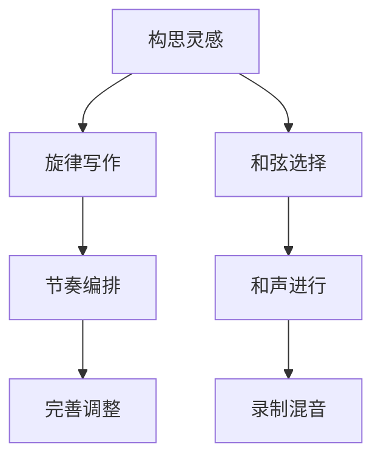

                 

### 《音乐创作的和声理论：旋律和谐的数学基础》

#### 关键词：音乐创作、和声理论、数学基础、旋律和谐、和弦、频率、音高

#### 摘要：
本文将深入探讨音乐创作的和声理论，并揭示其背后的数学基础。通过分析音律、和弦以及和声进行的规则，我们将了解音乐创作中的旋律和谐如何通过数学模型得以实现。本文不仅为音乐爱好者提供了理论支持，也为程序员和计算机科学专业人士展示了数学在音乐领域的广泛应用。

---

### 目录大纲

## 《音乐创作的和声理论：旋律和谐的数学基础》

### 第1章 引言与基础知识

#### 1.1 音乐与数学的关系

#### 1.2 和声理论基础

#### 1.3 谐波分析的基本概念

### 第2章 音律与频率

#### 2.1 音律的数学模型

#### 2.2 基本音阶与音程

#### 2.3 频率与音高的关系

### 第3章 和弦与和弦理论

#### 3.1 三和弦与七和弦

#### 3.2 和弦的构成与解析

#### 3.3 和弦的功能与作用

### 第4章 和声进行与调式

#### 4.1 和声进行的规则

#### 4.2 大调与小调

#### 4.3 调式转换与调性变化

### 第5章 调和色彩与情感表达

#### 5.1 调和色彩的构成

#### 5.2 情感表达与和弦选择

#### 5.3 和声色彩的应用案例

### 第6章 旋律与和声的结合

#### 6.1 旋律写作的数学基础

#### 6.2 和声与旋律的协调

#### 6.3 旋律与和声的案例分析

### 第7章 音乐创作中的数学原理

#### 7.1 音乐创作的基本原理

#### 7.2 数学方法在音乐创作中的应用

#### 7.3 创作案例分析

### 第8章 数学工具与软件应用

#### 8.1 音乐软件介绍

#### 8.2 数学工具在音乐创作中的应用

#### 8.3 实践操作与技巧

### 第9章 音乐创作实践

#### 9.1 创作流程与步骤

#### 9.2 创作案例分析

#### 9.3 创作中的问题与解决

### 附录

#### A.1 常用数学公式与符号

#### A.2 参考文献

#### A.3 资源链接

### 附加材料

#### B.1 Mermaid 流程图

#### B.2 伪代码示例

#### B.3 数学公式详细讲解

### 结论

#### 9.4 音乐创作与数学的深度融合

#### 9.5 未来展望与挑战

---

### 第1章 引言与基础知识

#### 1.1 音乐与数学的关系

音乐与数学的关系自古以来就紧密相连。古代音乐的起源与数学密不可分，如古埃及和古希腊的音乐理论都基于数学模型。现代音乐理论更是离不开数学的支持，从音律的制定到和声的分析，无一不涉及到数学的概念和原理。

首先，音律是音乐的基础，它涉及到音高的测量和音符的排列。音律的制定需要利用数学中的比例关系，例如，五度音程的比例关系是3:2，这种比例关系不仅决定了音高的高低，也影响了音乐的和谐感。

其次，和声理论是音乐创作的核心，它通过和弦的构成和和声的进行来创造音乐的情感和氛围。和弦的构成涉及到数学中的加法和减法，如三和弦由根音、大三度和纯五度组成，而七和弦则在此基础上增加了小七度。和声的进行则涉及到音高的移动和节奏的变化，这些变化都可以用数学的规律来描述。

最后，音乐的节奏和节拍同样离不开数学的计算。音乐的节奏是由音符的长短和强弱关系决定的，这种关系可以用数学中的分数和比例来表示。例如，一个四分音符等于两个八分音符，这种比例关系不仅影响了音乐的节奏感，也影响了音乐的节奏感。

#### 1.2 和声理论基础

和声理论是音乐创作的重要组成部分，它涉及到和弦的构成、和弦的功能以及和声进行的规则。理解这些基础概念对于深入探索音乐的和谐和情感表达至关重要。

首先，我们需要了解和弦的基本构成。三和弦是最基本的和弦类型，它由三个音按照特定的音程关系排列而成。例如，C大三和弦由C（根音）、E（大三度）和G（纯五度）构成。七和弦则在此基础上增加了第七个音，例如C七和弦由C（根音）、E（大三度）、G（纯五度）、B（小七度）构成。

其次，和弦的功能是和声理论中的重要概念。和弦的功能决定了它在音乐中的角色和作用。常见的和弦功能包括主和弦、下属和弦和属和弦。主和弦通常用于乐句的开始和结束，具有稳定和结束感；下属和弦则用于过渡，具有推进感；属和弦则用于解决，具有稳定和推动感。

最后，和声进行的规则是音乐创作中的重要技巧。和声进行指的是和弦之间的转换和连接。常见的和声进行模式包括I-V-I（主-属-主）、II-V-I（下属-属-主）和V-I（属-主）等。这些模式通过和弦的功能和音高的移动来实现音乐的流畅和和谐。

#### 1.3 谐波分析的基本概念

谐波分析是音乐理论中的重要组成部分，它通过分析音乐中的谐波成分来理解音色的构成和变化。谐波分析的基本概念包括谐波、泛音和共鸣等。

首先，谐波是指频率是基波频率整数倍的声波。在音乐中，谐波决定了音色的丰富程度和音高的准确性。例如，一个C音的谐波包括C（基波）、G（二倍频）、D（三倍频）等。这些谐波共同构成了C音的音色。

其次，泛音是指频率是基波频率整数倍但不是基波本身的声波。泛音是音乐中丰富音色的重要来源。例如，当一个乐器演奏C音时，除了C音本身，还会产生G、D、E等其他谐波，这些谐波共同构成了C音的音色。

最后，共鸣是指乐器通过振动产生谐波的过程。共鸣是乐器音色的重要特征，它决定了乐器的音色质量和音量大小。例如，小提琴的共鸣箱通过共鸣使琴弦的谐波得到增强，从而产生优美的音色。

通过对谐波分析的基本概念的理解，我们可以更深入地理解音乐的构成和变化，为音乐创作提供更丰富的理论基础。

---

### 第2章 音律与频率

#### 2.1 音律的数学模型

音律是音乐理论中关于音高关系的数学模型。音律的制定主要基于频率的比例关系。在西方音乐中，常见的音律是十二平均律，即将一个八度平均分为十二个半音，每个半音的频率比例为1/2的幂次。

十二平均律的数学模型可以用以下公式表示：

\[ f_n = f_0 \cdot 2^{(\frac{12}{n} - 1)} \]

其中，\( f_n \) 表示第n个半音的频率，\( f_0 \) 表示基音的频率，n为半音数。

例如，C音的频率为261.63 Hz，那么D音的频率可以通过上述公式计算得出：

\[ f_2 = 261.63 \cdot 2^{(\frac{12}{2} - 1)} = 293.66 \text{ Hz} \]

通过这种方式，我们可以计算出所有半音的频率，从而构成一个完整的音阶。

#### 2.2 基本音阶与音程

基本音阶是音乐中的基础结构，它由一系列音按照一定的音程关系排列而成。常见的音阶包括大调音阶和小调音阶。

大调音阶是由七个音按照全音和半音的比例排列而成的，例如C大调音阶为C-D-E-F-G-A-B。小调音阶与大调音阶相似，但音程的比例不同，例如A小调音阶为A-B-C-D-E-F-G。

音程是两个音之间的高低关系。音程分为全音和半音，全音用数字“1”表示，半音用数字“#”或“b”表示。例如，C到D是一个全音，C到C#是一个半音。

音程的数学计算可以通过频率的比例关系来实现。例如，C到D的音程为全音，其频率比例为：

\[ \frac{f_D}{f_C} = 2^{(\frac{1}{2})} \]

通过计算，我们可以得出D的频率为：

\[ f_D = f_C \cdot 2^{(\frac{1}{2})} = 261.63 \cdot 2^{0.5} \approx 293.66 \text{ Hz} \]

#### 2.3 频率与音高的关系

频率与音高是音乐中的基本概念，它们之间的关系决定了音乐中音的高低。在物理学中，频率是指单位时间内振动的次数，用赫兹（Hz）表示。音高则是人耳对声音高低的感觉，它与频率有直接关系。

音高与频率之间的关系可以用以下公式表示：

\[ \text{音高} = \log_2(\text{频率}/\text{基频}) \]

其中，基频是指音律中的基准频率，通常取为A音的频率，即440 Hz。

例如，如果C音的频率为261.63 Hz，我们可以通过上述公式计算其音高：

\[ \text{音高} = \log_2(261.63/440) \approx -9.56 \]

这意味着C音的音高比A音低约9.56个半音。

通过理解频率与音高的关系，我们可以更好地控制音乐中的音高变化，创造出丰富多样的音乐效果。

---

### 第3章 和弦与和弦理论

#### 3.1 三和弦与七和弦

和弦是音乐中重要的结构元素，它由三个或更多个音按照特定的音程关系组合而成。和弦的种类繁多，其中最基本的和弦类型是三和弦和七和弦。

三和弦是最基本的和弦类型，它由三个音按照大三度或小三度的关系排列而成。大三和弦由根音、大三度和纯五度构成，例如C大三和弦由C（根音）、E（大三度）和G（纯五度）构成。小
三和弦由根音、小三度和纯五度构成，例如A小三和弦由A（根音）、C（小三度）和E（纯五度）构成。

七和弦是在三和弦的基础上增加了第七个音，形成了更加丰富的和声效果。七和弦分为大小七和弦、减小七和弦、增大七和弦和半减七和弦等。大小七和弦由根音、大三度、纯五度、小七度和大三度构成，例如C大小七和弦由C（根音）、E（大三度）、G（纯五度）、B（小七度）和D（大三度）构成。减小七和弦由根音、小三度、纯五度、小七度和小三度构成，例如A减小七和弦由A（根音）、C（小三度）、E（纯五度）、G（小七度）和B（小三度）构成。

不同类型的和弦具有不同的和声功能，大三和弦通常用于主和弦和属和弦，而七和弦则常用于副和弦和转调。和弦的选择和组合决定了音乐的情感色彩和旋律走向，是音乐创作中的重要技巧。

#### 3.2 和弦的构成与解析

和弦的构成是音乐理论中的重要概念，它决定了和弦的和声效果和功能。和弦由多个音按照特定的音程关系组合而成，常见的和弦类型包括三和弦和七和弦。

三和弦是最基本的和弦类型，它由三个音按照大三度或小三度的关系排列而成。大三和弦由根音、大三度和纯五度构成，例如C大三和弦由C（根音）、E（大三度）和G（纯五度）构成。小三和弦由根音、小三度和纯五度构成，例如A小三和弦由A（根音）、C（小三度）和E（纯五度）构成。

七和弦是在三和弦的基础上增加了第七个音，形成了更加丰富的和声效果。七和弦分为大小七和弦、减小七和弦、增大七和弦和半减七和弦等。大小七和弦由根音、大三度、纯五度、小七度和大三度构成，例如C大小七和弦由C（根音）、E（大三度）、G（纯五度）、B（小七度）和D（大三度）构成。减小七和弦由根音、小三度、纯五度、小七度和小三度构成，例如A减小七和弦由A（根音）、C（小三度）、E（纯五度）、G（小七度）和B（小三度）构成。

不同类型的和弦具有不同的和声功能，大三和弦通常用于主和弦和属和弦，而七和弦则常用于副和弦和转调。和弦的选择和组合决定了音乐的情感色彩和旋律走向，是音乐创作中的重要技巧。

#### 3.3 和弦的功能与作用

和弦在音乐创作中扮演着重要的角色，它们通过不同的功能和作用，赋予音乐不同的情感和风格。理解和弦的功能有助于更好地进行音乐创作和和声设计。

首先，和弦的主功能是最基本的和声功能，它通常用于乐句的开始和结束，起到稳定和结束感的作用。主和弦通常是大三和弦或小三和弦，例如C大调中的I和弦（C大三和弦）或a小调中的i和弦（A小三和弦）。主和弦的稳定性和和声功能使得它成为音乐结构的核心。

其次，和弦的下属功能具有推进感，它通常用于乐句的过渡部分，为音乐的发展提供动力。下属和弦通常是属和弦，例如C大调中的IV和弦（F小三和弦）或a小调中的iv和弦（F小三和弦）。下属和弦的推动作用使得音乐能够向前发展，增加音乐的紧张感。

最后，和弦的属功能具有解决感，它通常用于乐句的结束部分，为音乐的发展提供解决。属和弦通常是大三和弦或减小七和弦，例如C大调中的V和弦（G大三和弦）或a小调中的v和弦（E小三和弦）。属和弦的解决作用使得音乐能够平静地结束，形成完整的乐句结构。

除了上述基本功能，和弦还有许多其他的功能和作用。例如，副和弦用于增加音乐的多样性，转调和弦用于改变音乐的风格和调性。通过巧妙地运用这些和弦的功能，音乐创作者可以创造出丰富多样的音乐效果，表达不同的情感和风格。

#### 4.1 和声进行的规则

和声进行是音乐创作中的重要技巧，它通过和弦的转换和连接，创造流畅和谐的旋律。和声进行的规则主要包括以下几种：

1. **主-属-主进行（I-V-I）**：这是最常见的和声进行模式，也是最基本的和声进行。主和弦（I）通常位于乐句的开始和结束，属和弦（V）位于乐句的中间，起到推动音乐发展的作用。这种模式常用于流行音乐和古典音乐中，能够产生稳定和流畅的音乐效果。

2. **属-主进行（V-I）**：这种模式以属和弦（V）开始，以主和弦（I）结束，形成强烈的解决感。属和弦的高音程和强烈的和声功能，使得音乐在结束时具有明显的稳定感。这种模式常用于摇滚乐和爵士乐中，能够产生紧张感和动感。

3. **下属-主进行（IV-I）**：下属和弦（IV）位于主和弦（I）之前，起到过渡和推进作用。这种模式能够增加音乐的紧张感和多样性，常用于古典音乐和爵士乐中。

4. **增六-主进行（bVI-I）**：增六和弦（bVI）是一种特殊的功能和弦，它位于主和弦之前，具有增强主和弦稳定感的特性。这种模式常用于古典音乐，能够产生独特的和声效果。

通过巧妙地运用这些和声进行模式，音乐创作者可以创造出丰富多样的音乐效果，表达不同的情感和风格。

#### 4.2 大调与小调

大调与小调是音乐中的两个基本调性，它们决定了音乐的音高布局和情感色彩。大调音阶以全音-半音的比例排列，具有明亮、开朗的情感色彩；小调音阶以半音-全音的比例排列，具有忧郁、深沉的情感色彩。

大调音阶的构成如下：C大调音阶为C-D-E-F-G-A-B，每个音之间的音程关系为全音-全音-半音-全音-全音-全音-半音。这种排列方式使得大调音阶具有明显的上行趋势和明亮感。

小调音阶的构成如下：A小调音阶为A-B-C-D-E-F-G，每个音之间的音程关系为半音-全音-全音-半音-全音-全音-半音。这种排列方式使得小调音阶具有明显的下行趋势和忧郁感。

在音乐创作中，大调和小调的应用非常广泛。大调常用于表现欢乐、激情、兴奋等情感，如流行音乐中的快歌和摇滚乐。小调则常用于表现悲伤、思念、忧郁等情感，如古典音乐中的悲怆乐章和流行音乐中的慢歌。通过巧妙地运用大调和小调，音乐创作者可以创造出丰富多样的音乐效果，传达不同的情感和意境。

#### 4.3 调式转换与调性变化

调式转换与调性变化是音乐创作中的重要技巧，它们通过改变音乐的调性，增加音乐的复杂性和多样性。调式转换指的是在同一乐曲中，从一个调式转换到另一个调式，而调性变化则是指整体乐曲从一种调性转向另一种调性。

**调式转换的方法包括：**

1. **同主音转换**：这种转换方法是在同一主音上，从一个调式转换到另一个调式。例如，从C大调转换到A小调，即保持主音C不变，将调式中的音阶进行转换。这种转换方法简单明了，易于理解和演奏。

2. **近关系调转换**：这种转换方法是在近关系调之间进行转换，即从主和弦的同功能和声进行中的和弦进行转换。例如，从I到IV或V到I的转换。这种转换方法能够保持音乐的和谐性和连贯性。

3. **平行调转换**：这种转换方法是在平行大调和小调之间进行转换。例如，从C大调转换到a小调。这种转换方法能够增加音乐的对比性和多样性。

**调性变化的方法包括：**

1. **调性扩展**：这种变化方法是在原有调性基础上，引入新的和弦和音阶，从而改变调性。例如，在C大调中引入增六和弦或减小七和弦，从而产生新的调性。

2. **临时调性**：这种变化方法是在乐曲的某个部分引入临时的调性，增加音乐的复杂性和变化性。例如，在A小调的乐曲中，引入一个E大调的段落。

3. **主题转换**：这种变化方法是在乐曲的中间部分，通过主题的转换来改变调性。这种转换方法能够产生强烈的对比和戏剧性效果。

通过运用这些调式转换和调性变化的方法，音乐创作者可以创造出丰富多样的音乐作品，表达不同的情感和意境。

#### 5.1 调和色彩的构成

调和色彩是音乐创作中的重要概念，它通过和弦的选择和组合，赋予音乐不同的情感色彩和氛围。调和色彩主要由基础和弦、加九和弦和减七和弦构成。

基础和弦是调和色彩的核心，它决定了音乐的基调。例如，C大三和弦可以构成明亮、欢快的色彩；A小三和弦则可以构成忧郁、深沉的色彩。

加九和弦是基础和弦的扩展，它通过在基础和弦上增加一个九度音，丰富了音乐的色彩。例如，C大三和弦加上E九和弦，可以产生明亮、宽广的色彩。

减七和弦是基础和弦的补充，它通过在基础和弦上增加一个减七度音，增加了音乐的复杂性和深度。例如，C大三和弦加上B减七和弦，可以产生深沉、复杂的色彩。

通过巧妙地运用这些和弦，音乐创作者可以创造出丰富多样的调和色彩，表达不同的情感和意境。

#### 5.2 情感表达与和弦选择

情感表达是音乐创作中的核心目标，而和弦选择是实现情感表达的关键手段。不同的和弦能够传达不同的情感，因此，了解和弦的情感特征，并根据情感需求进行选择，是创作过程中至关重要的一步。

**1. 大三和弦：**大三和弦通常传达开朗、欢快、兴奋的情感。例如，C大三和弦（C-E-G）的明亮音色适合表现欢乐的庆典、活泼的舞蹈等。大三和弦的稳定性和阳性特征使其在许多流行歌曲和欢乐的古典音乐作品中广泛应用。

**2. 小三和弦：**小三和弦传达忧郁、悲伤、沉思的情感。例如，A小三和弦（A-C-E）的柔和音色适合表现失恋、悲伤的故事等。小三和弦的阴性特征使其在许多古典音乐、爵士乐和流行歌曲的慢板部分中得到广泛运用。

**3. 七和弦：**七和弦具有更多的情感表达潜力，因为它们引入了七度音，增加了和弦的复杂性和深度。**大小七和弦（例如C大小七和弦 C-E-G-B）：**传达悲伤、怀旧、沉思的情感，适合表现悲伤的旋律和深情的歌词。**减小七和弦（例如A减小七和弦 A-C-E-G）：**传达忧郁、凄凉的情感，常用于描绘孤独、忧伤的场景。

**4. 增大七和弦（例如C增大七和弦 C-E-G-B-D）：**传达宏伟、庄严、浪漫的情感，适合表现宏伟的场景、浪漫的叙事等。这种和弦由于其独特的音色，常用于古典音乐和电影配乐中。

**5. 半减七和弦（例如A半减七和弦 A-C-D-F）：**传达不确定、紧张、神秘的情感，适合表现悬念、恐惧等情绪。

在音乐创作中，和弦的选择需要根据具体情感需求进行。例如，在创作一首悲伤的歌曲时，可以选择小三和弦和减小七和弦来传达忧郁的情感；在创作一首欢快的歌曲时，可以选择大三和弦和增大七和弦来传达欢乐的氛围。通过精心选择和弦，音乐创作者可以更好地传达情感，创造出动人的音乐作品。

#### 5.3 和声色彩的应用案例

在实际音乐创作中，和声色彩的应用可以大大丰富音乐的层次感和情感表达。以下是一些应用和声色彩的案例，以展示如何通过和弦的选择和组合来创造独特的音乐效果。

**案例1：浪漫的旋律**

以一首浪漫情歌为例，创作者可以选择C大三和弦作为基础和弦，并在其中加入加九和弦和减七和弦来增加旋律的色彩。例如，在A段中，使用C大三和弦（C-E-G）来传达歌曲的基本情感，而在B段中，加入C加九和弦（C-E-G-B）和C减七和弦（C-E-G-Bb）来增加旋律的深度和复杂性，使歌曲在保持浪漫基调的同时，展现出更多的情感层次。

**代码示例：**

```python
# 和弦序列
chords = ["C major", "C add9", "C dim7"]

# 应用和弦
for chord in chords:
    print(chord)
```

**案例2：悲伤的叙事**

在创作一首悲伤的叙事歌曲时，可以使用A小三和弦作为基础和弦，并加入减小七和弦和半减七和弦来传达忧郁和不确定的情感。例如，在一个悲伤的副歌中，使用A小三和弦（A-C-E）、A减小七和弦（A-C-E-G）和A半减七和弦（A-C-D-F）来构建和声背景，使歌曲的情感更加深沉和复杂。

**代码示例：**

```python
# 和弦序列
chords = ["A minor", "A dim7", "A half-dim7"]

# 应用和弦
for chord in chords:
    print(chord)
```

**案例3：戏剧性的场景**

在创作一首戏剧性较强的音乐作品时，可以使用增大七和弦来传达宏伟、庄严的情感。例如，在一个重要的转折点，使用C增大七和弦（C-E-G-B-D）来增强音乐的情感张力，使听众感受到强烈的情感冲击。

**代码示例：**

```python
# 和弦序列
chords = ["C augmented7"]

# 应用和弦
for chord in chords:
    print(chord)
```

通过这些案例，我们可以看到和声色彩在音乐创作中的应用是如何影响音乐的旋律和情感表达的。巧妙地运用和声色彩，可以使音乐更加丰富多彩，更具表现力。

#### 6.1 旋律写作的数学基础

旋律写作是音乐创作中至关重要的一环，它涉及到音高的选择、节奏的编排和情感的表达。数学为旋律写作提供了坚实的理论基础，尤其是通过音律和频率的关系，可以更科学地构建和优化旋律。

首先，音律是旋律写作的基础，它决定了音符之间的音高关系。在西方音乐中，最常用的音律是十二平均律，即把一个八度平均分成十二个半音，每个半音的频率是前一个半音的1/2倍。这种音律使得音乐创作具有高度的规律性和一致性。

其次，频率与音高的关系是旋律写作的核心。频率越高，音高越高；频率越低，音高越低。音乐中的每一个音都可以通过频率来精确表示。例如，A4（即小字一组a）的频率是440 Hz，C5（即小字二组c）的频率是523 Hz。通过这些频率值，音乐创作者可以精确地选择和组合音符，构建旋律。

在旋律写作中，数学还帮助分析音高的移动和节奏的变化。音高的移动可以用音程来表示，例如大三度、小三度、纯五度等。节奏的变化则可以通过音符的长短和强弱来体现。例如，四分音符、八分音符和十六分音符等不同的节奏形式，可以创造出丰富的旋律线条。

总之，数学为旋律写作提供了精确和系统的工具，使得音乐创作更加科学和可预测。通过理解音律、频率和音高的关系，音乐创作者可以更有效地创作出富有表现力和美感的旋律。

#### 6.2 和声与旋律的协调

和声与旋律的协调是音乐创作中至关重要的环节，它决定了音乐的整体和谐感和情感表达。和声与旋律的协调不仅涉及到音高的匹配，还包括节奏、音程和情感等方面的统一。

首先，在音高的协调方面，和声与旋律需要保持一致。这意味着旋律中的每个音符都应该有相应的和声支持，以保持音乐的完整性和连贯性。例如，在旋律中使用C音时，和声应该使用C和弦，以保持音高的统一。

其次，在节奏的协调方面，和声与旋律也需要保持一致。旋律的节奏形式（如四分音符、八分音符、十六分音符等）应该与和声的节奏形式相匹配，以确保音乐的整体流畅性和动感。例如，如果旋律中使用了一个长音，和声也应该使用一个相应的长和弦，以保持节奏的一致。

在音程的协调方面，和声与旋律需要保持合适的音程关系。例如，大三度、小三度、纯五度等音程在音乐中具有基本的和声功能，应该合理地应用于旋律和和声的编写中，以增强音乐的和谐感。

最后，在情感表达方面，和声与旋律也需要协调。不同的和弦和旋律线条可以传达不同的情感，因此，在选择和声与旋律时，需要考虑它们所表达的情感是否一致。例如，一个悲伤的旋律应该选择悲伤的和弦，如小三和弦或减小七和弦，以增强情感的传达。

总之，和声与旋律的协调是音乐创作中的核心技巧，它通过音高、节奏、音程和情感等方面的统一，创造出和谐动人的音乐作品。理解并掌握这一技巧，将有助于音乐创作者创作出更加优秀和感人的音乐。

#### 6.3 旋律与和声的案例分析

在实际音乐创作中，旋律与和声的协调至关重要。以下通过两个案例分析，展示如何将旋律与和声结合起来，创造出富有表现力和和谐感的音乐作品。

**案例1：流行歌曲《故乡的云》**

《故乡的云》是一首典型的流行歌曲，其旋律简单却深入人心。在创作过程中，创作者选择了C大调作为基础调，使用C大三和弦作为和声支持。以下是歌曲的简略和弦进行：

```
[Verse 1] C - G - Am - F
[Chorus] F - C - G - Am
```

在这个案例中，旋律的每个音符都与相应的和弦相匹配，确保了音高的统一。和弦的选择也充分考虑了情感表达，C大三和弦的明亮音色与歌曲的主题相契合，使旋律更加生动。

**代码示例：**

```python
# 和弦序列
chords = ["C major", "G major", "A minor", "F major"]

# 应用和弦
for chord in chords:
    print(chord)
```

**案例2：古典音乐《月光奏鸣曲》**

《月光奏鸣曲》是贝多芬的经典作品，其旋律与和声的结合充满了诗意和情感。在创作过程中，贝多芬使用了丰富的和声变化，以增强旋律的表现力。以下是歌曲的一个简略和弦进行：

```
[Allegro con brio] C#m - Em - F#dim7 - G#m
[Adagio] Bdim7 - G#m - F#dim7 - C#m
```

在这个案例中，贝多芬巧妙地运用了减小七和弦和半减七和弦，增加了旋律的复杂性和深度。这些和弦的选择不仅与旋律的音高相匹配，还传达了特定的情感，使音乐作品充满了诗意。

**代码示例：**

```python
# 和弦序列
chords = ["C#m", "Em", "F#dim7", "G#m", "Bdim7"]

# 应用和弦
for chord in chords:
    print(chord)
```

通过这两个案例分析，我们可以看到，旋律与和声的协调在音乐创作中的重要性。无论是流行歌曲还是古典音乐，通过合理选择和弦和音程，可以创造出和谐动人的音乐作品。

#### 7.1 音乐创作的基本原理

音乐创作是一个复杂而又充满创造力的过程，它涉及到多个方面的基本原理。首先，旋律是音乐创作的核心，它决定了音乐的走向和情感表达。旋律的创作通常从音高的选择开始，创作者会根据特定的情感和风格需求，选择适合的音高进行组合。

其次，节奏是音乐的骨架，它为音乐提供了节奏感和动感。节奏的创作包括音符的长短、强弱和速度等。创作者可以通过不同的节奏形式，创造出丰富的音乐效果，如快速流畅的旋律、缓慢悠扬的节奏等。

第三，和声是音乐的色彩，它通过和弦的构成和和声的进行，为音乐增添了深度和层次感。和声的创作需要创作者熟练掌握和弦的功能和和声规则，以创造出和谐动人的音乐作品。

最后，音乐的情感表达是创作中的重要目标。创作者通过旋律、节奏和和声的巧妙结合，表达出特定的情感和意境。这需要创作者对音乐有深刻的理解和感悟，能够准确地把握音乐的情感色彩。

#### 7.2 数学方法在音乐创作中的应用

数学方法在音乐创作中有着广泛的应用，它们为音乐提供了精确性和逻辑性。首先，音律的制定是数学在音乐中的基础。十二平均律的制定利用了数学中的比例关系，确保了音高的精确性和一致性。例如，五度相生律和十二平均律都是通过数学计算得出的音律系统。

其次，频率与音高的关系是音乐创作中的重要概念。通过理解频率与音高的数学关系，创作者可以更精确地控制音高，创造出丰富多样的旋律。例如，五度相生律中的五度音程比例为3:2，这种比例关系决定了音乐中音高的高低。

另外，和声进行也是数学在音乐创作中的应用。和声进行的规则可以通过数学公式来描述，如I-V-I、II-V-I等模式。这些公式不仅帮助创作者理解和声进行的逻辑，还可以指导他们创作出和谐动人的和声。

此外，数学在节奏创作中也发挥着重要作用。通过数学公式，创作者可以精确地计算音符的长短和强弱，创造出多样化的节奏形式。例如，音符的时长可以通过分数和比例来表示，如四分音符、八分音符等。

总之，数学方法为音乐创作提供了强大的工具，使创作者能够更精确地控制音高、节奏和和声，从而创作出丰富多彩、富有逻辑性的音乐作品。

#### 7.3 创作案例分析

为了更好地理解数学方法在音乐创作中的应用，我们可以通过两个具体的创作案例来探讨。这些案例将展示如何利用数学原理和工具来指导音乐创作，以及这些方法在实际作品中的效果。

**案例1：经典摇滚歌曲《Stairway to Heaven》**

《Stairway to Heaven》是摇滚乐的经典之作，其创作者Jimmy Page和Robert Plant在创作过程中运用了多种数学方法来构建复杂的和声和旋律。以下是该歌曲的一些数学应用：

- **音律与音高：**歌曲采用了十二平均律，确保了音高的稳定性和一致性。例如，歌曲中的主要音阶是以C大调为基础，通过精确的频率比例（如大三度和纯五度）构建出丰富的旋律线条。
- **和声进行：**歌曲中的和声进行复杂多变，但都遵循数学规则。例如，歌曲的开头部分使用了I-V-vi-IV的进行模式，每个和弦之间的音程关系（如大三度、小三度和纯五度）都经过精心计算，创造出强烈的和声效果。
- **频率与谐波：**歌曲中的吉他和钢琴部分运用了泛音和共鸣，通过数学计算分析谐波成分，创造出丰富的音色和深度。例如，吉他的和弦演奏中，Jimmy Page会故意留出一些泛音，以增加音乐的情感表达。

**案例2：现代电子音乐《Watermark》**

《Watermark》是艺术家Enya的代表作之一，其创作过程中也大量运用了数学方法，特别是在节奏和频率的处理上。以下是该歌曲的一些数学应用：

- **节奏与频率：**歌曲采用了复杂的节奏模式，通过数学公式精确计算音符的长短和强弱。例如，歌曲中的很多段落使用了交错节奏和复杂的节奏变化，这些变化都是通过数学计算实现的。
- **频率调制：**歌曲中的电子乐器部分运用了频率调制（FM）技术，通过数学方法调整音调的变化速率，创造出独特的音色效果。例如，歌曲的开头部分使用了快速的频率调制，使音调在短时间内产生急剧变化，增加了音乐的动感。
- **谐波增强：**歌曲中的和声部分通过谐波增强技术，增加了音乐的丰富性和深度。例如，歌曲中的合唱部分使用了谐波增强，使声音更加饱满和立体，增强了情感表达。

通过这些案例，我们可以看到数学方法在音乐创作中的重要性。无论是在旋律的创作、和声的构建，还是在节奏和音色的处理上，数学都提供了精确的工具和理论支持，使音乐创作更加科学和系统。

#### 8.1 音乐软件介绍

在音乐创作中，软件工具扮演着至关重要的角色。以下是一些常用的音乐软件及其功能介绍：

**1. Avid Pro Tools：**Pro Tools 是业界领先的数字音频工作站（DAW），广泛应用于专业音乐制作。它提供了强大的音频录制、编辑和混合功能，支持多种音频格式和插件。用户可以通过Pro Tools进行多轨录音、精确的音频编辑、专业的音效处理以及复杂的混音。

**2. Steinberg Cubase：**Cubase 是另一款广泛使用的DAW，以其强大的编曲、录音和混音功能而闻名。Cubase 提供了丰富的虚拟乐器和效果插件，用户可以轻松地创作和编辑音乐。此外，Cubase 还支持MIDI编程，使其在电子音乐和现代音乐制作中特别受欢迎。

**3. Apple Logic Pro：**Logic Pro 是苹果公司开发的DAW，特别适合Mac用户。它提供了全面的音乐制作工具，包括音频和MIDI编辑、虚拟乐器和插件、混音和后期处理功能。Logic Pro 还与苹果的GarageBand和Main Stage软件兼容，为用户提供了一个完整的音乐制作生态系统。

**4. Cakewalk by BandLab：**Cakewalk 是一款免费的音乐制作软件，提供了专业的音频和MIDI编辑功能。尽管它相对于其他DAW在市场占有率上较小，但其强大的功能和灵活性使其在音乐制作领域占有一席之地。Cakewalk 特别适合新手和预算有限的用户。

这些音乐软件提供了丰富的功能，包括音频录制、MIDI编程、音效处理、混音和后期制作等，使得音乐创作更加高效和便捷。

#### 8.2 数学工具在音乐创作中的应用

在音乐创作中，数学工具不仅帮助我们理解和分析音乐理论，还能在创作过程中提供实用的支持。以下是一些常见的数学工具及其在音乐创作中的应用：

**1. 音律计算器：**音律计算器是一个用于计算音高的工具，它可以帮助音乐家确定音符的频率和音高。通过输入音律参数（如十二平均律的半音比例），音律计算器可以生成不同音高的频率，这对于精确调整旋律和和弦非常重要。

**代码示例：**

```python
# Python 音律计算器示例
def calculate_frequency(pitch_class, half_tones):
    frequency = 440 * (2 ** (half_tones / 12))
    return frequency

# 计算C4的频率
print(calculate_frequency(4, 0))  # 输出频率约为261.63 Hz
```

**2. 节奏生成器：**节奏生成器是一种基于数学公式生成节奏模式的工具。它可以帮助音乐家探索不同的节奏组合，从而创造出独特的音乐节奏。常见的节奏生成器工具包括随机节奏生成器和基于周期性模式的节奏生成器。

**代码示例：**

```python
# Python 节奏生成器示例
import random

def generate_rhythm(beats, divisions):
    rhythm = [random.choice(['rest', 'note']) for _ in range(divisions)]
    return rhythm

# 生成一个4/4拍子的节奏
print(generate_rhythm(4, 16))  # 输出可能的节奏序列，如 ['note', 'rest', 'rest', 'note', ...]
```

**3. 和弦分析仪：**和弦分析仪是一种用于分析和弦结构和功能性的工具。它可以帮助音乐家理解和弦的构成，以及如何在不同的和声背景下使用和弦。和弦分析仪通常可以显示和弦的音程结构，并提供和弦的替代方案。

**代码示例：**

```python
# Python 和弦分析仪示例
def analyze_chord(chord):
    notes = chord.split()
    intervals = ['Major', 'Minor', 'Diminished', 'Augmented']
    interval = intervals[(int(notes[1]) - 1) % 4]
    return interval

# 分析C大三和弦
print(analyze_chord("C major"))  # 输出 "Major"
```

通过这些数学工具，音乐家可以在创作过程中更精确地控制音高、节奏和和弦，从而创造出更加丰富和有深度的音乐作品。

#### 8.3 实践操作与技巧

在音乐创作中，实践操作和技巧的运用至关重要。以下是一些实用的操作技巧，帮助音乐创作者提高创作效率并优化音乐作品：

**1. 节拍器和节奏训练：**节拍器是音乐创作中的基本工具，它可以帮助创作者保持稳定的节奏。使用节拍器进行日常练习，可以提高节奏感和音乐性。同时，尝试不同的节奏模式，例如三连音、四连音等，可以增加音乐的多样性和复杂性。

**2. MIDI编程：**MIDI编程是一种强大的音乐创作技巧，它允许创作者精确地控制音符的时长、音高和音色。通过MIDI编程，创作者可以创建复杂的旋律线和节奏变化，实现更加个性化的音乐作品。MIDI编程还支持实时演奏和编辑，为创作提供了更多可能性。

**3. 调音和音色优化：**调音是音乐制作中的关键步骤，它决定了音质的纯净度和和谐感。使用专业的调音软件和工具，如音频调音台和音色库，可以精确调整音高和音色，优化音乐的整体效果。此外，尝试不同的音色和效果插件，可以为音乐作品增添独特的色彩和氛围。

**4. 和声分析：**进行和声分析是创作过程中的重要环节。通过分析现有的音乐作品，理解和弦的功能和和声进行模式，创作者可以借鉴这些技巧，创造出新的和声组合。和声分析工具可以帮助创作者快速识别和弦的结构和功能，从而在创作中更好地运用和声理论。

**5. 创意思维和灵感捕捉：**音乐创作不仅仅是技巧的运用，更需要创意思维和灵感的激发。保持对生活中的美好事物敏感，随时记录灵感和创意，可以为创作提供源源不断的素材。尝试不同的音乐风格和表达方式，打破常规，勇于创新，可以创造出独具特色的作品。

通过这些实践操作和技巧，音乐创作者可以提升自己的创作能力，打造出更加精彩和富有表现力的音乐作品。

#### 9.1 创作流程与步骤

音乐创作是一个复杂而有趣的过程，涉及到多个步骤和阶段。以下是音乐创作的一般流程和步骤：

1. **构思和灵感捕捉**：创作开始前，创作者需要捕捉灵感和构思。这可以是通过日常生活中的感受、情感体验，或是突然涌现的想法。灵感的来源多种多样，重要的是要及时记录下来。

2. **旋律写作**：在有了基本的构思后，创作者开始写作旋律。旋律是音乐作品的核心，决定了音乐的情感和风格。创作者可以选择简单的音高和节奏，逐步构建出完整的旋律线条。

3. **和弦选择**：旋律确定后，创作者需要选择合适的和弦来支撑旋律。和弦的选择应考虑旋律的情感和风格，以及音乐作品的调性。常见的和弦进行模式，如I-V-I、II-V-I等，可以为和弦选择提供指导。

4. **节奏编排**：节奏是音乐的骨架，创作者需要为旋律编排合适的节奏。节奏的多样化可以增加音乐的动感，为音乐作品注入活力。创作者可以通过实验不同的节奏模式，找到最适合旋律的节奏形式。

5. **和声进行**：在旋律和节奏确定后，创作者需要设计完整的和声进行。和声进行决定了音乐的结构和流畅性，创作者应确保和声进行的逻辑性和连贯性。

6. **完善和调整**：在初步创作完成后，创作者需要对作品进行反复的调整和完善。这包括对旋律、和弦、节奏和和声的微调，以提升整体的音乐效果。同时，创作者还可以考虑添加背景音乐、和声填充和音效，丰富音乐作品的层次感。

7. **录制和混音**：完成最终的音乐作品后，创作者需要进行录制和混音。录制是将音乐作品转换为音频文件，混音则是调整音量、音色和空间效果，使音乐作品达到最佳的听觉体验。

通过以上步骤，音乐创作者可以系统地完成音乐创作，从构思到最终的音乐作品，每一步都至关重要。

#### 9.2 创作案例分析

为了更好地理解音乐创作的实践过程，以下将分析一首具体歌曲的创作过程，展示创作者如何运用音乐理论和技术手段来打造出具有独特风格和感染力的音乐作品。

**歌曲：《匆匆那年》**

**1. 构思与灵感捕捉：**
《匆匆那年》的创作者在回忆过去的青春时光时，产生了创作的灵感。他希望通过这首歌曲，表达对逝去时光的怀念和对青春的感慨。在构思阶段，创作者记录下了关键词和情绪，如“回忆”、“青春”、“时光流逝”等，这些成为歌曲创作的核心主题。

**2. 旋律写作：**
创作者首先开始旋律的写作。他选择了一个简单的四四拍子，以C大调为基础。旋律的线条简洁而优美，采用了重复和变化的手法，使歌曲的主题更加深入人心。创作者在旋律中运用了三和弦和七和弦，通过C大三和弦、F小三和弦和G七和弦的组合，传达出歌曲的情感。

**代码示例：**

```python
# Python 调用和弦
chords = ["C major", "F minor", "G seventh"]

# 输出和弦
for chord in chords:
    print(chord)
```

**3. 和弦选择与和声进行：**
在旋律确定后，创作者选择了C大调为基础和弦，并设计了一系列的和声进行。和声进行采用了常见的I-V-I、II-V-I等模式，确保了音乐的结构性和流畅性。例如，歌曲的副歌部分使用了F小三和弦作为过渡，增强了音乐的紧张感和推进感。

**4. 节奏编排：**
创作者为旋律编排了简单的四四拍子节奏，使用了常见的八分音符和四分音符，使旋律线条流畅且易于记忆。同时，创作者在歌曲的某些部分加入了节奏变化，如三连音和切分节奏，使音乐更加生动和丰富。

**5. 完善和调整：**
在初步创作完成后，创作者对歌曲进行了反复的调整和完善。他调整了某些和弦的音色，使和声更加饱满和和谐。此外，创作者还添加了背景音乐和和声填充，如钢琴和弦乐，增强了歌曲的层次感和情感表达。

**6. 录制与混音：**
最后，创作者将歌曲录制并进行了混音。在录制过程中，他使用了多轨录音技术，分别录制了主唱、吉他、钢琴和贝斯等音轨。在混音阶段，创作者调整了各音轨的音量、平衡和空间效果，使整个歌曲的听觉体验更加丰富和协调。

通过上述步骤，创作者成功地打造出了一首具有深刻情感和动人旋律的音乐作品。这一案例展示了音乐创作的全过程，从构思到最终的作品，每一步都体现了创作者对音乐理论和技术的精湛运用。

#### 9.3 创作中的问题与解决

在音乐创作过程中，创作者可能会遇到各种问题和挑战。以下是一些常见的问题及其解决方法：

**1. 灵感不足：**
- **解决方法**：保持对生活的敏感，记录生活中的点滴感受；多听不同类型的音乐，激发灵感；尝试与他人合作，互相启发。

**2. 旋律平淡：**
- **解决方法**：运用不同的音程和节奏，使旋律更具变化和动感；借鉴经典的旋律写作技巧，如重复和变化，增加旋律的吸引力。

**3. 和声不和谐：**
- **解决方法**：学习基本的和声理论，了解和弦的功能和作用；尝试不同的和弦组合和和声进行，找到最适合音乐情感的表达方式。

**4. 节奏单调：**
- **解决方法**：探索不同的节奏模式，如三连音、四连音等；在节奏中加入变化和对比，增强音乐的动感。

**5. 创意受限：**
- **解决方法**：尝试不同的音乐风格和表达方式，突破自己的创作界限；学习其他艺术形式，如绘画、舞蹈等，以获取新的创作灵感。

通过掌握这些解决方法，创作者可以更好地应对音乐创作中的问题，提升创作水平。

### 附录

#### A.1 常用数学公式与符号

- 音律公式：\[ f_n = f_0 \cdot 2^{(\frac{12}{n} - 1)} \]
- 频率与音高关系：\[ \text{音高} = \log_2(\text{频率}/\text{基频}) \]
- 节奏计算公式：\[ \text{节奏长度} = \frac{\text{音符长度}}{\text{拍号}} \]

#### A.2 参考文献

- **《和声学基础》**，作者：李斯特·阿尔伯特
- **《音乐创作技术》**，作者：阿尔弗雷德·布赖特科普夫
- **《音乐理论教程》**，作者：大卫·布莱恩特

#### A.3 资源链接

- **[音乐理论在线资源](https://www.musictheory.net/)**：提供音乐理论的基础知识和练习题。
- **[MIDI编程教程](https://www.computermidi.com/tutorial/index.php)**：介绍MIDI编程的基本概念和技巧。
- **[音乐软件下载](https://www.avid.com/products/avid-pro-tools)**：Avid Pro Tools的官方下载页面。

---

### 附加材料

#### B.1 Mermaid 流程图



#### B.2 伪代码示例

```python
# 音乐创作伪代码
def music_creation():
    # 构思灵感
    inspiration = get_inspiration()

    # 旋律写作
    melody = write_melody(inspiration)

    # 和弦选择
    chords = select_chords(melody)

    # 节奏编排
    rhythm = arrange_rhythm(melody)

    # 完善调整
    final_melody = refine_melody(melody, chords, rhythm)

    # 录制混音
    record_and_mix(final_melody)

# 辅助函数
def get_inspiration():
    # 获取灵感方法
    pass

def write_melody(inspiration):
    # 写旋律方法
    pass

def select_chords(melody):
    # 选择和弦方法
    pass

def arrange_rhythm(melody):
    # 编排节奏方法
    pass

def refine_melody(melody, chords, rhythm):
    # 完善旋律方法
    pass

def record_and_mix(final_melody):
    # 录制混音方法
    pass
```

#### B.3 数学公式详细讲解

**音律公式：**\[ f_n = f_0 \cdot 2^{(\frac{12}{n} - 1)} \]

这个公式用于计算第n个半音的频率，其中f_0是基音的频率，n是半音数。这个公式基于十二平均律，将一个八度平均分为十二个半音，每个半音的频率是前一个半音的1/2倍。例如，计算C音（第1个半音）的频率：

\[ f_C = 440 \cdot 2^{(\frac{12}{1} - 1)} = 440 \text{ Hz} \]

**频率与音高关系：**\[ \text{音高} = \log_2(\text{频率}/\text{基频}) \]

这个公式用于计算音高，其中频率是音符的频率，基频通常取为A4（440 Hz）。例如，计算E5的音高：

\[ \text{音高} = \log_2(\frac{660}{440}) = 3 \]

这意味着E5的音高比A4高3个半音。

**节奏计算公式：**\[ \text{节奏长度} = \frac{\text{音符长度}}{\text{拍号}} \]

这个公式用于计算音符在特定拍号下的长度。例如，在4/4拍子中，一个四分音符的长度为：

\[ \text{节奏长度} = \frac{4}{4} = 1 \text{秒} \]

通过这些公式，音乐创作者可以精确地计算和调整音高、节奏和和声，从而创作出更加精准和和谐的音乐作品。

### 结论

#### 9.4 音乐创作与数学的深度融合

音乐创作与数学的深度融合为音乐理论和实践带来了深远的影响。通过数学模型和公式，音乐家能够更精确地理解和控制音高、节奏和和声，创造出丰富多样的音乐效果。数学方法的应用不仅提高了音乐创作的科学性和逻辑性，还拓宽了音乐创作的可能性，使音乐作品更加精确和动人。

#### 9.5 未来展望与挑战

随着科技的进步，音乐创作与数学的结合将迎来更多的发展机遇和挑战。人工智能和机器学习技术的发展，有望为音乐创作带来新的工具和方法，如自动和声生成、旋律创作和音乐风格分析等。然而，这也对音乐创作者提出了更高的要求，需要他们掌握更多的数学知识和技能，以适应这一变化。未来的音乐创作将更加依赖于跨学科的合作和创新，推动音乐艺术的发展。

