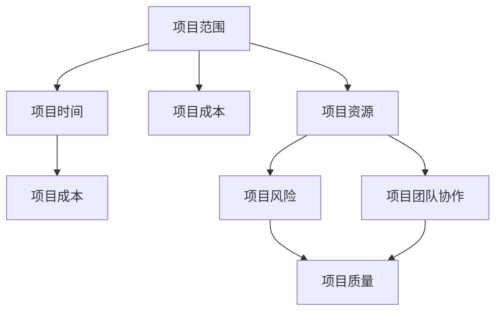

                 

### 背景介绍

项目管理在IT行业中的重要性不容忽视。随着技术的不断进步和市场需求的快速变化，企业面临的挑战日益复杂，项目管理成为了确保项目成功的关键。有效的项目管理不仅能够提高项目的成功率，还能优化资源分配、降低风险，提升团队协作效率。然而，在实际操作中，许多团队面临诸多挑战，如需求变更频繁、资源分配不均、沟通不畅等。为了解决这些问题，深入理解项目管理的核心概念和原理至关重要。

本文旨在通过系统性地阐述项目管理与领导力的关键概念，帮助读者构建全面的知识体系，并提供实用的策略和方法，以应对复杂的项目挑战。文章将分为以下几部分：

1. **项目管理基本概念**：介绍项目管理的定义、核心过程和关键术语，包括项目与运营的区别，以及项目生命周期的概念。
   
2. **项目规划与执行**：详细阐述项目规划的过程，包括范围规划、时间规划、成本规划和资源规划。然后，深入探讨项目执行的具体方法，如进度管理、风险管理、质量管理等。

3. **项目风险管理**：分析风险识别、风险评估和风险应对策略，结合实际案例进行讲解。

4. **项目团队协作与沟通**：探讨团队协作的基础知识，如角色与职责的划分、团队合作技巧。同时，介绍沟通管理的方法和技巧。

5. **项目质量管理**：讲解质量管理的原则、质量保证与控制的方法，以及质量改进实践。

6. **领导力基本概念**：介绍领导力的定义、领导风格以及领导力在团队建设中的应用。

7. **领导者的自我管理**：探讨自我认知、情绪管理以及领导者的决策能力。

8. **领导力与组织变革**：分析变革管理的驱动因素、实施策略，以及领导者在变革中的角色。

通过以上内容的逐步讲解，本文希望能够为读者提供全面的项目管理与领导力知识，帮助他们在实践中更高效地推动团队完成任务。

### 核心概念与联系

在深入探讨项目管理的基本概念之前，有必要明确几个核心概念及其相互关系。项目管理涉及到多个方面，包括项目范围、时间、成本、资源、风险、质量和团队协作等。以下是这些关键概念的定义及其相互联系：

1. **项目范围**：项目范围是指项目所包含的工作内容，即项目的边界。它明确了项目的目标、交付物和限制条件。项目范围是项目管理的基础，决定了项目的成功与否。

2. **项目时间**：项目时间是指项目从启动到完成所需要的时间周期。项目管理中的时间规划主要包括制定项目进度计划、监控项目进度和调整项目计划等。

3. **项目成本**：项目成本是指完成项目所需的全部资源投入，包括人力、设备、材料和咨询服务等。成本规划和管理是确保项目在预算范围内完成的关键。

4. **项目资源**：项目资源包括人力资源、物质资源和信息资源。资源规划和管理是确保项目能够按照计划顺利进行的重要环节。

5. **项目风险**：项目风险是指可能影响项目目标实现的不确定因素。风险管理是识别、评估和应对这些风险，以降低其对项目的影响。

6. **项目质量**：项目质量是指项目交付物的满足度，即是否达到项目需求和预期标准。质量管理确保项目交付物符合质量要求，提高客户满意度。

7. **项目团队协作**：项目团队协作是指项目团队成员之间的合作和沟通。有效的团队协作可以提升工作效率，降低冲突，促进项目的成功。

**核心概念之间的联系**

- **项目范围与时间、成本、资源**：项目范围决定了项目的具体工作内容和需求，直接影响到项目的时间、成本和资源规划。
- **项目时间与成本**：项目的时间安排需要考虑资源的使用和成本的控制，时间延迟可能导致额外的成本支出。
- **项目资源与风险**：资源的不合理分配或短缺可能导致项目风险的增加，如延误、预算超支和质量问题。
- **项目风险与质量**：有效的风险管理有助于降低风险对项目质量的影响，确保项目交付物的质量。
- **项目团队协作与项目质量**：团队协作有助于提高项目执行效率，减少错误和遗漏，从而提升项目质量。

为了更好地理解这些概念之间的联系，我们可以使用Mermaid流程图来展示它们的关系：

通过这个流程图，我们可以清晰地看到项目管理各个核心概念之间的相互联系，从而为项目管理的实施提供理论支持。接下来，我们将进一步探讨每个核心概念的具体内容和实际应用。

### 项目管理原理与流程

项目管理原理和流程是确保项目成功完成的基础。一个有效的项目管理流程可以帮助团队在项目过程中保持清晰的视野和明确的行动计划。以下将详细介绍项目管理的基本原理与流程，包括项目启动、项目规划、项目执行和项目监控与控制。

#### 项目管理知识体系

项目管理知识体系（Project Management Body of Knowledge, PMBoK）是由项目管理研究所（Project Management Institute, PMI）定义的，涵盖了项目管理的主要领域和过程组。PMBoK包括以下知识领域：

1. **项目整合管理**：涉及项目的整体管理和协调，确保项目目标一致并得到有效实现。
2. **项目范围管理**：确保项目包含和排除的内容明确，以防止范围蔓延。
3. **项目时间管理**：涉及项目时间规划和进度控制，确保项目按时完成。
4. **项目成本管理**：涉及项目成本的估算、预算和控制，确保项目在预算范围内完成。
5. **项目质量管理**：确保项目交付物符合预定的质量标准。
6. **项目资源管理**：涉及项目资源（如人力、物质、设备等）的规划、分配和管理。
7. **项目沟通管理**：确保项目信息在团队内和项目相关方之间有效传递。
8. **项目风险管理**：识别、评估和应对项目风险，以降低其对项目目标的影响。
9. **项目采购管理**：涉及外部采购过程的管理，包括合同管理和供应商选择。

#### 项目启动流程

项目启动是项目管理的第一步，其主要目标是明确项目的目标、范围和可行性，并建立项目团队。项目启动流程包括以下步骤：

1. **项目立项**：确定项目的立项依据，如项目需求、预算、资源等。
2. **项目目标定义**：明确项目的目标，包括成果性目标和约束性目标。
3. **项目范围定义**：明确项目的范围，包括项目包含和排除的工作内容。
4. **项目可行性分析**：评估项目的可行性，包括技术、财务、市场等方面的风险。
5. **项目团队组建**：组建项目团队，明确团队成员的角色和职责。

#### 项目规划流程

项目规划是项目管理的核心环节，它为项目实施提供了详细的计划和指导。项目规划流程包括以下步骤：

1. **范围规划**：明确项目的详细范围，包括项目的可交付成果和验收标准。
2. **时间规划**：制定项目的时间计划，包括项目的关键路径、里程碑和任务的时间安排。
3. **成本规划**：估算项目的总成本，并制定预算计划，包括各项费用的分配和管理。
4. **资源规划**：确定项目所需的资源，包括人力资源、物资资源和设备等。
5. **风险管理计划**：识别项目风险，并制定相应的应对策略。
6. **质量规划**：确保项目交付物符合预定的质量标准，包括质量控制和质量保证措施。
7. **沟通管理计划**：制定项目沟通计划，包括沟通频率、渠道和方法等。
8. **采购管理计划**：明确项目采购的需求、标准和流程。

#### 项目执行流程

项目执行是项目计划的具体实施阶段，项目团队根据项目计划进行各项任务的工作。项目执行流程包括以下步骤：

1. **任务分配**：将项目任务分配给团队成员，明确每个人的职责和任务目标。
2. **进度监控**：定期监控项目进度，确保各项任务按计划进行。
3. **风险管理**：监控项目风险，及时采取应对措施，减少风险对项目的影响。
4. **质量管理**：执行质量管理和质量控制措施，确保项目交付物的质量。
5. **沟通协调**：确保项目信息的及时传递和沟通，解决项目中的问题。

#### 项目监控与控制流程

项目监控与控制是在项目执行过程中对项目进行持续监控和调整，以确保项目按计划进行。项目监控与控制流程包括以下步骤：

1. **项目状态报告**：定期生成项目状态报告，包括项目进度、成本、风险和质量等方面的信息。
2. **项目偏差分析**：分析项目实际进度与计划之间的偏差，找出偏差原因。
3. **项目调整**：根据项目偏差分析的结果，调整项目计划，确保项目按计划进行。
4. **项目变更管理**：处理项目变更请求，确保变更得到有效控制。
5. **项目收尾**：完成所有项目任务，进行项目验收和总结，确保项目目标的实现。

通过以上项目管理原理和流程的详细介绍，我们可以看到项目管理是一个系统化、结构化的过程，涉及多个环节和步骤。有效的项目管理不仅能够提高项目的成功率，还能提升团队协作效率和资源利用率，从而为企业的长期发展提供有力支持。

### 项目规划与执行

项目规划与执行是项目管理中至关重要的环节，它决定了项目是否能够按时、按预算、高质量地完成。项目规划主要包括范围规划、时间规划、成本规划和资源规划，而项目执行则侧重于如何将规划转化为实际成果。下面将详细探讨这些内容。

#### 项目规划

**范围规划**

范围规划是项目规划的首要步骤，其目的是明确项目的具体内容和界限，防止项目范围蔓延。范围规划的主要任务是：

1. **项目需求分析**：收集并分析项目相关方的需求和期望，确保项目目标清晰明确。
2. **范围定义**：定义项目的可交付成果和验收标准，明确项目的边界，包括项目的工作内容和排除的工作内容。
3. **工作分解结构（WBS）**：将项目任务分解成更小、更具体的子任务，形成WBS，以便更好地管理和监控项目进度。

**时间规划**

时间规划是项目规划的核心，它决定了项目的进度和里程碑。时间规划的主要任务包括：

1. **项目进度计划**：根据项目的任务和工作量，制定详细的项目进度计划，包括关键路径、里程碑和任务的时间安排。
2. **时间估计**：对每个任务的持续时间进行估计，并考虑可能的偏差，制定缓冲时间。
3. **进度模型**：选择合适的项目进度模型，如Gantt图、PERT图等，以直观地展示项目进度。

**成本规划**

成本规划是确保项目在预算范围内完成的重要环节。成本规划的主要任务包括：

1. **成本估算**：根据项目的需求和工作量，对项目的总成本进行估算，包括直接成本（如人力、材料等）和间接成本（如管理费用等）。
2. **预算编制**：根据成本估算结果，制定项目的预算计划，并分配各项费用。
3. **成本控制**：监控项目成本，及时识别和纠正成本偏差，确保项目在预算范围内完成。

**资源规划**

资源规划是确保项目有足够的资源来完成任务的重要步骤。资源规划的主要任务包括：

1. **资源需求分析**：分析项目所需的各种资源，包括人力资源、物质资源和设备资源。
2. **资源分配**：根据资源需求，合理分配项目资源，确保资源的有效利用。
3. **资源管理**：监控项目资源的利用率，及时调整资源分配，以应对项目需求的变化。

#### 项目执行

**任务分配**

任务分配是将项目任务分配给团队成员，明确每个人的职责和任务目标。任务分配的主要任务包括：

1. **角色和职责定义**：明确每个团队成员的角色和职责，确保任务分配合理。
2. **任务说明**：为每个任务编写详细的说明，包括任务的目标、要求、时间安排和资源需求。
3. **任务分配**：将任务分配给相应的团队成员，并确保每个成员都了解自己的任务和责任。

**进度监控**

进度监控是确保项目按计划进行的重要步骤。进度监控的主要任务包括：

1. **进度跟踪**：定期检查项目的实际进度，与计划进度进行对比，识别偏差。
2. **进度报告**：生成项目进度报告，包括项目的关键路径、里程碑和任务完成情况。
3. **进度调整**：根据进度监控的结果，及时调整项目计划，确保项目按计划进行。

**风险管理**

风险管理是识别、评估和应对项目风险的重要步骤。风险管理的主要任务包括：

1. **风险识别**：识别项目中可能出现的风险，包括技术风险、财务风险、市场风险等。
2. **风险评估**：评估风险的可能性和影响，确定风险优先级。
3. **风险应对**：制定风险应对策略，包括风险规避、风险减轻、风险转移等。

**质量管理**

质量管理是确保项目交付物符合预定的质量标准的重要步骤。质量管理的主要任务包括：

1. **质量计划**：制定项目的质量计划，包括质量目标和质量保证措施。
2. **质量控制**：实施质量控制措施，确保项目交付物符合质量要求。
3. **质量审计**：进行质量审计，检查项目过程和交付物的质量，确保项目交付物的质量符合预期。

**沟通协调**

沟通协调是确保项目信息在团队内和项目相关方之间有效传递的重要步骤。沟通协调的主要任务包括：

1. **沟通计划**：制定项目沟通计划，包括沟通频率、渠道和方法。
2. **沟通工具**：选择合适的沟通工具，如邮件、会议、项目管理软件等。
3. **沟通反馈**：确保项目信息的及时反馈和沟通，解决项目中的问题。

通过以上项目规划与执行的具体步骤和内容，我们可以看到项目规划与执行是一个系统化、结构化的过程，需要各个环节的紧密配合和有效管理。只有通过科学的规划与严格的执行，项目才能按时、按预算、高质量地完成，为企业的长期发展提供有力支持。

### 项目风险管理

项目风险管理是项目管理中的一个关键环节，它涉及到识别、评估和应对项目中的不确定性因素，以降低这些因素对项目目标实现的影响。有效的项目风险管理不仅可以减少项目的风险暴露，还可以提高项目的成功率和团队的应对能力。下面将详细介绍项目风险管理的过程，包括风险识别、风险评估和风险应对策略。

#### 风险识别

风险识别是项目风险管理的第一步，目的是发现项目中潜在的风险。以下是风险识别的主要任务和步骤：

1. **历史数据**：通过查阅项目的历史数据，分析以往项目中出现的风险，为当前项目提供参考。
2. **专家判断**：利用项目团队成员和外部专家的经验和知识，识别项目中的潜在风险。
3. **头脑风暴**：组织项目团队进行头脑风暴，列出所有可能的风险因素。
4. **检查表**：使用预先设计的检查表，针对不同项目阶段和领域，识别可能的风险。

#### 风险评估

风险评估是确定项目风险的可能性和影响，以便进行优先级排序和资源分配。以下是风险评估的主要任务和步骤：

1. **风险分析**：对识别出的风险进行详细分析，包括风险的发生概率和潜在影响。
2. **概率评估**：评估每个风险发生的可能性，可以使用历史数据、专家判断或统计方法。
3. **影响评估**：评估每个风险对项目目标的影响程度，包括时间、成本、质量等方面。
4. **风险矩阵**：使用风险矩阵将每个风险的可能性和影响进行排序，确定风险的优先级。

#### 风险应对策略

风险应对策略是针对评估后的风险，制定相应的应对措施，以减轻风险的影响或消除风险。以下是常见的风险应对策略：

1. **规避**：通过改变项目计划或方法，避免风险的发生。
2. **减轻**：采取措施降低风险发生的概率或减少风险的影响。
3. **转移**：将风险责任转移给第三方，如购买保险或签订合同。
4. **接受**：对于无法规避或减轻的风险，制定应急计划，以应对风险的发生。

具体步骤如下：

1. **风险矩阵分析**：根据风险矩阵，分析每个风险的优先级，确定应对策略。
2. **制定应对计划**：为每个风险制定详细的应对计划，包括应对措施、责任人、时间表和预算。
3. **执行应对计划**：根据应对计划，执行相应的措施，并监控风险的变化。
4. **监控和更新**：持续监控项目中的风险，并根据实际情况更新风险应对计划。

#### 实际案例分析

以下是一个项目风险管理实际案例：

**案例背景**：某IT公司计划开发一款新软件，项目预算为100万元，预计开发周期为6个月。项目团队在项目启动阶段进行了风险识别和评估，发现以下几个主要风险：

1. **技术风险**：新技术的应用可能导致开发进度延误。
2. **需求变更**：客户需求可能随时发生变化，影响项目进度和质量。
3. **人员变动**：项目团队成员可能因个人原因离职，影响项目进度。

**风险识别**：通过专家判断和头脑风暴，项目团队列出以上潜在风险。

**风险评估**：项目团队评估了每个风险的发生概率和影响程度，确定技术风险和需求变更风险为高优先级，人员变动风险为中等优先级。

**风险应对策略**：

1. **技术风险**：提前进行技术评估和原型开发，以降低技术风险。
2. **需求变更**：建立需求变更管理流程，确保变更得到有效控制。
3. **人员变动**：制定紧急招聘计划，确保项目团队的人手充足。

**执行和监控**：项目团队按照风险应对计划执行，并在项目过程中持续监控风险的变化。通过定期的风险评估和会议，项目团队能够及时调整应对措施，确保项目顺利推进。

通过以上案例分析，我们可以看到项目风险管理在实际项目中的应用和效果。有效的风险识别、评估和应对策略能够显著降低项目的风险，提高项目的成功率和团队应对不确定性的能力。

### 项目团队协作与沟通

在项目管理中，团队协作和沟通是确保项目成功的关键因素。一个高效的项目团队不仅需要明确分工和职责，还需要通过有效的沟通和协作，确保项目目标的实现。以下将详细探讨项目团队协作的基础知识，包括团队角色的划分、团队协作技巧，以及项目沟通管理的方法和技巧。

#### 团队角色与职责

在项目管理中，明确团队角色的划分和职责分工是确保项目顺利进行的基础。常见的团队角色包括：

1. **项目经理**：负责整个项目的管理和协调，确保项目按时、按预算、高质量完成。
2. **技术负责人**：负责项目技术方案的制定和技术问题的解决。
3. **开发人员**：负责项目的开发工作，实现项目的技术需求。
4. **测试人员**：负责项目的测试工作，确保项目交付物的质量。
5. **产品经理**：负责产品的规划和设计，确保产品满足市场需求。
6. **运营人员**：负责项目的运营和维护，确保项目的持续稳定运行。

每个角色在项目中的职责不同，但相互之间需要紧密协作，共同推动项目向前发展。

#### 团队协作技巧

高效的团队协作需要团队成员之间的良好沟通和相互信任。以下是一些常见的团队协作技巧：

1. **目标一致**：确保团队成员对项目目标有共同的理解，并围绕目标开展工作。
2. **明确分工**：明确每个团队成员的职责和工作内容，避免职责重叠或空白。
3. **有效沟通**：建立多种沟通渠道，如定期会议、即时通讯工具、邮件等，确保信息的及时传递和沟通。
4. **反馈与支持**：鼓励团队成员之间的反馈和相互支持，及时解决问题和调整工作计划。
5. **共同承担责任**：团队成员应共同承担责任，避免单点故障，提高团队的稳定性和可靠性。

#### 沟通管理

有效的沟通管理是确保项目信息在团队内部和相关方之间有效传递的重要手段。以下是一些沟通管理的方法和技巧：

1. **制定沟通计划**：根据项目需求和团队特点，制定详细的沟通计划，包括沟通频率、渠道和方法。
2. **选择合适的沟通工具**：根据项目需求和团队习惯，选择合适的沟通工具，如邮件、即时通讯工具、项目管理软件等。
3. **明确沟通目标**：每次沟通前应明确沟通的目标和内容，确保沟通的有效性和针对性。
4. **倾听与反馈**：在沟通过程中，积极倾听对方的意见和需求，并及时给予反馈，确保双方的理解一致。
5. **记录和存档**：及时记录沟通内容和结果，并进行存档，以备后续参考和审计。

通过以上团队协作与沟通的管理和技巧，项目团队可以更好地协调工作，提高工作效率，确保项目目标的实现。有效的团队协作和沟通不仅能够提高项目的成功率，还能增强团队的凝聚力和信任感，为企业的长期发展奠定坚实基础。

### 项目质量管理

项目质量管理是确保项目交付物符合预定质量标准的关键环节，它直接影响到项目的成功和客户满意度。有效的质量管理不仅可以提高项目的交付质量，还可以降低成本和风险。以下将详细阐述项目质量管理的原则、质量保证与控制的方法，以及质量改进实践。

#### 质量管理原则

1. **客户至上**：以满足客户需求和期望为出发点，确保项目交付物能够满足客户需求。
2. **预防为主**：在项目过程中采取预防措施，防止质量问题的发生，而不仅仅是事后纠正。
3. **过程控制**：对项目过程中的各个阶段进行质量控制和监控，确保每个阶段的质量达到标准。
4. **持续改进**：通过不断改进质量管理体系和方法，提高项目质量和效率。

#### 质量保证与控制方法

1. **质量计划**：制定项目质量计划，明确质量目标和质量控制措施。质量计划应包括以下内容：
   - 质量目标：明确项目的质量标准和预期结果。
   - 质量控制方法：确定项目质量控制的方法和工具。
   - 质量检查点：确定项目关键阶段的质量检查点和标准。

2. **质量审查**：定期进行项目质量审查，检查项目过程和交付物的质量，确保符合质量要求。质量审查通常包括以下步骤：
   - 制定审查计划：明确审查的范围、时间、人员等。
   - 审查准备：收集相关资料，准备审查材料。
   - 审查实施：按照审查计划进行审查，记录审查结果。
   - 审查报告：编写审查报告，提出改进建议。

3. **质量保证**：通过实施质量保证措施，确保项目过程和交付物的质量。质量保证通常包括以下方法：
   - 内部审计：对项目过程进行定期审计，检查质量管理体系的实施情况。
   - 第三方认证：通过第三方认证机构对项目的质量进行认证，提高项目信誉。
   - 过程改进：根据质量审查和审计的结果，持续改进项目过程和质量管理体系。

4. **质量控制**：在项目过程中实施质量控制措施，确保项目交付物的质量。质量控制通常包括以下方法：
   - 检查和测试：对项目交付物进行详细检查和测试，确保其符合质量要求。
   - 统计过程控制：使用统计方法监控项目过程，识别和纠正质量问题。
   - 质量控制图：使用质量控制图监控项目过程的质量，分析质量趋势。

#### 质量改进实践

1. **持续改进文化**：建立持续改进的文化，鼓励团队成员积极参与质量改进活动，提高项目质量。
2. **质量改进计划**：制定质量改进计划，明确改进的目标、方法和步骤。质量改进计划应包括以下内容：
   - 改进目标：明确质量改进的具体目标。
   - 改进方法：选择合适的改进方法和技术。
   - 改进步骤：制定详细的改进步骤和时间表。
   - 改进实施：按照计划实施质量改进活动。
   - 改进评估：评估质量改进的效果，持续优化改进方案。

3. **问题解决**：建立问题解决机制，及时发现和解决项目过程中的质量问题。问题解决通常包括以下步骤：
   - 问题识别：识别项目中的质量问题。
   - 原因分析：分析问题产生的原因。
   - 解决方案：提出并实施解决问题的方案。
   - 验证和跟踪：验证解决方案的有效性，并跟踪质量问题的解决情况。

通过以上质量管理原则、方法和实践的详细阐述，我们可以看到项目质量管理对于确保项目交付物的质量和客户满意度至关重要。有效的质量管理不仅可以提高项目的成功率，还可以增强企业的核心竞争力，为企业的长期发展奠定坚实基础。

### 领导力基本概念

领导力是项目管理中不可或缺的一部分，它决定了项目团队的绩效和项目的成功。理解领导力的基本概念，包括领导力的定义、领导力的来源以及领导力与管理的区别，是培养卓越领导能力的第一步。

#### 领导力定义

领导力是指通过激励、指导和影响他人，共同实现目标和愿景的能力。它不仅仅关注任务的完成，更注重团队的整体发展和成员的个人成长。领导力包括一系列技能和行为，如沟通能力、决策能力、影响力、创新能力和团队合作精神等。

#### 领导力的来源

领导力可以从多个方面获得，包括：

1. **个人特质**：领导者的个性特征，如自信、责任心、决断力等，是领导力的基础。
2. **知识和技能**：领导者通过不断学习和积累，获取的专业知识和技能，如技术知识、管理技能等。
3. **社会关系**：领导者与团队成员、同事和上级之间的关系网络，这些关系有助于建立领导力和影响力。
4. **经验**：通过实际工作经历，领导者积累的经验和教训，有助于提升领导能力。

#### 领导力与管理的区别

虽然领导力和管理在某些方面有交集，但它们有本质的区别：

1. **目标**：管理侧重于实现特定的目标，如完成任务、控制成本等。领导力则更关注团队的长远发展和愿景实现。
2. **作用**：管理主要关注如何有效地组织和利用资源，确保任务的完成。领导力则关注如何激发团队成员的潜力，提升团队的整体绩效。
3. **对象**：管理通常涉及任务的分配、监督和评估，而领导力则涉及激励、指导、支持和培养团队成员。
4. **方法**：管理更多地依赖于制度和流程，而领导力则依赖于人际沟通和影响力。

通过以上对领导力基本概念的分析，我们可以看到领导力在项目管理中的重要性。有效的领导力不仅能够提高团队的执行力，还能促进团队的积极性和创造力，为项目的成功提供坚实保障。接下来，我们将进一步探讨领导风格与团队建设，帮助读者了解如何在实际项目中应用领导力。

### 领导风格与团队建设

领导风格是领导者在其管理行为中表现出来的相对稳定和一致的倾向。不同的领导风格对团队的发展和绩效有着显著的影响。以下将介绍几种常见的领导风格，分析它们对团队建设的影响，并探讨在不同情境下选择适合的领导风格。

#### 领导风格及其对团队建设的影响

1. **权威型领导**：权威型领导者具有高度的决策权和控制力，倾向于集中权力和制定明确的规则。这种领导风格在紧急情况下或对高绩效团队尤其有效，因为它能够迅速作出决策并确保执行。然而，过度使用权威型领导可能导致团队成员的积极性下降和创造力受限。

2. **参与型领导**：参与型领导者鼓励团队成员参与决策过程，重视团队成员的意见和建议。这种领导风格有助于增强团队的归属感和责任感，提高团队成员的工作满意度和绩效。然而，参与型领导可能需要更多时间来达成共识，在某些需要快速决策的情况下可能不够高效。

3. **任务型领导**：任务型领导者专注于任务和目标的实现，强调效率和执行力。这种领导风格适用于需要高度集中和资源优化的项目，能够确保团队目标的实现。然而，任务型领导容易忽视团队成员的情感需求，可能导致团队紧张和压力增加。

4. **变革型领导**：变革型领导者通过激励和启发团队成员，推动团队实现变革和进步。这种领导风格能够激发团队成员的潜力和创造力，促进团队创新和成长。然而，变革型领导需要具备强大的影响力和沟通能力，否则可能导致团队的不满和抗拒。

#### 不同情境下的领导风格选择

选择适合的领导风格取决于项目阶段、团队成员特点和环境因素。以下是一些常见情境下的领导风格选择：

1. **初期启动阶段**：在项目初期，团队需要建立信任和明确方向。此时，参与型和变革型领导风格较为合适，能够促进团队成员的参与和认同。

2. **执行阶段**：在项目执行过程中，任务型领导风格有助于确保任务的顺利完成。通过明确的任务分配和进度监控，可以提升团队效率和执行力。

3. **危机管理阶段**：在项目面临危机时，权威型领导风格能够迅速作出决策并统一行动，确保危机得到有效控制。

4. **长期发展阶段**：在项目长期发展过程中，变革型领导风格有助于推动团队创新和持续改进，促进项目的可持续发展。

#### 团队建设

团队建设是提升团队协作效率和绩效的重要手段。以下是一些团队建设的策略：

1. **明确目标和期望**：确保团队成员对项目的目标和期望有共同的理解和认同，促进团队协作。

2. **增强团队凝聚力**：通过团队建设活动和沟通，增强团队成员之间的信任和凝聚力，提高团队的整体绩效。

3. **培养团队合作精神**：鼓励团队成员相互支持和协作，建立合作共赢的团队文化。

4. **持续培训与发展**：提供团队成员必要的培训和发展机会，提升团队整体能力和竞争力。

通过以上对领导风格与团队建设的分析，我们可以看到选择适合的领导风格和有效的团队建设策略对于项目管理的成功至关重要。有效的领导风格和团队建设不仅能够提高项目的执行力，还能增强团队的凝聚力和创造力，为项目的成功奠定坚实基础。

### 领导者的自我管理

领导者的自我管理是提升领导力的重要环节，它涉及到自我认知、情绪管理以及决策能力的培养。以下将详细探讨这些方面，帮助领导者更好地进行自我管理，提高领导效能。

#### 自我认知

自我认知是指领导者对自己性格、能力、行为和动机的深入了解。以下是自我认知的几个关键点：

1. **反思**：定期进行自我反思，评估自己的行为和决策，识别自身的优点和不足。可以通过写日记、参加反思小组或寻求反馈来进行反思。
2. **心理测试**：通过心理测试工具，如MBTI（迈尔斯-布里格斯类型指标）或DISC测评，了解自己的性格特点和偏好，以便更好地与他人沟通和合作。
3. **学习与成长**：不断学习新知识、新技能，参加培训和工作坊，以提升自己的专业能力和领导水平。

#### 情绪管理

情绪管理是领导者处理情绪波动和压力的能力。以下是几种有效的情绪管理策略：

1. **情绪识别**：学会识别和理解自己的情绪，如愤怒、焦虑、兴奋等。通过情绪识别，可以更好地控制情绪，避免情绪冲动影响决策。
2. **情绪表达**：学会以健康的方式表达情绪，避免压抑或发泄。可以通过与信任的朋友、同事或专业心理咨询师交流来释放情绪。
3. **情绪调节**：采用深呼吸、冥想、运动等放松技巧来调节情绪，减轻压力。定期进行身体锻炼和心理放松，有助于提升情绪稳定性和应对压力的能力。

#### 决策能力

决策能力是领导者的一项核心能力，它涉及到如何从多种选择中做出最优决策。以下是提升决策能力的几种方法：

1. **信息收集与分析**：在做出决策前，广泛收集相关信息，并进行深入分析。确保决策基于事实和数据，而不是直觉或主观判断。
2. **风险评估**：对每个决策方案进行风险评估，评估其可能带来的风险和影响。通过风险分析，可以更好地识别潜在问题，并采取预防措施。
3. **多角度思考**：从不同角度和视角考虑问题，考虑不同的解决方案和潜在后果。通过多角度思考，可以避免思维定势，发现更好的决策方案。
4. **决策模型**：使用决策模型，如SWOT分析（优势、劣势、机会、威胁）或决策树模型，帮助系统化地分析问题和制定决策。
5. **反思与调整**：在决策后，进行反思和评估，分析决策的效果和教训。通过不断反思和调整，可以提高决策能力和水平。

#### 实际案例分析

以下是一个关于情绪管理和决策能力实际案例：

**案例背景**：一位项目经理在一次重要的项目评估会议中，面临关键决策。由于项目延期，他感到巨大的压力和焦虑，这影响了他的情绪和决策。

**情绪管理策略**：

1. **情绪识别**：项目经理意识到自己感到焦虑和压力，这是由于项目延期和责任重大导致的。
2. **情绪表达**：他找了一个信任的同事倾诉自己的情绪，释放了压力。
3. **情绪调节**：通过深呼吸和冥想，项目经理平静了情绪，恢复了冷静。

**决策能力策略**：

1. **信息收集与分析**：项目经理收集了项目的最新数据，分析了项目进展和潜在的风险。
2. **风险评估**：他评估了继续按原计划推进项目的风险，包括成本增加和客户不满的风险。
3. **多角度思考**：项目经理考虑了多个解决方案，包括加快开发进度、调整项目计划和寻求外部支持等。
4. **决策模型**：使用决策树模型，项目经理分析了每个方案的优缺点和潜在风险。

**决策过程**：

1. **制定方案**：项目经理制定了三个备选方案，包括继续按原计划推进、调整项目计划和寻求外部支持。
2. **评估与选择**：根据风险评估和多角度思考的结果，项目经理选择了调整项目计划的方案。
3. **实施与监控**：项目经理开始实施调整计划，并设立了监控机制，确保项目进度和质量。

通过以上策略，项目经理成功处理了情绪波动，并做出了明智的决策，确保项目得以顺利推进。

通过自我认知、情绪管理和决策能力的提升，领导者可以更好地应对各种挑战，提高领导效能，带领团队实现目标。

### 领导者的决策能力

领导者的决策能力是影响项目成功的关键因素之一。有效的决策能力不仅能够帮助领导者快速做出正确的决策，还能够提升团队的整体绩效和项目的成功率。以下将详细探讨领导者在决策过程中所使用的模型和策略，并结合实际案例进行分析。

#### 决策过程模型

1. **识别问题**：这是决策过程的起点，领导者需要准确地识别问题的性质和范围。可以通过收集信息、分析数据和与团队成员沟通来实现。

2. **明确目标**：在问题识别之后，领导者需要明确决策的目标和期望结果。这有助于确保决策的方向和最终目标一致。

3. **收集信息**：领导者需要收集与决策相关的各种信息，包括市场趋势、竞争对手情况、团队能力等。通过全面的信息收集，可以提高决策的准确性和全面性。

4. **分析信息**：对收集到的信息进行深入分析，识别关键因素和潜在风险。可以使用SWOT分析、五力模型等方法来分析信息。

5. **制定方案**：基于分析结果，制定多个可能的解决方案。每个方案都需要考虑其可行性、成本和潜在风险。

6. **评估方案**：对每个方案进行评估，比较其优缺点和风险。可以使用决策树、成本效益分析等方法来评估方案。

7. **选择方案**：根据评估结果，选择最佳方案。选择方案时，领导者需要考虑各种因素，包括可行性、成本、风险和团队支持等。

8. **实施决策**：将决策方案转化为具体的行动计划，并确保团队成员了解和执行决策。

9. **监控和调整**：在决策实施过程中，领导者需要持续监控决策效果，并根据实际情况进行调整。这有助于确保决策的及时性和有效性。

#### 决策策略

1. **系统化决策**：领导者应采用系统化的决策方法，如决策树、成本效益分析等，以确保决策的客观性和科学性。

2. **多角度思考**：在制定和评估方案时，领导者应从多个角度思考问题，考虑不同的解决方案和潜在后果。

3. **参与决策**：鼓励团队成员参与决策过程，提高决策的多样性和全面性。团队成员的意见和建议可以为领导者提供新的视角和思路。

4. **利用数据**：领导者应依赖数据来支持决策，避免主观判断和偏见。通过数据驱动决策，可以降低决策错误的风险。

5. **决策备选方案**：在决策过程中，领导者应准备多个备选方案，以应对可能出现的突发情况和变化。

#### 实际案例分析

以下是一个关于领导者决策能力的实际案例：

**案例背景**：一家科技公司正面临一个关键决策：是否扩大当前的产品线以进入新兴市场。项目经理需要做出决策，以便在市场上占据有利位置。

**决策过程**：

1. **识别问题**：项目经理识别到公司需要在新市场上获得更大的市场份额，以实现长期增长。

2. **明确目标**：项目经理明确了决策的目标，即在新兴市场上成功推出新产品。

3. **收集信息**：项目经理收集了关于新兴市场的数据，包括市场规模、竞争态势、消费者偏好等。

4. **分析信息**：通过分析数据，项目经理发现新兴市场的潜力很大，但竞争也非常激烈。

5. **制定方案**：项目经理制定了三个备选方案：
   - 扩大产品线，全力进入新兴市场。
   - 在新兴市场进行试点，逐步扩大投入。
   - 保持现有产品线，专注于当前市场的稳定增长。

6. **评估方案**：
   - 扩大产品线：市场潜力大，但投入风险高。
   - 试点进入：风险较低，但市场份额增长缓慢。
   - 稳定增长：风险低，但市场份额增长有限。

7. **选择方案**：根据评估结果，项目经理选择了试点进入新兴市场的方案。

8. **实施决策**：项目经理制定了详细的实施计划，并开始了市场调研和产品开发。

9. **监控和调整**：在试点期间，项目经理持续监控市场反应和产品表现，并根据反馈进行调整。

通过以上案例，我们可以看到，有效的决策能力对于领导者在复杂情况下做出正确决策至关重要。领导者应通过系统化的决策过程、多角度思考、数据支持和团队参与，不断提高自己的决策能力，以推动项目的成功和团队的持续发展。

### 领导力与组织变革

在快速变化的市场环境中，组织变革成为企业持续发展和竞争力提升的关键。有效的领导力在推动组织变革中起着至关重要的作用，领导者的角色和策略直接影响到变革的成败。以下将详细探讨组织变革的驱动因素、实施策略以及领导者在变革中的角色和团队管理。

#### 变革驱动因素

组织变革的驱动因素多种多样，主要包括以下几个方面：

1. **外部环境变化**：市场需求的快速变化、竞争压力、技术进步等外部环境变化，迫使企业进行变革以适应新形势。

2. **内部管理问题**：企业内部的管理流程、组织结构、文化等方面的问题，如效率低下、沟通不畅、创新能力不足等，也是推动变革的重要因素。

3. **战略调整**：企业根据长期发展战略的需要，对业务模式、市场定位、产品线等进行调整，以实现战略目标。

4. **法律法规**：政府法规、行业标准等的变化，要求企业进行合规调整，以避免法律风险。

#### 变革实施策略

有效的变革实施策略包括以下几个关键步骤：

1. **明确变革目标**：领导者需要明确变革的目标和愿景，确保全体员工对变革有共同的理解和认同。

2. **建立变革团队**：成立专门的变革团队，负责规划和执行变革项目。团队成员应包括高层管理者、相关职能部门负责人以及一线员工，以保障变革的全面性和参与度。

3. **制定详细计划**：制定详细的变革计划，包括变革的目标、步骤、时间表、资源需求、风险管理等。确保变革计划的可行性和可控性。

4. **沟通与动员**：通过有效的沟通手段，向全体员工传达变革的必要性和目标，动员员工积极参与变革。可以采用会议、内部邮件、培训等方式，确保信息传递的准确性和及时性。

5. **逐步推进**：变革应采取逐步推进的策略，避免一次性改变过多，造成员工的不适应和抵触。通过试点项目或阶段性的变革，逐步积累经验和改进。

6. **持续监控与调整**：在变革过程中，持续监控变革的进展和效果，根据实际情况进行及时调整。通过定期评估和反馈，确保变革目标的实现。

7. **激励机制**：建立激励机制，鼓励员工积极参与变革。可以通过奖励、晋升、荣誉等方式，激发员工的积极性和创造力。

#### 领导者在变革中的角色和团队管理

领导者在组织变革中扮演着关键角色，以下是他们应关注的几个方面：

1. **领导风格**：领导者应根据变革的情境选择合适的领导风格。在变革初期，可能需要采用变革型领导风格，激发员工的参与和积极性；在变革推进过程中，则可能需要采用参与型或权威型领导风格，确保变革的顺利进行。

2. **沟通能力**：领导者应具备出色的沟通能力，确保变革信息在团队内部的准确传递和充分理解。通过开放沟通和有效反馈，消除员工的疑虑和抗拒。

3. **角色示范**：领导者应通过自身的言行示范，展示对变革的支持和承诺。通过身体力行，引领员工积极参与变革。

4. **团队建设**：领导者应加强团队建设，培养团队的凝聚力和协作精神。通过团队活动和团队文化建设，增强员工的归属感和责任感。

5. **激励机制**：领导者应建立激励机制，鼓励员工在变革中的表现和贡献。通过奖励、晋升等激励措施，激发员工的积极性和创造力。

6. **反馈与调整**：领导者应鼓励员工提供反馈，并根据反馈进行及时调整。通过不断优化变革策略，确保变革目标的实现。

通过以上对领导力与组织变革的探讨，我们可以看到领导者在推动组织变革中的关键作用。有效的领导力和团队管理，不仅能够提高变革的成功率，还能促进企业的长期发展和竞争力的提升。

### 总结与最佳实践

在本文中，我们系统地探讨了项目管理与领导力的核心概念和实践，从项目管理的基本概念、项目规划与执行、风险管理、团队协作与沟通、质量管理，到领导力基本概念、领导风格与团队建设、领导者的自我管理、决策能力、组织变革等多个方面。以下是本文的核心内容总结和最佳实践建议。

#### 核心内容总结

1. **项目管理基本概念**：项目管理是系统化、结构化的方法，旨在实现项目目标。项目管理涉及范围规划、时间规划、成本规划、资源规划等多个环节。

2. **项目规划与执行**：项目规划是确保项目成功的关键，包括明确项目目标、制定详细的计划、资源分配和进度监控。执行阶段则侧重于任务分配、进度监控和风险管理。

3. **项目风险管理**：识别、评估和应对项目风险是项目成功的关键。通过系统化的风险评估和应对策略，可以降低风险对项目的影响。

4. **项目团队协作与沟通**：团队协作是确保项目顺利进行的重要因素。有效的团队协作和沟通管理，可以提高项目效率和团队凝聚力。

5. **项目质量管理**：质量管理确保项目交付物符合预定的质量标准。通过质量计划和持续改进，可以提高项目的质量和客户满意度。

6. **领导力基本概念**：领导力是影响团队绩效和项目成功的关键。领导力涉及自我认知、情绪管理、决策能力等多个方面。

7. **领导风格与团队建设**：不同的领导风格对团队建设有不同影响。有效的领导风格和团队建设策略，可以提升团队协作效率和团队绩效。

8. **领导者的自我管理**：自我认知、情绪管理和决策能力是领导者成功的关键。通过持续的自我提升，可以提高领导效能。

9. **组织变革**：领导者在推动组织变革中扮演着关键角色。有效的变革策略和领导力，可以确保变革的成功和企业的持续发展。

#### 最佳实践建议

1. **系统化项目管理**：制定详细的计划，明确项目目标和各个阶段的工作内容，确保项目有序推进。

2. **风险管理**：建立完善的风险管理体系，定期进行风险评估，制定有效的应对策略。

3. **团队协作**：建立高效的团队协作机制，确保团队成员之间的沟通和协作，提高项目效率。

4. **质量管理**：制定明确的质量标准，通过质量计划和持续改进，确保项目交付物的质量。

5. **领导力发展**：通过培训、反思和实践，不断提升领导力和团队管理能力。

6. **变革管理**：制定详细的变革计划，确保变革目标的实现，通过有效的领导力和团队管理，推动变革的顺利进行。

通过以上总结和建议，我们希望能够为读者提供实用的项目管理与领导力知识，帮助他们在实践中更高效地推动团队完成任务，实现项目的成功。

### 注意事项与拓展阅读

在项目管理与领导力的实践中，以下是一些需要注意的事项和拓展阅读资源，以帮助读者更深入地理解和应用本文内容：

#### 注意事项

1. **项目目标明确性**：确保项目目标明确、具体、可量化，有助于团队更好地理解和执行。

2. **风险管理意识**：建立风险管理意识，定期识别和评估项目风险，提前制定应对策略。

3. **持续沟通**：保持项目过程中的持续沟通，确保信息透明，减少误解和冲突。

4. **质量管理持续改进**：在项目过程中不断进行质量检查和改进，确保项目交付物的质量。

5. **自我管理**：领导者应注重自我管理，包括情绪管理和决策能力的提升，以更好地应对项目挑战。

#### 拓展阅读

1. **《项目管理知识体系指南》（PMBoK）**：了解项目管理的基础理论和最佳实践。

2. **《领导力与影响力》**：探讨领导力理论和实际应用，提升领导力技能。

3. **《变革之舞：领导力如何塑造文化、推动变革》**：研究组织变革中的领导力策略。

4. **《敏捷项目管理》**：学习敏捷方法在项目管理中的应用，提高项目灵活性和响应速度。

5. **《精益创业》**：了解精益创业方法，通过快速迭代和客户反馈优化项目。

通过以上注意事项和拓展阅读资源，读者可以更全面地掌握项目管理与领导力的知识，并在实践中不断提升自己的能力和水平。

