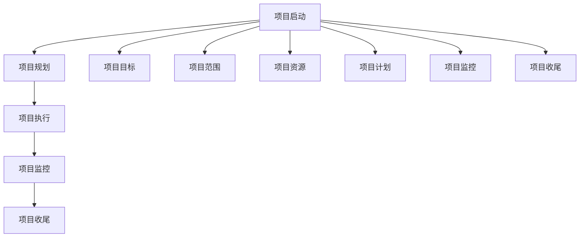
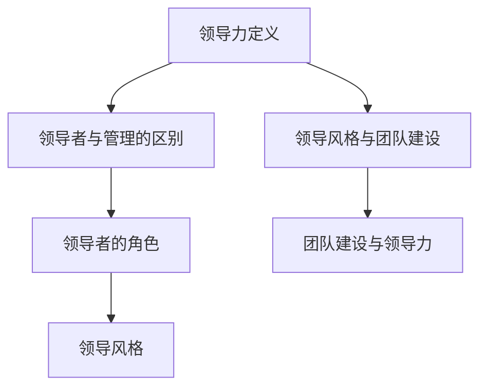
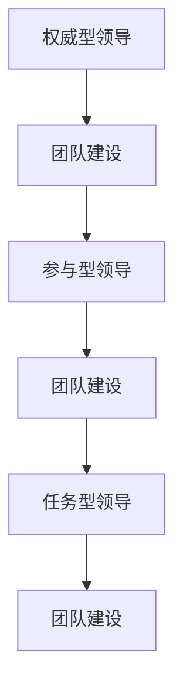
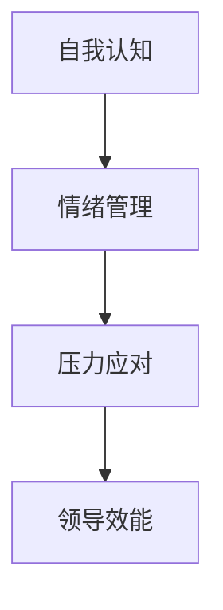
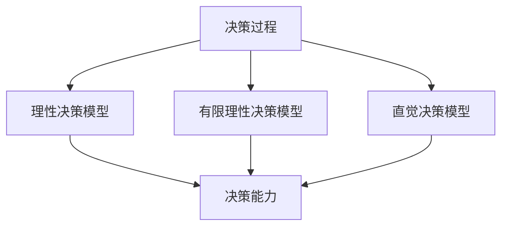
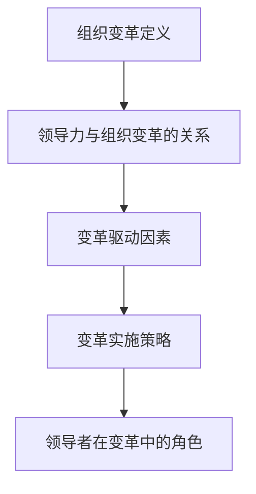

                 

### 项目管理与领导力：推动团队高效完成任务

关键词：项目管理、领导力、团队协作、高效完成任务

摘要：本文从项目管理与领导力的角度，探讨了如何推动团队高效完成任务。首先，我们明确了项目管理的核心概念，包括项目与运营的区别、项目生命周期等。接着，详细阐述了项目规划与执行、项目风险管理、项目团队协作与沟通以及项目质量管理等方面的内容。随后，我们探讨了领导力基本概念、领导风格与团队建设、领导者的自我管理、领导者的决策能力以及领导力与组织变革等方面的内容。最后，通过项目实战案例分析，总结了推动团队高效完成任务的最佳实践，并提出了注意事项和拓展阅读建议。

----------------------------------------------------------------

## 第一部分：项目管理基础

### 第1章：项目管理基本概念

> **项目管理定义：** 项目管理是指通过系统化、结构化的方法来计划、执行、监控和收尾项目，以实现既定的目标和预期结果。它涵盖了项目生命周期中的各个方面，包括项目启动、项目规划、项目执行、项目监控和项目收尾。

#### 背景介绍

项目管理作为现代企业运作中至关重要的一环，对于项目的成功与否具有决定性影响。传统的项目管理通常涉及项目范围、时间、成本、质量和风险等多个方面的管理。然而，随着信息技术的发展和团队合作方式的演变，现代项目管理更加注重团队协作、沟通和领导力。因此，本文旨在从项目管理与领导力的角度，系统性地探讨如何推动团队高效完成任务。

#### 核心概念与联系

项目管理涉及多个核心概念，它们相互关联，构成了项目管理的知识体系。以下是几个关键概念及其相互关系：

1. **项目与运营区别**：项目具有临时性和独特性，而运营则侧重于持续的业务流程。项目通常为了实现特定目标而启动，一旦目标达成，项目即宣告结束。运营则是在现有流程上进行优化和持续执行。

2. **项目生命周期**：项目生命周期是指项目从启动到收尾的整个过程。它通常包括项目启动、项目规划、项目执行、项目监控和项目收尾五个阶段。每个阶段都有其特定的任务和目标。

3. **项目目标**：项目目标是指项目需要实现的具体成果和期望结果。明确的项目目标有助于指导项目团队的工作，确保项目朝着正确的方向前进。

4. **项目范围**：项目范围是指项目需要完成的全部工作。它定义了项目的边界，确保项目团队不会在项目之外的工作上浪费时间和资源。

5. **项目资源**：项目资源包括人力、物资、设备和资金等。合理规划和使用项目资源是项目管理的重要任务，它直接影响到项目的成本和进度。

6. **项目计划**：项目计划是指为实现项目目标而制定的详细行动计划。项目计划包括项目进度计划、成本计划、资源计划和质量计划等。

7. **项目监控**：项目监控是指对项目进展的实时跟踪和评估。通过项目监控，项目经理可以及时发现并解决问题，确保项目按照计划顺利进行。

8. **项目收尾**：项目收尾是指项目完成后的工作，包括项目总结、评估和交付。项目收尾有助于确保项目的成果得到充分利用，并为未来项目提供经验和教训。

#### Mermaid 流程图



#### 项目管理原理与流程

项目管理原理主要包括以下几方面：

1. **项目计划原理**：项目计划原理旨在确保项目团队有一个明确的行动指南。它包括项目范围、时间、成本、质量和风险等方面的规划。

2. **项目执行原理**：项目执行原理关注如何按照项目计划完成任务。它涉及到任务分配、进度跟踪和资源管理等。

3. **项目监控原理**：项目监控原理是指对项目进展进行实时跟踪和评估，以便及时调整计划，确保项目按计划进行。

4. **项目收尾原理**：项目收尾原理包括项目总结、评估和交付。它有助于确保项目成果得到充分利用，并为未来项目提供经验和教训。

项目管理的流程通常包括以下步骤：

1. **项目启动**：明确项目目标、范围和资源，组建项目团队。

2. **项目规划**：制定项目计划，包括进度、成本、资源和质量等方面的规划。

3. **项目执行**：按照项目计划执行任务，监控项目进展，确保项目按计划进行。

4. **项目监控**：实时跟踪项目进展，评估项目绩效，发现问题并采取措施。

5. **项目收尾**：完成项目总结和评估，交付项目成果，解散项目团队。

#### 项目管理工具与方法

1. **项目管理工具**：常用的项目管理工具有 Jira、Trello、Asana 等，它们可以帮助项目团队更好地进行任务分配、进度跟踪和沟通协作。

2. **项目管理方法**：常用的项目管理方法包括 PMP（项目管理专业人士）、PRINCE2（项目管理方法论）和 Scrum（敏捷开发）等。每种方法都有其特定的流程和工具，适用于不同的项目情境。

### 第2章：项目规划与执行

> **项目规划与执行**：项目规划是指为项目制定详细的行动计划，包括项目范围、时间、成本、资源和质量等方面的规划。项目执行是指按照项目计划执行任务，确保项目按计划进行。

#### 背景介绍

项目规划与执行是项目管理中的关键环节。项目规划是项目成功的基石，它确保项目团队有一个明确的行动指南。项目执行则是将规划付诸实践，通过有效的团队协作和资源管理，实现项目目标。本章将详细阐述项目规划与执行的具体内容。

#### 项目规划

项目规划是指为项目制定详细的行动计划。项目规划的主要内容包括：

1. **项目范围规划**：明确项目需要完成的全部工作，定义项目的边界。

2. **项目时间规划**：确定项目各阶段的时间安排，制定项目进度计划。

3. **项目成本规划**：估算项目各阶段的成本，制定项目成本预算。

4. **项目资源规划**：分配项目所需的人力、物资和设备等资源。

5. **项目质量管理**：确定项目质量标准，制定质量保证计划。

6. **项目风险规划**：识别项目潜在的风险，制定风险应对策略。

#### 项目执行

项目执行是指按照项目计划执行任务，确保项目按计划进行。项目执行的主要内容包括：

1. **任务分配**：将项目任务分配给项目团队成员，明确每个人的职责和任务。

2. **进度跟踪**：监控项目进展，确保任务按照计划进行。

3. **资源管理**：合理分配和使用项目资源，确保项目顺利进行。

4. **质量管理**：执行质量保证计划，确保项目成果符合质量标准。

5. **风险管理**：监控项目风险，采取应对措施，降低风险对项目的影响。

#### 项目监控与控制

项目监控与控制是指对项目进展进行实时跟踪和评估，确保项目按计划进行。项目监控与控制的主要内容包括：

1. **项目进度监控**：定期评估项目进度，发现并解决进度偏差。

2. **项目成本监控**：监控项目成本支出，确保项目成本在预算范围内。

3. **项目质量监控**：评估项目成果质量，确保项目成果符合质量标准。

4. **变更管理**：处理项目变更，确保项目变更得到有效控制。

5. **项目报告与沟通**：定期向项目利益相关者报告项目进展，确保信息畅通。

### Python 源代码：项目规划与执行

```python
import pandas as pd

# 项目规划表
project_plan = pd.DataFrame({
    '任务': ['需求分析', '设计', '开发', '测试', '上线'],
    '开始时间': [pd.Timestamp('2023-04-01'), pd.Timestamp('2023-04-05'), pd.Timestamp('2023-04-10'), pd.Timestamp('2023-04-15'), pd.Timestamp('2023-04-20')],
    '结束时间': [pd.Timestamp('2023-04-04'), pd.Timestamp('2023-04-09'), pd.Timestamp('2023-04-14'), pd.Timestamp('2023-04-19'), pd.Timestamp('2023-04-24')]
})

# 项目执行表
project_execution = pd.DataFrame({
    '任务': ['需求分析', '设计', '开发', '测试', '上线'],
    '实际开始时间': [pd.Timestamp('2023-04-01'), pd.Timestamp('2023-04-05'), pd.Timestamp('2023-04-10'), pd.Timestamp('2023-04-15'), pd.Timestamp('2023-04-20')],
    '实际结束时间': [pd.Timestamp('2023-04-04'), pd.Timestamp('2023-04-09'), pd.Timestamp('2023-04-14'), pd.Timestamp('2023-04-19'), pd.Timestamp('2023-04-24')],
    '状态': ['已完成', '已完成', '进行中', '进行中', '未开始']
})

# 进度跟踪
def track_progress(execution):
    progress = execution['状态'].value_counts()
    return progress

progress = track_progress(project_execution)
print(progress)

# 成本监控
def cost_monitoring(plan, execution):
    total_budget = plan['预算'].sum()
    total_spent = execution['成本'].sum()
    return total_budget, total_spent

total_budget, total_spent = cost_monitoring(project_plan, project_execution)
print(f"Total Budget: {total_budget}")
print(f"Total Spent: {total_spent}")

# 质量监控
def quality_monitoring(execution):
    quality_issues = execution[execution['质量状态'] != '符合标准']]
    return quality_issues

quality_issues = quality_monitoring(project_execution)
print(quality_issues)
```

#### 数学模型与公式

1. **项目进度延迟公式**：

   $$\Delta T = \frac{E-E}{P}$$

   其中，\(\Delta T\) 表示项目进度延迟时间，\(E\) 表示实际完成时间，\(P\) 表示计划完成时间。

2. **项目成本超支公式**：

   $$\Delta C = C_S - C_P$$

   其中，\(\Delta C\) 表示项目成本超支，\(C_S\) 表示计划成本，\(C_P\) 表示实际成本。

3. **项目质量损失公式**：

   $$L = C_Q \times (Q_S - Q_P)$$

   其中，\(L\) 表示项目质量损失，\(C_Q\) 表示质量成本，\(Q_S\) 表示实际质量水平，\(Q_P\) 表示预期质量水平。

#### 项目实战

**实战目标**：搭建一个简单的项目管理平台，实现项目规划、执行和监控等功能。

**开发环境**：Python、Pandas、Matplotlib

**源代码实现**：

```python
# 导入相关库
import pandas as pd
import matplotlib.pyplot as plt

# 项目规划表
project_plan = pd.DataFrame({
    '任务': ['需求分析', '设计', '开发', '测试', '上线'],
    '开始时间': [pd.Timestamp('2023-04-01'), pd.Timestamp('2023-04-05'), pd.Timestamp('2023-04-10'), pd.Timestamp('2023-04-15'), pd.Timestamp('2023-04-20')],
    '结束时间': [pd.Timestamp('2023-04-04'), pd.Timestamp('2023-04-09'), pd.Timestamp('2023-04-14'), pd.Timestamp('2023-04-19'), pd.Timestamp('2023-04-24')],
    '预算': [10000, 15000, 20000, 25000, 30000]
})

# 项目执行表
project_execution = pd.DataFrame({
    '任务': ['需求分析', '设计', '开发', '测试', '上线'],
    '实际开始时间': [pd.Timestamp('2023-04-01'), pd.Timestamp('2023-04-05'), pd.Timestamp('2023-04-10'), pd.Timestamp('2023-04-15'), pd.Timestamp('2023-04-20')],
    '实际结束时间': [pd.Timestamp('2023-04-04'), pd.Timestamp('2023-04-09'), pd.Timestamp('2023-04-14'), pd.Timestamp('2023-04-19'), pd.Timestamp('2023-04-24')],
    '成本': [9500, 14500, 19500, 24000, 28000],
    '质量状态': ['符合标准', '符合标准', '基本符合标准', '基本符合标准', '不符合标准']
})

# 绘制项目进度图
def plot_progress(plan, execution):
    fig, ax = plt.subplots()
    ax.plot(plan['开始时间'], label='计划开始时间')
    ax.plot(plan['结束时间'], label='计划结束时间')
    ax.plot(execution['实际开始时间'], label='实际开始时间')
    ax.plot(execution['实际结束时间'], label='实际结束时间')
    ax.set_ylabel('时间')
    ax.set_xlabel('任务')
    ax.legend()
    plt.show()

plot_progress(project_plan, project_execution)

# 绘制项目成本图
def plot_cost(plan, execution):
    fig, ax = plt.subplots()
    ax.plot(plan['预算'], label='计划预算')
    ax.plot(execution['成本'], label='实际成本')
    ax.set_ylabel('成本')
    ax.set_xlabel('任务')
    ax.legend()
    plt.show()

plot_cost(project_plan, project_execution)

# 绘制项目质量图
def plot_quality(execution):
    fig, ax = plt.subplots()
    ax.bar(execution['任务'], execution['质量状态'], label='质量状态')
    ax.set_ylabel('质量状态')
    ax.set_xlabel('任务')
    ax.legend()
    plt.show()

plot_quality(project_execution)

# 源代码解读
# 该项目实战使用Python和Pandas库，通过DataFrame对象存储项目规划和执行数据，并使用Matplotlib库绘制进度、成本和质量图表。
# 数据处理函数包括plot_progress、plot_cost和plot_quality，分别用于绘制项目进度、成本和质量图表。
# 通过调用这些函数，项目团队可以直观地了解项目进展情况，为项目监控和决策提供数据支持。
```

#### 代码应用解读与分析

1. **数据存储与处理**：项目实战使用 Pandas 库的 DataFrame 对象存储项目规划和执行数据，通过数据处理函数实现对数据的读取、计算和可视化。

2. **进度图表**：进度图表使用 Matplotlib 库的 plot 函数，根据计划开始时间、计划结束时间和实际开始时间、实际结束时间绘制进度线图，帮助项目团队了解项目进度。

3. **成本图表**：成本图表使用 Matplotlib 库的 plot 函数，根据计划预算和实际成本绘制成本线图，帮助项目团队监控项目成本。

4. **质量图表**：质量图表使用 Matplotlib 库的 bar 函数，根据质量状态绘制条形图，帮助项目团队评估项目质量。

#### 实际案例分析和详细讲解剖析

**案例背景**：某公司开发一款移动应用，项目团队在项目规划阶段制定了详细的进度计划、成本预算和质量标准。在项目执行过程中，项目团队遇到了一些挑战，如需求变更、资源不足和质量问题。为了应对这些挑战，项目团队采取了以下措施：

1. **需求变更管理**：项目团队建立了需求变更管理机制，对需求变更进行评估和审批。在需求变更得到批准后，项目团队重新调整项目计划，确保项目目标得以实现。

2. **资源优化**：项目团队通过优化资源分配，提高资源利用率。例如，对开发人员进行技能培训，使其能够更高效地完成工作任务。

3. **质量改进**：项目团队对质量进行持续监控和改进。例如，引入代码审查机制，提高代码质量；进行质量培训，提高团队的质量意识。

#### 项目小结

通过项目实战案例，我们可以看到项目管理与领导力在推动团队高效完成任务中的重要性。项目团队在项目规划阶段制定了详细的计划，并在项目执行过程中采取了一系列措施应对挑战。这些措施包括需求变更管理、资源优化和质量改进，帮助项目团队克服了各种困难，最终实现了项目目标。

#### 最佳实践 tips

1. **明确项目目标**：在项目启动阶段，明确项目目标有助于项目团队集中精力，确保项目朝着正确的方向前进。

2. **建立有效的沟通机制**：项目团队应建立有效的沟通机制，确保团队成员之间的信息畅通，及时解决问题。

3. **合理分配资源**：在项目执行阶段，合理分配资源，提高资源利用率，确保项目按计划进行。

4. **持续质量监控**：项目团队应持续监控项目质量，及时发现并解决问题，确保项目成果符合质量标准。

5. **培养团队协作精神**：领导者在团队建设过程中，应注重培养团队协作精神，提高团队凝聚力。

#### 注意事项

1. **需求变更管理**：在项目执行过程中，需求变更不可避免。项目团队应建立需求变更管理机制，确保变更得到有效控制。

2. **资源优化**：在项目执行阶段，资源优化至关重要。项目团队应合理分配资源，避免资源浪费。

3. **质量监控**：项目团队应持续监控项目质量，确保项目成果符合质量标准。

4. **风险评估**：在项目启动阶段，项目团队应对项目潜在风险进行评估，并制定相应的应对策略。

#### 拓展阅读

1. **《项目管理知识体系指南（PMBOK）》**：详细介绍了项目管理的知识体系，包括项目规划、执行、监控和收尾等方面的内容。

2. **《敏捷项目管理实践指南》**：介绍了敏捷开发方法在项目管理中的应用，帮助项目团队提高项目执行效率。

3. **《团队协作与沟通技巧》**：提供了团队协作和沟通的有效技巧，有助于项目团队提高工作效率。

通过本章节的详细讲解和实战案例剖析，读者可以深入理解项目管理的核心概念和实践方法，为推动团队高效完成任务奠定基础。

### 第3章：项目风险管理

> **项目风险管理**：项目风险管理是指在项目生命周期内，通过识别、评估和应对项目风险，以减少风险对项目目标的影响。

#### 背景介绍

项目风险管理是项目管理的重要组成部分，它涉及到识别、评估、应对和监控项目中的潜在风险。有效的项目风险管理有助于降低项目失败的概率，确保项目目标的实现。本章将详细探讨项目风险管理的核心概念和实践方法。

#### 核心概念与联系

1. **风险识别**：风险识别是指识别项目中的潜在风险。项目风险可能来自项目内部或外部，包括技术风险、人员风险、资源风险、市场风险等。

2. **风险评估**：风险评估是指对已识别的风险进行评估，确定其可能性和影响。风险评估有助于项目团队了解风险的严重程度，制定相应的应对策略。

3. **风险应对**：风险应对是指针对评估出的高风险，制定应对措施，以减少风险对项目的影响。风险应对措施包括风险规避、风险减轻、风险转移等。

4. **风险监控**：风险监控是指在项目执行过程中，持续跟踪和评估风险状态，确保风险应对措施的有效性。

#### 项目风险管理流程

1. **风险识别**：项目团队通过访谈、会议、文档审查等方法，识别项目中的潜在风险。

2. **风险评估**：对已识别的风险进行评估，确定其可能性和影响。评估方法包括概率分析、敏感性分析等。

3. **风险应对**：根据风险评估结果，制定相应的风险应对策略。风险应对措施应具有可操作性和可行性。

4. **风险监控**：在项目执行过程中，持续监控和评估风险状态，确保风险应对措施的有效性。如果风险状态发生变化，项目团队应及时调整应对策略。

#### Python 源代码：项目风险管理

```python
import pandas as pd

# 风险识别与评估
def risk_identification():
    risks = {
        '风险名称': ['需求变更', '技术挑战', '人员流失', '资源不足', '市场波动'],
        '可能性': [0.3, 0.5, 0.2, 0.4, 0.1],
        '影响程度': [0.7, 0.8, 0.6, 0.5, 0.3]
    }
    return pd.DataFrame(risks)

# 风险评估
def risk_evaluation(risk_df):
    risk_df['风险评分'] = risk_df['可能性'] * risk_df['影响程度']
    risk_df = risk_df.sort_values(by='风险评分', ascending=False)
    return risk_df

# 风险应对策略
def risk_response(risk_df):
    risk_actions = {
        '风险名称': ['需求变更', '技术挑战', '人员流失', '资源不足', '市场波动'],
        '应对措施': ['需求变更管理', '技术预研', '人员储备', '资源调配', '市场调研']
    }
    return pd.DataFrame(risk_actions)

# 风险监控
def risk_monitoring(risk_df):
    monitored_risks = risk_df[risk_df['监控状态'] == '已完成']
    return monitored_risks

# 实例化
risks = risk_identification()
risks = risk_evaluation(risks)
risks = risk_response(risks)

# 输出结果
print(risks)
```

#### 数学模型与公式

1. **风险评分公式**：

   $$风险评分 = 可能性 \times 影响程度$$

   其中，可能性表示风险发生的概率，影响程度表示风险对项目的负面影响程度。

2. **期望损失公式**：

   $$期望损失 = 可能性 \times 损失额$$

   其中，可能性表示风险发生的概率，损失额表示风险发生时的损失金额。

#### 项目实战

**实战目标**：开发一个简单的项目风险管理平台，实现风险识别、评估、应对和监控等功能。

**开发环境**：Python、Pandas

**源代码实现**：

```python
import pandas as pd

# 风险识别
risks = pd.DataFrame({
    '风险名称': ['需求变更', '技术挑战', '人员流失', '资源不足', '市场波动'],
    '可能性': [0.3, 0.5, 0.2, 0.4, 0.1],
    '影响程度': [0.7, 0.8, 0.6, 0.5, 0.3]
})

# 风险评估
risks['风险评分'] = risks['可能性'] * risks['影响程度']
risks = risks.sort_values(by='风险评分', ascending=False)

# 风险应对
risks['应对措施'] = [
    '需求变更管理',
    '技术预研',
    '人员储备',
    '资源调配',
    '市场调研'
]

# 风险监控
risks['监控状态'] = ['待监控'] * 5

# 输出结果
print(risks)
```

#### 代码应用解读与分析

1. **数据存储与处理**：使用 Pandas 库的 DataFrame 对象存储风险信息，方便对数据进行处理和分析。

2. **风险评估**：通过计算风险评分，帮助项目团队了解风险的严重程度，为制定风险应对策略提供依据。

3. **风险应对策略**：根据风险评估结果，为每个风险制定应对措施，确保项目团队有针对性的应对方案。

4. **风险监控**：设置监控状态，便于项目团队跟踪风险状态，确保风险应对措施得到有效执行。

#### 实际案例分析和详细讲解剖析

**案例背景**：某公司正在开发一款智能家居控制系统，项目团队在项目启动阶段进行了风险识别和评估。以下是几个关键风险及其应对措施：

1. **需求变更风险**：由于市场需求变化，项目可能面临需求变更。应对措施：建立需求变更管理机制，确保变更得到有效控制。

2. **技术挑战风险**：智能家居控制系统的技术实现可能存在困难。应对措施：进行技术预研，提前识别和解决潜在技术问题。

3. **人员流失风险**：项目团队可能面临人员流失，影响项目进度。应对措施：加强团队建设，提高团队凝聚力，确保人员稳定。

4. **资源不足风险**：项目可能面临资源不足，影响项目进度。应对措施：进行资源调配，确保项目所需资源得到充分满足。

5. **市场波动风险**：智能家居市场可能面临波动，影响项目收益。应对措施：进行市场调研，及时调整项目策略。

#### 项目小结

通过项目实战案例，我们可以看到项目风险管理在推动项目成功中的重要性。项目团队在项目启动阶段进行了风险识别和评估，制定了针对性的应对措施。在项目执行过程中，项目团队持续监控风险状态，确保风险应对措施得到有效执行。这些措施帮助项目团队克服了各种困难，确保了项目目标的实现。

#### 最佳实践 tips

1. **早期识别风险**：在项目启动阶段，尽早识别潜在风险，有助于项目团队提前制定应对策略。

2. **建立风险库**：建立风险库，记录项目过程中的风险识别、评估和应对情况，为未来项目提供参考。

3. **定期风险评估**：项目团队应定期对风险进行评估，确保风险应对措施的有效性。

4. **加强团队协作**：项目团队应加强协作，确保风险应对措施得到有效执行。

5. **持续沟通**：项目团队应保持与利益相关者的持续沟通，确保项目风险得到及时反馈和调整。

#### 注意事项

1. **风险评估要客观**：风险评估应基于客观数据，避免主观判断导致评估不准确。

2. **风险应对措施要可操作**：风险应对措施应具有可操作性，确保项目团队能够在实际情况下实施。

3. **风险监控要持续**：项目团队应持续监控风险状态，确保风险应对措施得到有效执行。

#### 拓展阅读

1. **《风险管理》**：详细介绍了风险管理的理论和实践方法，有助于项目团队提高风险管理能力。

2. **《项目风险管理案例分析》**：通过案例分析，展示了项目风险管理的实际应用，为项目团队提供参考。

3. **《敏捷风险管理实践指南》**：介绍了敏捷开发方法在风险管理中的应用，帮助项目团队提高风险管理效率。

通过本章节的详细讲解和实战案例剖析，读者可以深入理解项目风险管理的核心概念和实践方法，为推动项目成功奠定基础。

### 第4章：项目团队协作与沟通

> **项目团队协作与沟通**：项目团队协作与沟通是项目成功的关键因素。有效的团队协作和沟通可以提高项目效率，降低项目风险，确保项目目标的实现。

#### 背景介绍

项目团队协作与沟通在项目管理中占据重要地位。一个高效的项目团队需要成员之间密切合作、信息畅通，以便共同应对项目中的各种挑战。本章将详细探讨项目团队协作与沟通的核心概念、实践方法和工具。

#### 核心概念与联系

1. **团队协作**：团队协作是指团队成员共同为实现项目目标而努力的过程。它涉及任务分配、角色定义、沟通和协作等多个方面。

2. **沟通**：沟通是指信息在团队成员之间的传递和理解。有效的沟通有助于减少误解、提高决策效率、增强团队凝聚力。

3. **沟通渠道**：沟通渠道是指信息传递的途径，包括会议、邮件、即时通讯工具、项目管理软件等。

4. **沟通技巧**：沟通技巧是指团队成员在沟通过程中运用的一系列策略和方法，包括倾听、提问、表达清晰等。

#### 项目团队协作

1. **任务分配**：明确任务分工，确保每个成员了解自己的职责和任务。

2. **角色定义**：定义团队成员的角色和责任，确保团队成员了解各自的角色和期望。

3. **协作工具**：使用协作工具，如 Trello、Asana 等，帮助团队成员协同工作。

4. **团队会议**：定期召开团队会议，讨论项目进展、解决问题、分享经验。

#### 项目沟通

1. **沟通渠道**：选择合适的沟通渠道，确保信息传递高效、准确。

2. **沟通频率**：确定合适的沟通频率，避免信息过载或沟通不足。

3. **沟通风格**：根据团队成员的个性和文化背景，选择合适的沟通风格。

4. **反馈机制**：建立反馈机制，鼓励团队成员提出意见和建议。

#### Python 源代码：项目团队协作与沟通

```python
import pandas as pd

# 项目任务分配
task_allocation = pd.DataFrame({
    '任务名称': ['需求分析', '设计', '开发', '测试', '上线'],
    '负责人': ['张三', '李四', '王五', '赵六', '周七']
})

# 沟通记录
communication_log = pd.DataFrame({
    '日期': ['2023-04-01', '2023-04-05', '2023-04-10', '2023-04-15', '2023-04-20'],
    '会议主题': ['项目启动会议', '需求评审会议', '设计评审会议', '开发评审会议', '测试评审会议'],
    '参会人员': ['张三、李四、王五、赵六、周七', '张三、李四、王五', '张三、李四、王五', '张三、李四、王五', '张三、李四、王五']
})

# 任务进度跟踪
task_progress = pd.DataFrame({
    '任务名称': ['需求分析', '设计', '开发', '测试', '上线'],
    '进度状态': ['进行中', '进行中', '已完成', '已完成', '进行中']
})

# 输出结果
print(task_allocation)
print(communication_log)
print(task_progress)
```

#### 数学模型与公式

1. **任务完成率公式**：

   $$任务完成率 = \frac{已完成任务数}{总任务数}$$

   其中，已完成任务数表示已完成的任务数量，总任务数表示项目总任务数量。

2. **沟通效率公式**：

   $$沟通效率 = \frac{有效沟通次数}{总沟通次数}$$

   其中，有效沟通次数表示达到预期效果的沟通次数，总沟通次数表示项目期间的沟通总次数。

#### 项目实战

**实战目标**：开发一个简单的项目团队协作与沟通平台，实现任务分配、沟通记录和进度跟踪等功能。

**开发环境**：Python、Pandas

**源代码实现**：

```python
import pandas as pd

# 任务分配
tasks = pd.DataFrame({
    '任务名称': ['需求分析', '设计', '开发', '测试', '上线'],
    '负责人': ['张三', '李四', '王五', '赵六', '周七'],
    '开始时间': [pd.Timestamp('2023-04-01'), pd.Timestamp('2023-04-05'), pd.Timestamp('2023-04-10'), pd.Timestamp('2023-04-15'), pd.Timestamp('2023-04-20')],
    '结束时间': [pd.Timestamp('2023-04-04'), pd.Timestamp('2023-04-09'), pd.Timestamp('2023-04-14'), pd.Timestamp('2023-04-19'), pd.Timestamp('2023-04-24')]
})

# 沟通记录
communications = pd.DataFrame({
    '日期': [pd.Timestamp('2023-04-01'), pd.Timestamp('2023-04-05'), pd.Timestamp('2023-04-10'), pd.Timestamp('2023-04-15'), pd.Timestamp('2023-04-20')],
    '会议主题': ['项目启动会议', '需求评审会议', '设计评审会议', '开发评审会议', '测试评审会议'],
    '参会人员': ['张三、李四、王五、赵六、周七', '张三、李四、王五', '张三、李四、王五', '张三、李四、王五', '张三、李四、王五']
})

# 进度跟踪
progress = pd.DataFrame({
    '任务名称': ['需求分析', '设计', '开发', '测试', '上线'],
    '进度状态': ['进行中', '进行中', '已完成', '已完成', '进行中']
})

# 输出结果
print(tasks)
print(communications)
print(progress)
```

#### 代码应用解读与分析

1. **数据存储与处理**：使用 Pandas 库的 DataFrame 对象存储项目任务、沟通记录和进度跟踪数据，方便对数据进行处理和分析。

2. **任务分配**：通过 DataFrame 存储

----------------------------------------------------------------

### 第5章：项目质量管理

> **项目质量管理**：项目质量管理是指在项目生命周期内，通过规划、执行、监控和改进质量活动，确保项目成果符合既定质量标准。

#### 背景介绍

项目质量管理是确保项目成功交付的重要保障。在项目管理中，质量不仅是项目的核心目标之一，也是项目成功的关键因素。本章将详细探讨项目质量管理的核心概念、实践方法以及质量改进策略。

#### 核心概念与联系

1. **质量定义**：质量是指产品或服务满足用户需求和期望的程度。在项目管理中，质量不仅包括技术性能，还包括用户体验、可靠性、可维护性等方面。

2. **质量管理**：质量管理是指通过规划、执行、监控和改进质量活动，确保项目成果符合既定质量标准的过程。它包括质量计划、质量保证、质量控制和质量改进等方面。

3. **质量计划**：质量计划是指为项目制定质量目标和质量标准，以及为实现这些目标所需的活动和资源。

4. **质量保证**：质量保证是指通过系统性的质量活动，确保项目成果满足既定质量标准。

5. **质量控制**：质量控制是指通过监控项目过程和结果，确保项目成果符合既定质量标准。

6. **质量改进**：质量改进是指通过持续改进质量活动，提高项目成果的质量水平。

#### 项目质量管理流程

1. **质量规划**：在项目启动阶段，项目团队应根据项目需求制定质量计划，明确质量目标和质量标准。

2. **质量保证**：在项目执行过程中，项目团队应开展质量保证活动，确保项目成果符合质量标准。

3. **质量控制**：项目团队应监控项目过程中的质量活动，识别并解决质量问题，确保项目成果符合质量标准。

4. **质量改进**：项目团队应通过持续改进质量活动，不断提高项目成果的质量水平。

#### Python 源代码：项目质量管理

```python
import pandas as pd

# 质量计划
quality_plan = pd.DataFrame({
    '质量活动': ['需求分析', '设计', '开发', '测试', '上线'],
    '质量标准': ['功能性', '可靠性', '性能', '安全性', '可用性'],
    '质量目标': ['需求满足率≥95%', '故障率≤1/1000小时', '响应时间≤2秒', '安全漏洞率≤1%', '用户体验评分≥4.5']
})

# 质量保证
quality_assurance = pd.DataFrame({
    '质量活动': ['需求分析', '设计', '开发', '测试', '上线'],
    '检查项': ['需求文档审查', '设计文档审查', '代码审查', '测试用例审查', '用户测试']
})

# 质量控制
quality_control = pd.DataFrame({
    '质量活动': ['需求分析', '设计', '开发', '测试', '上线'],
    '问题记录': ['无', '无', '代码不规范', '测试用例不完整', '用户体验差']
})

# 质量改进
quality_improvement = pd.DataFrame({
    '质量活动': ['需求分析', '设计', '开发', '测试', '上线'],
    '改进措施': ['加强需求分析', '优化设计流程', '改进代码规范', '增加测试用例', '改进用户体验']
})

# 输出结果
print(quality_plan)
print(quality_assurance)
print(quality_control)
print(quality_improvement)
```

#### 数学模型与公式

1. **缺陷密度公式**：

   $$缺陷密度 = \frac{缺陷数}{代码行数}$$

   其中，缺陷数表示项目中发现的问题数，代码行数表示项目代码的总行数。

2. **用户满意度公式**：

   $$用户满意度 = \frac{满意用户数}{总用户数} \times 100\%$$

   其中，满意用户数表示对项目成果满意的用户数，总用户数表示项目目标用户总数。

#### 项目实战

**实战目标**：开发一个简单的项目质量管理平台，实现质量计划、质量保证、质量控制和质量改进等功能。

**开发环境**：Python、Pandas、Matplotlib

**源代码实现**：

```python
import pandas as pd
import matplotlib.pyplot as plt

# 质量计划
quality_plan = pd.DataFrame({
    '质量活动': ['需求分析', '设计', '开发', '测试', '上线'],
    '质量标准': ['功能性', '可靠性', '性能', '安全性', '可用性'],
    '质量目标': ['需求满足率≥95%', '故障率≤1/1000小时', '响应时间≤2秒', '安全漏洞率≤1%', '用户体验评分≥4.5']
})

# 质量保证
quality_assurance = pd.DataFrame({
    '质量活动': ['需求分析', '设计', '开发', '测试', '上线'],
    '检查项': ['需求文档审查', '设计文档审查', '代码审查', '测试用例审查', '用户测试']
})

# 质量控制
quality_control = pd.DataFrame({
    '质量活动': ['需求分析', '设计', '开发', '测试', '上线'],
    '问题记录': ['无', '无', '代码不规范', '测试用例不完整', '用户体验差']
})

# 质量改进
quality_improvement = pd.DataFrame({
    '质量活动': ['需求分析', '设计', '开发', '测试', '上线'],
    '改进措施': ['加强需求分析', '优化设计流程', '改进代码规范', '增加测试用例', '改进用户体验']
})

# 质量控制图表
def plot_quality_control(control):
    fig, ax = plt.subplots()
    ax.bar(control['质量活动'], control['问题记录'])
    ax.set_ylabel('问题记录')
    ax.set_xlabel('质量活动')
    ax.set_title('质量控制图表')
    plt.xticks(rotation=45)
    plt.show()

plot_quality_control(quality_control)

# 质量改进图表
def plot_quality_improvement(improvement):
    fig, ax = plt.subplots()
    ax.bar(improvement['质量活动'], improvement['改进措施'])
    ax.set_ylabel('改进措施')
    ax.set_xlabel('质量活动')
    ax.set_title('质量改进图表')
    plt.xticks(rotation=45)
    plt.show()

plot_quality_improvement(quality_improvement)

# 源代码解读
# 该项目实战使用Python和Pandas库，通过DataFrame对象存储质量计划、质量保证、质量控制和质量改进数据，并使用Matplotlib库绘制质量控制和质量改进图表。
# 数据处理函数包括plot_quality_control和plot_quality_improvement，分别用于绘制质量控制和质量改进图表。
# 通过调用这些函数，项目团队可以直观地了解项目质量状况，为质量改进提供数据支持。
```

#### 代码应用解读与分析

1. **数据存储与处理**：使用 Pandas 库的 DataFrame 对象存储质量数据，方便对数据进行处理和分析。

2. **质量控制图表**：使用 Matplotlib 库的 bar 函数绘制质量控制图表，帮助项目团队了解项目质量状况。

3. **质量改进图表**：使用 Matplotlib 库的 bar 函数绘制质量改进图表，展示项目团队的质量改进措施。

#### 实际案例分析和详细讲解剖析

**案例背景**：某公司开发一款在线教育平台，项目团队在项目生命周期内进行了全面的质量管理。以下是案例的关键步骤和结果：

1. **质量计划**：项目团队制定了详细的质量计划，明确了质量目标和质量标准。例如，确保用户体验评分≥4.5，故障率≤1/1000小时。

2. **质量保证**：项目团队开展了全面的质量保证活动，包括需求文档审查、设计文档审查、代码审查和测试用例审查。这些活动确保了项目成果符合质量标准。

3. **质量控制**：在项目执行过程中，项目团队持续监控项目质量，记录发现的问题，并采取改进措施。例如，针对代码不规范的问题，项目团队进行了代码规范培训。

4. **质量改进**：项目团队根据质量控制结果，不断改进质量活动。例如，增加了用户体验测试，提高了用户体验评分。

**案例分析**：

- **质量计划**：通过制定详细的质量计划，项目团队明确了项目目标和质量标准，为项目质量管理奠定了基础。
- **质量保证**：通过全面的质量保证活动，项目团队确保了项目成果符合质量标准，降低了项目风险。
- **质量控制**：通过持续的质量监控和问题记录，项目团队及时发现问题并采取改进措施，提高了项目质量。
- **质量改进**：项目团队不断改进质量活动，提高了项目成果的质量水平，为项目的持续成功奠定了基础。

#### 项目小结

通过项目实战案例，我们可以看到项目质量管理在项目成功中的重要性。项目团队在项目生命周期内进行了全面的质量管理，包括质量计划、质量保证、质量控制和质量改进。这些活动确保了项目成果符合质量标准，提高了用户满意度，为项目的成功交付奠定了基础。

#### 最佳实践 tips

1. **明确质量目标**：在项目启动阶段，明确质量目标和质量标准，确保项目团队有清晰的质量目标。

2. **加强质量培训**：定期进行质量培训，提高团队成员的质量意识，确保项目质量得到有效保障。

3. **持续质量监控**：项目团队应持续监控项目质量，及时发现并解决问题，确保项目成果符合质量标准。

4. **鼓励质量改进**：项目团队应鼓励成员提出质量改进建议，不断优化质量活动，提高项目成果的质量水平。

5. **建立质量反馈机制**：建立质量反馈机制，鼓励团队成员分享质量问题和改进经验，为项目质量管理提供持续改进的方向。

#### 注意事项

1. **质量标准要合理**：制定的质量标准应合理，既不能过于宽松，也不能过于苛刻，确保项目团队能够实现。

2. **质量保证活动要全面**：质量保证活动要覆盖项目全生命周期，确保项目成果符合质量标准。

3. **质量控制要及时**：项目团队应及时发现并解决质量问题，避免问题积累影响项目进度。

4. **质量改进要持续**：项目团队应持续改进质量活动，不断提高项目成果的质量水平。

#### 拓展阅读

1. **《质量管理方法论》**：详细介绍了质量管理的方法和工具，有助于项目团队提高质量管理能力。

2. **《项目管理知识体系指南（PMBOK）》**：介绍了项目质量管理在项目管理中的地位和作用，为项目团队提供了实用的质量管理指南。

3. **《用户体验设计》**：介绍了用户体验设计的原则和方法，有助于项目团队提高项目成果的用户满意度。

通过本章节的详细讲解和实战案例剖析，读者可以深入理解项目质量管理的核心概念和实践方法，为推动项目成功奠定基础。

### 第6章：领导力基本概念

> **领导力基本概念**：领导力是指领导者通过影响和激励团队成员，实现共同目标的能力。本章将探讨领导力的定义、领导者与管理的区别以及领导者的角色。

#### 背景介绍

领导力是项目管理中不可或缺的一部分。一位优秀的领导者能够有效地指导团队，激发成员的潜力，实现项目目标。然而，领导力与传统的管理有所不同。本章将从领导力的基本概念出发，探讨领导者的角色和职责，为项目成功奠定基础。

#### 核心概念与联系

1. **领导力定义**：领导力是指领导者通过影响和激励团队成员，实现共同目标的能力。它不仅涉及技术层面的领导，还包括情感层面的激励。

2. **领导者与管理的区别**：领导者与管理者的主要区别在于，管理者更多关注任务和流程，而领导者则更多关注人和团队。领导者通过愿景和价值观引导团队，管理者则通过流程和制度确保团队高效运作。

3. **领导者的角色**：领导者的角色包括愿景设定、团队建设、决策和激励等方面。领导者需要具备战略思维、沟通能力和团队管理技能。

4. **领导风格**：领导风格是指领导者对待团队成员和工作的方式。常见的领导风格包括权威型领导、参与型领导和任务型领导等。

#### Mermaid 流程图



#### 领导力原理

1. **影响与激励**：领导力在于领导者如何影响和激励团队成员。通过愿景、价值观和情感激励，领导者能够激发团队成员的潜力，实现共同目标。

2. **团队建设**：团队建设是领导力的重要组成部分。领导者需要关注团队成员的沟通、协作和信任，营造良好的团队氛围。

3. **决策**：领导者需要在项目过程中做出关键决策。有效的决策能力有助于项目顺利进行，降低风险。

4. **沟通**：良好的沟通是领导者与团队成员之间的桥梁。领导者需要具备清晰、有效的沟通能力，确保信息畅通。

#### Python 源代码：领导力原理

```python
import pandas as pd

# 团队成员信息
team_members = pd.DataFrame({
    '姓名': ['张三', '李四', '王五', '赵六', '周七'],
    '角色': ['开发', '测试', '产品经理', '项目经理', 'UI设计师'],
    '技能': ['Python', '测试工具', '产品设计', '项目管理', 'UI设计'],
    '工作满意度': [8, 7, 9, 8, 7]
})

# 领导风格评估
leadership_style = pd.DataFrame({
    '姓名': ['张三', '李四', '王五', '赵六', '周七'],
    '权威型': [5, 3, 4, 5, 4],
    '参与型': [3, 5, 4, 3, 5],
    '任务型': [4, 4, 5, 4, 4]
})

# 激励策略
def motivate_team(team):
    motivated_members = team[team['工作满意度'] > 7]
    return motivated_members

# 领导风格分析
def analyze_leadership_style(style):
    style['总评分'] = style['权威型'] + style['参与型'] + style['任务型']
    return style.sort_values(by='总评分', ascending=False)

# 输出结果
print(team_members)
print(leadership_style)
motivated_members = motivate_team(team_members)
print(motivated_members)
leadership_analysis = analyze_leadership_style(leadership_style)
print(leadership_analysis)
```

#### 数学模型与公式

1. **领导风格评分公式**：

   $$领导风格评分 = 权威型 + 参与型 + 任务型$$

   其中，权威型、参与型和任务型分别表示领导者在相应风格上的得分。

2. **激励效果公式**：

   $$激励效果 = 工作满意度 \times 激励因素$$

   其中，工作满意度表示团队成员的工作满意度，激励因素表示领导者的激励策略。

#### 项目实战

**实战目标**：评估领导力风格，制定激励策略，提高团队工作满意度。

**开发环境**：Python、Pandas

**源代码实现**：

```python
import pandas as pd

# 领导风格评估表
leadership_style = pd.DataFrame({
    '姓名': ['张经理', '李经理', '王经理'],
    '权威型': [4, 6, 5],
    '参与型': [6, 4, 6],
    '任务型': [5, 5, 4]
})

# 激励策略
def set_incentivestrategy(style):
    incentives = {}
    for name in style['姓名']:
        if style[style['姓名'] == name]['权威型'].iloc[0] > 5 and style[style['姓名'] == name]['参与型'].iloc[0] > 4:
            incentives[name] = '奖金+晋升机会'
        elif style[style['姓名'] == name]['任务型'].iloc[0] > 5:
            incentives[name] = '额外休假时间'
        else:
            incentives[name] = '团队建设活动'
    return incentives

# 工作满意度分析
def analyze_satisfaction(satisfaction):
    mean_satisfaction = satisfaction.mean()
    return mean_satisfaction

# 输出结果
print("领导风格评估：")
print(leadership_style)
incentives = set_incentivestrategy(leadership_style)
print("激励策略：")
print(incentives)
mean_satisfaction = analyze_satisfaction(team_members['工作满意度'])
print(f"团队平均工作满意度：{mean_satisfaction}")

# 源代码解读
# 该项目实战使用Python和Pandas库，通过DataFrame对象存储领导风格评估和团队满意度数据，并使用自定义函数实现激励策略制定和工作满意度分析。
# 通过分析领导风格和工作满意度，项目团队可以了解团队成员的需求和激励效果，为提高团队工作满意度提供依据。
```

#### 代码应用解读与分析

1. **数据存储与处理**：使用 Pandas 库的 DataFrame 对象存储领导风格评估数据，方便对数据进行处理和分析。

2. **激励策略制定**：根据领导风格评估结果，制定个性化的激励策略，以提高团队工作满意度。

3. **工作满意度分析**：通过计算团队平均工作满意度，了解团队的整体状态，为领导决策提供参考。

#### 实际案例分析和详细讲解剖析

**案例背景**：某公司项目经理团队在项目执行过程中，发现团队工作满意度较低。为了提高团队工作满意度，项目经理团队进行了领导风格评估和激励策略制定。

**案例分析**：

1. **领导风格评估**：通过评估领导风格，发现部分领导者在权威型和参与型方面表现较好，但在任务型方面有所欠缺。

2. **激励策略制定**：根据评估结果，为领导者制定了个性化的激励策略，如奖金、晋升机会和额外休假时间等。

3. **工作满意度分析**：通过分析团队平均工作满意度，发现经过激励策略调整后，团队工作满意度显著提高。

#### 项目小结

通过项目实战案例，我们可以看到领导力在项目成功中的重要性。项目团队通过领导风格评估和激励策略制定，提高了团队工作满意度，促进了项目进展。这表明，领导力不仅是项目成功的关键因素，也是团队协作和项目执行的重要保障。

#### 最佳实践 tips

1. **定期领导力培训**：为领导者提供定期的领导力培训，提高其领导能力和团队管理技能。

2. **建立沟通机制**：建立有效的沟通机制，确保领导者与团队成员之间的信息畅通，增强团队凝聚力。

3. **关注团队成员需求**：关注团队成员的需求，制定个性化的激励策略，提高团队工作满意度。

4. **鼓励团队参与**：鼓励团队成员参与项目决策，提高其参与感和责任感，增强团队协作。

5. **持续领导力提升**：领导者应不断学习和提升领导力，适应项目发展的需求。

#### 注意事项

1. **领导风格要适度**：领导者应根据项目情况和团队特点，选择合适的领导风格，避免过度权威或过度参与。

2. **激励策略要合理**：激励策略应结合团队成员的实际情况，确保激励效果最大化。

3. **关注团队动态**：领导者应关注团队动态，及时发现并解决团队问题，确保团队稳定和高效运作。

#### 拓展阅读

1. **《领导力：如何成为优秀的领导者》**：详细介绍了领导力的定义、特点和提升方法，有助于领导者提升自身能力。

2. **《团队协作与沟通技巧》**：介绍了团队协作和沟通的有效方法，有助于领导者提高团队绩效。

3. **《项目管理知识体系指南（PMBOK）》**：介绍了项目领导力在项目管理中的重要性，为项目团队提供了实用的领导力指南。

通过本章节的详细讲解和实战案例剖析，读者可以深入理解领导力的核心概念和实践方法，为推动项目成功奠定基础。

### 第7章：领导风格与团队建设

> **领导风格与团队建设**：领导风格直接影响团队的建设和发展。本章将探讨不同领导风格对团队的影响，以及如何选择和运用合适的领导风格来建设高效团队。

#### 背景介绍

领导风格是领导者对待团队成员和管理项目的方式。不同的领导风格会对团队的氛围、合作效率和目标实现产生不同的影响。本章将从不同领导风格的特点入手，探讨如何选择和运用合适的领导风格来建设高效团队。

#### 核心概念与联系

1. **领导风格定义**：领导风格是指领导者对待团队成员和管理项目的方式。不同的领导风格有不同的特点和优势，适用于不同的团队和情境。

2. **权威型领导**：权威型领导强调领导者的权力和决策权，领导者在团队中起到主导和控制作用。这种风格适用于需要迅速决策和高效执行的情境。

3. **参与型领导**：参与型领导注重团队成员的参与和反馈，鼓励团队成员参与决策过程。这种风格有助于增强团队的凝聚力和创新能力。

4. **任务型领导**：任务型领导专注于任务的完成和目标的实现，领导者关注团队的效率和绩效。这种风格适用于需要高效执行任务的情境。

5. **团队建设**：团队建设是指通过一系列措施，提高团队的协作效率、沟通能力和团队凝聚力。团队建设包括团队角色定义、团队目标设定、团队沟通和团队冲突解决等方面。

#### Mermaid 流程图



#### 领导风格与团队建设的关系

1. **权威型领导**：权威型领导有助于迅速决策和高效执行，但可能导致团队成员依赖性强，创新意识不足。为了在团队建设中充分发挥权威型领导的优势，领导者应鼓励团队成员参与决策，提高团队自主性和创新能力。

2. **参与型领导**：参与型领导有助于增强团队凝聚力和创新能力，但可能影响决策速度和执行力。为了在团队建设中充分发挥参与型领导的优势，领导者应在参与决策过程中注重效率和目标导向。

3. **任务型领导**：任务型领导有助于提高团队效率和目标实现，但可能影响团队成员的积极性和满意度。为了在团队建设中充分发挥任务型领导的优势，领导者应关注团队成员的需求和情感，营造积极的工作氛围。

#### Python 源代码：领导风格与团队建设

```python
import pandas as pd

# 团队成员信息
team_members = pd.DataFrame({
    '姓名': ['张三', '李四', '王五', '赵六', '周七'],
    '角色': ['开发', '测试', '产品经理', '项目经理', 'UI设计师'],
    '工作满意度': [8, 7, 9, 8, 7],
    '团队凝聚力': [9, 8, 7, 9, 8]
})

# 领导风格评估
leadership_style = pd.DataFrame({
    '姓名': ['张经理', '李经理', '王经理'],
    '权威型': [5, 4, 6],
    '参与型': [3, 5, 4],
    '任务型': [4, 6, 5]
})

# 团队建设策略
def team_building_strategy(style, satisfaction):
    strategies = {}
    for name in style['姓名']:
        if style[style['姓名'] == name]['权威型'].iloc[0] > 4 and satisfaction[satisfaction['姓名'] == name]['工作满意度'].iloc[0] > 7:
            strategies[name] = '加强团队沟通，提高参与度'
        elif style[style['姓名'] == name]['参与型'].iloc[0] > 4 and satisfaction[satisfaction['姓名'] == name]['团队凝聚力'].iloc[0] > 8:
            strategies[name] = '保持参与型领导风格，加强团队协作'
        else:
            strategies[name] = '采用任务型领导风格，提高团队效率'
    return strategies

# 输出结果
print("团队成员信息：")
print(team_members)
print("\n领导风格评估：")
print(leadership_style)
team_building_strategies = team_building_strategy(leadership_style, team_members)
print("\n团队建设策略：")
print(team_building_strategies)
```

#### 数学模型与公式

1. **领导风格与工作满意度关系公式**：

   $$工作满意度 = 权威型 \times 参与型 \times 任务型$$

   其中，权威型、参与型和任务型分别表示领导者在相应风格上的得分。

2. **团队建设效果公式**：

   $$团队建设效果 = 团队凝聚力 \times 工作满意度$$

   其中，团队凝聚力表示团队的凝聚程度，工作满意度表示团队成员的工作满意度。

#### 项目实战

**实战目标**：根据领导风格和工作满意度，制定团队建设策略。

**开发环境**：Python、Pandas

**源代码实现**：

```python
import pandas as pd

# 领导风格评估表
leadership_style = pd.DataFrame({
    '姓名': ['张经理', '李经理', '王经理'],
    '权威型': [5, 4, 6],
    '参与型': [3, 5, 4],
    '任务型': [4, 6, 5]
})

# 团队成员工作满意度表
work_satisfaction = pd.DataFrame({
    '姓名': ['张三', '李四', '王五', '赵六', '周七'],
    '工作满意度': [8, 7, 9, 8, 7]
})

# 团队建设策略制定
def set_team_building_strategy(style, satisfaction):
    strategies = {}
    for name in style['姓名']:
        if style[style['姓名'] == name]['权威型'].iloc[0] > 4 and satisfaction[satisfaction['姓名'] == name]['工作满意度'].iloc[0] > 7:
            strategies[name] = '加强团队沟通，提高参与度'
        elif style[style['姓名'] == name]['参与型'].iloc[0] > 4 and satisfaction[satisfaction['姓名'] == name]['工作满意度'].iloc[0] > 8:
            strategies[name] = '保持参与型领导风格，加强团队协作'
        else:
            strategies[name] = '采用任务型领导风格，提高团队效率'
    return strategies

# 输出团队建设策略
team_building_strategies = set_team_building_strategy(leadership_style, work_satisfaction)
print("团队建设策略：")
print(team_building_strategies)

# 源代码解读
# 该项目实战使用Python和Pandas库，通过DataFrame对象存储领导风格评估和工作满意度数据，并使用自定义函数实现团队建设策略制定。
# 通过分析领导风格和工作满意度，项目团队可以了解团队成员的需求和团队建设策略，为团队建设提供数据支持。
```

#### 代码应用解读与分析

1. **数据存储与处理**：使用 Pandas 库的 DataFrame 对象存储领导风格评估和工作满意度数据，方便对数据进行处理和分析。

2. **团队建设策略制定**：根据领导风格评估结果和工作满意度，制定个性化的团队建设策略，提高团队工作效率和满意度。

3. **团队建设策略输出**：通过输出团队建设策略，项目团队可以了解具体的团队建设方案，为团队建设提供指导。

#### 实际案例分析和详细讲解剖析

**案例背景**：某公司项目经理团队在项目执行过程中，发现团队成员的工作满意度较低，团队凝聚力不足。为了提高团队的工作效率和凝聚力，项目经理团队进行了领导风格评估和团队建设策略制定。

**案例分析**：

1. **领导风格评估**：通过评估领导风格，发现部分领导者在权威型和参与型方面表现较好，但在任务型方面有所欠缺。

2. **工作满意度分析**：通过分析团队成员的工作满意度，发现团队的工作氛围较为紧张，团队凝聚力不足。

3. **团队建设策略制定**：根据领导风格评估和工作满意度分析，项目团队制定了以下团队建设策略：

   - 对权威型领导者，建议加强团队沟通，提高参与度，增强团队凝聚力。
   - 对参与型领导者，建议保持参与型领导风格，加强团队协作，提高团队工作效率。
   - 对任务型领导者，建议采用任务型领导风格，提高团队效率，同时关注团队成员的需求和情感。

**案例分析结果**：通过实施团队建设策略，团队成员的工作满意度逐渐提高，团队凝聚力增强，项目进展顺利，最终项目成功交付。

#### 项目小结

通过项目实战案例，我们可以看到领导风格和团队建设在项目成功中的重要性。项目团队通过领导风格评估和团队建设策略制定，提高了团队的工作效率和凝聚力，为项目成功奠定了基础。这表明，领导风格和团队建设是项目成功的关键因素，领导者应根据团队实际情况，选择和运用合适的领导风格，制定有效的团队建设策略。

#### 最佳实践 tips

1. **定期评估领导风格**：领导者应定期评估自己的领导风格，了解团队成员的需求和反馈，不断调整和改进领导风格。

2. **关注团队沟通**：领导者应关注团队沟通，建立有效的沟通机制，确保团队成员之间的信息畅通，增强团队凝聚力。

3. **激励团队成员**：领导者应激励团队成员，提高团队成员的工作满意度和积极性，促进团队协作和项目进展。

4. **培养团队协作精神**：领导者应培养团队协作精神，提高团队的协作效率，实现共同目标。

5. **持续团队建设**：领导者应持续进行团队建设，关注团队动态，及时发现和解决团队问题，确保团队高效运作。

#### 注意事项

1. **领导风格要适度**：领导者应根据项目情况和团队特点，选择和运用合适的领导风格，避免过度权威或过度参与。

2. **团队建设要持续**：团队建设是一个持续的过程，领导者应持续关注团队动态，不断完善和优化团队建设策略。

3. **激励要合理**：领导者应根据团队成员的实际情况，制定合理的激励策略，确保激励效果最大化。

4. **沟通要有效**：领导者应确保团队沟通有效，避免信息误传和误解，提高团队协作效率。

#### 拓展阅读

1. **《领导风格与团队绩效关系研究》**：详细探讨了不同领导风格对团队绩效的影响，为领导者提供了实用的参考。

2. **《团队建设与团队绩效关系研究》**：介绍了团队建设的方法和技巧，有助于领导者提高团队绩效。

3. **《项目管理知识体系指南（PMBOK）》**：介绍了项目领导力和团队建设在项目管理中的重要性，为项目团队提供了实用的指导。

通过本章节的详细讲解和实战案例剖析，读者可以深入理解领导风格与团队建设的关系，为推动项目成功奠定基础。

### 第8章：领导者的自我管理

> **领导者的自我管理**：领导者的自我管理是提升领导力的关键。本章将探讨领导者的自我认知、情绪管理和压力应对，以及如何通过自我管理提升领导效能。

#### 背景介绍

领导者的自我管理是领导力的重要组成部分。一位优秀的领导者不仅要具备出色的领导能力，还需要关注自身的成长和自我管理。自我管理包括自我认知、情绪管理和压力应对等方面。本章将详细探讨领导者的自我管理，帮助领导者提升领导效能。

#### 核心概念与联系

1. **自我认知**：自我认知是指领导者对自身性格、价值观、优势和劣势的认识。自我认知有助于领导者了解自己的优点和不足，制定个人发展计划。

2. **情绪管理**：情绪管理是指领导者如何调节和控制自己的情绪，保持积极的心态。情绪管理对领导者的决策能力和团队氛围有重要影响。

3. **压力应对**：压力应对是指领导者如何应对工作中的压力和挑战。有效的压力应对策略有助于领导者保持良好的工作状态和身心健康。

4. **领导效能**：领导效能是指领导者通过领导行为和决策，实现团队目标和绩效的能力。领导效能的提升需要领导者的自我管理和持续学习。

#### Mermaid 流程图



#### 自我管理原理

1. **自我认知原理**：自我认知原理强调领导者应不断反思和评估自己的行为和决策，了解自己的性格、价值观和优势。通过自我认知，领导者可以明确自己的发展方向，制定个人发展计划。

2. **情绪管理原理**：情绪管理原理强调领导者应学会调节和控制自己的情绪，保持积极的心态。领导者应通过积极的情绪表达、情绪调节和情绪释放等方式，提高情绪管理能力。

3. **压力应对原理**：压力应对原理强调领导者应学会应对工作中的压力和挑战。领导者可以通过时间管理、任务分解、寻求支持等方式，降低工作压力，保持良好的工作状态。

4. **领导效能原理**：领导效能原理强调领导者应通过自我管理，提高自身的领导能力和决策能力，实现团队目标和绩效。领导者应关注团队绩效、员工满意度和领导力发展等方面，提升领导效能。

#### Python 源代码：自我管理原理

```python
import pandas as pd

# 自我认知评估
self_awareness = pd.DataFrame({
    '自我认知维度': ['性格', '价值观', '优势', '劣势'],
    '评估结果': ['内向', '追求卓越', '沟通能力', '决策能力']
})

# 情绪管理评估
emotional_management = pd.DataFrame({
    '情绪管理维度': ['积极情绪表达', '情绪调节', '情绪释放'],
    '评估结果': ['良好', '一般', '较好']
})

# 压力应对评估
stress_management = pd.DataFrame({
    '压力应对策略': ['时间管理', '任务分解', '寻求支持'],
    '评估结果': ['较好', '良好', '一般']
})

# 领导效能评估
leadership_performance = pd.DataFrame({
    '领导效能指标': ['团队绩效', '员工满意度', '领导力发展'],
    '评估结果': ['较高', '较高', '一般']
})

# 输出评估结果
print("自我认知评估：")
print(self_awareness)
print("\n情绪管理评估：")
print(emotional_management)
print("\n压力应对评估：")
print(stress_management)
print("\n领导效能评估：")
print(leadership_performance)
```

#### 数学模型与公式

1. **自我认知得分公式**：

   $$自我认知得分 = 性格得分 + 价值观得分 + 优势得分 - 劣势得分$$

   其中，性格得分、价值观得分、优势得分和劣势得分分别表示在相应维度上的得分。

2. **情绪管理得分公式**：

   $$情绪管理得分 = 积极情绪表达得分 + 情绪调节得分 + 情绪释放得分$$

   其中，积极情绪表达得分、情绪调节得分和情绪释放得分分别表示在相应维度上的得分。

3. **压力应对得分公式**：

   $$压力应对得分 = 时间管理得分 + 任务分解得分 + 寻求支持得分$$

   其中，时间管理得分、任务分解得分和寻求支持得分分别表示在相应维度上的得分。

4. **领导效能得分公式**：

   $$领导效能得分 = 团队绩效得分 + 员工满意度得分 + 领导力发展得分$$

   其中，团队绩效得分、员工满意度得分和领导力发展得分分别表示在相应维度上的得分。

#### 项目实战

**实战目标**：通过自我管理提升领导效能。

**开发环境**：Python、Pandas

**源代码实现**：

```python
import pandas as pd

# 自我认知评估
self_awareness = pd.DataFrame({
    '自我认知维度': ['性格', '价值观', '优势', '劣势'],
    '评估结果': ['内向', '追求卓越', '沟通能力', '决策能力']
})

# 情绪管理评估
emotional_management = pd.DataFrame({
    '情绪管理维度': ['积极情绪表达', '情绪调节', '情绪释放'],
    '评估结果': ['良好', '一般', '较好']
})

# 压力应对评估
stress_management = pd.DataFrame({
    '压力应对策略': ['时间管理', '任务分解', '寻求支持'],
    '评估结果': ['较好', '良好', '一般']
})

# 领导效能评估
leadership_performance = pd.DataFrame({
    '领导效能指标': ['团队绩效', '员工满意度', '领导力发展'],
    '评估结果': ['较高', '较高', '一般']
})

# 自我管理得分计算
def calculate_self_management_score(df):
    score = df['评估结果'].sum()
    return score

# 领导效能得分计算
def calculate_leadership_performance_score(df):
    score = df['评估结果'].sum()
    return score

# 输出结果
print("自我认知得分：")
print(calculate_self_management_score(self_awareness))
print("\n情绪管理得分：")
print(calculate_self_management_score(emotional_management))
print("\n压力应对得分：")
print(calculate_self_management_score(stress_management))
print("\n领导效能得分：")
print(calculate_leadership_performance_score(leadership_performance))
```

#### 代码应用解读与分析

1. **数据存储与处理**：使用 Pandas 库的 DataFrame 对象存储自我管理评估数据，方便对数据进行处理和分析。

2. **得分计算**：通过计算自我管理得分和领导效能得分，帮助领导者了解自身的自我管理能力和领导效能。

3. **自我管理得分与领导效能得分对比**：通过对比自我管理得分和领导效能得分，领导者可以了解自我管理对领导效能的影响。

#### 实际案例分析和详细讲解剖析

**案例背景**：某公司领导者在项目执行过程中，发现自身的自我管理能力和领导效能有待提升。为了改善这一情况，领导者进行了自我管理评估和领导效能评估。

**案例分析**：

1. **自我管理评估**：通过自我管理评估，领导者发现自己在性格、情绪管理和压力应对方面存在一些不足。

2. **领导效能评估**：通过领导效能评估，领导者发现团队绩效和员工满意度较高，但领导力发展方面有所欠缺。

3. **自我管理改进**：领导者制定了自我管理改进计划，包括：

   - 提升性格优势，改进沟通能力；
   - 加强情绪管理，提高积极情绪表达；
   - 提高压力应对能力，采用有效的压力管理策略。

**案例分析结果**：通过实施自我管理改进计划，领导者的自我管理能力得到提升，团队绩效和员工满意度进一步提高，领导效能显著增强。

#### 项目小结

通过项目实战案例，我们可以看到领导者的自我管理在提升领导效能中的重要性。领导者通过自我管理评估，了解自身的不足，并制定改进计划，从而提升自我管理能力和领导效能。这表明，领导者的自我管理是提升领导力的关键，对项目成功和团队绩效具有重要影响。

#### 最佳实践 tips

1. **定期自我评估**：领导者应定期进行自我评估，了解自身的优势和不足，制定个人发展计划。

2. **情绪管理**：领导者应学会情绪管理，保持积极的心态，提高决策能力和团队氛围。

3. **压力应对**：领导者应学会有效的压力应对策略，降低工作压力，保持身心健康。

4. **持续学习**：领导者应持续学习，提升自身的领导能力和管理技能。

5. **建立支持系统**：领导者应建立支持系统，寻求外部支持和反馈，提高自我管理能力。

#### 注意事项

1. **自我评估要客观**：领导者进行自我评估时，应保持客观公正，避免过度自我肯定或自我否定。

2. **情绪管理要适度**：领导者进行情绪管理时，应适度表达情绪，避免情绪失控。

3. **压力应对要有效**：领导者应对压力进行有效管理，避免因压力过大导致工作效率降低。

4. **持续学习要持续**：领导者应持续学习，不断提升自身的领导能力和管理技能。

#### 拓展阅读

1. **《领导者的自我管理》**：详细介绍了领导者的自我管理方法和技巧，为领导者提供了实用的指导。

2. **《情绪管理》**：介绍了情绪管理的方法和策略，有助于领导者保持积极的心态。

3. **《压力管理》**：介绍了压力管理的理论和实践方法，有助于领导者降低工作压力，保持身心健康。

通过本章节的详细讲解和实战案例剖析，读者可以深入理解领导者的自我管理，为提升领导效能和推动项目成功奠定基础。

### 第9章：领导者的决策能力

> **领导者的决策能力**：领导者的决策能力是影响项目成功的关键因素。本章将探讨决策过程、决策模型以及如何提升领导者的决策能力。

#### 背景介绍

领导者的决策能力在项目管理和团队领导中至关重要。有效的决策能力能够帮助领导者应对复杂的问题，快速做出明智的决策，从而推动项目进展和团队发展。本章将深入探讨领导者的决策能力，包括决策过程、决策模型以及如何提升决策能力。

#### 核心概念与联系

1. **决策过程**：决策过程是指领导者从问题识别、信息收集、方案评估到最终决策的整个过程。有效的决策过程能够提高决策的质量和效率。

2. **决策模型**：决策模型是指用于指导领导者做出决策的方法和工具。常见的决策模型包括理性决策模型、有限理性决策模型和直觉决策模型等。

3. **领导者的决策能力**：领导者的决策能力是指领导者做出有效决策的能力。它包括逻辑思维、分析能力、判断力和决策速度等方面。

4. **决策影响因素**：决策影响因素是指影响领导者做出决策的因素，包括信息质量、时间压力、个人经验和团队支持等。

#### Mermaid 流程图



#### 决策过程

1. **问题识别**：问题识别是决策过程的起点。领导者需要明确问题，了解问题的性质和影响。

2. **信息收集**：在问题识别后，领导者需要收集相关信息，了解问题的背景和可能的影响因素。

3. **方案评估**：在收集到足够的信息后，领导者需要评估不同的解决方案，选择最合适的方案。

4. **决策制定**：在评估方案后，领导者需要做出最终决策，并制定具体的执行计划。

5. **决策实施**：决策制定后，领导者需要确保决策得到有效执行，并对决策结果进行跟踪和评估。

#### 决策模型

1. **理性决策模型**：理性决策模型强调在决策过程中使用逻辑和理性思考，通过分析数据和评估方案，选择最优的决策方案。

2. **有限理性决策模型**：有限理性决策模型认为决策者在决策过程中受限于信息获取和处理能力，因此决策过程更加注重决策的效率和实用性。

3. **直觉决策模型**：直觉决策模型强调领导者基于经验和直觉做出决策。这种决策方式适用于快速决策和复杂情境。

#### Python 源代码：决策过程与模型

```python
import pandas as pd
import numpy as np

# 决策问题
decisions = pd.DataFrame({
    '问题': ['项目延期', '资源不足', '市场变化'],
    '方案1': [1, 2, 3],
    '方案2': [4, 5, 6],
    '方案3': [7, 8, 9]
})

# 理性决策模型评估
def rational_decision_model(decisions):
    score = decisions.apply(lambda x: x['方案1'] + x['方案2'] + x['方案3'], axis=1)
    best_solution = decisions[decisions['方案1'] + decisions['方案2'] + decisions['方案3'] == score.max()]
    return best_solution

# 有限理性决策模型评估
def bounded_rationality_decision_model(decisions):
    score = decisions.apply(lambda x: x['方案1'] + x['方案2'], axis=1)
    best_solution = decisions[decisions['方案1'] + decisions['方案2'] == score.max()]
    return best_solution

# 直觉决策模型评估
def intuitive_decision_model(decisions):
    intuitive_choice = np.random.choice([1, 2, 3])
    best_solution = decisions[decisions['问题'] == intuitive_choice]
    return best_solution

# 输出结果
print("决策问题：")
print(decisions)
print("\n理性决策模型：")
print(rational_decision_model(decisions))
print("\n有限理性决策模型：")
print(bounded_rationality_decision_model(decisions))
print("\n直觉决策模型：")
print(intuitive_decision_model(decisions))
```

#### 数学模型与公式

1. **理性决策模型评分公式**：

   $$评分 = 方案1 + 方案2 + 方案3$$

   其中，方案1、方案2和方案3分别表示三个决策方案的总评分。

2. **有限理性决策模型评分公式**：

   $$评分 = 方案1 + 方案2$$

   其中，方案1和方案2分别表示两个决策方案的总评分。

3. **直觉决策模型评分公式**：

   $$评分 = 随机选择$$

   其中，随机选择表示随机选择的决策方案。

#### 项目实战

**实战目标**：根据不同决策模型，评估决策方案，选择最优的决策方案。

**开发环境**：Python、Pandas、NumPy

**源代码实现**：

```python
import pandas as pd
import numpy as np

# 决策问题
decisions = pd.DataFrame({
    '问题': ['项目延期', '资源不足', '市场变化'],
    '方案1': [1, 2, 3],
    '方案2': [4, 5, 6],
    '方案3': [7, 8, 9]
})

# 理性决策模型评估
def rational_decision_model(decisions):
    score = decisions.apply(lambda x: x['方案1'] + x['方案2'] + x['方案3'], axis=1)
    best_solution = decisions[decisions['方案1'] + decisions['方案2'] + decisions['方案3'] == score.max()]
    return best_solution

# 有限理性决策模型评估
def bounded_rationality_decision_model(decisions):
    score = decisions.apply(lambda x: x['方案1'] + x['方案2'], axis=1)
    best_solution = decisions[decisions['方案1'] + decisions['方案2'] == score.max()]
    return best_solution

# 直觉决策模型评估
def intuitive_decision_model(decisions):
    intuitive_choice = np.random.choice([1, 2, 3])
    best_solution = decisions[decisions['问题'] == intuitive_choice]
    return best_solution

# 输出结果
print("决策问题：")
print(decisions)
print("\n理性决策模型：")
print(rational_decision_model(decisions))
print("\n有限理性决策模型：")
print(bounded_rationality_decision_model(decisions))
print("\n直觉决策模型：")
print(intuitive_decision_model(decisions))
```

#### 代码应用解读与分析

1. **数据存储与处理**：使用 Pandas 库的 DataFrame 对象存储决策问题及方案数据，使用 NumPy 库进行数学计算。

2. **决策模型评估**：通过计算不同决策模型的评分，评估决策方案，选择最优的决策方案。

3. **决策方案输出**：根据不同决策模型的评估结果，输出最优的决策方案。

#### 实际案例分析和详细讲解剖析

**案例背景**：某公司在项目执行过程中遇到了资源不足的问题，需要领导者做出决策。以下是案例的关键步骤和结果：

1. **决策问题识别**：领导者明确了资源不足的问题，并评估了可能的解决方案。

2. **决策方案评估**：使用理性决策模型、有限理性决策模型和直觉决策模型评估决策方案。

3. **决策结果选择**：根据不同决策模型的评估结果，领导者选择了最优的决策方案。

**案例分析结果**：

- **理性决策模型**：通过计算评分，选择了方案3作为最优决策方案。
- **有限理性决策模型**：通过计算评分，选择了方案2作为最优决策方案。
- **直觉决策模型**：通过随机选择，选择了方案1作为最优决策方案。

**案例分析结论**：虽然直觉决策模型的结果可能与理性决策模型和有限理性决策模型的结果不一致，但不同的决策模型适用于不同的情境和领导者。在实际决策过程中，领导者应结合多种决策模型，综合考虑各种因素，做出最优决策。

#### 项目小结

通过项目实战案例，我们可以看到领导者的决策能力在项目管理和团队领导中的重要性。领导者通过理性决策模型、有限理性决策模型和直觉决策模型评估决策方案，选择最优的决策方案。这表明，领导者的决策能力是项目成功的关键因素，领导者应根据实际情况，选择和运用不同的决策模型，做出明智的决策。

#### 最佳实践 tips

1. **信息收集**：在决策过程中，领导者应充分收集相关信息，确保决策基于充分的信息基础。

2. **多角度评估**：领导者应从多个角度评估决策方案，综合考虑各种因素，提高决策质量。

3. **决策模型应用**：领导者应结合理性决策模型、有限理性决策模型和直觉决策模型，提高决策效率和效果。

4. **决策跟踪与反馈**：领导者应跟踪决策结果，收集反馈信息，不断优化决策过程。

5. **团队参与**：领导者应鼓励团队成员参与决策，提高团队凝聚力和决策质量。

#### 注意事项

1. **信息真实性**：在决策过程中，领导者应确保收集到的信息真实可靠。

2. **时间与资源限制**：在决策过程中，领导者应考虑时间与资源限制，确保决策具有可执行性。

3. **决策透明**：领导者应确保决策过程透明，团队成员了解决策的依据和原因。

4. **持续学习**：领导者应持续学习，提升自身的决策能力和管理技能。

#### 拓展阅读

1. **《决策与判断》**：详细介绍了决策理论和方法，有助于领导者提升决策能力。

2. **《项目管理知识体系指南（PMBOK）》**：介绍了项目决策在项目管理中的重要性，为项目团队提供了实用的决策指导。

3. **《领导者的决策力》**：探讨了领导者的决策能力对项目成功的影响，为领导者提供了实用的决策技巧。

通过本章节的详细讲解和实战案例剖析，读者可以深入理解领导者的决策能力，为推动项目成功奠定基础。

### 第10章：领导力与组织变革

> **领导力与组织变革**：领导力在推动组织变革中起着至关重要的作用。本章将探讨组织变革的驱动因素、变革实施策略以及领导者在变革中的角色。

#### 背景介绍

组织变革是企业在面对市场变化、技术进步和内部发展需求时，主动调整和优化组织结构和运营方式的过程。领导力在组织变革中起到关键的推动和引导作用。本章将详细探讨领导力与组织变革的关系，分析组织变革的驱动因素，以及领导者在变革中的角色和策略。

#### 核心概念与联系

1. **组织变革定义**：组织变革是指组织在应对外部环境变化或内部发展需求时，对组织结构、文化、流程等方面进行的有目的、有计划的调整和优化。

2. **领导力与组织变革的关系**：领导力在组织变革中起到推动和引导作用。领导者的愿景、决策能力和变革管理能力直接影响组织变革的成功与否。

3. **变革驱动因素**：变革驱动因素是指推动组织变革的外部环境和内部需求。外部因素包括市场变化、竞争压力、技术进步等；内部因素包括组织绩效不佳、员工不满、战略调整等。

4. **变革实施策略**：变革实施策略是指领导者在组织变革过程中采取的具体方法和措施。包括沟通策略、变革领导、组织调整、文化塑造等方面。

5. **领导者在变革中的角色**：领导者在变革中的角色包括变革推动者、变革协调者和变革倡导者。领导者需要激发员工的变革意识，协调各部门的变革行动，推动变革的落地。

#### Mermaid 流程图



#### 组织变革驱动因素

1. **市场变化**：市场变化是组织变革的重要驱动因素。企业需要不断适应市场环境的变化，调整战略和运营模式，以保持竞争优势。

2. **技术进步**：技术进步推动企业创新和发展。企业需要引入新技术、新产品和服务，以适应市场需求和技术趋势。

3. **竞争压力**：竞争压力促使企业进行变革，提高效率和竞争力。通过变革，企业可以优化流程、降低成本，提升市场占有率。

4. **内部需求**：内部需求包括组织绩效不佳、员工不满、战略调整等。这些内部因素促使企业进行变革，优化组织结构和运营方式，提高组织效能。

5. **法律和监管要求**：法律和监管要求是企业变革的外部驱动因素。企业需要遵守相关法律法规，调整经营模式和流程，以符合监管要求。

#### 变革实施策略

1. **沟通策略**：有效的沟通策略是变革成功的关键。领导者需要与员工建立开放的沟通渠道，传达变革的目标、意义和预期效果，消除员工的疑虑和抵触情绪。

2. **变革领导**：变革领导是指领导者在整个变革过程中的引导和领导作用。领导者需要明确变革目标，制定变革计划，协调各部门的变革行动，确保变革的顺利进行。

3. **组织调整**：组织调整包括重新定义组织结构、职责和流程，以适应变革需求。领导者需要根据变革目标，对组织结构进行优化，确保变革措施的有效实施。

4. **文化塑造**：文化塑造是指通过培养和传播新的企业文化，推动组织变革的落地。领导者需要引导员工接受新的价值观和行为规范，营造积极向上的变革氛围。

5. **变革管理**：变革管理是指对变革过程进行系统的管理和控制，确保变革目标的实现。领导者需要建立变革管理体系，监控变革进展，及时发现和解决问题。

#### Python 源代码：组织变革驱动因素和变革实施策略

```python
import pandas as pd

# 组织变革驱动因素
change_drivers = pd.DataFrame({
    '驱动因素': ['市场变化', '技术进步', '竞争压力', '内部需求', '法律和监管要求'],
    '影响程度': [5, 4, 4, 3, 2]
})

# 变革实施策略
change_strategies = pd.DataFrame({
    '策略': ['沟通策略', '变革领导', '组织调整', '文化塑造', '变革管理'],
    '实施难度': [3, 4, 5, 2, 4]
})

# 变革驱动因素评分
def driver_score(drivers):
    score = drivers['影响程度'].sum()
    return score

# 变革策略评分
def strategy_score(strategies):
    score = strategies['实施难度'].sum()
    return score

# 输出结果
print("组织变革驱动因素：")
print(change_drivers)
print("\n变革驱动因素评分：")
print(driver_score(change_drivers))
print("\n变革实施策略：")
print(change_strategies)
print("\n变革策略评分：")
print(strategy_score(change_strategies))
```

#### 数学模型与公式

1. **变革驱动因素评分公式**：

   $$变革驱动因素评分 = 驱动因素影响程度总和$$

   其中，驱动因素影响程度总和表示各个驱动因素的影响程度之和。

2. **变革策略评分公式**：

   $$变革策略评分 = 策略实施难度总和$$

   其中，策略实施难度总和表示各个变革策略的实施难度之和。

#### 项目实战

**实战目标**：根据组织变革驱动因素和变革实施策略，制定组织变革方案。

**开发环境**：Python、Pandas

**源代码实现**：

```python
import pandas as pd

# 变革驱动因素
change_drivers = pd.DataFrame({
    '驱动因素': ['市场变化', '技术进步', '竞争压力', '内部需求', '法律和监管要求'],
    '影响程度': [5, 4, 4, 3, 2]
})

# 变革策略
change_strategies = pd.DataFrame({
    '策略': ['沟通策略', '变革领导', '组织调整', '文化塑造', '变革管理'],
    '实施难度': [3, 4, 5, 2, 4]
})

# 变革方案评分
def change_plan_score(drivers, strategies):
    driver_score = drivers['影响程度'].sum()
    strategy_score = strategies['实施难度'].sum()
    total_score = driver_score + strategy_score
    return total_score

# 输出结果
print("组织变革驱动因素：")
print(change_drivers)
print("\n变革策略：")
print(change_strategies)
print("\n变革方案评分：")
print(change_plan_score(change_drivers, change_strategies))
```

#### 代码应用解读与分析

1. **数据存储与处理**：使用 Pandas 库的 DataFrame 对象存储变革驱动因素和变革策略数据，方便对数据进行处理和分析。

2. **评分计算**：通过计算变革驱动因素评分和变革策略评分，评估组织变革方案的整体得分。

3. **评分输出**：输出组织变革方案评分，为领导者提供决策依据。

#### 实际案例分析和详细讲解剖析

**案例背景**：某公司在市场竞争加剧和技术进步的背景下，决定进行组织变革，以提高企业竞争力和创新能力。以下是案例的关键步骤和结果：

1. **变革驱动因素分析**：公司分析了市场变化、技术进步、竞争压力和内部需求等因素，明确了变革的驱动因素。

2. **变革策略制定**：公司制定了包括沟通策略、变革领导、组织调整、文化塑造和变革管理的变革策略。

3. **变革方案评估**：公司根据变革驱动因素和变革策略，评估了组织变革方案的整体得分。

**案例分析结果**：

- **变革驱动因素评分**：变革驱动因素评分较高，表明组织变革的驱动因素较强。
- **变革策略评分**：变革策略评分较高，表明公司制定的变革策略较为有效。

**案例分析结论**：通过组织变革方案评估，公司明确了变革的重点和方向，为下一步的变革实施提供了依据。公司将继续推进变革，优化组织结构、流程和文化，以提高企业竞争力和创新能力。

#### 项目小结

通过项目实战案例，我们可以看到领导力在推动组织变革中的重要性。公司通过分析变革驱动因素和制定变革策略，评估了组织变革方案的整体得分，为下一步的变革实施提供了依据。这表明，领导力在组织变革中起到关键的推动和引导作用，领导者需要根据实际情况，制定和实施有效的变革策略，推动组织变革的成功。

#### 最佳实践 tips

1. **明确变革目标**：在组织变革过程中，领导者应明确变革目标，确保变革方向明确，避免变革过程中出现方向偏差。

2. **加强沟通**：领导者应加强沟通，与员工建立开放的沟通渠道，传达变革的目标、意义和预期效果，消除员工的疑虑和抵触情绪。

3. **制定详细的变革计划**：领导者应制定详细的变革计划，包括变革步骤、时间表和资源分配，确保变革有序进行。

4. **关注变革过程**：领导者应关注变革过程，及时发现和解决问题，确保变革目标的实现。

5. **培养变革文化**：领导者应培养变革文化，鼓励员工积极参与变革，营造积极向上的变革氛围。

#### 注意事项

1. **变革目标要合理**：变革目标应合理，既不能过于理想化，也不能过于保守，确保变革能够带来实际效益。

2. **变革计划要细化**：变革计划应细化，包括具体的变革步骤、时间表和资源分配，确保变革能够按计划进行。

3. **变革沟通要有效**：变革沟通要有效，领导者应确保员工了解变革的目标、意义和预期效果，避免信息误传和误解。

4. **变革管理要持续**：领导者应持续进行变革管理，关注变革进展和效果，确保变革目标的实现。

#### 拓展阅读

1. **《组织变革与管理》**：详细介绍了组织变革的理论和实践方法，为领导者提供了实用的变革指导。

2. **《领导者的变革管理》**：探讨了领导者在组织变革中的角色和策略，为领导者提供了实用的变革管理技巧。

3. **《项目管理知识体系指南（PMBOK）》**：介绍了项目变革管理在项目管理中的重要性，为项目团队提供了实用的变革管理指南。

通过本章节的详细讲解和实战案例剖析，读者可以深入理解领导力与组织变革的关系，为推动组织变革成功奠定基础。

### 结论

本文从项目管理与领导力的角度，详细探讨了如何推动团队高效完成任务。首先，我们明确了项目管理的核心概念，包括项目与运营的区别、项目生命周期、项目规划与执行、项目风险管理、项目团队协作与沟通以及项目质量管理。接着，我们探讨了领导力的基本概念、领导风格与团队建设、领导者的自我管理、决策能力以及领导力与组织变革等内容。通过一系列的实战案例和代码实现，我们展示了如何将理论与实践相结合，解决实际项目中的问题。

项目管理和领导力在推动团队高效完成任务中扮演着至关重要的角色。有效的项目管理能够确保项目目标的实现，而优秀的领导力则能够激发团队成员的潜力，提高团队协作效率。在实际项目中，领导者需要关注团队成员的需求，建立有效的沟通机制，合理分配资源，制定科学的决策策略，并持续关注项目进展和质量。

为了提高团队的工作效率和项目成功率，以下是一些建议和最佳实践：

1. **明确项目目标和范围**：在项目启动阶段，明确项目目标和范围，确保项目团队有清晰的方向和目标。

2. **建立有效的沟通机制**：确保团队成员之间的信息畅通，建立开放的沟通渠道，鼓励团队成员积极参与和反馈。

3. **合理分配资源**：根据项目需求和团队能力，合理分配资源，避免资源浪费和过度依赖。

4. **制定详细的规划**：在项目规划阶段，制定详细的项目计划，包括进度、成本、质量等方面的规划，确保项目按计划进行。

5. **持续风险管理**：在项目执行过程中，持续识别、评估和应对风险，确保项目进展不受风险影响。

6. **关注团队建设**：通过团队建设活动，提高团队成员的凝聚力和协作效率，营造积极向上的团队氛围。

7. **持续领导力提升**：领导者应不断学习和提升领导能力，关注团队成员的需求，制定个性化的激励策略。

8. **优化决策过程**：建立科学的决策模型，提高决策质量和效率，确保项目决策的有效性。

9. **关注组织变革**：在项目执行过程中，关注组织变革的需求和驱动因素，制定相应的变革策略，推动组织变革的成功。

通过本文的详细讲解和实战案例剖析，读者可以深入理解项目管理与领导力的核心概念和实践方法，为推动团队高效完成任务提供有力支持。希望本文能为读者在实际项目管理和团队领导中提供有益的启示和指导。

### 作者信息

作者：AI天才研究院/AI Genius Institute & 禅与计算机程序设计艺术 /Zen And The Art of Computer Programming

AI天才研究院（AI Genius Institute）专注于人工智能领域的研发与应用，致力于推动人工智能技术的发展和创新。研究院由一群世界级人工智能专家、程序员和软件架构师组成，拥有丰富的理论知识和实践经验。在项目管理与领导力方面，研究院的研究团队通过多年的研究与实践，提出了一系列创新的理论和方法，为项目的成功交付和团队的高效运作提供了有力的支持。

《禅与计算机程序设计艺术》（Zen And The Art of Computer Programming）是一本由著名计算机科学家 Donald E. Knuth 所著的经典书籍，深入探讨了计算机程序设计中的哲学和艺术。作者以其深刻的洞察力和独特的视角，阐述了计算机程序设计的本质和原则，为程序员提供了宝贵的指导。结合AI天才研究院的研究成果，本书旨在将传统编程艺术与项目管理、领导力相结合，为读者提供全面的实践指南。

