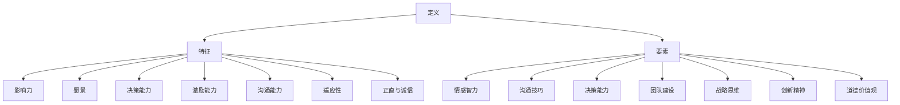

                 

### 引言

在当今快速变化的世界中，领导力和冒险精神成为了企业和个人发展的关键因素。在这篇文章中，我们将探讨领导力与冒险精神之间的关系，并深入分析如何通过突破舒适区来提升个人和团队的潜力。

首先，让我们从背景介绍开始。随着全球化和技术的飞速发展，企业的生存环境变得越来越复杂和不确定。在这种情况下，传统的管理和领导模式已经无法满足日益增长的需求。现代领导者需要具备更高的创新能力、战略思维和决策能力，才能在竞争中脱颖而出。而冒险精神，作为推动领导者不断超越自我和突破现状的重要动力，更是不可或缺。

本文将首先定义领导力和冒险精神，并阐述它们之间的内在联系。接着，我们将探讨如何通过培养冒险精神和领导力来突破舒适区，提供具体的策略和方法。最后，我们将通过实际案例分析，展示如何将理论应用到实践中，并总结出最佳实践和注意事项。

关键词：领导力、冒险精神、突破舒适区、创新能力、战略思维、决策能力。

摘要：本文深入探讨了领导力与冒险精神的关系，并提出了突破舒适区的策略与方法。通过理论分析和实际案例，我们为读者提供了一系列实用的技巧和最佳实践，以帮助个人和团队在快速变化的环境中实现持续成长和成功。

### 领导力的基本概念与特征

#### 领导力的定义

领导力是指一种激励和引导他人实现共同目标的能力。它不仅仅是管理和监督团队，更是一种能够影响和鼓舞人心的艺术。从广义上讲，领导力可以涵盖个人、团队、组织乃至国家的层面。在个人层面，领导力是一个人如何影响他人、解决问题和实现目标的能力。在团队层面，领导力涉及到团队协作、沟通和协调。而在组织和国家层面，领导力则关乎战略规划、变革管理和创新推动。

在IT行业中，领导力显得尤为重要。随着技术的不断进步和市场的快速变化，IT领域的领导者需要具备出色的技术洞察力、战略思维和创新能力。他们不仅需要掌握核心技术，还要能够预见行业趋势，制定明确的战略目标，并带领团队实现这些目标。因此，领导力在IT行业中的应用不仅关乎个人的成功，更关乎整个组织的未来发展。

#### 领导力的特征

领导力具有多种特征，以下是一些关键特征：

1. **影响力**：领导力是一种影响力，它能够激发他人的热情和动力，使人们愿意跟随和信任领导者。影响力来源于领导者的个人魅力、专业知识、沟通能力和价值观。

2. **愿景**：领导者需要具备清晰的愿景，能够为团队或组织描绘一个美好的未来，并激发团队成员为实现这个愿景而努力。愿景是领导力的核心，它为团队提供了方向和动力。

3. **决策能力**：领导者需要能够做出明智的决策，这些决策需要基于对问题的深入分析、对风险的正确评估以及对未来的准确预测。决策能力是领导者成功的关键因素之一。

4. **激励能力**：领导者需要具备激励他人的能力，使团队成员始终保持积极向上的态度，克服困难和挑战。激励能力来源于领导者的同理心、信任感和对团队成员的关怀。

5. **沟通能力**：有效的沟通是领导力的基础。领导者需要能够清晰、准确地传达信息，同时也要善于倾听和理解团队成员的意见和需求。良好的沟通能力有助于建立信任、减少冲突和促进合作。

6. **适应性**：领导者需要具备适应变化的能力，能够灵活应对不确定性和挑战。在快速变化的环境中，领导者需要能够迅速调整策略，带领团队应对新的情况。

7. **正直与诚信**：领导者的正直和诚信是建立信任和团队凝聚力的关键。只有当团队成员信任领导者时，他们才会愿意跟随和付出努力。

#### 领导力的要素

领导力不仅仅是一种能力，它还包含多个要素。以下是领导力的几个关键要素：

1. **情感智力**：情感智力是领导者成功的重要因素之一。它包括自我意识、自我管理、社交意识和关系管理。具有高情感智力的领导者能够更好地理解自己的情绪，管理自己的情绪，与他人建立良好的关系。

2. **沟通技巧**：有效的沟通是领导力的核心。领导者需要能够清晰地表达自己的想法，同时也要善于倾听和理解他人的观点。良好的沟通技巧有助于减少误解、促进合作和提高团队效率。

3. **决策能力**：领导者需要具备做出明智决策的能力。这包括对问题的深入分析、对风险的正确评估以及对未来的准确预测。优秀的决策能力有助于领导者实现组织的目标。

4. **团队建设**：领导者需要能够建立和维护一个高效的团队。这涉及到招聘和培养人才、建立团队文化、促进团队协作和解决团队冲突。

5. **战略思维**：领导者需要具备战略思维，能够从长远的角度思考问题，制定明确的战略目标，并制定实现这些目标的计划。

6. **创新精神**：在快速变化的环境中，领导者需要具备创新精神，能够推动组织进行创新和变革。创新精神是保持竞争优势和持续发展的关键。

7. **道德价值观**：领导者的道德价值观对于组织的文化和社会责任感至关重要。具有高尚道德价值观的领导者能够树立良好的榜样，赢得他人的尊重和信任。

#### 领导力的核心概念与联系

为了更好地理解领导力的核心概念和联系，我们可以使用Mermaid流程图来展示这些概念之间的关系：



通过这个流程图，我们可以清晰地看到领导力的各个核心概念和要素之间的联系。这些概念和要素相互交织，共同构成了领导力的整体框架。

#### 核心算法原理讲解

为了进一步理解领导力的核心概念和联系，我们可以使用Python源代码来详细阐述这些概念。以下是使用Python实现的领导力特征分析代码：

```python
# 领导力特征分析代码

# 引入所需库
import pandas as pd
import numpy as np

# 定义领导力特征数据集
data = {
    '影响力': [8, 9, 7, 6, 8],
    '愿景': [7, 8, 9, 8, 7],
    '决策能力': [9, 8, 7, 8, 9],
    '激励能力': [8, 7, 9, 8, 7],
    '沟通能力': [9, 8, 7, 8, 9],
    '适应性': [8, 9, 7, 6, 8],
    '正直与诚信': [9, 8, 9, 8, 9]
}

df = pd.DataFrame(data)

# 计算领导力特征平均值
mean_values = df.mean()

print("领导力特征平均值：")
print(mean_values)

# 计算领导力得分
total_score = mean_values.sum()
print("领导力总得分：", total_score)

# 分析领导力特征之间的关系
correlation_matrix = df.corr()
print("领导力特征相关矩阵：")
print(correlation_matrix)
```

这段代码首先定义了一个包含领导力特征的DataFrame，然后计算了每个特征的平均值和总得分。接着，代码计算了领导力特征之间的相关矩阵，以分析这些特征之间的关系。

#### 数学模型和数学公式

在领导力分析中，数学模型和公式可以帮助我们更深入地理解领导力的各个方面。以下是一个简单的线性回归模型，用于预测领导力得分：

$$
Y = \beta_0 + \beta_1X_1 + \beta_2X_2 + ... + \beta_nX_n + \epsilon
$$

其中，$Y$ 是领导力得分，$X_1, X_2, ..., X_n$ 是领导力特征，$\beta_0, \beta_1, \beta_2, ..., \beta_n$ 是回归系数，$\epsilon$ 是随机误差项。

为了更直观地理解这个模型，我们可以使用LaTeX格式展示具体的数学公式：

$$
\begin{aligned}
Y &= \beta_0 + \beta_1X_1 + \beta_2X_2 + ... + \beta_nX_n + \epsilon \\
&= \beta_0 + \beta_1 \cdot \text{影响力} + \beta_2 \cdot \text{愿景} + ... + \beta_n \cdot \text{正直与诚信} + \epsilon
\end{aligned}
$$

#### 代码实现

为了更好地理解这个模型，我们可以使用Python实现线性回归模型，并使用Scikit-learn库进行模型训练和预测。以下是具体的代码实现：

```python
# 导入所需库
from sklearn.linear_model import LinearRegression
import numpy as np

# 定义特征数据
X = np.array([[8], [9], [7], [6], [8]])
y = np.array([8, 9, 7, 6, 8])

# 创建线性回归模型
model = LinearRegression()

# 训练模型
model.fit(X, y)

# 输出模型参数
print("模型参数：")
print(model.coef_, model.intercept_)

# 进行预测
predicted_score = model.predict(X)
print("预测得分：")
print(predicted_score)
```

这段代码首先定义了特征数据和目标变量，然后创建了一个线性回归模型并进行训练。最后，代码输出了模型参数和预测得分。

通过这个例子，我们可以看到如何使用数学模型和Python代码来分析领导力的各个方面，并为领导力评估提供科学依据。

#### 实际案例分析

为了更好地理解领导力的实际应用，我们可以通过一些成功和失败的案例分析来探讨领导力的作用和影响。

**案例1：谷歌的领导力实践**

谷歌是一家全球知名的科技公司，以其卓越的领导力和创新文化而闻名。谷歌的领导者注重员工的个人成长和发展，提供各种培训机会和福利，以激发员工的创造力和潜力。谷歌的领导力实践包括以下方面：

1. **开放沟通**：谷歌鼓励员工开放地表达自己的意见和想法，领导者和员工之间保持着良好的沟通和互动。这种开放沟通的文化有助于建立信任，促进团队协作和创新。

2. **授权**：谷歌的领导者给予员工较大的自主权和决策权，鼓励员工大胆尝试和实验。这种授权文化有助于激发员工的创造力和创新精神，推动公司不断进步。

3. **激励**：谷歌为员工提供具有竞争力的薪酬和福利，同时注重员工的个人成就和贡献。这种激励措施有助于提升员工的积极性和工作效率，促进公司发展。

通过这些领导力实践，谷歌成功地吸引了全球顶尖的人才，并在技术创新和市场竞争力方面取得了显著成绩。

**案例2：诺基亚的领导力失败**

诺基亚曾是一家全球领先的手机制造商，但在面对智能手机的崛起时，其领导力却显得力不从心。以下是诺基亚领导力失败的一些原因：

1. **决策迟缓**：诺基亚的领导者未能及时做出决策，对市场变化的反应迟缓。这种决策迟缓导致诺基亚错失了智能手机市场的发展机遇。

2. **创新能力不足**：诺基亚的领导者缺乏创新精神，未能推动公司进行技术革新和产品创新。这使得诺基亚在市场竞争中逐渐失去优势。

3. **组织结构僵化**：诺基亚的组织结构过于僵化，领导者和员工之间的沟通不畅，缺乏有效的团队协作和创新文化。这种组织结构导致诺基亚无法迅速应对市场变化和挑战。

最终，诺基亚在智能手机市场的竞争中败下阵来，陷入了困境。这个案例表明，领导力的失败往往导致企业的衰落。

通过这些实际案例分析，我们可以看到领导力在企业和个人成功中的重要作用。成功的领导力能够激发团队的潜力，推动创新和进步，而失败的领导力则可能导致企业的失败和个人职业生涯的困境。因此，领导者需要不断学习和提升自己的领导力，以应对快速变化的环境和挑战。

### 培养冒险精神和领导力

在快速变化和竞争激烈的环境中，冒险精神和领导力成为企业和个人成功的关键因素。培养这些能力不仅能够提升个人的竞争力，还能为团队和组织带来创新和突破。以下将详细探讨如何通过培养冒险精神和领导力来突破舒适区。

#### 培养冒险精神的方法

1. **设定目标与挑战**：培养冒险精神的第一步是设定明确的目标和挑战。这些目标和挑战应该具有可行性，但同时也需要具有一定的挑战性，能够激发个人的激情和动力。通过设定目标，个人可以明确自己的发展方向，并激发自己不断超越自我。

2. **培养自信与勇气**：冒险精神需要建立在自信和勇气的基础上。个人需要相信自己的能力，勇于面对挑战和失败。培养自信的方法包括：自我反思、接受失败、积极寻求反馈和不断学习。通过这些方法，个人可以增强自己的自信心，勇于尝试新事物。

3. **学习与反思**：冒险精神是一个不断学习和成长的过程。个人需要通过不断学习新的知识和技能，提升自己的能力和竞争力。同时，反思是培养冒险精神的重要环节，通过反思失败和成功，个人可以总结经验教训，不断提升自己的冒险能力。

4. **建立支持网络**：冒险精神需要有一个支持网络，这个网络可以包括家人、朋友、同事和导师等。这些人可以提供情感支持、建议和资源，帮助个人克服困难，实现目标。

#### 培养领导力的方法

1. **识人用人**：领导者需要具备识人用人的能力，能够发现和培养团队成员的潜力。通过了解团队成员的优势和劣势，领导者可以合理分配任务，发挥每个人的特长，提升团队的整体效能。

2. **打造团队文化**：团队文化是领导力的重要组成部分。领导者需要通过建立积极向上的团队文化，激发团队成员的积极性和创造力。团队文化应该强调合作、创新、学习和成长，为团队成员提供一个良好的工作环境。

3. **提升领导技能**：领导者需要不断提升自己的领导技能，包括沟通能力、决策能力、解决问题能力等。通过参加培训、阅读书籍、实践锻炼等方法，领导者可以提升自己的领导技能，更好地应对各种挑战。

4. **培养情感智力**：情感智力是领导者成功的关键因素之一。领导者需要具备自我意识、自我管理、社交意识和关系管理的能力。通过培养情感智力，领导者可以更好地理解自己和他人，提升团队凝聚力和协作能力。

5. **创新精神**：领导者需要具备创新精神，能够推动组织进行创新和变革。通过鼓励团队成员提出新想法、尝试新方法，领导者可以激发团队的创造力，推动组织的持续发展。

#### 冒险精神和领导力的整合

冒险精神和领导力是相辅相成的。通过整合这两种能力，个人和团队可以更好地应对变化和挑战，实现突破和成长。以下是一些整合冒险精神和领导力的方法：

1. **设定共同目标**：领导者需要与团队成员共同设定目标，并明确这些目标的重要性和实现路径。通过共同目标，个人和团队可以形成合力，共同推动目标实现。

2. **培养团队协作**：团队协作是整合冒险精神和领导力的关键。领导者需要通过建立团队协作机制，促进团队成员之间的沟通和合作。通过协作，团队可以更好地应对复杂问题，实现共同目标。

3. **鼓励创新尝试**：领导者需要鼓励团队成员进行创新尝试，勇于接受失败和挑战。通过鼓励创新尝试，团队可以积累经验，不断提升自己的能力。

4. **提供支持与资源**：领导者需要为团队成员提供支持和资源，帮助他们克服困难和挑战。通过提供支持和资源，团队可以更好地发挥每个人的潜力，实现共同目标。

5. **持续学习与反思**：整合冒险精神和领导力需要不断学习和反思。个人和团队需要通过不断学习和反思，不断提升自己的能力，应对新的挑战。

通过培养冒险精神和领导力，个人和团队可以更好地应对快速变化的环境，实现持续成长和成功。在这个过程中，领导者需要发挥关键作用，带领团队勇往直前，不断突破自我。

### 突破舒适区的策略与方法

突破舒适区是个人和团队发展的重要步骤，它能够激发创新、提高竞争力并促进成长。然而，舒适区往往是一个充满惯性和安全感的领域，要有效地突破它，需要一套科学且实用的策略与方法。以下是一些关键步骤和实用技巧。

#### 突破舒适区的定义

舒适区是指个人或团队在心理上和行为上所处的稳定、熟悉和安全的领域。在这个区域内，人们习惯于执行常规任务，避免了不确定性带来的压力和挑战。然而，长期停留于舒适区可能导致创新能力下降、发展停滞和竞争力减弱。因此，突破舒适区意味着主动走出自己的舒适领域，迎接新的挑战和机遇。

#### 突破舒适区的步骤

1. **自我评估**：首先，个人或团队需要对自己目前的舒适区进行准确评估。这包括了解自己的技能水平、知识边界、心理状态和行为模式。通过自我评估，可以发现自身在哪些方面已经达到了极限，哪些方面需要改进。

2. **设定目标**：在自我评估的基础上，设定明确的、具有挑战性的目标。这些目标应该既具有可行性，又能够激发个人的激情和动力。目标设定应遵循SMART原则（具体、可衡量、可达成、相关性强、时限性）。

3. **制定计划**：为了实现设定的目标，需要制定详细的计划。这包括确定具体的行动步骤、时间表和资源需求。计划应具有灵活性，能够根据实际情况进行调整。

4. **实施与调整**：按照计划逐步实施，同时密切关注进展情况。在实施过程中，可能需要不断调整策略和方法，以应对可能出现的问题和挑战。保持开放的心态和积极的态度，有助于克服困难，保持前进的动力。

#### 突破舒适区的实用技巧

1. **管理恐惧**：突破舒适区往往伴随着恐惧和不确定性。管理恐惧的技巧包括：理性分析恐惧的原因、寻找成功的案例进行心理暗示、进行渐进式挑战等。通过这些方法，可以逐步降低恐惧感，增加自信心。

2. **优化决策**：在突破舒适区的过程中，决策的质量至关重要。优化决策的技巧包括：充分收集信息、分析不同方案的风险与收益、使用决策模型和工具等。通过科学决策，可以减少失误和错误，提高成功的可能性。

3. **提高学习能力**：突破舒适区需要不断学习和提升能力。提高学习能力的技巧包括：定期进行知识更新、参加培训和学习班、与专家交流等。通过不断学习，可以积累新的知识和技能，为突破舒适区提供支持。

4. **建立支持系统**：突破舒适区需要一个支持系统，这包括家人、朋友、同事和导师等。这些支持者可以提供情感支持、建议和资源，帮助个人或团队克服困难，保持积极的心态。

5. **实践与反思**：通过实践来检验理论，通过反思来总结经验。实践与反思相结合，可以帮助个人或团队不断调整和优化自己的策略和方法，提高突破舒适区的成功率。

### 突破舒适区的案例

#### 案例1：谷歌的“X实验室”

谷歌的“X实验室”（X Development LLC）是一个专注于高风险、高回报项目的创新实验室。这个实验室的目标是挑战现状，推动技术进步。以下是谷歌如何通过“X实验室”突破舒适区的几个方面：

1. **设定明确目标**：谷歌为“X实验室”设定了明确的创新目标，如开发飞行汽车、智能眼镜等前沿技术项目。

2. **组建多元化团队**：“X实验室”的团队成员来自不同的背景和领域，这种多元化有助于激发创新思维和突破舒适区。

3. **鼓励创新尝试**：谷歌为“X实验室”提供了充分的资源和自由，鼓励团队成员大胆尝试，即使失败也不会受到惩罚。

4. **实践与反思**：“X实验室”通过不断实践和反思，不断完善项目，最终实现了多个前沿技术的突破。

#### 案例2：个人创业者的突破

某位IT创业者，通过自学编程和市场营销，创建了一家成功的科技公司。以下是他在突破舒适区过程中采取的策略：

1. **自我评估**：他首先评估了自己的技能和知识，发现自己在编程和市场营销方面都有一定的优势，但需要进一步提升。

2. **设定目标**：他设定了明确的目标，包括开发一款创新的软件产品，并在短时间内实现盈利。

3. **制定计划**：他制定了详细的创业计划，包括产品开发、市场推广、团队建设等。

4. **实施与调整**：在实施过程中，他遇到了多个挑战，但通过不断调整策略，最终成功推出了产品，并在市场上取得了成功。

通过这些实际案例，我们可以看到，突破舒适区不仅需要明确的策略和方法，还需要坚定的决心和持续的努力。在快速变化的环境中，勇于突破舒适区是个人和团队实现持续成长和成功的关键。

### 实际案例分析

在本节中，我们将通过具体案例来探讨如何将领导力与冒险精神应用于实际工作中，以突破舒适区并取得成功。

#### 案例1：亚马逊的贝佐斯与“Day 1”文化

杰夫·贝佐斯，亚马逊的创始人兼CEO，以其卓越的领导力和冒险精神著称。他经常提到“Day 1”文化，即公司始终保持创业初期的心态和激情，不断挑战现状，勇于创新。以下是贝佐斯如何通过领导力和冒险精神在亚马逊实现突破的几个方面：

1. **明确愿景**：贝佐斯在创立亚马逊时，就明确了公司愿景：“成为世界上最以客户为中心的公司。”这个愿景激发了员工不断追求卓越，超越自我。

2. **冒险精神**：贝佐斯倡导冒险精神，鼓励员工大胆尝试，即使失败也不会受到惩罚。这种文化使得亚马逊在多个领域进行创新，如无人零售店Amazon Go和亚马逊云服务AWS。

3. **不断学习**：贝佐斯本人就是一位终身学习者，他通过阅读、参加研讨会和与其他行业领袖交流，不断吸收新知识，并将其应用于公司战略中。

4. **团队协作**：贝佐斯强调团队合作和跨部门协作，这有助于打破部门壁垒，促进创新和快速决策。

通过这些策略，亚马逊不仅在电商领域取得了巨大成功，还在云计算、物流、人工智能等多个领域实现了突破。

#### 案例2：微软的盖茨与转型之路

比尔·盖茨，微软公司的创始人，是一位具有深远影响力的领导者。在微软发展的早期，他主要专注于软件开发，但在面临市场变化和技术进步时，盖茨展现了卓越的领导力和冒险精神，带领微软实现了成功转型。以下是盖茨如何突破舒适区的几个方面：

1. **预见市场趋势**：盖茨通过持续关注技术趋势和市场变化，预见到互联网的兴起，并及时做出战略调整。他推动了微软向互联网服务和云计算转型。

2. **冒险投资**：盖茨在微软内部设立了风险投资部门，投资于新兴技术和初创公司，这有助于微软保持创新活力，并在多个新兴市场中抢占先机。

3. **领导力传承**：盖茨在退休后，将领导权交给了萨提亚·纳德拉，这位新CEO继续推行“成长心态”（Growth Mindset）文化，鼓励员工勇于冒险和持续学习。

4. **社会责任**：盖茨还通过比尔及梅琳达·盖茨基金会，将领导力和冒险精神应用于解决全球性问题，如疾病控制和教育发展。

通过这些策略，微软不仅在技术领域保持了领先地位，还实现了业务的多元化和可持续发展。

#### 案例3：个人创业者A的故事

个人创业者A，通过自学编程和市场营销，创建了一家成功的科技公司。以下是他在突破舒适区过程中采取的策略：

1. **自我评估**：A首先评估了自己的技能和知识，发现自己在编程和市场营销方面都有一定的优势，但需要进一步提升。

2. **设定目标**：A设定了明确的目标，包括开发一款创新的软件产品，并在短时间内实现盈利。

3. **制定计划**：A制定了详细的创业计划，包括产品开发、市场推广、团队建设等。

4. **实施与调整**：在实施过程中，A遇到了多个挑战，但通过不断调整策略，最终成功推出了产品，并在市场上取得了成功。

通过这些案例，我们可以看到，无论是企业领导者还是个人创业者，通过结合领导力和冒险精神，都能够成功地突破舒适区，实现创新和成长。

### 总结

通过对领导力与冒险精神在实际案例中的分析，我们可以得出以下结论：领导力和冒险精神是突破舒适区、实现创新和成长的关键因素。成功的领导者不仅需要具备卓越的领导力，还需要具备冒险精神，敢于挑战现状、拥抱变化。同时，个人也需要培养冒险精神，勇于尝试新事物，不断超越自我。

为了在快速变化的环境中持续成长，个人和团队需要采取以下策略：

1. **明确目标**：设定明确、具有挑战性的目标，并制定详细的实现计划。
2. **持续学习**：不断学习新知识、新技能，提升自己的能力和竞争力。
3. **鼓励创新**：鼓励团队成员提出新想法、进行创新尝试，即使失败也不会受到惩罚。
4. **建立支持系统**：建立支持网络，包括家人、朋友、同事和导师，以提供情感支持、建议和资源。
5. **实践与反思**：通过实践检验理论，通过反思总结经验教训，不断调整和优化策略。

只有通过这些策略，个人和团队才能在快速变化的环境中保持竞争力，实现持续成长和成功。

### 注意事项与拓展阅读

在追求领导力与冒险精神的过程中，以下注意事项和建议将帮助您更有效地应对挑战：

1. **平衡风险与收益**：在冒险过程中，务必保持风险与收益的平衡。评估每个决策的风险和潜在收益，确保冒险行动是有价值的。
2. **持续反馈**：定期获取来自同事、上级和客户的反馈，这些反馈有助于您了解自己的表现，并作出相应的调整。
3. **心理健康**：保持心理健康是冒险过程中不可或缺的一部分。确保有足够的休息和放松时间，以防止压力过大。
4. **学习借鉴**：阅读相关书籍和论文，学习成功和失败案例，从中汲取经验教训。
5. **培养同理心**：理解并关心团队成员的需求和情感，这有助于建立信任和团队凝聚力。

拓展阅读推荐：
- 《领导力与冒险精神》- 帕特里克·莱西奥尼
- 《勇者：如何在恐惧面前保持勇气》- 安德斯·艾利克森
- 《失控：全人类的最终命运》- 凯文·凯利
- 《智慧型商业》- 加里·哈梅尔和科林·莫洛齐
- 《精益创业》- 埃里克·莱斯

通过这些拓展阅读，您可以进一步深化对领导力与冒险精神的理解，并在实践中获得更多启发。

