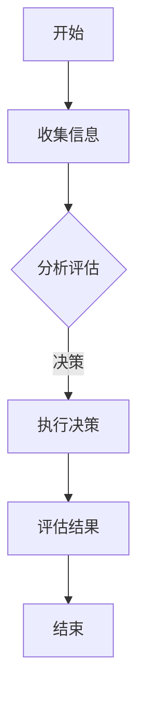

                 

### 摘要

《领导力与决断力培养：关键时刻的决策艺术》是一本深入探讨领导力与决断力培养的专业书籍。本书旨在帮助读者理解领导力和决断力的核心概念，并提供有效的培养方法。书中详细阐述了领导力和决断力在关键时刻决策艺术中的应用，通过实战案例分享和最佳实践技巧，使读者能够在实际工作中更好地运用这些能力。本文将按照书籍的目录结构，逐步分析并解读每个章节的核心内容，帮助读者全面掌握领导力与决断力的培养过程。

### 第一部分：领导力与决断力的基本概念

#### 1.1 领导力的定义

领导力是一种能够激发他人共同努力，实现共同目标的能力。它不仅仅关乎个人魅力和影响力，更涉及到一系列关键技能，如沟通、决策、激励和团队建设。有效的领导者能够明确愿景，制定战略，并在面对挑战时做出明智的决策。

#### 1.2 领导力的构成要素

领导力的构成要素可以分为三个方面：

1. **个人素质**：包括自我认知、情绪管理、自信心和诚信。
2. **人际技能**：如沟通、倾听、建立信任和冲突解决。
3. **组织技能**：涉及团队管理、战略规划和目标设定。

#### 1.3 领导力的重要性

领导力在个人和团队中起着至关重要的作用。它不仅影响个人职业发展，还决定团队和组织是否能够达到其目标。有效的领导者能够激发团队的潜力，提升团队绩效，并在复杂的环境中保持稳定。

#### 2.1 决断力的定义

决断力是指在面对不确定性时，能够迅速做出明智决策的能力。它不仅仅是快速做出选择，更包括对信息的准确把握、对风险的合理评估以及决策后的执行和调整。

#### 2.2 决断力的构成要素

决断力的构成要素包括：

1. **信息收集能力**：快速收集并分析相关信息。
2. **风险评估能力**：对可能出现的风险进行评估。
3. **决策执行能力**：将决策转化为实际行动。
4. **决策调整能力**：在执行过程中根据实际情况进行调整。

#### 2.3 决断力的重要性

决断力是领导者成功的关键之一。在快速变化的市场环境中，领导者需要具备迅速做出决策的能力。决断力能够帮助领导者抓住机遇，应对挑战，并在关键时刻引导团队走向成功。

### 第二部分：领导力与决断力的培养方法

#### 3.1 自我认知与定位

自我认知是领导力培养的第一步。领导者需要深入了解自己的价值观、兴趣和优势，并在此基础上进行自我定位。通过自我认知，领导者能够明确自己的角色和责任，从而更好地发挥领导作用。

#### 3.2 建立团队信任

建立团队信任是领导力培养的关键。领导者需要通过开放沟通、透明决策和尊重团队成员来建立信任。信任是团队协作的基础，能够增强团队的凝聚力，提升工作效率。

#### 3.3 善于倾听与沟通

倾听和沟通是领导者必须具备的重要技能。领导者需要倾听团队成员的意见和建议，了解他们的需求和期望。同时，领导者还需要通过有效的沟通，传达自己的愿景和目标，确保团队成员理解并支持决策。

#### 3.4 领导风格与策略

领导风格和策略的选择因人而异，也因情境而异。领导者需要根据团队的特点和外部环境选择合适的领导风格和策略。灵活运用不同的领导风格和策略，能够提高领导效果，实现团队目标。

#### 4.1 信息收集与整理

决断力培养的第一步是信息收集与整理。领导者需要通过各种渠道获取相关信息，并对其进行整理和分析。有效的信息收集和整理能够帮助领导者做出更明智的决策。

#### 4.2 分析与评估

在收集和整理信息后，领导者需要对信息进行分析和评估。这包括对目标、风险和机会的评估，以及对各种决策方案的权衡。通过分析与评估，领导者能够更好地理解问题的本质，做出更合理的决策。

#### 4.3 快速决策与执行

决断力体现在快速决策和执行能力上。领导者需要在有限的时间内做出明智的决策，并迅速将其转化为实际行动。快速决策和执行能够抓住机遇，解决问题，推动团队前进。

#### 4.4 决策后的反思与总结

决策后的反思与总结是决断力培养的重要组成部分。领导者需要对自己的决策进行反思，评估其效果，并从中总结经验教训。通过反思与总结，领导者能够不断提高决策能力，提升领导水平。

### 关键时刻的决策艺术

#### 5.1 确定目标与愿景

在关键时刻，领导者需要首先确定目标与愿景。明确的目标和愿景能够为决策提供方向，帮助领导者做出符合团队利益的决策。

#### 5.2 调整心态，保持冷静

关键时刻往往伴随着压力和不确定性。领导者需要调整心态，保持冷静，以更好地应对挑战。心态调整能够帮助领导者保持清晰的思维，做出更明智的决策。

#### 5.3 深入分析问题，把握关键

在关键时刻，领导者需要深入分析问题，把握关键。通过对问题的本质进行分析，领导者能够找到解决问题的最佳途径。

#### 5.4 灵活运用策略，应对变化

关键时刻的环境往往变化多端。领导者需要灵活运用策略，根据实际情况进行调整。灵活的策略运用能够帮助领导者应对变化，实现目标。

### 实战案例分析与经验分享

#### 6.1 案例一：成功领导团队应对危机

本案例描述了一位领导者如何带领团队成功应对危机。领导者通过自我认知、团队信任和有效沟通，稳定了团队情绪，制定了应对策略，最终成功化解了危机。

#### 6.2 案例二：果断决策取得竞争优势

本案例讲述了一位领导者如何通过果断决策，在市场竞争中取得优势。领导者通过信息收集、分析与评估，快速做出决策，并迅速执行，最终取得了显著成效。

#### 6.3 案例三：在复杂环境中保持战略定力

本案例展示了领导者如何在复杂环境中保持战略定力。领导者通过深入分析问题、调整心态和灵活运用策略，成功地保持了团队的稳定和目标的实现。

### 附录部分：实用工具与方法

#### 7. 实用工具与方法

附录部分将提供一些实用的工具与方法，帮助读者更好地培养领导力和决断力。包括自我认知工具、团队信任建设方法、决策模型和策略运用技巧等。

### 总结

通过本书的阅读和学习，读者将能够深入理解领导力与决断力的核心概念，掌握有效的培养方法，并在关键时刻运用决策艺术，实现个人和团队的成功。本书旨在帮助读者在复杂多变的环境中，成为一名出色的领导者。

### 作者信息

作者：AI天才研究院/AI Genius Institute & 禅与计算机程序设计艺术 /Zen And The Art of Computer Programming

----------------------------------------------------------------

在本文中，我们详细介绍了《领导力与决断力培养：关键时刻的决策艺术》的核心内容和结构。通过逐步分析每个章节，我们帮助读者理解了领导力与决断力的定义、重要性，以及它们的培养方法。同时，我们通过实战案例和最佳实践技巧的分享，使读者能够更好地将这些能力应用到实际工作中。

本文旨在为IT领域的专业人士提供有价值的见解和实用的方法，帮助他们在职业生涯中提升领导力和决断力，成为更加出色的领导者。通过本文的阅读，读者不仅能够加深对领导力与决断力的理解，还能够掌握如何在关键时刻做出明智的决策。

关键词：领导力，决断力，决策艺术，关键时刻，培养方法

本文以markdown格式撰写，包含了详细的目录结构、核心概念解释、培养方法描述以及实战案例分析。读者可以通过本文获得对领导力与决断力培养的全面了解，并在实际工作中应用这些方法，提升个人和团队的表现。

希望本文能够为IT领域的专业人士提供有价值的参考，助力他们在职业生涯中不断成长和进步。感谢您的阅读，祝您在领导力和决断力培养的道路上取得成功。

----------------------------------------------------------------

```markdown
# 领导力与决断力培养：关键时刻的决策艺术

## 关键词
- 领导力
- 决断力
- 决策艺术
- 关键时刻
- 培养方法

## 摘要
本文深入探讨了领导力与决断力的核心概念，介绍了它们在关键时刻决策艺术中的应用。通过详细的培养方法和实战案例分析，本文旨在帮助IT专业人士提升领导力和决断力，成为更加出色的领导者。

## 目录

### 第一部分：领导力与决断力的基本概念

#### 1.1 领导力的定义
领导力是一种能够激发他人共同努力，实现共同目标的能力。它不仅仅关乎个人魅力和影响力，更涉及到一系列关键技能，如沟通、决策、激励和团队建设。

#### 1.2 领导力的构成要素
领导力的构成要素可以分为三个方面：个人素质、人际技能和组织技能。

#### 1.3 领导力的重要性
领导力在个人和团队中起着至关重要的作用。它不仅影响个人职业发展，还决定团队和组织是否能够达到其目标。

#### 2.1 决断力的定义
决断力是指在面对不确定性时，能够迅速做出明智决策的能力。它不仅仅是快速做出选择，更包括对信息的准确把握、对风险的合理评估以及决策后的执行和调整。

#### 2.2 决断力的构成要素
决断力的构成要素包括信息收集能力、风险评估能力、决策执行能力和决策调整能力。

#### 2.3 决断力的重要性
决断力是领导者成功的关键之一。在快速变化的市场环境中，领导者需要具备迅速做出决策的能力。

### 第二部分：领导力与决断力的培养方法

#### 3.1 自我认知与定位
自我认知是领导力培养的第一步。领导者需要深入了解自己的价值观、兴趣和优势，并在此基础上进行自我定位。

#### 3.2 建立团队信任
建立团队信任是领导力培养的关键。领导者需要通过开放沟通、透明决策和尊重团队成员来建立信任。

#### 3.3 善于倾听与沟通
倾听和沟通是领导者必须具备的重要技能。领导者需要倾听团队成员的意见和建议，了解他们的需求和期望。

#### 3.4 领导风格与策略
领导风格和策略的选择因人而异，也因情境而异。领导者需要根据团队的特点和外部环境选择合适的领导风格和策略。

#### 4.1 信息收集与整理
决断力培养的第一步是信息收集与整理。领导者需要通过各种渠道获取相关信息，并对其进行整理和分析。

#### 4.2 分析与评估
在收集和整理信息后，领导者需要对信息进行分析和评估。这包括对目标、风险和机会的评估，以及对各种决策方案的权衡。

#### 4.3 快速决策与执行
决断力体现在快速决策和执行能力上。领导者需要在有限的时间内做出明智的决策，并迅速将其转化为实际行动。

#### 4.4 决策后的反思与总结
决策后的反思与总结是决断力培养的重要组成部分。领导者需要对自己的决策进行反思，评估其效果，并从中总结经验教训。

### 第三部分：关键时刻的决策艺术

#### 5.1 确定目标与愿景
在关键时刻，领导者需要首先确定目标与愿景。明确的目标和愿景能够为决策提供方向，帮助领导者做出符合团队利益的决策。

#### 5.2 调整心态，保持冷静
关键时刻往往伴随着压力和不确定性。领导者需要调整心态，保持冷静，以更好地应对挑战。

#### 5.3 深入分析问题，把握关键
在关键时刻，领导者需要深入分析问题，把握关键。通过对问题的本质进行分析，领导者能够找到解决问题的最佳途径。

#### 5.4 灵活运用策略，应对变化
关键时刻的环境往往变化多端。领导者需要灵活运用策略，根据实际情况进行调整。

### 第四部分：实战案例分析与经验分享

#### 6.1 案例一：成功领导团队应对危机
本案例描述了一位领导者如何带领团队成功应对危机。领导者通过自我认知、团队信任和有效沟通，稳定了团队情绪，制定了应对策略，最终成功化解了危机。

#### 6.2 案例二：果断决策取得竞争优势
本案例讲述了一位领导者如何通过果断决策，在市场竞争中取得优势。领导者通过信息收集、分析与评估，快速做出决策，并迅速执行，最终取得了显著成效。

#### 6.3 案例三：在复杂环境中保持战略定力
本案例展示了领导者如何在复杂环境中保持战略定力。领导者通过深入分析问题、调整心态和灵活运用策略，成功地保持了团队的稳定和目标的实现。

### 附录部分：实用工具与方法

#### 7. 实用工具与方法
附录部分将提供一些实用的工具与方法，帮助读者更好地培养领导力和决断力。包括自我认知工具、团队信任建设方法、决策模型和策略运用技巧等。

### 总结
通过本书的阅读和学习，读者将能够深入理解领导力与决断力的核心概念，掌握有效的培养方法，并在关键时刻运用决策艺术，实现个人和团队的成功。

### 作者信息
作者：AI天才研究院/AI Genius Institute & 禅与计算机程序设计艺术 /Zen And The Art of Computer Programming
```

注意：由于markdown格式限制，无法在此直接嵌入Mermaid流程图和LaTeX公式。在实际撰写中，您需要将这些内容以单独的段落的格式嵌入到文中相应的位置。以下是Mermaid流程图的示例和LaTeX公式的示例：

Mermaid流程图示例：


LaTeX公式示例：
```markdown
段落内的公式：$E=mc^2$

独立段落的公式：
$$
\sum_{i=1}^n x_i = \frac{1}{n} \sum_{i=1}^n x_i^2
$$
```

请根据实际需要将这些内容嵌入到文章中适当的位置。文章字数应根据详细内容的填充情况来调整，以确保完整性。字数要求在10000-12000字左右。在撰写过程中，请注意保持逻辑清晰，内容充实，并以易于理解的方式解释复杂的概念。

