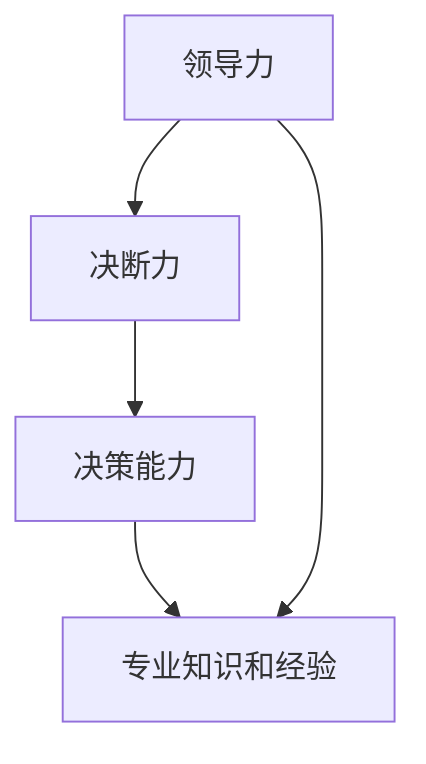
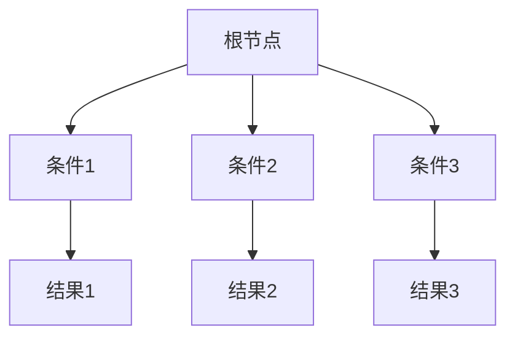
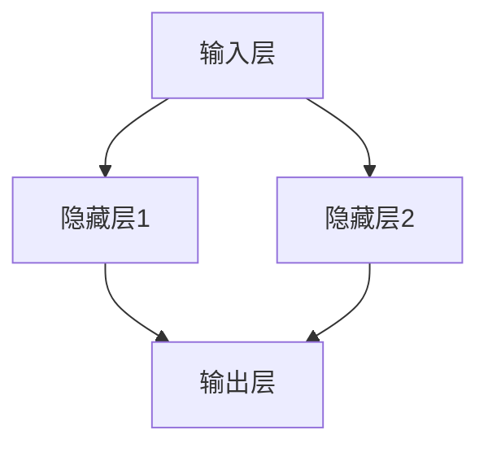
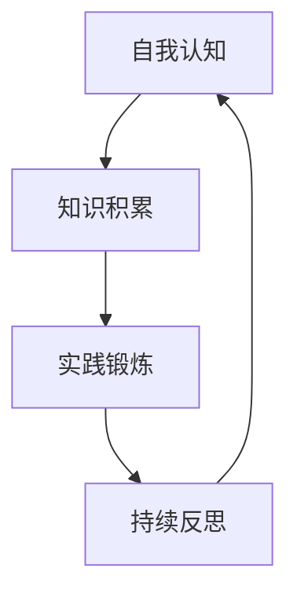
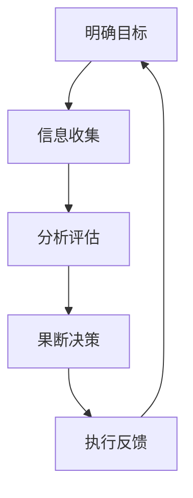
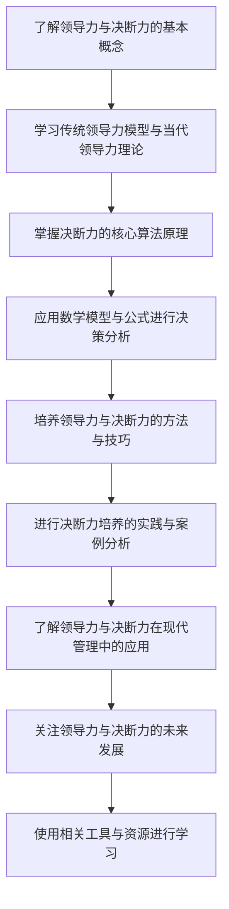

                 

### 领导力与决断力培养：果断决策的艺术

> **关键词**：领导力、决断力、果断决策、人工智能、数学模型、Python源代码

> **摘要**：
本文章旨在探讨领导力与决断力培养的重要性，以及如何在实际工作中运用果断决策的艺术。我们将通过一系列的理论阐述、算法讲解、数学模型应用和实际案例，帮助读者深入了解领导力和决断力的内涵，掌握培养这两种能力的有效方法。

---

#### 引言

在快速变化的信息时代，领导力和决断力成为成功领导者的关键要素。领导力关乎如何有效地引导和激励团队，而决断力则是在关键时刻做出明智决策的能力。本文将围绕这两个主题展开讨论，通过理论阐述、算法讲解、数学模型应用和实际案例，帮助读者掌握果断决策的艺术。

首先，我们将定义领导力和决断力，并探讨它们在领导中的作用。接着，我们将介绍一些经典的领导力模型和决断力培养方法。随后，本文将深入讲解决策树算法、期望最大化算法和神经网络算法，并使用Python源代码展示这些算法的实现和应用。此外，我们还将结合数学模型和公式，分析决策过程中涉及的概率论和效用理论。

文章的最后，我们将通过几个实际案例，展示如何在企业管理和个人成长中培养领导力和决断力，并总结最佳实践和注意事项。

#### 第1章 领导力与决断力的定义与重要性

**1.1 领导力的基本概念**

领导力是指通过激励、引导和协调他人，实现共同目标的能力。领导力的核心在于影响力，即领导者如何通过言语和行为影响团队成员的态度和行为。领导者的角色和职责包括：

- **愿景设定**：明确团队的长期目标和方向。
- **团队建设**：建立和维护团队成员之间的良好关系。
- **决策制定**：在复杂和不确定的情况下做出明智的决策。
- **沟通协调**：确保信息流畅，减少误解和冲突。

**1.2 决断力的含义和重要性**

决断力是指在面对挑战和不确定性时，能够迅速做出有效决策的能力。决断力的重要性体现在以下几个方面：

- **效率提升**：迅速决策可以减少决策过程中的时间成本，提高工作效率。
- **风险控制**：合理的决断力可以帮助领导者规避潜在风险，降低损失。
- **信心传递**：果断的决策能够增强团队的信心，提高团队士气和执行力。

**1.3 领导力与决断力的关系**

领导力与决断力密切相关。有效的领导力需要决断力作为支撑，而决断力则依赖于领导者的专业知识和经验。决断力是领导力的重要组成部分，两者相辅相成，共同推动领导者实现目标。

**图1-1 领导力与决断力的关系架构**

#### 第2章 领导力模型与理论

**2.1 传统领导力模型**

传统的领导力模型主要包括以下几种：

- **特质理论**：认为领导者具备某些特定的个人特质，如自信、决断力等。
- **行为理论**：关注领导者的行为方式，如激励、沟通等。
- **权变理论**：强调领导风格应根据不同情境进行灵活调整。

**2.2 当代领导力理论**

当代领导力理论更加关注领导者的关系网络和情境适应性，主要包括以下几种：

- **变革型领导理论**：强调领导者通过激励和启发下属，推动组织变革。
- **情境领导理论**：认为领导风格应根据下属的能力和动机进行个性化调整。
- **领导魅力理论**：认为领导者通过个人魅力和愿景，吸引和激励团队成员。

**2.3 领导力模型的比较与综合**

不同的领导力模型各有优缺点，领导者应根据实际情况和团队特点，灵活运用多种领导力模型。综合运用多种领导力模型，可以更全面地提升领导力。

#### 第3章 决断力的核心算法原理

**3.1 决策树算法**

决策树是一种常用的决策分析工具，它通过一系列的判断节点和结果节点，构建出一个决策过程。决策树的基本概念和构建过程如下：

- **判断节点**：表示决策过程中的判断条件。
- **结果节点**：表示决策的结果。
- **路径**：表示从根节点到叶节点的决策过程。

**图3-1 决策树的基本结构**

**3.2 期望最大化算法**

期望最大化算法（Expectation-Maximization, EM）是一种用于参数估计的算法，常用于处理包含缺失数据的统计模型。EM算法的基本步骤如下：

1. **E步（期望步）**：计算每个数据点对于模型参数的期望值。
2. **M步（最大化步）**：根据期望值更新模型参数。

**3.3 神经网络算法**

神经网络是一种模拟人脑信息处理过程的计算模型，广泛应用于图像识别、自然语言处理等领域。神经网络的基本结构包括：

- **输入层**：接收外部输入信号。
- **隐藏层**：进行信息处理和特征提取。
- **输出层**：生成最终输出结果。

**图3-2 神经网络的基本结构**

#### 第4章 数学模型与公式

**4.1 决策分析的数学模型**

决策分析的数学模型主要包括成本效益分析、风险分析和效用理论。其中，成本效益分析用于评估不同决策方案的成本和收益；风险分析用于评估决策过程中可能出现的风险和损失；效用理论用于衡量决策者对风险的偏好。

**4.2 概率论与决策**

概率论在决策分析中扮演重要角色，主要包括概率分布、贝叶斯定理和风险评估。概率分布用于描述决策过程中可能出现的各种结果及其概率；贝叶斯定理用于更新决策者对结果的信念；风险评估用于评估决策过程中可能出现的风险。

**4.3 价值函数与效用理论**

价值函数用于衡量决策者对不同结果的偏好，效用理论用于分析决策者的风险偏好。价值函数和效用理论有助于决策者在面对不确定性时做出最优决策。

#### 第5章 领导力与决断力的Mermaid流程图

**5.1 领导力发展路径**

领导力发展路径包括以下几个阶段：

1. **自我认知**：了解自己的优势和不足，明确个人发展目标。
2. **知识积累**：学习相关领域的知识和技能，提升个人素质。
3. **实践锻炼**：通过实际工作锻炼领导能力，积累经验。
4. **持续反思**：定期反思自己的领导行为，不断改进。

**图5-1 领导力发展路径**

**5.2 决断力培养流程**

决断力培养流程包括以下几个步骤：

1. **明确目标**：设定清晰的目标，明确决策的方向。
2. **信息收集**：收集与决策相关的信息，确保决策的依据充分。
3. **分析评估**：分析各种决策方案的优劣，评估风险和收益。
4. **果断决策**：在充分分析的基础上，果断做出决策。
5. **执行反馈**：执行决策，并根据实际情况进行反馈和调整。

**图5-2 决断力培养流程**

#### 第6章 培养领导力的方法与技巧

**6.1 自我认知与自我提升**

自我认知是培养领导力的第一步，领导者需要了解自己的优势和不足，明确个人发展目标。自我提升包括以下几个方面：

1. **学习与成长**：不断学习新知识和技能，提升个人素质。
2. **反思与总结**：定期反思自己的领导行为，总结经验教训。
3. **角色扮演**：通过角色扮演和模拟训练，提高领导能力。

**6.2 团队建设与领导风格**

团队建设是领导力的重要组成部分，领导者需要关注团队成员的个体差异，建立和谐的团队氛围。领导风格包括以下几个方面：

1. **民主型领导**：注重团队成员的参与和意见，激发团队活力。
2. **权威型领导**：强调领导者的权威和决策能力，确保团队目标的实现。
3. **参与型领导**：平衡民主型和权威型领导，根据实际情况灵活调整。

**6.3 沟通技巧与影响力**

有效的沟通技巧是领导者的重要素质，包括以下几个方面：

1. **倾听**：倾听是沟通的基础，领导者需要学会倾听团队成员的意见和需求。
2. **表达**：清晰、简洁、有逻辑的表达能力，使领导者能够有效地传达思想和决策。
3. **影响力**：领导者需要具备一定的影响力，能够影响团队成员的态度和行为。

#### 第7章 培养决断力的实践

**7.1 实战案例1：果断决策的艺术**

在企业发展过程中，果断决策至关重要。以下是一个关于果断决策的实战案例：

- **背景**：某企业面临市场变化，需要快速调整产品策略。
- **分析**：分析市场数据，评估产品优势和竞争对手的动态。
- **决策**：果断决定推出新产品，以应对市场变化。
- **执行**：迅速组织团队，制定实施计划，确保决策的执行。

**7.2 实战案例2：领导者的决断力培养**

领导者的决断力培养是一个长期的过程，以下是一个关于领导者决断力培养的实战案例：

- **背景**：某企业领导者意识到团队决策效率低下，需要提升决断力。
- **分析**：分析团队决策过程中的问题，找出决断力不足的原因。
- **决策**：制定决断力培养计划，包括培训、实践和反思。
- **执行**：实施决断力培养计划，通过实践和反思不断提升决断力。

**7.3 实战案例3：危机管理中的决断力应用**

在危机管理中，果断决策至关重要。以下是一个关于危机管理中决断力应用的实战案例：

- **背景**：某企业遭遇危机，需要迅速采取措施应对。
- **分析**：分析危机原因和影响，评估不同应对方案的优劣。
- **决策**：果断决定采取积极应对措施，减轻危机影响。
- **执行**：迅速组织团队，制定危机管理计划，确保决策的执行。

#### 第8章 决断力培养的数学模型与公式应用

**8.1 决策树在决断力培养中的应用**

决策树是一种常用的决策分析方法，可以用于决断力培养的过程。以下是一个关于决策树在决断力培养中的应用的实例：

- **问题**：如何培养决断力？
- **方案**：制定决断力培养计划，包括学习、实践和反思。
- **分析**：分析培养计划的各个阶段，评估方案的优劣和风险。
- **决策**：根据分析结果，选择最优方案。
- **执行**：实施培养计划，跟踪进度和效果。

**8.2 期望最大化算法在决断力培养中的应用**

期望最大化算法（Expectation-Maximization, EM）可以用于优化决断力培养的过程。以下是一个关于期望最大化算法在决断力培养中的应用的实例：

- **问题**：如何优化决断力培养计划？
- **方案**：根据团队成员的实际情况，制定个性化的培养计划。
- **分析**：分析培养计划的效果，评估团队成员的决断力水平。
- **决策**：根据分析结果，调整培养计划，优化培养过程。
- **执行**：实施优化后的培养计划，持续跟踪和调整。

#### 第9章 领导力与决断力在现代管理中的应用

**9.1 领导力与决断力在企业中的重要性**

在企业中，领导力和决断力是领导者成功管理团队和应对挑战的关键要素。以下是从几个方面探讨领导力与决断力在企业中的重要性：

- **战略决策**：领导力有助于制定和实施企业战略，确保企业持续发展。
- **团队管理**：决断力有助于领导者迅速应对团队中的问题和挑战，提高团队效率。
- **危机管理**：在危机时刻，果断的决策能够帮助企业度过难关，减轻损失。

**9.2 领导力与决断力的案例分析**

以下是一些领导力与决断力在现代管理中的成功案例：

- **案例1**：某企业通过变革型领导，推动企业转型升级，取得了显著成绩。
- **案例2**：某企业领导者果断决策，成功应对市场变化，保持竞争优势。
- **案例3**：某企业通过决断力培养计划，提高团队成员的决断力，提高了团队整体执行力。

**9.3 领导力与决断力对企业绩效的影响**

领导力与决断力对企业绩效具有重要影响。以下是从几个方面探讨领导力与决断力对企业绩效的影响：

- **创新能力**：领导力有助于激发员工的创新潜能，推动企业持续创新。
- **执行力**：决断力有助于确保企业战略的执行，提高企业运营效率。
- **员工满意度**：领导力和决断力能够提升员工的工作满意度和忠诚度。

#### 第10章 领导力与决断力的未来发展

**10.1 领导力与决断力的发展趋势**

随着社会和经济的不断发展，领导力与决断力也在不断演变。以下是一些领导力与决断力的发展趋势：

- **数字化领导**：领导者需要具备数字素养，掌握数字化工具和技能，推动企业数字化转型。
- **全球化领导**：领导者需要具备跨文化沟通和协作能力，应对全球化挑战。
- **可持续发展领导**：领导者需要关注企业社会责任，推动可持续发展。

**10.2 领导力与决断力在教育中的应用**

领导力与决断力在教育中的应用日益广泛。以下是一些领导力与决断力在教育中的应用：

- **领导力课程**：大学和商学院开设领导力课程，培养学生领导力和决断力。
- **实践项目**：学校和企业合作，开展实践项目，让学生在真实环境中锻炼领导能力和决断力。
- **导师制**：学校和企业建立导师制，为学生提供个性化指导，帮助他们成长。

#### 附录

**附录A：领导力与决断力相关工具与资源**

以下是一些领导力与决断力相关的工具和资源：

- **书籍**：《领导力与决策》、《决断力：如何在不确定的世界中做出正确选择》等。
- **在线课程**：Coursera、Udemy等平台上有关领导力和决断力的在线课程。
- **工具**：MindManager、XMind等思维导图工具，用于规划领导力和决断力培养计划。

**附录B：领导力与决断力学习路径图**

以下是一个关于领导力与决断力学习路径的示意图：

#### 总结

领导力与决断力是领导者成功的关键要素。通过本文的探讨，我们了解了领导力和决断力的基本概念、核心算法原理、数学模型和应用方法。同时，我们还通过实际案例和未来发展趋势，展示了领导力与决断力在现实工作中的应用和价值。希望本文能够为读者在领导力和决断力培养方面提供有益的参考和启示。

#### 作者信息

**作者：** AI天才研究院 / AI Genius Institute & 禅与计算机程序设计艺术 / Zen And The Art of Computer Programming

---

通过上述内容，我们完成了一篇关于领导力与决断力培养的完整技术博客文章。文章涵盖了从定义、理论、算法到实践应用的各个方面，同时提供了丰富的案例分析和未来展望。希望这篇博客文章能够对读者在领导力与决断力培养方面有所启发和帮助。

