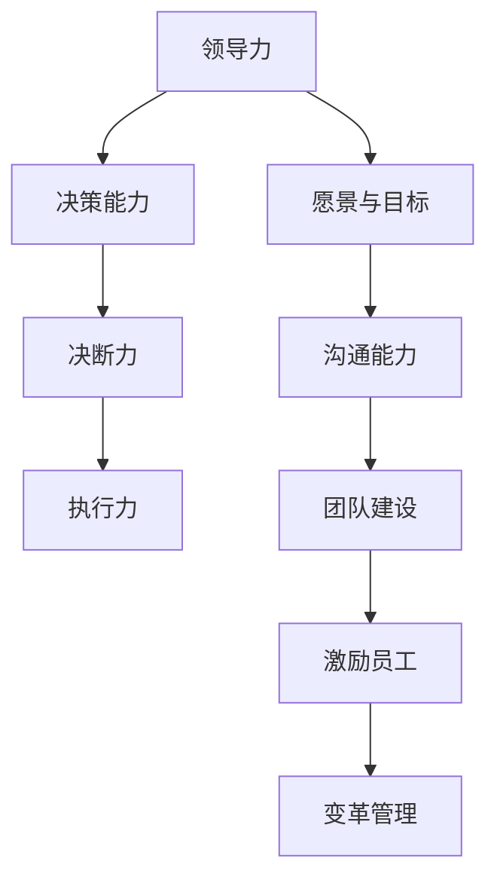

                 


### 引言：领导力与决断力的核心

领导力与决断力是企业管理中不可或缺的两个核心要素。领导力指的是领导者影响和激励团队成员，实现共同目标的能力；而决断力则是在复杂多变的环境中，快速做出合理决策的能力。这两者相互依存，共同构成了领导者处理复杂问题的核心能力。本文旨在深入探讨领导力与决断力之间的关系，并详细介绍如何通过果断决策来提升领导力和决断力。

首先，领导力不仅仅是指导和管理团队的能力，更是一种影响他人的艺术。一个优秀的领导者需要具备愿景、沟通能力、团队建设和激励员工等多方面的素质。而决断力则是在领导力中起到关键作用的因素之一。在面临各种挑战和机遇时，领导者需要能够迅速做出明智的决策，从而引导团队走向成功。

其次，决断力在决策过程中的重要性不言而喻。无论是日常运营中的微小决策，还是战略层面的重大决策，都需要领导者具备果断决策的能力。这不仅关系到企业的发展和员工的士气，更是决定企业在激烈竞争中脱颖而出的关键。

本文将分为以下几个部分进行详细探讨：

1. **领导力的基本概念**：介绍领导力的定义、要素和类型。
2. **决断力的基本概念**：解释决断力的含义、重要性及其培养方法。
3. **领导力与决断力的关系**：通过 Mermaid 流程图展示二者之间的互动关系。
4. **果断决策的心理科学原理**：分析心理学和行为科学对决策的影响。
5. **决策的数学模型与公式**：介绍常用的决策理论和数学模型。
6. **领导力与决断力的实战应用**：通过实际案例展示如何在项目中应用果断决策。
7. **决断力的培养与提升**：提供提升决断力的方法和工具。
8. **领导力与决断力的未来发展趋势**：探讨科技对领导力与决断力的影响。
9. **总结与展望**：总结文章主要观点，展望未来发展趋势。

通过这些章节的逐步分析，我们将深入理解领导力与决断力的本质，学会如何在复杂多变的环境中做出果断决策，从而提升个人的领导能力和决断力。

### 领导力的基本概念

领导力是一种引导、激励和影响他人的能力，它是管理者成功的关键因素。首先，我们需要明确领导力的定义。领导力不仅仅是指对团队的直接管理，更重要的是通过影响力来带动团队成员，共同实现目标。根据心理学家罗伯特·凯利（Robert Kelly）的定义，领导力是一种过程，在这个过程中，一个领导者通过其影响力和指导，激励人们为实现共同目标而努力。

领导力的要素包括但不限于以下几个方面：

1. **愿景与目标**：一个优秀的领导者需要具备清晰的愿景，并能够将其转化为具体的目标。愿景为团队指明了方向，目标则为团队成员提供了具体的行动指南。
   
2. **沟通能力**：沟通是领导者与团队成员之间的重要桥梁。有效的沟通能够确保信息准确传达，同时增强团队的凝聚力。
   
3. **团队建设**：团队建设是领导力的核心要素之一。一个成功的领导者需要能够识别和培养团队成员的优势，并促使他们相互协作，共同面对挑战。
   
4. **激励员工**：领导者需要了解不同员工的动机，并运用适当的激励手段，激发员工的潜力，提升其工作积极性和效率。

5. **变革管理**：在快速变化的环境中，领导者需要具备应对变革的能力，能够带领团队适应新的挑战和机遇。

领导力的类型可以分为多种，主要包括：

1. **权威型领导**：权威型领导者通过严格的规定和命令来管理团队，适合在紧急情况下使用。
   
2. **民主型领导**：民主型领导者鼓励团队成员参与决策，强调团队合作和民主管理。
   
3. **变革型领导**：变革型领导者具有强烈的变革意愿，能够推动团队实现重大变革。
   
4. **服务型领导**：服务型领导者关注团队成员的需求，致力于为团队成员提供支持和帮助。

为了更好地理解领导力的应用，我们可以通过一个实际案例来探讨。例如，某科技公司的一个新项目需要迅速启动。作为项目负责人，领导者的职责是确保项目的顺利进行，并在团队成员面临困难时提供指导和支持。在这个过程中，领导者的愿景与目标设定、沟通能力、团队建设、激励员工和变革管理能力都将起到至关重要的作用。

通过这个案例，我们可以看到领导力在项目管理中的具体应用。领导者的决断力同样在这个过程中起到关键作用。当项目面临技术难题或资源不足时，领导者需要能够迅速做出合理的决策，确保项目按时完成。这种果断决策的能力是领导力的一个重要体现。

总之，领导力不仅是一种个人素质，更是一种通过影响力来激励和引导团队的能力。掌握领导力的基本概念和要素，对于提升个人的领导能力和决断力至关重要。在下一章节中，我们将深入探讨决断力的基本概念，进一步理解其在领导力中的重要性。

### 决断力的基本概念

决断力，顾名思义，是一种在复杂多变的环境中迅速做出合理决策的能力。它是领导者面对各种挑战和机遇时，所表现出的关键素质。决断力不仅关乎个人能力，更是一种综合心理素质和技能的体现。那么，决断力的具体定义是什么？它的重要性又体现在哪些方面？

首先，我们来看决断力的定义。决断力可以理解为一种快速识别问题、分析解决方案、做出决策并实施的能力。它不仅仅是简单的“拍板决策”，而是一个系统化的过程，涉及信息收集、分析评估、选择方案和执行监控等多个环节。在这个过程中，领导者需要具备敏锐的洞察力、清晰的判断力和果断的行动力。

其次，决断力的重要性不容忽视。在企业管理中，决断力主要体现在以下几个方面：

1. **决策效率**：面对突发事件或市场变化，领导者需要迅速做出决策，以确保企业能够及时应对。高效决策能够减少因犹豫不决带来的机会成本，提高企业的市场竞争力。

2. **风险管理**：在复杂的环境中，领导者需要具备预见潜在风险和应对不确定性的能力。果断决策能够帮助企业规避风险，降低运营成本。

3. **团队激励**：领导者的决断力直接影响团队的士气和凝聚力。一个果断的领导者能够为团队树立信心，激励团队成员在面对困难时保持积极态度。

4. **战略规划**：决断力在战略规划中起到关键作用。领导者需要通过果断决策，确保企业能够在战略实施过程中保持灵活性和适应性。

为了培养和提高决断力，领导者可以采取以下几种方法：

1. **强化信息收集能力**：及时获取准确的信息是做出合理决策的前提。领导者需要建立健全的信息收集系统，确保信息来源的多样性和可靠性。

2. **提升分析评估能力**：在面对多个决策选项时，领导者需要能够快速分析各选项的优缺点，并从中选择最优方案。这需要领导者具备良好的逻辑思维和分析能力。

3. **增强心理素质**：决断力在很大程度上取决于心理素质。领导者需要培养冷静、自信、果断的心理品质，以应对各种复杂和压力。

4. **实践锻炼**：决断力是一种可以通过实践不断锻炼和提升的能力。领导者可以通过模拟演练、实际操作等方式，不断积累决策经验。

总之，决断力是领导力的重要组成部分，它决定了领导者在复杂环境中的应对能力和战略眼光。通过理解决断力的基本概念和重要性，并采取有效的方法进行培养，领导者可以显著提升自己的决策质量和效率，从而更好地应对企业内外部的挑战。在下一章节中，我们将深入探讨领导力与决断力之间的互动关系，以及如何通过果断决策来提升这两方面的能力。

### 领导力与决断力的关系

领导力与决断力是相辅相成的两个关键要素，它们之间的关系可以用一个简明的 Mermaid 流程图来展示：



在这个流程图中，我们可以看到领导力通过多个方面对决策能力产生重要影响，而决策能力则直接决定了决断力。具体来说：

1. **决策能力**：领导力的核心之一是决策能力，这包括了制定战略目标、分析各种选项、评估潜在风险以及选择最优方案。一个具备强大决策能力的领导者能够快速识别问题并找到解决方案。

2. **决断力**：决断力是决策能力的一部分，但它更强调快速做出决策并付诸行动。在复杂多变的环境中，领导者需要具备迅速做出合理决策的能力，以确保企业或团队能够在最短时间内应对挑战。

3. **执行力**：决断力不仅关乎决策的速度，还关乎决策的质量和执行力。一个果断的领导者能够确保决策得到有效执行，从而实现既定目标。

4. **领导力的其他方面**：领导力还包括愿景与目标设定、沟通能力、团队建设、激励员工和变革管理。这些方面共同构成了领导力的基础，为决策能力和决断力的发挥提供了有力支持。

通过这个 Mermaid 流程图，我们可以清晰地看到领导力与决断力之间的密切关系。领导力为决断力提供了坚实的基础，而决断力则是领导力在实际操作中的具体体现。在实际应用中，领导者需要灵活运用这两个能力，以应对不断变化的外部环境。

例如，在一个企业中，领导力可以通过设定清晰的企业愿景和目标，确保团队成员都朝着共同的方向努力。而决断力则体现在当市场发生重大变化时，领导者能够迅速调整策略，做出合理决策，并推动团队迅速执行新方案。这种果断决策的能力不仅能够帮助企业应对突发危机，还能够抓住市场机遇，实现企业的持续增长。

总之，领导力与决断力之间的互动关系是一个动态的过程。通过理解和应用这个关系，领导者可以更好地提升自己的决策能力和决断力，从而在复杂多变的环境中实现卓越的领导。在下一章节中，我们将进一步探讨果断决策在心理学和行为科学中的原理，以深入了解决策过程中可能遇到的心理障碍和应对策略。

### 果断决策的心理科学原理

果断决策不仅需要逻辑思维和数据分析能力，更离不开心理学和行为科学的支持。心理学和行为科学为我们揭示了决策过程中常见的心理障碍以及如何克服这些障碍，从而实现更加果断和明智的决策。

首先，心理学研究指出，决策过程中最常见的心理障碍之一是“拖延症”。拖延症导致领导者犹豫不决，无法迅速做出决策。为了克服拖延症，领导者需要建立明确的时间管理策略，设置具体的决策截止时间，并对自己设定一定的压力和激励机制。

其次，认知偏见是另一个影响决策果断性的重要因素。认知偏见包括许多心理现象，如确认偏见、代表性偏差、锚定效应等。确认偏见指的是人们倾向于接受和重视与自己已有观点一致的信息，而忽视或否定相反的信息。代表性偏差是指人们根据事物的外表或典型特征进行判断，而不是基于全面的信息。锚定效应则是指人们在做决策时会受到最初信息的影响，即使这些信息并不重要。

为了克服这些认知偏见，领导者需要保持开放的心态，广泛收集信息，并采用系统化的方法进行决策。例如，可以通过设立跨职能团队，邀请不同背景和观点的人参与决策，以避免单一视角带来的偏见。

第三，情绪对决策的影响也不可忽视。情绪可能会对决策产生积极或消极的影响。积极的情绪如自信和乐观可以提高决策效率，而消极的情绪如焦虑和恐惧则可能导致决策失误。为了有效管理情绪，领导者可以采取一些心理调适技巧，如深呼吸、冥想和运动等，以保持情绪稳定。

行为科学还揭示了决策过程中的一些最佳实践方法。首先，领导者应该进行充分的风险评估，明确决策的潜在风险和收益。这可以通过构建决策树模型或使用其他风险评估工具来实现。

其次，领导者应该采用“决策框架”方法，明确决策的目标和标准。决策框架可以帮助领导者理清思路，确保决策过程有条不紊。例如，可以设定决策的优先级、明确决策的关键参数和标准，以及确定决策的执行计划。

最后，领导者还应该注重决策后的反思和评估。通过反思和评估，领导者可以总结决策过程中的经验教训，不断完善决策方法，提高未来的决策质量。

为了更好地理解这些心理学和行为科学原理，我们可以通过一个具体的案例来说明。假设一个科技公司的领导者需要在产品开发过程中做出关键决策。为了克服拖延症，他设定了明确的决策时间表，并在每个阶段设置具体的截止日期。为了减少认知偏见，他组建了一个由不同背景成员组成的团队，确保从多个角度进行评估。他还定期进行心理调适，保持情绪稳定。在风险评估方面，他使用了决策树模型，详细分析了各种开发路径的风险和收益。最后，他建立了决策框架，明确产品的目标市场、技术标准和时间计划，确保决策过程有条不紊。

通过这个案例，我们可以看到如何运用心理学和行为科学原理来提升决策果断性。首先，领导者需要建立明确的时间管理策略，克服拖延症。其次，领导者需要保持开放心态，减少认知偏见。此外，情绪管理、风险评估和决策框架的运用都是提升决策果断性的关键因素。

总之，果断决策不仅需要逻辑思维和数据分析能力，还需要运用心理学和行为科学原理来克服心理障碍。通过这些方法，领导者可以显著提高决策效率和质量，从而在复杂多变的环境中实现卓越的领导。在下一章节中，我们将进一步探讨决策的数学模型和公式，以深入理解决策过程中的量化分析方法。

### 决策的数学模型与公式

在决策过程中，数学模型和公式提供了量化的分析方法，帮助我们更系统地评估各种决策选项。以下是几个常见的决策模型和相关的数学公式：

1. **决策树模型**：

决策树模型是一种图形化的工具，用于展示不同决策路径及其结果。每个节点代表一个决策点或一个结果点，边表示决策或结果的分支。

基本公式：
\[ V(S) = \sum_{i} p_i \times V(R_i) \]
其中：
- \( V(S) \) 是决策节点的总价值
- \( p_i \) 是第 \( i \) 个结果的概率
- \( V(R_i) \) 是第 \( i \) 个结果的价值

例如，一个企业需要决定是否扩大生产线。通过决策树，可以计算不同结果（如市场需求高、中等、低）的概率和价值，从而选择最佳策略。

2. **预期效用理论**：

预期效用理论（Expected Utility Theory）是经济学中一个核心概念，用于评估决策的预期效用。基本公式如下：

\[ EU = \sum_{i} u(x_i) \times p_i \]
其中：
- \( EU \) 是预期效用
- \( u(x_i) \) 是第 \( i \) 个结果的价值函数
- \( p_i \) 是第 \( i \) 个结果发生的概率

通过预期效用理论，可以量化决策的收益和风险，从而选择具有最高预期效用的选项。

3. **最大化最小值规则（Maximin Rule）**：

最大化最小值规则是一种保守的决策方法，用于在面对不确定性和潜在风险时做出决策。基本公式如下：

\[ \text{max} \{ \min_{w} V(w) \} \]
其中：
- \( V(w) \) 是在不同条件下决策的价值
- \( w \) 是不同的决策变量

该规则通过选择最小损失最大的策略，以降低风险。

4. **线性规划（Linear Programming）**：

线性规划是一种用于在多个约束条件下最大化或最小化一个线性目标函数的方法。标准形式如下：

\[
\begin{align*}
\text{maximize} \quad & c^T x \\
\text{subject to} \quad & Ax \le b \\
& x \ge 0
\end{align*}
\]
其中：
- \( c \) 是目标函数的系数向量
- \( x \) 是决策变量向量
- \( A \) 是约束条件的系数矩阵
- \( b \) 是约束条件的常数向量

线性规划广泛应用于资源分配、生产调度、项目预算等决策问题。

以下是一个简单的 Python 代码示例，用于计算决策树模型：

```python
import numpy as np

# 决策树模型参数
probabilities = [0.3, 0.4, 0.3]  # 不同结果的概率
values = [100, 0, -50]  # 不同结果的价值

# 计算总价值
total_value = np.dot(probabilities, values)
print("决策树总价值：", total_value)
```

通过这个示例，我们可以看到如何使用 Python 计算决策树模型的总价值。在实际应用中，这些数学模型和公式可以帮助领导者更系统、更准确地评估各种决策选项，从而做出更加果断和明智的决策。

### 领导力与决断力的实战应用

在真实项目中，领导力与决断力的应用对于项目的成功至关重要。以下我们将通过一个实际案例，展示如何在实际项目中运用领导力和决断力，以及这些能力在项目中的具体体现。

**案例背景**：某科技公司计划开发一款全新的智能家居控制系统。这个项目涉及多个团队，包括研发、市场、设计和运营。由于市场竞争激烈，项目必须在短时间内完成并投入使用。

**步骤1：项目启动**

- **领导力展现**：项目启动初期，项目负责人需要明确项目的愿景和目标。通过召开项目启动会议，项目负责人详细阐述了项目的意义、目标和预期成果，激发了团队的积极性。

- **决断力应用**：在项目启动阶段，项目负责人需要迅速确定项目团队的核心成员和关键任务。在面临人力资源短缺的情况下，项目负责人果断决定从其他部门借调员工，确保项目进度不受影响。

**步骤2：需求分析与规划**

- **领导力展现**：在需求分析阶段，项目负责人组织了跨部门会议，与市场、设计、研发等团队成员密切合作，确保需求分析的全面性和准确性。通过有效的沟通和协调，项目负责人确保了各方需求的统一和共识。

- **决断力应用**：在规划阶段，项目负责人面临多个技术方案的选择。通过召开技术评审会议，项目负责人与技术人员一起评估了各种方案的可行性、成本和风险，最终果断选择了最优的技术方案。

**步骤3：项目实施**

- **领导力展现**：在项目实施过程中，项目负责人需要定期召开项目进度会议，了解各个团队的工作进展，并协调解决项目中出现的各种问题。通过有效的沟通和协调，项目负责人确保了项目进度的可控性和稳定性。

- **决断力应用**：在项目实施过程中，项目负责人需要应对各种突发问题。例如，当技术团队在开发过程中遇到难题时，项目负责人果断决定引入外部技术支持，确保项目能够按时完成。

**步骤4：项目收尾与评估**

- **领导力展现**：在项目收尾阶段，项目负责人组织了项目总结会议，对项目过程和成果进行评估和总结。通过总结经验教训，项目负责人为未来的项目提供了宝贵的参考。

- **决断力应用**：在项目评估过程中，项目负责人需要对项目的成功与否做出明确判断。通过数据分析和技术评审，项目负责人果断地评估了项目的成果，并提出了改进意见。

**项目小结**：

通过上述案例，我们可以看到领导力与决断力在项目中的具体应用。领导力在项目的各个阶段都发挥了重要作用，通过有效的沟通、协调和激励，确保项目顺利进行。决断力则在面对各种挑战和决策时，帮助项目负责人迅速做出合理的决策，确保项目按时完成。

总之，领导力与决断力是领导者不可或缺的能力。在实际项目中，领导者需要通过灵活运用这些能力，确保项目能够应对各种挑战，实现预期的目标。通过这个案例，我们可以深入了解领导力与决断力在项目管理中的具体应用，并为未来的项目提供有益的借鉴。

### 决断力的培养与提升

要提升决断力，首先需要理解其培养和提升的方法。以下是几个有效的策略：

1. **加强信息收集能力**：及时、准确地收集信息是果断决策的基础。领导者应建立完善的信息收集系统，确保获取多样化的信息来源，并对其进行系统化整理和分析。

2. **提高分析评估能力**：面对多个决策选项时，领导者需要具备快速分析各选项优缺点的能力。可以通过日常练习和模拟情境，提高自己的逻辑思维和判断力。

3. **增强心理素质**：决断力在很大程度上取决于心理素质。领导者应培养冷静、自信、果断的心理品质，学会应对压力和不确定性。冥想、深呼吸和运动等技巧可以帮助领导者保持情绪稳定。

4. **实践锻炼**：决断力是一种可以通过实践不断锻炼和提升的能力。领导者应积极参与各种实际项目和决策，不断积累决策经验，从每次决策中吸取教训，不断完善自己的决策过程。

5. **构建支持系统**：一个强大的支持系统能够为领导者提供必要的资源和支持。包括知识库、专家团队和决策支持工具等，都能够帮助领导者更好地做出决策。

6. **学习借鉴**：通过学习成功领导者的经验和案例，领导者可以吸取宝贵的教训，了解不同的决策方法和技巧。阅读相关书籍、参加研讨会和培训课程都是有效的学习方式。

此外，为了更具体地说明决断力的培养，我们可以给出一些最佳实践 tip：

- **每日反思**：每天花时间反思自己的决策过程，思考哪些决策做得好，哪些需要改进。这种自我反思有助于提高决策质量和效率。
- **模拟决策练习**：通过模拟实际决策场景，提前演练可能的决策方案和结果，提高在真实场景下的应变能力和果断性。
- **设立决策标准**：明确自己的决策标准，例如优先考虑哪些因素、决策的优先级等，这有助于在决策时保持客观和理性。

最后，注意事项包括：

- **避免过度分析**：过度分析可能导致拖延和犹豫，影响决策的果断性。学会在适当的时间内做出决策，不要过分追求完美。
- **平衡风险与收益**：在决策时，领导者应充分考虑风险和收益，不要因为恐惧风险而放弃有潜力的决策。
- **持续学习与成长**：决断力是一种持续发展的能力，领导者应保持学习的态度，不断更新知识和技能，以适应不断变化的环境。

通过这些方法和最佳实践，领导者可以显著提升自己的决断力，从而在复杂多变的环境中做出更加果断和明智的决策。在下一章节中，我们将探讨领导力与决断力的未来发展趋势，进一步理解这两个领域的发展方向。

### 领导力与决断力的未来发展趋势

随着科技的飞速发展，领导力与决断力也在不断演变。人工智能、大数据和区块链等新兴技术的出现，为领导力与决断力的提升带来了新的机遇和挑战。

首先，人工智能（AI）在领导力中的应用日益广泛。AI可以帮助领导者进行数据分析和预测，从而做出更加明智的决策。例如，通过机器学习算法，企业可以分析市场趋势、消费者行为和竞争动态，为战略决策提供有力支持。此外，AI还可以用于自动化日常管理任务，减轻领导者的负担，使他们能够更专注于战略思考和重大决策。

其次，大数据技术的进步为领导者提供了更丰富的数据资源和更强大的分析工具。大数据可以帮助领导者全面了解企业运营情况和市场环境，从而做出更加科学的决策。通过大数据分析，领导者可以识别潜在的风险和机会，优化资源配置，提高决策的准确性和效率。

第三，区块链技术正在改变传统决策模式。区块链提供了一种去中心化的决策机制，使领导者能够更好地实现透明、公正和高效的决策。在区块链上，所有决策记录都是透明且不可篡改的，这有助于增强决策的公信力，减少信息不对称和腐败现象。

未来，领导力与决断力的发展将面临以下几个趋势：

1. **智能化决策**：随着AI和大数据技术的进一步发展，领导者的决策将更加智能化。通过AI算法和大数据分析，领导者可以实时获取最新的市场信息和企业数据，快速做出反应。

2. **分布式决策**：区块链技术将推动决策权力更加分散和民主化。在分布式网络中，每个参与者都可以参与决策过程，提高了决策的透明度和参与度。

3. **情境适应性**：未来的领导者需要具备更强的情境适应性。随着环境的变化和技术的进步，领导者需要能够灵活调整决策策略，应对不断变化的外部环境。

4. **可持续领导**：随着全球环境问题的日益突出，领导者需要在决策中考虑可持续发展。这要求领导者具备前瞻性的眼光，能够在长期利益和短期利益之间找到平衡。

总之，随着科技的进步，领导力与决断力将不断演变。未来的领导者需要具备更强的技术洞察力、数据分析和情境适应能力，才能在复杂多变的环境中实现卓越的领导。通过不断学习和适应新技术，领导者可以不断提升自己的决策能力，为企业和社会创造更大的价值。

### 全球领导力与决断力的趋势

随着全球化进程的不断推进，领导力与决断力也在不同国家和地区展现出各自的特点。各国文化、社会结构和经济环境的不同，导致了领导力和决断力在实际应用中的差异。

首先，北美地区的领导力与决断力强调个人主义和效率。在北美，领导者通常需要具备强大的个人决策能力，能够在短时间内做出高效决策。这种领导风格在快速发展的科技公司中尤为常见。例如，硅谷的企业领导者经常通过数据驱动的方法来做出决策，强调创新和执行力。

相比之下，欧洲的领导力与决断力则更注重团队合作和长期战略。欧洲的领导者更倾向于通过集体讨论和共识来做出决策，以确保决策的全面性和可执行性。这种领导风格在公共部门和传统制造业中较为普遍。例如，欧洲的一些大型企业会成立跨部门的决策团队，通过多次讨论和修正来制定战略计划。

亚洲的领导力与决断力则表现出较强的家庭和集体主义色彩。在亚洲，特别是中国和日本，领导者通常注重人际关系和和谐，倾向于通过协商和共识来达成决策。这种领导风格在家族企业和长期经营的企业中非常普遍。例如，在中国的一些家族企业中，领导者会通过家族会议和董事会来做出重大决策，以确保所有利益相关者的意见都得到充分考虑。

此外，新兴市场的领导力与决断力呈现出多样性和适应性。在非洲、拉丁美洲等新兴市场，领导力与决断力需要同时应对快速变化的经济环境和社会结构。这些市场的领导者需要具备较强的灵活性和应变能力，能够在复杂多变的环境中迅速做出合理决策。例如，在非洲的一些初创企业中，领导者经常需要通过快速调整策略来应对政策和市场变化。

总的来说，全球领导力与决断力的趋势呈现出多样性和适应性。不同地区的领导者需要根据自身的文化背景、社会结构和经济环境，灵活运用不同的领导风格和决策方法。通过了解和适应这些趋势，领导者可以更好地应对全球化带来的挑战，实现卓越的领导。

### 总结与展望

通过本文的深入探讨，我们系统地分析了领导力与决断力的核心概念、它们之间的互动关系，以及如何在实际项目中应用果断决策。首先，领导力不仅仅是管理团队的能力，更是通过影响力激励他人实现共同目标的综合素质。决断力则是快速做出合理决策的关键能力，它决定了领导者在复杂环境中的应变能力和战略眼光。二者相互依存，共同构成了领导者处理复杂问题的核心能力。

在文章中，我们详细介绍了领导力和决断力的基本概念，并通过 Mermaid 流程图展示了它们之间的互动关系。通过心理学和行为科学原理，我们了解了如何克服决策过程中的心理障碍，提升决策果断性。同时，通过数学模型和公式的介绍，我们掌握了量化的决策分析方法，使决策过程更加科学和系统。

在实战案例中，我们展示了领导力与决断力在实际项目中的应用，包括项目启动、需求分析、项目实施和项目收尾等各个阶段。通过这些实际案例，我们看到了领导力与决断力如何帮助领导者应对各种挑战，确保项目成功。

决断力的培养与提升方法，以及全球领导力与决断力的趋势，也为领导者提供了实用的指导。未来，随着科技的不断进步，领导力与决断力将迎来更多新的发展机遇和挑战。领导者需要不断学习和适应，以应对全球化带来的复杂环境。

展望未来，领导力与决断力的发展将更加智能化、分布式和情境适应性。领导者不仅需要具备强大的技术洞察力和数据分析能力，还需要具备前瞻性的战略眼光和灵活的应变能力。通过不断学习和实践，领导者可以不断提升自己的领导力和决断力，实现卓越的领导。

### 作者信息

作者：AI天才研究院/AI Genius Institute & 禅与计算机程序设计艺术 /Zen And The Art of Computer Programming

