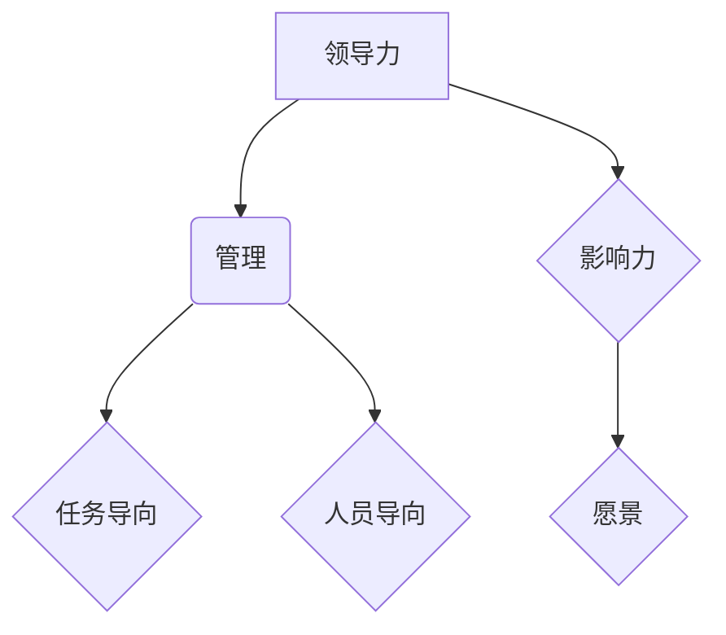
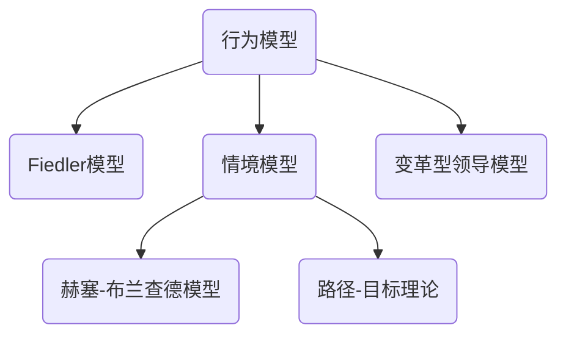
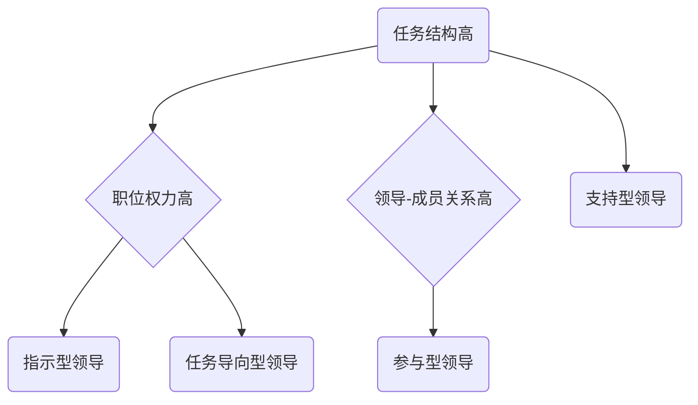
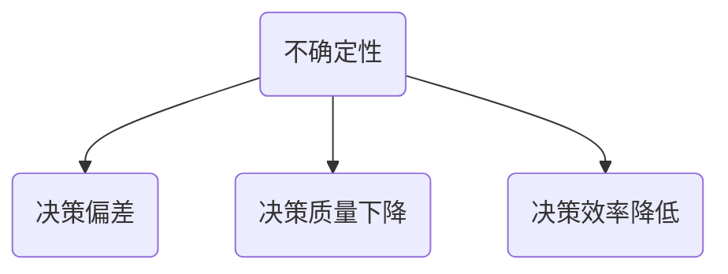

                 

### 引言

在当今快节奏、高度复杂的信息化社会中，领导力和决策能力成为企业成功和持续发展的关键因素。然而，领导者面对的不确定性环境日益加剧，如何在这种不确定性中做出明智的决策，是每一位领导者都必须面对的挑战。

本文旨在探讨领导力与决策之间的关系，特别是在不确定性环境中如何发挥领导力，做出有效的决策。文章将从领导力的基础概念与构建开始，详细分析领导力与管理的区别，介绍核心的领导力模型及其应用场景。随后，文章将深入讨论决策理论的演变与核心要素，并结合实际案例展示如何应用决策模型。在应对不确定性的策略部分，我们将探讨风险管理、情景规划等策略，并提供实战案例来加深理解。

通过本文，读者将能够全面了解领导力和决策的基本理论、核心方法以及在实际操作中的应用，从而提升自己的领导力和决策能力，在不确定性中把握方向。

### 关键词

- **领导力**
- **决策理论**
- **不确定性管理**
- **领导力模型**
- **决策模型**
- **情境规划**
- **风险管理**

### 摘要

本文通过系统探讨领导力与决策之间的关系，阐述了在不确定性环境中如何发挥领导力，做出有效的决策。文章首先介绍了领导力的基础概念和构建，分析了领导力与管理的区别，并详细介绍了核心的领导力模型及其应用场景。随后，文章探讨了决策理论的演变与核心要素，结合实际案例展示了如何应用决策模型。在应对不确定性的策略部分，文章提出了风险管理、情景规划等策略，并通过实战案例进行了深入分析。通过本文，读者将能够提升自己的领导力和决策能力，从而在不确定性中把握方向，实现组织的目标。

### 第一部分：领导力的基础概念与构建

#### 第1章：领导力的重要性与基本理论

##### 1.1 领导力的定义与演变

领导力是一个复杂且多维度的概念，它随着历史和文化的演变而不断发展。从传统的权威型领导到现代的变革型领导，再到未来可能出现的智能与数据驱动型领导，领导力的定义和理念经历了多次转变。

- **传统领导力**：在19世纪至20世纪，领导力主要基于权威和命令。领导者通过权力和控制来指挥下属，强调的是任务的完成和纪律的执行。

- **现代领导力**：随着管理科学的兴起和人性化管理的推广，领导力逐渐从单向的指令转变为双向的沟通和协作。领导者不仅需要具备技术能力，还需要具备人际交往和团队建设的能力。

- **未来领导力**：随着人工智能和数据技术的不断发展，未来的领导力可能更加依赖于智能和数据驱动。领导者不仅需要具备战略思维，还需要具备快速适应和创新的能力。

**图 1.1：领导力概念演变流程图**

```mermaid
sequence
participant A as 领导力概念
participant B as 传统领导
participant C as 现代领导
participant D as 未来领导
A->>B: 19世纪至20世纪
B->>C: 管理科学与人性化管理
B->>D: 智能与数据驱动
```

##### 1.2 领导力与管理的区别

领导力与管理的区别在于它们的核心目标和方法。管理侧重于任务和流程，强调的是效率和控制；而领导力则侧重于影响和愿景，强调的是激励和创新。

- **任务导向**：管理的主要目标是确保任务的完成，通过制定规则和流程来确保工作的高效执行。

- **人员导向**：领导力则更注重人，通过激励和培养来提升团队的凝聚力和创造力。

**图 1.2：领导力与管理的比较图**



##### 1.3 领导力的核心要素

领导力的核心要素包括愿景、影响力、决策能力、沟通技巧和团队建设。这些要素相互关联，共同构成了一个高效的领导力体系。

- **愿景**：领导者需要有清晰的愿景，能够为团队指明方向，激发员工的热情和动力。

- **影响力**：领导者需要具备影响力，能够通过沟通和行动影响他人，推动团队向前发展。

- **决策能力**：领导者需要具备良好的决策能力，能够在复杂和不确定的环境中做出明智的决策。

- **沟通技巧**：领导者需要具备良好的沟通技巧，能够有效地传达信息，建立良好的团队氛围。

- **团队建设**：领导者需要关注团队建设，通过培养团队凝聚力，提升团队的整体绩效。

**伪代码：领导力核心要素识别算法**

```python
def identify_leadership_elements():
    elements = ["愿景", "影响力", "决策能力", "沟通技巧", "团队建设"]
    return elements
```

通过以上分析，我们可以看到领导力不仅是一种个人能力，更是一种系统的构建。领导者需要通过不断地学习和实践，提升自己的领导力，以应对复杂多变的环境，实现组织的目标。

### 第2章：领导力模型与应用场景

#### 2.1 领导力模型概述

领导力模型是研究领导行为的工具，通过对不同领导风格和策略的归纳和分类，帮助领导者理解如何在不同情境下发挥领导力。领导力模型可以分为行为模型、情境模型和变革型领导模型三大类。

**图 2.1：领导力模型分类图**



##### 2.1.1 行为模型

行为模型主要通过分析领导者的行为特征来分类。最著名的例子是领导行为四分图模型和路径-目标理论。

- **领导行为四分图模型**：该模型将领导行为分为任务导向和人际导向两个维度，通过这两个维度的组合，形成了四种不同的领导风格。

- **路径-目标理论**：该理论认为领导者的任务是帮助下属明确目标，并提供实现目标的路径。领导者根据下属的不同需求，采用不同的领导风格。

##### 2.1.2 情境模型

情境模型则强调领导行为应根据具体情境进行调整。最著名的情境模型包括赫塞-布兰查德模型和路径-目标理论。

- **赫塞-布兰查德模型**：该模型根据下属的成熟度（能力与意愿）将领导风格分为四种：指示型、支持型、参与型和授权型。

- **路径-目标理论**：该理论认为领导者的任务是帮助下属明确目标，并提供实现目标的路径。领导者根据下属的不同需求，采用不同的领导风格。

##### 2.1.3 变革型领导模型

变革型领导模型关注领导者在推动组织变革中的作用。最著名的变革型领导模型是伯恩斯模型。

- **伯恩斯模型**：该模型认为变革型领导者通过激发下属的内在动力，推动组织实现变革。领导者通过变革愿景、激励下属和提升下属的自信心来实现这一目标。

#### 2.2 领导力模型的应用

不同的领导力模型适用于不同的情境和需求。以下是对几种常见领导力模型的应用场景的详细分析。

##### 2.2.1 Fiedler模型

Fiedler模型是一种基于情境的行为模型，它通过领导者-成员关系、任务结构和职位权力三个维度来评估领导者的风格。

- **应用场景**：Fiedler模型适用于任务导向的环境，特别是当任务结构清晰，领导者与团队成员关系良好时。这种模型在稳定和结构化的环境中效果最佳。

- **优缺点**：Fiedler模型的优势在于它提供了一个系统的工具来评估领导者的风格，并建议如何调整领导行为以适应不同的情境。然而，该模型也存在一些局限性，例如它过于依赖主观评价，且忽略了领导者的个人发展和适应性。

**图 2.2：Fiedler模型的应用场景分析**



##### 2.2.2 赫塞-布兰查德模型

赫塞-布兰查德模型是一种情境模型，它根据下属的成熟度将领导风格分为四种。

- **应用场景**：该模型适用于团队发展的不同阶段。在团队初期，领导者需要更多地指示和指导下属；在团队成熟阶段，领导者可以更多地授权和参与。

- **优缺点**：赫塞-布兰查德模型的优势在于它提供了一个灵活的领导力框架，可以帮助领导者根据团队的不同发展阶段进行调整。然而，该模型的缺点在于它过于简化了领导行为的复杂性，且忽略了领导者的个性特征。

**图 2.3：赫塞-布兰查德模型的应用场景分析**

```mermaid
graph TB
A(指示型领导) --> B{下属成熟度低}
A --> C(支持型领导)
B --> D(参与型领导)
C --> E(授权型领导)
A --> F(下属成熟度高}
```

##### 2.2.3 路径-目标理论

路径-目标理论认为领导者的任务是帮助下属明确目标，并提供实现目标的路径。

- **应用场景**：该模型适用于复杂和不确定的环境，特别是在团队需要明确目标和路径时。例如，在产品开发或市场拓展等项目中，领导者需要明确目标并提供具体的行动步骤。

- **优缺点**：路径-目标理论的优势在于它提供了一个系统的框架来帮助领导者制定目标和路径。然而，该模型的缺点在于它忽略了领导者的激励作用，且在实际应用中可能存在实施难度。

**图 2.4：路径-目标理论的应用场景分析**

```mermaid
graph TB
A(明确目标) --> B{提供路径}
A --> C(激励下属)
B --> D(提高团队绩效}
```

通过以上分析，我们可以看到不同的领导力模型适用于不同的情境和需求。领导者需要根据具体情境选择合适的领导风格，以实现最佳效果。

### 第3章：决策理论的演进与核心

#### 3.1 决策理论的演变

决策理论的发展历程可以分为几个阶段，从古典决策理论到现代决策理论，再到当前正在发展的决策认知理论和决策行为理论。

**图 3.1：决策理论演变流程图**

```mermaid
sequence
participant A as 古典决策理论
participant B as 决策过程理论
participant C as 决策认知理论
participant D as 决策行为理论
A->>B: 20世纪50年代
B->>C: 20世纪70年代
C->>D: 21世纪
```

##### 3.1.1 古典决策理论

古典决策理论主要基于经济学的理性选择模型。它假设决策者在完全信息、确定性和最大化效用的条件下做出决策。古典决策理论的核心观点是，决策者通过最大化收益和最小化损失来实现最优决策。

- **核心假设**：完全理性、完全信息、确定性、最大化效用。
- **适用场景**：适用于简单和稳定的决策环境。

##### 3.1.2 决策过程理论

随着环境的复杂性和不确定性增加，古典决策理论的局限性逐渐显现。决策过程理论因此诞生，它强调决策是一个动态的过程，涉及多个阶段和多个参与者。

- **核心观点**：决策是一个动态的、迭代的过程，涉及信息的收集、分析、评估和选择。
- **适用场景**：适用于复杂和不确定的决策环境。

##### 3.1.3 决策认知理论

决策认知理论进一步探讨了人类决策过程中的认知局限和偏见。它认为决策者在信息处理过程中受到多种认知偏差的影响，从而导致决策质量下降。

- **核心观点**：决策者存在认知局限和偏见，这些偏见会影响决策的质量。
- **适用场景**：适用于需要深入分析决策者认知过程的决策环境。

##### 3.1.4 决策行为理论

决策行为理论将心理学和行为科学引入决策研究，强调决策者的行为和情感对决策过程和结果的影响。

- **核心观点**：决策是一个行为和情感过程，决策者的行为和情感会影响决策的质量。
- **适用场景**：适用于需要理解决策者行为和情感的决策环境。

#### 3.2 决策的核心要素

尽管决策理论不断演进，但决策的核心要素始终保持不变。以下是决策的核心要素及其相互关系：

- **信息收集**：决策者需要收集与决策相关的信息，包括数据、事实和观点。信息的质量和数量直接影响决策的质量。
- **目标设定**：决策者需要明确决策的目标，这些目标应具有明确性、可行性和可衡量性。
- **方案评估**：决策者需要评估不同的决策方案，包括其潜在的风险和收益。评估应基于科学的方法和工具，如决策树、成本效益分析和敏感性分析。
- **决策选择**：决策者需要在评估的基础上选择最佳的决策方案。选择应考虑决策目标、风险和资源约束。
- **执行与反馈**：决策者需要执行决策方案，并根据执行结果进行反馈和调整。反馈是决策过程的重要组成部分，它可以帮助决策者不断优化决策。

**伪代码：决策核心要素分析算法**

```python
def analyze_decision_elements():
    elements = ["信息收集", "目标设定", "方案评估", "决策选择", "执行与反馈"]
    return elements
```

#### 3.3 决策模型的应用

不同的决策模型适用于不同的决策场景。以下是一些常见的决策模型及其特点：

##### 3.3.1 贝叶斯决策模型

贝叶斯决策模型是一种基于概率和统计的决策模型。它通过计算不同决策方案的概率和期望值，选择最优决策。

- **特点**：适用于不确定性和风险决策。
- **适用场景**：适用于医疗诊断、金融投资等需要处理不确定性和风险的领域。

##### 3.3.2 多目标决策模型

多目标决策模型考虑多个目标，通过优化目标之间的平衡来选择最优决策方案。

- **特点**：适用于复杂和多目标的决策环境。
- **适用场景**：适用于资源分配、项目管理和供应链管理等需要同时考虑多个目标的领域。

##### 3.3.3 效用理论模型

效用理论模型基于决策者的偏好，通过计算不同决策方案的总效用来选择最优决策。

- **特点**：适用于决策者有明确偏好的领域。
- **适用场景**：适用于个人决策、投资决策和市场营销等需要考虑决策者偏好的领域。

通过以上分析，我们可以看到决策理论在不同阶段的发展，以及决策的核心要素和常见模型。领导者需要根据具体情境选择合适的决策模型，以做出明智的决策。

### 第4章：在不确定性中做出明智决策

#### 4.1 不确定性对决策的影响

在不确定性环境中，决策变得更加复杂和困难。不确定性可能会导致以下问题：

- **决策偏差**：决策者可能会因为信息不足或时间压力而出现决策偏差，如过度依赖直觉或历史数据。
- **决策质量下降**：不确定性的增加可能会导致决策者难以识别关键信息和评估风险，从而降低决策质量。
- **决策效率降低**：为了应对不确定性，决策者可能需要花费更多的时间和资源来收集和分析信息，从而导致决策效率下降。

**图 4.1：不确定性影响决策的模型**



#### 4.2 应对不确定性的策略

为了在不确定性环境中做出明智的决策，领导者可以采取以下策略：

##### 4.2.1 风险管理

风险管理是一种系统的方法，用于识别、评估和控制风险。领导者可以通过以下步骤实施风险管理：

1. **风险识别**：识别可能影响决策的各种风险因素，如市场变化、技术发展、政策调整等。
2. **风险评估**：评估每种风险的可能性和影响，确定哪些风险需要重点关注。
3. **风险控制**：采取具体的措施来降低风险，如制定应急预案、分散投资、增强灵活性和适应性。

**图 4.2：风险管理流程**

```mermaid
sequence
participant A as 风险识别
participant B as 风险评估
participant C as 风险控制
A->>B: 评估可能风险
B->>C: 评估风险影响
C->>A: 制定应对措施
```

##### 4.2.2 情景规划

情景规划是一种前瞻性思维工具，用于预测可能发生的情景，并制定应对策略。领导者可以通过以下步骤实施情景规划：

1. **情景识别**：识别可能的未来情景，如市场繁荣、技术革命、政治变革等。
2. **情景评估**：评估每种情景的可能性和影响，确定哪些情景需要重点关注。
3. **情景应对**：制定应对每种情景的策略，确保在情景发生时能够迅速响应。

**图 4.3：情景规划流程**

```mermaid
sequence
participant A as 情景识别
participant B as 情景评估
participant C as 情景应对
A->>B: 评估未来情景
B->>C: 制定应对策略
C->>A: 实施应对措施
```

##### 4.2.3 模拟实验

模拟实验是一种通过模拟现实情境来测试不同决策方案的工具。领导者可以通过以下步骤实施模拟实验：

1. **构建模型**：根据现实情境构建模拟模型，确保模型能够反映实际情况。
2. **模拟测试**：在模拟模型中测试不同的决策方案，观察每种方案的结果。
3. **结果分析**：分析模拟实验的结果，评估不同决策方案的效果。

**图 4.4：模拟实验流程**

```mermaid
sequence
participant A as 构建模型
participant B as 模拟测试
participant C as 结果分析
A->>B: 构建模拟模型
B->>C: 测试决策方案
C->>A: 分析结果
```

#### 4.3 实战：不确定性中的决策案例

以下是一个关于公司产品线扩张的决策案例，展示了如何在实际环境中应用上述策略。

**案例背景**：一家生产电子产品的小型企业，面临市场竞争加剧、技术快速迭代的不确定性环境。公司需要决定是否扩大产品线，以应对市场变化。

**决策过程**：

1. **风险管理**：公司首先识别了可能影响决策的各种风险因素，如市场需求变化、技术更新、政策限制等。然后，对每种风险进行了评估，确定了需要重点关注的市场需求和科技发展趋势。

2. **情景规划**：公司根据市场需求和技术发展趋势，预测了三种可能的未来情景：市场需求增长、市场需求稳定、市场需求下降。对于每种情景，公司制定了相应的应对策略。

3. **模拟实验**：公司使用模拟实验工具，构建了一个虚拟市场环境，模拟了不同决策方案的效果。通过模拟实验，公司发现扩大产品线在市场需求增长的情况下能够获得最大的收益。

**决策结果**：基于以上分析，公司决定扩大产品线。在实施过程中，公司采取了风险管理措施，如分散投资、加强市场调研等，确保在不确定性环境中能够灵活应对。

**项目小结**：

通过以上案例，我们可以看到，在不确定性环境中做出明智决策需要综合考虑多种因素。领导者需要运用风险管理、情景规划、模拟实验等策略，以确保在复杂环境中能够做出正确的决策。

### 结论

领导力和决策能力是领导者成功的关键。在不确定性环境中，领导者需要充分发挥领导力，做出明智的决策。本文通过对领导力和决策理论的深入探讨，阐述了领导力的重要性、核心要素和不同模型的应用，以及决策理论的演变和核心要素。同时，通过实际案例展示了如何应对不确定性，做出明智的决策。

未来，领导者和决策者需要不断学习和实践，提升自己的领导力和决策能力。随着科技的进步和社会的变化，领导力和决策理论也将不断发展。领导者需要具备前瞻性思维，适应变化的环境，从而在不确定性中把握方向，实现组织的目标。

### 最佳实践 tips

- **持续学习**：领导者应保持持续学习的态度，不断更新知识和技能，以适应快速变化的环境。
- **倾听员工意见**：领导者应倾听员工的意见和建议，鼓励团队合作，共同应对挑战。
- **灵活应对**：领导者应具备灵活应对变化的能力，能够迅速调整策略，以应对不确定的环境。
- **注重风险管理**：领导者应注重风险管理，提前识别和评估潜在风险，制定应对措施，降低不确定性带来的影响。

### 小结

本文系统地探讨了领导力和决策理论，详细分析了领导力的核心要素和不同模型的应用，以及决策理论的演变和核心要素。通过实际案例展示了如何应对不确定性，做出明智的决策。希望读者能够通过本文的学习，提升自己的领导力和决策能力，在不确定性中把握方向，实现组织的目标。

### 注意事项

- **领导力不是一成不变的**：领导者需要根据环境和团队的变化不断调整自己的领导风格和策略。
- **决策需要数据支持**：在做出决策时，应充分收集和分析数据，以避免基于主观判断的偏差。
- **沟通和协作**：领导者和团队成员之间的有效沟通和协作是决策成功的关键。

### 拓展阅读

- **《领导力五项修炼》**：史蒂芬·柯维
- **《决策与判断》**：丹尼尔·卡内曼
- **《不确定中的决策》**：纳西姆·尼古拉斯·塔勒布

### 作者信息

**作者：AI天才研究院/AI Genius Institute & 禅与计算机程序设计艺术 /Zen And The Art of Computer Programming**

