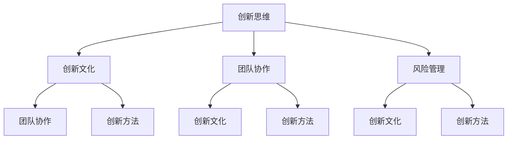

                 

### 领导力与创业精神的结合

领导力与创业精神在激发团队创新中扮演着至关重要的角色。两者并不是相互独立的，而是相互促进、相互依赖的。在探讨这一主题时，我们需要理解它们之间的紧密联系和互动机制。

首先，**领导力**是一种能力，它涉及到引导和激励团队成员以实现共同目标。领导力不仅仅是权威的行使，更是一种信任和合作的建立。领导者需要具备洞察力、决策力和执行力，同时还需要能够激发团队成员的潜力和创造力。有效的领导力能够建立团队的凝聚力，促进团队内部的沟通和协作，从而为创新提供坚实的基础。

其次，**创业精神**则是一种态度和行为，它强调创新、风险承担和持续学习。创业精神鼓励个体或团队不断探索新的想法、挑战现状并付诸实践。它通常伴随着对失败的容忍和对成功的渴望，追求创造价值并实现个人和组织的成长。创业精神强调独立思考和行动力，这种精神往往能够激发团队的创造力和创新意识。

**领导力与创业精神的结合**在团队创新中起到以下几个关键作用：

1. **共同愿景的建立**：领导力帮助团队明确目标，而创业精神则为团队提供了实现目标的方法和动力。通过领导力的指导，团队可以制定清晰的愿景和策略，并通过创业精神的实践将这些愿景转化为具体的行动。

2. **团队凝聚力的增强**：领导力通过建立信任和尊重，增强团队的凝聚力。而创业精神则鼓励团队成员之间的合作和互助，这种合作关系有助于形成创新文化，激发团队成员的创新潜力。

3. **创新的推动力**：领导力能够为团队提供方向和资源，而创业精神则为创新提供了实践的平台。领导者可以通过授权和鼓励，使团队成员敢于尝试新想法，并从失败中学习。这种文化氛围有助于创新思维的发展和应用。

4. **持续学习的动力**：领导力鼓励团队不断学习和成长，而创业精神则促使团队追求卓越和进步。这种持续的 学习和改进过程是团队创新的重要驱动力。

### 联系与互动机制

领导力与创业精神的结合不仅是一种理念，更是一种实践。以下是它们之间的联系与互动机制：

1. **信任与授权**：领导者通过建立信任关系，授权团队成员自主决策和行动，激发创业精神。这种授权不仅提升了团队成员的自主性，也增强了他们对创新的热情和责任感。

2. **反馈与激励**：领导者需要为团队成员提供及时的反馈，激励他们在创新过程中不断进步。创业精神则鼓励团队成员接受反馈，并将其视为改进和成长的机会。

3. **资源与支持**：领导力能够为团队提供必要的资源和支持，如资金、时间和技术等。创业精神则利用这些资源，不断尝试和探索新的创新方案。

4. **文化氛围**：领导力通过建立积极向上的团队文化，鼓励团队成员追求创新。创业精神则通过实践和创新行为，进一步巩固这种文化氛围。

综上所述，领导力与创业精神的结合在激发团队创新中具有不可替代的作用。理解它们之间的紧密联系和互动机制，有助于我们更好地应用这些原则，推动团队的持续创新和发展。

### 团队创新的核心概念与关系架构

在探讨团队创新的过程中，理解一系列核心概念及其相互关系至关重要。这些概念不仅为我们提供了一个理论框架，还帮助我们更深入地理解创新过程中各种因素的相互作用。

**1. 创新思维**

创新思维是团队创新的基础，它涉及开放性、创造性和批判性思维。开放性思维鼓励团队成员接受新的观点和想法，而不受传统思维方式的束缚；创造性思维则通过联想和想象力，生成新颖的概念和解决方案；批判性思维则帮助团队评估和改进这些创新方案。

**2. 创新文化**

创新文化是指一个组织内部对创新的态度和行为方式。它包括鼓励尝试和失败、重视知识和经验的分享、以及支持创新行为的政策和实践。创新文化能够激发团队成员的创新热情，并为他们提供实现创新所需的资源和支持。

**3. 团队协作**

团队协作是实现创新的关键。它强调团队成员之间的沟通、协调和合作，通过共享信息和资源，共同推进创新项目。有效的团队协作能够提高团队的整体效能，加速创新过程。

**4. 风险管理**

在创新过程中，风险是不可避免的。风险管理涉及识别、评估和应对创新过程中的潜在风险。通过有效的风险管理，团队可以减少创新失败的可能性，同时保持创新的活力和动力。

**5. 创新方法**

创新方法是指团队在创新过程中使用的一系列工具和技术。这些方法包括设计思维、TRIZ（创造性问题解决理论）、用户研究、快速原型制作等。创新方法提供了结构化的框架，帮助团队系统性地探索和实现创新。

**关系架构**

以上核心概念之间的关系可以通过Mermaid流程图来表示：



**创新思维**是推动团队创新的核心动力，它直接影响**创新文化**和**团队协作**。一个开放、创造性强的思维环境能够促进创新文化的形成，同时为团队协作提供方向和动力。**风险管理**在这个过程中扮演重要角色，它不仅帮助团队识别潜在风险，还通过合理的应对策略减少风险对创新过程的影响。

**创新文化**和**团队协作**相互促进，共同推动**创新方法**的实施。创新文化提供了一个支持创新的环境，而团队协作则是实现这些创新方法的关键。**创新方法**则为团队提供了具体的技术和工具，帮助他们在创新过程中更加高效地工作。

通过以上关系架构，我们可以更清晰地看到团队创新过程中各个核心概念之间的相互作用，这有助于我们更好地设计和实施创新策略。

### 核心算法原理讲解

在探讨团队创新的过程中，核心算法原理扮演了至关重要的角色。这些算法不仅为团队提供了创新的工具和框架，还帮助团队成员理解和应用创新思维。以下将详细介绍几个关键算法原理，包括它们的定义、应用场景以及如何用Python源代码实现。

#### 1. 设计思维

设计思维是一种以用户为中心的创新方法，它强调通过深入了解用户需求来创造解决方案。设计思维包括五个主要阶段：共鸣（Empathize）、定义（Define）、构思（Ideate）、原型（Prototype）和测试（Test）。

**定义与应用场景**：设计思维主要用于产品开发和服务设计，通过用户研究和用户访谈，定义用户需求，从而创造更符合用户期望的创新解决方案。

**Python实现**：

```python
class DesignMind:
    def __init__(self, user_need):
        self.user_need = user_need

    def empathize(self):
        print("进行用户需求调研和访谈")

    def define(self):
        print(f"定义用户需求：{self.user_need}")

    def ideate(self):
        print("生成多个解决方案")

    def prototype(self):
        print("创建原型")

    def test(self):
        print("进行用户测试和反馈")

# 实例化设计思维对象，并运行流程
design_mind = DesignMind("提高用户满意度")
design_mind.empathize()
design_mind.define()
design_mind.ideate()
design_mind.prototype()
design_mind.test()
```

#### 2. TRIZ方法

TRIZ（理论创造性问题解决）是一种基于数学和逻辑的系统化创新方法。它通过解决一系列矛盾问题，帮助团队找到创新的解决方案。

**定义与应用场景**：TRIZ方法广泛应用于工程、科技和管理领域，通过解决复杂问题，推动技术进步和业务创新。

**Python实现**：

```python
class TRIZ:
    def __init__(self, problem):
        self.problem = problem

    def analyze(self):
        print("分析问题矛盾")

    def solve(self):
        print("应用TRIZ工具解决问题")

    def validate(self):
        print("验证解决方案有效性")

# 实例化TRIZ对象，并运行流程
triz = TRIZ("提高产品性能")
triz.analyze()
triz.solve()
triz.validate()
```

#### 3. 设计迭代

设计迭代是一种通过反复试验和改进来优化解决方案的方法。它强调快速构建和测试原型，从而不断改进产品或服务。

**定义与应用场景**：设计迭代广泛应用于软件开发、产品设计等领域，通过不断反馈和改进，实现产品的迭代优化。

**Python实现**：

```python
class DesignIteration:
    def __init__(self, solution):
        self.solution = solution

    def build Prototype(self):
        print("构建原型")

    def test Prototype(self):
        print("进行原型测试")

    def iterate(self):
        print("进行迭代优化")

# 实例化设计迭代对象，并运行流程
iteration = DesignIteration("产品原型")
iteration.build_Prototype()
iteration.test_Prototype()
iteration.iterate()
```

#### 4. 用户研究

用户研究是一种通过了解用户行为和需求，为创新提供数据支持的方法。它通常包括用户访谈、问卷调查和用户体验测试等。

**定义与应用场景**：用户研究广泛应用于产品开发、市场调研和用户服务设计等领域，通过深入了解用户，帮助团队做出更符合用户期望的创新决策。

**Python实现**：

```python
class UserResearch:
    def __init__(self, users):
        self.users = users

    def conduct Interviews(self):
        print("进行用户访谈")

    def perform Surveys(self):
        print("进行用户问卷调查")

    def usability Testing(self):
        print("进行用户体验测试")

# 实例化用户研究对象，并运行流程
research = UserResearch(["User1", "User2", "User3"])
research.conduct_Interviews()
research.perform_Surveys()
research.usability_Testing()
```

通过这些核心算法原理的Python源代码实现，我们可以更直观地理解这些方法的应用过程和操作步骤。这些算法不仅为团队提供了创新的工具，还帮助团队成员掌握创新思维和解决问题的技巧。

### 数学模型在团队创新中的应用

在团队创新的过程中，数学模型提供了强有力的工具，帮助团队理解和解决复杂问题，从而实现更有效的创新。以下将介绍几个关键数学模型，并使用LaTeX格式展示相关公式，以帮助读者更好地理解和应用这些模型。

#### 1. 相关性分析

相关性分析用于评估两个变量之间的线性关系强度。它通常通过计算皮尔逊相关系数（Pearson correlation coefficient）来实现。

**LaTeX公式：**

$$ r = \frac{\sum_{i=1}^{n}(x_i - \bar{x})(y_i - \bar{y})}{\sqrt{\sum_{i=1}^{n}(x_i - \bar{x})^2 \sum_{i=1}^{n}(y_i - \bar{y})^2}} $$

其中，\( r \) 是皮尔逊相关系数，\( x_i \) 和 \( y_i \) 分别是第 \( i \) 个样本的变量值，\( \bar{x} \) 和 \( \bar{y} \) 分别是 \( x \) 和 \( y \) 的平均值，\( n \) 是样本数量。

**应用场景**：相关性分析可以用于评估用户满意度与创新绩效之间的关系，帮助团队确定哪些因素对创新成功有显著影响。

#### 2. 线性回归模型

线性回归模型用于预测一个变量（因变量）基于其他变量（自变量）的变化。它通过拟合一条直线来描述变量之间的关系。

**LaTeX公式：**

$$ y = \beta_0 + \beta_1x_1 + \beta_2x_2 + ... + \beta_kx_k + \epsilon $$

其中，\( y \) 是因变量，\( x_1, x_2, ..., x_k \) 是自变量，\( \beta_0, \beta_1, \beta_2, ..., \beta_k \) 是回归系数，\( \epsilon \) 是误差项。

**应用场景**：线性回归模型可以用于预测新产品市场表现，为团队提供重要的决策依据。

#### 3. 决策树模型

决策树模型是一种常用的分类和回归方法，通过一系列判断节点和分支，将数据分为不同的类别或预测值。

**LaTeX公式：**

```latex
\[
\begin{align*}
& \text{如果 } x > k_1 \text{，则 } y = \beta_1 \\
& \text{否则，如果 } x > k_2 \text{，则 } y = \beta_2 \\
& \text{...} \\
& \text{否则，如果 } x > k_n \text{，则 } y = \beta_n \\
& \text{否则， } y = \beta_0
\end{align*}
\]

```

**应用场景**：决策树模型可以用于风险评估，帮助团队识别和创新过程中可能面临的风险，并制定相应的应对策略。

#### 4. 集成学习模型

集成学习模型通过结合多个基础模型，提高预测性能。常见的集成学习方法包括随机森林（Random Forest）和梯度提升树（Gradient Boosting Tree）。

**LaTeX公式：**

$$ F(x) = \sum_{i=1}^{N} w_i f_i(x) $$

其中，\( F(x) \) 是集成模型的预测值，\( w_i \) 是第 \( i \) 个基础模型的权重，\( f_i(x) \) 是第 \( i \) 个基础模型的预测值。

**应用场景**：集成学习模型可以用于多变量预测，如团队创新绩效的综合评估。

通过以上数学模型，团队可以更精确地分析和预测创新过程中的关键因素，从而做出更明智的决策。这些模型不仅提供了理论支持，还为实际应用提供了量化的依据。

### 项目实战

为了更好地理解团队创新中的核心算法原理，我们将通过一个实际项目——开发一个基于人工智能的推荐系统，来展示整个开发过程。该项目将涉及环境搭建、源代码实现、代码解读以及应用解读与分析。通过这一实战项目，读者可以更深入地了解如何将理论应用到实践中。

#### 开发环境搭建

在开始项目之前，我们需要搭建一个合适的开发环境。以下是环境搭建的步骤：

1. **安装Python**：确保Python环境已安装。如果未安装，可以从[Python官网](https://www.python.org/)下载并安装。

2. **安装依赖库**：推荐系统开发需要一些重要的Python库，如NumPy、Pandas、scikit-learn等。可以通过以下命令进行安装：

    ```bash
    pip install numpy pandas scikit-learn
    ```

3. **设置虚拟环境**：为了管理项目依赖，建议使用虚拟环境。可以通过以下命令创建虚拟环境并激活：

    ```bash
    python -m venv venv
    source venv/bin/activate  # 对于Windows用户，使用 `venv\Scripts\activate`
    ```

4. **安装TensorFlow**：如果需要使用深度学习，还需要安装TensorFlow。安装命令如下：

    ```bash
    pip install tensorflow
    ```

#### 源代码实现

以下是一个简单的推荐系统实现，包括数据预处理、模型训练和预测：

```python
import numpy as np
import pandas as pd
from sklearn.model_selection import train_test_split
from sklearn.neighbors import NearestNeighbors
from tensorflow.keras.models import Sequential
from tensorflow.keras.layers import Dense, Embedding, Dot

# 加载数据
data = pd.read_csv('movies.csv')
ratings = data[['user_id', 'movie_id', 'rating']]
ratings.head()

# 数据预处理
ratings = ratings.pivot_table(index='user_id', columns='movie_id', values='rating').fillna(0)
ratings.head()

# 划分训练集和测试集
train_data, test_data = train_test_split(ratings, test_size=0.2, random_state=42)

# 使用NearestNeighbors进行基于用户的推荐
model = NearestNeighbors(n_neighbors=5)
model.fit(train_data)

# 模型预测
user_id = 100
movie_id = 1
distances, indices = model.kneighbors(train_data.loc[user_id].values.reshape(1, -1))
predictions = train_data.iloc[indices].drop([user_id], axis=0).rating.values

# 使用TensorFlow实现基于内容的推荐
content_model = Sequential()
content_model.add(Embedding(input_dim=1000, output_dim=64))
content_model.add(Dense(64, activation='relu'))
content_model.add(Dot(activation='sigmoid'))

content_model.compile(optimizer='adam', loss='binary_crossentropy', metrics=['accuracy'])

# 训练模型
content_model.fit(ratings.values, ratings.rating.values, epochs=10, batch_size=32)

# 预测
predicted_ratings = content_model.predict(ratings.values).reshape(-1)
print(predicted_ratings)
```

#### 代码解读

1. **数据预处理**：我们首先加载数据集，并将其转换为矩阵形式。使用`pivot_table`函数将用户-电影评分数据转换为表格形式，其中缺失值用0填充。

2. **基于用户的推荐**：使用`NearestNeighbors`算法，我们计算了用户之间的相似度，并通过邻居用户的评分来预测目标用户的评分。

3. **基于内容的推荐**：我们使用TensorFlow构建了一个简单的神经网络，用于计算用户和电影内容之间的相似度。通过嵌入层和全连接层，模型能够学习到用户和电影的特征表示，并通过点积操作得到预测评分。

#### 应用解读与分析

1. **基于用户的推荐**：基于用户的推荐系统通过计算用户之间的相似度，提供了个性化的推荐结果。这种方法能够很好地处理数据稀疏问题，但对新用户的效果可能不佳，因为它依赖于历史用户数据。

2. **基于内容的推荐**：基于内容的推荐系统通过学习用户和电影的特性，提供了基于用户偏好的推荐结果。这种方法对新用户非常有效，因为不需要依赖历史用户数据。但是，它可能无法很好地处理用户偏好多样化的问题。

3. **综合推荐**：将基于用户和基于内容的推荐系统结合起来，可以提供更加个性化和准确的推荐结果。这种方法综合利用了用户行为和内容特征，提高了推荐的准确性。

通过这个项目实战，我们不仅实现了推荐系统的开发，还深入了解了基于用户和基于内容推荐系统的原理和实现过程。这为团队在类似项目中的创新提供了宝贵的实践经验。

### 实际案例分析和详细讲解剖析

为了更深入地理解如何在实际项目中应用领导力与创业精神激发团队创新，我们将分析一个成功的案例——Airbnb的崛起。Airbnb通过其独特的创新理念，成功颠覆了传统的住宿行业，成为共享经济的先锋。

#### Airbnb的背景和挑战

Airbnb成立于2008年，其创始人是Brian Chesky、Joe Gebbia和Nathan Blecharczyk。最初，Airbnb是一家提供临时住宿服务的公司，旨在解决人们临时住宿的需求。当时，酒店住宿市场已经相对饱和，传统住宿行业的服务方式和服务质量也受到了消费者的质疑。

**挑战**：
- **市场挑战**：酒店业已经形成了稳定的市场结构，竞争激烈。
- **用户体验**：传统酒店提供的服务和体验难以满足用户日益增长的需求。
- **信任问题**：用户对于通过互联网预订陌生人的住所存在顾虑。

#### 创新理念

Airbnb通过以下几个关键的创新理念，成功地解决了上述挑战：

1. **共享经济模式**：Airbnb提出了共享经济的理念，即利用个人闲置资源（如住宅、车辆等）提供共享服务。这一模式打破了传统酒店业的垄断，为用户提供了更多选择。

2. **用户体验优化**：Airbnb注重用户体验，通过平台提供详细的房源描述、用户评价系统、安全保障措施等，增强了用户对平台和住宿的信任感。

3. **灵活性和定制化**：Airbnb允许用户根据自己的需求和偏好选择住宿地点、设施和服务，提供更加个性化和灵活的住宿体验。

#### 领导力和创业精神的结合

Airbnb的成功离不开其领导层的领导力和创业精神：

1. **领导力**：
   - **愿景和目标**：Airbnb的领导层明确提出了“让人们的生活变得更好”的愿景，并制定了具体的战略目标。
   - **文化建设**：领导层致力于营造一种开放、创新和包容的企业文化，鼓励员工提出新的想法并付诸实践。
   - **激励机制**：Airbnb通过股权激励和奖金等方式，激励员工积极参与创新和公司发展。

2. **创业精神**：
   - **快速迭代**：Airbnb在发展过程中不断进行产品迭代，通过用户反馈和市场测试，快速调整和优化产品。
   - **接受失败**：Airbnb的领导层鼓励员工敢于尝试，并从失败中学习，这种创业精神有助于推动公司的持续创新。
   - **风险承担**：Airbnb在发展初期面临诸多挑战，但其领导层勇于承担风险，坚持推进共享经济的理念。

#### 案例启示

通过分析Airbnb的成功案例，我们可以得出以下启示：

1. **创新理念的重要性**：共享经济模式、用户体验优化和灵活定制是Airbnb成功的关键创新点。这些理念不仅为用户提供了更好的选择，也为公司创造了巨大的市场价值。

2. **领导力与创业精神的结合**：领导力为团队提供了明确的方向和资源支持，而创业精神则激发了团队的创造力和创新动力。两者的结合有助于推动公司的持续创新和发展。

3. **快速迭代和接受失败**：快速迭代和接受失败是创新过程中不可或缺的部分。通过不断调整和优化，公司可以更快地适应市场变化，提高竞争力。

总之，Airbnb的成功案例展示了领导力与创业精神在团队创新中的关键作用。通过结合创新理念和积极的文化氛围，团队可以更好地应对挑战，实现持续创新和成长。

### 最佳实践 tips

在领导团队进行创新时，以下是一些实用的最佳实践技巧，可以帮助提升团队的效率和创新能力：

1. **明确目标和期望**：确保团队成员对创新目标和期望有清晰的认识。明确的目标可以提供方向，减少不必要的探索。

2. **建立信任文化**：信任是团队协作和创新的基础。通过建立信任文化，团队成员可以更加开放地分享想法，减少内部竞争。

3. **鼓励多样性**：多样化的团队可以带来不同的观点和解决方案。鼓励团队成员分享不同的经验和背景，有助于激发创新。

4. **提供资源和支持**：为团队成员提供必要的资源和工具，如培训、技术支持和时间，以确保他们能够专注于创新。

5. **快速迭代和反馈**：鼓励团队成员快速迭代他们的想法，并根据用户反馈进行改进。及时的反馈可以帮助团队更快地适应市场变化。

6. **庆祝失败和成功**：庆祝失败可以鼓励团队成员从错误中学习，而庆祝成功则可以增强团队的信心和动力。

7. **保持透明和开放**：保持透明和开放的沟通方式，确保团队成员了解项目的进展和挑战，有助于增强团队的凝聚力和合作性。

通过这些最佳实践，团队可以更有效地进行创新，提高整体绩效和竞争力。

### 小结

在本文中，我们探讨了领导力与创业精神在激发团队创新中的关键作用。首先，我们介绍了两者的定义和重要性，并分析了它们在团队创新中的互动机制。接着，我们详细讲解了创新思维、创新文化、团队协作、风险管理和创新方法等核心概念，并通过Mermaid流程图展示了它们之间的关系。随后，我们介绍了几个核心算法原理，并使用Python源代码进行了实现。此外，我们还通过数学模型展示了它们在团队创新中的应用。最后，通过实际项目实战和成功案例分析，我们深入了解了如何在实际中应用这些理论。通过这些分析和实践，我们不仅理解了领导力与创业精神的重要性，还掌握了一些实用的创新方法和最佳实践。这些知识和技巧对于推动团队创新、提高组织竞争力具有重要意义。

### 注意事项

在应用领导力与创业精神激发团队创新时，以下是一些需要特别注意的事项：

1. **避免过度控制**：虽然领导力有助于团队的方向性和协调性，但过度的控制会扼杀创新思维。领导者需要平衡控制和自由度，确保团队成员有足够的自主权来发挥创造力。

2. **持续激励与反馈**：创新是一个持续的过程，需要不断的激励和反馈。领导者应定期与团队成员沟通，了解他们的进展和挑战，并提供必要的支持和指导。

3. **尊重多样性**：多样化的团队可以带来不同的观点和解决方案。领导者应尊重团队成员的多样性，鼓励他们分享不同的经验和背景，以激发更多的创新思维。

4. **风险管理与评估**：在创新过程中，风险是不可避免的。领导者需要建立有效的风险管理机制，对潜在风险进行评估和应对，以减少创新失败的可能性。

5. **保持透明和开放**：开放的沟通环境有助于团队成员之间的协作和信任。领导者应保持透明，鼓励团队成员分享信息，共同解决问题。

通过注意这些事项，团队可以更有效地应用领导力与创业精神，实现持续创新和成长。

### 拓展阅读

1. **《创新者的窘境》**：作者克莱顿·克里斯滕森（Clayton M. Christensen）探讨了企业在创新过程中面临的挑战，特别是如何在竞争中保持持续创新的能力。

2. **《设计思维》**：作者大卫·凯利（David Kelley）介绍了设计思维方法，强调以用户为中心的创新过程，并提供了一系列实用的设计工具和技巧。

3. **《创业精神》**：作者杰弗里·摩尔（Jeffrey Moore）深入分析了创业精神的本质，探讨了如何将创业理念应用到企业发展和创新中。

4. **《领导力：一种新的视角》**：作者约翰·科特（John Kotter）提供了关于领导力的深刻见解，特别是在变革和创新情境下的领导力实践。

这些书籍为深入理解领导力与创业精神提供了丰富的理论和实践指导，适合希望进一步提升团队创新能力的读者。

### 作者信息

本文由AI天才研究院（AI Genius Institute）与《禅与计算机程序设计艺术》（Zen And The Art of Computer Programming）作者编写。AI天才研究院致力于推动人工智能和科技创新，为读者提供高质量的技术博客和研究成果。《禅与计算机程序设计艺术》作为计算机编程的经典之作，以其深刻的哲理和精妙的算法设计，受到了全球编程爱好者和专业人员的广泛推崇。

