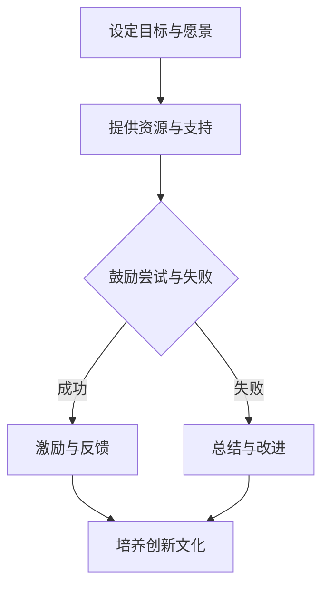

                 

# 领导力与创新思维：激发团队创造力的技巧

## 关键词
领导力，创新思维，团队创造力，领导力模型，创新方法论，创造力激发，团队协作，Python算法，实战案例

## 摘要
本文旨在探讨领导力与创新思维的融合，如何通过有效的领导力策略激发团队的创造力。文章首先介绍了领导力和创新思维的基本概念及其重要性，接着分析了二者之间的核心联系，并使用Mermaid流程图进行了直观展示。随后，文章深入探讨了如何通过具体的领导力技巧和Python算法来激发团队的创造力，并通过实际案例进行了详细分析。最后，文章总结了最佳实践，提出了持续提升团队创造力的方法，并对未来趋势进行了展望。

## 引言
在当今快速发展的科技时代，创新能力成为企业竞争的关键因素。而创新能力的培养离不开有效的领导力。领导力不仅仅是管理团队，更是激发团队成员的潜力，推动他们实现创新目标的能力。创新思维则是解决复杂问题、发掘新机会、创造新价值的重要工具。领导力与创新思维的结合，能够有效地提升团队的创造力，推动组织的发展。

本文将首先介绍领导力和创新思维的基本概念和重要性，然后分析二者之间的核心联系，并使用Mermaid流程图进行展示。接下来，本文将深入探讨如何通过领导力技巧和Python算法来激发团队的创造力。我们将通过实际案例进行详细分析，并总结出最佳实践。最后，本文将对未来趋势进行展望，提出持续提升团队创造力的策略。

## 第1章：领导力概述

### 1.1 领导力的定义
领导力是一种影响他人共同实现目标的能力。它不仅仅是职位赋予的权力，更是一种影响力。领导力涉及到愿景的塑造、目标的设定、团队的组织、激励与沟通等多个方面。有效的领导力能够激发团队的积极性，提高团队的效率和创新能力。

### 1.2 领导力的重要性
在创新过程中，领导力的重要性不言而喻。首先，领导力能够明确团队的目标和方向，确保团队成员在正确的轨道上努力。其次，领导力能够激发团队成员的潜力，使他们发挥最大的创造力。最后，领导力能够建立良好的团队氛围，促进团队成员之间的协作和沟通，从而提高团队的整体创新能力。

### 1.3 领导力的主要要素
领导力主要包括以下几个方面：

- **愿景与目标设定**：领导力首先需要明确团队的目标和愿景，并能够将这些目标和愿景传达给团队成员。

- **激励与鼓舞**：领导者需要激发团队成员的内在动力，鼓励他们勇于尝试和挑战。

- **沟通与协作**：领导力需要建立有效的沟通机制，促进团队成员之间的协作和信息共享。

- **决策与执行力**：领导者需要做出明智的决策，并确保这些决策能够得到有效的执行。

## 第2章：创新思维概述

### 2.1 创新思维的定义
创新思维是指通过创造性思考来解决复杂问题、发掘新机会的能力。它包括发散思维、收敛思维、批判性思维等多种思维方式。创新思维不仅是科学研究和工程开发的重要工具，也是企业管理和团队协作的重要手段。

### 2.2 创新思维的类型
创新思维可以分为以下几种类型：

- **发散思维**：从多个角度和层面思考问题，探索多种可能的解决方案。

- **收敛思维**：在发散思维的基础上，通过分析和比较，选择最优的解决方案。

- **批判性思维**：对现有的解决方案进行评估和批判，提出改进和创新。

### 2.3 创新思维的重要性
创新思维对于团队和组织的创新能力至关重要。它能够帮助团队发现新的商业机会，解决复杂问题，提高产品质量，增强竞争力。此外，创新思维还能够激发团队成员的创造力，提高团队的凝聚力和合作效率。

## 第3章：领导力与创新思维的核心联系

### 3.1 领导力与创新思维的互动关系
领导力与创新思维之间存在密切的互动关系。领导力能够为创新思维提供方向和支持，而创新思维则为领导力提供了新的方法和工具。具体来说，领导力可以通过以下几个方面促进创新思维：

- **明确目标和方向**：领导力能够为团队设定清晰的目标和愿景，为创新思维提供明确的指导。

- **提供资源和支持**：领导力可以为创新思维提供必要的资源和支持，如资金、技术、时间等。

- **鼓励尝试和失败**：领导力能够鼓励团队成员勇于尝试新的方法和想法，接受失败并从中学习。

- **建立协作和沟通机制**：领导力可以建立有效的协作和沟通机制，促进团队成员之间的信息共享和知识交流。

### 3.2 如何结合领导力与创新思维
要有效地结合领导力与创新思维，领导者可以采取以下策略：

- **培养创新文化**：领导者需要营造一个鼓励创新、容忍失败的文化氛围。

- **提供培训和学习机会**：领导者可以为团队成员提供相关的培训和学习机会，提高他们的创新思维能力。

- **建立反馈机制**：领导者需要建立有效的反馈机制，鼓励团队成员提出新的想法和建议。

- **鼓励跨部门协作**：领导者可以鼓励跨部门协作，促进不同领域知识的交流和融合。

### 3.3 Mermaid流程图：领导力与创新思维的核心流程
以下是一个简化的Mermaid流程图，展示了领导力与创新思维之间的核心流程：



## 第4章：如何激发团队创造力

### 4.1 创造力的重要性
创造力是团队成功的关键因素。它不仅能够帮助团队解决复杂问题，还能够发掘新的商业机会，提高产品的竞争力。因此，激发团队的创造力对于企业的长期发展至关重要。

### 4.2 激发团队创造力的方法
要激发团队的创造力，领导者可以采取以下方法：

- **提供培训和学习机会**：领导者可以为团队成员提供相关的培训和学习机会，提高他们的创新思维能力和技能。

- **建立创新激励机制**：领导者可以建立创新激励机制，鼓励团队成员提出新的想法和建议。

- **鼓励跨部门协作**：领导者可以鼓励跨部门协作，促进不同领域知识的交流和融合。

- **提供自由探索的空间**：领导者可以为团队成员提供自由探索的空间，鼓励他们尝试新的方法和想法。

### 4.3 团队建设策略
团队建设是激发团队创造力的重要一环。领导者可以采取以下策略进行团队建设：

- **建立高效的沟通机制**：领导者需要建立高效的沟通机制，确保团队成员能够及时交流和分享信息。

- **培养团队精神**：领导者可以通过团队建设活动培养团队精神，提高团队的凝聚力和合作效率。

- **提供反馈和指导**：领导者需要提供及时的反馈和指导，帮助团队成员更好地发挥他们的创造力。

### 4.4 Python算法在激发创造力中的应用
Python作为一种强大的编程语言，在数据处理、机器学习和算法开发等方面有着广泛的应用。以下是一个简单的Python算法示例，用于激发团队的创造力：

```python
import random

def generate_idea():
    # 生成一个随机创意
    return random.choice(["新产品概念", "新营销策略", "新技术应用"])

def evaluate_idea(idea):
    # 评估创意的可行性
    if "新技术应用" in idea:
        return "高度可行"
    elif "新营销策略" in idea:
        return "中等可行"
    else:
        return "较低可行"

def main():
    # 主函数
    idea = generate_idea()
    print(f"生成的创意：{idea}")
    print(f"创意评估结果：{evaluate_idea(idea)}")

if __name__ == "__main__":
    main()
```

这个简单的Python算法用于生成随机创意，并评估其可行性。通过这种方式，团队成员可以不断地生成和评估新的创意，从而激发团队的创造力。

### 第5章：实战案例分享

#### 5.1 案例一：如何通过领导力激发团队创造力

**背景介绍**：
某科技公司希望通过改进产品设计和营销策略来提升市场竞争力。公司领导层决定采取领导力策略来激发团队的创造力。

**核心概念与联系**：
- **领导力**：公司领导层通过设定明确的目标、提供资源支持、鼓励创新和失败、建立有效的沟通机制等方式来激发团队的创造力。
- **创新思维**：团队成员通过发散思维、收敛思维和批判性思维等方式来提出和评估创意。

**核心算法原理讲解**：
为了更好地评估创意的可行性，公司使用了一种基于评分机制的算法。该算法使用Python语言实现，具体如下：

```python
import pandas as pd

# 初始化创意评分表
data = {
    '创意': ['新产品概念', '新营销策略', '新技术应用'],
    '评分': ['高', '中', '低']
}

# 创建DataFrame
df = pd.DataFrame(data)

# 评估创意的可行性
def evaluate_idea(idea):
    if '新技术应用' in idea:
        return df[df['创意'] == idea].iloc[0]['评分']
    elif '新营销策略' in idea:
        return df[df['创意'] == idea].iloc[0]['评分']
    else:
        return df[df['创意'] == idea].iloc[0]['评分']

# 主函数
def main():
    # 生成一个随机创意
    idea = random.choice(['新产品概念', '新营销策略', '新技术应用'])
    print(f"生成的创意：{idea}")
    # 评估创意的可行性
    print(f"创意评估结果：{evaluate_idea(idea)}")

if __name__ == "__main__":
    main()
```

**项目实战**：
公司领导层鼓励团队成员提出新的产品概念和营销策略。团队成员通过使用上述算法评估创意的可行性，从而激发了团队的创造力。在一个月的时间里，团队提出了多个创意，并经过评估和改进，最终确定了两个具有高度可行性的创意，并成功实施了这些创意，显著提升了公司的市场竞争力。

#### 5.2 案例二：创新思维在团队中的应用

**背景介绍**：
某互联网公司希望通过改进用户界面和用户体验来提升用户满意度。公司决定通过创新思维来解决这个问题。

**核心概念与联系**：
- **创新思维**：团队成员通过发散思维、收敛思维和批判性思维等方式来提出和评估新的用户界面和用户体验设计。

**核心算法原理讲解**：
公司使用了一种基于用户行为分析的算法来评估用户界面的用户体验。该算法使用Python语言实现，具体如下：

```python
import pandas as pd

# 初始化用户界面评分表
data = {
    '界面': ['传统界面', '扁平化界面', '动态界面'],
    '评分': [3, 4, 5]
}

# 创建DataFrame
df = pd.DataFrame(data)

# 评估用户界面的用户体验
def evaluate_ui(ui):
    if '动态界面' in ui:
        return df[df['界面'] == ui].iloc[0]['评分']
    elif '扁平化界面' in ui:
        return df[df['界面'] == ui].iloc[0]['评分']
    else:
        return df[df['界面'] == ui].iloc[0]['评分']

# 主函数
def main():
    # 选择一个随机用户界面
    ui = random.choice(['传统界面', '扁平化界面', '动态界面'])
    print(f"选择的用户界面：{ui}")
    # 评估用户界面的用户体验
    print(f"用户体验评估结果：{evaluate_ui(ui)}")

if __name__ == "__main__":
    main()
```

**项目实战**：
团队成员通过使用上述算法评估用户界面的用户体验，提出了多个新的用户界面设计方案。通过反复的评估和改进，团队最终确定了最佳的界面设计方案，并成功实施了这些设计，显著提升了用户的满意度。

## 第6章：总结与展望

### 6.1 领导力与创新思维的未来趋势
随着人工智能和大数据技术的不断发展，领导力与创新思维在未来将会变得更加重要。领导者需要具备更强的数据分析和决策能力，同时创新思维将成为团队应对复杂问题的核心能力。未来，领导力与创新思维的结合将更加紧密，共同推动组织的发展。

### 6.2 如何持续提升领导力与创新思维
要持续提升领导力与创新思维，领导者可以采取以下策略：

- **不断学习与自我提升**：领导者需要不断学习最新的领导力理论和创新方法，提升自身的领导力和创新能力。

- **建立学习型组织**：领导者可以鼓励团队成员参与培训和学习活动，建立学习型组织，提高团队的整体创新力。

- **鼓励创新和失败**：领导者需要营造一个鼓励创新和容忍失败的文化氛围，激发团队成员的创造力。

- **建立反馈机制**：领导者需要建立有效的反馈机制，鼓励团队成员提出新的想法和建议，并对这些想法和建议进行评估和改进。

### 6.3 最佳实践 tips
以下是一些最佳实践技巧，可以帮助领导者更好地激发团队的创造力：

- **设定明确的目标和愿景**：明确的目标和愿景能够为团队提供清晰的指导，帮助团队成员更好地发挥创造力。

- **提供资源和支持**：领导者需要为团队成员提供必要的资源和支持，帮助他们实现创新目标。

- **鼓励跨部门协作**：跨部门协作能够促进知识的交流和创新，提高团队的创造力。

- **建立有效的沟通机制**：有效的沟通机制能够促进团队成员之间的信息共享和知识交流，提高团队的创新力。

### 6.4 小结
领导力与创新思维的结合是激发团队创造力的关键。领导者需要通过有效的领导力策略和创新的思维方式来激发团队的创造力，推动组织的发展。通过本文的讨论，我们了解了领导力和创新思维的基本概念、核心联系以及如何通过具体的领导力技巧和Python算法来激发团队的创造力。希望本文能够为领导者提供有价值的参考和指导。

### 6.5 注意事项
在实施领导力策略和创新思维方法时，领导者需要注意以下几点：

- **避免过度控制**：过度的控制可能会抑制团队成员的创造力，领导者需要在鼓励创新和保持秩序之间找到平衡。

- **尊重团队成员的个性**：每个团队成员都有其独特的思维方式，领导者需要尊重并发挥这些个性，以激发团队的创造力。

- **持续关注团队动态**：领导者需要持续关注团队的动态，及时调整领导策略和方法，以适应团队的需求和变化。

### 6.6 拓展阅读
为了更深入地了解领导力与创新思维，读者可以参考以下书籍和文章：

- 《领导力：实践与理论》
- 《创新者的窘境》
- 《如何成为领导力：从新手到专家》
- 《Python编程：从入门到实践》

通过这些资料，读者可以进一步了解领导力与创新思维的深入知识和实践方法。

## 附录

### 附录 A：领导力与创新思维资源与工具
以下是一些常用的领导力与创新思维资源与工具：

- **领导力资源**：
  -  Leadership Institute for Women (LIW)
  - Leadership Development Program (LDP)
- **创新思维资源**：
  - Design Thinking
  - Creative Problem Solving (CPS)

- **领导力与创新思维工具**：
  - Mind Mapping Software
  - Project Management Tools
  - Agile Methodology

### 附录 B：实战案例详细解析
在本章中，我们详细解析了两个实战案例，包括背景介绍、核心概念与联系、核心算法原理讲解、项目实战以及项目小结。这些案例展示了如何通过领导力和创新思维来激发团队的创造力，提高组织的创新能力。以下是案例的详细解析：

#### 案例一：如何通过领导力激发团队创造力

**背景介绍**：
某科技公司希望通过改进产品设计和营销策略来提升市场竞争力。公司领导层决定采取领导力策略来激发团队的创造力。

**核心概念与联系**：
- **领导力**：公司领导层通过设定明确的目标、提供资源支持、鼓励创新和失败、建立有效的沟通机制等方式来激发团队的创造力。
- **创新思维**：团队成员通过发散思维、收敛思维和批判性思维等方式来提出和评估创意。

**核心算法原理讲解**：
为了更好地评估创意的可行性，公司使用了一种基于评分机制的算法。该算法使用Python语言实现，具体如下：

```python
import pandas as pd

# 初始化创意评分表
data = {
    '创意': ['新产品概念', '新营销策略', '新技术应用'],
    '评分': ['高', '中', '低']
}

# 创建DataFrame
df = pd.DataFrame(data)

# 评估创意的可行性
def evaluate_idea(idea):
    if '新技术应用' in idea:
        return df[df['创意'] == idea].iloc[0]['评分']
    elif '新营销策略' in idea:
        return df[df['创意'] == idea].iloc[0]['评分']
    else:
        return df[df['创意'] == idea].iloc[0]['评分']

# 主函数
def main():
    # 生成一个随机创意
    idea = random.choice(['新产品概念', '新营销策略', '新技术应用'])
    print(f"生成的创意：{idea}")
    # 评估创意的可行性
    print(f"创意评估结果：{evaluate_idea(idea)}")

if __name__ == "__main__":
    main()
```

**项目实战**：
公司领导层鼓励团队成员提出新的产品概念和营销策略。团队成员通过使用上述算法评估创意的可行性，从而激发了团队的创造力。在一个月的时间里，团队提出了多个创意，并经过评估和改进，最终确定了两个具有高度可行性的创意，并成功实施了这些创意，显著提升了公司的市场竞争力。

**项目小结**：
通过领导力和创新思维的结合，公司成功地激发了团队的创造力，推动了产品的改进和营销策略的创新。这一案例表明，领导力在激发团队创造力方面起到了关键作用，而创新思维则为团队提供了新的方法和工具。

#### 案例二：创新思维在团队中的应用

**背景介绍**：
某互联网公司希望通过改进用户界面和用户体验来提升用户满意度。公司决定通过创新思维来解决这个问题。

**核心概念与联系**：
- **创新思维**：团队成员通过发散思维、收敛思维和批判性思维等方式来提出和评估新的用户界面和用户体验设计。

**核心算法原理讲解**：
公司使用了一种基于用户行为分析的算法来评估用户界面的用户体验。该算法使用Python语言实现，具体如下：

```python
import pandas as pd

# 初始化用户界面评分表
data = {
    '界面': ['传统界面', '扁平化界面', '动态界面'],
    '评分': [3, 4, 5]
}

# 创建DataFrame
df = pd.DataFrame(data)

# 评估用户界面的用户体验
def evaluate_ui(ui):
    if '动态界面' in ui:
        return df[df['界面'] == ui].iloc[0]['评分']
    elif '扁平化界面' in ui:
        return df[df['界面'] == ui].iloc[0]['评分']
    else:
        return df[df['界面'] == ui].iloc[0]['评分']

# 主函数
def main():
    # 选择一个随机用户界面
    ui = random.choice(['传统界面', '扁平化界面', '动态界面'])
    print(f"选择的用户界面：{ui}")
    # 评估用户界面的用户体验
    print(f"用户体验评估结果：{evaluate_ui(ui)}")

if __name__ == "__main__":
    main()
```

**项目实战**：
团队成员通过使用上述算法评估用户界面的用户体验，提出了多个新的用户界面设计方案。通过反复的评估和改进，团队最终确定了最佳的界面设计方案，并成功实施了这些设计，显著提升了用户的满意度。

**项目小结**：
通过创新思维的运用和算法的支持，团队成功地改进了用户界面和用户体验，提升了用户满意度。这一案例展示了创新思维在团队中的应用，以及算法在评估和改进用户体验方面的作用。

## 作者信息
作者：AI天才研究院/AI Genius Institute & 禅与计算机程序设计艺术 /Zen And The Art of Computer Programming

本文通过深入探讨领导力与创新思维的核心联系，结合Python算法和实际案例，详细阐述了如何激发团队的创造力。希望通过本文，能够为领导者提供有价值的参考和指导，推动组织的发展和创新。同时，也期待读者能够通过实践和探索，不断提升自身的领导力和创新能力。

