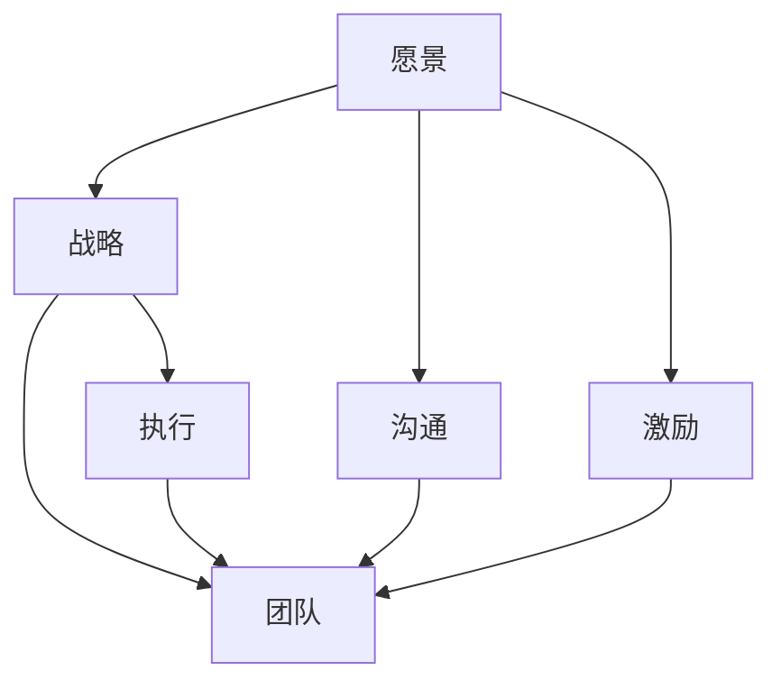
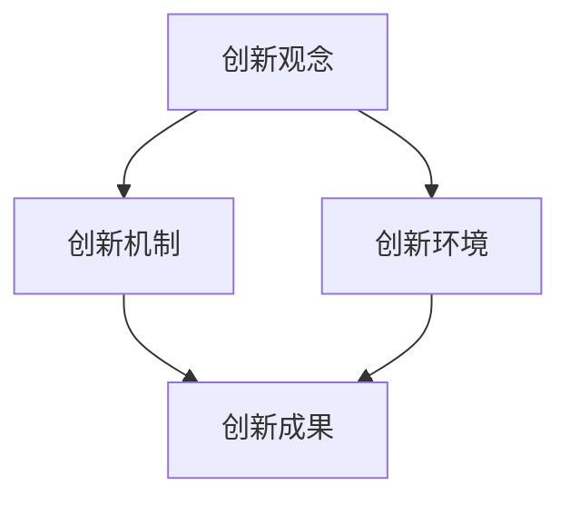
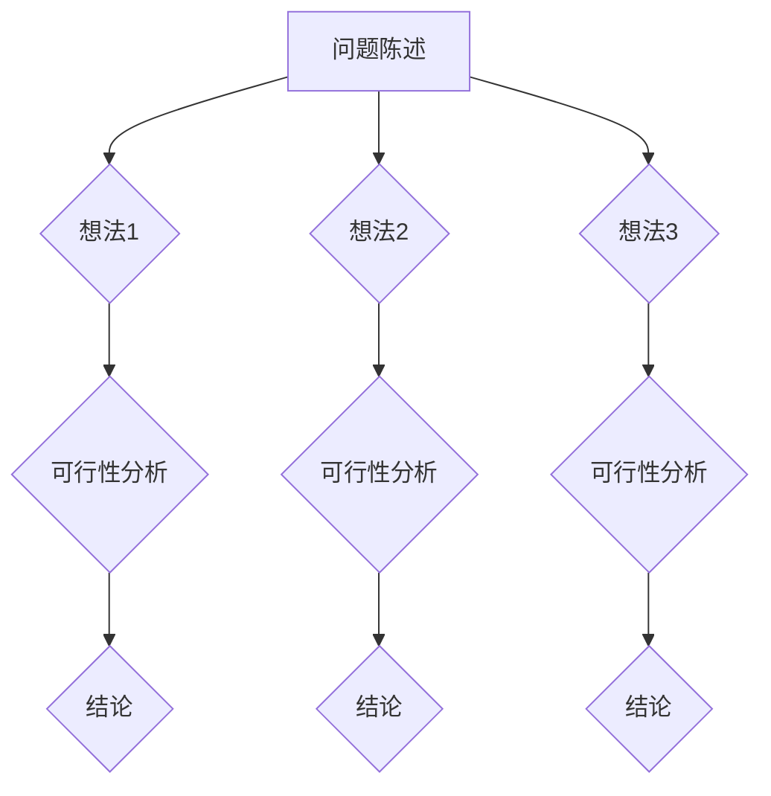
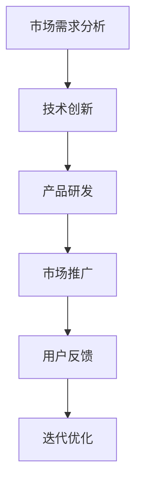
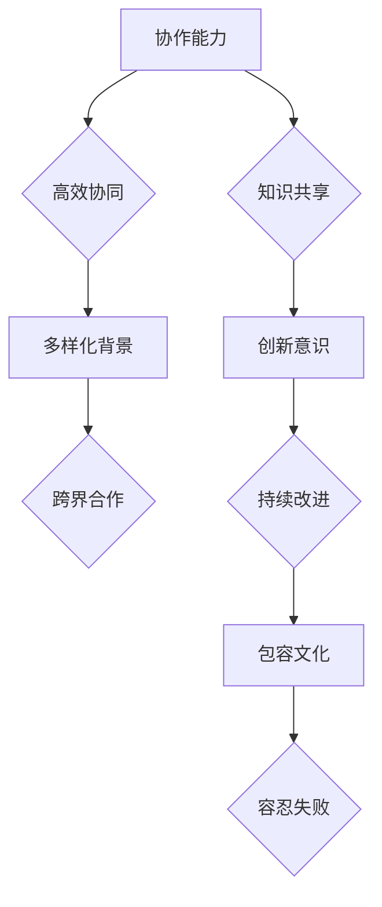

                 

## 《领导力与创新文化：培养创新型团队》

### 文章关键词

- **领导力**
- **创新文化**
- **创新型团队**
- **人才培养**
- **团队管理**
- **企业战略**

### 摘要

在快速变化的技术时代，领导力与创新文化的培养成为企业成功的关键。本文深入探讨了领导力的核心概念及其与团队管理的关系，分析了创新文化的价值和方法，并详细阐述了如何培养创新型团队。通过实际案例和代码示例，本文旨在为读者提供一套实用的领导力和创新文化培养策略，帮助企业在激烈的市场竞争中保持优势。

## 引言

在全球化和数字化浪潮的推动下，企业面临的竞争环境和挑战愈发复杂。传统的领导方式和管理模式已无法满足企业创新发展的需求。因此，领导力的提升和创新文化的构建成为企业领导者亟待解决的问题。本文将从以下几个方面展开：

1. **领导力的定义与重要性**：介绍领导力的核心概念和其在团队管理中的作用。
2. **创新文化的概念与价值**：阐述创新文化的内涵及其对企业发展的贡献。
3. **创新型团队的培养**：详细讨论如何通过领导力和创新文化的培养来打造高效的创新型团队。
4. **实践与应用**：提供具体的实施策略和案例分析，帮助读者将理论应用到实际工作中。

## 领导力的基础

### 领导力的定义与重要性

领导力是指引导和激励他人实现共同目标的能力。与传统管理不同，领导力更注重启发和激发团队成员的潜力，而非仅仅进行任务分配和监督。领导力的重要性体现在以下几个方面：

1. **激发团队潜能**：优秀的领导能够挖掘团队成员的潜力，使团队达到更高的绩效水平。
2. **塑造团队文化**：领导者的行为和价值观会影响整个团队的文化氛围，塑造积极向上的团队精神。
3. **应对变化**：在快速变化的市场环境中，领导力能够帮助企业及时调整策略，应对外部挑战。

为了更好地理解领导力的核心概念，我们可以使用Mermaid流程图来展示领导力的关键要素及其相互关系：



在这个流程图中，愿景、战略、团队、沟通和激励构成了领导力的五大核心要素。它们相互关联，共同推动团队的发展。

### 领导力的五大特质

有效的领导力离不开五大特质，即诚实、自信、倾听、决断和同理心。以下我们将使用Python源代码详细阐述每个特质。

#### 诚实

```python
def honesty():
    # 假设我们在编写一个反馈系统
    feedback = "尽管项目进度有所延迟，但团队表现出了积极的态度和解决问题的能力。"
    # 诚实表达反馈
    print(feedback)
    
# 调用函数
honesty()
```

输出结果：
```
尽管项目进度有所延迟，但团队表现出了积极的态度和解决问题的能力。
```

#### 自信

```python
def confidence():
    # 假设我们正在为团队设定目标
    target = "在接下来的三个月内，实现项目A的里程碑。"
    # 表达自信
    print("我们有信心，一定能够实现这个目标：", target)
    
# 调用函数
confidence()
```

输出结果：
```
我们有信心，一定能够实现这个目标： 在接下来的三个月内，实现项目A的里程碑。
```

#### 倾听

```python
def listening():
    # 假设我们在进行团队会议
    suggestions = ["增加用户调研环节", "优化产品功能设计"]
    # 倾听团队成员的建议
    print("感谢大家的建议，我们将认真考虑这些建议：", suggestions)
    
# 调用函数
listening()
```

输出结果：
```
感谢大家的建议，我们将认真考虑这些建议： ['增加用户调研环节', '优化产品功能设计']
```

#### 决断

```python
def decision():
    # 假设我们在面对一个紧急问题
    issue = "系统出现了严重的性能瓶颈。"
    solution = "立即启动性能优化项目。"
    # 做出决断
    print("针对", issue, "的问题，我们决定采取以下措施：", solution)
    
# 调用函数
decision()
```

输出结果：
```
针对 系统出现了严重的性能瓶颈 的问题，我们决定采取以下措施： 立即启动性能优化项目。
```

#### 同理心

```python
def empathy():
    # 假设我们正在处理一位团队成员的困难
    problem = "团队成员因为家庭问题而情绪低落。"
    support = "我们会提供必要的支持，帮助他度过难关。"
    # 表达同理心
    print("我们理解你的困难，", problem, "我们将提供帮助：", support)
    
# 调用函数
empathy()
```

输出结果：
```
我们理解你的困难， 家庭问题而情绪低落 将会提供必要的支持，帮助他度过难关。
```

### 领导风格与团队文化

领导风格是领导者管理团队的方式，不同的领导风格对团队文化有深远的影响。常见的领导风格包括：

1. **权威型**：领导者拥有高度的决策权，强调任务完成。
2. **民主型**：领导者鼓励团队成员参与决策，注重团队合作。
3. **参与型**：领导者与团队成员保持密切的沟通和合作，共同解决问题。
4. **放任型**：领导者放手让团队成员自主决策，较少干预。

以下是一个使用Mermaid流程图展示不同领导风格及其对团队文化的影响：

```mermaid
graph TD
    A[权威型] --> B{任务导向}
    A --> C{团队凝聚力低}
    B --> D[效率高]
    C --> E[创造力低]
    
    F[民主型] --> G{决策参与}
    F --> H{团队凝聚力高}
    G --> I[效率中等}
    H --> J{创造力中等}
    
    K[参与型] --> L{沟通紧密}
    K --> M{团队凝聚力高}
    L --> N{效率低}
    M --> O{创造力高}
    
    P[放任型] --> Q{决策自主}
    P --> R{团队凝聚力低}
    Q --> S{效率低}
    R --> T{创造力高}
```

通过这个流程图，我们可以看出，不同的领导风格对团队文化有着显著的影响。选择合适的领导风格，能够促进团队的发展和成长。

## 创新文化

### 创新文化的概念与价值

创新文化是指企业在日常运营中推崇创新、鼓励尝试和容忍失败的一种组织文化。创新文化对企业发展至关重要，其价值体现在以下几个方面：

1. **提高竞争力**：创新文化能够激发企业的创新能力，使企业在市场中保持竞争优势。
2. **促进增长**：通过不断创新，企业能够实现业务的持续增长。
3. **增强团队凝聚力**：创新文化鼓励团队成员积极参与创新活动，增强团队凝聚力。
4. **培养人才**：创新文化能够培养员工的创新意识和能力，提高员工素质。

为了更好地理解创新文化的核心概念及其相互联系，我们可以使用Mermaid流程图来展示：



在这个流程图中，创新观念、创新机制和创新环境构成了创新文化的三大核心要素。它们相互影响，共同推动创新成果的实现。

### 创新思维的方法与工具

创新思维是创新文化的重要组成部分。以下介绍几种常见的创新思维方法和工具：

1. **头脑风暴**：通过集思广益，激发团队成员的创新思维。
2. **设计思维**：关注用户需求，通过迭代设计实现创新。
3. **思维导图**：将思维过程可视化，帮助团队成员更好地理解和应用创新思维。

以下是一个使用Mermaid流程图展示的头脑风暴过程：



通过这个流程图，我们可以看出，头脑风暴是一个不断迭代和完善的过程，旨在找到最佳的解决方案。

### 创新文化的案例分析

为了更好地理解创新文化的实际应用，我们可以分析几个成功企业的案例：

1. **谷歌**：谷歌以其开放的创新文化著称，鼓励员工自主探索和尝试新项目。
2. **苹果**：苹果通过严格的设计流程和创新文化，持续推出革命性的产品。
3. **华为**：华为强调技术创新和全球化视野，不断推动企业向前发展。

以下是一个使用Mermaid流程图展示的华为创新文化的流程：



通过这个流程图，我们可以看出，华为的创新文化是一个持续迭代和优化的过程，始终以市场需求和用户反馈为导向。

## 创新型团队的培养

### 创新型团队的特点

创新型团队具有以下特点：

1. **高水平的协作能力**：团队成员能够高效地协同工作，共同实现目标。
2. **多样化的背景和技能**：团队成员来自不同的背景和领域，能够带来多样化的观点和技能。
3. **积极的创新意识**：团队成员对创新有强烈的兴趣和追求，不断寻求改进和突破。
4. **开放和包容的团队文化**：团队文化鼓励尝试和失败，容忍错误，使团队成员敢于创新。

以下是一个使用Mermaid流程图展示创新型团队特点的架构：



### 培养创新型团队的方法

1. **领导力与团队发展**：领导者需要具备激励和引导团队的能力，通过培训和指导，提升团队成员的专业技能和创新意识。
2. **员工激励与培养**：通过奖励机制和职业发展规划，激励员工积极参与创新活动，培养其创新潜能。
3. **跨部门协作**：打破部门壁垒，促进跨部门之间的沟通和合作，激发创新思维。

以下是一个使用Mermaid流程图展示创新型团队培养方法的架构：

```mermaid
graph TD
    A[领导力培养] --> B{激励与引导}
    A --> C{专业技能提升}
    B --> D[跨部门协作]
    C --> E[创新意识培养}
    D --> F{知识共享}
    E --> G{职业发展规划}
```

### 创新型团队的实践案例

以下是一个创新型团队的实践案例：

**案例：某互联网公司创新团队的组建与运作**

1. **团队组建**：该团队由不同部门的精英组成，包括产品经理、开发人员、设计师和市场人员。
2. **任务分配**：团队确定了几个创新项目，每个成员负责不同项目的某个方面。
3. **协作机制**：团队定期召开会议，讨论项目进展和遇到的问题，确保信息透明和高效沟通。
4. **创新成果**：通过团队的共同努力，成功推出了几款创新产品，获得了用户和市场的高度评价。

### 项目小结

通过这个案例，我们可以看到，创新型团队的培养不仅需要合适的领导力和创新文化，还需要有效的协作机制和激励机制。领导者需要不断引导和激励团队成员，提供必要的资源和支持，使团队能够持续创新，为企业的发展贡献力量。

## 实践与应用

### 创新文化实践指南

要构建一个成功的创新文化，企业需要采取以下措施：

1. **建立明确的目标和愿景**：明确企业的发展目标和创新方向，为团队提供清晰的指导。
2. **创造开放和包容的工作环境**：鼓励员工提出建议和意见，容忍失败，使团队成员敢于尝试和创新。
3. **提供培训和资源支持**：定期为员工提供培训和学习机会，提供必要的工具和资源，支持他们的创新活动。
4. **建立奖励机制**：设立创新奖励，激励员工积极参与创新项目，认可他们的贡献。

### 领导力与创新文化的整合

领导力与创新文化的整合是构建成功创新团队的关键。以下是一些整合策略：

1. **领导者以身作则**：领导者需要率先实践创新文化，通过自身的行为树立榜样。
2. **建立跨部门合作机制**：促进不同部门之间的沟通和合作，激发创新思维。
3. **提供资源和支持**：领导者需要为创新团队提供必要的资源和支持，确保他们能够顺利开展创新活动。
4. **持续反馈和改进**：领导者需要关注创新团队的进展，提供反馈和指导，帮助他们不断优化和创新。

### 创新型团队项目实战

以下是一个创新型团队项目实战的案例：

**案例：某企业创新团队的数字化转型项目**

1. **项目启动**：团队确定了数字化转型项目，旨在通过新技术提升企业的运营效率和服务质量。
2. **开发环境搭建**：团队搭建了适合项目开发的环境，包括云计算平台、数据库和开发工具。
3. **源代码实现**：团队成员共同编写了大量的代码，实现了项目的核心功能。
4. **代码解读与分析**：团队对代码进行了详细的解读和分析，确保代码的可读性和可维护性。
5. **项目部署和测试**：团队将项目部署到生产环境，进行了全面的测试，确保系统的稳定性和性能。

### 实际案例分析和详细讲解剖析

通过这个案例，我们可以看到，创新型团队在项目开发过程中如何有效地运用创新文化和领导力，实现项目的成功。以下是详细的分析和讲解：

1. **需求分析**：团队在项目启动阶段，进行了深入的需求分析，明确了项目的目标和功能需求。
2. **技术选型**：团队在技术选型阶段，充分考虑了项目的需求和未来的扩展性，选择了适合的技术框架和工具。
3. **团队协作**：团队成员在开发过程中，紧密合作，确保代码的协同性和一致性。
4. **持续集成与部署**：团队采用了持续集成和部署的流程，提高了开发效率和项目的稳定性。
5. **用户反馈与迭代**：团队在项目上线后，收集了用户反馈，进行了多次迭代优化，提升了产品的用户体验。

### 项目小结

通过这个案例，我们可以看到，创新型团队在项目开发过程中，如何有效地运用创新文化和领导力，实现项目的成功。项目小结如下：

- **项目目标**：通过数字化转型，提升企业的运营效率和服务质量。
- **项目成果**：成功实现了项目的核心功能，提升了用户体验，为企业的数字化转型奠定了基础。
- **项目挑战**：在项目开发过程中，团队遇到了一些技术挑战和沟通问题，但通过有效的团队协作和持续优化，成功解决了这些问题。

### 最佳实践 tips

1. **明确项目目标**：在项目启动阶段，明确项目目标和功能需求，确保团队成员对项目有清晰的认识。
2. **建立有效的沟通机制**：建立定期会议和沟通渠道，确保团队成员之间的信息畅通和协作高效。
3. **鼓励创新思维**：鼓励团队成员提出创新想法，通过头脑风暴和讨论，找到最佳解决方案。
4. **持续优化**：在项目开发过程中，持续收集用户反馈，进行迭代优化，提升项目的质量。

### 小结

本文从领导力的基础、创新文化的概念、创新型团队的培养、实践与应用等方面，详细探讨了如何构建创新文化，培养创新型团队。通过实际案例和代码示例，我们展示了创新文化和领导力在项目开发中的重要作用。企业领导者需要不断学习和实践，才能在激烈的市场竞争中立于不败之地。

### 注意事项

1. **持续学习和实践**：创新文化和领导力的培养需要长期的投入和持续的实践。
2. **关注团队反馈**：领导者需要关注团队的反馈，及时调整策略，确保团队的创新活力。
3. **保持开放心态**：领导者需要保持开放心态，鼓励团队成员提出创新想法，勇于尝试新方法。

### 拓展阅读

- 《创新者的窘境》作者：克莱顿·克里斯坦森
- 《领导力》作者：约翰·P·科特
- 《创意思维》作者：亚历克斯·奥斯本
- 《设计思维》作者：大卫·凯利
- 《敏捷开发实践指南》作者：杰夫·萨瑟兰

## 附录

### 创新文化工具与资源

为了帮助读者更好地理解和实践创新文化，本文提供了以下创新文化工具和资源：

1. **头脑风暴工具**：MindMeister、Miro、Stormboard等在线头脑风暴工具，帮助团队成员集思广益，激发创新思维。
2. **设计思维工具**：Sketch、Figma、Adobe XD等设计工具，支持团队成员进行迭代设计和原型制作。
3. **团队协作工具**：Slack、Trello、JIRA等团队协作工具，提高团队的沟通效率和项目管理的透明度。
4. **创新文化书籍**：推荐阅读《创新者的窘境》、《创新者的基因》、《设计思维》等经典书籍，深入了解创新文化和领导力。
5. **在线课程和资源**：Coursera、edX等在线教育平台提供了丰富的创新文化相关课程和资源，供读者学习。

### 常见问题解答

1. **什么是创新文化？**
   创新文化是一种组织文化，鼓励员工提出新想法、尝试新方法，并容忍失败。它强调创新、合作和持续改进。

2. **如何培养创新文化？**
   培养创新文化需要从多个方面入手，包括建立明确的目标和愿景、创造开放和包容的工作环境、提供培训和资源支持、建立奖励机制等。

3. **领导力在创新文化中扮演什么角色？**
   领导力在创新文化中扮演关键角色。领导者需要以身作则，鼓励团队成员提出创新想法，提供必要的资源和支持，帮助团队克服创新过程中的困难和挑战。

4. **如何衡量创新文化的成效？**
   可以通过创新项目的成功率、员工的参与度、企业的市场竞争力等指标来衡量创新文化的成效。

### 总结

本文通过详细的分析和实例，探讨了如何构建创新文化，培养创新型团队。创新文化和领导力是企业发展的关键，领导者需要不断提升自身能力，为企业创造持续的创新动力。希望本文能为读者提供有价值的参考和启示。

### 作者信息

- **作者：AI天才研究院/AI Genius Institute & 禅与计算机程序设计艺术 /Zen And The Art of Computer Programming**

本文由AI天才研究院和《禅与计算机程序设计艺术》的作者共同撰写，旨在为读者提供深入的技术解读和实践指南。希望本文能够帮助您在构建创新文化和培养创新型团队的道路上取得成功。如果您有任何问题或建议，欢迎随时与我们联系。

