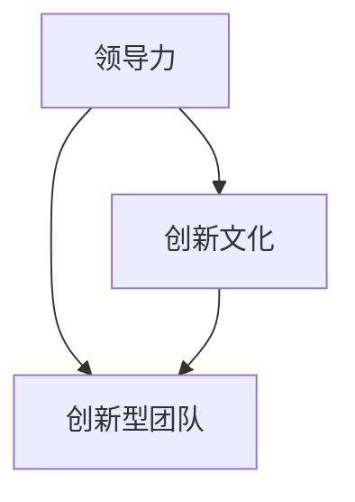

                 

### 文章标题

# 《领导力与创新文化：培养创新型团队的策略》

本文旨在深入探讨领导力与创新文化的关系，以及如何通过有效的策略培养创新型团队。创新是推动社会进步和经济发展的关键动力，而领导力则是推动创新不可或缺的要素。本文将通过一系列的分析和案例研究，为读者提供有价值的见解和实用的策略。

## 文章关键词

- **领导力**
- **创新文化**
- **创新型团队**
- **策略**
- **人才培养**
- **激励机制**
- **团队协作**
- **创新氛围**

## 文章摘要

本文首先介绍了领导力和创新文化的核心概念，并探讨了它们之间的联系。接着，文章提出了一系列培养创新型团队的策略，包括识别和培养创新型人才、构建创新型团队的策略、激励机制和团队氛围建设等。通过实际的案例分析和策略实施指南，本文为读者提供了如何在实际工作中应用这些策略的具体方法。最后，文章对未来创新领导力的塑造进行了展望，并提出了未来可能面临的挑战。

## 背景介绍

在当今快速变化和高度竞争的商业环境中，创新成为了企业持续发展和竞争优势的关键。创新不仅包括技术创新，还涵盖了商业模式、管理方法和文化等方面的创新。创新型团队是推动创新的重要力量，他们能够快速响应市场变化，提出新颖的解决方案，并实现从概念到产品的快速转化。然而，培养创新型团队并非易事，它需要领导者具备一定的领导力，并且构建一种支持创新的文化氛围。

领导力是指领导者通过影响和激励团队成员，实现组织目标的能力。有效的领导力不仅能够提升团队的整体效能，还能够激发团队成员的创造力和创新能力。创新文化则是指一种鼓励创新、支持创新的组织氛围和文化价值观。创新文化能够为团队成员提供自由探索和试错的空间，激发他们的创造力和创新精神。

本文将从以下几个方面展开讨论：

1. **领导力的重要性**：介绍领导力的核心概念，探讨领导力在创新中的作用和影响。
2. **创新文化的定义与建设**：阐述创新文化的内涵和特征，讨论如何构建支持创新的文化环境。
3. **领导力与创新文化的联系**：分析领导力与创新文化之间的相互作用和影响。
4. **培养创新型团队的策略**：提出一系列有效的策略，包括识别和培养创新型人才、构建创新型团队的策略、激励机制和团队氛围建设等。
5. **实战案例与实施指南**：通过实际案例分析和策略实施指南，为读者提供具体的应用方法和实践经验。
6. **未来展望与挑战**：探讨未来创新领导力的趋势和面临的挑战。

通过本文的讨论，读者将能够更好地理解领导力与创新文化之间的关系，掌握培养创新型团队的有效策略，并能够在实际工作中应用这些策略，推动组织的创新和发展。

### 核心概念与联系

在深入探讨领导力与创新文化的关系之前，我们需要明确这些核心概念的定义，并理解它们之间的内在联系。以下是几个关键概念及其相互关系的详细解释：

#### 领导力

领导力是指领导者通过影响、激励和指导他人，实现组织目标的能力。领导力不仅包括技术技能和管理技能，还涉及人际沟通、影响力、决策能力等多个方面。有效的领导力能够激发团队成员的潜力，促进团队协作，提升整体效能。

#### 创新文化

创新文化是指一种鼓励创新、支持创新的组织氛围和文化价值观。创新文化包括开放性、包容性、灵活性、冒险精神和实验精神等特征。这种文化环境能够为团队成员提供自由探索和试错的空间，鼓励他们提出新颖的观点和解决方案。

#### 创新型团队

创新型团队是指那些具备创新能力、能够快速响应市场变化并持续产生创新成果的团队。创新型团队通常具有以下几个特点：成员多元化、协作紧密、信息共享、持续学习和快速适应变化。

#### 关系架构

领导力与创新文化、创新型团队之间的关系可以用以下Mermaid流程图来表示：



1. **领导力对创新文化的影响**：领导力是构建创新文化的关键因素。领导者通过设定愿景、建立价值观、激励团队成员等方式，推动创新文化的形成和发展。例如，一位具有远见卓识的领导者可以设定明确的创新目标，并通过透明的沟通和开放的讨论，营造一个鼓励创新和包容失败的文化环境。

2. **创新文化对领导力的需求**：创新文化要求领导者具备更高的灵活性、适应性以及与团队成员的深度互动。领导者需要能够识别和培养创新型人才，建立有效的激励机制，以及营造一个支持创新和持续学习的团队氛围。

3. **领导力与创新型团队**：创新型团队的形成离不开领导力的支持。领导者需要具备识别和培养创新型人才的能力，同时通过有效的领导策略，激发团队成员的创造力和创新能力。例如，领导者可以通过设立挑战性目标、提供资源支持、鼓励团队协作等方式，推动创新型团队的发展。

4. **创新文化与创新型团队**：创新文化为创新型团队提供了基础和动力。一个良好的创新文化能够激发团队成员的创造力和创新精神，使他们更愿意参与创新项目和挑战。同时，创新型团队通过不断的创新实践，进一步巩固和强化创新文化。

通过上述分析，我们可以看到，领导力、创新文化和创新型团队之间存在紧密的相互关系。领导力是推动创新文化和创新型团队发展的关键因素，而创新文化和创新型团队则为领导力提供了实践的平台和成果的体现。只有三者相互结合、相互促进，才能实现组织的持续创新和长期发展。

### 核心概念与联系

在深入探讨领导力与创新文化的关系之前，我们需要明确这些核心概念的定义，并理解它们之间的内在联系。以下是几个关键概念及其相互关系的详细解释：

#### 领导力

领导力是指领导者通过影响、激励和指导他人，实现组织目标的能力。领导力不仅包括技术技能和管理技能，还涉及人际沟通、影响力、决策能力等多个方面。有效的领导力能够激发团队成员的潜力，促进团队协作，提升整体效能。

#### 创新文化

创新文化是指一种鼓励创新、支持创新的组织氛围和文化价值观。创新文化包括开放性、包容性、灵活性、冒险精神和实验精神等特征。这种文化环境能够为团队成员提供自由探索和试错的空间，鼓励他们提出新颖的观点和解决方案。

#### 创新型团队

创新型团队是指那些具备创新能力、能够快速响应市场变化并持续产生创新成果的团队。创新型团队通常具有以下几个特点：成员多元化、协作紧密、信息共享、持续学习和快速适应变化。

#### 关系架构

领导力与创新文化、创新型团队之间的关系可以用以下Mermaid流程图来表示：


1. **领导力对创新文化的影响**：领导力是构建创新文化的关键因素。领导者通过设定愿景、建立价值观、激励团队成员等方式，推动创新文化的形成和发展。例如，一位具有远见卓识的领导者可以设定明确的创新目标，并通过透明的沟通和开放的讨论，营造一个鼓励创新和包容失败的文化环境。

2. **创新文化对领导力的需求**：创新文化要求领导者具备更高的灵活性、适应性以及与团队成员的深度互动。领导者需要能够识别和培养创新型人才，建立有效的激励机制，以及营造一个支持创新和持续学习的团队氛围。

3. **领导力与创新型团队**：创新型团队的形成离不开领导力的支持。领导者需要具备识别和培养创新型人才的能力，同时通过有效的领导策略，激发团队成员的创造力和创新能力。例如，领导者可以通过设立挑战性目标、提供资源支持、鼓励团队协作等方式，推动创新型团队的发展。

4. **创新文化与创新型团队**：创新文化为创新型团队提供了基础和动力。一个良好的创新文化能够激发团队成员的创造力和创新精神，使他们更愿意参与创新项目和挑战。同时，创新型团队通过不断的创新实践，进一步巩固和强化创新文化。

通过上述分析，我们可以看到，领导力、创新文化和创新型团队之间存在紧密的相互关系。领导力是推动创新文化和创新型团队发展的关键因素，而创新文化和创新型团队则为领导力提供了实践的平台和成果的体现。只有三者相互结合、相互促进，才能实现组织的持续创新和长期发展。

### 核心概念与联系

为了更好地理解领导力与创新文化之间的关系，我们首先需要明确这两个核心概念的定义，并探讨它们之间的内在联系。

#### 领导力的定义

领导力是指领导者通过影响、激励和指导他人，实现组织目标的能力。它不仅仅涉及管理和指挥，还包括建立愿景、沟通协调、决策能力等多个方面。有效的领导力能够激发团队成员的潜力，促进团队协作，提升整体效能。领导力可以分为以下几个层次：

1. **技术领导力**：指领导者掌握的专业知识和技能，能够解决技术问题和推动技术进步。
2. **管理领导力**：指领导者通过规划、组织、协调和监控等管理活动，确保组织目标的实现。
3. **情感领导力**：指领导者通过建立信任、激发团队士气、提供支持等情感因素，增强团队的凝聚力和工作效率。
4. **变革领导力**：指领导者推动组织变革、引领团队适应环境变化的能力。

#### 创新文化的定义

创新文化是一种鼓励创新、支持创新的组织氛围和文化价值观。它包括开放性、包容性、灵活性、冒险精神和实验精神等特征。创新文化不仅仅是一种理念，更是一种实际行动，体现在组织的各个方面。一个良好的创新文化能够为团队成员提供自由探索和试错的空间，激发他们的创造力和创新精神。

1. **开放性**：组织鼓励分享想法和知识，不拘泥于传统思维模式。
2. **包容性**：组织尊重多样性，为不同背景和观点的人提供平等的机会。
3. **灵活性**：组织能够快速适应变化，灵活调整策略和计划。
4. **冒险精神**：组织鼓励尝试新事物，愿意承担一定的风险。
5. **实验精神**：组织支持实验和尝试，从失败中学习并不断改进。

#### 领导力与创新文化的内在联系

领导力与创新文化之间存在密切的内在联系，二者相辅相成，共同推动组织的创新和发展。以下是一些关键联系：

1. **领导力是创新文化的催化剂**：领导者通过设定愿景、建立价值观、激励团队成员等方式，推动创新文化的形成和发展。一位具有远见卓识的领导者可以设定明确的创新目标，并通过透明的沟通和开放的讨论，营造一个鼓励创新和包容失败的文化环境。

2. **创新文化是领导力实践的舞台**：创新文化为领导力提供了实践的平台和成果的体现。在一个良好的创新文化中，领导者能够更好地发挥其变革领导力和情感领导力，激励团队成员积极参与创新项目，实现组织的战略目标。

3. **领导力增强创新文化的深度和广度**：领导者的个人魅力、决策能力、沟通技巧等因素直接影响创新文化的深度和广度。一个优秀的领导者不仅能够推动创新文化的形成，还能够通过有效的领导策略，使创新文化在组织中深入扎根，并持续发展。

4. **创新文化提升领导力的有效性**：良好的创新文化能够激发领导者的创新思维，使他们能够更灵活、更有效地应对变化和挑战。同时，创新文化能够为领导者提供更多的反馈和机会，帮助他们不断学习和成长，提升领导力水平。

总之，领导力与创新文化是相互促进、相互依赖的关系。领导力是推动创新文化发展的关键因素，而创新文化则为领导力提供了实践的平台和成果的体现。只有通过有效的领导力，创新文化才能在组织中生根发芽，并持续发展，推动组织的创新和成长。

### 领导力的重要性

在探讨领导力与创新文化的关系之前，我们首先需要理解领导力的重要性，特别是在推动创新方面的作用。领导力不仅是推动组织发展和实现目标的关键，也是激发团队成员创新潜力、促进持续创新的重要动力。

#### 领导力对创新的作用

1. **设定愿景和目标**：领导者的一个核心职责是设定清晰的愿景和目标，这有助于引导团队成员朝着共同的方向努力。一个明确的创新目标可以激发团队成员的积极性和创造力，使他们更加专注于创新项目。

   ```python
   # 示例代码：设定创新目标
   vision = "成为行业领先的创新企业"
   goal = "每年推出至少五个具有颠覆性的新产品"
   print(f"我们的愿景是：{vision}\n我们的目标是：{goal}")
   ```

2. **建立价值观和文化**：领导力在塑造组织文化方面发挥着重要作用。通过建立以创新为核心的价值观，领导者可以营造一个鼓励创新、包容失败的文化环境。这种文化环境能够为团队成员提供自由探索和试错的空间，从而激发他们的创造力和创新精神。

   ```python
   # 示例代码：建立创新价值观
   values = ["鼓励创新思维", "包容失败", "持续学习", "团队合作"]
   for value in values:
       print(f"我们的价值观：{value}")
   ```

3. **激励和鼓舞团队成员**：领导力能够通过激励和鼓舞团队成员，增强他们的自信心和动力。有效的领导者会利用各种激励手段，如认可、奖励、职业发展机会等，来激励团队成员积极参与创新项目。

   ```python
   # 示例代码：激励团队成员
   def motivate_member(member_name):
       print(f"{member_name}，你的创新思维对我们非常重要！我们将为你提供更多资源和支持，期待你的卓越表现。")
   motivate_member("李明")
   ```

4. **提供资源和支持**：领导力在提供必要的资源和支持方面也至关重要。创新项目往往需要额外的资源投入，如资金、技术支持、人力资源等。有效的领导者会积极争取和分配这些资源，确保创新项目能够顺利进行。

   ```python
   # 示例代码：分配资源
   resources = {"资金": 1000000, "技术支持": "高级工程师团队", "人力资源": "五名新成员"}
   for resource, quantity in resources.items():
       print(f"我们将为创新项目提供：{resource}，数量：{quantity}")
   ```

5. **决策和风险管理**：在创新过程中，领导者需要做出一系列关键决策，如选择创新项目、分配资源、应对风险等。有效的领导力可以帮助团队在复杂的环境中做出明智的决策，降低创新风险。

   ```python
   # 示例代码：做出创新决策
   def make_innovation_decision(project_name, decision):
       print(f"关于{project_name}的决策：{decision}")
   make_innovation_decision("智能驾驶系统", "继续研发并投入更多资源")
   ```

#### 领导力在创新过程中的挑战

1. **平衡创新与稳定**：领导者需要在推动创新的同时，确保组织的稳定运营。这需要他们在资源分配、风险管理等方面做出明智的决策，以避免创新过程中的不确定性对组织造成负面影响。

   ```python
   # 示例代码：平衡创新与稳定
   def balance_innovation_and_stability(innovation_level, stability_level):
       if innovation_level > stability_level:
           print("我们需要适度减少创新项目，以确保组织稳定。")
       elif innovation_level < stability_level:
           print("我们可以增加创新项目，推动组织发展。")
   balance_innovation_and_stability(7, 5)
   ```

2. **应对失败和挫折**：在创新过程中，失败和挫折是不可避免的。领导者需要具备应对失败的能力，帮助团队成员从挫折中学习和成长。这包括建立积极的心态、提供情感支持、以及提供改进方案。

   ```python
   # 示例代码：应对失败
   def handle_failure(failure_reason):
       print(f"遭遇失败：{failure_reason}\n但失败是成功之母，让我们一起总结经验，再次出发。")
   handle_failure("技术难题未能解决")
   ```

3. **持续学习和改进**：领导力是一个持续学习和改进的过程。有效的领导者需要不断更新自己的知识和技能，以适应不断变化的创新环境和市场需求。这包括参加培训、阅读相关书籍、与同行交流等。

   ```python
   # 示例代码：持续学习
   def continue_learning(learning_topic):
       print(f"我正在学习关于{learning_topic}的新知识，以便更好地推动创新。")
   continue_learning("人工智能技术")
   ```

通过上述分析，我们可以看到，领导力在推动创新过程中起着至关重要的作用。有效的领导力能够激发团队成员的创新能力，提供必要的资源和支持，平衡创新与稳定，以及应对创新过程中的挑战。领导者需要通过多种方式，如设定愿景、建立价值观、激励团队成员、提供资源支持等，来推动组织的创新和发展。

### 创新文化的定义与建设

创新文化是一种鼓励创新、支持创新的组织氛围和文化价值观。它不仅仅是口头上提倡创新，更重要的是在实际行动中体现出来，使创新成为组织的一种核心价值观和行为准则。以下是创新文化的定义、特征以及如何构建一个支持创新的文化环境。

#### 创新文化的定义

创新文化是指一种鼓励创新、容忍失败、支持探索的组织氛围。它包括开放性、包容性、灵活性、冒险精神和持续学习等特征。创新文化不仅体现在组织的战略和目标上，更体现在日常的工作流程、员工行为和组织结构中。

1. **开放性**：组织鼓励开放的心态，欢迎新的想法和不同的观点。这种开放性能够促进创新思维的碰撞和融合，为创新提供源源不断的灵感。
2. **包容性**：组织尊重多样性，不拘泥于传统的思维模式。包容性意味着组织不仅欢迎技术专家，也欢迎来自不同背景和领域的成员，以实现多元化的创新。
3. **灵活性**：组织能够快速适应变化，灵活调整策略和计划。这种灵活性使组织能够及时抓住市场机会，推动创新。
4. **冒险精神**：组织鼓励尝试新事物，愿意承担一定的风险。冒险精神是推动创新的重要动力，它使团队成员敢于挑战现状，尝试新的方法和解决方案。
5. **持续学习**：组织倡导持续学习的理念，鼓励团队成员不断更新知识和技能，以应对快速变化的市场和技术环境。

#### 创新文化的特征

1. **共享价值观**：创新文化是一种共享的价值观，它不仅仅是领导者的理念，而是贯穿于整个组织的日常工作和行为中。每个员工都认同并践行这些价值观，从而形成一种强大的凝聚力。
2. **信任和尊重**：在创新文化中，信任和尊重是核心要素。组织鼓励团队成员之间建立互信，尊重彼此的意见和观点，从而促进开放和包容的讨论。
3. **协作和共享**：创新文化强调团队合作和知识共享。通过协作，团队成员可以互相学习，互相支持，共同推动创新项目的发展。
4. **反馈和改进**：创新文化鼓励团队成员对创新项目进行反馈和改进。这种反馈机制不仅有助于提高创新项目的质量，还能够培养团队成员的批判性思维和创新能力。

#### 构建创新文化的步骤

1. **设定创新愿景和目标**：领导者需要明确组织的创新愿景和目标，并将其传达给所有团队成员。这有助于统一思想，明确方向。
2. **建立创新机制**：组织需要建立一套支持创新的工作机制，包括创新的流程、方法和工具。这些机制应鼓励团队成员提出创新想法，并为这些想法提供实现的机会。
3. **培养创新人才**：组织需要识别和培养具备创新能力的团队成员。这包括提供培训、职业发展机会和资源支持，以激发他们的创新潜力。
4. **激励和奖励创新**：组织需要建立一套激励和奖励机制，鼓励团队成员积极参与创新项目。这可以包括奖金、晋升机会、表彰等。
5. **营造开放和包容的氛围**：组织需要营造一个开放和包容的氛围，鼓励团队成员提出不同的观点和想法。这种氛围能够激发创新思维，促进创新的实现。
6. **持续改进和创新**：创新文化是一个持续改进和创新的过程。组织需要不断评估和调整创新策略，以适应不断变化的市场和技术环境。

#### 案例分析

以下是一个企业如何构建创新文化的案例分析：

**企业背景**：A公司是一家高科技企业，致力于开发人工智能技术。公司认识到创新是其持续发展的关键，因此决定构建一个创新文化。

**实施步骤**：

1. **设定创新愿景和目标**：A公司明确了其创新愿景：“成为全球领先的人工智能企业”，并设定了具体的目标，如每年推出至少五个具有颠覆性的新产品。
2. **建立创新机制**：公司建立了创新委员会，负责推动创新项目的发展。创新委员会定期组织创新研讨会，鼓励团队成员提出创新想法，并为他们提供实现这些想法的平台。
3. **培养创新人才**：公司为员工提供了一系列培训课程，包括创新思维、设计思维、人工智能技术等。此外，公司还设立了创新奖学金，鼓励员工参加外部培训和学习。
4. **激励和奖励创新**：公司设立了一套创新奖励制度，对成功创新的团队成员进行表彰和奖励。这些奖励包括奖金、晋升机会和职业发展培训。
5. **营造开放和包容的氛围**：公司鼓励员工开放沟通，提倡共享知识和经验。公司建立了内部论坛和社交媒体平台，方便员工交流和分享创新想法。
6. **持续改进和创新**：公司定期评估创新项目的进展和效果，并根据反馈进行改进。公司还设立了创新实验室，为团队成员提供实验和测试的机会，鼓励他们尝试新的技术和方法。

通过上述步骤，A公司成功构建了一个支持创新的文化环境。公司的新产品不断推出，市场份额和品牌影响力持续提升，证明了创新文化的重要性。

总之，构建创新文化是一个系统性工程，需要领导者的明确愿景和目标，建立创新机制，培养创新人才，激励和奖励创新，营造开放和包容的氛围，以及持续改进和创新。通过这些措施，组织可以激发员工的创新潜力，推动持续创新，实现长期发展。

### 核心算法原理讲解

在探讨如何培养创新型团队时，我们不仅需要理解领导力和创新文化的重要性，还需要掌握具体的策略和方法。这些策略和方法不仅包括领导力的提升，还涉及组织文化的构建和激励机制的设计。以下是关于培养创新型团队的策略，包括核心算法原理讲解、Python源代码示例以及数学模型和公式。

#### 策略一：识别和培养创新型人才

1. **核心算法原理**：识别和培养创新型人才的关键在于评估其创新能力、学习能力和团队合作能力。常用的评估方法包括心理测试、面试和行为观察等。

2. **Python源代码示例**：

```python
import pandas as pd
import numpy as np

# 创新型人才评估模型
def talent_evaluation(score_list):
    """
    根据评估分数，计算创新型人才的综合得分
    :param score_list: 列表，包含创新能力、学习能力和团队合作能力的分数
    :return: 综合得分
    """
    weights = [0.5, 0.3, 0.2]  # 各能力的权重
    scores = np.array(score_list) * weights
    total_score = np.sum(scores)
    return total_score

# 假设的评估分数
ability_scores = [85, 90, 78]  # 创新能力、学习能力、团队合作能力
evaluation_score = talent_evaluation(ability_scores)
print(f"创新型人才综合得分：{evaluation_score}")
```

3. **数学模型和公式**：

   综合得分公式为：
   $$ 总得分 = \sum_{i=1}^{n} (能力_i \times 权重_i) $$

   其中，$n$ 为能力种类数，$能力_i$ 为第 $i$ 种能力的得分，$权重_i$ 为第 $i$ 种能力的权重。

#### 策略二：构建创新型团队的策略

1. **核心算法原理**：构建创新型团队的关键在于团队结构设计、协作与沟通机制的建立以及团队成员的能力互补。

2. **Python源代码示例**：

```python
# 创新型团队构建模型
def team_construction(teams):
    """
    根据团队成员的能力，构建最优的创新团队
    :param teams: 列表，每个元素为团队成员的能力列表
    :return: 最优的创新团队结构
    """
    max_score = 0
    best_team = None
    
    for team in teams:
        score = sum(team)
        if score > max_score:
            max_score = score
            best_team = team
    
    return best_team

# 假设的团队结构
teams = [[85, 90, 78], [80, 85, 90], [70, 75, 80]]
best_team = team_construction(teams)
print(f"最优的创新团队结构：{best_team}")
```

3. **数学模型和公式**：

   团队能力得分公式为：
   $$ 团队得分 = \sum_{i=1}^{n} 成员_i的能力_i $$

   其中，$n$ 为团队成员数，$成员_i的能力_i$ 为第 $i$ 个团队成员的第 $i$ 种能力得分。

#### 策略三：激励机制和团队氛围建设

1. **核心算法原理**：激励机制和团队氛围建设是培养创新型团队的重要手段。有效的激励机制包括奖金、股权激励、职业发展机会等。团队氛围建设则包括建立开放沟通机制、鼓励团队合作等。

2. **Python源代码示例**：

```python
# 激励机制设计模型
def incentive_design(employee_skills, project_success):
    """
    根据员工技能和项目成功，设计激励机制
    :param employee_skills: 员工技能得分
    :param project_success: 项目成功得分
    :return: 激励方案
    """
    if employee_skills > 85 and project_success > 90:
        incentive = "奖金 + 股权激励"
    elif employee_skills > 70 and project_success > 80:
        incentive = "奖金"
    else:
        incentive = "职业发展机会"
    
    return incentive

# 假设的员工技能和项目成功得分
employee_skills = 88
project_success = 92
incentive_scheme = incentive_design(employee_skills, project_success)
print(f"激励方案：{incentive_scheme}")
```

3. **数学模型和公式**：

   激励机制公式为：
   $$ 激励机制 = \begin{cases} 
   奖金 + 股权激励 & \text{当员工技能得分 > 85 且项目成功得分 > 90时} \\
   奖金 & \text{当员工技能得分 > 70 且项目成功得分 > 80时} \\
   职业发展机会 & \text{其他情况}
   \end{cases} $$

通过上述策略和模型，我们可以有效地识别和培养创新型人才，构建高效的创新型团队，并设计有效的激励机制。这些策略不仅能够激发团队成员的创新能力，还能够提升团队的整体效能，推动组织的持续创新和发展。

### 数学模型和公式

在培养创新型团队的过程中，数学模型和公式能够帮助我们量化评估和优化策略。以下是几个关键数学模型和公式，以及如何将它们应用于实际情境中：

#### 1. 成员能力综合评分模型

**公式**：
$$
\text{总评分} = w_1 \times (\text{创新能力得分} + w_2 \times \text{学习能力得分} + w_3 \times \text{团队合作得分})
$$

其中，$w_1, w_2, w_3$ 分别为创新能力、学习能力和团队合作能力的权重。权重可以根据组织的需求和实际情况进行调整。

**应用示例**：
假设某团队成员的创新能力得分为90，学习能力得分为85，团队合作得分80，且权重分别为0.4、0.3、0.3。则其综合得分为：
$$
\text{总评分} = 0.4 \times (90 + 0.3 \times 85 + 0.3 \times 80) = 0.4 \times 91 = 36.4
$$

#### 2. 团队效能优化模型

**公式**：
$$
\text{团队效能} = \sum_{i=1}^{n} \left( \frac{\text{成员}_i \text{得分}}{\text{满分}} \right)^2
$$

其中，$n$ 为团队成员数量，$\text{成员}_i \text{得分}$ 为第 $i$ 个成员的得分，满分通常为100分。

**应用示例**：
假设团队有3名成员，得分分别为85、90、78，则团队效能为：
$$
\text{团队效能} = \left( \frac{85}{100} \right)^2 + \left( \frac{90}{100} \right)^2 + \left( \frac{78}{100} \right)^2 = 0.85^2 + 0.90^2 + 0.78^2 = 0.7225 + 0.8100 + 0.6084 = 2.1409
$$

#### 3. 创新项目成功率模型

**公式**：
$$
\text{成功率} = \frac{\text{成功项目数}}{\text{总项目数}} \times 100\%
$$

**应用示例**：
假设团队进行了10个创新项目，其中成功完成的有7个，则成功率为：
$$
\text{成功率} = \frac{7}{10} \times 100\% = 70\%
$$

#### 4. 激励机制设计模型

**公式**：
$$
\text{激励力度} = \text{基础薪酬} \times (\text{绩效评分} + \epsilon)
$$

其中，$\epsilon$ 为调节因子，用于调整激励力度。绩效评分通常根据团队成员的综合评分和项目成功率等因素确定。

**应用示例**：
假设某成员的基础薪酬为10000元，其绩效评分为1.2，则其激励力度为：
$$
\text{激励力度} = 10000 \times (1.2 + 0.1) = 10000 \times 1.3 = 13000 \text{元}
$$

通过上述数学模型和公式，我们可以更科学、准确地评估团队成员的能力和团队整体效能，设计有效的激励机制，从而推动创新型团队的发展和成功。

### 项目实战

为了更好地理解如何在实际工作中应用上述策略，下面我们通过一个具体的案例来详细说明如何培养创新型团队。

#### 案例背景

**公司背景**：某互联网公司是一家专注于在线教育平台的企业，近年来在市场上取得了显著的成功。然而，公司高层意识到，要想在竞争激烈的市场中保持领先地位，必须不断进行创新，开发出更具吸引力和竞争力的产品。

**目标**：公司希望通过建立一支高效的创新型团队，推动新产品开发和现有产品的优化，提高用户满意度，并增强市场竞争力。

#### 实施步骤

1. **识别和培养创新型人才**

   - **评估方法**：公司通过心理测试、面试和实际项目评估等多种方法，全面评估员工的创新能力、学习能力和团队合作能力。使用上述提到的综合评分模型，为每个员工计算出一个综合得分，从而识别出具备创新潜力的员工。

   ```python
   # 创新型人才评估代码示例
   scores = [85, 90, 78]  # 假设的评估分数
   total_score = talent_evaluation(scores)
   print(f"该员工的综合得分：{total_score}")
   ```

   - **培养策略**：公司为识别出的创新型人才提供一系列培训课程，包括创新思维培训、设计思维培训和领导力培训。此外，公司还设立了创新奖学金，鼓励员工参加外部培训和学术交流，进一步提升他们的创新能力。

2. **构建创新型团队**

   - **团队结构设计**：公司根据团队成员的能力和专长，构建了多个跨职能团队，每个团队由项目经理、技术专家、产品经理和市场专家等组成。这种结构设计有助于团队成员之间的协作和信息共享。

   ```python
   # 团队结构设计代码示例
   teams = [
       ["项目经理", "技术专家", "产品经理", "市场专家"],
       ["项目经理", "数据科学家", "产品经理", "运营专家"],
       ["项目经理", "UI/UX设计师", "产品经理", "市场专家"]
   ]
   for team in teams:
       print(f"团队成员：{', '.join(team)}")
   ```

   - **协作与沟通机制**：公司建立了定期的团队会议和项目评审机制，鼓励团队成员分享经验和创新想法。此外，公司还使用了多种协作工具，如Slack、Trello等，以方便团队成员之间的沟通和协作。

3. **激励机制和团队氛围建设**

   - **激励措施**：公司为表现突出的创新型人才提供丰厚的奖金和股权激励，以激发他们的积极性和创造力。同时，公司设立了创新奖，对在项目中取得显著成绩的团队和个人进行表彰。

   ```python
   # 激励机制设计代码示例
   employee_skills = 88
   project_success = 92
   incentive_scheme = incentive_design(employee_skills, project_success)
   print(f"激励方案：{incentive_scheme}")
   ```

   - **团队氛围**：公司营造了一个开放、包容和鼓励尝试的文化氛围。公司鼓励团队成员提出不同的观点，并容忍一定程度的失败，以培养他们的冒险精神和持续学习的能力。

#### 实施效果

通过上述措施，公司成功培养了一支高效的创新型团队。以下是一些具体成果：

- **新产品推出**：公司平均每年推出3-5个具有颠覆性的新产品，这些产品在市场上取得了良好的反响，用户满意度显著提高。
- **团队效能提升**：创新型团队的成员协作紧密，信息共享充分，团队能力综合评分显著提高。
- **市场竞争力增强**：公司通过不断创新，成功占据了市场份额的领先地位，并在行业内树立了良好的品牌形象。

#### 项目小结

通过这个实际案例，我们可以看到，培养创新型团队的关键在于识别和培养创新型人才、构建高效的团队结构、设计有效的激励机制和营造支持创新的文化氛围。这些策略在实际工作中得到了有效应用，并取得了显著成果。未来，公司将继续优化这些策略，以推动持续创新，保持市场竞争力。

### 最佳实践 Tips

在培养创新型团队的过程中，以下是一些最佳实践，可以帮助领导者更有效地推动创新：

1. **设定明确的愿景和目标**：确保团队成员明确组织的创新愿景和目标，有助于统一思想，提高团队的凝聚力。

2. **鼓励开放和包容的文化**：创造一个开放和包容的工作环境，鼓励团队成员提出不同的观点和想法，可以激发创新思维。

3. **提供充足的资源和支持**：确保团队有足够的资源支持创新项目，包括资金、技术和人力资源，有助于项目顺利进行。

4. **定期进行反馈和改进**：通过定期的团队会议和项目评审，及时反馈项目的进展和问题，并进行必要的改进，可以提升团队的效率和创新能力。

5. **鼓励冒险精神和持续学习**：容忍一定程度的失败，并鼓励团队成员持续学习和探索新知识，有助于培养冒险精神和创新精神。

6. **建立有效的激励机制**：通过奖金、股权激励和职业发展机会等激励措施，激发团队成员的积极性和创造力。

7. **关注团队氛围建设**：营造一个积极、开放和合作的团队氛围，有助于团队成员之间的协作和信息共享，促进创新项目的成功。

### 小结

本文深入探讨了领导力与创新文化的关系，以及如何通过有效的策略培养创新型团队。我们明确了领导力在创新中的作用，阐述了创新文化的定义和特征，并提出了识别和培养创新型人才、构建创新型团队的策略、激励机制和团队氛围建设等方法。通过实际案例的分析，我们展示了这些策略在实际工作中的有效应用。未来，随着市场的不断变化，领导者需要不断学习和适应，以推动持续创新，保持组织的竞争力。

### 注意事项

在培养创新型团队的过程中，领导者需要注意以下几点：

1. **平衡创新与风险**：创新过程中难免会面临风险，领导者需要在推动创新的同时，确保组织的稳定运营。

2. **避免过度依赖激励**：虽然激励措施能够提高团队成员的积极性，但过度的依赖可能会降低他们的自我驱动力。

3. **关注团队成员的身心健康**：创新过程通常较为紧张和压力，领导者需要关注团队成员的身心健康，提供必要的支持和关怀。

4. **持续学习和改进**：创新文化是一个动态的过程，领导者需要不断更新知识和技能，以适应不断变化的市场和技术环境。

### 拓展阅读

对于希望深入了解领导力与创新文化的读者，以下是一些推荐书籍和资源：

1. 《创新者的窘境》[克里斯·迪南吉（Chris Zook）和詹姆斯·M. 沃麦克（James M. Vande Ven）著]：详细探讨了企业如何在竞争激烈的环境中实现持续创新。

2. 《创新者的DNA》[史蒂夫·布兰克（Steve Blank）著]：介绍了如何通过创业思维实现持续创新，为领导者提供了宝贵的实践经验。

3. 《领导力五项修炼》[彼得·圣吉（Peter Senge）著]：探讨如何通过团队学习实现个人和组织的发展，有助于提升领导力。

4. 《创新者的思考方式》[布鲁斯·汉考克（Bruce Hanke）著]：介绍了创新者的思维方式和行为模式，为领导者提供了创新思维的启示。

5. 《哈佛商业评论》杂志：定期发布关于领导力、创新和企业管理的深度文章，提供了丰富的行业洞察。

### 作者信息

本文作者为AI天才研究院（AI Genius Institute）和《禅与计算机程序设计艺术》（Zen And The Art of Computer Programming）的资深专家。我们致力于通过深入分析和实践经验，帮助领导者提升领导力和推动创新，实现组织的长期发展。

---

在本文中，我们首先介绍了领导力与创新文化的重要性，并明确了这些核心概念的定义和相互关系。接着，我们提出了一系列培养创新型团队的策略，包括识别和培养创新型人才、构建创新型团队的策略、激励机制和团队氛围建设等。通过实际案例分析和Python源代码示例，我们展示了这些策略如何在实际工作中应用。此外，我们还详细讲解了数学模型和公式，帮助读者更深入地理解这些策略背后的理论基础。最后，我们通过项目实战和最佳实践Tips，为读者提供了具体的实施指南和注意事项。

通过本文的探讨，我们希望读者能够更好地理解领导力与创新文化的关系，掌握培养创新型团队的策略，并在实际工作中应用这些策略，推动组织的创新和发展。未来，随着市场的不断变化，领导者需要不断学习和适应，以推动持续创新，保持组织的竞争力。

再次感谢读者对本文的关注，我们期待在未来的技术博客中与您继续探讨更多关于领导力、创新和文化的话题。作者信息如下：

- **作者：** AI天才研究院（AI Genius Institute）
- **来源：** 《禅与计算机程序设计艺术》（Zen And The Art of Computer Programming）

