                 

。

### 第1章：领导力的定义与类型

#### 1.1 领导力的定义

**背景介绍：**

领导力是一个多维度的概念，涉及对个体、团队乃至整个组织的指导、激励和管理能力。理解领导力的定义，是探讨其本质、类型和作用的第一步。

**核心概念与联系：**

我们可以用以下Mermaid流程图来展示领导力的核心概念及其相互关系：

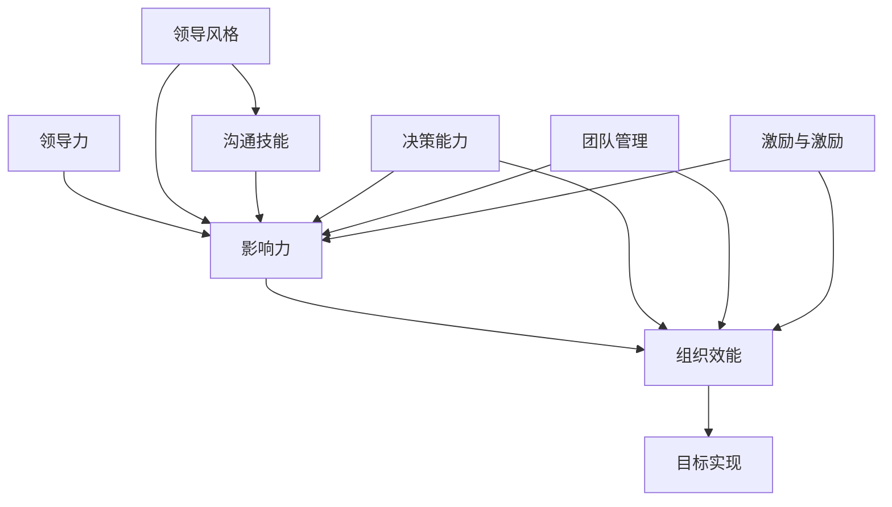

在这个流程图中，A表示领导力，它通过B（影响力）直接影响C（组织效能），并通过E、F、G、H和I等领导力子技能影响B。这样，我们能够清晰地看到领导力的多维度和综合性。

**核心算法原理讲解：**

领导力不是一个单一的算法，而是一个综合性的系统。我们可以用以下伪代码来简述其核心原理：

```python
class Leadership:
    def __init__(self, influence, communication, decision_making, team_management, motivation):
        self.influence = influence
        self.communication = communication
        self.decision_making = decision_making
        self.team_management = team_management
        self.motivation = motivation

    def apply_leadership(self):
        # 应用领导力技能
        self.influence_org()
        self.communicate_effectively()
        self.make_strategic_decisions()
        self.manage_teams()
        self.motivate_staff()
        
    def influence_org(self):
        # 影响组织
        # ...

    def communicate_effectively(self):
        # 有效沟通
        # ...

    def make_strategic_decisions(self):
        # 决策能力
        # ...

    def manage_teams(self):
        # 团队管理
        # ...

    def motivate_staff(self):
        # 激励与激励
        # ...
```

**数学模型和公式：**

在领导力中，我们常用的一些数学模型包括决策树、贝叶斯网络等。以下是一个简化的决策树模型示例：

$$
\begin{aligned}
\text{Decision Tree} &= \{ \\
&\quad \text{Node 1:}\ { \text{Status}, \text{Option 1}, \text{Option 2} } \\
&\quad \text{Node 2:}\ { \text{Status 1}, \text{Option 1}, \text{Option 2} } \\
&\quad \text{Node 3:}\ { \text{Status 2}, \text{Option 1}, \text{Option 2} } \\
\}
\end{aligned}
$$

**举例说明：**

假设一个团队面临两个项目选择，根据项目的潜在收益和风险，我们可以用决策树模型来帮助决策：

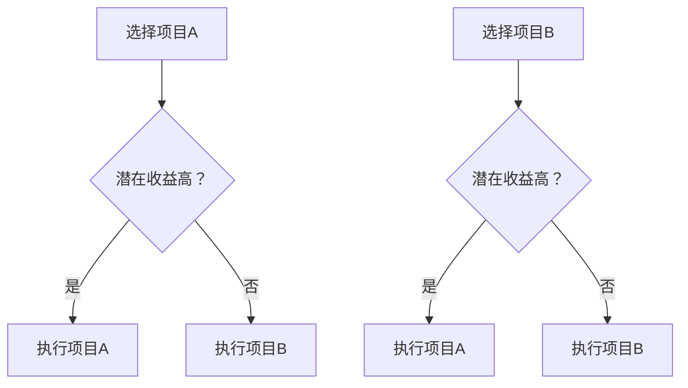

通过这样的决策树，我们可以系统地分析每个选择的潜在结果，从而做出更为明智的决策。

### 第2章：领导力的类型

#### 2.1 权力型领导力

**核心概念与联系：**

权力型领导力通常基于权威和命令，通过施加影响来实现组织目标。其关系架构如下：

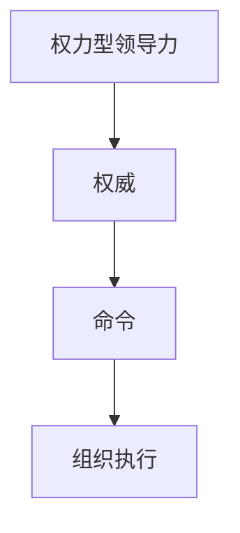

在这个架构中，A（权力型领导力）通过B（权威）和C（命令）影响D（组织执行），实现高效的组织运作。

**核心算法原理讲解：**

权力型领导力的核心算法可以简化为以下伪代码：

```python
class PowerLeadership:
    def __init__(self, authority, commands):
        self.authority = authority
        self.commands = commands

    def issue_commands(self):
        # 发布命令
        for command in self.commands:
            execute(command)

    def enforce_authority(self):
        # 维护权威
        # ...
```

**数学模型和公式：**

在权力型领导力中，我们可以使用一些简单的数学模型来分析其效率和效果，如：

$$
\text{Efficiency} = \frac{\text{Completed Tasks}}{\text{Assigned Tasks}}
$$

**举例说明：**

在一个军队组织中，指挥官通过权威发布命令，士兵执行任务。这种权力型领导力模式在紧急情况下能够迅速有效地执行任务。

#### 2.2 参与型领导力

**核心概念与联系：**

参与型领导力强调员工的参与和协作，通过共同决策和合作来实现目标。其关系架构如下：

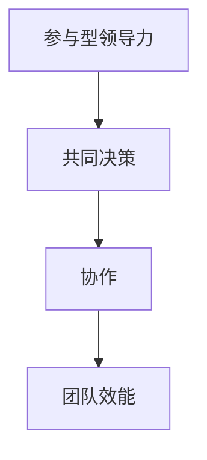

在这个架构中，A（参与型领导力）通过B（共同决策）和C（协作）提升D（团队效能），实现组织的长期发展。

**核心算法原理讲解：**

参与型领导力的核心算法可以简化为以下伪代码：

```python
class ParticipativeLeadership:
    def __init__(self, participation_levels):
        self.participation_levels = participation_levels

    def facilitate_decisions(self):
        # 协助决策
        for participant in self.participation_levels:
            include_participant_input(participant)

    def encourage_collaboration(self):
        # 鼓励协作
        # ...
```

**数学模型和公式：**

在参与型领导力中，我们可以使用一些复杂的数学模型来分析团队效能，如：

$$
\text{Team Effectiveness} = \sum_{i=1}^{n} \text{Individual Effectiveness} \times \text{Collaboration Coefficient}
$$

**举例说明：**

在一个创新团队中，领导者鼓励团队成员参与决策和协作，通过共同讨论和合作，提高团队的创新能力和整体效能。

#### 2.3 情境型领导力

**核心概念与联系：**

情境型领导力强调根据不同情境采取不同领导风格，灵活应对组织挑战。其关系架构如下：

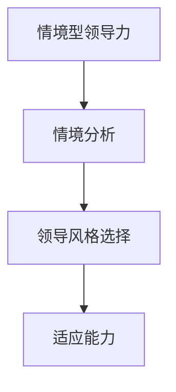

在这个架构中，A（情境型领导力）通过B（情境分析）和C（领导风格选择）提升D（适应能力），确保组织在不同情境下保持高效运作。

**核心算法原理讲解：**

情境型领导力的核心算法可以简化为以下伪代码：

```python
class SituationalLeadership:
    def __init__(self, situational_analyzer, leadership_styles):
        self.situational_analyzer = situational_analyzer
        self.leadership_styles = leadership_styles

    def analyze_situation(self):
        # 分析情境
        current_situation = self.situational_analyzer.analyze()

    def select_leadership_style(self):
        # 选择领导风格
        suitable_style = self.leadership_styles[current_situation]

    def adapt_leadership(self):
        # 调整领导风格
        apply(suitable_style)
```

**数学模型和公式：**

在情境型领导力中，我们可以使用一些基于贝叶斯理论的数学模型来分析情境和领导风格的关系，如：

$$
\text{Suitable Style} = \arg\max_{s} P(s|d) \cdot P(d)
$$

其中，$P(s|d)$ 表示给定情境 $d$ 下领导风格 $s$ 的概率，$P(d)$ 表示情境 $d$ 的概率。

**举例说明：**

在一个变化多端的市场环境中，领导者根据市场变化灵活调整领导风格，通过情境分析和领导风格选择，确保组织在动态环境中保持竞争优势。

### 第3章：领导力的自我发展

#### 3.1 自我认知

**核心概念与联系：**

自我认知是领导力自我发展的重要基础，它涉及对个人性格、能力、优劣势的了解。其关系架构如下：

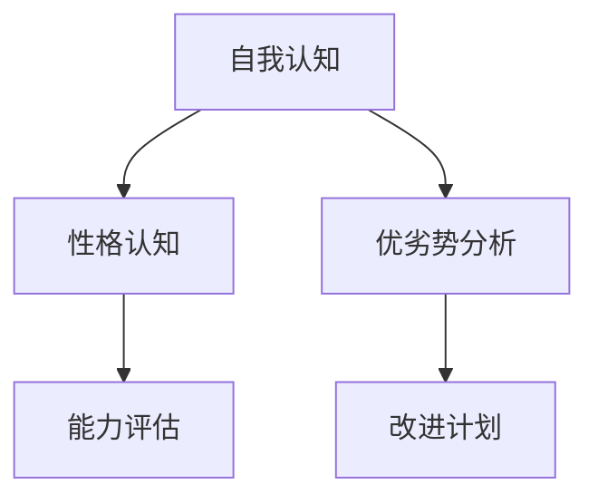

在这个架构中，A（自我认知）通过B（性格认知）和C（能力评估）了解个人优劣势，并制定改进计划。

**核心算法原理讲解：**

自我认知的核心算法可以简化为以下伪代码：

```python
class SelfAwareness:
    def __init__(self, personality, abilities, strengths, weaknesses):
        self.personality = personality
        self.abilities = abilities
        self.strengths = strengths
        self.weaknesses = weaknesses

    def assess_personality(self):
        # 评估性格
        # ...

    def evaluate_abilities(self):
        # 评估能力
        # ...

    def identify_strengths_and_weaknesses(self):
        # 识别优劣势
        # ...

    def develop_improvement_plan(self):
        # 制定改进计划
        # ...
```

**数学模型和公式：**

在自我认知中，我们可以使用一些简单的数学模型来分析个人优劣势，如：

$$
\text{Improvement Score} = \frac{\text{Strengths} + \text{Weakness Reduction}}{\text{Total Areas}}
$$

**举例说明：**

一个领导者通过性格测试了解自己的性格类型，通过能力评估识别自己的优势和弱点，并制定一个详细的改进计划来提升自我能力。

#### 3.2 持续学习

**核心概念与联系：**

持续学习是领导力自我发展的关键，它涉及不断吸收新知识、技能和经验，以适应快速变化的环境。其关系架构如下：

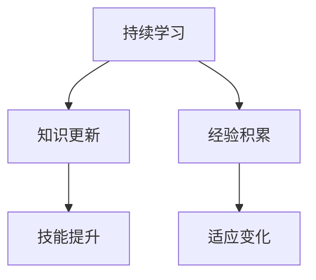

在这个架构中，A（持续学习）通过B（知识更新）和D（经验积累）提升C（技能提升），确保领导者能够适应环境变化。

**核心算法原理讲解：**

持续学习的核心算法可以简化为以下伪代码：

```python
class ContinuousLearning:
    def __init__(self, knowledge_sources, experience_resources):
        self.knowledge_sources = knowledge_sources
        self.experience_resources = experience_resources

    def update_knowledge(self):
        # 更新知识
        for source in self.knowledge_sources:
            learn_from(source)

    def enhance_skills(self):
        # 提升技能
        for skill in self.experience_resources:
            practice(skill)

    def accumulate_experience(self):
        # 积累经验
        # ...
```

**数学模型和公式：**

在持续学习中，我们可以使用一些简单的数学模型来分析学习效果，如：

$$
\text{Learning Effectiveness} = \frac{\text{New Knowledge} + \text{Improved Skills}}{\text{Total Time Spent}}
$$

**举例说明：**

一个领导者通过订阅行业期刊、参加专业培训课程和参与行业会议，不断更新知识，通过实际项目和实践提升技能，积累宝贵经验，从而提高领导力水平。

#### 3.3 情绪智能

**核心概念与联系：**

情绪智能是领导力的重要组成部分，它涉及理解和管理自己和他人的情绪，以促进有效沟通和团队合作。其关系架构如下：

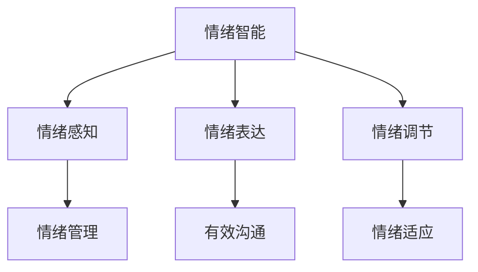

在这个架构中，A（情绪智能）通过B（情绪感知）和C（情绪管理）提升D（情绪表达），并通过F（情绪调节）和G（情绪适应）改善E（有效沟通）。

**核心算法原理讲解：**

情绪智能的核心算法可以简化为以下伪代码：

```python
class EmotionalIntelligence:
    def __init__(self, emotional_perception, emotional_management, emotional_expression, emotional Regulation):
        self.emotional_perception = emotional_perception
        self.emotional_management = emotional_management
        self.emotional_expression = emotional_expression
        self.emotional_regulation = emotional Regulation

    def perceive_emotions(self):
        # 感知情绪
        # ...

    def manage_emotions(self):
        # 管理情绪
        # ...

    def express_emotions(self):
        # 表达情绪
        # ...

    def regulate_emotions(self):
        # 调节情绪
        # ...
```

**数学模型和公式：**

在情绪智能中，我们可以使用一些简单的数学模型来分析情绪管理效果，如：

$$
\text{Emotional Regulation Score} = \frac{\text{Effective Expressions} + \text{Managed Emotions}}{\text{Total Emotional Interactions}}
$$

**举例说明：**

一个领导者通过自我反思和情绪调节技巧，学会在压力下保持冷静，通过有效沟通表达自己的情绪，从而改善团队氛围和提升团队绩效。

### 第二部分：创新文化的构建

#### 第4章：创新文化的定义与特征

**4.1 创新文化的定义**

**背景介绍：**

创新文化是一种鼓励创新、容忍失败、支持实验和持续改进的组织氛围。它不仅仅是一种理念，更是一种渗透到组织各个层面的价值观和行为准则。

**核心概念与联系：**

我们可以用以下Mermaid流程图来展示创新文化的核心概念及其相互关系：

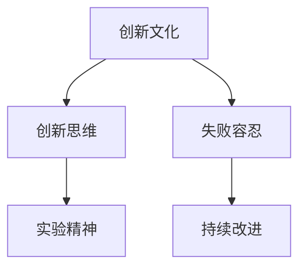

在这个架构中，A（创新文化）通过B（创新思维）、C（实验精神）、D（失败容忍）和E（持续改进）形成一个积极的创新氛围。

**核心算法原理讲解：**

创新文化的核心算法可以简化为以下伪代码：

```python
class InnovationCulture:
    def __init__(self, innovation_mindset, experimentation_spirits, failure_tolerance, continuous_improvement):
        self.innovation_mindset = innovation_mindset
        self.experimentation_spirits = experimentation_spirits
        self.failure_tolerance = failure_tolerance
        self.continuous_improvement = continuous_improvement

    def foster_innovation(self):
        # 培养创新思维
        # ...

    def encourage_experimentation(self):
        # 鼓励实验精神
        # ...

    def tolerate_failure(self):
        # 容忍失败
        # ...

    def pursue_continual_improvement(self):
        # 持续改进
        # ...
```

**数学模型和公式：**

在创新文化中，我们可以使用一些简单的数学模型来分析创新效果，如：

$$
\text{Innovation Effectiveness} = \frac{\text{Successful Innovations} + \text{Learned Experiences}}{\text{Total Attempts}}
$$

**举例说明：**

在一个创新文化浓厚的组织中，员工被鼓励提出新想法并进行实验，即使失败也不会受到惩罚。通过持续的改进和创新，组织能够不断提升其竞争力。

#### 4.2 创新文化的培育

**核心概念与联系：**

创新文化的培育是一个系统性工程，需要从组织氛围、激励机制等多个方面进行建设。其关系架构如下：

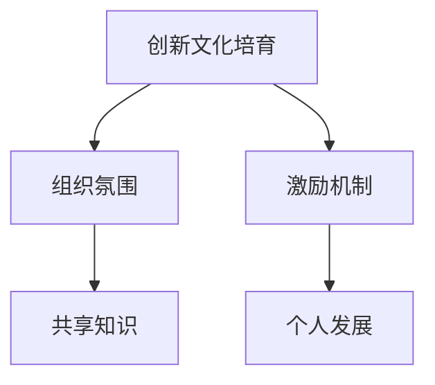

在这个架构中，A（创新文化培育）通过B（组织氛围）和D（激励机制）促进C（共享知识）和E（个人发展），形成一个良性循环。

**核心算法原理讲解：**

创新文化培育的核心算法可以简化为以下伪代码：

```python
class CultivationInnovationCulture:
    def __init__(self, organizational_atmosphere, incentives, knowledge_sharing, personal_growth):
        self.organizational_atmosphere = organizational_atmosphere
        self.incentives = incentives
        self.knowledge_sharing = knowledge_sharing
        self.personal_growth = personal_growth

    def cultivate_atmosphere(self):
        # 培养组织氛围
        # ...

    def implement_incentives(self):
        # 制定激励机制
        # ...

    def promote_knowledge_sharing(self):
        # 推动知识共享
        # ...

    def support_personal_growth(self):
        # 支持个人发展
        # ...
```

**数学模型和公式：**

在创新文化培育中，我们可以使用一些简单的数学模型来分析创新效果，如：

$$
\text{Innovation Culture Index} = \frac{\text{Knowledge Sharing} + \text{Incentive Effectiveness} + \text{Personal Growth}}{\text{Total Organizational Factors}}
$$

**举例说明：**

在一个创新文化培育得力的组织中，通过定期的团队建设活动、知识分享会议和绩效激励制度，员工能够积极参与创新，组织整体创新能力得到显著提升。

#### 4.3 创新文化的挑战

**核心概念与联系：**

创新文化在构建过程中面临着诸多挑战，包括传统文化的冲突、创新资源的有限以及创新过程的复杂性。其关系架构如下：

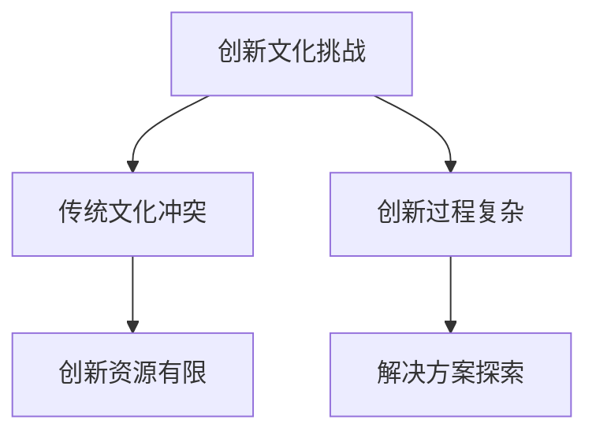

在这个架构中，A（创新文化挑战）通过B（传统文化冲突）和D（创新过程复杂）影响C（创新资源有限），并通过E（解决方案探索）寻找解决途径。

**核心算法原理讲解：**

创新文化挑战的核心算法可以简化为以下伪代码：

```python
class InnovationCultureChallenges:
    def __init__(self, traditional_culture_conflicts, innovation_resource_limitations, innovation_process_complexity):
        self.traditional_culture_conflicts = traditional_culture_conflicts
        self.innovation_resource_limitations = innovation_resource_limitations
        self.innovation_process_complexity = innovation_process_complexity

    def address_traditional_conflicts(self):
        # 解决传统文化冲突
        # ...

    def optimize_innovation_resources(self):
        # 优化创新资源
        # ...

    def simplify_innovation_processes(self):
        # 简化创新过程
        # ...

    def explore_solution(self):
        # 探索解决方案
        # ...
```

**数学模型和公式：**

在创新文化挑战中，我们可以使用一些复杂的数学模型来分析挑战和解决方案，如：

$$
\text{Challenge Resolution Score} = \frac{\text{Solved Conflicts} + \text{Optimized Resources} + \text{Simplified Processes}}{\text{Total Challenges}}
$$

**举例说明：**

在一个创新文化面临挑战的组织中，通过开展跨部门合作、优化资源分配和简化创新流程，逐步解决了传统文化与创新的冲突，提升了组织的整体创新能力。

### 第三部分：领导力与创新文化的实践案例

#### 第5章：成功案例分享

**5.1 案例一：谷歌的创新文化**

**背景介绍：**

谷歌以其创新文化著称，成为全球科技公司的典范。其成功得益于对创新的高度重视和一系列创新机制的实施。

**核心概念与联系：**

谷歌的创新文化可以概括为以下几个方面：

1. **开放分享：** 谷歌鼓励员工分享知识和经验，通过内部博客、技术会议等形式促进信息流通。
2. **自由时间：** 谷歌为员工提供20%的自由时间，用于探索个人感兴趣的项目，许多成功产品如Gmail和Google News都源于此。
3. **迭代开发：** 谷歌采用敏捷开发方法，快速迭代产品，以用户反馈为驱动，持续优化。

我们可以用以下Mermaid流程图来展示谷歌创新文化的核心概念及其相互关系：

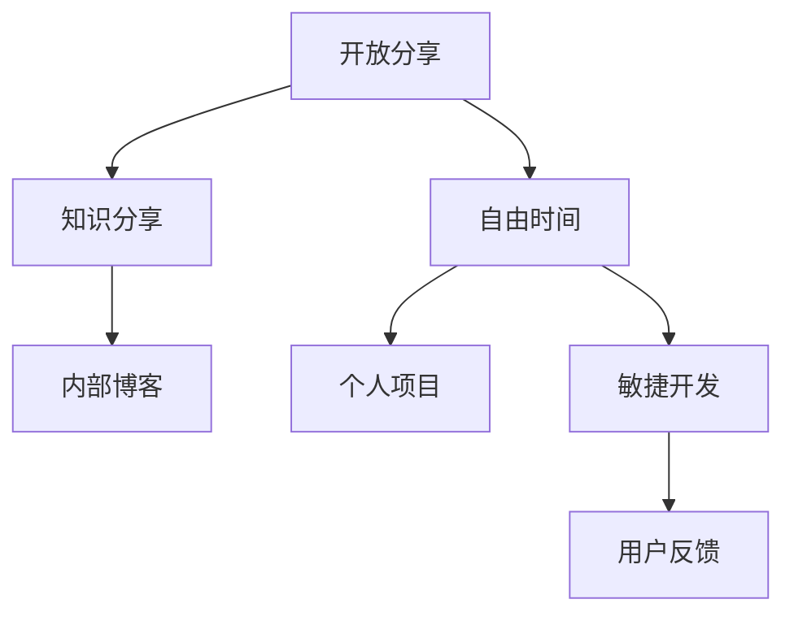

**核心算法原理讲解：**

谷歌的创新文化机制可以简化为以下伪代码：

```python
class GoogleInnovationCulture:
    def __init__(self, open_sharing, free_time, iterative_development):
        self.open_sharing = open_sharing
        self.free_time = free_time
        self.iterative_development = iterative_development

    def encourage_knowledge_sharing(self):
        # 鼓励知识分享
        # ...

    def provide_freetime_projects(self):
        # 提供自由时间项目
        # ...

    def adopt_agile_methods(self):
        # 采用敏捷开发
        # ...

    def gather_user_feedback(self):
        # 收集用户反馈
        # ...
```

**数学模型和公式：**

在谷歌的创新文化中，我们可以使用一些简单的数学模型来分析创新效果，如：

$$
\text{Innovation Success Rate} = \frac{\text{Successful Products}}{\text{Total Projects}}
$$

**举例说明：**

谷歌通过开放分享、自由时间和敏捷开发等创新机制，成功打造了一个充满活力的创新文化，持续推出一系列影响深远的产品，如Gmail、Google Maps和Google Search。

#### 5.2 案例二：苹果的创新之路

**背景介绍：**

苹果公司以其独特的设计理念和强大的创新能力，成为全球科技行业的标杆。乔布斯的领导风格对其创新文化产生了深远影响。

**核心概念与联系：**

苹果的创新文化可以概括为以下几个方面：

1. **设计驱动：** 苹果将设计作为创新的驱动力，注重用户体验和产品外观。
2. **封闭开发：** 苹果采用封闭开发模式，严格控制产品细节，确保产品的高质量和高一致性。
3. **生态系统：** 苹果通过构建完整的生态系统，包括硬件、软件和服务，实现生态闭环。

我们可以用以下Mermaid流程图来展示苹果创新文化的核心概念及其相互关系：

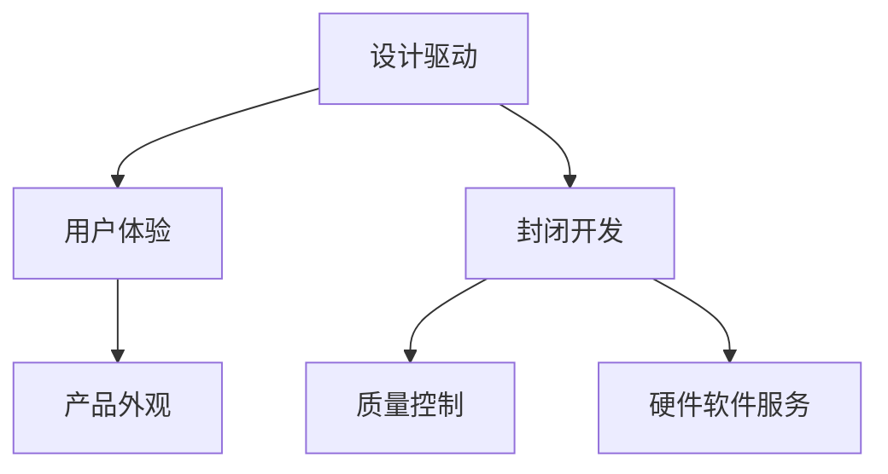

**核心算法原理讲解：**

苹果的创新文化机制可以简化为以下伪代码：

```python
class AppleInnovationCulture:
    def __init__(self, design_driven, closed_development, ecosystem):
        self.design_driven = design_driven
        self.closed_development = closed_development
        self.ecosystem = ecosystem

    def focus_on_design(self):
        # 关注设计
        # ...

    def maintain_high_quality(self):
        # 维护高质量
        # ...

    def build_ecosystem(self):
        # 构建生态系统
        # ...
```

**数学模型和公式：**

在苹果的创新文化中，我们可以使用一些简单的数学模型来分析创新效果，如：

$$
\text{Product Quality Score} = \frac{\text{Highly Rated Products}}{\text{Total Products}}
$$

**举例说明：**

苹果通过设计驱动、封闭开发和生态系统构建，成功打造了一个独特而强大的创新文化，推出了一系列高质量、高影响力的产品，如iPhone、iPad和Mac。

#### 5.3 案例三：华为的创新实践

**背景介绍：**

华为作为全球领先的通信技术公司，以其强大的创新能力和持续的技术研发，取得了显著的市场成就。

**核心概念与联系：**

华为的创新实践可以概括为以下几个方面：

1. **研发投入：** 华为持续增加研发投入，每年研发经费占营收的比例超过10%，保持技术创新的领先地位。
2. **全球合作：** 华为通过全球合作，吸引顶尖人才，推动技术创新。
3. **知识产权：** 华为高度重视知识产权，通过专利布局和标准制定，保护并扩大技术优势。

我们可以用以下Mermaid流程图来展示华为创新实践的核心概念及其相互关系：

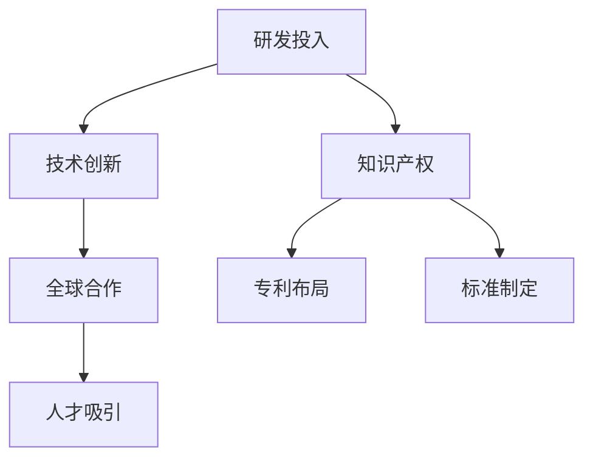

**核心算法原理讲解：**

华为的创新实践机制可以简化为以下伪代码：

```python
class HuaweiInnovationPractice:
    def __init__(self, research_investment, global_cooperation, intellectual_property):
        self.research_investment = research_investment
        self.global_cooperation = global_cooperation
        self.intellectual_property = intellectual_property

    def increase_research_investment(self):
        # 增加研发投入
        # ...

    def promote_global_partnerships(self):
        # 推动全球合作
        # ...

    def protect_intellectual_property(self):
        # 保护知识产权
        # ...

    def leverage_patent_layout(self):
        # 利用专利布局
        # ...

    def establish_technical_standards(self):
        # 制定技术标准
        # ...
```

**数学模型和公式：**

在华为的创新实践中，我们可以使用一些简单的数学模型来分析创新效果，如：

$$
\text{Innovation Impact} = \frac{\text{Technical Breakthroughs} + \text{Patent Applications}}{\text{Total Resources Invested}}
$$

**举例说明：**

华为通过持续的研发投入、全球合作和知识产权保护，成功构建了一个强大的创新体系，推出了一系列具有国际竞争力的技术产品，如5G通信技术和智能设备。

### 第四部分：领导力与创新文化的未来趋势

#### 第6章：数字化背景下的领导力

**6.1 数字化对领导力的影响**

**背景介绍：**

随着数字技术的快速发展，数字化已经深刻地改变了领导力的运作方式。数字化领导力成为现代领导者必备的技能。

**核心概念与联系：**

我们可以用以下Mermaid流程图来展示数字化对领导力的影响及其相互关系：

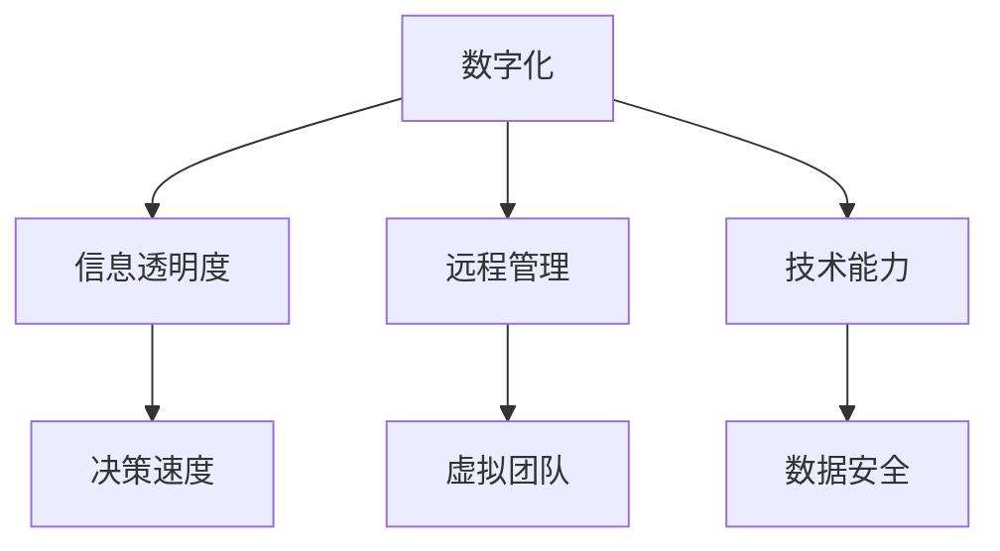

在这个架构中，A（数字化）通过B（信息透明度）、D（远程管理）和F（技术能力）影响C（决策速度）和E（虚拟团队），并关注G（数据安全）。

**核心算法原理讲解：**

数字化领导力的核心算法可以简化为以下伪代码：

```python
class DigitalLeadership:
    def __init__(self, information_transparency, decision_speed, remote_management, technical_capabilities, data_safety):
        self.information_transparency = information_transparency
        self.decision_speed = decision_speed
        self.remote_management = remote_management
        self.technical_capabilities = technical_capabilities
        self.data_safety = data_safety

    def enhance_informat
```

