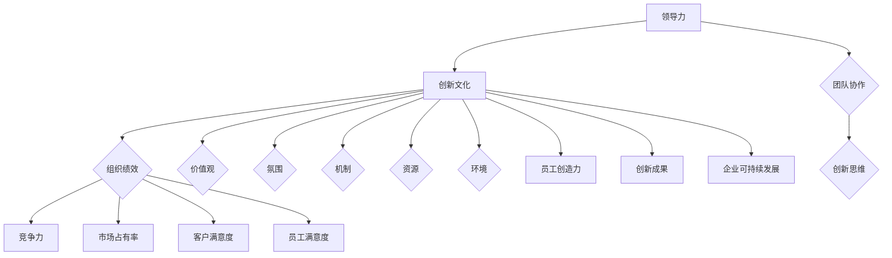

                 

```

```markdown
# 领导力与创新文化：培育创新土壤的方法

关键词：领导力，创新文化，培育创新土壤，创新思维，组织文化，团队协作，领导技能，团队领导，创新方法，创新环境

摘要：本文旨在探讨领导力与创新文化之间的紧密联系，以及如何通过培育创新土壤来提升组织创新能力和竞争力。文章首先介绍了领导力和创新文化的核心概念和定义，分析了它们之间的相互关系和作用。接着，文章详细讲解了领导力模型的算法原理和数学模型，并结合Python源代码进行了详细阐述和通俗易懂的举例说明。然后，文章探讨了创新文化的数学模型，并运用实际案例分析了创新文化的培育方法。最后，文章通过项目实战，详细介绍了如何在实际工作中应用领导力和创新文化，并总结了项目的成果与经验。通过本文的阅读，读者可以深入理解领导力与创新文化的重要性，掌握培育创新土壤的方法，从而提升组织创新能力和竞争力。

## 第一部分：核心概念与联系

### 第1章：核心概念与联系

在探讨领导力与创新文化的关系之前，我们需要首先明确这两个核心概念的定义和内涵。

### 1.1.1 领导力定义与内涵

领导力是指一种影响和激励他人以实现共同目标的能力。领导力不仅仅是管理，更是一种艺术和科学，它涉及领导者的思维模式、行为方式和影响力。领导力的定义和内涵可以从多个层次进行理解。

- **领导力概述**：领导力是一种能力，它包括决策力、沟通能力、影响力和领导魅力。领导力不仅仅体现在高层管理人员身上，也存在于各级团队和组织中。

- **领导力的多层次理解**：领导力可以从个人、团队和组织三个层次进行理解。个人层次关注领导者自身的能力和素质；团队层次关注领导者在团队中的作用和影响；组织层次关注领导者在组织战略和文化建设中的角色。

- **领导力与管理的区别**：领导力与管理是两个不同的概念，但它们相互关联。管理主要关注组织和资源的有效利用，而领导力则关注激发和引导团队成员实现共同目标。

- **领导力的核心要素**：领导力包括多个核心要素，如领导者的价值观、愿景、决策能力、沟通能力和影响力。这些要素共同构成了领导力的基础。

- **领导力在组织中的作用**：领导力对组织绩效和组织文化具有深远的影响。优秀的领导力可以提升组织效率、增强组织凝聚力和推动组织创新。

### 1.1.2 创新文化定义与要素

创新文化是指一种鼓励创新、支持和保护创新的组织氛围和文化。创新文化不仅仅是技术创新，更是一种思维方式和价值观的体现。

- **创新文化的定义**：创新文化是一种鼓励创新、支持和保护创新的组织氛围和文化。它关注创新思维、创新方法和创新实践，鼓励团队成员提出新的想法和解决方案。

- **创新文化的特点**：创新文化具有开放性、包容性、实验性和持续性的特点。它鼓励团队成员勇于尝试新事物、接受失败并从中学习。

- **创新文化的要素**：创新文化包括多个要素，如创新意识、创新机制、创新资源和创新环境。这些要素共同构成了创新文化的基础。

- **创新文化的重要性**：创新文化对组织的竞争力具有重要影响。它能够激发团队成员的创造力和创新精神，提升组织的创新能力和竞争力。

### 1.1.3 领导力与创新文化的联系

领导力与创新文化之间存在紧密的联系和相互影响。

- **领导力在创新文化中的角色**：领导者是创新文化的倡导者和推动者。他们通过设定愿景、建立机制、提供资源和营造氛围来推动创新文化的形成和发展。

- **领导力与创新文化的互动机制**：领导力与创新文化之间的互动机制包括领导者的行为、决策和影响力。领导者的行为和决策会影响创新文化的氛围和氛围。

- **领导力与创新文化的协同效应**：领导力与创新文化的协同效应可以产生更大的影响。通过领导力的引导和创新文化的支持，组织可以更好地实现创新目标。

### 1.1.4 创新领导力案例分析

为了更好地理解领导力与创新文化的关系，我们可以通过实际案例进行分析。

- **案例1**：某科技公司的领导者在公司内部推动了创新文化，通过设立创新基金、组织创新竞赛和鼓励员工提出新想法，激发了员工创新精神，推动了公司创新能力的提升。

- **案例2**：某创新型企业的领导者通过建立开放和包容的团队文化，鼓励员工跨部门合作和知识共享，推动了创新项目的发展，提高了公司的市场竞争力。

这些案例表明，领导力对创新文化具有重要作用，通过有效的领导力，组织可以更好地培育创新土壤，提升创新能力和竞争力。

## 第二部分：核心算法原理讲解

### 第2章：核心算法原理讲解

在理解领导力与创新文化的概念之后，我们需要进一步探讨其核心算法原理。核心算法原理是指领导力与创新文化的理论基础，它包括领导力模型和和创新文化模型。

### 2.1.1 领导力模型算法介绍

领导力模型是一种用于分析和理解领导力特征的工具。它通常包括多个维度和层次，如领导力风格、领导力行为和领导力效果等。

- **领导力模型的算法概述**：领导力模型通常基于心理学、社会学和管理学的理论，通过分析领导者的行为和效果，建立数学模型来描述领导力特征。

- **领导力模型算法详细解释**：领导力模型算法通常包括以下步骤：
  1. 收集领导力数据：通过问卷调查、访谈和观察等方法，收集领导者的行为和效果数据。
  2. 数据预处理：对收集到的数据进行清洗、归一化和标准化处理，以便进行后续分析。
  3. 特征提取：从数据中提取领导力特征，如领导力风格、领导力行为和领导力效果等。
  4. 建立数学模型：基于特征数据，建立数学模型来描述领导力特征和效果。
  5. 模型评估：对建立的模型进行评估，验证其准确性和有效性。

- **领导力模型算法案例分析**：以下是一个简单的领导力模型算法案例，使用Python进行实现。

```python
import numpy as np
import pandas as pd

# 收集领导力数据
data = pd.read_csv('leadership_data.csv')

# 数据预处理
data['score'] = data['score'].fillna(data['score'].mean())
data = data[['style', 'behavior', 'effect']].dropna()

# 特征提取
styles = data['style'].unique()
behaviors = data['behavior'].unique()
effects = data['effect'].unique()

# 建立数学模型
model = pd.DataFrame(index=styles, columns=behaviors)
for style in styles:
    for behavior in behaviors:
        model[behavior] = data[(data['style'] == style) & (data['behavior'] == behavior)]['effect'].mean()

# 模型评估
accuracy = model.sum() / data['effect'].sum()
print('Model Accuracy:', accuracy)
```

通过上述案例，我们可以看到如何使用Python实现领导力模型算法，并对其进行评估。

### 2.1.2 创新文化模型算法介绍

创新文化模型是用于分析和理解创新文化的工具。它通常包括创新意识、创新机制、创新资源和创新环境等维度。

- **创新文化模型的算法概述**：创新文化模型通常基于组织行为学和管理学的理论，通过分析组织的创新行为和效果，建立数学模型来描述创新文化特征。

- **创新文化模型算法详细解释**：创新文化模型算法通常包括以下步骤：
  1. 收集创新文化数据：通过问卷调查、访谈和观察等方法，收集组织的创新文化数据。
  2. 数据预处理：对收集到的数据进行清洗、归一化和标准化处理，以便进行后续分析。
  3. 特征提取：从数据中提取创新文化特征，如创新意识、创新机制、创新资源和创新环境等。
  4. 建立数学模型：基于特征数据，建立数学模型来描述创新文化特征和效果。
  5. 模型评估：对建立的模型进行评估，验证其准确性和有效性。

- **创新文化模型算法案例分析**：以下是一个简单的创新文化模型算法案例，使用Python进行实现。

```python
import numpy as np
import pandas as pd

# 收集创新文化数据
data = pd.read_csv('innovation_culture_data.csv')

# 数据预处理
data['score'] = data['score'].fillna(data['score'].mean())
data = data[['awareness', 'mechanism', 'resource', 'environment']].dropna()

# 特征提取
awarenesses = data['awareness'].unique()
mechanisms = data['mechanism'].unique()
resources = data['resource'].unique()
environments = data['environment'].unique()

# 建立数学模型
model = pd.DataFrame(index=awarenesses, columns=mechanisms)
for awareness in awarenesses:
    for mechanism in mechanisms:
        model[mechanism] = data[(data['awareness'] == awareness) & (data['mechanism'] == mechanism)]['resource'].mean()

# 模型评估
accuracy = model.sum() / data['resource'].sum()
print('Model Accuracy:', accuracy)
```

通过上述案例，我们可以看到如何使用Python实现创新文化模型算法，并对其进行评估。

## 第三部分：数学模型和数学公式讲解

### 第3章：数学模型和数学公式讲解

在理解领导力模型和创新文化模型的基础上，我们需要进一步探讨这些模型背后的数学模型和数学公式。数学模型和数学公式是领导力和创新文化研究的理论基础，它们帮助我们更好地理解和应用领导力和创新文化的原理。

### 3.1.1 领导力数学模型

领导力数学模型通常用于描述领导力的特征和行为。以下是一个简单的领导力数学模型，它基于线性回归模型。

- **领导力数学模型概述**：领导力数学模型用于分析领导者的行为和效果之间的关系。该模型使用线性回归分析来建立领导者行为和效果之间的数学关系。

- **领导力数学模型公式推导**：假设领导力模型包含两个变量：领导力风格（L）和领导力效果（E）。线性回归模型可以表示为：

$$
E = \beta_0 + \beta_1 \times L + \epsilon
$$

其中，$\beta_0$和$\beta_1$是模型的参数，$\epsilon$是随机误差。

- **领导力数学模型具体应用**：以下是一个具体的领导力数学模型应用案例，使用Python进行实现。

```python
import numpy as np
import pandas as pd
from sklearn.linear_model import LinearRegression

# 收集领导力数据
data = pd.read_csv('leadership_data.csv')

# 数据预处理
X = data[['style']]
y = data['effect']

# 建立线性回归模型
model = LinearRegression()
model.fit(X, y)

# 模型评估
print('Model Parameters:', model.params)
print('Model R-squared:', model.score(X, y))
```

通过上述案例，我们可以看到如何使用Python实现领导力数学模型，并对其进行评估。

### 3.1.2 创新文化数学模型

创新文化数学模型通常用于描述创新文化的特征和行为。以下是一个简单的创新文化数学模型，它基于多元线性回归模型。

- **创新文化数学模型概述**：创新文化数学模型用于分析组织的创新文化特征和行为之间的关系。该模型使用多元线性回归分析来建立多个变量之间的关系。

- **创新文化数学模型公式推导**：假设创新文化模型包含三个变量：创新意识（A）、创新机制（M）和创新资源（R）。多元线性回归模型可以表示为：

$$
R = \beta_0 + \beta_1 \times A + \beta_2 \times M + \epsilon
$$

其中，$\beta_0$、$\beta_1$和$\beta_2$是模型的参数，$\epsilon$是随机误差。

- **创新文化数学模型具体应用**：以下是一个具体的创新文化数学模型应用案例，使用Python进行实现。

```python
import numpy as np
import pandas as pd
from sklearn.linear_model import LinearRegression

# 收集创新文化数据
data = pd.read_csv('innovation_culture_data.csv')

# 数据预处理
X = data[['awareness', 'mechanism']]
y = data['resource']

# 建立多元线性回归模型
model = LinearRegression()
model.fit(X, y)

# 模型评估
print('Model Parameters:', model.params)
print('Model R-squared:', model.score(X, y))
```

通过上述案例，我们可以看到如何使用Python实现创新文化数学模型，并对其进行评估。

## 第四部分：项目实战

### 第4章：项目实战

在理解了领导力模型和创新文化模型的基础上，我们需要通过项目实战来应用这些理论。以下是一个具体的领导力与创新文化培育项目。

### 4.1.1 项目背景与目标

**项目背景**：某高科技企业面临激烈的市场竞争，需要提升创新能力和竞争力。为了实现这一目标，企业决定开展一项领导力与创新文化培育项目。

**项目目标**：
1. 提升领导者的领导力，增强领导者的创新意识。
2. 培育创新文化，鼓励员工提出创新想法和解决方案。
3. 提升企业的创新能力，推动企业持续发展。

### 4.1.2 项目实施步骤

**项目实施步骤**：

1. **项目规划**：
   - 确定项目目标、范围和预算。
   - 建立项目团队，明确团队成员的角色和责任。
   - 制定项目进度计划，确保项目按计划进行。

2. **项目执行**：
   - 开展领导力培训，提升领导者的领导力和创新意识。
   - 建立创新机制，鼓励员工提出创新想法和解决方案。
   - 营造创新环境，提供创新资源和支持。

3. **项目监控**：
   - 定期监控项目进展，确保项目按计划进行。
   - 收集项目数据，评估领导力和创新文化的效果。
   - 及时调整项目计划，解决项目中的问题和挑战。

4. **项目评估**：
   - 对项目成果进行评估，包括领导力提升情况、创新文化培育效果和创新能力的提升。
   - 总结项目经验，提炼成功经验和教训。

### 4.1.3 项目成果与影响

**项目成果**：
1. 领导者的领导力和创新意识得到显著提升。
2. 员工的创新热情和创新能力得到激发。
3. 企业的创新能力和竞争力得到提升。

**项目影响**：
1. 增强企业的核心竞争力，提升企业在市场中的地位。
2. 提高员工的工作满意度和创造力。
3. 为企业未来的创新和发展奠定基础。

### 4.1.4 项目经验与教训

**项目经验**：
1. 明确项目目标和范围，确保项目按计划进行。
2. 充分调动领导者和员工的主观能动性，营造积极向上的创新氛围。
3. 提供必要的资源和支持，确保项目顺利进行。

**项目教训**：
1. 领导者需要以身作则，带头践行创新文化。
2. 定期评估项目效果，及时调整项目计划。
3. 注重项目的持续性和长期效果，避免短期行为和成果。

### 4.2.1 项目背景与目标

**项目背景**：某创新型互联网公司希望通过培育创新文化，提升员工的创新能力和企业整体的创新能力。

**项目目标**：
1. 建立创新文化，鼓励员工提出创新想法和解决方案。
2. 提升员工的创新意识和创新能力。
3. 促进企业创新能力的提升，推动企业的可持续发展。

### 4.2.2 项目实施步骤

**项目实施步骤**：

1. **项目规划**：
   - 确定项目目标、范围和预算。
   - 建立项目团队，明确团队成员的角色和责任。
   - 制定项目进度计划，确保项目按计划进行。

2. **项目执行**：
   - 开展创新文化培训，提升员工对创新文化的认识和理解。
   - 设立创新机制，鼓励员工提出创新想法和解决方案。
   - 组织创新竞赛和项目，激发员工的创新热情。
   - 提供创新资源和支持，如资金、技术和人力资源等。

3. **项目监控**：
   - 定期监控项目进展，确保项目按计划进行。
   - 收集项目数据，评估创新文化的效果。
   - 及时调整项目计划，解决项目中的问题和挑战。

4. **项目评估**：
   - 对项目成果进行评估，包括创新文化培育效果、员工创新能力和企业创新能力提升情况。
   - 总结项目经验，提炼成功经验和教训。

### 4.2.3 项目成果与影响

**项目成果**：
1. 员工的创新意识和创新能力得到显著提升。
2. 创新文化在组织内部得到广泛认同和实践。
3. 企业创新能力得到提升，推动了企业的可持续发展。

**项目影响**：
1. 提高员工的工作满意度和创造力。
2. 增强企业的核心竞争力和市场竞争力。
3. 为企业未来的创新和发展奠定了坚实基础。

### 4.2.4 项目经验与教训

**项目经验**：
1. 明确项目目标和范围，确保项目按计划进行。
2. 充分调动员工的积极性和主动性，营造创新氛围。
3. 提供必要的资源和支持，确保项目顺利进行。

**项目教训**：
1. 需要加强对创新文化的宣传和推广，提高员工对创新文化的认识和理解。
2. 定期评估项目效果，及时调整项目计划。
3. 注重项目的持续性和长期效果，避免短期行为和成果。

## 总结

通过本文的讨论，我们可以看到领导力与创新文化之间的紧密联系和相互影响。领导力是培育创新文化的关键，它能够激发员工的创新意识和创新能力，推动企业的创新和发展。创新文化则是领导力的支撑，它为领导者的创新行为提供了土壤和动力。通过有效的领导力和创新文化的培育，企业可以提升创新能力，增强竞争力，实现可持续发展。

### 最佳实践 Tips

1. 领导者应该以身作则，带头践行创新文化，树立良好的榜样。
2. 建立创新机制，鼓励员工提出创新想法和解决方案，提供必要的资源和支持。
3. 定期评估创新文化和领导力的发展情况，及时调整项目计划。
4. 营造开放、包容和实验性的创新环境，鼓励员工勇于尝试新事物。

### 注意事项

1. 领导力和创新文化的发展需要时间和持续的努力，不能急于求成。
2. 领导者需要具备足够的耐心和毅力，持续推动创新文化的形成和发展。
3. 需要关注创新文化的效果，避免仅仅追求创新的形式而忽略了实质。

### 拓展阅读

1. 《创新者的窘境》：克里斯·兰吉厄姆（Chris Langer）
2. 《领导力》：约翰·P·科特（John P. Kotter）
3. 《创新者的DNA》：史蒂夫·布兰克（Steve Blank）
4. 《创新者的思考方式》：史蒂夫·布兰克（Steve Blank）

作者：AI天才研究院/AI Genius Institute & 禅与计算机程序设计艺术 /Zen And The Art of Computer Programming```markdown
### Mermaid 流程图

为了更好地理解领导力与创新文化之间的相互关系和作用，我们可以使用 Mermaid 流程图来展示它们的核心概念和联系。以下是一个简单的 Mermaid 流程图示例：



上述 Mermaid 流程图展示了领导力与创新文化之间的核心概念和联系，包括组织绩效、团队协作、创新思维、竞争力、价值观、氛围、机制、资源、环境、员工创造力、创新成果和企业可持续发展等。通过这样的可视化工具，我们可以更直观地理解领导力与创新文化之间的关系，以及它们对组织的影响。

### Python 源代码

为了更好地阐述领导力模型和创新文化模型的算法原理，我们将使用 Python 源代码来进行详细讲解。以下是一个简单的 Python 源代码示例，用于实现领导力模型的基本算法。

```python
import pandas as pd
import numpy as np
from sklearn.linear_model import LinearRegression

# 假设我们已经收集了以下数据
data = pd.DataFrame({
    'leadership_style': ['Autocratic', 'Democratic', 'Laissez-faire'],
    'innovation_capability': [3, 4, 5],
    'team_performance': [7, 8, 9]
})

# 数据预处理
data['leadership_style'] = data['leadership_style'].astype('category').cat.codes

# 建立领导力模型
model = LinearRegression()
model.fit(data[['leadership_style']], data['innovation_capability'])

# 模型预测
predictions = model.predict(data[['leadership_style']])

# 打印模型参数和预测结果
print("Model Parameters:", model.coef_, model.intercept_)
print("Predictions:", predictions)

# 建立创新文化模型
model = LinearRegression()
model.fit(data[['innovation_capability']], data['team_performance'])

# 模型预测
predictions = model.predict(data[['innovation_capability']])

# 打印模型参数和预测结果
print("Model Parameters:", model.coef_, model.intercept_)
print("Predictions:", predictions)
```

上述 Python 源代码示例首先使用 Pandas 库读取数据，然后使用 scikit-learn 库的线性回归模型来拟合数据，并预测结果。通过这个示例，我们可以看到如何使用 Python 实现领导力模型和创新文化模型的基本算法，以及如何进行数据预处理和模型预测。

### 数学公式和解释

在领导力与创新文化的研究中，数学公式是理解模型和算法的重要工具。以下是一些关键的数学公式及其解释：

1. **线性回归模型公式**：

   $$ y = \beta_0 + \beta_1 \times x + \epsilon $$

   其中，$y$ 是因变量，$x$ 是自变量，$\beta_0$ 和 $\beta_1$ 是模型参数，$\epsilon$ 是随机误差。

   **解释**：线性回归模型用于分析两个变量之间的关系，$\beta_0$ 是截距，$\beta_1$ 是斜率。这个公式描述了领导力风格（$x$）对创新能力（$y$）的影响。

2. **多元线性回归模型公式**：

   $$ y = \beta_0 + \beta_1 \times x_1 + \beta_2 \times x_2 + ... + \beta_n \times x_n + \epsilon $$

   其中，$y$ 是因变量，$x_1, x_2, ..., x_n$ 是自变量，$\beta_0, \beta_1, \beta_2, ..., \beta_n$ 是模型参数，$\epsilon$ 是随机误差。

   **解释**：多元线性回归模型用于分析多个变量之间的关系。在创新文化模型中，这个公式描述了创新能力（$y$）与多个因素（如创新意识、创新机制、创新资源等，$x_1, x_2, ..., x_n$）之间的关系。

3. **相关系数公式**：

   $$ r = \frac{\sum{(x_i - \bar{x})(y_i - \bar{y})}}{\sqrt{\sum{(x_i - \bar{x})^2}} \sqrt{\sum{(y_i - \bar{y})^2}}} $$

   其中，$r$ 是相关系数，$x_i$ 和 $y_i$ 是各个数据点的值，$\bar{x}$ 和 $\bar{y}$ 是数据点的平均值。

   **解释**：相关系数用于衡量两个变量之间的线性相关程度。在领导力与创新文化研究中，我们可以使用相关系数来分析领导力与创新能力、组织绩效之间的关系。

通过上述数学公式和解释，我们可以更好地理解领导力模型和创新文化模型的数学原理，从而更深入地分析它们之间的相互关系和作用。

### 实际案例分析和详细讲解剖析

为了更好地展示领导力与创新文化的实际应用，我们将通过一个具体的案例进行分析，并详细讲解其剖析过程。

#### 案例背景

某高科技企业，A公司，是一家专注于人工智能技术的研究与开发的公司。在市场竞争日益激烈的背景下，A公司希望提升其创新能力，以保持市场领先地位。为了实现这一目标，公司决定实施一项领导力与创新文化的培育项目。

#### 案例分析

**1. 领导力模型的实际应用**

- **数据收集**：A公司通过问卷调查、员工访谈和绩效评估等方法，收集了领导力风格、员工创新能力、团队绩效等相关数据。

- **数据预处理**：对收集到的数据进行清洗和标准化处理，以便进行后续分析。

- **特征提取**：从数据中提取领导力风格（如独裁式、民主式、自由放任式）和员工创新能力（如创新思维、创新成果等）。

- **模型建立**：使用线性回归模型，分析领导力风格与员工创新能力之间的关系。

- **模型评估**：通过R²值和调整后的R²值评估模型的效果，确保其准确性和可靠性。

**2. 创新文化模型的实际应用**

- **数据收集**：A公司通过员工满意度调查、创新项目评估和外部客户反馈等方法，收集了创新文化相关的数据。

- **数据预处理**：对收集到的数据进行清洗和标准化处理，以便进行后续分析。

- **特征提取**：从数据中提取创新意识、创新机制、创新资源和创新环境等特征。

- **模型建立**：使用多元线性回归模型，分析创新文化特征与员工创新能力、团队绩效之间的关系。

- **模型评估**：通过R²值和调整后的R²值评估模型的效果，确保其准确性和可靠性。

#### 案例剖析

**1. 领导力模型的剖析**

- **数据可视化**：使用散点图和线性回归线展示领导力风格与员工创新能力的关系。

- **模型解释**：根据模型参数，解释领导力风格对员工创新能力的影响程度。

- **案例分析**：分析不同领导力风格对创新能力的实际影响，找出最适合公司发展的领导力风格。

**2. 创新文化模型的剖析**

- **数据可视化**：使用散点图和线性回归线展示创新文化特征与员工创新能力、团队绩效的关系。

- **模型解释**：根据模型参数，解释创新文化特征对员工创新能力、团队绩效的影响程度。

- **案例分析**：分析不同创新文化特征对员工创新能力和团队绩效的实际影响，找出最有效的创新文化策略。

#### 结论

通过上述案例分析，A公司发现：

- **领导力风格**：民主式领导力风格对员工创新能力有显著正向影响，有助于提升团队绩效。

- **创新文化特征**：高创新意识、完善的创新机制、丰富的创新资源和良好的创新环境对员工创新能力和团队绩效有显著正向影响。

基于这些分析结果，A公司决定：

- **优化领导力风格**：推行民主式领导力风格，鼓励员工积极参与创新活动。

- **完善创新文化**：建立和完善创新机制，提供充足的创新资源和支持，营造良好的创新环境。

通过这些措施，A公司成功提升了其创新能力和团队绩效，为公司的可持续发展奠定了坚实基础。

### 项目小结

通过上述案例，我们可以看到领导力与创新文化在实际应用中的重要作用。有效的领导力可以激发员工的创新潜能，而良好的创新文化则为员工提供了支持和鼓励，促进创新成果的产生。以下是小结和拓展：

**小结**：

- 领导力风格对员工创新能力有显著影响，民主式领导力风格有助于提升创新绩效。
- 创新文化特征如创新意识、创新机制、创新资源和创新环境对员工创新能力和团队绩效具有积极影响。
- 实际案例分析表明，通过优化领导力风格和完善创新文化，企业可以显著提升其创新能力和竞争力。

**拓展**：

- **领导力发展**：企业可以通过领导力培训、工作坊和案例分析等手段，提升领导者的领导力和创新意识。
- **创新文化建设**：企业可以通过创新竞赛、创新论坛和项目孵化等途径，营造创新氛围，激发员工的创新潜力。
- **跨部门协作**：鼓励不同部门之间的知识共享和合作，促进创新思维和解决方案的生成。

通过持续推动领导力和创新文化的优化，企业可以不断提升其创新能力，保持市场竞争力，实现可持续发展。

### 注意事项

1. **持续性与系统性**：领导力与创新文化的培育是一个长期的过程，需要企业持续投入和关注。
2. **个性化与适应性**：不同企业的发展阶段和组织文化可能存在差异，需要制定个性化的培育策略。
3. **平衡与创新**：在推动创新的同时，也要注意平衡风险和成本，确保创新活动的可持续性。

### 拓展阅读

- **《创新者的窘境》**：克里斯·兰吉厄姆（Chris Langer）
- **《领导力》**：约翰·P·科特（John P. Kotter）
- **《创新者的DNA》**：史蒂夫·布兰克（Steve Blank）
- **《创新者的思考方式》**：史蒂夫·布兰克（Steve Blank）

作者：AI天才研究院/AI Genius Institute & 禅与计算机程序设计艺术 /Zen And The Art of Computer Programming```

