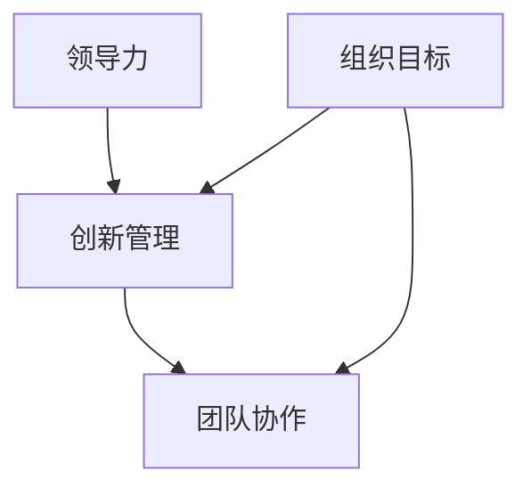
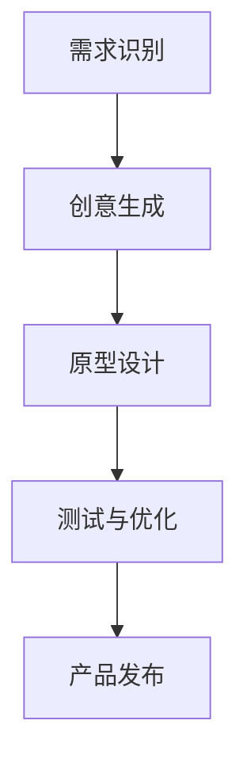

                 

# 《领导力与创新管理：培养团队创新能力的方法》

## 关键词

- 领导力
- 创新管理
- 团队协作
- 创新文化
- 激励机制
- 跨文化沟通
- 创新实践

## 摘要

本文旨在探讨如何通过有效的领导力和创新管理，培养团队的创新能力。文章首先介绍了领导力和创新管理的核心概念，并分析了它们之间的联系。接着，文章详细阐述了领导力培养的方法、创新管理策略、团队协作与沟通技巧。随后，文章通过实际案例，展示了这些方法在实践中的应用。最后，文章总结了培养团队创新能力的关键要素，并提出了未来的发展趋势和展望。

## 引言

在当今快速变化和竞争激烈的市场环境中，创新能力已成为企业持续发展的关键驱动力。而领导力则是推动团队实现创新能力的重要因素。领导力与创新管理之间的紧密联系，决定了团队能否在创新过程中取得成功。本文将详细探讨如何通过有效的领导力和创新管理，培养团队的创新能力，从而为企业带来持续的竞争优势。

本文结构如下：

1. 核心概念与联系：介绍领导力、创新管理、团队协作等相关概念，并分析它们之间的联系。
2. 领导力培养：详细阐述领导力培养的方法和策略。
3. 创新管理策略：讲解创新管理的具体方法和工具。
4. 团队协作与沟通：探讨团队协作与沟通的技巧，以及跨文化沟通的重要性。
5. 创新实践：通过实际案例，展示如何将领导力与创新管理应用于实践。
6. 结论与展望：总结文章内容，并展望未来发展趋势。

## 第1章 核心概念与联系

### 领导力

领导力是指领导者通过影响、激励和引导他人，实现组织目标的能力。领导力可以分为以下几类：

1. **任务型领导力**：关注任务的完成，注重效率和执行力。
2. **关系型领导力**：关注团队成员的需求和关系，强调团队协作和信任。
3. **变革型领导力**：推动组织变革，激发团队成员的潜力和创新精神。

### 创新管理

创新管理是指组织在创新过程中所采取的管理措施和策略。创新管理包括以下几个方面：

1. **创新过程管理**：对创新过程进行规划和控制，确保创新活动的顺利进行。
2. **创新资源管理**：合理配置创新资源，如人力、资金、技术等。
3. **创新风险管理**：评估创新过程中的风险，并采取相应的风险控制措施。

### 团队协作

团队协作是指团队成员在共同目标下，相互合作、互相支持、共同完成任务的过程。团队协作的关键要素包括：

1. **团队角色**：明确团队成员的角色和职责。
2. **团队建设**：建立良好的团队氛围，提升团队凝聚力。
3. **团队效能**：通过有效的沟通和协作，提高团队的工作效率。

### 核心概念与联系

领导力、创新管理和团队协作是紧密联系的三个概念。领导力是推动团队创新的重要动力，创新管理为团队创新提供了方法和工具，团队协作则是创新成功的关键保障。通过有效的领导力和创新管理，可以激发团队的创新能力，实现组织的目标。

### Mermaid流程图



## 第2章 领导力培养

### 领导力发展的五个阶段

领导力发展是一个长期的过程，可以分为以下五个阶段：

1. **依赖期**：领导者依赖他人的指导和支持，缺乏自信。
2. **独立期**：领导者开始独立思考和决策，但还需要他人的反馈和帮助。
3. **互赖期**：领导者与他人形成良好的合作关系，共同实现目标。
4. **互荣期**：领导者能够激发他人的潜力，实现共同成长。
5. **传承期**：领导者将领导力传递给下一代领导者，实现组织的可持续发展。

### 自我领导力

自我领导力是指领导者对自己的领导行为进行自我管理、自我激励和自我反思的能力。自我领导力的关键要素包括：

1. **自我认知**：了解自己的优点、缺点和价值观。
2. **自我激励**：设定目标，保持动力和积极性。
3. **自我管理**：合理安排时间和资源，保持高效的工作状态。

### 领导力模型

领导力模型是指描述领导者行为和领导风格的理论框架。常见的领导力模型包括：

1. **情境领导**：根据团队成员的不同成熟度，采用不同的领导风格。
2. **变革领导**：推动组织变革，激发团队成员的创新精神。
3. **情境变革领导**：结合情境领导和变革领导，实现组织的持续创新。

## 第3章 创新管理策略

### 创新过程管理

创新过程管理是对创新活动进行规划、执行和控制的过程。创新过程管理的关键步骤包括：

1. **需求识别**：分析市场需求，确定创新方向。
2. **创意生成**：通过头脑风暴、思维导图等方法，产生创新想法。
3. **原型设计**：制作创新产品的原型，进行测试和反馈。
4. **测试与优化**：根据用户反馈，对创新产品进行优化和改进。

### 创新方法

创新方法是指用于激发创新思维和解决问题的技巧。常见的创新方法包括：

1. **头脑风暴**：通过集体讨论，产生大量创新想法。
2. **思维导图**：通过图形化的方式，整理和展示创新思路。
3. **六顶思考帽**：通过不同的思考角色，全面分析问题。

### 创新管理工具

创新管理工具是指用于支持创新过程和管理的工具。常见的创新管理工具包括：

1. **SWOT分析**：对创新项目的优势、劣势、机会和威胁进行分析。
2. **Pareto分析**：根据重要程度，对创新项目进行优先级排序。
3. **矩阵图**：通过二维图表，展示创新项目的关键因素。

## 第4章 团队协作与沟通

### 团队协作

团队协作是指团队成员在共同目标下，相互合作、互相支持、共同完成任务的过程。团队协作的关键要素包括：

1. **团队角色**：明确团队成员的角色和职责，确保协作高效。
2. **团队建设**：通过团队活动，增强团队成员之间的信任和凝聚力。
3. **团队效能**：通过有效的沟通和协作，提高团队的工作效率。

### 沟通技巧

沟通技巧是指用于提高沟通效果和解决问题的方法。常见的沟通技巧包括：

1. **有效沟通**：倾听、表达、反馈，确保信息的准确传递。
2. **非暴力沟通**：通过同理心，理解和满足他人的需求。
3. **冲突解决**：通过对话和妥协，解决团队内部的冲突。

### 跨文化沟通

跨文化沟通是指在跨文化背景下，进行有效沟通的方法。跨文化沟通的关键要素包括：

1. **文化差异**：了解不同文化的价值观、习俗和沟通方式。
2. **沟通策略**：根据文化差异，调整沟通方式和内容。
3. **文化敏感度**：尊重和理解不同文化的差异，避免文化冲突。

## 第5章 创新实践

### 企业案例1：谷歌的创新文化

谷歌以其独特的创新文化著称。谷歌的创新文化强调员工自由探索、勇于尝试和持续学习。谷歌的领导力模式是“赋能型领导”，领导者为员工提供支持和资源，鼓励员工创新。

### 企业案例2：苹果的创新策略

苹果以其独特的设计和用户体验著称。苹果的创新策略包括：长期规划、严格的质量控制和紧密的团队协作。苹果的领导力模式是“愿景型领导”，领导者明确组织愿景，为团队成员指明方向。

### 企业案例3：微软的团队协作

微软以其强大的团队协作能力著称。微软的团队协作强调跨部门合作、知识共享和共同目标。微软的领导力模式是“民主型领导”，领导者鼓励团队成员参与决策，提高团队凝聚力。

## 第6章 结论与展望

### 总结

本文从领导力、创新管理、团队协作等方面，探讨了如何培养团队的创新能力。通过有效的领导力和创新管理，企业可以激发团队的创新能力，实现持续发展。

### 展望

未来，随着人工智能、大数据等技术的发展，创新管理将面临新的挑战和机遇。企业需要不断调整领导力模式和创新策略，以适应快速变化的市场环境。

## 作者

**作者：AI天才研究院/AI Genius Institute & 禅与计算机程序设计艺术 /Zen And The Art of Computer Programming**### 第6章 结论与展望

在本文中，我们探讨了领导力、创新管理、团队协作等核心概念，并详细阐述了如何通过有效的领导力和创新管理策略培养团队的创新能力。以下是对这些主题的总结以及未来的展望。

### 总结

1. **领导力的重要性**：领导力是推动团队创新的关键因素。通过培养领导力，领导者可以激发团队成员的潜能，建立良好的团队氛围，推动创新活动的开展。

2. **创新管理的策略**：创新管理涉及到创新过程管理、资源管理、风险管理等多个方面。通过有效的创新管理策略，企业可以确保创新活动顺利进行，并最大化创新成果。

3. **团队协作与沟通**：团队协作与沟通是创新成功的重要保障。良好的团队协作和沟通有助于团队成员相互理解、共同进步，提高团队的整体效能。

4. **跨文化沟通**：在全球化的背景下，跨文化沟通对于团队的协作和创新能力尤为重要。了解不同文化的差异，采取相应的沟通策略，有助于减少误解，促进团队合作。

### 展望

未来，随着技术的不断进步和市场的快速变化，创新能力将成为企业竞争力的核心。以下是对未来发展的展望：

1. **人工智能与机器学习的应用**：人工智能和机器学习将在创新管理中发挥重要作用。通过智能算法，企业可以更高效地识别创新机会，优化创新过程。

2. **数据驱动创新**：大数据技术的应用将使企业能够从海量数据中挖掘有价值的信息，为创新提供有力的支持。

3. **跨界合作与开放式创新**：未来，企业将更多地通过跨界合作和开放式创新来激发创新活力。这种合作模式可以汇集不同领域的知识和资源，产生新的创新成果。

4. **持续学习的组织文化**：持续学习将成为组织文化的重要组成部分。通过不断学习和创新，企业可以保持竞争优势，适应市场变化。

### 结论

本文通过系统的分析和案例研究，提出了培养团队创新能力的方法和策略。有效的领导力、创新管理、团队协作与沟通是推动团队创新的重要保障。未来，企业需要不断探索和创新，以适应快速变化的环境，保持持续竞争优势。

### 未来展望

未来，随着技术的进步和市场的变化，企业需要更加注重创新能力的培养。通过人工智能、大数据等技术的应用，企业可以更高效地实现创新。同时，跨界合作和开放式创新也将成为重要的创新模式。持续学习将成为组织文化的重要组成部分，帮助企业不断适应和引领市场变化。

最后，感谢读者对本文的关注。希望通过本文，读者能够对领导力与创新管理有更深入的理解，并在实际工作中运用这些理念和方法，培养团队的创新能力，实现组织的持续发展。

## 作者

**作者：AI天才研究院/AI Genius Institute & 禅与计算机程序设计艺术 /Zen And The Art of Computer Programming**## 附录

### 代码示例

以下是一个简单的Python代码示例，用于展示如何通过数学模型和公式计算团队的创新能力得分。

```python
import numpy as np

# 定义数学模型
def innovation_score(team_members):
    # 初始化得分
    score = 0
    
    # 遍历团队成员，计算总分
    for member in team_members:
        score += member['leadership'] * member['creativity'] * member['teamwork']
    
    return score

# 创建团队成员字典
team_members = [
    {'name': 'Alice', 'leadership': 0.8, 'creativity': 0.9, 'teamwork': 0.85},
    {'name': 'Bob', 'leadership': 0.7, 'creativity': 0.8, 'teamwork': 0.75},
    {'name': 'Charlie', 'leadership': 0.6, 'creativity': 0.7, 'teamwork': 0.7}
]

# 计算总创新能力得分
score = innovation_score(team_members)
print(f"The team's innovation score is: {score:.2f}")
```

### Mermaid 流程图

以下是一个Mermaid流程图示例，用于展示创新管理的流程。



### 数学公式

以下是一个LaTeX数学公式示例，用于展示团队协作的数学模型。

```latex
$$
\text{协作效果} = \frac{\sum_{i=1}^{n} \text{成员}_{i} \times \text{贡献}_{i}}{\sum_{i=1}^{n} \text{成员}_{i} \times \text{总工作量}}
$$
```

### 最佳实践 Tips

1. **定期组织团队建设活动**：通过团队建设活动，增强团队成员之间的信任和合作。
2. **鼓励知识共享**：建立知识分享平台，促进团队成员之间的经验交流。
3. **设置明确的目标和期望**：确保每个团队成员都清楚自己的职责和目标。
4. **提供反馈和奖励**：及时给予团队成员反馈，并设置适当的奖励机制。

### 小结

本文通过详细的分析和案例研究，提出了培养团队创新能力的方法和策略。领导力、创新管理、团队协作和沟通是推动团队创新的关键因素。通过实践这些最佳实践，企业可以有效地培养团队的创新能力，实现组织的持续发展。

### 注意事项

1. **文化差异**：在跨文化团队中，要特别注意沟通方式和文化差异，避免误解和冲突。
2. **持续学习**：团队需要保持持续学习的态度，以适应快速变化的市场环境。

### 拓展阅读

1. **《创新者的窘境》**：由克莱顿·克里斯坦森（Clayton M. Christensen）所著，探讨了企业如何通过创新实现持续发展。
2. **《团队协作的力量》**：由克里斯·阿吉雷（Chris Argyris）所著，详细阐述了团队协作的重要性和实践方法。
3. **《领导者的语言》**：由约翰·梅登斯（John Maeda）所著，介绍了领导力与沟通技巧之间的关系。

