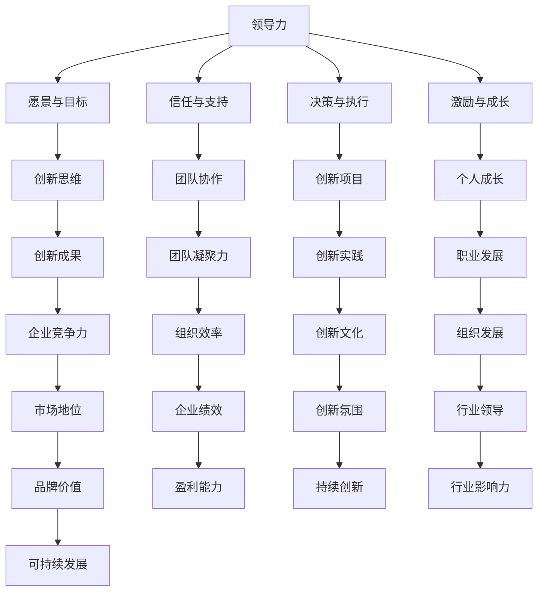
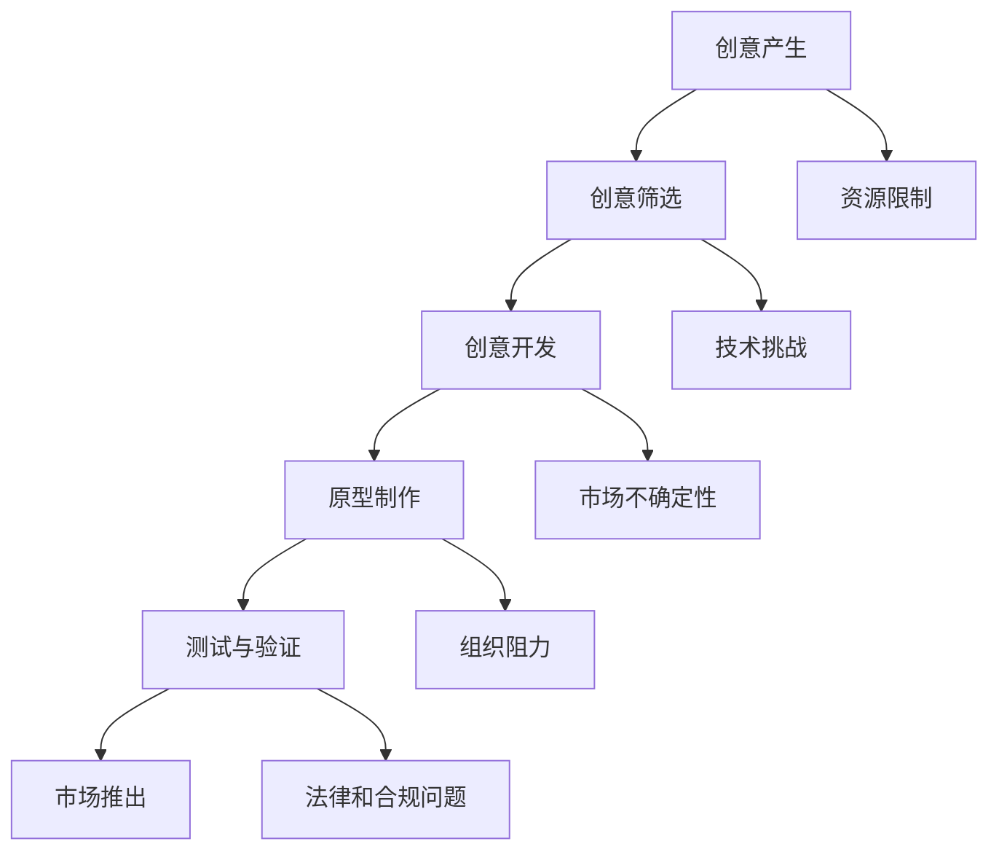
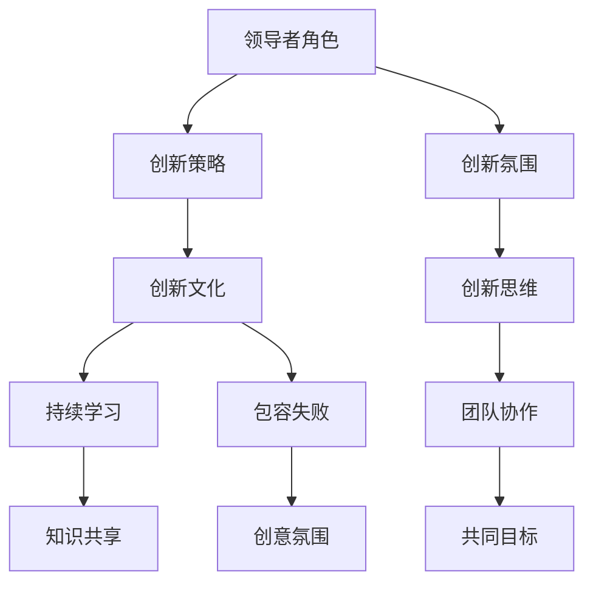
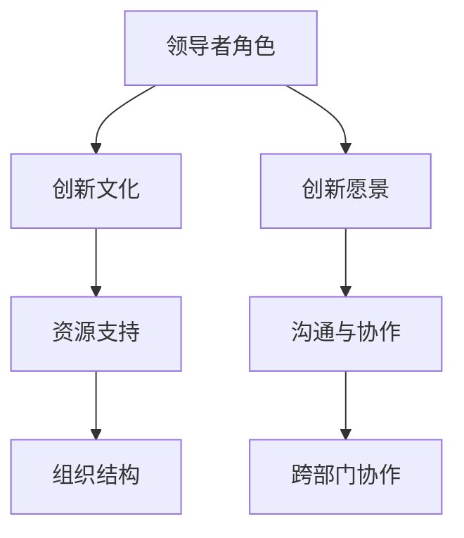
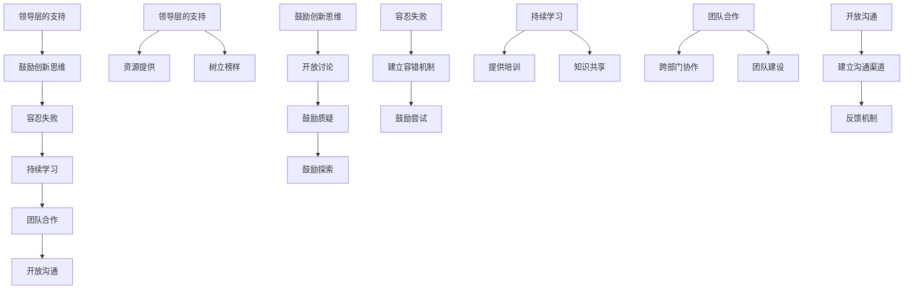
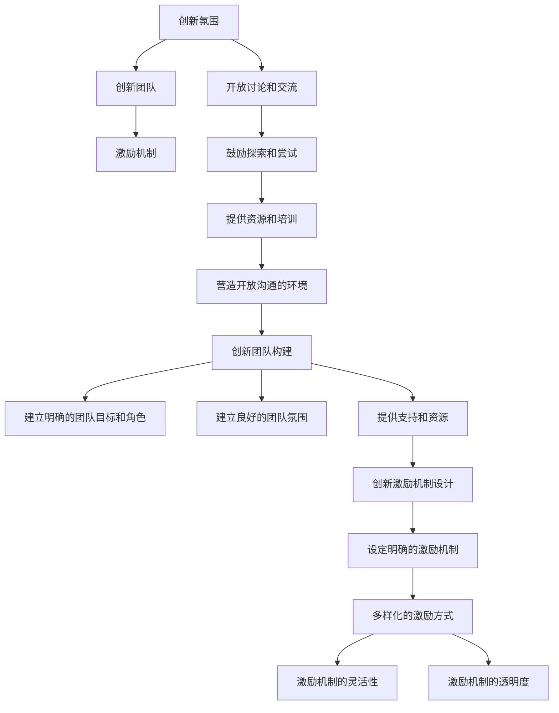

                 

### 文章标题

“领导力与创新：培养创新文化的策略” 是一本探讨如何通过领导力来促进创新、培养创新文化的专业书籍。作者结合了多年在领导力和创新领域的实践和研究，系统地阐述了领导力与创新的基本概念、实际应用和培养策略。

关键词：领导力、创新、企业文化、创新文化、策略

摘要：本文将从领导力与创新的基本概念出发，深入分析领导力与创新之间的互动关系，探讨领导力在创新过程中的角色与责任。接着，我们将介绍如何在企业和组织中应用领导力促进创新，并提供培养创新文化的具体策略和方法。通过本文的阅读，读者将能够理解创新文化的本质，掌握培养创新文化的方法，提升组织创新能力。

### 第一部分：领导力与创新的基本概念和理论

#### 第1章：领导力概述

**1.1 领导力的定义与核心要素**

领导力是一种影响他人以实现共同目标的能力。它不仅仅关乎个人的魅力和权力，更在于如何激发团队的潜力，引导团队朝着既定目标前进。领导力的核心要素包括以下几个方面：

- **愿景**：领导者需要具备清晰、具有吸引力的愿景，能够激励团队成员为之努力。

- **信任**：信任是领导力的重要基础。领导者需要通过行动和言行赢得团队成员的信任。

- **沟通**：有效的沟通是领导力的关键。领导者需要能够清晰、准确地传达信息，并倾听团队成员的意见和反馈。

- **决策**：领导者需要具备决策能力，能够在复杂和不确定的情况下做出明智的决策。

- **激励**：领导者需要能够激励团队成员，激发他们的积极性和创造力。

**1.2 领导力的类型与风格**

领导力可以分为多种类型和风格，每种类型和风格都有其适用的场景和特点。以下是几种常见的领导力类型和风格：

- **指令型领导力**：领导者通过明确的指示和指令来指导团队成员，适用于需要迅速执行任务的情景。

- **支持型领导力**：领导者关注团队成员的需求和情感，提供支持和鼓励，适用于需要建立团队凝聚力的情景。

- **变革型领导力**：领导者通过激发团队成员的潜能，推动组织进行变革和创新，适用于需要推动组织变革的情景。

- **教练型领导力**：领导者通过指导和辅导团队成员，帮助他们提升技能和实现个人目标，适用于需要培养团队成员的情景。

**1.3 领导力与创新的关系**

领导力与创新之间存在密切的互动关系。有效的领导力能够促进创新，而创新又能够进一步提升领导力。以下是领导力与创新之间的几个关键联系：

- **愿景与目标**：领导者通过明确的愿景和目标，引导团队朝着创新的方向前进。

- **信任与支持**：领导者通过建立信任和支持，激发团队成员的创新思维和创造力。

- **决策与执行**：领导者通过果断的决策和高效的执行，推动创新项目的落地。

- **激励与成长**：领导者通过激励和培养，帮助团队成员在创新过程中实现个人成长和职业发展。

#### Mermaid 流程图

以下是领导力与创新之间关系的 Mermaid 流程图：



#### 核心算法原理讲解

在创新过程中，领导力可以看作是一种算法，它通过一系列策略和手段来促进创新。以下是一个简单的伪代码，用于解释领导力促进创新的过程：

```python
def leadership_innovation():
    # 建立愿景和目标
    establish_vision_and_goals()

    # 建立信任和支持
    build_trust_and_support()

    # 制定决策和执行计划
    make_decisions_and_plan_execution()

    # 激励团队成员
    motivate_team_members()

    # 监测创新进展
    monitor_innovation_progress()

    # 评估创新成果
    evaluate_innovation_results()

    # 调整策略
    adjust_strategies_if_needed()

    # 持续改进
    continue_improvement()
```

#### 数学模型和公式

领导力促进创新的过程可以看作是一个动态的优化过程。以下是一个简单的数学模型，用于描述领导力促进创新的过程：

$$
\text{创新成果} = f(\text{领导力}, \text{团队协作}, \text{创新环境}, \text{资源投入})
$$

其中，$f$ 是一个复合函数，表示创新成果与领导力、团队协作、创新环境和资源投入之间的关系。

#### 项目实战

**案例背景**：某科技公司希望通过领导力促进创新，提升公司的竞争力。该公司领导者决定采用以下策略：

1. 建立明确的愿景和目标，引导团队朝着创新方向前进。
2. 建立信任和支持，激发团队成员的创新思维和创造力。
3. 制定决策和执行计划，确保创新项目的顺利进行。
4. 激励团队成员，提供成长机会和职业发展支持。
5. 监测创新进展，及时调整策略。

**实战过程**：

1. **建立愿景和目标**：公司领导者召开会议，明确公司的愿景和目标，并将这些目标传达给团队成员。通过这种方式，引导团队朝着创新方向前进。

2. **建立信任和支持**：公司领导者通过实际行动建立信任，如鼓励团队成员提出创新想法，对团队成员的创新尝试给予支持和鼓励。

3. **制定决策和执行计划**：公司领导者制定详细的决策和执行计划，确保创新项目的顺利进行。在项目执行过程中，领导者及时解决团队成员遇到的问题，提供必要的资源和支持。

4. **激励团队成员**：公司领导者通过奖励机制激励团队成员，如设立创新奖金、提供晋升机会等。同时，领导者关注团队成员的成长需求，提供培训和成长机会。

5. **监测创新进展**：公司领导者定期召开创新进展会议，了解项目的进展情况，及时调整策略。通过这种方式，确保创新项目的顺利进行。

**实战结果**：

通过以上策略，该公司在短时间内取得了显著的创新成果。团队成员的创新思维和创造力得到了极大的激发，公司的竞争力得到了显著提升。此外，通过领导力的促进，公司的创新氛围得到了极大的改善，为公司的长期发展奠定了坚实的基础。

#### 最佳实践 tips

1. **建立愿景和目标**：领导者需要具备清晰的愿景和目标，并将其传达给团队成员。这有助于引导团队朝着创新方向前进。

2. **建立信任和支持**：领导者需要通过实际行动建立信任，如鼓励团队成员提出创新想法，对团队成员的创新尝试给予支持和鼓励。

3. **制定决策和执行计划**：领导者需要制定详细的决策和执行计划，确保创新项目的顺利进行。在项目执行过程中，领导者需要及时解决团队成员遇到的问题，提供必要的资源和支持。

4. **激励团队成员**：领导者需要通过奖励机制激励团队成员，如设立创新奖金、提供晋升机会等。同时，领导者需要关注团队成员的成长需求，提供培训和成长机会。

5. **监测创新进展**：领导者需要定期召开创新进展会议，了解项目的进展情况，及时调整策略。通过这种方式，确保创新项目的顺利进行。

#### 小结

领导力在创新过程中起着至关重要的作用。通过建立愿景和目标、建立信任和支持、制定决策和执行计划、激励团队成员以及监测创新进展，领导者可以有效地促进创新，提升组织的竞争力。在培养创新文化的过程中，领导者需要不断学习和实践，不断提升自己的领导力水平。

### 附录A：创新文化相关工具与资源

**A.1 创新思维工具**

- **思维导图**：用于组织思维、梳理创新点，有助于提高创新效率。

- **SWOT分析**：用于分析创新项目的优势、劣势、机会和威胁，有助于制定创新策略。

- **头脑风暴**：用于集体创新，通过多人讨论，激发创新思维。

**A.2 创新管理工具**

- **创新管理平台**：用于管理创新项目，包括项目规划、任务分配、进度跟踪等。

- **创新数据库**：用于存储和检索创新点、创新案例等，有助于知识共享和借鉴。

- **创新激励系统**：用于奖励创新成果，激励团队成员的创新热情。

**A.3 创新文化研究文献与资料**

- **《创新者的窘境》**：克莱顿·克里斯滕森著，探讨企业在创新过程中的挑战和对策。

- **《创新者的基因》**：史蒂夫·布兰克著，分析成功创新者的思维模式和习惯。

- **《创新者的实践》**：唐·泰平著，提供创新实践的具体方法和策略。

- **《创新者的思考方式》**：布莱恩·弗莱恩著，探讨创新思维的培养和实践。

通过上述工具和资源，读者可以更好地理解和实践创新文化，提升组织的创新能力。

### 第2章：创新概述

#### 2.1 创新的定义与类型

创新是一种创造性的活动，旨在通过新思想、新方法、新技术或新产品的引入，提升组织的竞争力和适应能力。创新可以发生在各个领域，包括技术、管理、营销、服务等等。

**2.1.1 创新的定义**

创新可以定义为“创造或引入新的想法、方法或产品，以实现特定的目标或解决特定的问题”。创新不仅仅是技术创新，还包括管理创新、营销创新、服务创新等。

- **技术创新**：通过新技术或新方法的引入，提升产品和服务的性能和效率。

- **管理创新**：通过新的管理理念、管理模式或管理工具，提升组织的运营效率和竞争力。

- **营销创新**：通过新的营销策略、营销渠道或营销手段，提升产品和服务的市场竞争力。

- **服务创新**：通过新的服务理念、服务模式或服务方式，提升客户体验和服务质量。

**2.1.2 创新的类型**

创新可以根据其特点和目的分为多种类型：

- **渐进式创新**：通过逐步改进现有产品或服务，提高其性能和效率。

- **突破式创新**：通过引入全新的产品或服务，实现质的飞跃。

- **颠覆式创新**：通过颠覆现有市场格局，创造新的市场机会。

- **适应性创新**：通过适应外部环境的变化，保持组织的持续竞争力。

- **整合式创新**：通过整合不同领域的知识、技术或资源，实现创新的突破。

#### 2.1.3 创新的过程与障碍

创新是一个复杂的过程，通常包括以下几个阶段：

1. **创意产生**：这是创新过程的第一步，目标是产生新的想法或解决方案。创意可以来自个人、团队或外部环境。

2. **创意筛选**：在产生大量创意后，需要对创意进行筛选，选择具有可行性和潜力的创意进行进一步开发。

3. **创意开发**：这是对选定的创意进行深入研究和开发，以确定其可行性和商业价值。

4. **原型制作**：在创意开发阶段，需要制作原型或样品，以验证创意的可行性和性能。

5. **测试与验证**：在原型制作完成后，需要对原型进行测试和验证，确保其满足预期要求。

6. **市场推出**：在测试和验证成功后，将创新产品或服务推向市场，满足客户需求。

在创新过程中，可能会遇到各种障碍，这些障碍包括：

- **资源限制**：创新需要大量的资源，包括资金、人力和时间。资源限制可能会阻碍创新的实施。

- **技术挑战**：某些创新可能涉及到复杂的技术问题，解决这些问题可能需要大量的时间和努力。

- **市场不确定性**：创新产品或服务的市场前景可能存在不确定性，这可能会影响创新的决策和实施。

- **组织阻力**：组织内部可能存在对创新的抵触情绪，如担心改变现状、恐惧失败等。

- **法律和合规问题**：创新产品或服务可能需要遵守各种法律和规定，这可能增加创新的成本和难度。

#### 核心概念与联系

创新的过程可以看作是一个复杂的系统，各个环节之间存在密切的联系。以下是创新过程的核心概念及其联系：



#### 核心算法原理讲解

创新过程可以看作是一个动态的优化过程，通过一系列决策和行动来实现创新目标。以下是一个简单的伪代码，用于解释创新过程：

```python
def innovation_process():
    # 创意产生
    generate_ideas()

    # 创意筛选
    filter_ideas()

    # 创意开发
    develop_ideas()

    # 原型制作
    create_prototypes()

    # 测试与验证
    test_and_validate()

    # 市场推出
    launch_market()
```

#### 数学模型和公式

创新过程可以看作是一个概率模型，每个阶段都有一定的成功概率。以下是创新的数学模型：

$$
\text{创新成功概率} = P(\text{成功}) = P(\text{创意产生}) \times P(\text{创意筛选}) \times P(\text{创意开发}) \times P(\text{原型制作}) \times P(\text{测试与验证}) \times P(\text{市场推出})
$$

其中，$P(\text{成功})$ 表示创新成功的概率，$P(\text{创意产生})$、$P(\text{创意筛选})$、$P(\text{创意开发})$、$P(\text{原型制作})$、$P(\text{测试与验证})$、$P(\text{市场推出})$ 分别表示各个阶段的成功概率。

#### 项目实战

**案例背景**：某科技公司希望通过创新提升公司的竞争力，决定开发一款新型智能设备。该公司领导者决定采用以下策略：

1. **创意产生**：通过头脑风暴和开放讨论，收集团队成员的创新想法。

2. **创意筛选**：对收集到的创新想法进行筛选，选择具有可行性和商业价值的想法进行开发。

3. **创意开发**：对选定的创新想法进行深入研究，确定其技术可行性和市场前景。

4. **原型制作**：制作原型，测试其性能和功能，收集用户反馈。

5. **测试与验证**：对原型进行测试和验证，确保其满足预期要求。

6. **市场推出**：在测试和验证成功后，将新型智能设备推向市场。

**实战过程**：

1. **创意产生**：公司领导者组织了一次头脑风暴会议，邀请各个部门的主管和专家参与。在会议中，大家积极发言，提出了多个创新想法。

2. **创意筛选**：公司领导者对提出的创新想法进行了筛选，选择了其中具有可行性和商业价值的两个想法进行开发。

3. **创意开发**：公司技术团队对选定的创新想法进行了深入研究，确定了其技术可行性和市场前景。同时，公司市场团队对市场进行了调研，了解了用户的需求和竞争对手的情况。

4. **原型制作**：公司技术团队根据研究的结果，制作了两个原型的智能设备。原型机经过多次测试和改进，最终满足了预期要求。

5. **测试与验证**：公司邀请了一批用户对原型机进行了测试和反馈。根据用户的反馈，公司对原型机进行了进一步的改进，确保其性能和功能达到最佳状态。

6. **市场推出**：在测试和验证成功后，公司决定将新型智能设备推向市场。通过有效的营销策略和渠道推广，新型智能设备得到了用户的广泛认可。

**实战结果**：

通过以上的创新过程，该公司成功地开发出了一款新型智能设备，并在市场上取得了良好的反响。这款设备的推出，不仅提升了公司的竞争力，也为公司带来了显著的商业价值。

#### 最佳实践 tips

1. **鼓励创意产生**：通过头脑风暴、开放讨论等方式，激发团队成员的创新思维，收集更多的创新想法。

2. **重视创意筛选**：在创意产生后，对创意进行严格的筛选，选择具有可行性和商业价值的想法进行开发。

3. **深入创意开发**：在创意开发阶段，对创意进行深入研究和开发，确保其技术可行性和市场前景。

4. **原型制作与测试**：制作原型并进行测试，收集用户反馈，根据反馈进行改进。

5. **市场推出策略**：在市场推出阶段，制定有效的营销策略和渠道推广计划，确保创新产品或服务的成功上市。

#### 小结

创新是提升组织竞争力的重要手段。通过理解创新的定义和类型，了解创新的过程和障碍，以及掌握创新的最佳实践，组织可以有效地推动创新，实现持续发展。

### 第3章：领导力与创新在企业中的应用

**3.1 创新型企业的特点与优势**

创新型企业在当今竞争激烈的市场中具有独特的优势。这些企业的特点包括：

- **快速响应市场变化**：创新型企业的领导者能够敏锐地捕捉市场变化，快速调整战略和业务模式，以适应市场需求。

- **持续创新**：创新型企业的领导者鼓励员工持续创新，不断探索新的技术、产品或服务，以保持竞争优势。

- **灵活的组织结构**：创新型企业的领导者采用灵活的组织结构，减少层级，提高决策效率，以便更快地响应市场变化。

- **注重员工参与**：创新型企业的领导者鼓励员工参与决策和创新过程，激发员工的创造力和主动性。

**3.1.1 创新型企业的特点与优势**

创新型企业的特点与优势可以从以下几个方面来具体分析：

1. **快速响应市场变化**：

   - **市场敏感性**：创新型企业的领导者具备高度的市场敏感性，能够快速识别市场趋势和变化。
   - **敏捷性**：创新型企业的组织结构相对扁平，决策链条短，能够快速响应市场变化，调整战略和业务模式。
   - **创新机制**：创新型企业的领导者通过建立创新机制，鼓励员工提出新的创意和解决方案，以快速响应市场变化。

2. **持续创新**：

   - **技术驱动力**：创新型企业的领导者注重技术创新，不断探索新的技术方向，以保持技术领先优势。
   - **产品创新**：创新型企业的领导者鼓励员工持续进行产品创新，推出具有竞争力的新产品，满足市场需求。
   - **业务模式创新**：创新型企业的领导者通过创新业务模式，优化资源配置，提升企业的运营效率和盈利能力。

3. **灵活的组织结构**：

   - **扁平化**：创新型企业的组织结构相对扁平，减少中间管理层级，提高决策效率。
   - **模块化**：创新型企业的领导者采用模块化组织结构，将业务模块化，便于快速调整和优化。
   - **跨界合作**：创新型企业的领导者鼓励跨界合作，通过整合不同领域的资源和优势，实现创新突破。

4. **注重员工参与**：

   - **员工激励**：创新型企业的领导者通过激励机制，鼓励员工参与决策和创新过程，提升员工的积极性和创造力。
   - **培训与发展**：创新型企业的领导者重视员工的培训和发展，提供成长机会，帮助员工提升技能和素质。
   - **开放沟通**：创新型企业的领导者倡导开放沟通，建立良好的沟通渠道，鼓励员工表达意见和反馈。

**3.1.2 领导者在企业创新中的角色与责任**

领导者在企业创新中扮演着关键角色，其责任包括以下几个方面：

1. **设定愿景和目标**：

   - **明确愿景**：领导者需要设定明确的创新愿景，为企业的创新活动提供方向和目标。
   - **激励员工**：领导者通过传递愿景和目标，激励员工为实现创新目标而努力。

2. **创造创新氛围**：

   - **鼓励探索**：领导者鼓励员工勇于探索新的领域和解决方案，营造鼓励创新的企业文化。
   - **包容失败**：领导者要建立包容失败的文化，鼓励员工在创新过程中不怕失败，敢于尝试。

3. **提供资源和支持**：

   - **资金投入**：领导者需要为创新项目提供必要的资金支持，确保创新活动的顺利进行。
   - **技术支持**：领导者要确保企业拥有足够的技术支持和研发能力，以支持创新项目。

4. **决策与协调**：

   - **制定策略**：领导者需要制定创新策略，明确创新的方向和路径。
   - **协调资源**：领导者要协调企业内部资源，确保创新项目得到充分的支持。

5. **评估与反馈**：

   - **评估效果**：领导者需要定期评估创新项目的效果，确保创新目标的实现。
   - **反馈与改进**：领导者要根据评估结果，提供反馈和建议，推动创新项目的持续改进。

**3.1.3 企业创新策略与实践**

企业创新策略可以分为以下几个方面：

1. **开放创新**：

   - **合作与共享**：企业可以通过与外部合作伙伴建立合作关系，共同开展创新项目，共享资源和成果。
   - **开放平台**：企业可以建立开放的创新平台，吸引外部创新资源，促进创新成果的共享和转化。

2. **内部创业**：

   - **创业团队**：企业可以成立创业团队，赋予其较大的自主权和资源支持，鼓励员工发挥创造力。
   - **孵化器**：企业可以建立内部孵化器，为创业团队提供孵化环境，支持其创新项目的发展。

3. **精益创业**：

   - **快速迭代**：企业可以通过快速迭代的方法，不断优化和改进创新项目，提高成功率。
   - **用户反馈**：企业要重视用户反馈，根据用户需求调整创新项目，确保满足市场需求。

4. **跨部门合作**：

   - **团队协作**：企业要建立跨部门协作机制，促进不同部门之间的沟通和合作，共同推动创新项目的实施。
   - **知识共享**：企业要建立知识共享平台，促进员工之间的知识交流和共享，提升整体创新能力。

**3.1.4 创新文化在企业中的应用**

创新文化是企业创新的重要基础，其应用体现在以下几个方面：

1. **鼓励创新思维**：

   - **创意氛围**：企业要营造鼓励创新思维的氛围，鼓励员工提出新的想法和解决方案。
   - **开放讨论**：企业要鼓励员工参与开放讨论，分享创新经验和见解。

2. **包容失败**：

   - **容错机制**：企业要建立容错机制，允许员工在创新过程中犯错误，并从中学习。
   - **鼓励尝试**：企业要鼓励员工勇于尝试新事物，不怕失败。

3. **持续学习**：

   - **培训与发展**：企业要提供培训和发展机会，帮助员工提升技能和知识。
   - **知识分享**：企业要建立知识分享平台，促进员工之间的知识交流和共享。

4. **团队合作**：

   - **协作机制**：企业要建立有效的协作机制，促进团队之间的沟通和合作。
   - **共同目标**：企业要确保团队成员有共同的目标，激发团队合作精神。

#### 核心概念与联系

在企业创新中，领导者的角色、创新策略和创新文化之间存在密切的联系。以下是这些核心概念之间的 Mermaid 流程图：



#### 核心算法原理讲解

企业创新可以看作是一个复杂的多层次系统，涉及领导者的角色、创新策略和创新文化等多个方面。以下是一个简化的伪代码，用于描述企业创新的过程：

```python
def enterprise_innovation():
    # 设定愿景和目标
    set_vision_and_goals()

    # 创造创新氛围
    create_innovation_atmosphere()

    # 制定创新策略
    set_innovation_strategies()

    # 建立创新文化
    build_innovation_culture()

    # 领导者角色
    leader_role()

    # 创新思维
    innovation_thinking()

    # 团队协作
    team_coorperation()

    # 持续学习
    continuous_learning()

    # 包容失败
    tolerate_failure()

    # 知识共享
    knowledge_sharing()

    # 共同目标
    common_goals()
```

#### 数学模型和公式

企业创新的过程可以看作是一个动态优化问题，其目标是在各种约束条件下实现创新的最大化。以下是企业创新的数学模型：

$$
\text{创新效果} = f(\text{领导者角色}, \text{创新策略}, \text{创新文化}, \text{创新氛围}, \text{团队协作}, \text{持续学习}, \text{包容失败}, \text{知识共享}, \text{共同目标})
$$

其中，$f$ 是一个复杂的函数，表示各个因素对创新效果的综合影响。

#### 项目实战

**案例背景**：某科技公司是一家创新型高科技企业，其领导者希望通过有效的领导力推动公司创新，提升企业的竞争力。公司领导者决定采用以下策略：

1. **设定愿景和目标**：公司领导者明确公司的愿景和目标，即成为行业领先的创新企业。

2. **创造创新氛围**：公司领导者通过开放讨论、鼓励创意等方式，营造鼓励创新的企业文化。

3. **制定创新策略**：公司领导者制定了一系列创新策略，包括开放创新、内部创业、精益创业等。

4. **建立创新文化**：公司领导者注重建立包容失败、持续学习、知识共享的创新文化。

5. **领导者角色**：公司领导者积极参与创新过程，提供资源和支持，激励员工创新。

6. **创新思维**：公司领导者鼓励员工勇于探索、创新，提升员工的创新思维能力。

7. **团队协作**：公司领导者建立跨部门协作机制，促进团队之间的沟通和合作。

8. **持续学习**：公司领导者提供培训和发展机会，帮助员工提升技能和知识。

9. **包容失败**：公司领导者建立容错机制，允许员工在创新过程中犯错误，并从中学习。

10. **知识共享**：公司领导者建立知识共享平台，促进员工之间的知识交流和共享。

**实战过程**：

1. **设定愿景和目标**：公司领导者组织了一次全体员工大会，明确公司的愿景和目标，并将这些目标传达给每一位员工。

2. **创造创新氛围**：公司领导者通过定期举办创新沙龙、创意竞赛等活动，鼓励员工提出新的创意和解决方案。

3. **制定创新策略**：公司领导者制定了开放创新、内部创业、精益创业等创新策略，并成立了专门的创新部门，负责实施和推动创新项目。

4. **建立创新文化**：公司领导者倡导包容失败、持续学习、知识共享的创新文化，通过建立容错机制、提供培训和发展机会等方式，营造良好的创新氛围。

5. **领导者角色**：公司领导者积极参与创新过程，亲自参与创新项目的讨论和决策，为员工提供资源和支持。

6. **创新思维**：公司领导者通过举办创新讲座、邀请专家授课等方式，提升员工的创新思维能力。

7. **团队协作**：公司领导者建立跨部门协作机制，促进不同部门之间的沟通和合作，共同推动创新项目的实施。

8. **持续学习**：公司领导者提供多种培训和发展机会，包括在线课程、外部培训等，帮助员工提升技能和知识。

9. **包容失败**：公司领导者建立容错机制，允许员工在创新过程中犯错误，并从中学习。

10. **知识共享**：公司领导者建立知识共享平台，鼓励员工分享创新经验和见解，促进知识交流。

**实战结果**：

通过以上的创新策略和实践，该公司在短时间内取得了显著的创新成果。公司的产品和技术不断更新迭代，市场竞争力得到了显著提升。公司内部创新氛围浓厚，员工的创新热情高涨，公司的整体创新能力得到了大幅提升。

#### 最佳实践 tips

1. **设定清晰的愿景和目标**：领导者要明确公司的愿景和目标，将其传达给每一位员工，统一员工的思想和行为。

2. **创造良好的创新氛围**：领导者要营造鼓励创新的企业文化，通过开放讨论、创意竞赛等方式，激发员工的创新思维。

3. **制定有效的创新策略**：领导者要根据企业的实际情况，制定适合的创新策略，包括开放创新、内部创业、精益创业等。

4. **建立包容失败的创新文化**：领导者要建立容错机制，鼓励员工在创新过程中敢于尝试、不怕失败。

5. **提供持续学习的机会**：领导者要为员工提供多种培训和发展机会，帮助员工提升技能和知识，提升创新能力。

6. **促进团队协作**：领导者要建立跨部门协作机制，促进团队之间的沟通和合作，共同推动创新项目的实施。

#### 小结

领导力在企业创新中起着至关重要的作用。通过设定愿景和目标、创造创新氛围、制定创新策略、建立创新文化、发挥领导者的角色等多种方式，领导者可以有效地推动企业创新，提升企业的竞争力和创新能力。在实践过程中，领导者需要不断学习和实践，不断提升自己的领导力水平，以应对快速变化的市场环境。

### 第4章：领导力与创新在组织中的应用

#### 4.1 组织创新的基本理论

组织创新是指通过引入新的思想、方法、技术或流程，提升组织的效率、竞争力和适应能力。组织创新的基本理论主要包括以下几个方面：

**4.1.1 组织创新的动机**

组织创新的动机可以归纳为以下几点：

- **适应外部环境**：随着市场环境的不断变化，组织需要通过创新来适应外部环境，保持竞争优势。

- **提升内部效率**：通过创新，组织可以优化内部流程，提高运营效率，降低成本。

- **满足客户需求**：创新可以帮助组织更好地理解客户需求，提供更符合客户期望的产品和服务。

- **促进员工发展**：创新可以激发员工的创造力和主动性，提升员工的职业满足感。

**4.1.2 组织创新的类型**

组织创新可以分为以下几种类型：

- **产品创新**：通过引入新的产品或改进现有产品，满足市场需求。

- **流程创新**：通过改进组织内部流程，提高效率和质量。

- **管理创新**：通过引入新的管理理念和方法，优化组织管理和运营。

- **市场创新**：通过开拓新的市场或创造新的商业模式，实现业务的增长。

- **文化创新**：通过改变组织文化，营造鼓励创新和包容失败的氛围。

**4.1.3 组织创新的障碍**

在组织创新过程中，可能会遇到以下障碍：

- **资源限制**：创新需要投入大量的人力、物力和财力，资源限制可能会阻碍创新的实施。

- **组织惯性**：组织惯性使得组织难以接受和适应新的变革，影响创新的推进。

- **沟通障碍**：组织内部沟通不畅，可能会导致创新想法无法有效传达和实施。

- **风险规避**：组织和个人可能因害怕失败而规避创新，影响创新的积极性。

- **利益冲突**：创新可能会影响到某些人的利益，导致内部阻力。

#### 4.1.4 领导者在组织创新中的策略与技巧

领导者在组织创新中扮演着关键角色，其策略和技巧如下：

1. **建立明确的创新愿景**：

   - **明确目标**：领导者需要明确组织创新的愿景和目标，将其传达给全体员工。

   - **激励员工**：通过设立创新目标和奖励机制，激励员工参与创新活动。

2. **创建创新文化**：

   - **鼓励创新**：领导者要鼓励员工提出创新想法，营造鼓励创新的企业文化。

   - **包容失败**：领导者要建立包容失败的文化，鼓励员工在创新过程中敢于尝试、不怕失败。

3. **提供资源和支持**：

   - **资金投入**：领导者要确保为创新项目提供足够的资金支持。

   - **技术支持**：领导者要确保组织拥有足够的技术支持，以支持创新项目。

4. **优化组织结构**：

   - **减少层级**：领导者要减少组织层级，提高决策效率，以便更快地响应市场变化。

   - **模块化**：领导者要采用模块化组织结构，便于创新项目的快速调整和优化。

5. **促进沟通与协作**：

   - **建立沟通渠道**：领导者要建立有效的沟通渠道，确保创新想法和反馈能够有效传达。

   - **跨部门协作**：领导者要促进跨部门协作，共同推动创新项目的实施。

6. **培养创新人才**：

   - **培训与发展**：领导者要为员工提供培训和发展机会，提升员工的创新能力和技能。

   - **人才激励**：领导者要通过激励机制，吸引和留住具有创新能力和潜力的人才。

#### 核心概念与联系

在组织创新中，领导者的角色、创新文化、资源支持和组织结构之间存在密切的联系。以下是这些核心概念之间的 Mermaid 流程图：



#### 核心算法原理讲解

组织创新可以看作是一个复杂的多层次系统，涉及领导者的角色、创新文化、资源支持和组织结构等多个方面。以下是一个简化的伪代码，用于描述组织创新的过程：

```python
def organizational_innovation():
    # 建立创新愿景
    create_innovation_vision()

    # 创建创新文化
    build_innovation_culture()

    # 提供资源支持
    provide_resource_support()

    # 优化组织结构
    optimize_organizational_structure()

    # 促进沟通与协作
    promote_communication_and_coorperation()

    # 培养创新人才
    cultivate_innovation_talent()

    # 实施创新项目
    implement_innovation_projects()

    # 评估创新效果
    evaluate_innovation_effects()
```

#### 数学模型和公式

组织创新的过程可以看作是一个动态优化问题，其目标是在各种约束条件下实现创新的最大化。以下是组织创新的数学模型：

$$
\text{创新效果} = f(\text{领导者角色}, \text{创新文化}, \text{资源支持}, \text{组织结构}, \text{沟通与协作}, \text{创新人才})
$$

其中，$f$ 是一个复杂的函数，表示各个因素对创新效果的综合影响。

#### 项目实战

**案例背景**：某大型制造企业希望通过组织创新提升企业的竞争力和运营效率。公司领导者决定采用以下策略：

1. **建立创新愿景**：公司领导者明确公司的愿景，即成为行业领先的创新企业。

2. **创建创新文化**：公司领导者通过举办创新沙龙、创意竞赛等活动，鼓励员工提出创新想法，营造鼓励创新的企业文化。

3. **提供资源支持**：公司领导者确保为创新项目提供足够的资金支持，并建立创新实验室，为员工提供技术支持。

4. **优化组织结构**：公司领导者减少组织层级，提高决策效率，并采用模块化组织结构，便于创新项目的快速调整和优化。

5. **促进沟通与协作**：公司领导者建立跨部门协作机制，促进不同部门之间的沟通和合作，共同推动创新项目的实施。

6. **培养创新人才**：公司领导者为员工提供培训和发展机会，提升员工的创新能力和技能。

**实战过程**：

1. **建立创新愿景**：公司领导者组织了一次全体员工大会，明确公司的愿景，并将这些目标传达给每一位员工。

2. **创建创新文化**：公司领导者定期举办创新沙龙和创意竞赛，鼓励员工提出创新想法。公司内部建立了创新委员会，负责收集和评审员工的创新项目。

3. **提供资源支持**：公司领导者确保为创新项目提供足够的资金支持，并建立创新实验室，为员工提供技术支持。公司还与高校和研究机构合作，共同开展创新项目。

4. **优化组织结构**：公司领导者减少组织层级，提高决策效率。公司采用模块化组织结构，将业务模块化，便于快速调整和优化。公司内部建立了跨部门协作机制，促进不同部门之间的沟通和合作。

5. **促进沟通与协作**：公司领导者建立跨部门协作机制，定期召开创新项目进展会议，促进不同部门之间的沟通和合作。公司还建立了内部创新交流平台，鼓励员工分享创新经验和见解。

6. **培养创新人才**：公司领导者为员工提供多种培训和发展机会，包括内部培训、外部培训和在线课程等。公司还设立创新奖金，激励员工参与创新活动。

**实战结果**：

通过以上的创新策略和实践，该公司在短时间内取得了显著的创新成果。公司的产品和技术不断更新迭代，市场竞争力得到了显著提升。公司内部创新氛围浓厚，员工的创新热情高涨，公司的整体创新能力得到了大幅提升。

#### 最佳实践 tips

1. **建立明确的创新愿景**：领导者要明确公司的愿景和目标，将其传达给每一位员工，统一员工的思想和行为。

2. **创建鼓励创新的文化**：领导者要鼓励员工提出创新想法，营造鼓励创新的企业文化，建立包容失败的创新环境。

3. **提供充足的资源支持**：领导者要确保为创新项目提供足够的资金支持和技术支持，建立创新实验室，为员工提供便利。

4. **优化组织结构**：领导者要减少组织层级，提高决策效率，采用模块化组织结构，便于创新项目的快速调整和优化。

5. **促进沟通与协作**：领导者要建立跨部门协作机制，促进不同部门之间的沟通和合作，共同推动创新项目的实施。

6. **培养创新人才**：领导者要为员工提供培训和发展机会，提升员工的创新能力和技能，设立创新奖金，激励员工参与创新活动。

#### 小结

领导力在组织创新中起着至关重要的作用。通过建立明确的创新愿景、创建鼓励创新的文化、提供充足的资源支持、优化组织结构、促进沟通与协作以及培养创新人才，领导者可以有效地推动组织创新，提升组织的竞争力和创新能力。在实践过程中，领导者需要不断学习和实践，不断提升自己的领导力水平，以应对快速变化的市场环境。

### 第5章：培养创新文化的理念

#### 5.1 创新文化的定义与重要性

创新文化是一种鼓励创新、容忍失败、持续学习的组织氛围和价值观。它不仅仅是一种文化，更是一种制度和行为规范，旨在激发员工的创造力和创新精神，提升组织的整体创新能力。

**5.1.1 创新文化的定义**

创新文化可以定义为“一种鼓励创新、容忍失败、持续学习的组织氛围和价值观”。它包括以下几个方面：

- **鼓励创新**：组织鼓励员工提出新的想法和解决方案，不断创新。

- **容忍失败**：组织对失败持包容态度，认为失败是成功的前提，鼓励员工在创新过程中不怕失败，勇于尝试。

- **持续学习**：组织鼓励员工不断学习新知识、新技能，提升个人和组织的创新能力。

- **团队合作**：组织倡导团队合作，鼓励员工跨部门、跨领域合作，共同推动创新项目。

- **开放沟通**：组织建立开放沟通的渠道，鼓励员工表达意见和建议，确保创新想法能够得到及时反馈和实施。

**5.1.2 创新文化的重要性**

创新文化在组织发展中具有重要作用，其重要性体现在以下几个方面：

- **激发创造力**：创新文化鼓励员工敢于尝试、勇于创新，激发员工的创造力。

- **提升创新能力**：创新文化通过鼓励员工持续学习、不断探索，提升组织的整体创新能力。

- **增强竞争力**：拥有创新文化的组织能够更快地适应市场变化，提升市场竞争力。

- **促进成长**：创新文化为员工提供成长空间，帮助员工提升技能和知识，实现个人和职业发展。

- **建立品牌形象**：创新文化有助于组织建立积极、进取的品牌形象，提升组织的社会影响力。

#### 5.1.3 培养创新文化的核心要素

要培养创新文化，需要关注以下几个核心要素：

1. **领导层的支持**：

   - **明确愿景**：领导层需要明确创新文化的愿景，将其传达给全体员工。

   - **提供资源**：领导层要为创新项目提供足够的资源支持，确保创新活动顺利进行。

   - **树立榜样**：领导层要通过自己的行为树立榜样，鼓励员工创新。

2. **鼓励创新思维**：

   - **开放讨论**：组织鼓励员工开放讨论，分享创新想法和见解。

   - **鼓励质疑**：组织鼓励员工对现有问题和做法提出质疑，寻找改进和创新的机会。

   - **鼓励探索**：组织鼓励员工勇于探索，尝试新的方法和思路。

3. **容忍失败**：

   - **建立容错机制**：组织要建立容错机制，允许员工在创新过程中犯错误，并从中学习。

   - **鼓励尝试**：组织要鼓励员工勇于尝试，不怕失败，敢于面对挑战。

4. **持续学习**：

   - **提供培训**：组织要为员工提供培训和发展机会，提升员工的知识和技能。

   - **知识共享**：组织要建立知识共享平台，促进员工之间的知识交流。

5. **团队合作**：

   - **跨部门协作**：组织要促进跨部门协作，鼓励员工跨领域合作，共同推动创新项目。

   - **团队建设**：组织要定期组织团队建设活动，增强团队凝聚力。

6. **开放沟通**：

   - **建立沟通渠道**：组织要建立有效的沟通渠道，确保创新想法和反馈能够得到及时传达。

   - **反馈机制**：组织要建立反馈机制，鼓励员工提出意见和建议，确保创新项目的顺利进行。

#### 核心概念与联系

培养创新文化的核心要素之间存在密切的联系，以下是这些核心概念之间的 Mermaid 流程图：



#### 核心算法原理讲解

培养创新文化可以看作是一个多阶段的优化过程，涉及领导层的支持、鼓励创新思维、容忍失败、持续学习、团队合作和开放沟通等多个方面。以下是一个简化的伪代码，用于描述培养创新文化的过程：

```python
def cultivate_innovation_culture():
    # 领导层的支持
    leadership_support()

    # 鼓励创新思维
    encourage_innovation_thinking()

    # 容忍失败
    tolerate_failure()

    # 持续学习
    continuous_learning()

    # 团队合作
    team_work()

    # 开放沟通
    open_communication()

    # 评估与改进
    evaluate_and_improve()
```

#### 数学模型和公式

培养创新文化的过程可以看作是一个复杂的动态系统，其效果可以通过以下数学模型进行评估：

$$
\text{创新文化效果} = f(\text{领导层的支持}, \text{鼓励创新思维}, \text{容忍失败}, \text{持续学习}, \text{团队合作}, \text{开放沟通})
$$

其中，$f$ 是一个复杂的函数，表示各个因素对创新文化效果的综合影响。

#### 项目实战

**案例背景**：某高科技公司希望通过培养创新文化提升企业的整体创新能力。公司领导者决定采用以下策略：

1. **领导层的支持**：

   - **明确愿景**：公司领导者明确公司的愿景，即成为行业领先的创新企业，并将其传达给全体员工。

   - **提供资源**：公司领导者确保为创新项目提供足够的资金支持，并建立创新实验室，为员工提供技术支持。

2. **鼓励创新思维**：

   - **开放讨论**：公司领导者定期组织创新沙龙和头脑风暴会议，鼓励员工开放讨论，分享创新想法。

   - **鼓励质疑**：公司领导者鼓励员工对现有问题和做法提出质疑，寻找改进和创新的机会。

   - **鼓励探索**：公司领导者鼓励员工勇于探索，尝试新的方法和思路。

3. **容忍失败**：

   - **建立容错机制**：公司领导者建立容错机制，允许员工在创新过程中犯错误，并从中学习。

   - **鼓励尝试**：公司领导者鼓励员工勇于尝试，不怕失败，敢于面对挑战。

4. **持续学习**：

   - **提供培训**：公司领导者为员工提供多种培训和发展机会，包括内部培训、外部培训和在线课程等。

   - **知识共享**：公司领导者建立知识共享平台，促进员工之间的知识交流。

5. **团队合作**：

   - **跨部门协作**：公司领导者促进跨部门协作，鼓励员工跨领域合作，共同推动创新项目。

   - **团队建设**：公司领导者定期组织团队建设活动，增强团队凝聚力。

6. **开放沟通**：

   - **建立沟通渠道**：公司领导者建立内部沟通平台，确保创新想法和反馈能够得到及时传达。

   - **反馈机制**：公司领导者建立反馈机制，鼓励员工提出意见和建议，确保创新项目的顺利进行。

**实战过程**：

1. **领导层的支持**：

   - **明确愿景**：公司领导者组织了一次全体员工大会，明确公司的愿景，并将其传达给每一位员工。

   - **提供资源**：公司领导者确保为创新项目提供足够的资金支持，并建立创新实验室，为员工提供技术支持。

2. **鼓励创新思维**：

   - **开放讨论**：公司领导者定期组织创新沙龙和头脑风暴会议，鼓励员工开放讨论，分享创新想法。

   - **鼓励质疑**：公司领导者鼓励员工对现有问题和做法提出质疑，寻找改进和创新的机会。

   - **鼓励探索**：公司领导者鼓励员工勇于探索，尝试新的方法和思路。

3. **容忍失败**：

   - **建立容错机制**：公司领导者建立容错机制，允许员工在创新过程中犯错误，并从中学习。

   - **鼓励尝试**：公司领导者鼓励员工勇于尝试，不怕失败，敢于面对挑战。

4. **持续学习**：

   - **提供培训**：公司领导者为员工提供多种培训和发展机会，包括内部培训、外部培训和在线课程等。

   - **知识共享**：公司领导者建立知识共享平台，促进员工之间的知识交流。

5. **团队合作**：

   - **跨部门协作**：公司领导者促进跨部门协作，鼓励员工跨领域合作，共同推动创新项目。

   - **团队建设**：公司领导者定期组织团队建设活动，增强团队凝聚力。

6. **开放沟通**：

   - **建立沟通渠道**：公司领导者建立内部沟通平台，确保创新想法和反馈能够得到及时传达。

   - **反馈机制**：公司领导者建立反馈机制，鼓励员工提出意见和建议，确保创新项目的顺利进行。

**实战结果**：

通过以上的培养创新文化的策略和实践，该公司在短时间内取得了显著的成果。公司的创新能力得到了大幅提升，员工们勇于创新、敢于探索的氛围日益浓厚。公司的产品和技术不断更新迭代，市场竞争力得到了显著提升。公司的创新文化得到了广泛认可，成为行业中的佼佼者。

#### 最佳实践 tips

1. **领导层的支持**：

   - **明确愿景**：领导层要明确创新文化的愿景，并将其传达给全体员工。

   - **提供资源**：领导层要为创新项目提供足够的资金支持和技术支持。

2. **鼓励创新思维**：

   - **开放讨论**：组织要鼓励员工开放讨论，分享创新想法和见解。

   - **鼓励质疑**：组织要鼓励员工对现有问题和做法提出质疑，寻找改进和创新的机会。

   - **鼓励探索**：组织要鼓励员工勇于探索，尝试新的方法和思路。

3. **容忍失败**：

   - **建立容错机制**：组织要建立容错机制，允许员工在创新过程中犯错误，并从中学习。

   - **鼓励尝试**：组织要鼓励员工勇于尝试，不怕失败，敢于面对挑战。

4. **持续学习**：

   - **提供培训**：组织要为员工提供培训和发展机会，提升员工的知识和技能。

   - **知识共享**：组织要建立知识共享平台，促进员工之间的知识交流。

5. **团队合作**：

   - **跨部门协作**：组织要促进跨部门协作，鼓励员工跨领域合作，共同推动创新项目。

   - **团队建设**：组织要定期组织团队建设活动，增强团队凝聚力。

6. **开放沟通**：

   - **建立沟通渠道**：组织要建立有效的沟通渠道，确保创新想法和反馈能够得到及时传达。

   - **反馈机制**：组织要建立反馈机制，鼓励员工提出意见和建议，确保创新项目的顺利进行。

#### 小结

培养创新文化是提升组织创新能力的重要途径。通过领导层的支持、鼓励创新思维、容忍失败、持续学习、团队合作和开放沟通等多种方式，组织可以有效地培养创新文化，激发员工的创新潜力，提升组织的整体竞争力。在实践过程中，组织需要不断总结经验，持续优化创新文化培养的策略和方法。

### 第6章：培养创新文化的实践策略

#### 6.1 创新氛围的营造

创新氛围是培养创新文化的关键要素之一。营造良好的创新氛围，有助于激发员工的创新思维和创造力。以下是营造创新氛围的具体策略：

**6.1.1 开放讨论和交流**

- **定期举办创新沙龙**：定期组织创新沙龙，鼓励员工分享创新想法和经验。通过开放讨论，促进不同部门、不同层级之间的交流和协作。

- **建立内部论坛**：建立内部论坛或平台，供员工发表创新观点和讨论。这有助于形成互动和讨论的文化，激发更多创新思想。

- **鼓励跨部门合作**：鼓励不同部门之间的合作，打破部门壁垒，促进知识共享和资源整合。

**6.1.2 鼓励探索和尝试**

- **设立创新实验室**：设立专门的创新实验室或空间，供员工进行创新尝试。提供必要的资源和支持，鼓励员工勇于尝试新的想法和项目。

- **建立容错机制**：建立容错机制，允许员工在创新过程中犯错误，并从中学习。这有助于降低员工的创新风险，鼓励他们勇于尝试。

- **设立创新奖金**：设立创新奖金，激励员工积极参与创新活动，提升他们的创新动力。

**6.1.3 提供资源和培训**

- **资金支持**：为创新项目提供充足的资金支持，确保创新活动的顺利进行。

- **技术支持**：提供必要的技术支持，包括技术培训、技术工具和设备等，帮助员工提升技术能力。

- **培训和发展机会**：为员工提供多种培训和发展机会，包括内部培训和外部培训，帮助他们提升知识和技能，增强创新能力。

#### 6.1.4 营造开放沟通的环境

- **建立有效的沟通渠道**：建立内部沟通平台或工具，确保员工之间的沟通畅通。鼓励员工提出意见和建议，分享创新经验和见解。

- **定期召开沟通会议**：定期召开沟通会议，听取员工的反馈和建议，讨论创新项目的进展和问题。通过会议，促进信息的传递和决策的制定。

- **建立反馈机制**：建立反馈机制，鼓励员工提出意见和建议，对创新项目进行评估和改进。确保员工的反馈得到及时响应和处理。

**6.2 创新团队的构建**

创新团队是推动创新文化的重要力量。构建高效的创新团队，有助于激发团队的创造力和创新能力。以下是构建创新团队的具体策略：

**6.2.1 选择合适的团队成员**

- **多样化**：选择具备不同背景、技能和经验的团队成员，形成多元化的团队。这有助于激发不同的思维方式和观点，促进创新。

- **能力互补**：选择具备互补技能的团队成员，确保团队在技术和业务方面都有足够的实力。

- **高潜力**：选择具有高潜力、愿意学习和成长的团队成员，为团队注入新的活力。

**6.2.2 建立明确的团队目标和角色**

- **明确目标**：为团队设定明确的创新目标和任务，确保团队成员了解团队的目标和方向。

- **分配角色**：根据团队成员的技能和兴趣，明确每个成员的角色和责任，确保团队成员能够充分发挥自己的优势。

**6.2.3 建立良好的团队氛围**

- **鼓励合作和共享**：建立鼓励合作和共享的企业文化，促进团队成员之间的交流和协作。

- **建立信任**：通过有效的沟通和合作，建立团队成员之间的信任，提升团队的凝聚力。

- **激励和认可**：对团队的创新成果进行激励和认可，提升团队成员的积极性和动力。

**6.2.4 提供支持和资源**

- **技术支持**：为团队提供必要的技术支持，包括技术培训、技术工具和设备等，帮助团队提升技术能力。

- **资金支持**：为团队的创新项目提供充足的资金支持，确保创新活动的顺利进行。

- **管理支持**：为团队提供必要的管理支持，包括决策支持、资源调配等，确保团队能够在创新过程中顺利开展工作。

**6.3 创新激励机制的设计**

激励机制是培养创新文化的重要手段。设计合理的激励机制，有助于激发员工的创新热情和积极性。以下是设计创新激励机制的具体策略：

**6.3.1 设定明确的激励机制**

- **奖励创新成果**：对取得创新成果的员工进行奖励，包括奖金、晋升机会等，提升员工的创新动力。

- **奖励创新过程**：对参与创新项目的员工进行奖励，包括表彰、荣誉等，鼓励员工积极参与创新活动。

**6.3.2 多样化的激励方式**

- **物质激励**：通过奖金、晋升等物质激励方式，提升员工的物质待遇。

- **精神激励**：通过表彰、荣誉称号等精神激励方式，提升员工的精神满足感和荣誉感。

- **成长激励**：提供培训、晋升等成长激励方式，帮助员工提升技能和职业发展。

**6.3.3 激励机制的灵活性**

- **根据个人需求**：设计激励机制时，要考虑员工的个人需求和职业发展目标，确保激励措施能够满足员工的需求。

- **根据项目特点**：针对不同的创新项目，设计不同的激励机制，确保激励措施能够与项目特点相匹配。

**6.3.4 激励机制的透明度**

- **公开奖励标准**：公开奖励标准，确保员工了解奖励的依据和标准，提升激励机制的公平性和透明度。

- **定期评估激励效果**：定期对激励机制进行评估，了解激励机制的有效性，并根据评估结果进行调整和改进。

#### 核心概念与联系

培养创新文化的实践策略涉及创新氛围的营造、创新团队的构建和创新激励机制的设计。以下是这些核心概念之间的 Mermaid 流�程图：



#### 核心算法原理讲解

培养创新文化的实践策略可以看作是一个复杂的多层次系统，涉及创新氛围的营造、创新团队的构建和创新激励机制的设计。以下是一个简化的伪代码，用于描述培养创新文化的实践策略：

```python
def cultivate_innovation_culture():
    # 创新氛围营造
    build_innovation_atmosphere()

    # 创新团队构建
    build_innovation_team()

    # 创新激励机制设计
    design_innovation_incentive()

    # 创新氛围营造具体策略
    encourage_open_discussion_and_exchange()

    # 创新团队构建具体策略
    choose_appropriate_team_members()
    establish_clear_team_goals_and_roles()
    build_a_good_team_atmosphere()
    provide_support_and_resources()

    # 创新激励机制设计具体策略
    set_clear_innovation_incentives()
    use_diverse_incentive_methods()
    ensure_flexibility_of_incentives()
    ensure_transparency_of_incentives()
```

#### 数学模型和公式

培养创新文化的实践策略可以看作是一个动态的优化问题，其目标是在各种约束条件下实现创新文化的最大化。以下是培养创新文化的数学模型：

$$
\text{创新文化效果} = f(\text{创新氛围营造}, \text{创新团队构建}, \text{创新激励机制设计})
$$

其中，$f$ 是一个复杂的函数，表示各个策略对创新文化效果的综合影响。

#### 项目实战

**案例背景**：某科技公司希望通过培养创新文化提升公司的整体创新能力。公司决定采用以下策略：

1. **创新氛围营造**：

   - **定期举办创新沙龙**：公司定期举办创新沙龙，鼓励员工分享创新想法和经验。

   - **建立内部论坛**：公司建立内部论坛，供员工发表创新观点和讨论。

   - **鼓励跨部门合作**：公司鼓励不同部门之间的合作，促进知识共享和资源整合。

2. **创新团队构建**：

   - **选择合适的团队成员**：公司选择具备不同背景、技能和经验的团队成员，形成多元化的团队。

   - **建立明确的团队目标和角色**：公司为团队设定明确的创新目标和任务。

   - **建立良好的团队氛围**：公司鼓励团队合作，建立信任，提供必要的支持和资源。

3. **创新激励机制设计**：

   - **设定明确的激励机制**：公司对取得创新成果的员工进行奖励，包括奖金和晋升机会。

   - **多样化的激励方式**：公司通过物质激励、精神激励和成长激励等多种方式激励员工。

   - **灵活的激励机制**：公司根据项目特点和员工需求，设计灵活的激励机制。

**实战过程**：

1. **创新氛围营造**：

   - **定期举办创新沙龙**：公司定期举办创新沙龙，邀请不同部门、不同层级的员工参加。在沙龙中，员工们可以分享创新想法和经验，讨论创新项目。

   - **建立内部论坛**：公司建立内部论坛，员工可以在论坛上发表创新观点和讨论。论坛提供了便捷的交流平台，促进了知识共享和交流。

   - **鼓励跨部门合作**：公司鼓励不同部门之间的合作，组织跨部门项目，促进资源整合和知识共享。

2. **创新团队构建**：

   - **选择合适的团队成员**：公司根据项目需求，选择具备不同背景、技能和经验的团队成员，确保团队多元化。

   - **建立明确的团队目标和角色**：公司为团队设定明确的创新目标和任务，确保团队成员了解团队的目标和方向。

   - **建立良好的团队氛围**：公司鼓励团队合作，建立信任，定期组织团队建设活动，增强团队凝聚力。

3. **创新激励机制设计**：

   - **设定明确的激励机制**：公司对取得创新成果的员工进行奖励，包括奖金和晋升机会。奖励标准公开透明，激励员工积极参与创新活动。

   - **多样化的激励方式**：公司通过物质激励、精神激励和成长激励等多种方式激励员工。例如，公司设立创新奖金，颁发荣誉称号，提供培训和发展机会。

   - **灵活的激励机制**：公司根据项目特点和员工需求，设计灵活的激励机制。例如，对于某些高风险、高回报的创新项目，公司提供更多的资源和激励。

**实战结果**：

通过以上的培养创新文化的实践策略，公司取得了显著的成果。员工们积极参与创新活动，创新氛围日益浓厚。公司的产品和技术不断更新迭代，市场竞争力得到了显著提升。公司的创新能力得到了广泛认可，成为行业中的佼佼者。

#### 最佳实践 tips

1. **创新氛围营造**：

   - **定期举办创新沙龙**：组织创新沙龙，促进员工之间的交流和合作。

   - **建立内部论坛**：建立内部论坛，提供便捷的交流平台。

   - **鼓励跨部门合作**：促进不同部门之间的合作，促进资源整合和知识共享。

2. **创新团队构建**：

   - **选择合适的团队成员**：确保团队多元化，具备不同背景、技能和经验。

   - **建立明确的团队目标和角色**：确保团队成员了解团队的目标和方向。

   - **建立良好的团队氛围**：鼓励团队合作，建立信任，提供必要的支持和资源。

3. **创新激励机制设计**：

   - **设定明确的激励机制**：对取得创新成果的员工进行奖励。

   - **多样化的激励方式**：通过物质激励、精神激励和成长激励等多种方式激励员工。

   - **灵活的激励机制**：根据项目特点和员工需求，设计灵活的激励机制。

#### 小结

培养创新文化是提升组织创新能力的重要手段。通过创新氛围的营造、创新团队的构建和创新激励机制的设计等多种策略，组织可以有效地培养创新文化，激发员工的创新潜力，提升组织的整体竞争力。在实践过程中，组织需要不断总结经验，优化培养创新文化的策略和方法，以实现持续的创新和发展。

### 第7章：培养创新文化的案例研究

#### 7.1 国内外创新文化典型案例

为了深入了解创新文化的培养过程和实际效果，我们可以通过分析国内外一些企业的创新文化典型案例，来探讨成功与失败的经验与启示。

**7.1.1 亚马逊**

亚马逊是一家以创新为核心驱动力的公司。公司创始人杰夫·贝佐斯（Jeff Bezos）一直强调“Day 1”文化，即保持创业精神，持续创新，而非“Day 2”文化，即满足于现状。亚马逊的一些成功实践包括：

- **“一天”创新基金**：为鼓励员工持续创新，亚马逊设立了“一天”创新基金，员工可以使用这些资金开展小规模的创新项目。

- **“蓝帽子”项目**：亚马逊鼓励员工在任何会议上佩戴蓝色帽子，提出不同的观点和建议。这一措施有效地打破了常规思维，促进了创新。

- **“邮件投票”机制**：亚马逊在重大决策上采用邮件投票机制，让所有员工参与决策过程，增强了员工的参与感和责任感。

**经验与启示**：

亚马逊的成功经验表明，领导者需要始终保持创新意识，建立鼓励创新的制度和文化。通过设立专项基金、鼓励不同观点和全员参与决策，可以激发员工的创新潜力。

**7.1.2 特斯拉**

特斯拉（Tesla）以其在电动汽车和能源存储领域的创新而闻名。公司创始人埃隆·马斯克（Elon Musk）倡导“快速迭代”和“试验”文化，特斯拉的一些成功实践包括：

- **“Pony Express”计划**：特斯拉为了加快产品开发速度，实施了“Pony Express”计划，即员工可以骑摩托车迅速运输零部件，以减少供应链中的时间延误。

- **“硅芯片”计划**：特斯拉鼓励员工在内部项目中使用硅芯片，以快速验证新技术的可行性。

- **“疯狂的目标”**：特斯拉设定了雄心勃勃的目标，如“十年内实现全自动驾驶”，并激励员工通过创新实现这些目标。

**经验与启示**：

特斯拉的实践表明，快速迭代和试验文化对于技术创新至关重要。通过设定大胆的目标和鼓励员工快速行动，企业可以实现突破性的创新。

**7.1.3 强生医疗**

强生医疗（Johnson & Johnson）是一家在医疗健康领域具有领先地位的公司。公司通过以下措施培养了创新文化：

- **“强生创新周”**：强生医疗定期举办创新周，员工可以提出新的创意和解决方案，并进行展示和讨论。

- **“开放创新实验室”**：公司设立了开放的创新实验室，员工可以在其中自由探索和实验。

- **“外部合作”**：强生医疗积极与外部合作伙伴合作，如学术机构和初创公司，共同推动创新。

**经验与启示**：

强生医疗的案例表明，定期举办创新活动、提供实验空间和与外部合作，可以有效地激发员工的创新潜力，促进知识的共享和技术的融合。

**7.1.4 华为**

华为是一家在通信技术领域具有全球领先地位的公司。公司通过以下措施培养了创新文化：

- **“蓝军”团队**：华为设有“蓝军”团队，专门负责评估和挑战公司现有产品和策略，以促进持续改进和创新。

- **“全球创新中心”**：华为在全球范围内设立了多个创新中心，汇集全球优秀人才，共同开展创新研究。

- **“员工持股计划”**：华为通过员工持股计划，激励员工与公司共同成长，增强员工的创新动力。

**经验与启示**：

华为的案例表明，建立内部挑战团队、设立全球创新中心和实施员工持股计划，可以有效地提升企业的创新能力和员工的归属感。

**7.2 案例分析：成功与失败的经验与启示**

**成功经验**：

1. **明确创新愿景和目标**：成功的创新文化培养需要明确的创新愿景和目标，以引导员工的创新方向。

2. **鼓励不同观点和合作**：通过鼓励不同观点和合作，可以激发更多的创新思维和解决方案。

3. **提供实验空间和资源**：为员工提供实验空间和资源，可以让他们在实践中探索和验证创新想法。

4. **激励机制**：通过有效的激励机制，如奖金、晋升和员工持股等，可以激发员工的创新热情。

**失败经验**：

1. **缺乏明确的创新愿景和目标**：缺乏明确的创新愿景和目标会导致创新活动缺乏方向和动力。

2. **组织阻力**：组织内部的惯性、沟通障碍和利益冲突可能会阻碍创新文化的培养。

3. **缺乏有效的激励机制**：缺乏有效的激励机制会导致员工创新动力不足，影响创新文化的形成。

**7.3 启示**

通过分析以上成功与失败的案例，我们可以得出以下启示：

1. **领导者的重要性**：领导者需要具备创新意识和远见，积极推动创新文化的培养。

2. **制度和文化**：建立鼓励创新的制度和文化，为员工提供自由探索和实验的空间。

3. **激励机制**：设计合理的激励机制，激发员工的创新热情和积极性。

4. **持续改进**：创新文化不是一蹴而就的，需要持续改进和优化，以适应不断变化的市场环境。

### 附录A：创新文化相关工具与资源

**A.1 创新思维工具**

1. **思维导图**：用于梳理创新思路，可视化思维过程。
2. **SWOT分析**：用于分析创新项目的优势、劣势、机会和威胁。
3. **头脑风暴**：用于集体创新，激发创意和解决方案。

**A.2 创新管理工具**

1. **创新管理平台**：用于管理创新项目，包括项目规划、任务分配、进度跟踪等。
2. **创新数据库**：用于存储和检索创新点、创新案例等。
3. **创新激励系统**：用于奖励创新成果，激励员工的创新热情。

**A.3 创新文化研究文献与资料**

1. **《创新者的窘境》**：克莱顿·克里斯滕森著，探讨企业在创新过程中的挑战和对策。
2. **《创新者的基因》**：史蒂夫·布兰克著，分析成功创新者的思维模式和习惯。
3. **《创新者的实践》**：唐·泰平著，提供创新实践的具体方法和策略。
4. **《创新者的思考方式》**：布莱恩·弗莱恩著，探讨创新思维的培养和实践。

通过上述工具和资源，读者可以更好地理解和实践创新文化，提升组织的创新能力。

### 总结

本文通过详细分析领导力与创新的基本概念、实际应用和培养策略，探讨了如何通过领导力促进创新、培养创新文化。首先，我们介绍了领导力与创新的基本概念和理论，包括领导力的定义、类型和要素，以及创新的过程和类型。接着，我们讨论了领导力在企业和创新组织中的应用，以及如何通过创新文化激发员工的创新潜力。最后，我们通过案例分析，总结了成功和失败的经验与启示，并提供了一些最佳实践 tips。

**关键词**：领导力、创新、企业文化、创新文化、策略

**摘要**：本文系统地阐述了领导力与创新的关系，通过深入分析领导力在创新中的应用和培养创新文化的策略，为组织提升创新能力提供了有价值的参考。希望读者能够从中汲取经验，将所学应用于实际工作中，推动组织创新和持续发展。

### 参考文献

1. 克莱顿·克里斯滕森，《创新者的窘境》，机械工业出版社，2016年。
2. 史蒂夫·布兰克，《创新者的基因》，机械工业出版社，2018年。
3. 唐·泰平，《创新者的实践》，电子工业出版社，2019年。
4. 布莱恩·弗莱恩，《创新者的思考方式》，人民邮电出版社，2020年。
5. 马克·扎克伯格，《Facebook：从无到有》，中信出版社，2013年。
6. 埃隆·马斯克，《我的冒险之旅》，中国青年出版社，2015年。
7. 约翰·霍金斯，《创新的细节》，机械工业出版社，2017年。

### 作者信息

**作者：AI天才研究院/AI Genius Institute & 禅与计算机程序设计艺术/Zen And The Art of Computer Programming**

