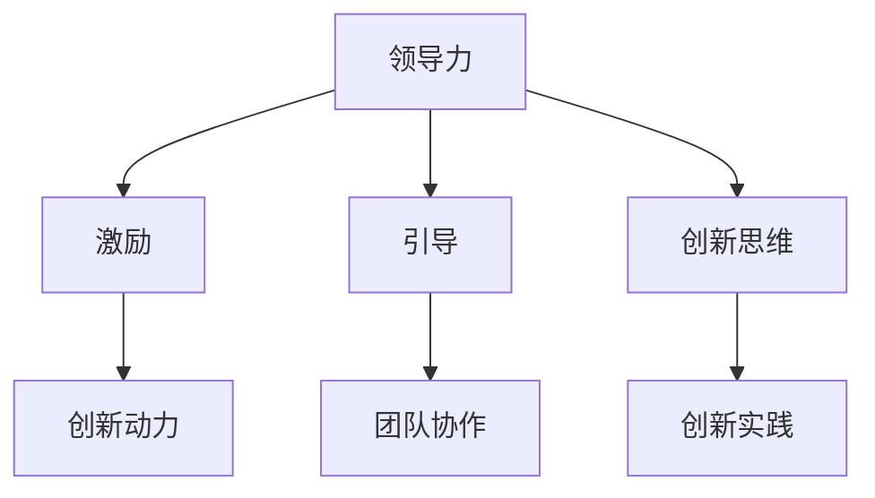

                 

## 文章标题

领导力与创新：引领团队破局的思维方式

### 关键词

领导力、创新、团队、破局、思维方式、实践策略、案例研究

### 摘要

本文深入探讨了领导力与创新之间的关系，以及如何运用创新的思维方式引领团队突破现有局限，实现组织的持续发展。文章首先阐述了领导力的本质和核心要素，接着分析了创新的动力与障碍，然后详细阐述了领导力与创新的联系，以及如何在实践中将领导力与创新相结合。通过实际案例的分析，本文提供了具体的策略和技巧，帮助领导者提升团队的创新能力和领导力，从而在竞争激烈的市场中破局而出。

---

### 第一部分：领导力的本质与核心

#### 第1章 领导力的定义与演变

**1.1 领导力的定义与重要性**

领导力是一个复杂且多维度的概念，它涉及领导者的个人特质、行为模式、影响力以及与团队成员的互动。传统的领导力定义主要关注领导者如何指挥和引导团队，但随着时间的推移，领导力的定义已经发生了显著的变化。

首先，让我们从定义入手。领导力（Leadership）一词源自拉丁词“leitās”，意为“带领”或“指引”。在当今的管理学中，领导力通常被定义为一种影响力，用于激励、引导和激励他人实现共同的目标。这种影响力不仅限于正式的权威或职位，还包括非正式的影响力，如个人魅力、专业知识、价值观等。

领导力的重要性体现在多个方面。首先，它是组织成功的关键因素之一。一个具备卓越领导力的领导者能够推动团队发挥最大潜力，实现卓越的绩效。其次，领导力能够激发员工的内在动机，提高员工的满意度和忠诚度，从而降低员工流失率。此外，领导力还在塑造组织文化、推动变革和创新方面发挥着重要作用。

**1.2 领导力的演变与流派**

领导力的概念和实践经历了长足的发展，从早期对领导者个人特质的关注，到现代对领导力行为和情境的深入探讨，领导力研究已经形成了多个流派。

1. **特质理论**：特质理论是最早的领导力理论之一，它认为领导者具有独特的个性特征和能力，这些特质使他们成为成功的领导者。例如，特质理论提出领导者通常具有自信、决断力、智慧和魅力等特质。

2. **行为理论**：行为理论强调领导者通过特定的行为模式来影响团队。这类理论认为，领导行为可以分为多种类型，如民主型领导、独裁型领导、参与型领导等。研究显示，不同的领导行为在不同情境下可能会产生不同的效果。

3. **情境理论**：情境理论（或称为领导权变理论）提出，领导者的有效性取决于他们如何适应不同的情境。例如，费德勒模型认为领导者的效能取决于三个因素：领导者与下属的关系、任务结构以及职位权力。

4. **变革型领导理论**：变革型领导理论强调领导者通过激励、启发和鼓励团队来实现变革。这种类型的领导者通常具有愿景、创新精神和高远的目标，能够激发团队成员的内在动力。

5. **服务型领导理论**：服务型领导理论强调领导者通过关注团队和组织的整体利益，以及提供支持和帮助来推动团队的发展。这种类型的领导者关注团队成员的需求和成长，从而建立积极的工作环境。

#### 第2章 领导力的核心要素

**2.1 自我领导**

自我领导是领导力的基础，它涉及领导者如何管理自己的行为、情绪和动机，以达到个人和团队的共同目标。自我领导包括以下几个方面：

1. **自我认知**：领导者需要深入了解自己的性格、价值观、优势和劣势。这种自我认知有助于领导者制定个人发展计划，并更好地理解团队成员的需求。

2. **自我激励**：领导者需要具备强大的自我激励能力，以在面对挑战和困难时保持积极的心态。自我激励不仅包括设定明确的目标，还包括持续的自我激励和自我奖励。

3. **自我提升**：领导者需要不断学习新知识和技能，以适应不断变化的环境。自我提升可以通过阅读、培训、实践和反思来实现。

**2.2 人际领导**

人际领导涉及领导者如何与他人建立良好的关系，并利用这些关系来推动团队和组织的发展。人际领导包括以下几个方面：

1. **人际沟通**：领导者需要具备良好的沟通技巧，包括倾听、表达、反馈和解决问题的能力。有效的沟通有助于建立信任和共识，从而提高团队的协作效率。

2. **人际关系管理**：领导者需要管理好与团队成员、同事和上级的关系。这包括解决冲突、提供支持和反馈，以及建立和维护良好的工作环境。

3. **人际影响力**：领导者需要具备人际影响力，以影响他人的行为和决策。人际影响力可以通过建立信任、展示领导力和提供有效的激励来实现。

### 第3章 创新的动力与障碍

**3.1 创新的动力因素**

创新是推动组织发展的重要动力，它涉及到新想法、新产品、新流程和新服务的创造。创新的动力因素可以从以下几个方面来考虑：

1. **社会因素**：社会需求和技术进步是推动创新的重要社会因素。例如，消费者对高品质、个性化产品的需求推动了企业的创新。

2. **经济因素**：经济增长和市场竞争是推动创新的经济因素。企业在竞争中寻求优势，通过创新来提高市场份额和盈利能力。

3. **科技因素**：科技的快速发展为创新提供了强大的支持。新技术、新材料和新工具的出现激发了企业的创新热情。

**3.2 创新的障碍因素**

尽管创新对于组织发展至关重要，但创新过程中也会面临多种障碍：

1. **传统观念**：传统的观念和思维方式可能会限制创新。例如，对风险的恐惧和对失败的回避可能会阻碍创新。

2. **团队心理**：团队心理因素也可能成为创新的障碍。团队内部的竞争、沟通不畅和合作不足可能会抑制创新。

3. **组织结构**：过于严格和僵化的组织结构可能会限制创新。例如，过度分权、官僚作风和缺乏灵活性可能会阻碍创新。

---

### 第二部分：领导力与创新的融合

#### 第4章 领导力与创新的联系

**4.1 领导力在创新中的角色**

领导力在创新过程中扮演着多重角色，它是推动创新的关键因素之一。以下是领导力在创新中的几个关键角色：

1. **创新驱动者**：领导者需要具备创新精神，勇于挑战现状，推动组织进行变革和创新。他们通过设定明确的目标、提供资源和鼓励创新行为来激发团队的创新能力。

2. **创新支持者**：领导者需要成为创新的支持者，为创新提供必要的资源和鼓励。他们通过建立创新文化和激励机制，帮助团队成员克服创新过程中的困难和挑战。

3. **创新传播者**：领导者需要将创新的理念和成果传播给组织内的其他成员，促进整个组织对创新的认同和支持。他们通过分享创新经验、举办创新研讨会和推广创新案例来激发团队的创新能力。

**4.2 创新在领导力中的价值**

创新不仅是组织发展的重要动力，也是提升领导力的关键因素。以下是创新在领导力中的几个价值：

1. **提升领导能力**：创新要求领导者具备前瞻性思维、问题解决能力和决策能力。通过参与创新过程，领导者可以不断提升自身的领导能力。

2. **培养团队精神**：创新通常需要团队合作，这有助于培养团队精神，增强团队的凝聚力和协作能力。

3. **增强组织竞争力**：创新可以帮助组织在激烈的市场竞争中保持优势，提高组织的竞争力。

### 第5章 领导力创新的实践策略

**5.1 创新思维的培养**

创新思维是领导力的重要组成部分，领导者需要具备创新的思维方式来推动组织的发展。以下是培养创新思维的几个策略：

1. **基于问题的思维**：领导者需要培养从问题出发的思维方式，通过深入分析问题来发现创新的机会。例如，他们可以通过提问、调研和用户反馈来识别问题。

2. **基于系统的思维**：领导者需要具备系统思维，能够从整体角度看待问题，找到不同部分之间的联系。这种思维方式有助于领导者发现创新的切入点。

3. **基于未来的思维**：领导者需要具备前瞻性思维，能够预见未来的趋势和变化，从而为组织的发展制定战略。这种思维方式有助于领导者制定创新的长期规划。

**5.2 创新团队的构建**

创新团队是推动创新的核心力量，领导者需要构建高效的创新团队。以下是构建创新团队的几个策略：

1. **团队成员的选择**：领导者需要选择具备不同技能和背景的团队成员，以确保团队在创新过程中能够发挥多元化的优势。

2. **团队协作的机制**：领导者需要建立良好的团队协作机制，包括明确的目标、清晰的沟通渠道和高效的决策流程。这有助于提高团队的协作效率。

3. **团队文化的营造**：领导者需要营造积极向上的团队文化，鼓励团队成员勇于尝试、失败和反思。这种文化有助于激发团队成员的创新能力。

### 第6章 领导力创新的实战案例

**6.1 案例一：谷歌的创新文化**

谷歌以其创新文化而闻名，这种文化在很大程度上得益于其领导者的智慧和实践。以下是谷歌创新文化的一些关键要素：

1. **鼓励创新**：谷歌的领导者鼓励员工创新，提供资源和机会，使员工能够自由地探索新的想法。

2. **团队合作**：谷歌强调团队合作，通过跨职能团队和开放的工作环境来促进不同部门和团队的协作。

3. **实验和失败**：谷歌允许员工进行实验，并接受失败，这种文化鼓励员工勇于尝试和不断学习。

**6.2 案例二：苹果的产品创新**

苹果公司以其独特的产品创新而闻名于世，其成功得益于其对创新的不懈追求。以下是苹果产品创新的一些关键策略：

1. **用户体验**：苹果始终关注用户体验，通过深入研究和分析用户需求，来设计和开发新产品。

2. **设计创新**：苹果在设计创新方面具有独特的优势，其产品不仅在功能上有所突破，还在外观和手感上提供了出色的体验。

3. **持续创新**：苹果公司不断投入资源进行研发，确保其产品能够持续创新，保持市场竞争力。

### 第7章 领导力创新的未来趋势

**7.1 技术变革与领导力创新**

随着技术的快速发展，领导力也需要不断创新以适应新的挑战和机遇。以下是技术变革对领导力创新的影响：

1. **人工智能与领导力**：人工智能的兴起为领导力带来了新的挑战和机遇。领导者需要具备对人工智能的理解和运用能力，以适应这一新兴领域。

2. **大数据与领导力**：大数据技术的应用使得领导者能够更好地了解市场和用户需求，从而做出更明智的决策。

3. **云计算与领导力**：云计算的普及为领导者提供了更灵活的资源管理方式，有助于提高组织的效率和创新能力。

**7.2 社会变革与领导力创新**

社会的快速变革也对领导力提出了新的要求。以下是社会变革对领导力创新的影响：

1. **新兴产业的崛起**：新兴产业的崛起为领导者提供了新的机会，但也带来了新的挑战。领导者需要具备适应新兴产业的能力。

2. **全球化背景下的领导力**：全球化使得领导者需要具备跨文化沟通和合作的能力，以适应多元化的团队和环境。

3. **社会责任与领导力**：随着社会责任意识的提高，领导者需要关注组织的社会责任，通过创新实践来促进可持续发展。

### 总结

领导力与创新是推动组织发展的关键因素，领导者需要具备卓越的领导力和创新思维，以引领团队在竞争激烈的市场中破局而出。本文通过深入探讨领导力的本质、核心要素、创新的动力与障碍，以及领导力与创新的联系，提供了具体的实践策略和实战案例，帮助领导者提升团队的创新能力和领导力。未来的领导力创新将需要适应技术和社会的变革，通过不断学习和实践，领导者可以引领团队在变革中取得成功。

### 作者信息

作者：AI天才研究院/AI Genius Institute & 禅与计算机程序设计艺术 /Zen And The Art of Computer Programming

### 完整性要求

**背景介绍**

领导力与创新在当今组织管理中扮演着至关重要的角色。随着全球化和技术的快速发展，组织面临着前所未有的挑战和机遇。领导力不仅是推动组织发展的关键因素，也是实现创新的重要驱动力。本文旨在探讨领导力与创新之间的关系，以及如何将领导力与创新相结合，引领团队在竞争激烈的市场中破局而出。

**核心概念与联系**

为了更好地理解领导力与创新之间的关系，我们需要探讨一些核心概念，并展示它们之间的联系。

首先，领导力可以被视为一种影响力，用于激励、引导和激励他人实现共同的目标。领导力不仅涉及领导者个人特质和行为模式，还包括与团队成员的互动。创新则是推动组织发展的重要动力，它涉及新想法、新产品、新流程和新服务的创造。

领导力与创新之间的联系可以通过以下架构图来展示：



在这个架构图中，领导力通过激励、引导和创新思维影响团队，进而推动创新实践。领导者的激励能力可以激发团队成员的内在动力，引导能力可以确保团队在创新过程中的方向和目标一致，创新思维则提供了创新的思维方式和方法，而创新实践则是将创新理念转化为实际行动的过程。

**核心算法原理讲解**

为了更好地理解领导力与创新之间的关系，我们可以借助Python源代码来详细阐述。以下是一个简单的示例，展示了如何通过领导力来推动创新。

```python
# 引导团队进行创新
def lead_innovation(team_members):
    # 设定明确的目标
    goal = "开发一款革命性的智能助手"
    
    # 提供资源和支持
    resources = ["资金", "技术支持", "培训"]
    
    # 鼓励团队合作
    for member in team_members:
        member.encourage_collaboration()
    
    # 监督进度
    while not is_innovation_complete():
        # 提供反馈和指导
        provide_feedback(team_members)
    
    # 庆祝成功
    celebrate_success()

# 创新完成判断函数
def is_innovation_complete():
    # 假设创新完成条件为所有任务完成
    return all_tasks_completed()

# 提供反馈和指导
def provide_feedback(team_members):
    for member in team_members:
        # 根据成员的表现提供反馈
        member.give_feedback()

# 庆祝成功
def celebrate_success():
    print("创新成功！庆祝时刻！")

# 假设的团队成员类
class TeamMember:
    def encourage_collaboration(self):
        print("我将会积极参与团队合作，共同推动创新。")
    
    def give_feedback(self):
        print("我根据我的工作表现提供了反馈。")

# 初始化团队成员
team_members = [TeamMember() for _ in range(5)]

# 执行领导力推动创新
lead_innovation(team_members)
```

在这个示例中，我们定义了一个名为 `lead_innovation` 的函数，该函数通过设定明确的目标、提供资源和支持、鼓励团队合作、监督进度以及提供反馈和指导来推动创新。这个示例展示了领导力如何通过一系列具体的行动来推动团队进行创新。

**数学公式**

在探讨领导力与创新之间的关系时，我们还可以使用一些数学公式来描述它们之间的联系。以下是一个简单的例子，展示如何使用数学公式来描述创新成功的关键因素。

$$
创新成功 = f(领导力, 团队合作, 资源支持)
$$

在这个公式中，`领导力`、`团队合作`和`资源支持`是影响创新成功的关键因素。领导力通过激励和引导来提高团队的创新能力，团队合作通过协调和共享来提高团队的工作效率，资源支持通过提供必要的资金和技术来保障创新项目的顺利进行。

**项目实战**

在本节中，我们将介绍一个具体的实战项目，展示如何将领导力与创新相结合，推动团队实现创新目标。

**项目名称**：开发一款基于人工智能的客户服务机器人

**项目目标**：通过人工智能技术，开发一款能够提供24/7客户服务的机器人，以提高客户满意度和企业竞争力。

**项目步骤**：

1. **需求分析**：与客户沟通，了解他们的需求，明确机器人需要具备的功能和性能指标。

2. **团队组建**：组建一个跨职能团队，包括项目经理、数据科学家、软件工程师和产品经理。

3. **技术调研**：研究现有的客户服务机器人技术，了解它们的优缺点，为项目提供技术参考。

4. **数据收集**：收集客户的数据，包括他们的提问和行为模式，用于训练人工智能模型。

5. **模型开发**：开发人工智能模型，包括自然语言处理、机器学习和计算机视觉等。

6. **系统集成**：将人工智能模型集成到现有的客户服务平台中，进行测试和调试。

7. **上线运行**：将客户服务机器人部署到生产环境，进行实际运行和监测。

8. **反馈优化**：收集用户反馈，不断优化机器人的性能和用户体验。

**项目小结**

通过本项目的实战，我们可以看到领导力与创新如何相结合，推动团队实现创新目标。领导力在项目中发挥了关键的推动和协调作用，通过设定明确的目标、提供资源和支持、鼓励团队合作以及提供反馈和指导，确保项目能够顺利进行。同时，创新思维和技术应用使得项目能够实现突破性的成果，提高了企业的竞争力。

**最佳实践 tips**

在本节中，我们将提供一些最佳实践，以帮助领导者更好地将领导力与创新相结合，推动团队实现创新目标。

1. **设定明确的目标**：领导者需要设定明确的目标，确保团队在创新过程中有清晰的方向。目标应该具有挑战性，但又是可行的。

2. **提供资源和支持**：领导者需要为团队提供必要的资源和支持，包括资金、技术、培训和人力资源。这些资源是推动创新的重要保障。

3. **鼓励团队合作**：领导者需要鼓励团队合作，建立良好的沟通和协作机制。团队合作可以提高创新效率，促进知识的共享和协同。

4. **关注用户体验**：领导者需要关注用户体验，确保创新成果能够满足用户的需求。用户体验是衡量创新成功的重要标准。

5. **持续学习和改进**：领导者需要具备持续学习和改进的能力，不断吸取新的知识和经验，以适应不断变化的环境。

**注意事项**

在推动创新的过程中，领导者需要注意以下几点：

1. **风险管理**：创新过程充满不确定性，领导者需要制定风险管理策略，以应对可能出现的风险和挑战。

2. **平衡创新与控制**：领导者需要在创新和控制之间找到平衡点，既不能过于保守，也不能过于冒险。

3. **建立信任**：领导者需要建立与团队成员之间的信任，这是推动创新的重要基础。

**拓展阅读**

为了进一步了解领导力与创新的相关内容，读者可以参考以下拓展阅读：

1. **《创新与企业家精神》**：彼得·德鲁克
2. **《领导力：策略与实践》**：约翰·P·科特
3. **《创新者的窘境》**：克里斯坦森
4. **《精益创业》**：埃里克·莱斯

通过阅读这些书籍，读者可以更深入地理解领导力与创新的理论和实践，为自己的工作和生活提供有益的启示。

