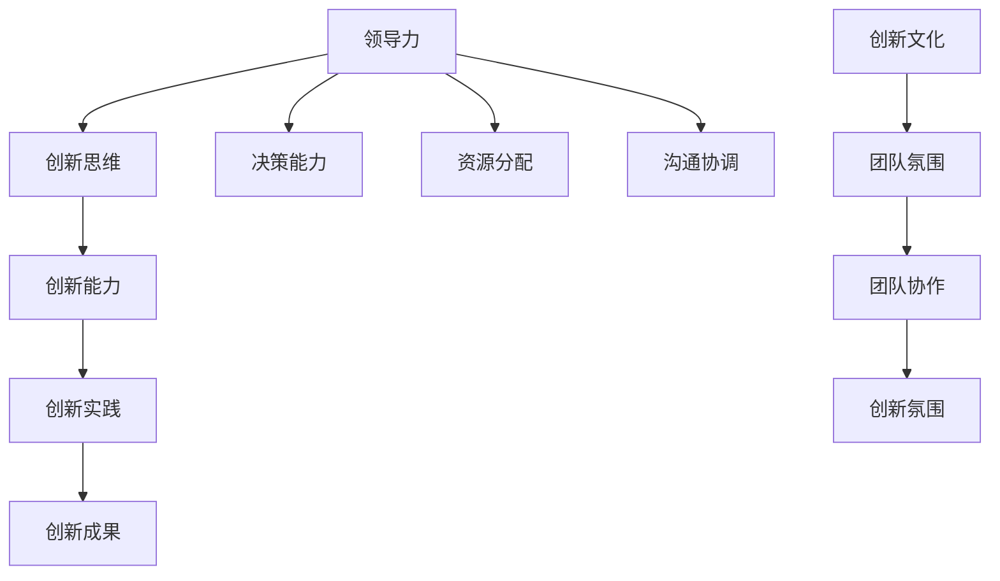

                 

### 1. 引言

在当今快速变化的世界中，创新已经成为企业竞争力和可持续发展的关键。领导者不仅要具备传统的管理能力，更需要具备推动团队创新的能力。因此，领导力与创新的关系成为了一个备受关注的话题。本文旨在探讨领导力与创新之间的内在联系，并提出打造创新型团队的策略。

领导力与创新不仅是一个理论问题，更是一个实践问题。在现代企业中，领导者的作用不仅是确保日常运营的顺利进行，更重要的是要激发团队的创造力，推动持续的创新。然而，如何有效地将领导力与创新能力相结合，仍然是一个挑战。

本文将从以下几个方面展开讨论：

1. **领导力与创新基础**：介绍领导力与创新的基本概念，探讨二者之间的关系。
2. **创新型团队建设**：分析创新型团队的特点，讨论如何构建和管理这样的团队。
3. **创新思维培养**：探讨如何培养创新思维，以及创新思维在团队中的作用。
4. **创新策略与实践**：介绍创新策略的选择和实践方法。
5. **创新文化塑造**：讨论如何塑造有利于创新的团队文化。
6. **创新领导力提升**：分析创新领导力的重要性，并提出提升创新领导力的方法。
7. **创新案例分析**：通过具体案例，展示如何将理论应用于实践。

通过本文的讨论，我们希望为读者提供一个全面的理解，帮助他们在实际工作中更好地运用领导力与创新，打造出高效的创新型团队。

### 2. 领导力与创新基础

#### 领导力的定义与类型

领导力是指领导者通过影响和激励他人，实现组织目标和愿景的能力。领导力不仅仅是一种个人特质，更是一种可以通过学习和实践提升的技能。根据不同的分类标准，领导力可以分为多种类型：

- **传统领导力**：强调权威和命令，领导者通过权力和控制来管理团队。这种领导力在稳定和结构化的环境中较为有效。

- **变革型领导力**：强调激励和启发，领导者通过激发团队的内在动机，推动组织实现变革。这种领导力在需要创新和变革的环境中尤为重要。

- **服务型领导力**：强调服务和关怀，领导者将团队成员的需求放在首位，通过服务来促进团队的发展。这种领导力有助于建立信任和协作。

- **赋能型领导力**：强调授权和赋能，领导者通过赋予团队成员更多的自主权和责任，激发他们的创造力和创新能力。

不同类型的领导力在不同情境下可能具有不同的效果。例如，在需要快速决策和高效执行的任务中，传统领导力可能更为有效；而在需要创新和变革的项目中，变革型和服务型领导力可能更为适用。

#### 创新的定义与分类

创新是指通过创造新的想法、方法或产品，解决现有问题或满足新的需求的过程。创新可以分为多种类型：

- **技术型创新**：通过新技术或新方法来解决现有问题。例如，互联网和智能手机的发明。

- **流程型创新**：通过改进现有流程或工作方式，提高效率和降低成本。例如，精益生产方法和敏捷开发流程。

- **产品型创新**：通过设计新的产品或服务，满足市场需求。例如，iPhone 和特斯拉电动车。

- **市场型创新**：通过开拓新市场或创造新的客户需求，实现业务的扩展。例如，亚马逊的云计算服务和奈飞的网络视频订阅服务。

不同类型的创新在组织中的推动方式和应用场景也有所不同。技术型创新通常需要强大的研发能力和资源投入；流程型创新则更注重运营效率和成本控制；产品型创新需要关注市场需求和用户体验；市场型创新则需要关注市场趋势和竞争策略。

#### 领导力对创新的影响

领导力在创新过程中扮演着关键角色。首先，领导者的行为和态度直接影响团队的创新意愿和能力。一个具有变革型和赋能型领导力的领导者，能够激发团队成员的创造力和创新精神，鼓励他们尝试新的想法和方法。其次，领导者的决策和资源分配对创新项目的成功至关重要。领导者需要具备前瞻性，能够识别和抓住创新机会，并为企业提供必要的资源和支持。最后，领导者的沟通和协调能力对于创新项目的顺利推进也至关重要。领导者需要建立有效的沟通机制，确保团队成员之间的信息共享和协作，避免创新过程中的障碍和冲突。

#### 创新对领导力的影响

创新不仅影响团队和组织的绩效，也对领导力提出了新的要求和挑战。首先，创新通常需要领导者具备更高的决策能力和风险管理能力。领导者需要能够在不确定的环境下做出明智的决策，并承担相应的风险。其次，创新要求领导者具备更强的变革管理能力。领导者需要能够引导团队适应新的工作方式和思维方式，克服变革过程中的阻力和挑战。最后，创新要求领导者具备更高的沟通和协调能力。领导者需要能够建立有效的沟通机制，确保团队成员之间的信息共享和协作，推动创新项目的顺利进行。

#### 领导力与创新的核心概念联系

为了更直观地理解领导力与创新之间的联系，我们可以使用Mermaid流程图来展示核心概念之间的关系：

通过上述流程图，我们可以看到领导力通过多个方面影响创新过程，从创新思维到创新实践，再到创新成果。同时，创新文化也是领导力的重要体现，它通过塑造团队氛围，促进团队协作，进一步推动创新。

总之，领导力与创新是相互促进的关系。一个优秀的领导者不仅能够推动团队的创新能力，同时也能够在创新过程中不断提升自身的领导力。这种良性的互动关系，有助于组织在快速变化的市场环境中保持竞争优势，实现可持续发展。

### 2.1 领导力概述

#### 领导力的定义与类型

领导力是指领导者通过影响和激励他人，实现组织目标和愿景的能力。它不仅包括个人的素质和特质，还涉及领导者与团队成员之间的互动和影响。根据不同的分类标准，领导力可以分为多种类型：

- **传统领导力**：传统领导力通常强调权威和命令，领导者通过权力和控制来管理团队。这种领导力在稳定和结构化的环境中较为有效。传统领导力依赖于领导者的职位和权力，通过明确的指令和监督来实现组织目标。

- **变革型领导力**：变革型领导力强调激励和启发，领导者通过激发团队的内在动机，推动组织实现变革。这种领导力在需要创新和变革的环境中尤为重要。变革型领导者鼓励团队成员探索新的想法和方法，挑战现状，并共同实现组织愿景。

- **服务型领导力**：服务型领导力强调服务和关怀，领导者将团队成员的需求放在首位，通过服务来促进团队的发展。这种领导力有助于建立信任和协作，提高团队绩效。服务型领导者关注团队成员的成长和福祉，通过支持和服务来激励团队成员。

- **赋能型领导力**：赋能型领导力强调授权和赋能，领导者通过赋予团队成员更多的自主权和责任，激发他们的创造力和创新能力。这种领导力鼓励团队成员自主决策和承担责任，从而提高团队的创新能力和执行力。

每种类型的领导力都有其独特的特点和应用场景。传统领导力在稳定和结构化的环境中具有优势，而变革型领导力、服务型领导力和赋能型领导力则更适合快速变化和创新驱动的环境。

#### 领导力的重要性

领导力在组织中的重要性不可忽视。首先，领导力对团队和组织的绩效有直接的影响。一个优秀的领导者能够激发团队成员的潜力，提高团队的整体绩效。领导者的决策、激励和沟通能力直接影响团队的工作效率和产出。

其次，领导力对组织文化的塑造起着关键作用。领导者的行为和价值观直接影响团队成员的行为和态度，进而影响整个组织的文化。一个积极向上、注重创新和协作的文化有助于吸引和留住优秀人才，提高组织的竞争力。

此外，领导力对组织的可持续发展也有重要影响。领导者需要具备前瞻性和战略思维，能够识别和抓住市场机会，推动组织的创新和变革。一个具备强大领导力的组织能够适应市场的变化，持续发展并保持竞争优势。

#### 领导力的发展历程

领导力的发展历程可以追溯到古代的统治者和军事指挥官。在农业社会和工业社会中，领导力主要依赖于权力和控制。然而，随着信息社会和知识经济的兴起，领导力逐渐从传统的权威型转向变革型、服务型和赋能型。

在20世纪初期，科学管理理论的兴起推动了领导力的发展。这一理论强调通过标准化流程和提高效率来提高组织绩效。然而，随着组织复杂性的增加和员工需求的变化，领导力也逐渐转向关注人的因素。

在21世纪，领导力进一步演变，强调创新、协作和可持续性。领导者需要具备跨领域的知识和技能，能够激励和引导团队成员共同实现组织愿景。同时，领导者也需要具备全球视野，能够应对全球化带来的挑战和机遇。

领导力的发展历程反映了社会和经济的变迁，以及对领导力要求的不断变化。未来，领导力将继续适应时代的发展，不断演化和创新。

### 2.2 创新概述

#### 创新的定义与分类

创新是指通过创造新的想法、方法或产品，解决现有问题或满足新的需求的过程。创新不仅仅是在科学和工程领域的重要活动，它在各个领域都发挥着重要作用。根据不同的分类标准，创新可以分为多种类型：

- **技术型创新**：技术型创新是指通过引入新的技术或改进现有技术，来解决现有问题或满足新需求。这种创新通常发生在科学研究和工程领域，例如新药物的研发、新型材料的应用和新的制造工艺的开发。

- **流程型创新**：流程型创新是指通过改进现有流程或工作方式，提高效率和降低成本。这种创新可以发生在任何需要流程优化的领域，如制造业、服务业和政府部门。例如，采用精益生产方法来减少浪费、引入自动化流程来提高生产效率等。

- **产品型创新**：产品型创新是指通过设计新的产品或服务，满足市场需求。这种创新常见于消费品行业、信息技术行业和医疗行业等。例如，iPhone的发明改变了智能手机市场的格局，Netflix的流媒体服务改变了视频消费的方式。

- **市场型创新**：市场型创新是指通过开拓新市场或创造新的客户需求，实现业务的扩展。这种创新通常发生在市场洞察力和战略规划能力较强的企业中。例如，亚马逊通过云计算服务开拓了新的市场，Airbnb通过共享经济模式创造了新的客户需求。

不同类型的创新在组织中的推动方式和应用场景也有所不同。技术型创新通常需要强大的研发能力和资源投入，流程型创新则更注重运营效率和成本控制，产品型创新需要关注市场需求和用户体验，市场型创新则需要关注市场趋势和竞争策略。

#### 创新的重要性

创新在现代社会中具有不可替代的重要性。首先，创新是推动经济增长的关键动力。通过引入新技术、新方法和新产品，创新可以增加生产效率，提高产品质量，创造新的市场需求，从而推动整个经济体系的繁荣。

其次，创新有助于提升企业的竞争力和可持续发展能力。在激烈的市场竞争中，只有不断创新才能保持竞争优势。企业通过持续的创新，可以不断优化产品和服务，提高客户满意度，开拓新的市场，实现业务的持续增长。

此外，创新还能够促进社会进步和人类福祉。在医疗领域，创新带来了新的治疗方法和药物，改善了人们的健康状况；在能源领域，创新推动了可再生能源的发展和利用，促进了环境保护和可持续发展；在教育领域，创新带来了在线教育和远程学习，提高了教育质量和普及率。

总之，创新不仅是企业发展的核心动力，也是社会进步的重要引擎。一个具备创新能力的组织和社会，能够更好地应对挑战，抓住机遇，实现长期的可持续发展。

### 2.3 领导力与创新的联系

领导力与创新之间存在着紧密的联系和相互影响。一个成功的领导者不仅需要具备传统的管理能力，还需要具备推动团队创新的能力。以下是领导力对创新的影响、创新对领导力的影响，以及领导力与创新的核心概念联系。

#### 领导力对创新的影响

首先，领导者的行为和态度直接影响团队的创新意愿和能力。一个具有变革型和服务型领导力的领导者，能够激发团队成员的创造力和创新精神，鼓励他们尝试新的想法和方法。例如，苹果公司创始人史蒂夫·乔布斯以其卓越的领导力，成功激发了苹果团队的创新热情，推动了多款革命性产品的诞生。

其次，领导者的决策和资源分配对创新项目的成功至关重要。领导者需要具备前瞻性，能够识别和抓住创新机会，并为企业提供必要的资源和支持。例如，谷歌公司创始人拉里·佩奇和谢尔盖·布林，通过对其创新项目的坚定支持，推动了谷歌在搜索引擎和云计算领域的持续创新。

最后，领导者的沟通和协调能力对于创新项目的顺利推进也至关重要。领导者需要建立有效的沟通机制，确保团队成员之间的信息共享和协作，避免创新过程中的障碍和冲突。例如，特斯拉公司创始人埃隆·马斯克通过其强大的沟通能力和协调能力，成功推动了特斯拉在电动汽车和可再生能源领域的创新。

#### 创新对领导力的影响

创新不仅影响团队和组织的绩效，也对领导力提出了新的要求和挑战。首先，创新通常需要领导者具备更高的决策能力和风险管理能力。领导者需要能够在不确定的环境下做出明智的决策，并承担相应的风险。例如，在电动汽车行业，特斯拉公司的创新步伐和风险承担，对埃隆·马斯克的领导力提出了严峻的考验。

其次，创新要求领导者具备更强的变革管理能力。领导者需要能够引导团队适应新的工作方式和思维方式，克服变革过程中的阻力和挑战。例如，谷歌公司通过其“20%时间”政策，鼓励员工探索新的创新项目，这需要领导者在变革管理方面具备高超的能力。

最后，创新要求领导者具备更高的沟通和协调能力。领导者需要能够建立有效的沟通机制，确保团队成员之间的信息共享和协作，推动创新项目的顺利进行。例如，苹果公司的领导团队在设计和开发iPhone时，通过高效的沟通和协调，确保了产品的成功推出。

#### 领导力与创新的核心概念联系

为了更直观地理解领导力与创新之间的联系，我们可以使用Mermaid流程图来展示核心概念之间的关系：

通过上述流程图，我们可以看到领导力通过多个方面影响创新过程，从创新思维到创新实践，再到创新成果。同时，创新文化也是领导力的重要体现，它通过塑造团队氛围，促进团队协作，进一步推动创新。

总之，领导力与创新是相互促进的关系。一个优秀的领导者不仅能够推动团队的创新能力，同时也能够在创新过程中不断提升自身的领导力。这种良性的互动关系，有助于组织在快速变化的市场环境中保持竞争优势，实现可持续发展。

### 第2章: 创新型团队建设

#### 团队概述

团队是指由两个或多个个体组成的，为了实现共同目标而协同工作的组织。一个高效的团队不仅能够提升组织绩效，还能够促进个人成长和职业发展。因此，了解团队的定义、类型和建设要素至关重要。

首先，团队的定义可以从多个角度进行理解。根据社会心理学的研究，团队可以被视为一种社会结构，成员之间通过协作和沟通来实现共同的目标。从组织行为学的角度来看，团队是一种具有共同目标、角色分工和相互依赖的集体。在技术领域，团队常常被定义为具备特定技能和知识，能够共同解决问题和实现创新的个体集合。

其次，团队可以分为多种类型，根据不同的分类标准，可以分为以下几种：

- **功能型团队**：根据组织的功能需求组建的团队，如研发团队、市场团队和运营团队。
- **跨职能团队**：由不同部门或领域的专业人员组成的团队，旨在解决复杂问题或实现跨部门协作。
- **任务型团队**：为完成特定任务或项目而组建的临时团队，任务完成后团队解散。
- **自我管理型团队**：成员自主管理、自我协调和自我激励的团队，具有较高的自主性和灵活性。

不同类型的团队在组织中的角色和职责有所不同，但共同的目标是实现组织目标和提升团队绩效。

#### 团队建设的重要性

团队建设对于组织的成功至关重要。首先，高效的团队建设能够提升组织整体绩效。通过明确团队目标、优化角色分工和提升沟通协作，团队可以更快速、更高效地完成任务，提高工作效率和产出。

其次，团队建设有助于促进个人成长和职业发展。在团队中，成员可以通过相互学习和协作，提升自身的技能和知识。同时，团队建设也能够培养成员的领导力、沟通能力和团队合作精神，为个人的职业发展提供有力支持。

此外，团队建设有助于建立积极向上的团队文化。通过加强团队成员之间的信任、尊重和协作，团队可以形成一种积极向上、相互支持的氛围，增强团队的凝聚力和归属感。

#### 团队建设的要素

团队建设是一个复杂的过程，涉及多个关键要素。以下是一些重要的团队建设要素：

- **共同目标**：明确的共同目标是团队建设的基石。团队需要明确共同的目标和愿景，确保每个成员都朝着同一个方向努力。这有助于增强团队的凝聚力，提升团队的执行力。
  
- **角色分工**：有效的角色分工能够确保团队成员各司其职，发挥各自的专长。通过明确每个成员的职责和任务，可以减少重复工作，提高工作效率。
  
- **沟通协作**：良好的沟通和协作是团队成功的关键。团队需要建立有效的沟通渠道，确保信息在团队内部透明流通，避免误解和冲突。此外，团队还需要培养协作精神，鼓励成员之间相互支持和合作。

- **信任与尊重**：信任和尊重是团队建设中不可或缺的要素。团队成员需要建立相互信任的关系，尊重彼此的观点和贡献。这有助于减少内耗，增强团队的凝聚力。

- **激励机制**：有效的激励机制能够激励团队成员发挥最大潜力，提升团队绩效。激励机制可以包括物质奖励、精神激励和职业发展机会等。

- **持续改进**：团队建设是一个持续的过程，需要不断进行反思和改进。团队需要定期评估团队绩效，识别问题和改进机会，不断优化团队建设和运营。

通过关注这些关键要素，团队可以更好地实现共同目标，提升组织绩效，实现长期可持续发展。

### 2.2.1 创新型团队的构建

创新型团队的构建是组织实现持续创新和竞争优势的关键。与传统的功能型团队不同，创新型团队注重跨学科合作、快速决策和灵活应对变化。以下将详细探讨创新型团队的特点、构建步骤以及领导力的要求。

#### 创新型团队的特点

1. **跨学科合作**：创新型团队通常由来自不同领域、不同专业背景的成员组成，他们拥有不同的技能和知识。这种多样性有助于激发新的创意和解决方案，促进创新思维的碰撞。

2. **快速决策**：创新型团队需要具备快速决策的能力，以便及时响应市场变化和客户需求。这种快速决策通常依赖于团队成员之间的信任和高效的沟通。

3. **灵活应对变化**：在创新过程中，团队需要不断适应新的挑战和变化。创新型团队应具备高度灵活性和适应性，以便迅速调整策略和方向。

4. **高度自主性**：创新型团队成员通常具有较高的自主性和责任感，他们有权自主决策和承担相应的风险。这种自主性有助于激发团队成员的创造力和主动性。

5. **持续学习**：创新型团队鼓励成员不断学习和提升自身技能，以适应快速变化的环境。团队成员应具备持续学习和自我提升的意识。

#### 创新型团队的构建步骤

1. **确定目标和愿景**：构建创新型团队的首要任务是明确团队的目标和愿景。这有助于确保团队成员在同一个方向上努力，并形成共同的目标感。

2. **选拔团队成员**：选拔团队成员时，应注重多样性和互补性。团队成员应具备不同的专业技能和知识，以确保团队在各个领域都有足够的支持。

3. **建立信任和沟通**：建立团队成员之间的信任和高效的沟通机制是构建创新型团队的关键。团队应定期组织交流活动，促进成员之间的相互了解和合作。

4. **提供必要的资源和支持**：创新型团队需要获得充分的资源和支持，包括资金、技术、培训和指导等。这有助于团队克服困难和挑战，推动创新项目的顺利进行。

5. **制定明确的角色和职责**：明确每个团队成员的角色和职责，确保团队运作高效、有序。这有助于减少冲突和误解，提升团队协作效率。

6. **建立激励机制**：为了激励团队成员发挥最大潜力，应建立有效的激励机制。这可以包括物质奖励、精神激励和职业发展机会等。

7. **持续评估和改进**：团队建设是一个动态的过程，需要持续评估和改进。团队应定期检查团队绩效，识别问题和改进机会，不断优化团队建设和运营。

#### 创新型团队的领导力要求

1. **变革型领导力**：变革型领导力强调激发团队成员的内在动机，鼓励他们尝试新的想法和方法。领导者需要具备远见卓识，能够为团队提供清晰的愿景和方向。

2. **服务型领导力**：服务型领导力强调关注团队成员的需求，为他们提供必要的支持和服务。领导者需要具备同理心和关怀，帮助团队成员克服困难和挑战。

3. **赋能型领导力**：赋能型领导力强调赋予团队成员自主权和责任感，激发他们的创造力和主动性。领导者需要建立信任，鼓励团队成员自主决策和承担责任。

4. **沟通协调能力**：领导者需要具备出色的沟通协调能力，确保团队成员之间的信息共享和协作。这有助于减少误解和冲突，提升团队协作效率。

5. **持续学习**：领导者需要具备持续学习的意识，不断提升自身的领导力和管理能力。这有助于适应快速变化的环境，为团队提供有效的指导和支持。

总之，构建创新型团队需要关注多个方面，包括目标设定、成员选拔、沟通协作、资源支持、角色明确、激励机制和持续改进等。同时，领导者需要具备变革型、服务型和赋能型领导力，以及出色的沟通协调能力和持续学习的意识。只有这样，团队才能充分发挥其创新能力，为组织带来持续的价值。

### 2.3 团队协作与创新

#### 团队协作对创新的影响

团队协作是推动创新的重要力量。一个高效的团队协作能够促进创新思维的产生和实施，从而提高组织的创新能力和竞争力。以下是团队协作对创新的影响：

1. **激发创意**：团队协作为成员提供了一个分享和交流创意的平台，有助于激发新的创意和解决方案。通过头脑风暴、讨论和协作，团队成员可以相互启发，产生更多的创新想法。

2. **优化方案**：在创新过程中，团队协作有助于优化创新方案。团队成员可以从不同的角度和背景出发，提供不同的意见和建议，从而改进和完善创新方案。

3. **提升执行力**：团队协作能够提升创新项目的执行力。通过明确的角色分工、有效的沟通和协作，团队成员可以更好地分配任务和协调工作，确保创新项目的顺利推进。

4. **降低风险**：团队协作有助于分散创新风险。在一个团队中，不同的成员拥有不同的技能和知识，可以共同应对创新过程中的各种挑战和风险。

5. **增强凝聚力**：团队协作能够增强团队的凝聚力，提高团队成员之间的信任和合作。这种积极的团队氛围有助于激发成员的创造力和创新精神。

#### 提高团队协作效率的方法

为了提高团队协作效率，可以采取以下几种方法：

1. **明确目标**：确保团队成员对团队目标有清晰的理解和认同。明确的目标有助于统一团队成员的行动方向，提高协作效率。

2. **角色分工**：根据团队成员的技能和特长，合理分配任务和角色，确保每个成员都有明确的职责和工作内容。

3. **定期沟通**：建立定期的沟通机制，确保团队成员之间的信息共享和协作。通过会议、邮件、即时通讯工具等，及时传达信息和反馈意见。

4. **共享资源**：提供必要的资源和支持，确保团队成员能够高效地完成任务。共享资源可以包括工具、知识库、硬件设备等。

5. **建立信任**：通过建立信任和尊重，减少团队内部的冲突和误解，提高协作效率。这可以通过团队成员之间的互动、共同经历挑战和庆祝成功来实现。

6. **激励机制**：建立有效的激励机制，激励团队成员积极参与协作和创新。激励机制可以包括奖金、晋升机会、荣誉表彰等。

7. **灵活应变**：在创新过程中，团队需要具备灵活应变的能力，能够迅速调整策略和方向，以应对不断变化的环境。

8. **培训与发展**：定期为团队成员提供培训和发展机会，提升他们的技能和知识，增强团队的协作能力。

#### 创新型团队协作的挑战与解决方案

尽管团队协作对创新具有积极影响，但在实际操作中，创新型团队协作仍面临一些挑战：

1. **沟通障碍**：团队成员来自不同的背景和领域，可能存在语言、文化和认知上的差异，导致沟通障碍。解决方案：建立多元化的沟通渠道，鼓励团队成员使用共同的语言和工具，并提供跨文化沟通培训。

2. **冲突与分歧**：在创新过程中，团队成员可能会有不同的观点和意见，导致冲突和分歧。解决方案：建立开放的沟通氛围，鼓励团队成员表达自己的观点，通过讨论和协商解决分歧。

3. **资源限制**：创新项目通常需要大量的资源支持，但资源有限可能导致团队协作效率下降。解决方案：优化资源配置，确保关键资源优先分配给重要任务，同时寻求外部合作和资源支持。

4. **时间压力**：创新项目往往具有紧迫的时间限制，可能导致团队成员感到压力，影响协作效率。解决方案：合理安排工作计划，确保团队成员有足够的时间进行协作和思考。

5. **技术依赖**：创新团队可能过度依赖技术工具，导致沟通和协作的效率降低。解决方案：在技术工具的使用上保持适度，同时注重人际沟通和互动，确保团队协作的多样性和有效性。

通过识别和创新型团队协作中的挑战，并采取相应的解决方案，团队可以更好地发挥协作的力量，推动创新和实现组织目标。

### 2.4 创新思维培养

#### 创新思维概述

创新思维是指通过创造性的方法和思维方式，发现和解决问题、产生新想法和解决方案的能力。它是一种超越传统思维定式的思考方式，旨在激发创新潜力，推动个人和组织的持续进步。创新思维不仅包括创意的产生，还涉及对创意的评估、实施和优化。

创新思维的重要性在于它能够为个人和组织带来以下益处：

1. **提高竞争力**：创新思维能够帮助组织在激烈的市场竞争中保持领先地位。通过不断创造新的产品、服务或业务模式，企业可以满足不断变化的市场需求，赢得客户信任。

2. **促进增长**：创新思维能够推动组织的持续增长。通过创新，企业可以开辟新的市场、扩大业务范围，实现收入和利润的持续增长。

3. **提升员工满意度**：创新思维能够激发员工的创造力和主动性，提高员工的工作满意度和忠诚度。在一个鼓励创新的环境中，员工更有动力发挥自己的潜力，为组织做出贡献。

4. **推动社会进步**：创新思维不仅对企业和经济有益，还能够推动社会进步。通过创新，科学家和研究人员可以解决重大的社会问题，改善人们的生活质量。

#### 创新思维的定义与类型

创新思维可以从多个角度进行定义和分类。根据其本质和表现形式，创新思维可以分为以下几种类型：

1. **发散思维**：发散思维是指从不同的角度和方向思考问题，产生多种可能的解决方案。发散思维鼓励开放和自由的思考，通过不断扩展思路，发现新的创意和可能性。

2. **收敛思维**：收敛思维是指从多个解决方案中筛选和优化出最佳的方案。收敛思维强调逻辑性和系统性，通过分析和评估，确保解决方案的可行性和有效性。

3. **逆向思维**：逆向思维是指从问题的反面或相反的角度思考，以寻找创新性的解决方案。逆向思维有助于突破传统思维的局限，发现新的解决方案。

4. **联想思维**：联想思维是指通过联想和关联，将看似无关的问题或概念联系起来，从而产生新的创意和解决方案。联想思维鼓励跨学科和跨领域的思考，激发创新的灵感。

5. **设计思维**：设计思维是一种以用户需求为中心的创新方法，强调通过迭代和实验，不断改进和优化产品和服务。设计思维注重用户体验和参与，通过用户反馈和迭代，确保解决方案的可行性和用户满意度。

每种类型的创新思维都有其独特的应用场景和优势，通过灵活运用这些思维方法，可以更好地激发创新潜力，推动个人和组织的进步。

#### 创新思维的培养方法

要培养创新思维，需要采取一系列系统的方法和策略。以下是一些有效的培养方法：

1. **思维训练**：通过定期的思维训练，可以提升创新思维能力。思维训练可以包括思维导图、头脑风暴、思维游戏和思维模型等。这些训练方法有助于培养发散思维、收敛思维和联想思维。

2. **跨学科学习**：跨学科学习有助于拓宽视野，培养跨领域的创新思维。通过学习不同领域的知识，可以激发新的创意和解决方案。

3. **体验和实践**：通过实际参与项目和实践活动，可以锻炼创新思维。在实际操作中，可以遇到各种问题和挑战，通过尝试不同的方法和解决方案，可以不断积累创新经验。

4. **阅读和研究**：阅读和研究是培养创新思维的重要途径。通过阅读创新书籍、研究最新科技发展和行业动态，可以获取新的知识和灵感。

5. **团队合作**：团队合作有助于激发创新思维。在一个多元化的团队中，成员可以相互启发，共同探讨问题，通过集思广益，产生更多的创新想法。

6. **挑战自我**：勇于接受新的挑战和任务，有助于培养创新思维。在面临困难时，可以尝试不同的方法和思路，通过不断的尝试和反思，提升创新思维能力。

7. **心态调整**：保持开放的心态和积极的态度是培养创新思维的关键。面对问题和挑战时，应保持好奇心和探索精神，勇于尝试新的方法和思路。

通过上述方法，可以逐步培养和提升创新思维，为个人和组织带来持续的创新和进步。

### 2.5 创新思维训练

#### 开放式思维训练

开放式思维训练是一种培养创新思维的有效方法。它强调在思考过程中保持开放和灵活，不断探索新的可能性，从而激发创新的灵感。以下是一些具体的开放式思维训练方法：

1. **头脑风暴**：头脑风暴是一种集体思维训练方法，旨在快速产生大量创意和想法。在头脑风暴过程中，参与者不被评价和批评，可以自由地提出任何想法，无论这些想法看起来多么荒谬或不切实际。通过头脑风暴，可以收集到大量的创意，从中筛选出有潜力的方案进行进一步探讨。

2. **思维导图**：思维导图是一种图形化的思维工具，通过将想法以分支结构的形式展开，有助于理清思路，发现潜在的联系。通过绘制思维导图，可以系统地组织和整理思维，促进创意的产生和思考的连贯性。

3. **探询未知领域**：鼓励团队成员探索未知领域，通过阅读相关书籍、研究前沿科技和参加行业研讨会，可以获取新的知识和灵感。这种跨学科和跨领域的探索有助于打破思维定式，激发创新的火花。

4. **角色扮演**：角色扮演是一种通过模拟不同角色的体验来培养开放式思维的方法。通过角色扮演，团队成员可以站在不同的角度思考问题，从而发现新的视角和解决方案。

#### 逆向思维训练

逆向思维训练是一种通过反向思考问题来激发创新思维的方法。以下是一些具体的逆向思维训练方法：

1. **反向思考**：鼓励团队成员从问题的反面思考，例如，考虑如何让一个原本负面的情况变得正面。通过反向思考，可以突破传统思维的局限，发现新的解决方案。

2. **反事实思维**：反事实思维是一种通过设想“如果不是这样会怎样”来激发创新的方法。通过反事实思维，可以探索不同的情境和可能性，从而产生新的创意。

3. **反转因果**：通过反转因果，思考问题的根本原因和解决方案。例如，如果某个问题的根本原因不是A，而是B，那么解决方案会是什么？这种思维方式有助于发现问题的本质，并提出创新的解决方案。

#### 跨界思维训练

跨界思维训练是一种通过跨学科和跨领域的思考来激发创新思维的方法。以下是一些具体的跨界思维训练方法：

1. **跨学科研究**：鼓励团队成员跨学科学习，通过学习其他领域的知识和理论，可以拓宽视野，发现新的创新点。例如，工程师可以学习心理学，设计师可以学习经济学，从而在各自领域中实现创新。

2. **跨领域合作**：通过跨领域合作，不同领域的专业人士可以共同探讨问题，发挥各自的专业优势，产生新的创意和解决方案。例如，软件开发人员可以与市场营销人员合作，开发更符合用户需求的产品。

3. **跨界交流**：鼓励团队成员参加跨领域的交流活动，如行业研讨会、学术会议和创新论坛。通过跨界交流，可以了解不同领域的最新动态和前沿技术，激发创新的灵感。

4. **跨文化学习**：跨文化学习有助于培养开放和包容的思维，通过了解不同文化背景和价值观，可以激发创新的思维火花。例如，通过学习不同国家的商业文化和社会习俗，可以开拓新的市场机会。

#### 创新思维训练案例分析

以下是一个具体的创新思维训练案例分析，展示了如何通过开放式思维、逆向思维和跨界思维来培养创新思维：

**案例背景**：某科技公司希望开发一款智能家居产品，以提升用户的生活品质。该公司决定通过创新思维训练来激发团队成员的创造力。

**训练方法**：

1. **开放式思维训练**：公司组织了一次头脑风暴会议，鼓励团队成员自由提出关于智能家居产品的创意。通过思维导图，团队成员将各种创意和想法进行了系统整理，从中筛选出有潜力的方案。

2. **逆向思维训练**：公司要求团队成员从问题的反面思考，例如，如何通过智能家居产品解决用户的隐私问题。通过反向思考和反事实思维，团队成员提出了一些创新的解决方案，如设计可拆卸的传感器和用户可控的数据隐私设置。

3. **跨界思维训练**：公司邀请了一位心理学家参与讨论，通过跨学科合作，团队成员了解到了用户行为和心理需求，从而设计出更符合用户期望的智能家居产品。

**训练结果**：通过创新思维训练，公司成功开发出了一款用户满意度高的智能家居产品。该产品在市场上取得了良好的销售业绩，为公司带来了显著的收益。

通过上述案例分析，可以看出，开放式思维、逆向思维和跨界思维训练是培养创新思维的有效方法。通过灵活运用这些方法，企业可以激发团队的创造力，推动产品创新和业务发展。

### 2.6 创新思维工具

在创新过程中，使用适当的工具可以有效地激发创意，提高创新效率。以下是几种常用的创新思维工具，包括SWOT分析、用户画像、设计思维和创意思维工具。

#### SWOT分析

SWOT分析是一种常用的战略规划工具，用于评估一个项目或产品的优势（Strengths）、劣势（Weaknesses）、机会（Opportunities）和威胁（Threats）。以下是SWOT分析在创新中的应用步骤：

1. **优势（Strengths）**：识别项目或产品在技术、市场、资源和团队等方面的优势。例如，企业可以评估其在研发能力、品牌影响力、用户基础和执行力等方面的优势。

2. **劣势（Weaknesses）**：识别项目或产品在技术、市场、资源和团队等方面的劣势。例如，企业可以评估其在市场份额、产品差异化、资源限制和执行力等方面的劣势。

3. **机会（Opportunities）**：分析市场趋势、技术进步、政策和法规变化等因素，识别项目或产品的机会。例如，企业可以关注新的市场需求、技术突破和行业趋势，以抓住潜在的市场机会。

4. **威胁（Threats）**：分析市场变化、竞争对手行动、法规政策等因素，识别项目或产品面临的威胁。例如，企业可以评估竞争对手的产品创新、市场策略和政策变化可能对其造成的威胁。

通过SWOT分析，企业可以全面了解自身在创新过程中的优势和劣势，以及面临的机会和威胁，从而制定更有效的创新策略。

#### 用户画像

用户画像是一种通过收集和分析用户数据，创建用户虚拟形象的方法。以下是用户画像在创新中的应用步骤：

1. **收集数据**：通过调查问卷、用户访谈、社交媒体分析等方式，收集用户的基本信息、行为习惯、需求偏好和痛点等数据。

2. **分析数据**：对收集到的数据进行分析，识别用户的共同特征和需求。例如，企业可以分析用户年龄、性别、地理位置、收入水平等信息，了解用户的基本特征。

3. **创建用户画像**：根据分析结果，创建一个或多个用户画像，将用户的特征和需求具体化。例如，企业可以创建一个“年轻白领用户画像”，描述其年龄、职业、消费习惯和偏好等信息。

4. **应用用户画像**：在产品设计和创新过程中，应用用户画像来指导设计和决策。例如，企业可以根据用户画像，优化产品功能、设计用户体验，提高产品满意度和市场竞争力。

#### 设计思维

设计思维是一种以用户需求为中心的创新方法，通过迭代和实验，不断优化产品和服务。以下是设计思维在创新中的应用步骤：

1. **定义问题**：明确创新目标和用户需求。例如，企业可以定义一个具体的问题，如“如何提高用户对智能家居产品的满意度”。

2. **观察和访谈**：通过观察用户行为和访谈用户，深入了解用户的需求和痛点。例如，企业可以观察用户如何使用智能家居产品，访谈用户了解他们的期望和意见。

3. **创意产生**：根据用户需求，产生多个可能的解决方案。例如，企业可以通过头脑风暴和思维导图，列出多种创新想法。

4. **原型设计**：根据创意，设计和构建原型。例如，企业可以制作一个简化的智能家居产品原型，模拟用户的使用场景。

5. **测试和反馈**：测试原型，收集用户反馈，并进行迭代优化。例如，企业可以将原型展示给用户，收集他们的使用体验和改进建议。

6. **实施和推广**：根据测试结果，实施最终方案，并推广到市场。例如，企业可以基于用户反馈，对智能家居产品进行优化，并正式推向市场。

#### 创意思维工具

创意思维工具包括一系列方法和技术，用于激发创意和解决问题。以下是几种常用的创意思维工具：

1. **思维导图**：通过绘制思维导图，可以系统地组织和整理创意，发现潜在的联系和灵感。

2. **头脑风暴**：通过集体头脑风暴，快速产生大量创意和想法，鼓励成员自由表达，不评价和批评。

3. **六顶思考帽**：通过六顶思考帽方法，分别从六种不同的角度（红色、蓝色、黄色、绿色、白色和黑色）思考问题，促进全面和深入的讨论。

4. **情境模拟**：通过情境模拟，构建一个虚拟的环境，让团队成员在模拟中体验和解决问题，从而发现创新的解决方案。

通过使用这些创新思维工具，企业可以有效地激发创意，提高创新效率，推动产品和服务的发展。

### 4.1 创新策略概述

创新策略是指组织在创新过程中所采取的一系列规划、决策和行动措施。它旨在通过系统化和有目的的方式推动创新，从而提升组织的竞争力、创造新价值并实现长期可持续发展。以下是创新策略的定义、类型以及其在组织中的重要性。

#### 创新策略的定义

创新策略是指组织为了实现创新目标，通过规划和实施一系列有针对性的措施和方法，以推动技术创新、产品创新或服务创新的战略安排。创新策略不仅涉及具体的操作方法，还包括对创新资源的配置、创新文化的塑造和创新流程的管理。

#### 创新策略的类型

根据创新的类型和目标，创新策略可以分为以下几种类型：

1. **技术型创新策略**：这种策略主要关注通过技术进步和研发活动来推动产品或服务的创新。技术型创新策略通常包括投资研发、建立技术中心、研发合作和专利保护等措施。

2. **流程型创新策略**：流程型创新策略侧重于优化和改进现有的业务流程和工作方式，以提高效率和降低成本。这种策略可以通过自动化、精益生产和流程再造等方法来实现。

3. **产品型创新策略**：产品型创新策略关注通过设计和开发新产品或改进现有产品来满足市场需求。这种策略包括市场调研、用户反馈收集、产品设计和测试等环节。

4. **市场型创新策略**：市场型创新策略旨在通过开拓新市场或创造新需求来推动业务增长。这种策略可以通过市场细分、新产品定价策略和营销创新等方法来实现。

#### 创新策略在组织中的重要性

创新策略在组织中具有以下几个重要性：

1. **提升竞争力**：通过制定和实施创新策略，组织可以不断提升其产品、服务和业务模式的竞争力。创新策略有助于组织在市场中保持领先地位，应对竞争对手的挑战。

2. **创造新价值**：创新策略可以推动组织创造新的价值和客户需求，从而实现业务的增长和盈利能力的提升。通过创新，组织可以开拓新的市场，满足客户的多元化需求。

3. **增强适应性**：在快速变化的市场环境中，创新策略有助于组织提高适应性和灵活性。创新策略可以帮助组织及时识别和抓住市场机会，迅速调整战略和业务模式。

4. **提高员工创造力**：创新策略可以激发员工的创造力和主动性，促进员工参与和贡献。通过创新文化的塑造和激励机制，组织可以培养一支具有创新精神的团队。

5. **实现可持续发展**：创新策略有助于组织实现长期可持续发展。通过持续的创新，组织可以不断提升其核心竞争力和市场地位，确保在长期竞争中的优势。

总之，创新策略是组织实现创新目标的重要手段。通过制定和实施有效的创新策略，组织可以提升竞争力、创造新价值、增强适应性、提高员工创造力和实现可持续发展。

### 4.2 创新实践方法

在创新过程中，选择合适的方法和实践策略是确保创新项目成功的关键。以下将介绍几种常见的创新实践方法，包括原型迭代法、快速实验法和用户测试法，并探讨其在实际应用中的效果。

#### 原型迭代法

原型迭代法是一种通过不断迭代和改进原型来优化创新方案的方法。该方法强调快速构建和测试原型，通过反复迭代，逐步完善产品或服务的功能和用户体验。以下是原型迭代法在创新实践中的步骤和应用：

1. **需求分析**：在开始原型迭代之前，首先要进行详细的需求分析，明确产品或服务的目标用户、需求和使用场景。这一步骤有助于确保原型设计的方向和目标明确。

2. **快速构建**：基于需求分析，快速构建一个基本的原型。这一原型不必是完美的，但其核心功能应能够展示产品的主要特性和用户体验。

3. **用户测试**：将原型展示给目标用户，收集他们的反馈和意见。通过用户测试，可以发现原型中的问题和不足，从而进行改进。

4. **迭代优化**：根据用户反馈，对原型进行改进和优化。这一过程需要反复进行，直到原型达到预期的用户体验和功能要求。

5. **评估和发布**：在完成最后一次迭代后，对原型进行全面的评估，确保其满足用户需求和市场标准。如果评估结果良好，则可以正式发布产品或服务。

**实际应用效果**：原型迭代法在创新实践中具有显著的效果。通过快速构建和迭代，组织可以及时发现问题并快速调整，从而减少创新项目的时间和成本。此外，用户测试有助于确保产品或服务的用户友好性和市场适应性，提高市场接受度。

#### 快速实验法

快速实验法是一种通过小规模实验来验证创新想法和方案的方法。该方法强调快速执行和测试，通过反复实验，逐步优化创新方案。以下是快速实验法在创新实践中的步骤和应用：

1. **设定目标**：明确实验的目标和指标，例如提高用户满意度、增加用户参与度或降低成本。

2. **设计实验**：设计实验方案，包括实验条件、实验组和对照组等。实验方案应确保变量可控，以准确评估创新效果。

3. **执行实验**：根据实验方案，执行实验操作。例如，可以通过调整产品功能、改变营销策略或改进服务流程等方式来验证创新想法。

4. **收集数据**：在实验过程中，收集相关的数据，包括用户反馈、行为数据和财务数据等。

5. **分析结果**：对实验结果进行分析，评估创新方案的效果。如果实验结果良好，则可以进一步扩展和推广；如果实验结果不理想，则需要进行调整和改进。

**实际应用效果**：快速实验法在创新实践中具有高效性和灵活性。通过小规模实验，组织可以快速验证创新想法的可行性，减少风险和资源浪费。此外，实验结果有助于组织了解用户需求和偏好，为后续的创新提供有力支持。

#### 用户测试法

用户测试法是一种通过实际用户使用产品或服务来评估其性能和用户体验的方法。该方法强调用户参与和反馈，通过多次测试，逐步优化产品或服务。以下是用户测试法在创新实践中的步骤和应用：

1. **确定测试目标**：明确用户测试的目标，例如评估产品的易用性、功能性和用户满意度等。

2. **设计测试场景**：根据测试目标，设计模拟用户使用产品或服务的场景。测试场景应尽可能贴近用户的真实使用情况。

3. **招募测试用户**：招募具有代表性的测试用户，确保测试结果的准确性和可靠性。

4. **进行测试**：将测试用户引入测试场景，让他们按照预设的流程使用产品或服务，并收集他们的反馈和意见。

5. **分析反馈**：对用户反馈进行分析，识别产品或服务中的问题和改进机会。

6. **优化和迭代**：根据用户反馈，对产品或服务进行优化和迭代，以提升用户体验和满意度。

**实际应用效果**：用户测试法在创新实践中具有直观性和实用性。通过实际用户的使用体验，组织可以深入了解产品的性能和用户体验，发现潜在的问题和改进点。用户测试法有助于提升产品或服务的质量，提高用户满意度和市场竞争力。

总之，原型迭代法、快速实验法和用户测试法是创新实践中常用的方法，每种方法都有其独特的优势和适用场景。通过灵活运用这些方法，组织可以更高效地推进创新项目，实现持续的创新和进步。

### 4.3 创新项目管理

创新项目管理是确保创新项目按计划进行、达到预期目标的关键环节。它涉及到项目规划、执行、监控和总结等环节。以下将详细探讨创新项目的各个管理步骤及其具体内容。

#### 4.3.1 创新项目的规划

创新项目规划是项目管理的第一步，也是项目成功的关键。以下是创新项目规划的主要内容：

1. **项目目标设定**：明确创新项目的目标，包括短期和长期目标。目标应具体、可衡量、可实现、相关性强，并具有时限性。

2. **项目范围定义**：明确项目的范围，包括项目所包含的工作内容、不包括的工作内容以及项目的边界。范围定义有助于确保项目团队成员对项目有清晰的理解，避免范围蔓延。

3. **资源需求分析**：分析项目所需的各种资源，包括人力、物力、财力、技术等。资源需求分析有助于制定合理的资源分配计划，确保项目顺利推进。

4. **项目时间表**：制定项目的时间表，明确各个阶段的工作内容和时间安排。时间表应考虑到项目的关键路径和关键任务，确保项目按时完成。

5. **风险管理计划**：识别项目可能面临的风险，并制定相应的风险管理策略。风险管理计划有助于降低项目风险，提高项目成功率。

6. **沟通计划**：制定项目沟通计划，明确项目沟通的渠道、频率和方式。有效的沟通计划有助于确保项目信息的及时传递和团队成员之间的协作。

#### 4.3.2 创新项目的执行

创新项目执行是项目规划的具体落实过程，涉及到项目团队成员的协作和任务完成。以下是创新项目执行的主要内容：

1. **任务分配**：根据项目计划，将任务分配给项目团队成员。任务分配应考虑团队成员的技能、经验和兴趣，确保任务分配合理。

2. **团队协作**：建立有效的团队协作机制，确保团队成员之间的信息共享和协作。团队协作工具和平台（如Slack、Trello等）有助于提高团队协作效率。

3. **进度监控**：实时监控项目的进度，确保各项工作按计划进行。进度监控可以通过项目管理工具（如JIRA、Asana等）实现。

4. **质量控制**：确保项目交付的产品或服务符合质量标准。质量控制可以通过制定质量标准和实施质量控制流程来实现。

5. **风险管理**：根据风险管理计划，及时发现和应对项目风险。风险管理可以包括风险识别、风险评估、风险应对和风险监控等环节。

6. **沟通与反馈**：定期进行项目沟通，确保项目团队成员之间的信息共享和协作。同时，收集团队成员的反馈，及时调整项目计划和策略。

#### 4.3.3 创新项目的监控

创新项目监控是确保项目按计划进行的重要环节。以下是创新项目监控的主要内容：

1. **项目进度监控**：通过定期检查项目进度，确保项目按计划进行。项目进度监控可以包括定期召开项目会议、审查项目报告和进行进度跟踪等。

2. **质量监控**：通过质量检查和审核，确保项目交付的产品或服务符合质量标准。质量监控可以包括质量审计、用户测试和产品验收等环节。

3. **成本监控**：实时监控项目成本，确保项目在预算范围内完成。成本监控可以通过财务管理工具和预算控制策略来实现。

4. **风险监控**：定期审查项目风险，确保风险得到有效控制。风险监控可以包括风险识别、风险评估和风险应对策略的执行等环节。

#### 4.3.4 创新项目的总结与反思

创新项目总结与反思是项目管理的最后一步，有助于总结项目经验，提升项目管理的有效性。以下是创新项目总结与反思的主要内容：

1. **项目评估**：对项目的整体绩效进行评估，包括目标达成度、项目成本、项目风险和项目质量等。

2. **经验总结**：总结项目过程中的成功经验和失败教训，为未来项目提供有益的参考。

3. **问题分析**：分析项目中出现的问题，找出问题的根本原因，并提出改进措施。

4. **改进措施**：制定改进措施，提升未来项目的管理效果。改进措施可以包括优化项目管理流程、提升团队协作效率和增强风险管理能力等。

5. **知识共享**：将项目总结和反思结果分享给项目团队成员，促进知识共享和团队成长。

通过创新项目规划、执行、监控和总结，组织可以确保创新项目按计划进行，实现预期目标，同时不断提升项目管理能力和创新效果。

### 5.1 创新文化概述

#### 创新文化的定义与类型

创新文化是指组织内部对创新的态度和行为模式，它包括组织的价值观、信仰、规范和行为准则。创新文化不仅影响员工的态度和行为，还直接影响组织的创新能力和发展速度。根据不同的特征和表现形式，创新文化可以分为以下几种类型：

1. **开放型创新文化**：这种文化鼓励开放和自由的思想交流，支持员工提出新的创意和想法，并允许他们尝试不同的方法和解决方案。开放型创新文化强调透明度和包容性，鼓励跨部门和跨领域的合作。

2. **实验型创新文化**：这种文化鼓励员工进行实验和尝试，即使这些尝试可能失败。实验型创新文化容忍失败，并从中学习，认为失败是成功的前提。这种文化鼓励员工敢于冒险，勇于挑战现状。

3. **竞争型创新文化**：这种文化强调竞争和胜出，鼓励员工在创新方面进行竞争。竞争型创新文化通过奖励机制激发员工的创新潜力，但可能导致内部竞争过度，影响团队协作。

4. **合作型创新文化**：这种文化强调团队合作和协作，鼓励员工共同解决问题和实现创新。合作型创新文化注重共享知识和资源，通过协作实现更大的创新成果。

#### 创新文化的重要性

创新文化在组织中的作用不可忽视，它对组织的创新能力和可持续发展具有深远的影响。以下是创新文化的重要性的具体体现：

1. **激发创新能力**：创新文化能够激发员工的创造力和创新精神，使员工更加主动地参与到创新活动中。在一个支持创新的氛围中，员工更有动力尝试新的想法和方法，推动组织的创新。

2. **提高工作效率**：创新文化通过优化工作流程和提升团队合作效率，提高整体工作效率。在一个鼓励协作和知识共享的文化中，员工可以更有效地利用资源和信息，减少重复劳动，提高工作效率。

3. **增强团队凝聚力**：创新文化能够增强团队的凝聚力和归属感。在一个支持创新的团队中，成员之间相互信任、相互支持，共同面对挑战和困难，形成一种积极的团队氛围。

4. **吸引和留住人才**：创新文化是吸引和留住优秀人才的重要因素。一个具有创新文化的组织能够提供良好的发展环境和成长机会，吸引具有创新精神和才华的员工加入，同时也能留住现有的人才。

5. **提升市场竞争力**：创新文化能够提升组织的市场竞争力。通过不断进行产品、服务和业务模式的创新，组织可以更好地适应市场需求，抓住市场机会，保持竞争优势。

#### 创新文化的建设方法

要建设一个有利于创新的组织文化，需要采取一系列系统的方法和策略。以下是几种有效的创新文化建设方法：

1. **领导层引领**：领导层是创新文化的关键推动者。领导者需要以身作则，倡导和支持创新，鼓励员工尝试新的想法和方法。领导者可以通过定期沟通、提供资源和激励机制来推动创新文化的建设。

2. **激励机制**：建立有效的激励机制，鼓励员工参与创新活动。激励机制可以包括奖金、晋升机会、荣誉表彰等，通过物质和精神激励，激发员工的创新潜力。

3. **团队建设**：通过团队建设活动，增强团队成员之间的信任和协作。团队建设活动可以包括团队拓展、培训交流和跨部门合作等，促进团队成员之间的互动和合作。

4. **培训与发展**：为员工提供创新培训和发展的机会，提升他们的创新能力和专业技能。通过定期的培训和学习，员工可以不断更新知识，掌握新的创新方法和工具，为组织的创新提供有力支持。

5. **知识共享**：建立知识共享的平台和机制，鼓励员工分享知识和经验。知识共享可以包括内部研讨会、知识库和协作工具等，通过共享知识和资源，促进团队之间的合作和创新。

6. **文化建设活动**：组织定期的文化建设活动，如创新竞赛、创意展示和主题活动等，营造积极向上的创新氛围。这些活动可以激发员工的创新热情，提高组织的创新能力。

7. **包容性文化**：建立包容性的文化，鼓励员工表达不同的观点和意见，尊重多样性和个性化。在一个包容性的文化中，员工更有勇气提出新的想法和意见，推动组织的创新。

通过上述方法，组织可以逐步建设一个有利于创新的创新文化，激发员工的创新潜力，推动组织的持续创新和发展。

### 5.2 创新文化实践

#### 创新氛围营造

营造一个有利于创新的文化氛围是组织建设创新文化的关键步骤。以下是几种有效的创新氛围营造方法：

1. **透明和开放的沟通**：组织应建立透明的沟通渠道，鼓励员工自由表达观点和分享想法。通过定期的团队会议、内部邮件和在线论坛，组织可以确保信息在团队内部透明流通，减少误解和偏见。

2. **鼓励冒险和容忍失败**：组织应鼓励员工尝试新的想法和方法，即使这些尝试可能失败。通过建立失败容忍机制，组织可以减少员工的风险恐惧感，鼓励他们勇于冒险和尝试。例如，可以设立“创新基金”，用于支持员工进行实验和尝试。

3. **共享知识和经验**：组织应建立知识共享平台，鼓励员工分享知识和经验。这可以通过内部培训、研讨会和工作坊等形式实现。通过共享知识和资源，员工可以相互学习和借鉴，提高整体的创新能力。

4. **激励和奖励**：组织应建立有效的激励机制，激励员工参与创新活动。这可以包括物质奖励、荣誉表彰和职业发展机会等。通过奖励创新，组织可以激发员工的创新热情，提高创新积极性。

5. **灵活的工作环境**：组织应提供灵活的工作环境，允许员工自主安排工作时间、选择工作地点和采用适合自己的工作方式。这有助于提高员工的工作满意度和创造力，营造一个积极向上的创新氛围。

#### 创新激励机制

有效的创新激励机制是激发员工创新潜力、提高创新绩效的关键。以下是几种常见的创新激励机制：

1. **奖金和薪酬**：组织可以设立创新奖金，对在创新项目中表现突出的员工给予奖励。奖金可以根据创新项目的成果、质量和影响来确定。此外，组织还可以通过调整薪酬结构，将创新绩效与员工的薪酬挂钩。

2. **荣誉和认可**：组织可以通过颁发荣誉证书、举行表彰仪式等方式，对在创新方面做出突出贡献的员工给予认可和奖励。这种精神激励可以增强员工的荣誉感和归属感，激发他们的创新动力。

3. **职业发展机会**：组织应提供职业发展机会，鼓励员工在创新项目中获得成长和提升。这可以包括晋升机会、培训机会和跨部门调岗等。通过职业发展机会，组织可以吸引和留住具有创新精神和才华的员工。

4. **股权激励**：对于一些大型企业或创新型企业，可以采用股权激励的方式，将员工的利益与组织的长期发展紧密结合。通过给予员工股权，组织可以激发他们的主人翁意识和责任感，提高他们的创新投入和绩效。

5. **灵活性安排**：组织应提供一定的灵活性安排，允许员工在创新项目中灵活使用时间和资源。例如，可以设立“创新假期”政策，允许员工在完成日常工作任务后，利用一定时间进行创新研究和实验。

#### 创新人才培养

创新人才的培养是组织持续创新的重要基础。以下是几种有效的人才培养方法：

1. **内部培训**：组织应定期为员工提供创新培训，提升他们的创新能力和技能。培训内容可以包括创新思维、设计思维、项目管理等。通过内部培训，员工可以不断更新知识，掌握新的创新方法和工具。

2. **外部学习**：组织可以鼓励员工参加外部培训和研讨会，了解行业最新动态和前沿技术。此外，组织还可以与大学、研究机构等建立合作关系，邀请专家进行讲座和指导。

3. **跨领域交流**：组织应促进员工之间的跨领域交流和合作，通过跨学科学习和团队合作，激发创新思维。跨领域交流可以拓宽员工的视野，促进不同领域知识和技能的融合，产生新的创意和解决方案。

4. **实践机会**：组织应提供实践机会，让员工在实际项目中锻炼和提升创新能力。这可以包括参与创新项目、承担重要任务和参与企业外部合作等。通过实践机会，员工可以将理论知识应用到实际工作中，提高创新能力和实践能力。

5. **创新竞赛**：组织可以举办创新竞赛，鼓励员工提出创新项目和创新方案。竞赛可以设立奖励机制，激发员工的创新热情和积极性。此外，竞赛还可以促进员工之间的互动和协作，提高整体创新能力。

通过营造创新氛围、建立激励机制和培养创新人才，组织可以构建一个有利于创新的文化，激发员工的创新潜力，推动组织的持续创新和发展。

### 5.3 创新文化评估

#### 创新文化评估指标

为了评估创新文化的效果，需要建立一套科学的评估指标体系。以下是一些常用的创新文化评估指标：

1. **员工参与度**：员工参与度是衡量创新文化效果的重要指标。通过调查问卷、员工访谈和数据分析，可以评估员工对创新活动的参与程度，包括提出创新建议的数量、参与创新项目的情况等。

2. **创新成果数量**：创新成果数量是指在一定时间内组织内产生的创新项目数量和成果。通过统计创新项目的数量和成果，可以评估创新文化的效果。

3. **创新项目成功率**：创新项目成功率是指创新项目成功实施并达到预期目标的比率。通过分析创新项目的成功率，可以评估创新文化的质量和效果。

4. **员工满意度**：员工满意度是指员工对创新文化和工作环境的满意程度。通过调查问卷和访谈，可以了解员工对创新文化的评价和满意度。

5. **外部声誉**：外部声誉是指组织在行业和社会中的创新声誉和影响力。通过媒体评价、客户反馈和行业排名等指标，可以评估创新文化的效果。

6. **创新资源利用率**：创新资源利用率是指组织对创新资源的有效利用程度，包括研发投入、培训资源和技术支持等。通过分析资源利用效率，可以评估创新文化的资源配置效果。

#### 创新文化评估方法

为了准确评估创新文化，需要采用多种评估方法，以确保评估的全面性和客观性。以下是一些常用的创新文化评估方法：

1. **定量评估**：定量评估通过数据分析和统计分析，对创新文化的效果进行量化评估。例如，通过调查问卷收集数据，使用统计方法分析员工参与度、创新成果数量和员工满意度等指标。

2. **定性评估**：定性评估通过访谈、观察和案例分析等方法，深入了解员工对创新文化的感受和评价。定性评估可以提供更为详细和深入的信息，有助于发现创新文化中的问题和改进点。

3. **综合评估**：综合评估结合定量评估和定性评估，从多个维度对创新文化进行评估。例如，通过问卷调查收集定量数据，同时进行员工访谈和案例分析，综合评估创新文化的效果。

4. **标杆对比**：通过与其他同行业组织的创新文化进行对比，评估自身创新文化的优势和不足。标杆对比可以提供参考和借鉴，帮助组织识别改进机会。

#### 创新文化改进策略

根据评估结果，组织可以制定相应的改进策略，提升创新文化的效果。以下是一些常见的改进策略：

1. **提升员工参与度**：通过建立员工参与机制，如创新建议奖励制度、员工参与决策等，提升员工的参与度。可以通过定期举办创新研讨会、创新竞赛等活动，激发员工的创新热情。

2. **优化创新成果管理**：建立完善的创新成果管理制度，确保创新项目的顺利推进和成果转化。可以通过设立创新项目管理系统，优化项目流程和资源配置，提高创新项目的成功率。

3. **增强员工满意度**：通过改善工作环境、提供职业发展机会和激励机制，增强员工的满意度和归属感。可以通过定期的员工满意度调查，了解员工的需求和意见，及时调整工作环境和激励机制。

4. **加强外部合作**：通过与其他组织、高校和科研机构建立合作关系，引进外部创新资源和经验，提升组织的创新能力。可以通过合作项目、联合研究和学术交流等方式，加强外部合作。

5. **提升资源利用率**：通过优化资源配置，提高研发投入和培训资源的利用效率。可以通过建立资源管理系统，明确资源需求和分配，确保资源的合理使用。

通过评估和创新文化改进策略，组织可以不断提升创新文化的效果，激发员工的创新潜力，推动组织的持续创新和发展。

### 6.1 创新领导力概述

#### 创新领导力的定义与类型

创新领导力是指领导者通过激励、引导和支持团队成员，推动组织进行创新的能力。创新领导力不仅包括传统的管理能力，如决策、组织和协调，还涉及激发创新思维、培养创新文化和推动创新实践。根据不同的特征和应用场景，创新领导力可以分为以下几种类型：

1. **变革型领导力**：变革型领导力通过激发团队成员的内在动机，推动组织进行变革和创新。这种领导力强调领导者的影响力、愿景和激励，能够激发团队成员的积极性和创造力。例如，苹果公司的史蒂夫·乔布斯通过其变革型领导力，推动了公司从桌面电脑到智能手机的革命性变革。

2. **服务型领导力**：服务型领导力强调领导者为团队成员提供支持和服务，促进他们的成长和成功。这种领导力关注团队成员的需求和福祉，通过倾听和反馈，建立信任和合作关系，推动组织创新。例如，谷歌公司的谢尔盖·布林和拉里·佩奇通过服务型领导力，营造了一个鼓励创新和实验的企业文化。

3. **赋能型领导力**：赋能型领导力通过赋予团队成员自主权和责任，激发他们的创造力和创新能力。这种领导力强调领导者对团队成员的信任和授权，鼓励他们自主决策和承担责任，推动组织进行创新。例如，特斯拉公司的埃隆·马斯克通过赋能型领导力，赋予工程师和管理层更大的自主权，推动了公司在电动汽车和可再生能源领域的创新。

4. **跨界领导力**：跨界领导力是指领导者具备跨学科、跨领域的知识和视野，能够推动不同领域之间的合作和创新。这种领导力强调领导者对跨学科知识的理解和运用，能够促进组织内部的跨领域合作和创新。例如，3M公司的CEO乔治·维塞尔通过跨界领导力，推动了公司在不同领域之间的创新合作，使公司成为创新典范。

不同类型的创新领导力在推动组织创新方面具有不同的优势和应用场景。变革型领导力适用于需要推动大规模变革和创新的组织，服务型领导力适用于注重员工成长和团队协作的组织，赋能型领导力适用于需要激发团队创造力和创新能力的组织，跨界领导力适用于需要跨领域合作和创新的组织。

#### 创新领导力的重要性

创新领导力在组织中的重要性不可忽视。首先，创新领导力是推动组织创新的关键因素。一个具有创新领导力的领导者能够激发团队的创造力和创新精神，推动组织进行创新，从而在激烈的市场竞争中保持竞争优势。

其次，创新领导力有助于建立良好的创新文化。创新领导力强调领导者对创新文化的重视和培养，通过营造一个鼓励创新、容忍失败和尊重创意的环境，吸引和留住具有创新精神的人才，推动组织的持续创新和发展。

此外，创新领导力有助于提高组织的创新能力。创新领导力强调领导者对创新过程的引导和协调，通过优化创新流程、提供资源支持和激发团队成员的创造力，提高组织的整体创新能力。

总之，创新领导力是组织实现持续创新和发展的关键。通过培养和运用创新领导力，领导者可以推动组织进行创新，建立良好的创新文化，提高整体创新能力，从而在快速变化的市场环境中保持竞争优势。

### 6.2 创新领导力技能

#### 领导者创新意识培养

创新意识的培养是创新领导力的基础，它关乎领导者是否具备持续推动组织创新的意愿和动力。以下是几种有效的领导者创新意识培养方法：

1. **持续学习**：领导者应不断学习最新的科技发展、行业趋势和管理理论，保持对创新的敏感度和洞察力。可以通过参加行业研讨会、阅读专业书籍和学术论文、参加在线课程等方式，不断提升自己的知识储备。

2. **培养好奇心**：领导者应培养好奇心，对未知的事物保持开放和探索的心态。好奇心是创新的源泉，领导者可以通过提问、探索和尝试新事物，激发团队的创造力和创新精神。

3. **鼓励实验和失败**：领导者应鼓励团队成员进行实验和尝试，即使这些尝试可能失败。通过建立失败容忍机制，领导者可以减少团队成员的风险恐惧感，鼓励他们敢于冒险和尝试，从而推动组织的创新。

4. **跨学科学习**：领导者应积极进行跨学科学习，掌握不同领域的知识和技能。跨学科学习有助于领导者从多个角度看待问题，发现新的解决方案，促进跨领域的创新合作。

5. **参与创新活动**：领导者应积极参与组织的创新项目，亲身体验创新过程，了解团队成员的创新思维和困难。通过实际参与，领导者可以更好地理解创新的价值和挑战，提升自己的创新意识。

#### 领导者创新能力提升

领导者的创新能力是推动组织创新的重要力量。以下是一些提升领导者创新能力的方法：

1. **思维训练**：领导者应进行思维训练，提高发散思维和收敛思维的能力。可以通过思维导图、头脑风暴、设计思维等方法，培养创新思维，提高解决问题的效率和质量。

2. **跨领域经验**：领导者应积极积累跨领域的经验，了解不同行业和领域的创新实践。通过跨领域经验，领导者可以借鉴其他领域的成功经验，推动本组织的创新。

3. **参与创新项目**：领导者应积极参与组织的创新项目，亲身体验创新过程，了解创新项目的具体需求和挑战。通过实际参与，领导者可以提升自己的创新能力，为团队提供有效的指导和支持。

4. **培养团队创新能力**：领导者应关注团队创新能力的提升，通过培训、指导和支持，帮助团队成员掌握创新方法和工具。可以通过组织创新研讨会、创新竞赛和跨部门合作等方式，激发团队的创新能力。

5. **建立创新实验室**：领导者可以建立创新实验室，为团队成员提供创新的实验平台。通过创新实验室，领导者可以鼓励团队成员进行实验和尝试，推动组织的创新实践。

#### 领导者创新决策方法

创新决策是领导者推动组织创新的重要环节。以下是一些有效的创新决策方法：

1. **数据驱动决策**：领导者应基于数据和事实进行决策，避免盲目决策和主观偏见。可以通过市场调研、用户反馈和数据分析，了解市场需求和潜在的创新机会。

2. **情景分析**：领导者应进行情景分析，考虑不同的市场环境和竞争状况，制定相应的创新策略。通过情景分析，领导者可以预见潜在的风险和机会，制定灵活的决策方案。

3. **迭代决策**：领导者应采用迭代决策方法，逐步优化和创新决策过程。通过反复测试和调整，领导者可以不断完善决策方案，提高决策的准确性和有效性。

4. **跨部门合作**：领导者应促进跨部门的合作，通过整合不同部门的资源和知识，共同推动创新决策的制定和实施。跨部门合作有助于提高决策的质量和效率。

5. **用户参与决策**：领导者应鼓励用户参与决策过程，通过用户反馈和参与，了解用户的需求和意见，制定更加符合市场需求和创新方向的决策方案。

通过培养领导者的创新意识、提升领导者的创新能力、优化创新决策方法，领导者可以更好地推动组织的创新，实现持续发展和竞争优势。

### 6.3 创新领导力实践

#### 创新领导力在团队管理中的应用

创新领导力在团队管理中的应用至关重要，它直接影响团队的创新绩效和整体发展。以下是创新领导力在团队管理中的一些具体应用方法和实践：

1. **设定清晰的创新目标**：创新领导者应首先明确团队的创新目标，并将其分解为具体的、可衡量的任务和里程碑。通过设定明确的创新目标，团队成员可以清楚地了解自己的任务和职责，从而更有动力地投入到创新工作中。

2. **建立激励机制**：创新领导者应建立有效的激励机制，以激励团队成员积极参与创新活动。激励机制可以包括物质奖励、精神奖励和职业发展机会等。例如，可以为在创新项目中表现出色的团队成员颁发奖金、晋升机会或荣誉称号，从而激发他们的积极性和创造力。

3. **提供资源和支持**：创新领导者应确保团队拥有足够的资源和支持，以便顺利进行创新项目。这包括技术支持、资金投入、培训机会和团队协作工具等。通过提供必要的资源和支持，创新领导者可以减少团队成员在创新过程中的障碍，提高创新项目的成功率。

4. **培养团队协作精神**：创新领导者应重视团队协作，通过建立良好的沟通机制和协作文化，促进团队成员之间的合作。例如，可以定期组织团队会议、头脑风暴活动和创新研讨会，鼓励团队成员分享创意和经验，共同探讨创新方案。

5. **鼓励自主决策和承担责任**：创新领导者应赋予团队成员更多的自主权和责任，鼓励他们自主决策和承担责任。通过这种方式，创新领导者可以激发团队成员的创造力和主动性，推动团队的创新。

6. **建立反馈机制**：创新领导者应建立有效的反馈机制，及时收集团队成员的反馈和意见，并根据反馈进行改进。通过定期的反馈和评估，创新领导者可以了解团队成员的创新进展和存在的问题，从而及时调整策略和方向。

#### 创新领导力在组织管理中的应用

创新领导力不仅适用于团队管理，还可以在组织管理中发挥重要作用。以下是创新领导力在组织管理中的具体应用方法和实践：

1. **制定创新战略**：创新领导者应制定明确的创新战略，明确组织的创新目标、方向和重点。通过制定创新战略，创新领导者可以确保组织在创新过程中的方向一致、资源集中，从而提高创新效率。

2. **建立创新文化**：创新领导者应致力于建立一种支持创新的组织文化，鼓励员工敢于尝试、容忍失败和尊重创意。通过营造一个创新氛围，创新领导者可以激发员工的创新潜力，推动组织的持续创新。

3. **优化创新流程**：创新领导者应优化创新流程，简化审批流程，减少冗余环节，提高创新效率。例如，可以采用敏捷开发方法，快速迭代和测试创新方案，确保创新项目能够及时响应市场变化。

4. **跨部门合作**：创新领导者应促进跨部门的合作，通过整合不同部门的资源和知识，共同推动创新项目。通过跨部门合作，创新领导者可以打破部门壁垒，实现资源的最大化利用，推动组织的整体创新。

5. **培养创新人才**：创新领导者应关注创新人才的培养和引进，通过提供培训、职业发展和激励机制，吸引和留住具有创新精神和才华的员工。通过培养创新人才，创新领导者可以确保组织在创新过程中拥有持续的人才支持。

6. **进行创新评估**：创新领导者应定期对创新项目进行评估和反思，识别成功的经验和方法，总结失败的教训和原因。通过创新评估，创新领导者可以不断完善创新策略和方法，提高组织的创新能力和绩效。

通过在团队管理和组织管理中应用创新领导力，领导者可以激发团队的创造力，推动组织的持续创新和发展，从而在激烈的市场竞争中保持竞争优势。

### 6.4 创新领导力案例分析

为了更深入地理解创新领导力在实践中的应用，以下将通过具体案例展示如何运用创新领导力提升组织创新能力和竞争力。

#### 案例一：谷歌公司的创新领导力

谷歌公司以其卓越的创新文化而闻名，其成功离不开公司创始人拉里·佩奇和谢尔盖·布林的创新领导力。以下是谷歌公司在创新领导力方面的实践：

1. **明确创新愿景**：佩奇和布林在公司早期就明确了“组织世界上最优秀的工程师，并让网络变得更美好”的创新愿景。这一愿景激发了员工的创新热情，使谷歌成为技术创新的先锋。

2. **赋能型领导力**：谷歌采用“20%时间”政策，允许员工将20%的工作时间用于个人感兴趣的项目。这种做法鼓励员工探索新的创新点，推动了谷歌在搜索、广告、云计算等多个领域的突破。

3. **跨领域合作**：谷歌鼓励不同部门和团队之间的合作，通过内部创新竞赛和跨部门项目，促进知识共享和创意碰撞。这种跨领域合作有助于产生更多的创新想法和解决方案。

4. **持续学习与培训**：谷歌为员工提供了丰富的学习和培训机会，包括在线课程、内部研讨会和外部培训等。这种持续学习的文化有助于提升员工的技能和知识，为创新提供强大的支持。

5. **透明沟通**：谷歌建立了透明的沟通机制，鼓励员工自由表达观点和建议。通过定期的内部会议、邮件和博客，员工可以及时了解公司的战略方向和最新动态，从而更好地参与创新过程。

通过上述创新领导力实践，谷歌不仅在技术创新上取得了显著成果，还培养了一种支持创新的组织文化，为公司的长期成功奠定了基础。

#### 案例二：特斯拉公司的创新领导力

特斯拉公司作为电动汽车行业的领导者，其创新领导力也备受瞩目。以下是特斯拉在创新领导力方面的实践：

1. **领导者角色**：特斯拉创始人埃隆·马斯克以其远见卓识和强大的领导力，推动了公司在电动汽车、太阳能和能源存储等多个领域的创新。马斯克不仅亲自参与产品设计和开发，还通过其坚定的信念和决心，激励了整个团队。

2. **实验和容忍失败**：特斯拉在创新过程中鼓励实验和容忍失败。公司允许员工在研发过程中尝试不同的技术和方法，即使这些尝试可能失败。通过这种开放的文化，特斯拉能够不断尝试新的想法，推动技术的进步。

3. **快速迭代和反馈**：特斯拉采用快速迭代和反馈的方法，不断优化产品和服务。通过不断测试和改进，特斯拉能够在短时间内推出高质量的创新产品，赢得了市场的认可。

4. **资源优先配置**：特斯拉在资源配置上注重创新项目，将有限的资源优先分配给具有高潜力和高回报的创新项目。这种资源配置策略确保了创新项目能够获得必要的支持和资源，提高成功概率。

5. **用户体验至上**：特斯拉始终将用户体验放在首位，通过不断改进产品和服务，提升用户满意度和忠诚度。公司鼓励员工站在用户的角度思考问题，确保产品能够真正满足用户需求。

通过上述创新领导力实践，特斯拉在电动汽车和可再生能源领域取得了显著成就，成为了行业的领导者。

#### 案例三：3M公司的创新领导力

3M公司以其持续的创新文化和成功的创新实践而著称，其成功离不开公司在创新领导力方面的坚持和投入。以下是3M公司在创新领导力方面的实践：

1. **鼓励创新和实验**：3M公司建立了“15%时间”政策，允许员工将15%的工作时间用于个人感兴趣的项目。这一政策激发了员工的创新热情，产生了许多成功的创新产品，如透明胶带和记号笔等。

2. **跨部门合作**：3M鼓励跨部门的合作，通过内部创新竞赛和跨部门项目，促进不同部门之间的知识共享和创意碰撞。跨部门合作有助于整合公司的资源，推动创新的实现。

3. **持续投资研发**：3M公司持续投资研发，确保公司在技术前沿保持竞争力。通过建立多个研发中心，3M能够不断探索新的技术和领域，推动公司的创新。

4. **激励机制**：3M建立了有效的激励机制，对在创新方面表现突出的员工给予奖励和认可。激励机制包括奖金、晋升机会和荣誉称号等，激励员工积极参与创新活动。

5. **鼓励员工参与创新**：3M公司鼓励员工积极参与创新活动，通过内部培训和研讨会，提升员工的创新能力和技能。公司还设立了创新基金，支持员工的创新项目。

通过上述创新领导力实践，3M公司持续保持了其创新能力和市场竞争力，成为了一个长期成功的创新企业。

通过以上案例分析，我们可以看到，创新领导力在推动组织创新和提升竞争力方面具有重要作用。领导者通过设定明确的创新愿景、建立支持创新的文化、鼓励实验和容忍失败、提供资源支持、激励机制和跨部门合作，可以激发团队的创造力，推动组织的持续创新和发展。这些成功实践为其他组织提供了宝贵的经验和启示。

### 6.5 最佳实践 tips

为了有效提升创新领导力，以下是一些实用的最佳实践 tips，这些策略可以帮助领导者更好地推动组织创新：

1. **明确创新愿景和目标**：领导者应首先明确组织的创新愿景和目标，并将其分解为具体的、可衡量的任务和里程碑。通过设定明确的创新目标，团队成员可以清楚地了解自己的任务和职责，从而更有动力地投入到创新工作中。

2. **建立创新激励机制**：为了激发员工的创新热情，领导者应建立有效的激励机制。这可以包括物质奖励、精神奖励和职业发展机会等。例如，为在创新项目中表现出色的团队成员颁发奖金、晋升机会或荣誉称号，从而激发他们的积极性和创造力。

3. **提供资源和支持**：创新领导者应确保团队拥有足够的资源和支持，以便顺利进行创新项目。这包括技术支持、资金投入、培训机会和团队协作工具等。通过提供必要的资源和支持，创新领导者可以减少团队成员在创新过程中的障碍，提高创新项目的成功率。

4. **培养团队协作精神**：领导者应重视团队协作，通过建立良好的沟通机制和协作文化，促进团队成员之间的合作。例如，可以定期组织团队会议、头脑风暴活动和创新研讨会，鼓励团队成员分享创意和经验，共同探讨创新方案。

5. **鼓励自主决策和承担责任**：领导者应赋予团队成员更多的自主权和责任，鼓励他们自主决策和承担责任。通过这种方式，领导者可以激发团队成员的创造力和主动性，推动团队的创新。

6. **建立反馈机制**：领导者应建立有效的反馈机制，及时收集团队成员的反馈和意见，并根据反馈进行改进。通过定期的反馈和评估，领导者可以了解团队成员的创新进展和存在的问题，从而及时调整策略和方向。

7. **跨学科学习和交流**：领导者应鼓励团队成员进行跨学科学习和交流，通过分享不同领域的知识和经验，激发新的创意和解决方案。例如，可以组织跨部门研讨会、邀请外部专家讲座等，促进团队成员之间的知识共享和合作。

8. **建立创新实验室**：领导者可以建立创新实验室，为团队成员提供创新的实验平台。通过创新实验室，领导者可以鼓励团队成员进行实验和尝试，推动组织的创新实践。

9. **持续学习和培训**：领导者应持续学习和培训，提升自己的创新能力和领导力。通过参加行业研讨会、阅读专业书籍和学术论文、参加在线课程等方式，领导者可以不断更新自己的知识储备，提升自己的创新能力。

10. **建立开放的文化**：领导者应建立一种开放、包容和创新的文化，鼓励员工敢于尝试、容忍失败和尊重创意。通过营造一个积极向上的创新氛围，领导者可以激发员工的创新潜力，推动组织的持续创新和发展。

通过实施这些最佳实践 tips，领导者可以更好地提升创新领导力，推动组织的创新和发展，从而在激烈的市场竞争中保持竞争优势。

### 结论

本文围绕《领导力与创新：打造创新型团队的策略》这一主题，系统地探讨了领导力与创新之间的关系，以及如何通过创新领导力来打造高效的创新型团队。通过详细的章节内容，我们了解到：

首先，领导力与创新密不可分。优秀的领导者不仅具备推动团队创新的能力，还能通过变革型、服务型、赋能型等不同类型的领导力，激发团队成员的创造力和创新能力。

其次，创新型团队建设是组织实现持续创新的关键。领导者需要关注团队的特点、构建步骤以及领导力的要求，通过明确的共同目标、合理的角色分工、高效的沟通协作等手段，打造一个能够快速响应变化、灵活应对挑战的创新型团队。

此外，创新思维培养和创新策略与实践是推动团队创新的重要手段。通过开放式思维训练、逆向思维训练和跨界思维训练等方法，可以提升团队成员的创新思维能力。同时，运用SWOT分析、用户画像、设计思维和创意思维工具等，可以更好地规划和实施创新项目。

创新文化塑造是打造创新型组织的基石。领导者需要营造开放、包容和鼓励实验的氛围，通过激励机制、团队建设、培训与发展等手段，建立支持创新的团队文化。

最后，通过具体的案例分析，我们看到了创新领导力在实践中的应用效果。谷歌、特斯拉和3M等公司的成功经验表明，明确的创新愿景、赋能型领导力、跨部门合作、持续投资研发以及开放的文化，都是推动组织创新和提升竞争力的重要因素。

总之，领导力与创新之间的良性互动，是组织实现持续创新和发展的关键。通过本文的探讨，我们希望为读者提供一套全面、实用的创新领导力策略，帮助他们在实际工作中更好地运用领导力与创新，打造出高效的创新型团队，推动组织的持续发展和竞争优势。希望读者在今后的工作中，能够学以致用，不断创新，为组织创造更大的价值。作者：AI天才研究院/AI Genius Institute & 禅与计算机程序设计艺术 /Zen And The Art of Computer Programming。

