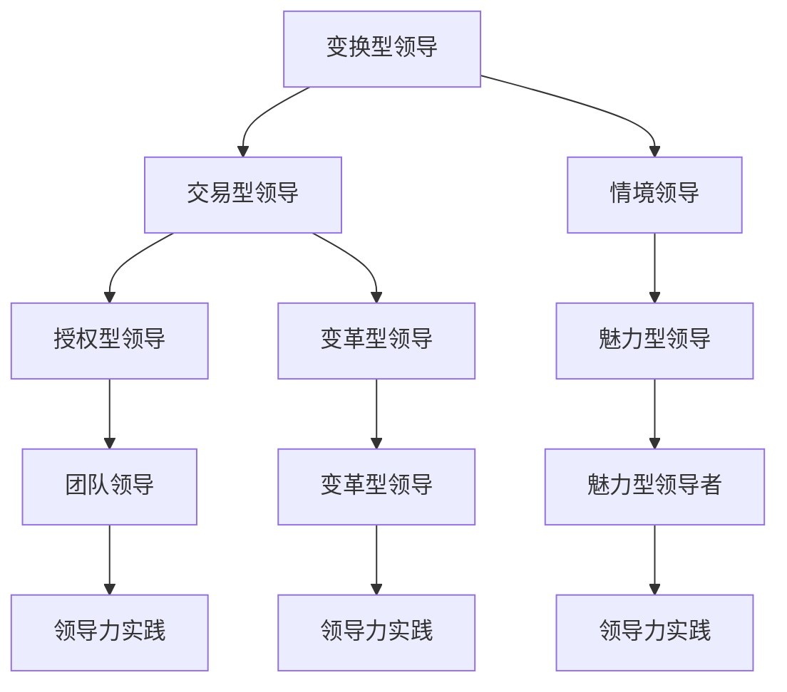

                 


## 领导力与危机公关：维护团队与企业形象

### 关键词
- 领导力
- 危机公关
- 团队建设
- 企业形象管理
- 案例分析
- 实战技巧

### 摘要
本文旨在深入探讨领导力与危机公关在维护团队和企业形象中的关键作用。通过详细的章节内容，我们将分析领导力理论的定义与重要性，危机公关策略的构建与应对，团队建设的沟通与冲突管理，以及企业形象管理的方法与挑战。同时，通过成功的案例分析、实战技巧的分享，以及未来展望，提供一系列可操作的方法和策略，以帮助企业领导者有效应对各种挑战。

### 第1章 领导力理论

#### 1.1 领导力的定义与重要性

**1.1.1 领导力的定义**

领导力是一种能力，涉及激励、引导和影响他人共同实现目标。它不仅仅关乎权力和控制，更重要的是关于影响和领导他人，使他们愿意追随和共同努力。

**1.1.2 领导力的重要性**

领导力对企业的发展和成功至关重要。优秀的领导者能够激发团队的潜力，提升工作效率，增强企业的竞争力。此外，领导力还直接影响企业的文化、员工满意度和企业形象。

#### 1.2 领导力模型与类型

**1.2.1 领导力模型**

领导力模型是理解领导行为和风格的重要工具。常见的领导力模型包括变换型领导、交易型领导、情境领导等。每种模型都有其独特的特点和应用场景。

**1.2.2 领导力类型**

领导力类型反映了领导者如何行使权力和影响他人。根据不同的标准，领导力类型可以划分为授权型领导、变革型领导、魅力型领导等。

#### 1.3 领导力发展与实践

**1.3.1 领导力发展**

领导力发展涉及个人能力的提升和职业生涯的成长。通过培训、学习、实践和反思，领导者可以不断提升自己的领导能力。

**1.3.2 领导力实践**

领导力实践强调在实际工作中运用领导技能和知识。有效的领导力实践包括明确目标、激励团队、有效沟通、决策制定等。

### Mermaid 流程图：领导力模型关系架构



### 第2章 危机公关策略

#### 2.1 危机公关的概念与原则

**2.1.1 危机公关的定义**

危机公关是指企业在面临突发危机时，采取的一系列公关措施来维护企业形象和品牌价值。

**2.1.2 危机公关的原则**

危机公关应遵循透明、及时、主动、负责的原则。透明意味着信息应公开透明，及时意味着危机处理应迅速反应，主动意味着应主动采取措施，负责意味着应对负责任地面对和处理问题。

#### 2.2 危机公关流程与应对策略

**2.2.1 危机公关流程**

危机公关流程包括危机识别、危机评估、危机应对和危机处理。每个步骤都需要精确执行，以确保危机得到有效控制。

**2.2.2 危机应对策略**

危机应对策略包括以下几种：

- 沉默策略：在危机初期，选择不发表言论，以避免进一步扩大影响。
- 坦诚策略：面对危机，坦诚地承认错误，积极解决问题。
- 转移策略：将公众注意力转移到其他积极话题上，以减轻危机影响。
- 原因策略：寻找危机背后的原因，并采取措施解决问题。

### Python 源代码：危机公关策略执行

```python
class CrisisManagement:
    def __init__(self, crisis_type):
        self.crisis_type = crisis_type
        self.response_strategy = None

    def identify_crisis(self):
        print("Identifying the crisis...")

    def assess_crisis(self):
        print("Assessing the crisis...")

    def implement_strategy(self, strategy):
        self.response_strategy = strategy
        print(f"Implementing {strategy} strategy...")

    def handle_crisis(self):
        print("Handling the crisis...")

# 示例使用
crisis = CrisisManagement("Product Recall")
crisis.identify_crisis()
crisis.assess_crisis()
crisis.implement_strategy("坦诚策略")
crisis.handle_crisis()
```

### 第3章 团队建设

#### 3.1 团队角色的认知与合作

**3.1.1 团队角色认知**

团队角色认知是团队建设的基础。每个团队成员都有其特定的角色和职责，理解这些角色有助于提高团队协作效率。

**3.1.2 团队合作**

团队合作是团队成功的关键。通过有效沟通和协同工作，团队成员可以实现共同目标。

#### 3.2 团队沟通与冲突管理

**3.2.1 团队沟通**

团队沟通是团队协作的桥梁。良好的沟通能够减少误解，提高决策质量。

**3.2.2 冲突管理**

冲突管理是团队建设的重要组成部分。有效的冲突管理能够解决团队内部的分歧，增强团队的凝聚力。

#### 3.3 团队激励与文化建设

**3.3.1 团队激励**

团队激励能够提高员工的工作积极性和创造力。激励方法包括奖励、认可和培训等。

**3.3.2 企业文化建设**

企业文化是团队的灵魂。通过建立积极向上的企业文化，能够增强团队凝聚力和归属感。

### Mermaid 流程图：团队建设流程

```mermaid
graph TD
    A[团队角色认知] --> B[团队合作]
    B --> C[团队沟通]
    C --> D[冲突管理]
    D --> E[团队激励]
    E --> F[企业文化建

