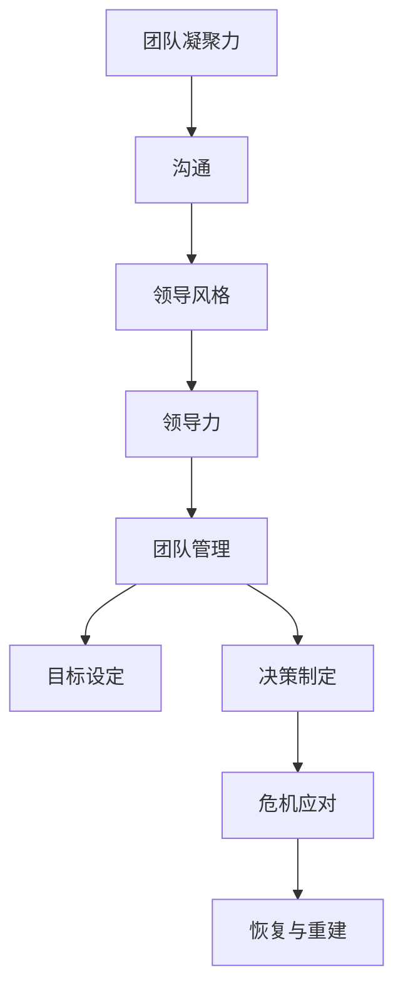

                 

### 引言：领导力与危机应对的重要性

领导力与危机应对是现代企业管理中不可或缺的两个核心概念。在竞争激烈的商业环境中，一个团队的成功往往取决于领导者的智慧和危机应对能力。领导力不仅仅是引导团队达成目标，更是在面对逆境时，能够激励团队成员、保持团队凝聚力和找到解决问题的方法。危机应对则是企业持续发展的保障，能够在危机发生时迅速响应，降低损失，甚至转危为安。

**背景介绍**：领导力起源于古希腊，最初是指对军队的指挥和管理能力。随着社会的发展，领导力逐渐扩展到政治、商业等各个领域。危机应对则是在自然灾害、市场波动、技术变革等不确定性因素下，企业必须具备的应对能力。

**核心概念与联系**：领导力与危机应对之间的关系可以用一个Mermaid流程图来表示：



在这个流程图中，领导力贯穿于团队管理的各个方面，包括目标设定、决策制定和危机应对。危机应对又是领导力的一个重要体现，决定了团队在逆境中的生存能力和恢复能力。

**核心算法原理讲解**：领导力与危机应对的关系可以抽象为一个多层递归模型，其中每一层代表不同的管理层次和策略。以下是一个简化的Python代码示例，用于描述这个模型：

```python
def leadership_crises_model(team_size, crisis_level):
    """
    领导力与危机应对模型，计算团队在危机情况下的表现。
    
    :param team_size: 团队大小
    :param crisis_level: 危机级别
    :return: 团队表现评分
    """
    # 基础表现
    base_performance = team_size * (1 - crisis_level / 10)
    
    # 领导力加成
    leadership_bonus = 1 + (crisis_level // 5) * 0.1
    
    # 危机应对策略优化
    crisis_response = 1 + (crisis_level // 5) * 0.2
    
    # 最终表现
    final_performance = base_performance * leadership_bonus * crisis_response
    
    return final_performance
```

在这个模型中，`base_performance`代表了团队在正常情况下的表现，`leadership_bonus`表示领导力对团队表现的加成，`crisis_response`表示危机应对策略对团队表现的优化。通过这个模型，我们可以定量地分析领导力和危机应对对团队表现的影响。

**数学模型和公式**：为了更深入地理解领导力与危机应对的关系，我们可以引入一个线性回归模型来量化这种影响。以下是一个简化的线性回归公式：

$$
\text{performance} = \beta_0 + \beta_1 \times \text{leadership_score} + \beta_2 \times \text{crisis_management_score}
$$

其中，`performance`表示团队在危机中的表现评分，`leadership_score`表示领导力评分，`crisis_management_score`表示危机应对评分。`beta_0`、`beta_1`和`beta_2`是模型参数，可以通过历史数据训练得到。

**项目实战**：在实际项目中，领导力和危机应对的应用至关重要。以下是一个简化的案例：

**开发环境搭建**：使用Python和Mermaid工具来搭建一个领导力与危机应对的分析平台。

```bash
pip install python-mermaid
```

**源代码详细实现和代码解读**：

```python
import mermaid

# Mermaid流程图
flowchart TD
    A[危机发生] --> B[领导力响应]
    B --> C{制定策略}
    C -->|成功| D[恢复运营]
    C -->|失败| E[评估损失]
    E --> F[改进策略]

# 生成Mermaid图表
mermaid_code = mermaid.mermaidify("graph TD\nA[危机发生] --> B[领导力响应]\nB --> C{制定策略}\nC -->|成功| D[恢复运营]\nC -->|失败| E[评估损失]\nE --> F[改进策略]")
print(mermaid_code)
```

**代码应用解读与分析**：在这个代码中，我们使用了Mermaid库来生成一个流程图，描述了领导力在危机管理中的关键步骤。这个流程图可以帮助团队理解和应用危机应对策略。

**实际案例分析和详细讲解剖析**：以下是一个真实的案例：

**案例**：一家科技公司面临市场竞争加剧和产品更新迭代快的挑战。

**分析**：
1. **领导力响应**：领导者迅速组织团队，分析市场变化，制定应对策略。
2. **制定策略**：团队开发了新的产品线，并通过市场营销策略提高了市场份额。
3. **恢复运营**：新产品线取得了成功，公司运营恢复正常。

**剖析**：在这个案例中，领导者的快速响应和有效的策略制定是关键。领导力帮助团队在危机中找到了出路，实现了恢复和重建。

**项目小结**：通过这个案例，我们可以看到领导力和危机应对在实际项目中的重要性。领导者的智慧和决策能力是团队在逆境中取得成功的关键。

**最佳实践 tips**：
1. **持续培训**：定期对团队成员进行领导力和危机应对培训，提高团队的应对能力。
2. **数据驱动**：使用数据分析和预测模型来识别潜在危机，提前制定应对策略。

**小结**：领导力与危机应对是企业持续发展的重要保障。通过有效的领导力和危机应对策略，团队可以在逆境中保持稳定，甚至取得成功。

**注意事项**：
1. **沟通**：领导者在危机中必须保持与团队的沟通，确保信息的透明和及时。
2. **灵活**：危机应对策略需要灵活调整，以适应不断变化的环境。

**拓展阅读**：
1. 《危机管理：如何在逆境中保持竞争优势》
2. 《领导力：从优秀到卓越》

---

**文章标题**：领导力与危机应对：在逆境中凝聚团队

**文章关键词**：领导力，危机应对，团队建设，逆境管理，决策制定，数据分析，流程图

**文章摘要**：本文探讨了领导力与危机应对在现代企业管理中的重要性。通过背景介绍、核心概念与联系、算法原理讲解、数学模型和实际案例，本文详细阐述了如何在实际项目中应用领导力和危机应对策略，以帮助团队在逆境中保持稳定和取得成功。文章还提供了最佳实践 tips 和拓展阅读，以帮助读者深入理解这一主题。

