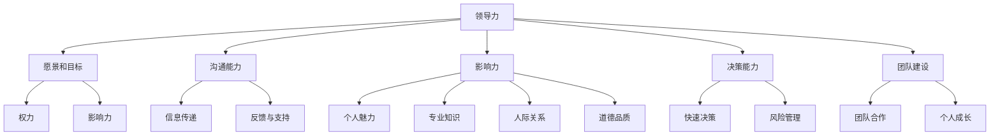
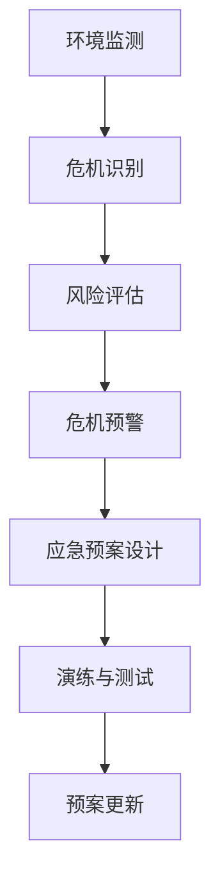
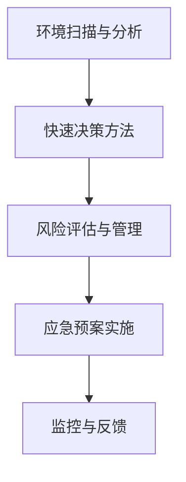
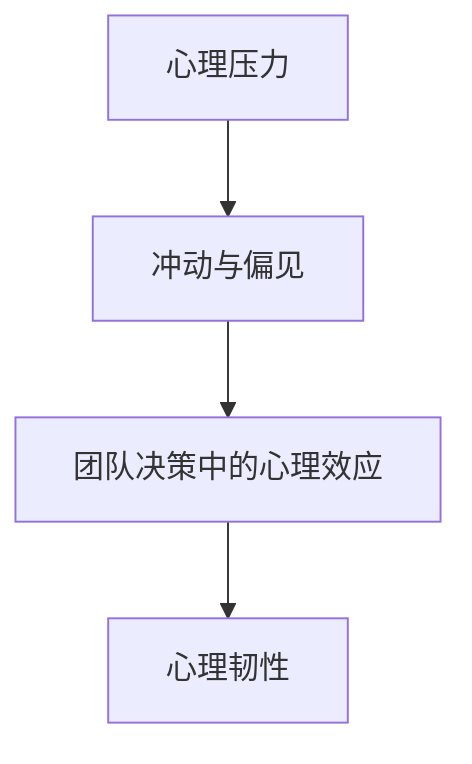
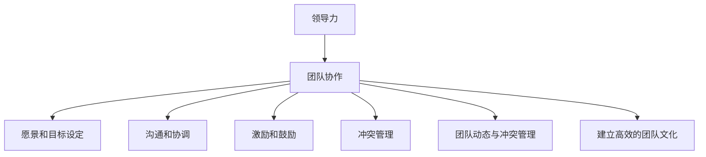

                 

### 1. 引言

在现代信息社会，技术发展和市场变化的速度迅猛，企业面临的不确定性因素日益增多。在这种情况下，领导力在危机应对中的作用变得尤为重要。危机可能来自外部环境的剧烈变化，也可能是内部管理中的失误，但无论其来源如何，危机管理的效率往往直接影响到企业的生存和发展。

领导力不仅仅是管理职位者的专利，它是每个人在团队中发挥影响力、解决问题的能力。危机应对能力是领导力的重要组成部分，它包括快速反应和决策的能力。在本文中，我们将探讨领导力在危机应对中的核心作用，特别是如何通过快速反应和决策来有效应对危机。

本文结构如下：首先，我们将概述领导力的基本概念和其在危机应对中的重要性。接着，我们会深入讨论危机管理的原则，包括危机识别、评估和应对策略。然后，我们将探讨快速反应策略的必要性，以及如何通过环境扫描、快速决策方法和风险评估来提高应对效率。接下来，我们将分析决策过程中的心理因素，包括心理压力、偏见和团队决策中的心理效应。此外，我们还将讨论领导力与团队协作的关系，包括团队动态管理、冲突管理和团队文化的建设。为了更直观地展示这些概念之间的关系，我们将使用Mermaid流程图进行说明。随后，我们将通过具体案例分析来展示危机应对的策略和决策过程。最后，我们将提供实践指南，帮助读者将理论应用到实际工作中，并总结全文的核心要点。

### 2. 领导力概述

领导力是一个复杂而多维的概念，它不仅仅关乎权力和指挥，更是一种影响力、引领力和赋能力的综合体现。在危机应对中，领导力的重要性尤为突出。有效的领导力可以帮助团队在危机中保持冷静，迅速采取行动，并做出明智的决策。

#### 2.1 定义领导力

领导力可以定义为通过影响他人来实现共同目标的能力。根据不同的领导理论，领导力可以被分为多种类型，如变革型领导、交易型领导、服务型领导等。每种领导风格都有其独特的特点和适用场景。

- **变革型领导**：注重激励和激发团队成员的潜能，通过变革和创新推动团队向前发展。这种领导风格在危机应对中尤为重要，因为它能够迅速调动团队的积极性和创造力，共同应对挑战。

- **交易型领导**：侧重于通过明确的目标和绩效奖励来激励团队成员。这种风格在危机管理中也有其作用，尤其是在需要迅速采取行动、完成任务的情况下。

- **服务型领导**：强调领导者为团队成员提供服务和支持，以提高团队整体效能。在危机应对中，服务型领导能够帮助团队建立信任和合作，共同克服困难。

#### 2.2 领导力的核心要素

领导力的核心要素包括以下几个方面：

- **愿景和目标**：领导者需要具备清晰的愿景和目标，并能有效地传达给团队成员，使团队朝着共同的目标努力。

- **沟通能力**：有效的沟通是领导力的关键，领导者需要能够清晰、准确地表达自己的想法，并倾听团队成员的意见和建议。

- **影响力**：领导力不仅仅依赖于职位和权力，更重要的是领导者能够通过影响力和魅力来引导和激励团队成员。

- **决策能力**：在危机情况下，领导者的决策能力尤为重要。快速而明智的决策能够帮助团队迅速应对危机，降低损失。

- **团队建设**：领导者需要关注团队的整体发展和成员的个体需求，通过团队建设活动增强团队的凝聚力和合作精神。

#### 2.3 领导力与权力、影响力的关系

领导力与权力、影响力密切相关，但又有所不同。权力通常来自于职位和制度，而影响力则更多地依赖于领导者的个人品质和魅力。

- **权力**：权力是领导力的基础，它为领导者提供了指导和影响团队成员的能力。但是，权力并不是领导力的全部，权力过大可能会导致滥用和腐败。

- **影响力**：影响力是领导力的核心，它来源于领导者的魅力、专业知识、人际关系和道德品质。影响力比权力更为持久，能够帮助领导者更好地实现领导目标。

#### 2.4 Mermaid流程图：领导力构成要素关系

为了更好地理解领导力的构成要素之间的关系，我们可以使用Mermaid流程图进行展示：

通过上述流程图，我们可以清晰地看到领导力的各个构成要素及其相互关系，这有助于我们在实际工作中更好地理解和应用领导力。

### 3. 危机管理的原则

在领导力中，危机管理是一个关键的领域，它涉及到对危机的识别、评估和应对。有效的危机管理能够帮助组织在危机发生时迅速采取行动，降低损失，并尽快恢复正常运营。

#### 3.1 危机管理的基本原则

危机管理的基本原则包括以下几个关键步骤：

- **预防为主**：预防是危机管理的首要原则。通过建立预防机制，可以减少危机发生的概率和影响。

- **快速响应**：危机管理的关键在于快速响应。在危机发生时，领导者需要迅速采取行动，防止危机扩大。

- **资源整合**：危机管理需要整合内部和外部资源，包括人力资源、财务资源和技术资源。

- **信息透明**：在危机管理过程中，信息的透明和及时性至关重要。及时、准确的信息可以帮助团队做出明智的决策。

- **持续改进**：危机管理不是一次性的行动，而是一个持续的过程。通过不断总结经验教训，可以不断改进危机应对策略。

#### 3.2 危机识别与评估

危机识别与评估是危机管理的第一步，它包括以下几个关键环节：

- **环境监测**：通过监测外部环境和内部运营，及时发现潜在危机的迹象。

- **风险评估**：对识别出的危机进行风险评估，确定其可能的影响程度和发生概率。

- **危机预警**：建立预警机制，对高风险危机进行提前预警，为决策提供依据。

#### 3.3 应急预案制定

应急预案是危机管理的重要组成部分，它包括以下几个方面：

- **预案设计**：根据风险评估的结果，设计详细的应急预案，明确应对步骤和责任人。

- **演练与测试**：定期进行应急演练和测试，确保应急预案的有效性和可行性。

- **预案更新**：随着环境的变化，应急预案需要不断更新和完善。

#### 3.4 Mermaid流程图：危机管理流程

为了更直观地展示危机管理的流程，我们可以使用Mermaid流程图：

通过上述流程图，我们可以清晰地看到危机管理的各个步骤及其相互关系。在实际操作中，领导者需要根据具体情况进行灵活调整，以确保危机管理的有效性。

### 4. 快速反应策略

在危机管理中，快速反应策略至关重要。它能够帮助组织在危机发生时迅速采取行动，降低危机的影响和损失。快速反应策略包括环境扫描、快速决策方法和风险评估等方面。

#### 4.1 快速反应的必要性

快速反应的必要性主要体现在以下几个方面：

- **降低损失**：在危机发生时，时间就是金钱。快速反应可以迅速遏制危机的蔓延，减少损失。

- **保持优势**：在激烈的市场竞争中，快速反应可以帮助组织抢占先机，保持竞争优势。

- **稳定情绪**：快速反应能够帮助团队成员保持冷静和信心，避免恐慌和混乱。

#### 4.2 环境扫描与分析

环境扫描与分析是快速反应策略的关键环节。它包括以下几个方面：

- **数据收集**：收集与危机相关的各种数据，包括内部数据和外部数据。

- **趋势分析**：对收集到的数据进行分析，识别出危机的发展趋势和潜在影响。

- **信息共享**：及时将分析结果分享给团队成员，确保大家都能了解危机的现状和应对策略。

#### 4.3 快速决策方法

快速决策方法是快速反应策略的核心。在危机管理中，领导者需要具备快速而明智的决策能力。以下是几种常见的快速决策方法：

- **头脑风暴**：通过集思广益，迅速找到解决问题的方案。

- **优先级排序**：对问题进行优先级排序，确保资源集中在最关键的环节。

- **果断行动**：在危机情况下，领导者需要果断行动，迅速采取有效措施。

#### 4.4 风险评估与管理

风险评估与管理是快速反应策略的重要部分。通过风险评估，领导者可以确定危机的影响程度和应对方案的有效性。以下是几种常见的风险评估方法：

- **定性分析**：通过专家评估和情景分析，对危机的影响进行定性分析。

- **定量分析**：使用数学模型和统计方法，对危机的影响进行定量分析。

- **应急预案评估**：对现有应急预案的可行性和有效性进行评估，确保其能够在危机中发挥作用。

#### 4.5 Mermaid流程图：快速反应策略

为了更直观地展示快速反应策略的各个步骤，我们可以使用Mermaid流程图：

通过上述流程图，我们可以清晰地看到快速反应策略的各个步骤及其相互关系。在实际操作中，领导者需要根据具体情况进行灵活调整，以确保快速反应策略的有效性。

### 5. 决策过程中的心理因素

在危机管理中，决策过程不仅仅涉及技术和策略，还受到多种心理因素的影响。了解这些心理因素，可以帮助领导者更好地应对危机，做出明智的决策。

#### 5.1 决策中的心理压力

决策中的心理压力是领导者面临的一个主要挑战。心理压力可能来自以下几个方面：

- **不确定性**：危机通常伴随着高度的不确定性，这使得领导者难以做出明确和稳定的决策。

- **责任感**：领导者需要承担决策的责任，这种责任感可能会增加他们的心理压力。

- **时间限制**：危机管理往往需要在紧迫的时间内做出决策，时间压力会加剧心理压力。

- **团队期望**：团队成员对领导者的期望也会增加心理压力，领导者需要满足团队的期望，同时做出明智的决策。

#### 5.2 冲动与偏见

在决策过程中，领导者可能会受到冲动和偏见的影响。以下是一些常见的冲动和偏见：

- **过度自信**：领导者可能会过于自信，忽视风险和潜在的问题，从而做出不合理的决策。

- **确认偏见**：领导者倾向于接受符合自己观点的信息，忽视或质疑与自己观点不一致的信息。

- **群体思维**：在团队决策中，群体思维可能会导致领导者随从多数意见，而不是基于最佳的信息和逻辑。

- **情感偏见**：情感因素可能会影响领导者的决策，例如情绪激动或沮丧可能会影响他们的判断力。

#### 5.3 团队决策中的心理效应

团队决策中的心理效应会影响决策的质量和效率。以下是一些常见的心理效应：

- **锚定效应**：团队中的第一个意见可能会对后续的讨论产生显著影响，这种现象称为锚定效应。

- **代表性效应**：团队成员可能会根据以往的经验或案例来评估当前的问题，这种评估方法称为代表性效应。

- **情感一致性**：团队成员可能会基于情感一致而非理性分析来做出决策。

#### 5.4 心理韧性与危机应对

心理韧性是指个体在逆境中保持心理平衡和有效应对的能力。对于领导者来说，心理韧性是危机应对的重要保障。以下是一些提高心理韧性的方法：

- **自我反思**：领导者需要定期进行自我反思，识别和解决自己的情绪问题。

- **积极心态**：保持积极的心态，相信自己和团队能够克服困难。

- **心理支持**：建立有效的心理支持系统，包括团队支持和个人心理咨询。

- **适应性训练**：通过模拟危机情景进行适应性训练，提高应对危机的能力。

#### 5.5 Mermaid流程图：心理因素在决策中的影响

为了更直观地展示心理因素在决策中的影响，我们可以使用Mermaid流程图：

通过上述流程图，我们可以清晰地看到心理因素在决策过程中的各个环节及其相互关系。在实际工作中，领导者需要意识到这些心理因素的存在，并采取相应的措施来应对和缓解它们。

### 6. 领导力与团队协作

在危机应对中，团队协作至关重要。领导者不仅需要具备优秀的个人能力，还需要能够有效地引导和激励团队，确保团队成员在危机中协同作战，共同应对挑战。

#### 6.1 团队协作的重要性

团队协作的重要性体现在以下几个方面：

- **资源共享**：团队成员可以共享资源，包括信息、技能和经验，从而提高整体效率。

- **互补能力**：每个团队成员都有自己的专长和技能，团队协作可以实现能力互补，提高解决问题的能力。

- **共同目标**：团队协作有助于团队成员共同设定目标，并为实现这些目标共同努力。

- **情感支持**：在危机中，团队成员之间的情感支持可以帮助他们保持冷静和信心，共同面对挑战。

#### 6.2 领导力在团队协作中的作用

领导力在团队协作中发挥着关键作用，具体体现在以下几个方面：

- **愿景和目标设定**：领导者需要为团队设定清晰的愿景和目标，确保团队成员明确自己的方向和任务。

- **沟通和协调**：领导者需要建立有效的沟通机制，确保团队成员之间能够顺畅地交流和协调。

- **激励和鼓励**：领导者需要激励和鼓励团队成员，提高他们的积极性和创造力。

- **冲突管理**：在团队协作中，冲突是不可避免的。领导者需要具备冲突管理能力，及时解决冲突，确保团队和谐。

#### 6.3 团队动态与冲突管理

团队动态是指团队成员在合作过程中表现出的行为和互动。以下是一些常见的团队动态和冲突管理策略：

- **角色识别**：领导者需要识别团队成员的角色，确保每个成员都明确自己的职责和任务。

- **团队建设**：定期进行团队建设活动，增强团队成员之间的信任和合作。

- **冲突解决**：领导者需要建立有效的冲突解决机制，鼓励团队成员通过对话和妥协解决冲突。

- **透明沟通**：保持沟通的透明性，确保团队成员能够了解团队的进展和问题。

#### 6.4 建立高效的团队文化

建立高效的团队文化是团队协作成功的关键。以下是一些建立高效团队文化的策略：

- **共同价值观**：明确团队的价值观和使命，确保团队成员都认同并遵循这些价值观。

- **相互尊重**：建立相互尊重的团队氛围，鼓励团队成员之间的尊重和理解。

- **持续学习**：鼓励团队成员不断学习和成长，提高团队的整体能力。

- **积极反馈**：建立积极的反馈机制，鼓励团队成员互相鼓励和支持。

#### 6.5 Mermaid流程图：领导力与团队协作关系

为了更直观地展示领导力与团队协作的关系，我们可以使用Mermaid流程图：

通过上述流程图，我们可以清晰地看到领导力在团队协作中的各个环节及其相互关系。在实际工作中，领导者需要灵活运用这些策略，确保团队在危机中能够高效协作。

### 7. 案例分析

为了更好地理解领导力在危机应对中的具体应用，我们通过以下几个典型案例来进行分析和讨论。

#### 案例一：2008年金融危机

2008年金融危机是现代金融史上最严重的一次危机，对全球金融体系和经济产生了深远的影响。在这场危机中，各国的央行行长和财政部长发挥了关键作用，展现了领导力在危机应对中的重要性。

- **领导力应用**：各国领导人通过紧急会议、协调政策和决策，采取了多种措施来稳定金融市场，包括注入流动性、扩大财政刺激计划等。

- **决策过程**：领导者在决策过程中，需要快速响应、协调多方利益和制定有效的应对策略。

- **结果评估**：虽然2008年金融危机的后果依然持续，但通过领导力的有效应用，危机的影响在一定程度上得到了缓解。

#### 案例二：亚马逊雨林大火

2019年，亚马逊雨林发生严重的大火，引起了全球关注。作为全球最大的热带雨林，亚马逊雨林的保护具有重要意义。

- **领导力应用**：各国政府和国际组织在应对亚马逊雨林大火中发挥了关键作用，包括提供灭火支持、资金援助和政策制定。

- **决策过程**：领导者需要快速做出决策，协调资源，制定灭火和恢复计划。

- **结果评估**：虽然亚马逊雨林大火的灭火工作取得了一定进展，但问题仍然存在，需要持续关注和应对。

#### 案例三：COVID-19疫情

COVID-19疫情是近年来全球面临的重大危机，各国政府和社会各界都在积极应对。

- **领导力应用**：各国领导人通过制定疫情防控政策、提供医疗资源和支持、协调国际合作，展现了领导力在危机应对中的重要性。

- **决策过程**：领导者需要在短时间内做出多项决策，包括隔离政策、疫苗接种计划、经济刺激措施等。

- **结果评估**：尽管疫情对全球经济和社会造成了严重影响，但通过领导力的有效应用，许多国家在一定程度上控制了疫情的蔓延。

通过上述案例分析，我们可以看到领导力在危机应对中的关键作用。领导者需要具备快速反应、决策和协调能力，确保危机管理的有效性。同时，领导者还需要具备心理韧性，以应对危机中的心理压力和挑战。

### 8. 实践与行动指南

基于前述关于领导力与危机应对的深入讨论，以下是一些实用的行动指南，帮助读者在实际工作中应用这些理念。

#### 8.1 建立危机应对团队

- **组建多职能团队**：建立一个包括不同职能部门和专家的危机应对团队，确保在危机发生时，能够迅速响应和协调行动。
- **制定应急预案**：根据风险评估结果，制定详细的应急预案，明确各级职责和应对步骤。
- **定期演练**：定期进行危机演练和模拟测试，确保团队成员熟悉应急预案，提高应对能力。

#### 8.2 提高快速反应能力

- **环境监测**：建立实时监测机制，及时收集和分析与危机相关的信息，提前预警。
- **快速决策**：采用头脑风暴、优先级排序等方法，确保在危机发生时，能够迅速做出明智的决策。
- **风险管理**：对危机进行风险评估，制定相应的应对措施，降低风险。

#### 8.3 培养心理韧性

- **自我反思**：定期进行自我反思，识别和解决情绪问题，提高心理韧性。
- **积极心态**：保持积极的心态，相信自己和团队能够克服困难，共同应对挑战。
- **心理支持**：建立有效的心理支持系统，包括团队支持和心理咨询，帮助团队成员在危机中保持心理平衡。

#### 8.4 建立高效的团队协作

- **共同价值观**：明确团队的共同价值观和使命，确保团队成员认同并遵循。
- **相互尊重**：建立相互尊重的团队氛围，鼓励团队成员之间的尊重和理解。
- **持续学习**：鼓励团队成员不断学习和成长，提高团队的整体能力。

#### 8.5 总结与反思

- **定期回顾**：在危机应对后，及时总结经验和教训，反思不足之处，为下一次危机应对做好准备。
- **持续改进**：根据总结的经验教训，不断改进危机应对策略和流程，提高危机管理的有效性。

通过以上行动指南，读者可以在实际工作中更好地应用领导力，提高危机应对能力，确保团队在危机中能够迅速、有效地应对。

### 附录：相关资源与工具

本文涉及的内容涵盖了领导力与危机应对的多个方面，以下是一些相关资源与工具，以供进一步学习和应用：

#### 书籍推荐

1. **《领导力：策略与实践》（Leadership: Strategy and Practice）**：由詹姆斯·M·库泽斯和巴里·波斯纳合著，详细介绍了领导力的理论和实践方法。

2. **《危机管理：应对不确定性的艺术》（Crisis Management: Concepts and Cases）**：由理查德·菲利普斯和乔纳森·汉森合著，提供了丰富的危机管理案例和分析。

3. **《快速决策：在不确定性中做出明智选择》（Fast Decision-Making: Making Smart Choices in Uncertainty）**：由托马斯·H·宾厄姆和南希·J·宾厄姆合著，探讨了快速决策的策略和技巧。

#### 网络资源

1. **世界经济论坛（World Economic Forum）**：提供了关于全球危机管理的最新研究和报告，包括气候危机、经济危机等方面的内容。

2. **哈佛商业评论（Harvard Business Review）**：发布了大量关于领导力和危机应对的文章，提供了丰富的案例分析和实践指导。

3. **国家危机管理协会（National Association for Crisis Management）**：提供了危机管理的培训资源和最佳实践指南。

#### 工具和软件

1. **CRISP-DM**：一种数据挖掘流程模型，可用于危机管理中的数据分析和决策支持。

2. **SWOT分析**：一种常用的战略规划工具，可用于危机管理中的风险评估和策略制定。

3. **项目管理软件**：如Trello、Asana等，可用于团队协作和任务管理，提高危机应对的效率。

通过以上资源和工具，读者可以进一步深化对领导力和危机应对的理解，并在实际工作中进行应用和实践。

