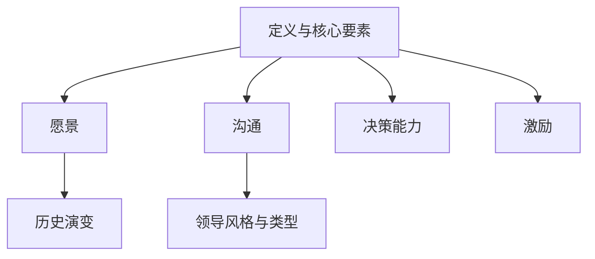

                 

# 领导力与危机应对：快速反应与决策的能力

## 关键词
- 领导力
- 危机管理
- 快速反应
- 决策能力
- 算法原理
- 数学模型
- 实战案例

## 摘要
本文深入探讨了领导力在危机应对中的重要性，特别是快速反应与决策能力。文章首先介绍了领导力的基本概念和核心要素，接着阐述了危机管理的理论基础和快速反应技巧。随后，文章分析了决策过程中的科学方法，包括数学模型和公式，并通过伪代码详细阐述了核心算法原理。最后，文章通过实战案例，展示了快速反应与决策在实际项目中的应用，为读者提供了宝贵的实践经验和启示。

## 引言
在当今快速变化和高度不确定性的商业环境中，领导力与危机应对能力显得尤为重要。领导者不仅需要具备传统意义上的管理能力，还需要在面临突发危机时能够迅速做出有效决策，以保护组织的利益和员工的安全。本文将围绕这一主题，详细探讨领导力与危机应对之间的关系，以及如何提升快速反应与决策的能力。

## 第一部分：领导力基础

### 1.1 领导力的定义与核心要素
领导力是指引导和激励他人共同实现目标的能力。核心要素包括：

- **愿景**：领导者需要有一个清晰的愿景，指引团队前进的方向。
- **沟通**：有效的沟通是领导力的核心，领导者需要能够清晰传达信息，并倾听他人的意见。
- **决策能力**：领导者需要在复杂和不确定性中做出明智的决策。
- **激励**：领导者需要激励团队成员，激发他们的潜能。

### 1.2 领导力的历史演变
领导力理论经历了从古典到现代的转变。古典理论主要关注领导者的个人特质和风格，而现代理论则强调情境因素和领导行为的影响。

### 1.3 领导风格与类型
领导风格可以分为 authoritarian（专制型）、democratic（民主型）和Laissez-faire（放任型）。不同类型的领导风格适用于不同的情境。

### 1.4 领导力的Mermaid流程图

## 第二部分：危机管理的理论基础

### 2.1 危机的定义与分类
危机是指组织面临的一种潜在威胁，可能对组织的生存和发展造成严重影响。危机可以分为自然危机、社会危机和人为危机。

### 2.2 危机管理的原则
危机管理应遵循以下原则：

- **预防为主**：预防措施应优先于应对措施。
- **快速响应**：在危机发生时，快速响应是关键。
- **有效沟通**：与内部员工和外部利益相关者保持有效沟通。
- **资源整合**：整合组织内外部资源，共同应对危机。

### 2.3 快速反应技巧
快速反应技巧包括：

- **信息收集**：及时收集相关信息，了解危机状况。
- **风险评估**：评估危机可能带来的影响和风险。
- **决策制定**：快速制定应对策略和决策。

### 2.4 应急决策模型
应急决策模型包括：

- **情景分析**：分析可能发生的情景和结果。
- **决策制定**：根据情景分析结果，制定应对策略。
- **执行监控**：执行决策，并持续监控效果。

## 第三部分：决策的科学方法

### 3.1 决策理论概述
决策理论包括：

- **理性决策模型**：基于最大化收益和最小化风险。
- **有限理性决策模型**：考虑决策者的认知局限。
- **博弈论**：分析决策者之间的互动和策略。

### 3.2 决策过程中的心理因素
决策过程中的心理因素包括：

- **认知偏差**：影响决策的偏见和错误。
- **情绪因素**：情绪对决策的影响。
- **压力因素**：决策过程中面临的压力和挑战。

### 3.3 数学模型与公式
决策模型中常用的数学模型包括：

- **线性规划**：优化线性目标函数。
- **多目标决策**：处理多个相互冲突的目标。
- **博弈论模型**：分析决策者之间的策略互动。

数学模型示例：
$$
\text{Maximize } Z = c^T x
$$

## 第四部分：实战案例分析

### 4.1 企业危机应对案例
案例背景：某企业遭遇网络安全攻击。
案例分析：企业如何通过快速反应和决策，应对网络安全危机。
案例启示：危机应对的关键策略和技巧。

### 4.2 快速反应与决策实战
实战场景设定：项目团队面临时间紧迫和资源有限的挑战。
实战过程记录：团队如何通过快速反应和科学决策，完成项目任务。
实战效果评估：实战过程的效果和反思。

## 附录

### 5. 决策工具与资源
- 决策支持系统：介绍常见的决策支持系统。
- 决策工具推荐：推荐实用的决策工具。
- 相关资源和参考文献：提供进一步学习和研究的资源。

## 结语
领导力与危机应对能力是领导者必须掌握的关键技能。本文通过深入分析领导力的核心要素、危机管理的理论基础和决策的科学方法，为读者提供了系统的指导和实战经验。通过不断学习和实践，领导者可以提升快速反应与决策的能力，为组织的持续发展提供坚实的保障。

### 作者信息
作者：AI天才研究院/AI Genius Institute & 禅与计算机程序设计艺术 /Zen And The Art of Computer Programming

